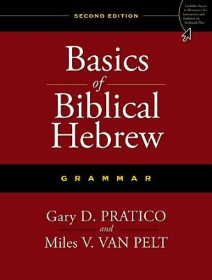

# Preface: The philosophy of this book and course  {-}

## What is the format/structure of Hebrew GRAMMAR Quest? {-}

>Learning Hebrew Grammar, the Holy Language way, is a lot like taking a tour to Israel

To get the most of of a tour, there are stages of preparation^[Stiles, Wayne, “How to prepare for a Holy Land Tour” (https://waynestiles.com/how-to-prepare-for-a-holy-land-tour/)]:

1. Practical Preparation
2. Physical Preparation
3. Spiritual Preparation

Read the next few sections to see how we apply these principles to learning Hebrew grammar.

## _Practical_ Preparation {-}

Before a big trip, you need to know the basics.  Geography, what type of current and outlets are used in Israel, and you have to be ready for the cultural differences.  You might call this "getting the lay of the land".  

>In each lesson of Hebrew Grammar Quest, we will give you the lay of the Hebrew Grammar land

| Israel      | Grammar |
| :-----------: | :-----------: |
|Overview of Geography | Overview of Grammar |
| Different Electrical Outlets      |   Don't use a seghol-shaped plug in a tsere-shaped outlet!   |
| Modest Dress   |  If the rules say you need to be covered with a Qamets, don't show up wearing nothing but a pathach!^[These are vowels we will study in Lesson 2]  |

Each lesson in this book/course will provide a high-level summary of the concepts taught in "Basics of Biblical Hebrew", by Gary Pratico, PhD, and Miles Van Pelt, PhD.^[More specifically, we have made extensive use of the many resources that have been developed to accompany this textbook; most notably, the vast amount of materials published by John Beckman, PhD, copyright under the Creative Commons "Share Alike" license.]

## _Physical_ Preparation: Anki Aerobics and Quest Quizzes {-}

Israel is a rocky, hilly place.  For maximum benefit, travelers must be ready for a lot of walking.  Additionally, for most of us, Israel is close to halfway around the globe away from home.  After such a long flight, we are unlikely to completely avoid jet lag, but we can take steps to minimize the effects and work through it as quickly as possible.

> In Hebrew GRAMMAR Quest, we will get into Hebrew Health by using Anki Most of your class time will be spent in Anki –this is where the majority of your learning will take place

> Learning an ancient language also comes with a concept similar to jet lag called "The Fog" - Hebrew GRAMMAR quest is designed to help you work through the fog.

| Israel      | Grammar |
| ----------- | ----------- |
| Get in shape      |  Anki software - Gym equipment for your brain!   |
| Prepare for Jet Lag   | ^[By Ilias81 - Own work, Public Domain, https://commons.wikimedia.org/w/index.php?curid=1651258] "The Fog"   |

### Get in Hebrew shape! {-}

* **Anki** is your gym and cardio equipment for Hebrew Health^[See Appendix A for a deeper discussion on Anki]

* Just like working out is not easy and you don’t always see quick results, don’t expect Anki to be easy or expect to breeze through it

> Most of your class time will be spent in Anki –this is where the majority of your learning will take place

*(I know we already said that, but it bears repeating!)*

* Some lessons will have additional worksheets to reinforce concepts

### Prepare for “The Fog” {-}

Jet lag is similar to a phenomenon Dr. Bill Mounce calls "the fog.'

* Many times things won’t make sense until a lesson or two later

* A strategy suggested by Dr. Mounce is to "look back at your previous victories to assure you of your progres"s^[https://medium.com/@ellingburg/surviving-the-fog-dcb3f148ffa1]

* Anki has structured reviews to help you keep working through your grammar jet lag

* Periodically, there will be **Quest Quizzes** in the online course
    * Periodic checkpoints for you to assess your progress
        * Are you OK to continue?
        * Do you need to review some more before going on?
    * The quizzes are scored for your assessment, but no grades are "recorded" -  
    * In fact, no grades are given for the course.

## _Spiritual_ Preparation {-}

A trip to Israel is not like any other "vacation" - it's a spiritual journey. If all you do see some cool sites and take some pictures, you would have missed out on a tremendous opportunity to meet Yeshua in His special Land.

>Hebrew GRAMMAR Quest is a spiritual journey!

*Pray and be open to what Yeshua may be teaching you*

We will be reading a lot of Scripture!

* Ruth Pursuits - learning grammar concepts while learning Ruth 1
* Verse Translation in Anki

View each activity as an act of worship!

## Typical Lesson {-}

1. **Practical Preparation: Overview of Lesson key points** (in this book)

2. **Physical: Anki Aerobics** (using Anki software)

3. **Spiritual: Ruth Pursuit** (in this book or in the online course)

4. **Quest Quiz** and **worksheets** (in the online course) 

As of 11/1/2020, the online course is accessible through Google Classroom - you will need a free Google account.^[The access code for the course is available to financial supporters at holylanguage.com ]

## Let’s get Started! {-}

