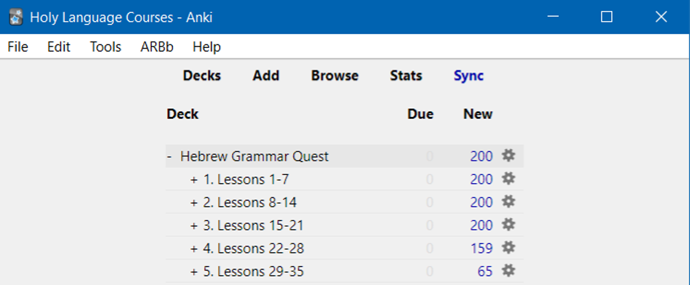

# Preface: The philosophy of this book and course  {- #preface}

```{r, out.width = "500px", fig.align='center'}
include_graphics("images/torah_scroll.jpg")
```

>Learning Hebrew Grammar, the Holy Language way, is a lot like taking a tour to Israel

To get the most of of a tour, there are three stages of preparation [@stiles2013wsa]:

1. Practical Preparation
2. Physical Preparation
3. Spiritual Preparation

We believe the same three principles of preparation apply to learing Hebrew the Holy Language way.  

## _Practical_ Preparation {-}

>In each lesson of Hebrew Grammar Quest, we will give you the lay of the Hebrew Grammar land

Before a big trip, you need to know the basics.  For example, you need to know some basic geography: what happened where. This way you aren't totally lost when you arrive at a site and have no idea why it is significant.  Since we all have electronics, you also need to know what type of electrical current and outlets are used in Israel.  There are also some cultural differences, such as a more formal dress code for "holy sites" than we might be used to at home.  You might call this "getting the lay of the land". 


<!-- | Israel      | Grammar | -->
<!-- | :-----------: | :-----------: | -->
<!-- |Overview of Geography | Overview of Grammar | -->
<!-- | Different Electrical Outlets      |   Don't use a seghol-shaped plug in a tsere-shaped outlet!   | -->
<!-- | Modest Dress   |  If the rules say you need to be covered with a Qamets, don't show up wearing nothing but a pathach!^[These are vowels we will study in Lesson 2]  | -->


For _Practical Preparation_, we will give you the seven most significant things you need to know about the lesson.  You might call these our learning objectives.  

Most importantly, our goal is to keep this discussion at a high-level.  We believe that you will learn best not from reading it in a book or watching a video, but you will learn best by doing.  

This is where _physical preparation_ comes in.
<!-- We have a special subcategory called "Like A Robot  `r fa("robot")` -->

<!-- * Dr. Van Pelt, one of the authors of Basics of Biblical Hebrew, says in his lectures that, while the textbook tries to keep rote memorization to a minimum, there are just certain things that students will have to have a robotic-like, automatic recall -->
<!-- * So when you see this icon, it means you must know the concept "like a robot" - specifically, you should have the concept memorized before continuing to the next lesson.  Anki will help with this. -->

<!-- The lessons are inspired by the book, "Basics of Biblical Hebrew", by Gary Pratico, PhD, and Miles Van Pelt, PhD.^[More specifically, we have made extensive use of the many resources that have been developed to accompany this textbook; most notably, the vast amount of materials published by John Beckman, PhD, copyright under the Creative Commons "Share Alike" license.] -->

```{r, out.width = "500px", fig.align='center'}
include_graphics("images/BBH_cover.png")
```

## _Physical_ Preparation: Anki Aerobics {-}

### Get into Hebrew Health {-}

> In Hebrew GRAMMAR Quest, we will get into Hebrew Health by using Anki

Israel is a rocky, hilly place and many of the best sites require some walking.  Those who hope to passively see the country from a bus window but who could have done more had they done some exercising befhorehand, are going to miss out. For maximum benefit, travelers must be ready for a lot of walking. 

Similarly, if you watched Lesson 1 of Hebrew Quest (and if you haven't you should!  It's free on Youtube), you know that the Holy Language Learning Philosophy is that of active, not passive, learning. 

Most of your class time will be spent not in reading this book or watching lectures. In Hebrew GRAMMAR Quest, your **TRUE** learning will take place during what we call "ACTIVities."  

* The majority of your learning time will be spent in a free flashcard program called Anki.  Please see [About Anki](#Anki) for additional information on Anki if you are not familiar with it.
    * **Anki** is your gym and cardio equipment for Hebrew Health
    * Just like working out is not easy and you don’t always see quick results, don’t expect Anki to be easy or expect to breeze through it
    * Just like physical exercise, if you stick with it, you will see the rewards over time
* In addition to Anki, some lessons will have worksheets to reinforce concepts


### Prepare for "The Fog" {-}

> Learning an ancient language also comes with a concept similar to jet lag called "The Fog" - Hebrew GRAMMAR quest is designed to help you work through the fog.

For most of us, Israel is close to halfway around the globe away from home.  After such a long flight, we are unlikely to completely avoid jet lag, but we can take steps to minimize the effects and work through it as quickly as possible.

<!-- | Israel      | Grammar | -->
<!-- | ----------- | ----------- | -->
<!-- | Get in shape      |  Anki software - Gym equipment for your brain!   | -->
<!-- | Prepare for Jet Lag   | ^[By Ilias81 - Own work, Public Domain, https://commons.wikimedia.org/w/index.php?curid=1651258] "The Fog"   | -->


Jet lag is similar to a phenomenon we can encounter when we undertake a study of a new language. Dr. Bill Mounce calls "the fog.'

* Many times things won’t make sense until a lesson or two later
* A strategy suggested by Dr. Mounce is to "look back at your previous victories to assure you of your progres"s^[https://medium.com/@ellingburg/surviving-the-fog-dcb3f148ffa1]
* Anki has structured reviews to help you keep working through your grammar jet lag

* Periodically, there will be **Quest Quizzes** in the online course
    * Periodic checkpoints for you to assess your progress
        * -Are you OK to continue?_
        * _Do you need to review some more before going on?_ 
            * If you do, that's perfectly ok 
            * It's all part of working through "the fog".
    * The quizzes are scored for your assessment, but no grades are "recorded" -  
    * In fact, no grades are given for the course.


## _Spiritual_ Preparation {-}

>Hebrew GRAMMAR Quest is a spiritual journey!

A trip to Israel is not like any other "vacation" - it's a spiritual journey. If all you do see some cool sites and take some pictures, you would have missed out on a tremendous opportunity to meet Yeshua in His special Land.


*Pray and be open to what Yeshua may be teaching you*

We will be reading a lot of Scripture!

* Ruth Pursuits - learning grammar concepts while learning Ruth 1
* Anki Study Verses - you will read and begin to translate passages in Anki

View each ACTIVity as an act of worship!

## Typical Lesson {-}

1. **Practical Preparation** - Seven learning objectives from each lesson

2. **Physical Preparation**
    1. Anki Aerobics - This is where your primary vocabulary and grammar learning will occur
    2. Worksheets - opportunities for additional reinforcement (selected lessons only)
    2. Quest Quiz - This is your opportunity for a learning check to help you battle through the fog

3. **Spiritual Preparation** - 
    1. Ruth Pursuit - a quest activity where you will identify grammar concepts in Ruth chapter 1 
    2. Anki Study Verses - Verse comprehension and translation


## Let’s get Started! {-}


