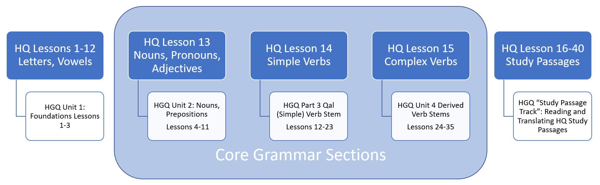

# About This Course {-}

* [Why is Holy Language Institute offering a Hebrew grammar course?](#motivation)
* [What makes our course distinct?](#our_course)
* [How does this grammar course relate to _Hebrew Quest_?](#hgq_and_hq)
* [What if I haven't finished _Hebrew Quest_?](#finish_hq)


## Why a Hebrew Grammar course {- #motivation}

If you are familiar with our ministry, you know our flagship course ***Hebrew Quest***, which introduces our students to Yeshua and our Jewish Bible.

***Hebrew Quest*** was designed to get students into the Hebrew text as quickly as possible, with minimal focus on learning rules. For many of our students, this approach is quite successful; but, we also noticed other students began to drop off between lessons 12 and 16, after the lessons on the Aleph-Bet. For some students, these lessons were too much Hebrew grammar too fast, and for others, it was not enough Hebrew grammar.

As we searched for a resource to recommend to these students, we noticed that they tended to fall into one of two camps:

1. <u>A workbook or a series of videos that are entirely self-paced/self-directed</u> 
    * Sometimes these are too easy, and we tend not to learn very much
    * Additionally, with this format, there is no way for a student to get feedback on progress
    
2. <u>Academic/Seminary level textbooks and courses</u>
    * These materials are incredibly rigorous with copious amounts of reading, rote memorization of paradigms, lectures and exams
    * The pace is usually fast, and the stress level is high, focusing on due dates and grades.<small>^[<small>For example, in a seminary course, the 36 lessons in <u>Basics of Biblical Hebrew</u> are usually completed in 16 weeks.</small>]</small>.
    * The textbooks generally are much more detailed and advanced than most of our students need (or would enjoy)<small>^[<small>For example, there is usually an emphasis on writing Hebrew and conducting English-to-Hebrew translations.  While these may be important skills to become fluent in Hebrew, one does not need these skills to read and understand the Bible.</small>]</small>
   
Additionally, with either option, our students would incur additional fees to purchase these materials.

Many of the resources we researched are top-notch.  Depending on a student's goals, we would not hesitate to recommend them.  It's just that they were not quite what we were seeking for our students.

<div align="right">_(continued)_</div>

## Why Our Course is Distinct {- #our_course}

Our goals for a Hebrew grammar course are the following:

* Academically challenging, but with a low-stress level
* Primary emphasis on understanding God's Word, using grammar rules, paradigms, and memorization as a means to achieve this goal.  The "final exam" should be whether you can understand the Bible, not whether you can conjugate a Niphal verb.
* Self-paced for independent learning but with mechanisms to provide feedback, encouragement, and ways to celebrate students' accomplishments in the course
* Aligns with our [Holy Language Learning Philosophy](https://holylanguage.com/learning-philosophy.php): emphasize active forms of learning over copious amounts of textbook reading and long lectures
* Compliments (not replaces) and integrates with _Hebrew Quest_
* Inexpensive and straightforward to develop, deliver, and maintain
* Free of charge for our students
* Most importantly, the course must be Yeshua-centered that approaches learning Hebrew grammar as a spiritual as well as an academic endeavor (which is also a big part of our Learning Philosophy)

We have talked a bit about our Holy Language Learning Philosophy.  Our belief is you learn best by doing.  Izzy discusses this is greater detail in the clip below from **Hebrew Quest** Lesson 1:

<div class="container">
<iframe class="responsive-iframe" src="https://www.youtube.com/embed/Ex9mBMAqWhI?start=2823" frameborder="0"></iframe>
</div>


## Relationship to _Hebrew Quest_ {- #hgq_and_hq}

One way to think of Hebrew GRAMMAR Quest is "Hebrew Quest: Extended Edition"!

Suppose you were to take a hypothetical microscope and inspect Lessons 13-15 of _Hebrew Quest_. These are the lessons where Izzy reviews Nouns, Pronouns, Verbs and so forth.  Under that microscope, <u>Hebrew GRAMMAR Quest</u> is what you would see. 

```{r, out.width = "800pt", fig.align='center'}


``` 

* Hebrew GRAMMAR Quest will start with a brief review of the Aleph-bet and the vowels we learned in _Hebrew Quest_ Lessons 1-12
* Then we begin our deep dive into core grammar topics touched upon in _Hebrew Quest_ Lessons 13-15
* Additionally, starting with Hebrew GRAMMAR Quest Lesson 12, Students can elect to complete a "_Hebrew Quest_ Study Passage Track"
    * This will incorporate the Proverbs study and the Bible reading sections from _Hebrew Quest_
    * Students will read through the passage and compose a translation
    * They will then watch Izzy's _Hebrew Quest_ teaching video explaining the passage

## Completion of _Hebrew Quest_ is NOT a Prerequisite! {- #finish_hq}

If you _have_ finished _Hebrew Quest_, Hebrew GRAMMAR Quest might be a logical next step.  

On the other hand, maybe you started _Hebrew Quest_ but hit some roadblocks.  In that case, Hebrew GRAMMAR Quest can provide you with important underlying grammatical concepts so, eventually, you can return to _Hebrew Quest_ and finish up.  We're going to help you with this goal. In the second half of this grammar course, we will incorporate several of the [Study Passage](https://holylanguage.com/ot-readings.html) sections of _Hebrew Quest_.  

::: {.box .map}
If you are interested in learning some of Hebrew's inner workings, you’re in the right place!
:::

Additional questions regarding _Hebrew Quest_ and Hebrew GRAMMAR Quest:

* [Do I need to complete _Hebrew Quest_ before I start Hebrew GRAMMAR Quest?](#complete_hq_first) Quick answer: NO!
* [When I complete this course, should I go back and finish _Hebrew Quest_?](#need_to_finish_hq) Quick answer:: YES!
*  [I haven't started either course.  Which should I do first?](#which_first) Quick Answer: 
    1. Complete _Hebrew Quest_ Lessons 1-15 (don't worry about whether you fully absorb the grammar material in Lessons 13-15)
    2. Hop over to Hebrew GRAMMAR Quest and complete the full course, including the _Hebrew Quest_ Study Passage track, if possible
    3. When you finish here, return to complete _Hebrew Quest_
    
We have FAQs on other topics of interest in our Appendix.

::: {.box .map}
Let's get started on our Hebrew GRAMMAR Quest!
:::
