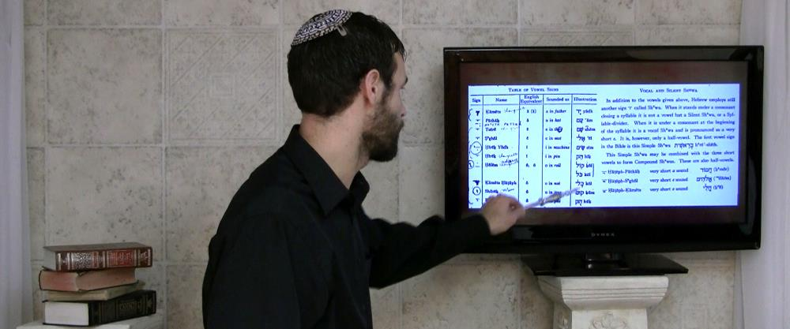

# (PART\*) Introduction {-}

```{r, out.width = "300pt", fig.align='center'}


``` 

# Motivation for building this course {- #motivation}

If you are familiar with our ministry, you know our flagship course ***Hebrew Quest***, which introduces our students to the Jewishness of our Messiah and our Bible.

***Hebrew Quest*** was designed to get students into the Hebrew text as quickly as possible, with minimal focus on learning rules. For many of our students, this approach is quite successful. 

We noticed other students began to drop off between lessons 12 and 16<small>^[<small>These are the "bridge" lessons in between the Aleph-Bet (1-11) and the study passages (17-40), where Izzy introduced Hebrew grammar.</small>]</small>. Feedback from these students indicated they were getting "stuck" on grammar concepts.

As we searched for external Biblical Hebrew grammar resources to recommend to our students, we noticed that they tended to fall into one of two camps:

1. <u>A workbook or a series of videos that are entirely self-paced/self-directed</u>. 
    * There may be some exercises, but generally tend to not be rigorous from an academic standpoint.
    * Additionally, with this format, there is no way for a student to get feedback on progress.
    
2. <u>Academic/Seminary level textbooks and courses</u>. 
    * These materials are __extremely__ rigorous with copious amounts of reading, rote memorization of paradigms, and in the case of courses, lectures and exams
    * The textbooks generally are much more detailed and advanced than most of our students need (or would enjoy).
    * The pace of these courses is usually fast, and the stress level is high, focusing on due dates and grades.

Additionally, materials from both categories would have required significant additional fees from our students.

Although many of the resources we researched are top-notch, they were not quite what we were seeking for our students.


(continued)

## Grammar course wishlist {- #our_course}

---

So what _were_ we seeking?

* In terms of content and rigor, the course would be academically challenging, but it would still be enjoyable with a low-stress level.
* The course would be self-paced for independent learning but provide feedback<small>^[<small>At its core, a grade is simply a feedback mechanism.  A grade tells us how well we know a given topic. Then problem comes when we focus on the grade more than the feedback. In Hebrew GRAMMAR Quest, the `Quest Quizzes` are scored so you can know how you did, but we do not give any grades for the course. We also have `Equipment Checks` which are quick self-assessments to determine whether you are ready to continue to the next lesson.</small>]</small>. and encouragement.
* The course must align with our [Holy Language Learning Philosophy](https://holylanguage.com/learning-philosophy.php): emphasize active forms of learning, not tons of reading and long lectures (which are passive learning components).
* From a technological standpoint, the course must be inexpensive and straightforward to deliver and maintain, while at the same time being high-quality and visually pleasant.
* The course should be easy to use (and if at all possible, free) for our students.
* Most importantly, the course must be Yeshua-centered that approaches learning Hebrew grammar as a spiritual as well as an academic endeavor (which is also a big part of our Learning Philosophy).

We couldn't find a course like this...so we BUILT it ourselves!

### Welcome to Hebrew GRAMMAR Quest - Experience Biblical Hebrew Grammar, the Holy Language Way! {-}

