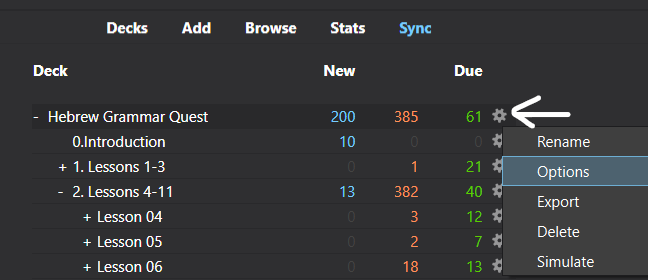
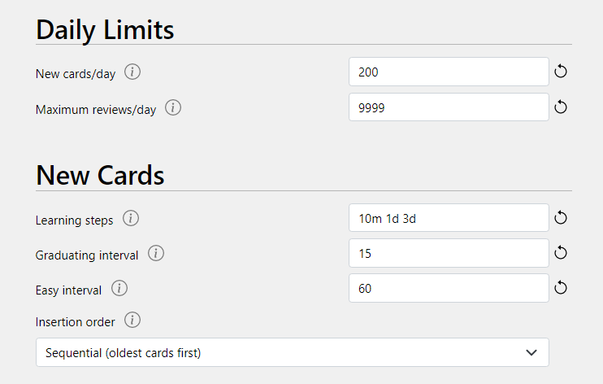
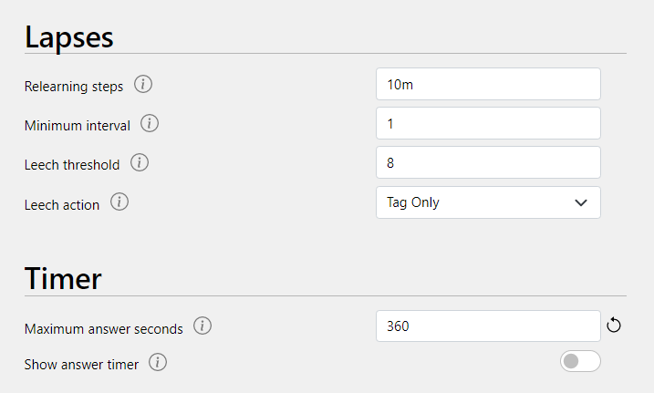
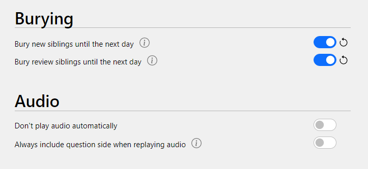
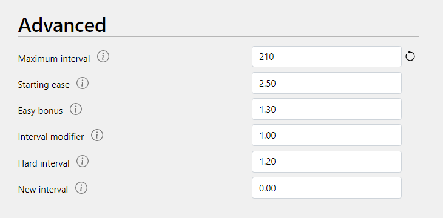
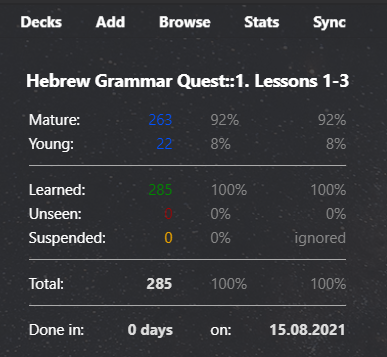

# Getting Started (IMPORTANT!) {-}

::: {.infobox .sound}
<figure> <audio id="myAudio" controls controlsList="nodownload" 
src="./images/00.10getstarted.m4a"> 
Your browser does not support the <code>audio</code> element.</audio><button onclick="x25()" type="button">2.5x</button><button onclick="x2()" type="button">2x</button><button onclick="x15()" type="button">1.5x</button><button onclick="x1()" type="button">1x</button><button onclick="x075()" type="button">.75x</button><button onclick="x05()" type="button">.5x</button><script>
var x = document.getElementById("myAudio");
function x05() { 
    x.playbackRate = 0.5;
    x.play();}
function x075() { 
    x.playbackRate = 0.75;
    x.play();} 
function x1() { 
    x.playbackRate = 1;
     x.play();}
function x15() { 
    x.playbackRate = 1.5;
     x.play();} 
function x2() { 
    x.playbackRate = 2;
     x.play();} 
function x25() { 
    x.playbackRate = 2.5;
     x.play(); } 
</script></figure>
:::


::: {.box .stop}
You may be tempted to skip over this section so you can get right into Lesson 1.  RESIST this urge!
:::

* If you were going on a strenuous hike, at some point you would have to make sure you had the right shoes!
* Consider this section as your trip to the store to get the right equipment _before_ you begin your quest!

### Getting Started Step-by-step {-}

The table below shows the steps necessary to get properly fitted before you begin your quest.  Getting set-up should take about 10 or 15 minutes.

::: {.box .caution}
Failure to follow these steps could lead to Anki frustration!

Please do these steps from a desktop computer (not a mobile device) for best results.
:::


| Step | Comments | How-to Video link
| :-- | :-- | :--
|1. If needed, get a Google Account [here](https://accounts.google.com/signup/v2/webcreateaccount?continue=https%3A%2F%2Fwww.google.com%2F&hl=en&dsh=S-1425209384%3A1610207553422339&gmb=exp&biz=false&flowName=GlifWebSignIn&flowEntry=SignUp){target="_blank"} | You will need a Google account to complete many of the activities in this course.  Alternatively, you may wish to create an additional account exclusively for this course. Creating a Google account is free. | [YouTube: Step 1](https://youtu.be/MvDQTpuFKgI){target="_blank"}
|2. Copy the [course checklist](https://docs.google.com/spreadsheets/d/1t0C7JlygyUqgF_aQWbhq7h3s_VDn0VuvISJn5mp-LdE/copy){target="_blank"} to your personal Google Drive Folder | This is for you to keep track of your progress in this course. Be sure to update it as you complete each lesson, which will help you stay on track to earn `Badges`, Unit completion `Certificates`, and ultimately, `Graduation`! | [YouTube: Step 2](https://youtu.be/Aby8Th13hHU){target="_blank"}
3.  Download and install the [free Ezra SIL font](https://software.sil.org/downloads/r/ezra/EzraSIL-2.51.zip ){target="_blank"}. Note: Chromebook users may not be able to install custom fonts.  Make sure "Google Noto (Serif Hebrew)" is installed. | This enables Hebrew font in Anki cards. After downloading, extract the zip file to a location of your choice. Then double-click on `SILEOT.ttf`, which should give you the option to install the font. | [YouTube: Step 3](https://youtu.be/Dt-DVA0ekxQ){target="_blank"}
4. [Sign up for a free Ankiweb account here](https://ankiweb.net/account/register){target="_blank"} | This allows you to backup and sync your data to the cloud and mobile devices | [YouTube: Step 4](https://youtu.be/lBKbLFw3Ouo){target="_blank"}
5. [Download and Install the Anki Program (Mac/PC/Linux/Android)](https://apps.ankiweb.net/){target="_blank"}.  | On the website, click the `Download` button, then select the tab with your operating system.  | [YouTube: Step 5](https://youtu.be/J0R0bvSkz7g){target="_blank"}^[The Anki version numbers displayed in the video will change with the passage of time.  Download the current version of the Anki desktop program on their website]
6. [Download the Hebrew GRAMMAR Quest Anki Decks](#decks){target="_blank"} | These decks are the backbone of the course.  Research shows using a tool like `Anki` is far more effective than reading or exams alone. After downloading, double-click to load into Anki| [YouTube: Step 6 (Preferred Method)](https://youtu.be/fsYuzGcLuV8){target="_blank"} or [Alternate Mobile-only Method](https://youtu.be/Q1Iz1LYgIOM){target="_blank"}^[Since recording the video, we have relocated our HGQ Anki deck download links to a [dedicated page](#decks)]
7. Tweak a few Anki settings (see next section) | Anki is driven by an algorithm that we can customize for maximum effectiveness | [YouTube: Step 7](https://youtu.be/4fwPZUEOKuY){target="_blank"}
8.  Sync to Ankiweb - in Anki, click on `Sync` (enter Ankiweb credentials) - `upload to Ankiweb` if asked. | Sync creates a version of the deck in the cloud | Click the `Sync` button as shown in other videos
9. As desired, download the Anki app to your phone or tablet: [Android app](https://play.google.com/store/apps/details?id=com.ichi2.anki){target="_blank"} or [iOS](https://itunes.apple.com/us/app/ankimobile-flashcards/id373493387?mt=8&ign-mpt=uo%3D4){target="_blank"} | See footnote #1. A [web version](https://ankiweb.net/account/login){target="_blank"} is also available for mobile devices | [YouTube: Step 9 Anki mobile app](https://youtu.be/bfeTC4RZ-Vc){target="_blank"}
10. To use an `Anki` _mobile_ app, click on `Sync` and click `download from Ankiweb` | Should you go back and forth between mobile and desktop, make sure you `Sync` each time | [YouTube: Step 10](https://youtu.be/rfKKzKX-CNg){target="_blank"}
11. Know that you can [get help or give feedback](#get_help) |
12. As desired, read the [About this Course FAQs](#about_this_course) in the appendix |
13. Optional: you might want a three-ring binder to store your course materials | The course features several handwritten worksheets and activities which you will print out and complete.  A few of the worksheets are designed to be completed over a series of lessons.  You may wish to save the hard-copies in a binder |


## Customize Anki Settings {- #anki_settings}

::: {.infobox .sound}
<figure> Note: this is the audio from the step 7 "how to" video on the previous page: <audio id="myAudio" controls
src="./images/00.11ankisettings.mp3"> 
Your browser does not support the <code>audio</code> element.</audio><button onclick="x25()" type="button">2.5x</button><button onclick="x2()" type="button">2x</button><button onclick="x15()" type="button">1.5x</button><button onclick="x1()" type="button">1x</button><button onclick="x075()" type="button">.75x</button><button onclick="x05()" type="button">.5x</button><script>
var x = document.getElementById("myAudio");
function x05() { 
    x.playbackRate = 0.5;
    x.play();}
function x075() { 
    x.playbackRate = 0.75;
    x.play();} 
function x1() { 
    x.playbackRate = 1;
     x.play();}
function x15() { 
    x.playbackRate = 1.5;
     x.play();} 
function x2() { 
    x.playbackRate = 2;
     x.play();} 
function x25() { 
    x.playbackRate = 2.5;
     x.play(); } 
</script></figure>

:::

::: {.box .info}
These settings will optimize your Anki experience.  

The Windows platform is shown, but Mac/Linux/ChromeOS/mobile process to change settings is very similar.

[YouTube video showing these steps](https://youtu.be/4fwPZUEOKuY){target="_blank"}
:::

1. Change `USER1` Name to your name
    1. In Anki, click `File`, then `Switch Profile`  
    2. Select `User 1`, then `Rename` and type your name
2. To change learning settings, click the gear button next to "Hebrew Grammar Quest", then click `Options`
```{r, out.width = "80%", fig.align='center', fig.cap="Anki Deck Options"}

```
3. Make sure your settings match the images below:

### Daily limits and New Cards {-}

```{r, out.width = "80%", fig.align='center', fig.cap="Daily Limits and New Cards"}

```

Notes^[NEW CARDS/DAY: You are welcome to enter any number you wish, but lower numbers mean it will take longer to get through the entire deck.  `200` is recommended, but this does not mean you have to do 200 new cards in one day or the next day you will have 400 new cards.  You will never have more new cards than the number entered here. INSERTION ORDER: If you find `Sequential` is too easy, you might try to switch to `Random`.]


### Lapses and Timer {-}

Note^[`Show answer timer` is optional.]

```{r, out.width = "80%", fig.align='center', fig.cap="Lapses and Timer"}

```


### Burying and Audio {-}

```{r, out.width = "80%", fig.align='center', fig.cap="Burying and Audio"}

```


Notes^[Cards that have multiple answers are called `siblings`.  Turning the sibling settings on is more challenging; leaving these off is less challenging.  We recommend to start with these turned on.]

### Advanced {-}
 
```{r, out.width = "80%", fig.align='center', fig.cap="Advanced"}

```

::: {.box .info}
Anki Add-ons

* Anki has a number of `Add-ons` for the desktop platforms you might find interesting.
* You might check out [Advanced Review Bottom Bar](https://ankiweb.net/shared/info/1136455830)
  * Or `Tools` / `Addons` / `Get Add-ons` / then enter `1136455830`
  * You can tweak the add-on settings in the `ARBb` menu - try `Button style` = `Wide + Background Color`
* Another useful add-on is [More Overview Stats](https://ankiweb.net/shared/info/738807903)
  * This displays your `Young` vs `Mature` cards on the deck's dashboard - see picture ^[1st column is number of cards.  2nd column is percentage of cards.  3rd column is percentage of cards excluding `Suspended` cards (for the `Unit Certificate` your screenshot must reflect 0 suspended cards).]
  * Add-on number: `738807903`
* You will need to restart `Anki` for the add-ons to take effect
:::

```{r, out.width = "80%", fig.align='center', fig.cap="More Overview Stats"}

```

## Hebrew GRAMMAR Quest Checklist {-}

> The Hebrew GRAMMAR Quest Checklist^[The checklist is a Google sheets file that you copied to your personal Drive during the Getting Started set-up.  If you haven't already done so, save a copy of the [course checklist](https://docs.google.com/spreadsheets/d/1t0C7JlygyUqgF_aQWbhq7h3s_VDn0VuvISJn5mp-LdE/copy){target="_blank"} to your personal Google Drive Folder now!] is your coach to help keep you on track to finished the Quest!


The file contains the following tabs:

| Tab | Description | Instructions
| :- | :- | :- 
| Getting Started | Same information as the Getting Started Step-by-step page | Check off each step as you complete it
| 1. Foundations | Contains the activities for Unit I: Lessons 1-3 | Check off each step as you complete it
| 2. Nouns, etc | Checklist for Unit II activities (Lessons 4-11)
| 3. Qal    | Checklist for Unit III activities (Lessons 12-23)
| 4. Derived | Checklist for Unit IV activities (Lessons 23-35)
| Certificate Instructions | The Anki requirements for the `12 Tribes Badges` and the `Unit Completion Certificates` are different | To request your certificate, follow the instructions to upload a screenshot showing all Anki cards are `Mature`
| Ruth 1 Translation | In Unit IV, you will begin to compose your own paraphrase translation of Ruth chapter 1.  You will use the `Ruth Pursuit Translation Worksheet` to assist you. | As you complete each `Ruth Pursuit`, locate each identified word in column C and write your translation in column D.  The answer keys will contain notes and other information, so you may want to make a note of the lesson # in column E and any personal notes in column F.  In column H, there is also the Hebrew text of Ruth 1
| Badges | This is an electronic "sticker book" to collect your `12 Tribes Badges`.  As you finish every two or three lessons, there will be a form to submit for a badge. | When you receive the badge via email, download the badge and copy the image.  Select the applicable square on the Badges tab, and Paste the image.


## Navigating through the "Fog" {-}

Before we get started, we wanted to share this concept of the "Fog."  This is a term coined by Dr. Bill Mounce, author of _Basics of Biblical Greek_.  

> "Fog" describes the feeling that you aren't making any progress in learning a Biblical language when you actually are making TREMENDOUS progress!

Mounce states, "The fog means you will have read a chapter and think you understand it—and perhaps you do—but it will seem foggy. That’s okay. If living in the fog becomes discouraging, look two chapters back and you should understand that chapter clearly. In two more chapters the presently foggy chapter will be clear, assuming you keep studying."

At times, you can expect Foggy conditions on your quest.  Here is an article on the subject you may find encouraging: [Conquering the Fog](./images/00_Fog_Article.pdf){target="_blank"}.  

::: {.box .light}
Navigating the Fog

* Review a chapter, do the activities, then try the `Anki` flashcard work
* If `Anki` is proving difficult, go back and review the chapter then try Anki again
* Take a break and get some fresh air
* If you find you need more detail, you can check out the full-length lectures and the additional quizzes/worksheets provided by Dr. Beckman.  You can find a link to these on the `Lesson Extras` pages at the end of each chapter

:::

