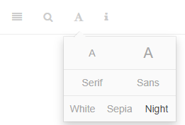
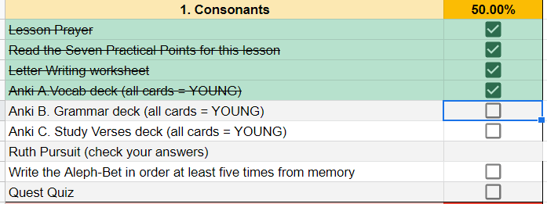
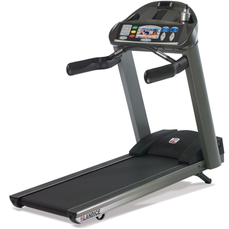
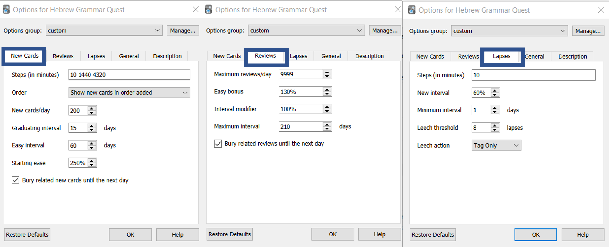

# Getting Started / Getting Help {-}

1. [How do I navigate around this book?](#navigating)
5. [What is in a typical lesson, and how long will it take?](#typical-lesson)
4. [How do I get started?](#get_started)
5. [How do I use Anki?](#anki_help)
5. [Which resources are required versus optional?](#optional_resources)
2. [How to report an issue, error, omission, or improvement opportunity](#report_issue)
3. [How to ask a question if you get stuck](#get_help)

## Navigating this book {- #navigating}

In the upper-left corner of this page, you will see a series of icons.  

```{r, out.width = "300pt", fig.align='center'}


``` 

These do the following tasks:

* the file drawer expands/collapses the sidebar table of contents; you can also click `s`
* the magnifying glass toggles search input; you can also click `f`
* the big `A` allows you to change the font size and theme
* the little `i` shows you available keyboard shortcuts


There are several ways to navigate from page to page within this guidebook:

* Use the left-navigation sidebar (type `s` to reveal/hide)
* Click the left or right arrow on each page to go forward or back
* Use the left or right arrow keys on your keyboard to move forward or back
* Use hyperlinks on selected pages, like this one: [Continue to "A Typical Lesson" section](#features)


## A Typical Lesson {- #typical-lesson}

```{r, out.width = "400pt", fig.align='center'}

```

In this course, you won't just read; you will DO!  This course is going to be jam-packed with activities. Below is what a typical lesson will contain^[We are following the same chapter organization as the textbook <u>Basics of Biblical Hebrew</u>, while extensively leveraging supplemental materials created by Dr. John Beckman, which he has generously made available for free to the Hebrew learning community.  See the [Course Structure](#what_to_expect) and our [Acknowledgments](#acknowledgments) pages for additional information.]:


**Title**|**Description**|**Estimated Minutes**
:-----|:----- | :---
  READING| A general comment about the guidebook: at times, you may feel like information is being shot at you from a firehose.  Often, this is just how it is when learning a new language. The fact is that you may be absorbing more than you think you are.  This is why we emphasize reinforcement of these concepts through activities.  Notice the root word "active" in activities.  You will get introduced to the material via the Lesson Points, but you will LEARN the material through the activities.  
Lesson Itinerary | Introduction and the lesson's learning objectives | <1
Equipment Check|Things you must have in your backpack before proceeding with the next phase of your journey | <1
First Thought |A Bible verse from the lesson in Hebrew, audio from Izzy, and a brief devotional | 5
Lesson Points | The main grammar concepts. Our goal is to give you just enough information to get started in `Anki`.  You can easily identify the Lesson Points as they will be the numbered sections in each lesson. 1.1, 1.2, etc. | 15-45
 ACTIVITIES|
 `Word and Verse Warm-ups`|Starting with Lesson 3, these are brief "stretching" exercises before doing the `Anki` workouts, narrated by Izzy! | 5-10
 `Anki`^[See [appendix](#anki_faq) for more information on Anki if you are not familiar with it.]| This is where the majority of your learning will take place.  There will be four modules to each Anki Lesson: `A. Vocab`, `B. Grammar`, `C. Workbook/Parsing`, and `D. Study Verses` | 60-180 total (Anki is meant to do a little each day as driven by the software's algorithm)
`A. Vocab`|By the end of the course, you will have around 500 Hebrew words memorized
 `B. Grammar`|Here, you will work through the main grammar concepts discussed in the lesson.
 `C. Workbook/Parsing`| Brief Hebrew word activities to reinforce the grammar concepts.  In Unit 3, the focus shifts to what is called "parsing" of verbs.  Verb parsing means identifying the root, stem, person, gender, number, and meaning of a verb.
 `D. Study Verses`| You will begin to translate from Hebrew to English. This component may not be easy at first but stick with it!  Although these verses are similar to the _Hebrew Quest_ Memrise modules, our goal for the `Study Verses` is translation and comprehension, not rote memorization.
`Worksheets`|Additional activities to reinforce learning (selected lessons) | 30-45
`Ruth Pursuit`|Similar to the "bag the letter" activity in the early lessons of  _Hebrew Quest_. You will identify examples of grammar concepts in Ruth Chapter 1 | 15-60
`Quest Quiz`|Self-assessment activity to measure your familiarity with the material for YOU to assess whether you are ready to advance in your quest to the next lesson.  No grades are recorded or granted in this course. There are no quizzes after Lesson 11. | 15-30
`Twelve Tribes Badges`, Unit Completion `Certificates`, and `Graduation`| Fun things to mark and celebrate the completion of various stages of your GRAMMAR Quest | 3-5
TOTAL |Depending on how fast you work:|2.5-6 hours per Lesson

Of course, some lessons will be more involved than others, and each of us works at a different pace. One of the beautiful things about a self-paced class is the speed and due dates are not set by a course syllabus.   With a self-paced class, YOU are in control!

::: {.box .light}
DON'T BE OVERWHELMED!  YOU GOT THIS!

Use the `Course Checklist` to help keep you organized and do a little bit at a time. Instructions for accessing this are on the Quick Start page. If you haven't already downloaded it, you can get it [here](https://docs.google.com/spreadsheets/d/1t0C7JlygyUqgF_aQWbhq7h3s_VDn0VuvISJn5mp-LdE/copy){target="_blank"} 
:::

Also, for those seeking additional translation practice and exposure to the Hebrew Bible, we have an OPTIONAL _Hebrew Quest_ Study Passage Track beginning with Lesson 13.  You will read through the passage, compose a translation, then watch (or re-watch) the _Hebrew Quest_ video where Izzy walks us through the passage.  There is more information on this in the Unit 3 introduction.

Lastly, you might be encouraged by this article on [conquering the Fog](./images/00_Fog_Article.pdf){target="_blank"}.  The "Fog" is a term coined by Dr. Bill Mounce, author of _Basics of Biblical Greek_.  "Fog" describes the feeling that you aren't making any progress in learning a Biblical language when you actually are making TREMENDOUS progress!

## Information Boxes {-}

As you work though the Hebrew GRAMMAR Quest guidebook, you will notice several different information boxes uses to call out various topics.

::: {.infobox .map}
QUEST BOX

* The Lesson Itinerary - learning objectives
* Ruth Pursuit, Hebrew Quest Study Passages, and other "Quest" related topics
:::

::: {.infobox .stop}
STOP BOX

* Equipment Check - concepts from previous lessons you must know before starting the next lesson
* Other "Dont's"
:::

::: {.infobox .light}
LIGHT  BOX

* A critical point not to be missed
* Other "Do's"
* You will often want to MEMORIZE the concepts in a LIGHT box (but note the memory work will be done in Anki)
:::

::: {.infobox .info}
INFO  BOX

Additional information that is good to know
:::

::: {.infobox .caution}
CAUTION  BOX

A potential pitfall, such as a concept that could be easily confused with another
:::

::: {.infobox .sound}
AUDIO BOX

Either the section narration, read by Chris Flanagan, or the "First Thought" Hebrew verse, read by Izzy Avraham.

* Press the play button to start the audio and make sure your device's volume is at a comfortable level
* You can jpress one of the speed buttons to play the audio at that speed (2.5x - 0.5x) 
:::

We also have footnotes^[Citations and parenthetical/non-essential points will be included as footnotes throughout each lesson, if indicated.]

## QUICK START INSTRUCTIONS {.unnumbered #get_started}

These easy steps will get you up and running with the course.  Please do these from a desktop computer for best results.

<!-- update the final anki deck version - current link is PREVIEW -->

| Step | Comments
| :-- | :-- 
|1. Get Google Account [here](https://accounts.google.com/signup/v2/webcreateaccount?continue=https%3A%2F%2Fwww.google.com%2F&hl=en&dsh=S-1425209384%3A1610207553422339&gmb=exp&biz=false&flowName=GlifWebSignIn&flowEntry=SignUp){target="_blank"} | You will need a Google account to complete many of the activities in this course.  Alternatively, you may wish to create an additional account exclusively for this course. Creating a Google account is free.
|2. Download the [course checklist](https://docs.google.com/spreadsheets/d/1t0C7JlygyUqgF_aQWbhq7h3s_VDn0VuvISJn5mp-LdE/copy){target="_blank"} | This is for you to keep track of your progress in this course. Be sure to update it as you complete each lesson, which will help you stay on track to earn `Badges`, Unit completion `Certificates`, and ultimately, `Graduation`!
3.  Download and install the [free Ezra SIL font](https://software.sil.org/downloads/r/ezra/EzraSIL-2.51.zip ){target="_blank"} | This enables Hebrew font in Anki cards. After downloading, extract the zip file to a location of your choice.  Then double-click on `SILEOT.ttf`, which should give you the option to install the font.
4. [Sign up for a free Ankiweb account here](https://ankiweb.net/account/register){target="_blank"} | This allows you to backup and sync your data to the cloud and mobile devices
5. [Download and Install the Anki Program (Mac/PC/Linux)](https://apps.ankiweb.net/){target="_blank"} | You MUST install Anki from a desktop/laptop first
6. [Download the Hebrew GRAMMAR Quest Anki Deck](./images/Hebrew Grammar Quest 1_0.apkg){target="_blank"} | This deck is the backbone of the course.  Research shows using a tool like `Anki` is far more effective than reading or exams alone
7. Change the Anki settings (see next section) | `Anki` is driven by an algorithm that we can customize for maximum effectiveness
8.  Sync to Ankiweb - in Anki, click on `Sync` (enter Ankiweb credentials) - `upload to Ankiweb` if asked. | Syncing creates a version of your deck in the cloud, which case be used to sync with a mobile device or merely as a backup
9. As desired, download the Anki app to your phone or tablet: [Android app](https://play.google.com/store/apps/details?id=com.ichi2.anki){target="_blank"} or [iOS](https://itunes.apple.com/us/app/ankimobile-flashcards/id373493387?mt=8&ign-mpt=uo%3D4){target="_blank"} | While the Android version is free, the iOS version has a one-time fee of $25. Apple users might consider using the [web version](https://ankiweb.net/account/login){target="_blank"} for the first few lessons while you assess whether the cost is justified
10. To use an `Anki` _mobile_ app, click on `Sync` and click `download from Ankiweb` | Should you go back and forth between mobile and desktop, make sure you `Sync` each time and be careful when you select `upload to` or `download from` to make sure your information is flowing in the correct direction
11. Finally, read the `Getting Started/Getting Help` and `About This Course` introductions | You have already started this! These sections contain essential background information to help assure you are oriented to Hebrew GRAMMAR Quest.  If you are not familiar with `Anki`, the `Help with Anki` section (on the next page) is critically important to read.
    
> **Anki NOTE**: Eventually, you can do all work from a mobile device.  _For the initial Anki install, you do need to do these steps from a desktop or laptop_.  The Hebrew GRAMMAR Quest Anki deck can only be imported into the desktop Anki application. 

## Help with Anki {- #anki_help}

```{r, fig.show="hold", out.width = "150pt", fig.align='center'}



```


If one wants to build strength and endurance, it's essential to use the right machines.  Anki is a free^[All platforms are free, except for the iOS app, which costs $25. The developers use the proceeds to fund future development.  Most reviews say the cost is worth it if you have Apple devices and use Anki regularly.] flashcard application that helps you build both Hebrew strength and Hebrew endurance!

::: {.box .info}
As you work through this course, set aside time to review Anki on a DAILY basis
:::

The sections below will help you get started with Anki. There is also an `0. Introduction` section within the Hebrew GRAMMAR Quest Anki deck with additional how-to information.


### Customize Anki Settings {- #anki_settings}

1. Change `USER1` Name 
    1. In Anki, click `File`, then `Switch Profile`  
    2. Select `User 1`, then `Rename` and type your name
1. Change global settings
    1. Click `Tools,` then `Preferences.` On the `Scheduling` tab, check the box that says `Anki 2.1 Scheduler`.
1. On the main page, click the gear wheel to the right of “Hebrew Grammar Quest” and select `Options` ([click to see example](./images/a.anki_settings.png){target="_blank"})
    1. `New Cards`^[ See https://docs.ankiweb.net/#/deck-options?id=new-cards for additional information and the definitions of these terms, `New`, `Review`, and `Lapsed`]
        * `Steps` = 10 1440 4320
        * `New cards/day` = 200
        * `Graduating interval` = 15
        * `Easy interval` = 60
        * `Starting ease` = 250%
        * `Bury related new cards...` = we recommend CHECKED, but this is not mandatory^[Checking this means that cards with two or more questions won't be presented on the same day.  The risk of leaving it unchecked is that you may get Question #2 correct not because you know the answer, but because you just saw the answer when you reviewed Question #1.  Checking the box means you will not see Question #2 on the same day as Question #1.  Thus, checking the box will increase the length of time required to move cards from `Young` to `Mature`, but is the stronger option for learning.]
    2. `Reviews`
        * `Maximum reviews/day` = 9999
        * `Easy bonus` = 130%
        * `Interval modifier` = 100
        * `Maximum interval` = 210
        * `Bury related reviews...` = we recommend CHECKED, but this is not mandatory   
    3. `Lapses`
        * `Steps` = 10
        * `New interval` = 60
        * `Maximum interval` = 1
        * `Leech threshold` = 8
        * `Leech action` = TAG ONLY

Your settings should look like this:
```{r, out.width = "700pt", fig.align='center', fig.cap="Settings"}


```
    
### How do I navigate within Anki? {-}

::: {.box .map}  
* We have created a brief tutorial within our Hebrew GRAMMAR Quest `Anki` deck.  
* This is contained in the `0.Introduction` folder.  
* Click on this deck for an introduction and helpful hints
* When you are finished you may `Suspend` the cards (these are the only cards in the deck you should `suspend`!)

:::

<!-- * Click the +/- buttons to expand/collapse the folders within the Anki deck [(click to see example)](./images/a.anki_hint.gif){target="_blank"} -->
<!--   * To start with Lesson 01 Vocabulary, expand to reveal this deck, click on `Lesson 01 Vocabulary` and click the `STUDY NOW` button -->
<!-- * Many cards have "hints" - click on the `hint` button to reveal [(click to see example)](./images/anki.png){target="_blank"} -->
<!--     * If you needed a hint, be sure to select `Again` on the answer side -->
<!-- * When you are ready to see the answer, click Spacebar, Enter, or the `Show Answer` button -->

### How do I know when to hit the Good button on an Anki card? {-}

We suggest using the following guidelines:

* `Again`
  * Your answer was incorrect, or a mixture of correct and incorrect on a multi-part answer
  * Your answer was correct, but you required a hint
* `Hard` - You otherwise met the requirements for `Good`, but you struggled to produce the correct answer or guessed. 
* `Good`
  * All parts of the answer are correct; no hints
  * For Bible Verses, mark `Good` when:
    * you can read and understand the verse in Hebrew
    * Your translation is roughly similar to the English answer, even if you need to take a few moments to work through the verse
    * Your verb tense is correct (even though we won't study verbs until Unit 3)
    * You do NOT need to have the passage and its meaning memorized to mark `Good`
  * Be patient and honest with yourself.  If you are unsure between `Again` and `Good,` then select `Again.`
* `Easy`
  * We do not recommend selecting `Easy.` 
  * An exception might be when you are confident that you already have the word, rule, or passage memorized


::: {.box .info}
Be patient with yourself.  It may take you _many_ tries in the early going before you can hit `Good.`
:::

### How do I get help with Anki? {-}

::: {.box .info}

* We do have a [help](#report_issue) for to assist you with any issues related to the course, including our `Hebrew Grammar Quest Anki Deck`. 
* Unfortunately, it is beyond our scope to give you a complete tutorial _or offer any technical support with the Anki software or mobile app_.  
* The good news is that there is a LARGE Anki user community across the globe
    * We encourage you to check out the numerous articles and tutorial videos posted by the Anki community
    * Generally, if you type your question or issue in a web search, you will find exactly the answer you are seeking
* The official Anki documentation is available [here](https://docs.ankiweb.net/#/){target="_blank"}.
:::

<!-- deleted anki cards: -->
<!-- Introduction: -->
<!-- front: I want to test English to Hebrew. How can I set the deck to do this? -->
<!-- back: Our primary goal with Hebrew Grammar Quest is to translate from Hebrew to English.   -->

<!-- Most of our students studying Biblical Hebrew are not going to need to translate from English to Hebrew, although that is certainly a worthy pursuit.   -->


<!-- If you would like to add a reverse direction to your vocabularly words (Prompt with English - Answer with Hebrew) this is can be done in Anki. We have added "Note Types" to accomodate this. -->

<!-- Click "Browse" -->
<!-- From the Left Navigation, scroll down to "Vocab Basic Hebrew" -->
<!-- Select the card(s) you wish to change and add the additional options (To change ALL cards click CTRL+A to select all cards) -->
<!-- Click CTRL+SHIFT+M to change the note type to one of the following: -->
<!-- If you want to be tested on both Hebrew-to-English and reverse, English-to-Hebrew, select note type "Vocab Basic Hebrew/English" -->
<!-- If you have added images and want to be tested on Hebrew-to-English, English-to-Hebrew, and Image-to-Hebrew, select note type "Vocab Basic Hebrew/English/Image" -->
<!-- If you have added images and only want to be tested on Hebrew-to-English and Image-to-Hebrew, select note type "Vocab Basic Hebrew/Image" -->
<!-- Just be aware that changing to one of these optional note types, will literally double (or triple if you chose Hebrew/English/Image) the number of vocabularly cards.  If you decide you want to go back to just Hebrew-to-English, repeat steps 1-4 and select Note Type "Vocab Basic Hebrew." -->

<!-- Type ! (exclamation point) to dismiss this card. -->
  
## Course Resources {- #optional_resources}

REQUIRED: 

* Other than being a subscriber to Holy Language Institute, you will not need to purchase or obtain anything for this course (unless you want to)
* You will need a computer with internet access, a free Google account to open and complete documents and exercises, the free Anki desktop software to do the flashcard activities, and a pen or a pencil to complete writing worksheets

OPTIONAL:

Below are additional resources, some of which are free and some paid:

* Free of charge
  * Thanks to his extremely generous reuse license, we have leveraged many of the worksheets and content from [Dr. John Beckman](https://hebrewsyntax.org/bbh2new/){target="_blank"}.  If you want more detail into any lesson, you may wish to refer to his videos and handouts.  Everything on [his site](https://hebrewsyntax.org/bbh2new/){target="_blank"} is free.
  * Dr. Bill Mounce has study guides available for each Chapter of _Basics of Biblical Hebrew_
    * In most cases, these will not add much to the lessons in Hebrew GRAMMAR Quest, but some students might find them valuable
    * For Chapter 1, click [http://hebrew.billmounce.com/BasicsBiblicalHebrew-01.pdf](http://hebrew.billmounce.com/BasicsBiblicalHebrew-01.pdf){target="_blank"}; for other chapters, change the `01` in the URL to the chapter number you are seeking^[Except Chapter 4, which for some reason, is not available.]
* Paid
  * Anki's iOS app requires a one-time purchase through the Apple store of $25.  If you have an iPhone, we believe this is a relatively inexpensive investment in your Hebrew journey, but the decision to purchase is entirely up to you.  You would be able to complete the course without purchase of the app.
  * To further supplement your studies, you may wish to purchase the _Basics of Biblical Hebrew_ textbook or any of the accompanying resources
    * [Basics of Biblical Hebrew Textbook](https://www.amazon.com/gp/product/031053349X/&tag=holylanginst-20)
    * [Basics of Biblical Hebrew Workbook](https://www.amazon.com/gp/product/0310533554/&tag=holylanginst-20)
    * [Basics of Biblical Hebrew Laminated Reference Card](https://www.amazon.com/gp/product/031026295X/&tag=holylanginst-20)
    * We would appreciate it if you would use one of the affiliate links, which allows Holy Language Institute to receive a small commission
  * You might want wait and see how you are doing with Hebrew GRAMMAR Quest through about Lesson 7 or 8 before deciding to purchase the iOS app or any of the books

## Report an Issue {- #report_issue}

Please do not hesitate to report any errors, omissions, or improvement opportunities.  In fact, we'd rather hear about mistakes sooner rather than later! Feedback is anonymous.  

::: {.box .stop}
If you have a specific question about the content or are stuck on a concept, please use the [Get Help](#get_help) question form instead of the `Report an Issue` form.
:::

<div class="containerLet">
<iframe class="responsive-iframe" src="https://docs.google.com/forms/d/e/1FAIpQLSf3obLnGzJQ6d7Rtyy2YXDln3g-kJWCY-4IlRLE_mnFuWv2AQ/viewform?embedded=true" frameborder="0"></iframe>
</div>

[Open form in new window](https://forms.gle/qhBToGubVgmjdFbx6){target="_blank"}

## Ask a question {- #get_help}

While this is a self-paced course with no formal instructor or teaching assistant, we want to provide a way for you to get help and ask a question should you get stuck.

We request that before you submit a question, you read through the lesson a couple of times, then attempt to do the Anki cards for that lesson.  Sometimes by doing this, things will "click" on their own.  If you are still unclear, we are here!

Use the form below to ask a question. Please note, we are staffed by volunteers, so please allow a few days for us to research and get back to you.  

::: {.box .stop}
If you have general feedback or wish to report an issue, please use the [`Report an Issue`](#report_issue) form instead of the `Get Help` form. 
:::

<div class="containerLet">
<iframe class="responsive-iframe" src="https://docs.google.com/forms/d/e/1FAIpQLSdWJc7ri0andmyu70D1USeDRtbsrHLaYLNrs0rvI2qBJx-yEg/viewform?embedded=true" frameborder="0"></iframe>
</div>


[Open form in new window](https://forms.gle/tNsvwrhci3nGkvvV6){target="_blank"}
