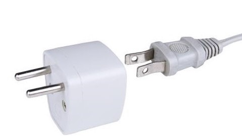
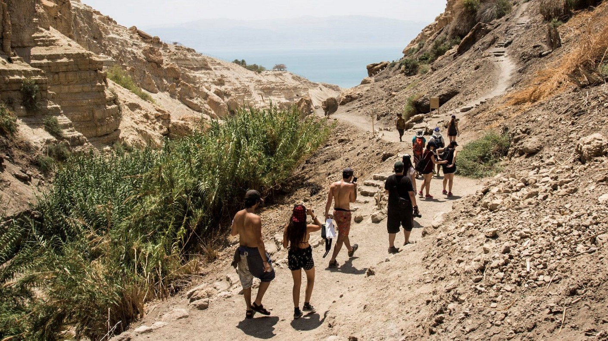

# What to expect {- #what_to_expect}


```{r, out.width = "300pt", fig.align='center'}
include_graphics("images/torah_scroll.jpg")
```

Many Hebrew grammar courses and books treat learning God's Holy Language as if it were just another academic exercise. Listen to a lecture, read a chapter, take a test, and you'll learn Hebrew. 

At Holy Language, we believe that we learn best both by _doing_ and approaching our studies from a spiritual as well as academic standpoints. 

Suppose you watched the original Hebrew Quest videos. In that case, you might remember Izzy Avraham, our founder, talking about giving someone a fish versus showing that person how to fish<small>^[<small>See [Holy Language Learning Philosophy](https://holylanguage.com/learning-philosophy.php)</small>]</small>.  Other approaches may "feed" you Hebrew. Learning  Hebrew grammar, the Holy Language Way, means we're going to show you how to catch your own  Hebrew fish.  

So what you're reading right now is not just a textbook.  It is an interactive guidebook to your PERSONAL Hebrew _Grammar_ <u>Quest</u>!


## Flow of each Lesson {-}

As we were thinking about designing the book, we noticed many similarities between preparing to travel to Israel and preparing to learn Hebrew Grammar.

According to Dr. Wayne Stiles, to get the most out of a tour to Israel, one must actively undergo three stages of preparation<small>^[<small>Stiles, Wayne. “How to Prepare for a Holy Land Tour.” Wayne Stiles. February 20, 2013. https://waynestiles.com/how-to-prepare-for-a-holy-land-tour/. Accessed September 28, 2020.</small>]</small>:

1. Practical Preparation - get a "lay of the land."
2. Physical Preparation - get in shape to do a lot of walking and combating jet lag.
3. Spiritual Preparation - prepare to meet Yeshua in a life-changing way.

### We believe these exact principles apply when learning Hebrew Grammar, the Holy Language way! {-}


## 1. Practical Preparation - Seven Practical Points {-}

```{r, out.width = "200pt", fig.align='center'}

```

### Get a grammatical lay of the land {- }

* In Israel, things like electrical outlets and certain customs are different. The temperature difference between the Dead Sea and Jerusalem, a distance of just 70 miles, can be 30 degrees (F) or more. In the same way, Hebrew has metaphorical currents, customs, and climates that are *very* different from English.
* This guidebook<small>^[<small>We are your Hebrew grammar tour guide.  This is why why we are calling this a "guidebook" instead of a "textbook"!</small>]</small> has 35 lessons, each with a set of learning objectives we call __Seven Practical Points__`<small>^[<small>The lesson format generally follows that of <u>Basics of Biblical Hebrew</u> by Dr. Gary Pratico and Dr. Myles Van Pelt.  We make extensive use of derivative works by Dr. John Beckman. His material accompanying <u>Basics of Biblical Hebrew</u> is freely available under the Creative Commons (CC-BY-SA) license.</small>]</small>   
* These __Seven Practical Points__ are not an exhaustive discussion of the given topic.  We want to provide you with an overview to get your journey started in the right direction.

But don't feel that we've let you fend for yourself like a tourist in a [Jerusalem traffic jam](https://blog.dashburst.com/wp-content/uploads/2014/03/traffic-jam-in-jerusalem-israel-1024x590.jpg){target="_blank"}!  We have a workout plan to get you into Hebrew Health, and we have established checks to make sure you have all the right equipment in your pack before you continue in your quest.

## 2a. Physical - `Anki Aerobics` and `Word Warm-up` videos {-}

```{r, out.width = "300pt", fig.align='center'}

```
<small>^[<small>Photo credit: [Hikers at the Ein Gedi Nature Reserve near the Dead Sea. By Zack Wajsgras/Flash90](https://www.israel21c.org/the-10-best-dead-sea-hikes/){target="_blank"}</small>]</small>

### Get Hebrew Healthy  {- }

* In Israel, there are a lot of hills and tourists do a lot of walking, so one needs to be in physical shape.  Hebrew also has a lot of grammatical hills to climb, so we need to get Hebrew Healthy.
* To get in Hebrew shape, we won't go to a physical gym, but there is a powerful piece of equipment that will build your Hebrew strength and endurance.  It's called Anki.  
    * The majority of your work in this course will be doing what we call `Anki Aerobics.`
    * There will be three phases of Anki Aerobics in each lesson: `Vocabulary,` `Grammar` concepts, reinforcing and expanding on the Seven Practical Points, and `Study Verses` (Bible verse translation).
    * Beginning with Lesson 3, we will also have a brief `Word Warm-ups` video designed to give you an audio and visual introduction to that lesson's vocabulary list.
    * There is an entire section in the Appendices devoted to [Anki](#anki_faq) as well as the [Anki official documentation](https://docs.ankiweb.net/#/background){target="_blank"} if you'd like to read more. 

## 2b. Physical - `Quest Quiz` / `Equipment Check` {-}

### Combat "The Fog" {- }

* One can't fly halfway around the world and not experience jet lag. "The Fog"<small>^[<small>"The Fog" is a term coined by Dr. Bill Mounce, author of <u>Basics of Biblical Greek</u>, to describe the phenomenon of studying a grammar concept, thinking you understand it; but, you come to find you don't fully understand it. .</small>]</small>  is grammar's version of jet lag.
* Often, concepts you learn may not make sense until a lesson or two later.  Such "fog" is natural.
* Just like jet lag after a flight that lasts over 10 hours, we can't avoid the grammar Fog entirely.  What we can do is take steps to minimize it.
    * Anki's automated review process<small>^[<small>By this, we mean the *scheduling* and *queuing* of items to review is automatic.  You will still need to do the work!</small>]</small> will be a huge help in working through The Fog.
    * Each lesson will also have a `Quest Quiz` for you to assess your progress. We do not assign grades for this course, but if you happen to get a lower score on a `Quest Quiz`, that could indicate you need some more exercise time before moving on.
    * As an additional counter-balance against The Fog, most lessons will have an `Equipment Check`. 
       * We want to make sure you have the right "supplies," meaning the most significant concepts from the previous chapter, safely in your grammar backpack before you journey forward.
* As Dr. Mounce says, if you find yourself getting discouraged, look a couple of chapters back, and you will realize that you are likely retaining more than you think you are.

## 3. Spiritual Preparation {-}

```{r, out.width = "300pt", fig.align='center'}

```

### Prepare to meet Yeshua in a life-changing way {- }


A trip to Israel is not like any other "vacation" - it's a spiritual journey. Unfortunately, all some people do is see a few cool sites and take some pictures.  Imagine going all that way only to miss a tremendous opportunity to meet Yeshua in His extraordinary Land!

Similarly, Hebrew GRAMMAR Quest is a spiritual journey! We could treat learning grammar as strictly an academic effort. Then, we would risk missing insights Yeshua might want to teach us to deepen our faith.  

It's important to be spiritually mindful both when traveling to Israel and when learning Hebrew Grammar. 

We have three aspects of being spiritually intentional in Hebrew GRAMMAR Quest: *prayer*, *scripture reading*, and *encouragement.*

## 3a. **Prayer**: `Lesson Prayer` {- }

> Philippians 4:6-7 Be anxious for nothing, but in everything by prayer and supplication with thanksgiving, let your requests be made known to God. 7 And the peace of God, which surpasses all comprehension, will guard your hearts and your minds in Yeshua our Messiah. 

* We want to begin each lesson with `Lesson Prayer`.
    * Each lesson will start with a suggested prayer topic.
    * You can focus on this, or maybe something else that is on your heart.
    * Pray and be open to what Yeshua may be teaching you!
    
## 3b. **Scripture**: `Verse Warm-up` videos,  Anki `Study Verses` / `Ruth Pursuits`, `Hebrew Quest Study Passages` {- }

> 2 Timothy 3:16-17 (NASB) All Scripture is inspired by God and profitable for teaching, for reproof, for correction, for training in righteousness; 17 so that the man of God may be adequate, equipped for every good work.

* In a "Biblical Hebrew" class, it goes to follow that there should be a lot of "Bible"!  

* `Ruth Pursuits` 
    * We will reinforce grammar concepts while learning to read Ruth 1.  Ruth 1 is the beautiful passage of Scripture where a gentile bride commits herself to serve the God of Israel.
    * If you recall the "bag the letter" activities from the initial Hebrew Quest lessons, the `Ruth Pursuits` are similar.
    * We will give you some things to find (like a scavenger hunt), and then we send you off into the grammar wilderness for you to find them in the Hebrew of Ruth Chapter 1.
* `Verse Warm-up` video and Anki`Study Verses` 
    * You will read and begin to translate passages of Scripture in Anki.
    * Similar to the `Word Warm-up`, we have the `Verse Warm-up` video. You'll also listen to the audio by Izzy to begin to hear the sound of the language.
    * There are over 400 study verses across all 35 lessons!
* `Hebrew Quest Study Passages`
    * Starting with Lesson 18, we will add an ACTIVity to read one of the `Hebrew Quest Study Passages` from **Hebrew Quest**<small>^[<small>If you're wondering about ACTIVity workload, starting with the second half of the course, the `Ruth Pursuits` will gradually give way to the Hebrew Quest `Study Passages`. The second half of the course is all about the derived verb stems.  Ruth 1 has comparatively few of these to be found.</small>]</small>.
    * We believe this is where the grammar rubber will meet the biblical road!
    * You will read the passage initially on your own and highlight anything you don't know.
    * Then, you will watch the video with Izzy's guided reading and commentary.

## 3c. **Encouragement**: `Twelve Tribes Badges` and `Graduation` {.unnumbered }

> 1 Thessalonians 5:11 (NASB) Therefore, encourage one another and build up one another, just as you also are doing.

* Hebrew GRAMMAR Quest is not a quick sprint.  It's a long trek for which you will need intense training and a significant time commitment. It will be critical to stay encouraged to finish the quest!
* `Twelve Tribes Badges`<small>^[<small>Only one badge is available in the preview version of the course.</small>]</small>
    * Each of the Twelve Tribes has an emblem or symbol that has traditionally be associated with that tribe.
    * Taken in total, all Twelve Tribes can teach us different aspects of our relationships with God and our neighbors.
    * After two or three lessons, you will have the ability to "unlock" a new badge and learn more about what that tribe represents for us.
    * We will ask you to confirm that you have completed all listed ACTIVities up to that point using our [Course Checklist](https://docs.google.com/spreadsheets/d/1t0C7JlygyUqgF_aQWbhq7h3s_VDn0VuvISJn5mp-LdE/edit?usp=sharing). Once you do this, you will receive your badge!
* `Graduation`<small>^[<small>Not available in the preview version of the course.</small>]</small>
    * For Hebrew GRAMMAR Quest, there will be a `Graduation ` process, similar to what we have for [Hebrew Quest](https://holylanguage.com/graduate.html){target="_blank"}
    * At the end of each unit, you will be eligible for a `Certificate`.
    * You will need to submit your completed Course Checklist along with a screenshot from Anki showing that you have studied all of the concepts.  It won't be quick or easy but we know you can do it!
    * When you finish the entire course and submit your completed Course Checklist and Anki screen shot, we'll send you a printable `Diploma` and your choice of a clay lamp or Hebrew letters mug
    * In fact, why not complete both Hebrew Quest and Hebrew GRAMMAR Quest so you can earn the lamp **AND** the mug!
