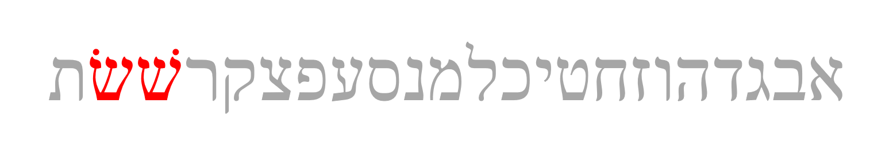
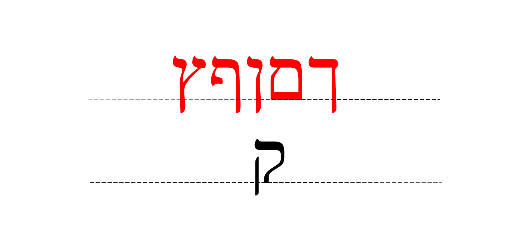

# Aleph-bet {#alephbet}

> Knowledge of the Hebrew alphabet opens the door of understanding . . . Pastor Robert Valci

 
 

## The Consonants

* Immediately you will notice that Hebrew GRAMMAR Quest is going to be different from other learn Hebrew books
* Almost every other grammar book would start with a lengthy description of each letter, how to write it and how to pronounce it
* But with Hebrew GRAMMAR Quest:

> *We* are not going to teach you the Aleph-Bet - *YOU* are going to teach you the Aleph-Bet!

* You will accomplish this in Anki
    * **You will not want to move on to lesson 2 until you have the Aleph-bet memorized**
    * This would be a great time to review those introductory lessons in Hebrew Quest
    * Practical teaching on how to write the letter
    * Spiritual insights - what the letter teaches us

## Twenty-two Consonants(?)

* Twenty-two vs twenty-three letters depends on how you count ש:

* One letter with two forms = 22
* Two separate letters = 23

* Most sources would align with 22 letters
* When you look words up in a Hebrew lexicon^[A "lexicon" is another word for a dictionary], words beginning with שׁ are segregated from words that begin with שֹ.

### How do you tell the difference between שׁ and שׁׁ?  {-}

* Look at the location of the dot  
    * RIGHT side = SHIN ׁׁשׁ
    * LEFT side = SIN   שֹ
# One way you can remember this is “SIN IS NEVER RIGHT!"

## Written and read from Right to Left

Note the front of a Hebrew book:

֝* To our western eyes, this looks "backwards" (but Israelis would say _we_ are reading backwards!)
* When reading Hebrew, always start at the "back" and go from RIGHT to LEFT

## Five Final (“Sofit”) Forms {-}

Of the 22 Hebrew consonants, there are three sub-groups of letters you need to memorize for this lesson:

1. "KiMNePaTZ" letters that have a final/sofit form
2. "BeGaD KePHaT" letters 
3. Guttural letters

Let's look at the sofit letters first.

* Hebrew does not have capital letters the way English does, but it does have a generally similiar concept
* Certain letters take what are called “Final” or “Sofit” forms when they appear at the END of a word
    * Those letters are in red text above
    * _Sofit_ is just the Hebrew word for final
* The names of these letters is quite simple
    * Take the letter Kaf כּ, which is the first letter in the Aleph-bet with a sofit form
    * The final form is simply named Kaf Sofit ך (or "final kaf").  Same for Mem מ and Mem sofit ם and so on

* The five letters that have these forms are the letters, kaf, mem, nun, pei and Tsaddi:  ך ם ן ף ץ   
* You can remember the acronym, KiMNePaTZ, which is the made-up word you get when you string the five letters in a row

### KiMNePaTZ sofit forms can look like other letters.

* Some of the KimNepatz letters look like other letters
* Note that four of the five letters extend below the writing line
* Of the regular (non-sofit) consonants, only the Quf extends below
    * The Quf is one of those fortunate letters that has no look alike
* If you see a letter that goes below the line and it’s not a Quf, it can only be a Sofit form

### Kaf Sofit and Look-alikes

* The three letters above actually spell a Hebrew word. We haven’t learned the vowels yet so they are omitted but the word pronounced "derech" means road or way.  
* דרך is a good word so you can see the differences between the Dalet, the first letter, the Resh, the middle letter, and the Kaf Sofit, the last letter (did you catch that we're reading right to left?)
* The Dalet and the Kaf Sofit have a lot in common
    * Depending on the font or the handwriting, they can look almost exactly the same
    * The difference is that Kaf Sofit extends below the line, and Dalet does not
* Resh and Kaf Sofit are easier to tell apart
    * Resh has a rounded corner
    * Resh doesn’t extend below the line

### Nun Sofit and Look-alikes

* This is a word pronounced "zaqen", and means old man or elder
* Here you can see some similarities between the Zayin, the first letter and the Nun Sofit
    * Again, note the Nun Sofit extends below the line

* Here are three letters that can often be confused with each-other
* This is actually a borrowed word, ion (yes, referring tot he sub-atomic particle)^[In lesson 2, we will learn about vowel letters and how the vav can be an "o" or "u" vowel}. 
* Take note of the differences among the yod, which doesn’t even reach the bottom line, the vav, which does not go below, and the nun sofit which extends beyond the bottom line

## Six “BeGaD KePHaT” Consonants take a "Daghesh Lene"

* The next sub-group of letters you need to study are the "BeGaD Kephat" letters.  
    * Izzy talked about this in Lesson 3 of Hebrew Quest
* ONLY applies to Bet - Gimmel - Dalet - Kaf - Pei - and Tav.
* At one time all six of these letters had different pronunciation - a hard form and a soft form.  A dot called a **DAGHESH LENE** is inserted into the middle of the consonant which makes the letter hard.   

In Sephardic pronunciation, only three of these letters actually change pronunciation:
|Letter | Pronunciation|
|:--:|:---:|
| בּ |b/**b**oy|
| ב |v/**v**et|
| כּ |k/ba**ck**|
| כ |ch/ba**ch**|
| פּ |p/**p**ick|
| פ |ph/**ph**one|

Since the letters without the Daghesh Lene want to be "lazy" - for example a weak 'v' instead of a strong 'b'- our mnemonic for these is "BuCK uP! You Lazy Letters!"

* When will I see a בגד כפת letter with and without the Daghesh Forte?
    * There is a rule:  <u>A Daghesh Lene is not used whenever the BDGKPT letter follows a Vowel</u>

You don’t need to memorise this right now and if this doesn’t make any sense, that’s ok.  We’ll dig deeper into the Daghesh Lene, and his twin, the Daghesh Forte over the next few lessons.

## Four Guttural Consonants and ר

The third of our three sub-groups are called the gutturals.

In fact, knowing the gutturals and how they behave will turn out to be one of the most important facets of Hebrew.  

Gutturals are everywhere.  We like to say that the gutturals will be our ‘problem children’ because they tend not to play nice with the other Hebrew rules.  

There are four proper gutturals.  Aleph, Hei, CHET and AYIN.  These are in the darker red above.

The letter resh ר is not formally a guttural, but since it can’t decide whether to behave or not. it is often grouped in as a guttural.  Resh is the letter in orange above.

Sometimes Resh is a good letter and gets along with the other Hebrew rules and other times it’s a naughty letter that causes trouble.

The good news is this bad boy behavior of the gutturals and Resh is entirely predictable.  We will learn this over the next few lessons  For now just memorize the four guttural consonants in red, and Resh, the sometimes-guttural-like letter in orange.

## Look-alike Letters

We met some of these letters earlier when we learned the Sofit forms, but Hebrew has many letters that can look similar, especially to someone just learning the Aleph-bet

You don’t need to memorize the list above.  The Anki deck will give you practice on distinguishing these.

Also, when Izzy reviewed the Aleph-Bet in lessons 2-11, he also talked about each letter’s twin and how to spot the difference.  If it’s been a while, or if this is new to you, you might want to revisit those letter lessons.

## Sephardic vs "Seminary" Pronunciation

We've already talked about how only three of the Daghesh Lene letters need to "buckup".  There is one other major difference between Sephardic and Seminary pronunciation, which is how to pronounce ו.  

In academia, the consonant receives the "w" sound and is called "Waw."  In most non-academic circles, it receives the "v" sound and is pronounced "vav".

* For the most part, Hebrew GRAMMAR Quest will follow the Sephardic pronunciation
* Some terms in the world of Hebrew grammar are so common, we are not going to try to fight them.  The reason for this is that if you use a Bible Study software package, you are much more likely to encounter the "w" versions.  Examples:
    * We will say "shewa" and not "sheva" (Lesson 2)
    * You may see "wayyiqtol" and not "vayyiqtol" (verbs) 
    * There is a concept called the "vav/waw consecutive" - when we get to verbs, we will learn some shorthand.  You will see "wc" for Waw Consecutive, even though we may call it the "Vav Consecutive".
    
You'll get used to it!

## Lesson 1 Activities

* Anki 
    * Vocabularly - Alephbet memorization with Izzy
    * Grammar - letter identification and pronunciation, look-alike letters
    * Translation - there is no translation yet but we will learn some grammar shorthand we will use when we get to the study verses
* Letter writing worksheet to practice writing the letters
