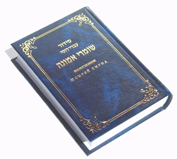
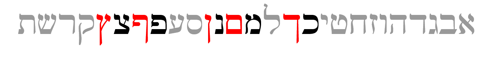
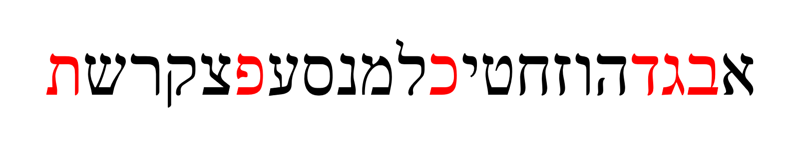
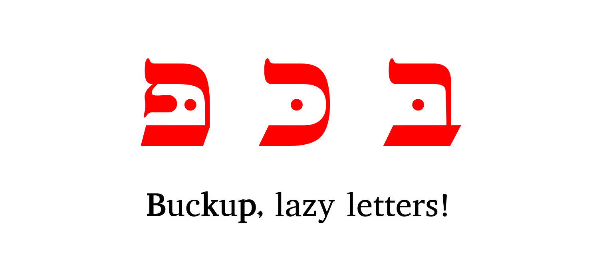
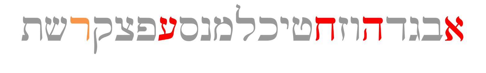
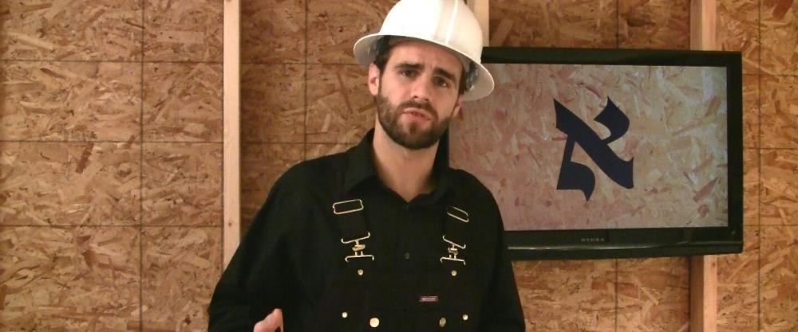
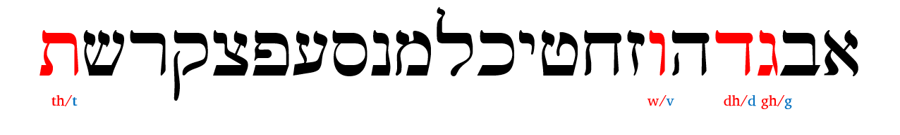
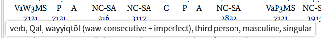

# (PART) Hebrew Grammar Foundations {-}

<!-- Grammarly check: 10/24/20 204 lines -->

# The Hebrew Aleph-bet {#alephbet}

> Knowledge of the Hebrew alphabet opens the door of understanding . . . Pastor Roger Valci<small>^[<small>Valci, Roger. “The Hebrew Acrostic,” in <u>Basics of Biblical Hebrew: Grammar</u>, edited by Gary D Pratico and Miles V Van Pelt. Grand Rapids, MI: Zondervan. 2007.</small>]</small>

<br>

```{r, out.width = "400pt", fig.align='center'}

include_graphics("images/alephbet_multi.png")
``` 
<small>^[<small>This graphic shows the evolution of Hebrew. Top to bottom: proto-Canaanite (~1600 BCE), paleo-Hebrew (~900 BCE), Rashi (1500 CE), Ketav Stam (used in Torah scrolls and other formal documents), contemporary block, and modern cursive. This course will use the contemporary block style. For more history and discussion on the other script forms, see Hebrew Quest, lessons 2-11.</small>]</small>

## Seven Practical Points for Lesson 1 {-}

1. Memorize the [Hebrew Aleph-Bet](#consonants)
1. Understand that Hebrew is written and read from [RIGHT to LEFT](#right_to_left)
1. Identify the group of five letters that have [final/Sofit forms](#sofit_letters)
1. Identify the group of six letters that can take a [Daghesh Lene](#daghesh_lene)
1. Identify the group of [four "guttural" letters](#gutturals) that cause significant changes in spelling and punctuation (and the one additional letter that sometimes acts as a guttural)
1. Differentiate among ["look-alike" letters](#look-alike_letters)
1. Note differences between ["Seminary" and "Sephardic" pronunciation](#pronunciation)

### `Lesson Prayer` {-}

As you undertake this new study, pray for this Grammar adventure to be fruitful.  May God use you as an instrument to advance His Kingdom.

> (Ezra 7:10 NASB) For Ezra had set his heart to study the law of the LORD and to practice it, and to teach His statutes and ordinances in Israel.

## Reminder: `Course Checklist` {.unnumbered .unlisted}

If you are eager to jump right in with Lesson 1, and skipped reading the course [Quick Start](#get_started), we understand totally.  We are also excited for you to start!

The articles in the Introduction section provide useful information about the course, as well as a _Course Checklist_ you can download to help keep you organized and on track.

Now would be a good time to read the Introduction and get the checklist if you missed it the first time.

## The Hebrew Aleph-Bet {#consonants}

```{r, out.width = "500pt", fig.align='center'}

```

Almost every other grammar book would start with a lengthy description of each letter, how to write it, and how to pronounce it.

* But Hebrew GRAMMAR Quest is not just another grammar book
* With Hebrew GRAMMAR Quest, **we** are not going to teach you the Aleph-Bet...

> *YOU* are going to teach yourself the Aleph-Bet using Anki

* This is not to say that we view learning the Aleph-Bet as unimportant. 
    * Just the opposite: **you will not want to move on to lesson 2 until you have the Aleph-bet memorized.**

We believe learning is best accomplished when **you** are learning and challenging (and maybe struggling a bit) yourself. We are just here to give you some pointers, so your journey gets started in the right direction.

Notes: 

* All letters you see in the picture of the Aleph-Bet above are classified as "consonants."
    * Whereas English has the vowel letters (A, E, I, O, U) as a core part of the Aleph-Bet, Hebrew treats vowels differently
    * א and ע are not vowels but silent consonants; in Sephardic pronunciation, they take on the pronunciation of their associated vowel (if there is one)
    * We'll talk about vowels in the next lesson

* This would be a great time to review the [Letter lessons in *Hebrew Quest*](https://holylanguage.com/letters.html)
    * Practical teaching on how to write the letter
    * Spiritual insights - what the letter teaches us


## Hebrew is written and read from RIGHT-to-LEFT {#right_to_left}

```{r, out.width = "400pt", fig.align='center'}

```

Note the front of a Hebrew book is in the same location as the back of an English one:

```{r, out.width = "150pt", fig.align='center'}

```

* To our western eyes, this looks "backward" (but Israelis would say _we_ are reading backward!)
* When reading Hebrew, always start at the "back" and go from RIGHT to LEFT
* **Hebrew Quest** discussion on Right to Left

<center>
<iframe width="560" height="315" src="https://www.youtube.com/embed/4xKQSvRvmN8?start=108" frameborder="0" allow="accelerometer; autoplay; clipboard-write; encrypted-media; gyroscope; picture-in-picture" allowfullscreen></iframe>
</center>


## Five letters have final (“sofit”) forms {#sofit_letters}

```{r, out.width = "500pt", fig.align='center'}

```

* Hebrew does not have capital letters the way English does, but it does have a generally similar concept
* Five letters take what are called “Final” or “Sofit”<small>^[<small>_Sofit_ is just the Hebrew word for final</small>]</small> forms when they appear at the END of a word
    * Those letters are in red text above
* The names of these letters is quite simple
    * Take the letter Kaf כּ, which is the first letter in the Aleph-bet with a sofit form
    * The final form is named Kaf Sofit ך. Same for Mem מ and Mem sofit ם and so on<small>^[<small>"Final Kaf," "Final Mem," etc., are also terms you may hear.</small>]</small>
* The five letters that have these forms are the letters, Kaf, Mem, Nun, Pei, and Tsaddi: ך ם ן ף ץ
* You can remember the acronym, KiMNePaTZ, which is the made-up word you get when you string the five letters in a row
* The KiMNePaTZ sofit forms can look like other letters - your Anki work will give you practice with identifying look-alike letters

## Six letters take a "Daghesh Lene" {#daghesh_lene}

```{r, out.width = "500pt", fig.align='center'}

```

* The next sub-group of letters you need to study are the "BeGaD Kephat" letters<small>^[<small>See also Lesson 3 of Hebrew Quest</small>]</small>

```{r, out.width = "150pt", fig.align='center'}
include_graphics("images/bdgkpt_with_lene.png")
```  
   
* The red dot in the above letters is called a **DAGHESH LENE**
* The Daghesh Lene is inserted into the middle of the consonant
    * The pronunciation of the letter is hard if the Daghesh Lene present or soft if not present
    * This ONLY applies to Bet - Gimmel - Dalet - Kaf - Pei - and Tav 
    * We call then "BeGaD KePHaT" letters because that's what you get when you pronounce the six letters together
    * Only these six can take a Daghesh Lene<small>^[<small>If you see a dot in a letter other than these six, then you know it can't be a Daghesh Lene</small>]</small>
* At one time, all six of these letters had different pronunciations, but today, only three do: **בּ כּ פּ**
    * Since the letters without the Daghesh Lene want to be "lazy" - for example a weak 'v' instead of a strong 'b'- our mnemonic for these is "BuCK uP! You Lazy Letters!"<small>^[<small>You will learn the specific differences in your Anki work for this lesson.</small>]</small>
```{r, out.width = "200pt", fig.align='center'}

```

* Grammar rule: <u>A Daghesh Lene is not used whenever the BDGKPT letter follows a Vowel</u>

We’ll dig deeper into the Daghesh Lene and its twin, the Daghesh Forte, over the next few lessons.


## We classify four consonants as **Gutturals** (and one is a sometimes-guttural) {#gutturals}

```{r, out.width = "500pt", fig.align='center'}

```

### Knowing the Gutturals and how they behave will turn out to be one of the most critical facets of Hebrew grammar {-}

* There are four proper gutturals: Aleph, Hei, Chet, and Ayin (in red above)
 * The letter Resh ר (in orange above) is not formally a Guttural; but since it can’t decide whether to behave or not, sometimes we include Resh with the other Gutturalsl
* We like to say that the gutturals will be our ‘problem children’ because they tend not to play nice with the other Hebrew rules 
    * The good news is this bad-boy behavior of the gutturals and Resh is entirely predictable
    * We will learn this over the next few lessons (and indeed, the rest of the course) 
* For now, memorize the four guttural consonants in red and Resh, the sometimes-guttural-like letter in orange.


## Look out for look-alike Letters {#look-alike_letters}

```{r, out.width = "400pt", fig.align='center'}
include_graphics("images/lookalikes.png")
```

* Hebrew has many letters that can look similar, especially to someone just learning the Aleph-bet
    * The Anki deck will give you practice on distinguishing these.
    * Also, in Hebrew Quest, when Izzy reviewed the Aleph-Bet in lessons 2-11, he talked about each letter’s "twin" and how to spot the difference 
    * We encourage you to revisit those [letter lessons](https://holylanguage.com/letters.html). 

```{r, out.width = "700pt", fig.align='center'}

```

## Sephardic vs "Seminary" Pronunciation {#pronunciation}

```{r, out.width = "500pt", fig.align='center'}

```

* There are some notable differences between what we might call academic or "seminary<small>^[<small>"Seminary Hebrew" is a term borrowed from Dr. John Beckman. We don't say "Seminary Hebrew" to be disrespectful; we only mean to differentiate between the two pronunciation types.</small>]</small>" Hebrew and "real-world" Hebrew.
    * Real-world Hebrew is based on Sephardic pronunciation
* We've already talked about how only three of the Daghesh Lene letters need to "buck up"<small>^[<small>With "Seminary Hebrew," the ג without the Daghesh Lene receives something like the GH in "aGHast." The ד and ת without the Daghesh Lene are closer to the English TH like "this." </small>]</small>
* Another difference between Sephardic and Seminary pronunciation is how to pronounce ו 
    * In academia, the consonant receives the "w" sound and is called "Waw." 
    * In most non-academic circles, it receives the "v" sound and is pronounced "vav."
* There are also significant differences in pronouncing vowels, which we will talk about in Lesson 2.
* For the most part, Hebrew GRAMMAR Quest will follow the Sephardic pronunciation
* Some terms like "Waw consective" and "wayyiqtol" are prevalent in the field of Hebrew Grammar, including modern Bible software (see image).
```{r, out.width = "600pt", fig.align='center'}

```
* We will use "Adonai" or "the LORD" when we encounter the Tetragramaton<small>^[<small>Pronouncing/writing/transliterating the Covenang Name of God tends to be much more common in Christian academic circles. If you were to read "Basics of Biblical Hebrew," you would see the name "Y--w-h" frequently. We do know of academians, such as Dr. John Beckman and Dr. Robert Cargill, who will use the circumlocution of respect instead of pronouncing the Name (and request their students do the same), so this is not a hard and fast "academic" distinction.  Also we know circomlocutions were common in Yeshua's day.  We can infer that He never called His Father by the Covenant Name.  If Yeshua had, the religious establishment likely would have added this breach of decorum to their list of complaints about Him.</small>]</small>.


## `Worksheets`: Letter Writing {-}

Welcome to your first "Physical" ACTIVity!

There are two separate components:

1. Practice writing the letters individually using the [Letter Writing worksheet](https://drive.google.com/file/d/1JcX8kc6e-fKjtzkeE96AwoZFshEpx3ug/view){target="_blank"}
    * If you would like some tips on how to write the letters, you can use [this guide](https://drive.google.com/file/d/1cmrCXcafjwvbMNj7GgX7UPMGA0FcwvWN/view?usp=sharing){target="_blank"} from Dr. Beckman.
    * As we've said before, we strongly encourage everone to watch (or re-watch) the [_Hebrew Quest_ lessons on the Aleph-Bet](https://holylanguage.com/letters.html){target="_blank"}
* Practice writing the entire AlephBet until you can do it five times from memory.

## `Anki Aerobics` {-}

* `Lesson 01 A.Vocab` - Learn (or relearn) the Aleph-Bet with Izzy. 
* `Lesson 01 B.Grammar` - Identify look-alike Hebrew letters.
* `Lesson 01 C.Study Verses` - we won't be working on any Study Verses just yet, but we will learn some grammar shorthand that we will use when we get to Lesson 3.

Access Anki using your mobile app, desktop version, or [the web-based version (login may be required)](https://ankiweb.net/decks/)

## `Ruth Pursuit` {-}

### Your Quest: {-}

1. Identify the four guttural letters (pink)<small>^[<small>The color is to let you know what color the answer key will use, but feel free to highlight in any color, underline, change the font color, or otherwise identify anyway you like.</small>]</small>
2. Identify the one half-guttural (red)
3. Identify the six BeGaD KePHaT letters, both with and without the Daghesh Lene, for a total of 12 letters (green)
4. Identify the five final/sofit forms (blue)
5. Identify the remaining letters (yellow)

* [Blank copy of Ruth Chapter 1](https://drive.google.com/file/d/1qcfTKAlTJGChC2eYCMhSbY2w-ibzCcDV/view?usp=sharing){target="_blank"}<small>^[<small>Click the link (and sign in with a Google account if necessary), then click "Open with Google Docs" to highlight the letters.</small>]</small>
* [Ruth Pursuit #1 Answer Key](https://drive.google.com/file/d/1vG8hKR50KcB0NclBnRWYPYMCEnobjgLc/view?usp=sharing){target="_blank"}


## `Quest Quiz` {-}

[Open Quest Quiz #1 in a new window](https://docs.google.com/forms/d/e/1FAIpQLSeqHcE8PvfkOYbTu51cNO8sf-ln6CEnRrcTBUxM0EaeojSSsA/viewform){target="_blank"}

<iframe src="https://docs.google.com/forms/d/e/1FAIpQLSeqHcE8PvfkOYbTu51cNO8sf-ln6CEnRrcTBUxM0EaeojSSsA/viewform?embedded=true" width="800" height="600" frameborder="2" marginheight="0" marginwidth="0"></iframe>
