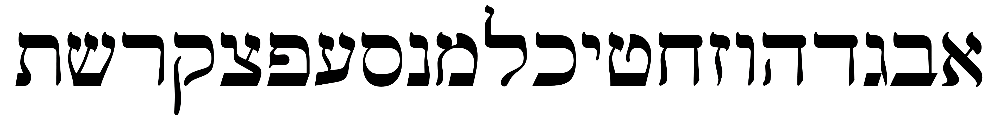

# (PART) Hebrew Grammar Foundations {-}


# The Hebrew Aleph-bet {#alephbet}


> To comprehend Biblical Hebrew, we must have the Aleph-Bet memorized

<br>

```{r, out.width = "400pt", fig.align='center'}

knitr::include_graphics("images/alephbet_multi.png")
``` 

This graphic shows the evolution of Hebrew. Top to bottom: proto-Canaanite (~1600 BCE), paleo-Hebrew (~900 BCE), Rashi (1500 CE), Ketav Stam (used in Torah scrolls and other formal documents), contemporary block, and modern cursive. This course will use the contemporary block style. 

In this initial lesson, we will meet the Hebrew Aleph-Bet.  The letters are like a family.  With any family there can be unique dynamics (including not always playing nice with each other!).  This lesson will take a look at some of those dynamics.


::: {.infobox .map}
**LESSON ITINERARY**

1. Meet the Hebrew Aleph-Bet
1. Understand that Hebrew is written and read from RIGHT to LEFT
1. Identify the group of five letters that have final/Sofit forms
1. Identify the group of six letters that can take a Daghesh Lene
1. Identify the group of four "guttural" letters that cause significant changes in spelling and punctuation (and the one additional letter that sometimes acts as a guttural)
1. Differentiate among "look-alike" letters
1. Note differences between "Seminary" and "Sephardic" pronunciation

:::


::: {.infobox .stop}

**EQUIPMENT CHECK**

If you are eager to jump right in with Lesson 1, we understand.  We are also excited for you to start!

"Equipment Check" is where we will pause before each lesson to make sure you have the right tools and supplies in your backpack before heading on the next phase of your Quest.  In future lessons, we will want to make sure you have an understanding of specific concepts before continuing<small>^[<small>See discussion on ["The Fog"](#the-fog) in the appendix</small>]</small>


Before continuing, make sure of the following:

*  You understand what [a typical lesson](#typical-lesson) will include
*  You followed the steps on our [Quick Start Instructions](#get_started), are ready go to with `Anki` and have your `Course Checklist` downloaded to track your progress
 
:::

## First Thought {-}

### שֵׁם יְהוָה אֶקְרָא {-}

*For I proclaim the name of Adonai  (Deuteronomy 32:3)*  

As you undertake this study, pray for this Grammar adventure to be fruitful.  May God use your growing knowledge of Hebrew as an instrument to advance His Kingdom, and may you never cease to proclaim His Name! 

<figure>
    <figcaption>Listen to this verse in Hebrew, then say it out loud:</figcaption>
    <audio
        controls controlsList="nodownload"
        src="./images/01.Deu3203.mp3">
            Your browser does not support the
            <code>audio</code> element.
    </audio>
</figure>

*****

```{r, out.width = "400pt", fig.align='center', fig.cap="Cove of the Sower - suggested location where Yeshua proclaimed the words of Adonai to the crowd in Mark 4:1. Courtesy of the [Pictorial Library of Bible Lands](https://www.bibleplaces.com)"}

knitr::include_graphics("images/01_Cove of the Sower from top, tbs76029303.jpg")
``` 

<small>Note: acoustic tests have been performed at this location.  These have confirmed that a person in a boat in the middle of the cove can _easily_ be heard without amplification by people sitting on these rocks several hundred feet up the embankment (and Yeshua didn't have to deal with road noise!).  A description of the acoustics study can be found in the following article: Crisler, B. "The Acoustics and Crowd Capacity of Natural Theaters in Palestine." Biblical Archaeologist, vol. 39, no. 4 (1976):128–41.</small>


## The Hebrew Aleph-Bet {#consonants}

```{r, out.width = "800pt", fig.align='center'}
include_graphics("images/alephbet.png")
```

Almost every other grammar book would start with a lengthy description of each letter, how to write it, and how to pronounce it.  We omit this because this is (and much more!) covered in detail in [_Hebrew Quest_ Lessons 2-11](https://holylanguage.com/letters.html){target="_blank"}.  The points below and on the following pages will provide some foundations. This way, your grammar journey gets started in the right direction.

* All letters you see in the picture of the Aleph-Bet above are classified as "consonants."

* Whereas English has the vowel letters (A, E, I, O, U) as a core part of the Aleph-Bet, Hebrew treats vowels differently

* א and ע are not vowels but silent consonants; in Sephardic pronunciation, they take on the pronunciation of their associated vowel (if there is one)

* We'll talk about vowels in Lesson 2

::: {.box .idea}

If you have not yet completed _Hebrew Quest_ Lessons 1-11, we encourage you to stop here and move over to Hebrew Quest to complete the Alephbet lessons.

In addition to learning the letters, you will learn things each letter has to teach us from a spiritual perspective.
:::

## Hebrew is written and read from RIGHT-to-LEFT {#right_to_left}

Note the front of a Hebrew book is the back of an English one:

```{r, , fig.show="hold", out.width = "300pt", fig.align='center'}
include_graphics("images/right_to_left.png")
include_graphics("images/hebrewbook.png")
```

* To our western eyes, this looks "backward" (but Israelis would say _we_ are reading backward!)

* When reading Hebrew, always start at the "back" and go from RIGHT to LEFT

*****

See **Hebrew Quest** discussion on Right to Left:

<center>
<iframe width="560" height="315" src="https://www.youtube.com/embed/4xKQSvRvmN8?start=108" frameborder="0" allow="accelerometer; autoplay; clipboard-write; encrypted-media; gyroscope; picture-in-picture" allowfullscreen></iframe>
</center>


## Five "KiMNePaTZ" letters have different final forms {#sofit_letters}

```{r, out.width = "800pt", fig.align='center'}
knitr::include_graphics("images/kimnepatz.gif")
```

* Hebrew does not have capital letters the way English does, but a somewhat similar concept is five letters take what are called “Final” or “Sofit”<small>^[<small>_Sofit_ is just the Hebrew word for final</small>]</small> forms when they appear at the END of a word
    * Those letters are in red text above
* The letter Kaf כּ is the first letter in the Aleph-bet with a sofit form
    * The final form is named Kaf Sofit ך
    * Same for Mem מ and Mem sofit ם and so on<small>^[<small>"Final Kaf," "Final Mem," etc., are also terms you may hear.</small>]</small>
* The five letters that have these forms are Kaf, Mem, Nun, Pei, and Tsaddi: ך ם ן ף ץ
* You can remember the acronym, KiMNePaTZ, which is the made-up word you get when you string the five letters in a row
* The KiMNePaTZ sofit forms can look like other letters - your `Anki` work for this Lesson will give you practice with identifying look-alike letters

## Six" BeGaD KePHaT" letters take a Daghesh Lene {#daghesh_lene}

```{r, out.width = "800pt", fig.align='center'}
knitr::include_graphics("images/bdgkpt.gif")
```

* Next, we need to learn the "BeGaD Kephat" letters<small>^[<small>See also Lesson 3 of Hebrew Quest</small>]</small>
* The red and blue dots in the above letters are called **DAGHESH LENE**
* The Daghesh Lene is inserted into the middle of the consonant
    * The pronunciation of the letter is linguistically "hard" if the Daghesh Lene present or linguistically "soft" if not present
        * so ב has a "soft b" sound, in other words a "v" sound
        * בּ has a "hard b" sound, in other words a "b" sound
        * כ sounds like the "ch" in "bach", while כּ is "k" as in "kite"
        * פ is the "ph" in "phone", while פּ is the "p" in "pull"

* At one time, all six of these letters had different pronunciations, but today, only three do.  These are the letters in blue above **בּ כּ פּ**
    * Since the letters without the Daghesh Lene want to be "lazy" - for example a weak 'v' instead of a strong 'b'- our mnemonic for these is "BuCK uP! You Lazy Letters!"

::: {.box .caution}
* There other "dots" in Hebrew with various meanings
* The Daghesh Lene ONLY applies to Bet - Gimmel - Dalet - Kaf - Pei - and Tav 
    * If a dot appears in any other letter, it is NOT a Daghesh Lene
* We’ll dig deeper into the Daghesh Lene and its much more important twin, the Daghesh Forte, over the next few lessons.
:::

## We classify four consonants as **Gutturals** (and one is a sometimes-guttural) {#gutturals}

```{r, out.width = "800pt", fig.align='center'}

```

* We like to say that the gutturals (and sometimes Resh) will be our trouble-makers because they tend not to play nice with the other Hebrew rules 
    * The good news is the behavior of the Gutturals and Resh is entirely predictable
    * We will learn this over the next few lessons (and indeed, the rest of the course) 
* There are four proper gutturals: Aleph, Hei, Chet, and Ayin (in red above)
* The letter Resh ר (in orange above) is not formally a Guttural; but since it can’t decide whether to behave or not, sometimes we include Resh with the other Gutturals
* For now, memorize the group of four guttural consonants in red and Resh, the sometimes-guttural-like letter in orange.

::: {.infobox .info}
Learning how the Gutturals behave and what spelling changes they cause is one of the most critical facets of Hebrew grammar
:::

## We classify ten consonants as "SQiN eM LeVY"

```{r, out.width = "800pt", fig.align='center'}
knitr::include_graphics("images/01_sqinemlevy_gif.gif")
```


* This is another group of letters that can behave differently
* They are called the _SQiN eM LeVY_ letters because of the made-up word that is formed by the letters:
    * S - שׂשׁסצ the Sibilants (letters that make an S sound)<small>^[<small>The ז is also a sibilant, but as it turns out, it is not generally affected by the SQiN eM LeVY exception.</small>]</small>
    * Q - ק
    * N - נ
    * M - מ
    * L - ל
    * V - ו
    * Y - י
    
    
## Look out for look-alike Letters {#look-alike-letters}

* Hebrew has many letters that can look similar, especially to someone just learning the Aleph-bet
* For example <span class="he">נ</span>, <span class="he">ג</span> and <span class="he">כ</span>; <span class="he">ס</span> and <span class="he">ם</span>; or <span class="he">ר</span>, <span class="he">ד</span> and <span class="he">ך</span>
* The `Anki` deck will give you practice on distinguishing these.
* Also, in Hebrew Quest, when Izzy reviewed the Aleph-Bet in lessons 2-11, he talked about each letter’s "twin" and how to spot the difference 
* We encourage you to revisit those [letter lessons](https://holylanguage.com/letters.html). 

```{r, out.width = "400pt", fig.align='center'}
include_graphics("images/01.izzy_aleph.jpg")
```

## Sephardic and "Seminary" Pronunciation {#pronunciation}

```{r, out.width = "800pt", fig.align='center'}
knitr::include_graphics("images/vav.png")
```

* There are some notable differences between what we might call academic or "seminary<small>^[<small>"Seminary Hebrew" is a term borrowed from Dr. John Beckman. We don't say "Seminary Hebrew" to be disrespectful; we only mean to differentiate between the two pronunciation types.</small>]</small>" Hebrew and "real-world" Hebrew.  Seminary pronunciation is in red above, while Sephardic pronunciation is in blue.
    * Real-world Hebrew is based on Sephardic pronunciation
* We've already talked about how only three of the Daghesh Lene letters need to "BucK-uP"
* With "Seminary Hebrew," the <span class="he">ג</span> without the Daghesh Lene receives something like the GH in "aGHast." The <span class="he">ד</span> and <span class="he">ת</span> without the Daghesh Lene are closer to the English DH/TH like "this" 
* Another difference between Sephardic and Seminary pronunciation is how to pronounce <span class="he">ו</span> 
    * In academia, the consonant receives the "w" sound and is called "waw" 
    * In most non-academic circles, it receives the "v" sound and is pronounced "vav"
* There are also significant differences in pronouncing vowels, which we will talk about in Lesson 2.
* For the most part, Hebrew GRAMMAR Quest will follow the Sephardic pronunciation
* Lastly, will use "Adonai" or "the LORD" when we encounter the Covenant Name<small>^[<small>Please read Izzy's statement on the Covenant Name: "When I filmed Hebrew Quest I read God's Hebrew name as "Yahweh". This is a relatively common practice in academic circles and was also an expression of my personal love for God's holy name. Since then though I've encountered conclusive evidence that Yeshua and his disciples followed the Jewish tradition of saying "Adonai" instead of using the Sacred Name. It's my deep conviction that we should follow the example of Messiah and his apostles, so I've returned to saying "Adonai" (Hebrew for "the LORD") or "Hashem" (Hebrew for "the Name") instead of using the Sacred Name, and I encourage our students to do likewise." </small>]</small>

## Lesson Conclusion and Activities {-}

Congratulations on completing your first lesson!

Now we'll move into the Activities.  This is where you take what you learned above and put it into practice using `Anki`.  For this lesson, we also have a `worksheet` and an additional writing activity.

### Anki {- #anki-1}

* `Lesson 01 A. Vocab` - Learn (or relearn) the Aleph-Bet with Izzy
* `Lesson 01 B. Grammar` - Identify look-alike Hebrew letters
* `Lesson 01 C. Study Verses` - we won't be working on any Study Verses just yet, but we will learn some grammar shorthand that we will use when we get to Lesson 3.

Access Anki using your mobile app, desktop version, or [the web-based version (login may be required)](https://ankiweb.net/decks/){target="_blank"}

### Worksheets: Letter Writing {- #worksheets-1}

1. Practice writing the letters individually using the [Letter Writing worksheet](https://drive.google.com/file/d/1JcX8kc6e-fKjtzkeE96AwoZFshEpx3ug/view){target="_blank"}
    * If you would like some tips on how to write the letters, you can use [this guide](https://drive.google.com/file/d/1cmrCXcafjwvbMNj7GgX7UPMGA0FcwvWN/view?usp=sharing){target="_blank"} from Dr. Beckman.
    * As we've said before, we strongly encourage everyone to watch (or re-watch) the [_Hebrew Quest_ lessons on the Aleph-Bet](https://holylanguage.com/letters.html){target="_blank"}
    
2. Practice writing the entire AlephBet until you can do it FIVE times from memory.  This will also be an instruction on the Quest Quiz.


## Ruth Pursuit {-}

* This is a QUEST activity, similar to "bag the letters" from _Hebrew Quest_.  
* You can do this activity online using Google Docs or download/print and use physical highlighters.
* Click the link to open a [blank copy of Ruth Chapter 1](https://docs.google.com/document/d/1bcT1J-fcVmD1Zn5Jk2nj0560tEddcgtbYZLkwaVVuyE/copy){target="_blank"}.  You may need to sign in with a Google account.  


::: {.box .map} 
YOUR QUEST

1. Identify the four guttural letters in Ruth chapter 1(pink)<small>^[<small>The color is to let you know what color the answer key will use, but feel free to highlight in any color, underline, change the font color, or otherwise identify anyway you like.</small>]</small>
2. Identify the one half-guttural (red)
3. Identify the six BeGaD KePHaT letters, both with and without the Daghesh Lene, for a total of 12 letters (green)
4. Identify the five final/sofit forms (blue)
5. Identify the 12 remaining consonants not included in the above categories (including both forms of ש)(yellow)
6. Find all examples of the names listed below (grey)
    * Ruth - spelled <span class="he">רוּת</span>; also "and Ruth" - <span class="he">וְרוּת</span>
    * Naomi - spelled <span class="he">נָעֳמִי</span> 
    * Bethlehem - spelled <span class="he">בֵּית לֶחֶם  </span>, also "from Bethlehem" - <span class="he">מִבֵּית לֶחֶם</span>
        * Our one word "Bethlehem" is two words in Hebrew: <span class="he">בֵּית</span> means "house of" and  <span class="he">לֶחֶם</span> means "bread"
    * Moab - spelled <span class="he">מוֹאָב</span>, also "Moabites" <span class="he">מֹאֲבִיּוֹת</span>, and "the Moabitess" <span class="he">הַמּוֹאֲבִיָּה</span>
:::


* Check your results against the [Ruth Pursuit #1 Answer Key](./images/01_Ruth_Pursuit_KEY.pdf){target="_blank"}

## Ruth Pursuit Translation Worksheet {-}

* With almost every lesson of Hebrew GRAMMAR Quest, we will be gradually building a translation of Ruth chapter one
* Instead of going sequentially, we will be working to identify concepts  
    * We started with the simple words in the previous section
    * Towards the end of the course, you will be translating complex verbs
* We want you to keep track of your progress, because in Unit 4, you will know enough Hebrew to compose your own translation of Ruth 1
* After you finish each `Ruth Pursuit`, be sure to update your worksheet

::: {.box .map}
RUTH PURSUIT TRANSLATION WORKSHEET INSTRUCTIONS

* Download and open your `Hebrew GRAMMAR Quest Checklist` if you haven't already done so
* Find the `Ruth 1 Translation` tab
* As you identify complete words (not the individual letters), enter the English meaning next to the applicable word
    * For example, next to each occurrence of <span class="he">מוֹאָב</span>, type the word `Moab`, for <span class="he">רוּת</span>, enter "Ruth" and so forth
    * You might want to make a note of the Lesson # (in this case "1") in case you need to refer back
    * There is also a column for any notes you wish to make
    * See examples for verse 1 in the worksheet
* Remember to update your translation worksheet after each lesson
:::

## Quest Quiz {-}

Here is our first `Quest Quiz`.  Remember to treat this as a self-assessment.  If you do well, you should be ready to progress to Lesson 2.  If not, you may need to go back and review some concepts from Lesson 1.  This is not for a grade, as there are no grades given in this course.

[Open Quest Quiz #1 in a new window](https://docs.google.com/forms/d/e/1FAIpQLSeqHcE8PvfkOYbTu51cNO8sf-ln6CEnRrcTBUxM0EaeojSSsA/viewform){target="_blank"}

<div class="containerLet">
<iframe class="responsive-iframe" src="https://docs.google.com/forms/d/e/1FAIpQLSeqHcE8PvfkOYbTu51cNO8sf-ln6CEnRrcTBUxM0EaeojSSsA/viewform?embedded=true" frameborder="0"></iframe>
</div>


