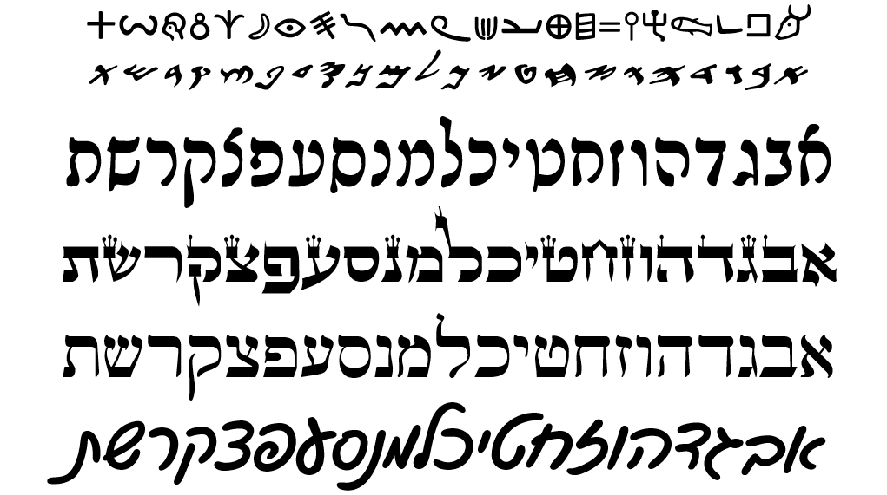

# Aleph-bet {#alephbet}

> Knowledge of the Hebrew alphabet opens the door of understanding . . . Pastor Robert Valci

<br>

```{r, out.width = "300px", fig.align='center'}


```
^[This graphic shows the evolution of Hebrew.  Top to bottom: proto-canaanite (~1600 BCE), paleo-Hebrew (~900 BCE), Rashi (1500 CE), Ketav Stam (used in Torah scrolls and other formal documents), contemporary block. and contemporary cursive.  This course will use contemporary block style. For more history and discussion on the other script forms, see Hebrew Quest, lessons 2-11.]

### Seven Practical Points for Lesson 1 {-}

1. [Memorize the consonants](#one_1)
1. [Understand that Hebrew is written and read from RIGHT to LEFT](#one_2)
1. [Identify the group of five letters that have final/Sofit forms](#one_3)
1. [Identify the group of six letters that can take a Daghesh Lene](#one_4)
1. [Identify the group of four "guttural" letters that cause significant changes in spelling and punctuation (and the one additional letter that sometimes acts as a guttural)](#one_5)
1. [Differentiate among "look-alike" letters](#one_6)
1. [Note differences between "seminary" and "Sephardic" pronunciation](#one_7)

[Lesson 1 ACTIVities](#one_8)


## The Hebrew Alephbet {#one_1}

```{r, out.width = "500px", fig.align='center'}
include_graphics("images/alephbet.png")
```

Immediately you will notice that Hebrew GRAMMAR Quest is going to be different from other "learn Hebrew" books!

* Almost every other grammar book would start with a lengthy description of each letter, how to write it and how to pronounce it
    * But with Hebrew GRAMMAR Quest:

> *We* are not going to teach you the Aleph-Bet - *YOU* are going to teach you the Aleph-Bet!

* You will accomplish this in Anki.  **You will not want to move on to lesson 2 until you have the Aleph-bet memorized.**

Notes: 

* All letters you see in the picture of the Aleph-Bet above are classified as "consonants"
    * Whereas English has the vowel letters (A, E, I, O, U) as a core part of the Aleph-Bet, Hebrew treats vowels differently
    * We'll see more in the next lesson

* This would be a great time to review those introductory lessons in Hebrew Quest
    * Practical teaching on how to write the letter
    * Spiritual insights - what the letter teaches us


## Hebrew is written and read from RIGHT-to-LEFT {#one_2}

```{r, out.width = "300px", fig.align='center'}
include_graphics("images/right_to_left.png")
```

Note the front of a Hebrew book is in the same location as the back of an English book:

```{r, out.width = "300px", fig.align='center'}
include_graphics("images/hebrewbook.png")
```

* To our western eyes, this looks "backwards" (but Israelis would say _we_ are reading backwards!)

* When reading Hebrew, always start at the "back" and go from RIGHT to LEFT


## Five letters have final (“sofit”) forms {#one_3}

```{r, out.width = "500px", fig.align='center'}
include_graphics("images/kimnepatz.png")
```

* Hebrew does not have capital letters the way English does, but it does have a generally similiar concept

* Certain letters take what are called “Final” or “Sofit” forms when they appear at the END of a word
    * Those letters are in red text above
    * _Sofit_ is just the Hebrew word for final


* The names of these letters is quite simple
    * Take the letter Kaf כּ, which is the first letter in the Aleph-bet with a sofit form
    * The final form is simply named Kaf Sofit ך (or "final kaf").  Same for Mem מ and Mem sofit ם and so on^["Final Kaf", "Final Mem", etc., are also terms you may hear.]


* The five letters that have these forms are the letters, kaf, mem, nun, pei and Tsaddi:  ך ם ן ף ץ   

* You can remember the acronym, KiMNePaTZ, which is the made-up word you get when you string the five letters in a row

* The KiMNePaTZ sofit forms can look like other letters - your Anki work will give you practice with identifying look-alike letters


## Six letters take a "Daghesh Lene" {#one_4}

```{r, out.width = "500px", fig.align='center'}
include_graphics("images/bgdkpt.png")
```
```{r, out.width = "100px", fig.align='center'}
include_graphics("images/bdgkpt_with_lene.png")
```    
    
* The next sub-group of letters you need to study are the "BeGaD Kephat" letters^[See also Lesson 3 of Hebrew Quest]

* The red dot in the above letters is called a **DAGHESH LENE**
    * It is inserted into the middle of the consonant which makes the pronunciation hard if present, or soft if not present
    * This ONLY to Bet - Gimmel - Dalet - Kaf - Pei - and Tav - we call then "BeGaD KePHaT" letters because that's what you get when you string the six letters together
    * Only these six can take a Daghesh Lene^[If you see a dot in a letter other than these six, then you know it can't be a Daghesh Lene]


* At one time all six of these letters had different pronunciation - a hard form and a soft form
    * Today only three do: **בּ כּ פּ**
    * Since the letters without the Daghesh Lene want to be "lazy" - for example a weak 'v' instead of a strong 'b'- our mnemonic for these is "BuCK uP! You Lazy Letters!"^[You will learn the specific differences in your Anki work for this lesson.]
    

```{r, out.width = "200px", fig.align='center'}

```

* When will you see a בגד כפת letter with and without the Daghesh Forte?
    * There is a rule:  <u>A Daghesh Lene is not used whenever the BDGKPT letter follows a Vowel</u>

We’ll dig deeper into the Daghesh Lene, and its twin, the Daghesh Forte, over the next few lessons.


## Four letters are classified as guttural Consonants (and one is a sometimes-guttural) {#one_5}

```{r, out.width = "500px", fig.align='center'}
include_graphics("images/gutturals.png")
```

* Knowing the gutturals and how they behave will turn out to be one of the most important facets of Hebrew grammar
    * Gutturals are everywhere
    * We like to say that the gutturals will be our ‘problem children’ because they tend not to play nice with the other Hebrew rules 


* There are four proper gutturals  Aleph, Hei, Chet, and Ayin (in red above)
    *The letter Resh ר (in orange above) is not formally a guttural; but since it can’t decide whether to behave or not, it is often grouped in as a guttural
    * The good news is this bad boy behavior of the gutturals and Resh is entirely predictable
    * We will learn this over the next few lessons  
    * For now just memorize the four guttural consonants in red, and Resh, the sometimes-guttural-like letter in orange.


## Look out for look-alike Letters {#one_6}

```{r, out.width = "300px", fig.align='center'}
include_graphics("images/lookalikes.png")
```

* Hebrew has many letters that can look similar, especially to someone just learning the Aleph-bet
    * The Anki deck will give you practice on distinguishing these.
    * Also, in Hebrew Quest, when Izzy reviewed the Aleph-Bet in lessons 2-11, he also talked about each letter’s "twin" and how to spot the difference 
    * If it’s been a while, or if this is new to you, you might want to revisit those letter lessons.


## Sephardic vs "Seminary" Pronunciation {#one_7}

```{r, out.width = "500px", fig.align='center'}
include_graphics("images/vav.png")
```

* There are some notable differences between what we might call academic or "seminary" Hebrew and "real-world" Hebrew.
    * Real-world Hebrew is based on Sephardic pronunciation^["Seminary Hebrew" is a term borrowed from Dr. John Beckman. We don't say "Seminary Hebrew" to be disrespectful; we only mean to differentiate between the two pronunciation types.]
* We've already talked about how only three of the Daghesh Lene letters need to "buckup"^[With "Seminary Hebrew", the ג without the Daghesh Lene receives something like the gh in "aGHast" and the ד and ת without the Daghesh Lene are closer to the English th like "this".]
* Another difference between Sephardic and Seminary pronunciation is how to pronounce ו 
    * In academia, the consonant receives the "w" sound and is called "Waw." 
    * In most non-academic circles, it receives the "v" sound and is pronounced "vav".
    
* There are also significant differences when it comes to pronouncing vowels, which we will talk about in Lesson 2.

* For the most part, Hebrew GRAMMAR Quest will follow the Sephardic pronunciation
* Some terms like "Waw consective" are so prevalent in the field of Hebrew Grammar, including modern Bible software (see image), that we would be doing you a disservice if we did not refer to these as "wayyiqtol" and so forth.
```{r, out.width = "400px", fig.align='center', fig.cap="Wayyiqtol from Logos8 software"}

```
* This course will use "Adonai" or "the LORD" when we encounter the Tetragramaton^[Pronouncing/writing/transliterating the Holy Name of God tends to be much more common in Christian academic circles. If you were to read "Basics of Biblical Hebrew" you would see the name "Y--w-h" used frequently. We do know of academians, such as Dr. John Beckman and Dr. Robert Cargill, who will use the circumlocution of respect instead of pronouncing the name, so this is not a hard and fast "Academic" distinction].


## Lesson 1 ACTIVities {#one_8}

* Physical
    * Anki Aerobics
        * Vocabulary - Learn (or relearn) the Aleph-Bet with Izzy 
        * Grammar - Identify look-alike Hebrew letters
    * Worksheets
        * Practice writing the letters using the [Letter Writing worksheet](https://drive.google.com/file/d/1JcX8kc6e-fKjtzkeE96AwoZFshEpx3ug/view) 
        * Practice writing the AlephBet in order until you can do it at least five times from memory using the [Blank writing paper](https://drive.google.com/file/d/1mQcP6MMPDU--r374dZii7PxNzyd5NU6F/view?usp=sharing)
* Spiritual
    * Anki Aerobics
        * Study-Verses - there is no translation yet but we will learn some grammar shorthand that we will use when we get to the study verses
    * Ruth Pursuit (Use [Ruth 1 Blank Copy](https://drive.google.com/file/d/1qcfTKAlTJGChC2eYCMhSbY2w-ibzCcDV/view?usp=sharing)^[Click the link (and sign in with a Google account if necessary), then click "Open with Google Docs" to highlight the letters. ] 
        1. Identify the four guttural letters (pink)^[The color is to let you know what color the answer key will use, but feel free to highlight in any color, underline, change the font color, or otherwise identify anyway you like.]
        2. Identify the one half-guttural (red)
        3. Identify the six BeGaD KePHaT letters, both with and without the Daghesh Lene for a total of 12 letters (green)
        4. Identify the five final/sofit forms (blue)
        5. Identify the remaining letters (yellow)
        * [(Ruth Answer Key #1)](https://drive.google.com/file/d/1vG8hKR50KcB0NclBnRWYPYMCEnobjgLc/view?usp=sharing)
* Physical
    * Quest Quiz #1
        * After completing all of the other ACTIVities, complete the [Quest Quiz #1](https://docs.google.com/forms/d/e/1FAIpQLSeqHcE8PvfkOYbTu51cNO8sf-ln6CEnRrcTBUxM0EaeojSSsA/viewform)^[Please remember that the Quest Quizzes are intended as a checkpoint of your learning after you have completed the Physical and Spiritual Preparation ACTIVities.] to assess your progress


