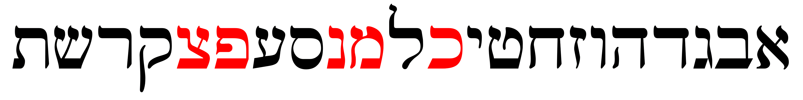
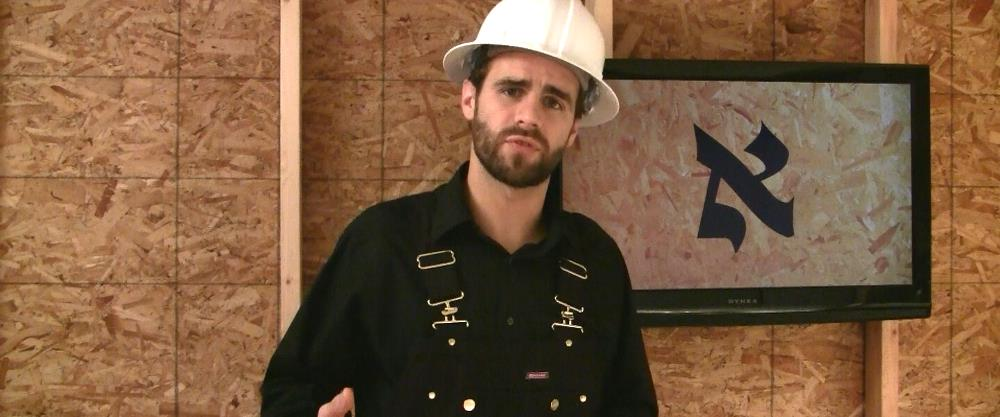

# The Hebrew Aleph-bet {#alephbet}

::: {.infobox .sound}
<figure>
<audio
        id="myAudio"
        controls controlsList="nodownload"
        src="./images/01.intro.m4a">
            Your browser does not support the
            <code>audio</code> element.
    </audio>
<button onclick="setPlaySpeed25()" type="button">2.5x</button>
<button onclick="setPlaySpeed2()" type="button">2x</button>
<button onclick="setPlaySpeed15()" type="button">1.5x</button>
<button onclick="setPlaySpeed1()" type="button">1x</button>
<button onclick="setPlaySpeed075()" type="button">.75x</button>
<button onclick="setPlaySpeed05()" type="button">.5x</button>
<script>
var x = document.getElementById("myAudio");
function setPlaySpeed05() { 
    x.playbackRate = 0.5;
    x.play();
}
function setPlaySpeed075() { 
    x.playbackRate = 0.75;
    x.play();
} 
function setPlaySpeed1() { 
    x.playbackRate = 1;
     x.play();
}
function setPlaySpeed15() { 
    x.playbackRate = 1.5;
     x.play();
} 
function setPlaySpeed2() { 
    x.playbackRate = 2;
     x.play();
} 
function setPlaySpeed25() { 
    x.playbackRate = 2.5;
     x.play(); 
} 
</script> 
</figure>
:::

> To comprehend Biblical Hebrew, we must have the Aleph-Bet memorized

<br>

```{r, out.width = "400pt", fig.align='center'}
library(knitr)
knitr::include_graphics("images/alephbet_multi.png")
``` 

This graphic shows the evolution of Hebrew. Top to bottom: proto-Canaanite (~1600 BCE), paleo-Hebrew (~900 BCE), Rashi (1500 CE), Ketav Stam (used in Torah scrolls and other formal documents), contemporary block, and modern cursive. This course will use the contemporary block style. 

In this initial lesson, we will meet the Hebrew Aleph-Bet.  The letters are like a family.  Like a family, there can be unique dynamics (including not always playing nice with each other!).  This lesson will take a look at some of those dynamics.


::: {.infobox .map}
**LESSON ITINERARY**

1. Meet the Hebrew Aleph-Bet
1. Understand that Hebrew is written and read from RIGHT to LEFT
1. Identify the group of five letters that have final/Sofit forms
1. Identify the group of six letters that can take a Daghesh Lene
1. Identify the group of four "guttural" letters that cause significant changes in spelling and punctuation (and the one additional letter that sometimes acts as a guttural)
1. Identify the group of ten letters that _sometimes_ behave differently in limited circumstances
1. Differentiate among "look-alike" letters
1. Note differences between "Seminary" and "Sephardic" pronunciation

:::


::: {.infobox .stop}

**EQUIPMENT CHECK**

If you are eager to jump right in with Lesson 1, we understand.  We are also excited for you to start!

"Equipment Check" is where we will pause before each lesson to make sure you have the right tools and supplies in your backpack before heading on the next phase of your Quest.  In future lessons, we will want to make sure you understand specific concepts before continuing.

For Lesson 1, BEFORE CONTINUING, MAKE SURE YOU HAVE COMPLETED ALL OF THE `PRELIMINARY` TASKS ON YOUR `COURSE CHECKLIST` AND ARE READY TO GO WITH `ANKI`!

:::

## First Thought {-}
::: {.infobox .sound}
<figure> <audio id="myAudio" controls controlsList="nodownload" 
src="./images/01.Deu3203.mp3">
Your browser does not support the <code>audio</code> element.</audio><button onclick="x25()" type="button">2.5x</button><button onclick="x2()" type="button">2x</button><button onclick="x15()" type="button">1.5x</button><button onclick="x1()" type="button">1x</button><button onclick="x075()" type="button">.75x</button><button onclick="x05()" type="button">.5x</button><script>
var x = document.getElementById("myAudio");
function x05() { 
    x.playbackRate = 0.5;
    x.play();}
function x075() { 
    x.playbackRate = 0.75;
    x.play();} 
function x1() { 
    x.playbackRate = 1;
     x.play();}
function x15() { 
    x.playbackRate = 1.5;
     x.play();} 
function x2() { 
    x.playbackRate = 2;
     x.play();} 
function x25() { 
    x.playbackRate = 2.5;
     x.play(); } 
</script></figure>
:::

::: {.box .light}
* Listen to the verse in Hebrew
* Practice speaking until you can pronounce just like Izzy 
  * You can slow the audio down if needed
:::

### <span class="he">שֵׁם יְהוָה אֶקְרָא</span> {-}

*For I proclaim the name of Adonai  (Deuteronomy 32:3)*  

As you undertake this study, pray for this Grammar adventure to be fruitful.  May God use your growing knowledge of Hebrew as an instrument to advance His Kingdom, and may you never cease to proclaim His Name! 


```{r, out.width = "600pt", fig.align='center', fig.cap="Cove of the Sower - suggested location where Yeshua proclaimed the words of Adonai to the crowd in Mark 4:1. Courtesy of the [Pictorial Library of Bible Lands](https://www.bibleplaces.com)"}


``` 

<small>Note: acoustic tests performed at this location have confirmed that a person in a boat in the middle of the cove can _easily_ be heard without amplification by people sitting on these rocks several hundred feet up the embankment, and Yeshua didn't have to deal with road noise!  A description of the acoustics study can be found in the following article: Crisler, B. "The Acoustics and Crowd Capacity of Natural Theaters in Palestine." Biblical Archaeologist, vol. 39, no. 4 (1976):128–41.</small>


## The Hebrew Aleph-Bet {#consonants}

::: {.infobox .sound}
<figure> <audio id="myAudio" controls controlsList="nodownload" 
src="./images/01.1.m4a"> 
Your browser does not support the <code>audio</code> element.</audio><button onclick="x25()" type="button">2.5x</button><button onclick="x2()" type="button">2x</button><button onclick="x15()" type="button">1.5x</button><button onclick="x1()" type="button">1x</button><button onclick="x075()" type="button">.75x</button><button onclick="x05()" type="button">.5x</button><script>
var x = document.getElementById("myAudio");
function x05() { 
    x.playbackRate = 0.5;
    x.play();}
function x075() { 
    x.playbackRate = 0.75;
    x.play();} 
function x1() { 
    x.playbackRate = 1;
     x.play();}
function x15() { 
    x.playbackRate = 1.5;
     x.play();} 
function x2() { 
    x.playbackRate = 2;
     x.play();} 
function x25() { 
    x.playbackRate = 2.5;
     x.play(); } 
</script></figure>
:::


```{r, out.width = "800pt", fig.align='center'}
include_graphics("images/alephbet.png")
```

Almost every other grammar book would start with a lengthy description of each letter, how to write it, and how to pronounce it.  We omit this because this is (and much more!) covered in detail in [_Hebrew Quest_ Lessons 2-11](https://holylanguage.com/letters.html){target="_blank"}.  

* Hopefully, you have already watched these foundational _Hebrew Quest_ lessons; if not, click the link above!  
* If you need a refresher on identifying each of the letters, there will be cards on the Aleph-Bet in your `Anki` deck for Lesson 1.

The points below and on the following pages will provide some foundations. This way, your grammar journey gets started in the right direction.

* All letters you see in the picture of the Aleph-Bet above are classified as "consonants."

* Whereas English has the vowel letters (A, E, I, O, U) as a core part of the Aleph-Bet, Hebrew treats vowels differently

* א and ע are not vowels but silent consonants; in Sephardic pronunciation, they take on the pronunciation of their associated vowel (if there is one)

* We'll talk about vowels in Lesson 2

::: {.box .stop}
Have you completed _Hebrew Quest_ Lessons 1-11?

If not, we encourage you to stop here and move over to _Hebrew Quest_ to complete the Alephbet lessons.

Besides learning the letters, you will learn deeper meanings each letter teaches us from a spiritual perspective.
:::

## Aleph-Bet Memory Song

::: {.infobox .sound}
<figure> <audio id="myAudio" controls controlsList="nodownload" 
src="./images/01.2.m4a"> 
Your browser does not support the <code>audio</code> element.</audio><button onclick="x25()" type="button">2.5x</button><button onclick="x2()" type="button">2x</button><button onclick="x15()" type="button">1.5x</button><button onclick="x1()" type="button">1x</button><button onclick="x075()" type="button">.75x</button><button onclick="x05()" type="button">.5x</button><script>
var x = document.getElementById("myAudio");
function x05() { 
    x.playbackRate = 0.5;
    x.play();}
function x075() { 
    x.playbackRate = 0.75;
    x.play();} 
function x1() { 
    x.playbackRate = 1;
     x.play();}
function x15() { 
    x.playbackRate = 1.5;
     x.play();} 
function x2() { 
    x.playbackRate = 2;
     x.play();} 
function x25() { 
    x.playbackRate = 2.5;
     x.play(); } 
</script></figure>
:::

As needed, sing along with this video by Dr. John Walton of Wheaton College to help you memorize the Aleph-bet^[Unfortunately, YouTube won't let us embed this video on this page]:

[Open Aleph-Bet video in new tab](https://www.youtube.com/watch?v=hIEB8bpJZhY&feature=youtu.be){target="_blank"}

```{r, out.width = "500pt", fig.align='center'}
knitr::include_graphics("images/01.2-alephbet.png")
```

## Hebrew is written and read from RIGHT-to-LEFT {#right_to_left}

::: {.infobox .sound}
<figure> <audio id="myAudio" controls controlsList="nodownload" 
src="./images/01.3.m4a"> 
Your browser does not support the <code>audio</code> element.</audio><button onclick="x25()" type="button">2.5x</button><button onclick="x2()" type="button">2x</button><button onclick="x15()" type="button">1.5x</button><button onclick="x1()" type="button">1x</button><button onclick="x075()" type="button">.75x</button><button onclick="x05()" type="button">.5x</button><script>
var x = document.getElementById("myAudio");
function x05() { 
    x.playbackRate = 0.5;
    x.play();}
function x075() { 
    x.playbackRate = 0.75;
    x.play();} 
function x1() { 
    x.playbackRate = 1;
     x.play();}
function x15() { 
    x.playbackRate = 1.5;
     x.play();} 
function x2() { 
    x.playbackRate = 2;
     x.play();} 
function x25() { 
    x.playbackRate = 2.5;
     x.play(); } 
</script></figure>
:::

Note the front of a Hebrew book is the back of an English one:

```{r, , fig.show="hold", out.width = "300pt", fig.align='center'}

include_graphics("images/hebrewbook.png")
```

* To our western eyes, this looks "backward" (but Israelis would say _we_ are reading backward!)

* When reading Hebrew, always start at the "back" and go from RIGHT to LEFT

*****

See **Hebrew Quest** discussion on Right to Left:

<center>
<iframe width="560" height="315" src="https://www.youtube.com/embed/4xKQSvRvmN8?start=108" frameborder="0" allow="accelerometer; autoplay; clipboard-write; encrypted-media; gyroscope; picture-in-picture" allowfullscreen></iframe>
</center>


<!-- 1.4 -->
## Five "KiMNePaTZ" letters have different final forms {#sofit_letters}

::: {.infobox .sound}
<figure> <audio id="myAudio" controls controlsList="nodownload" 
src="./images/01.4.m4a"> 
Your browser does not support the <code>audio</code> element.</audio><button onclick="x25()" type="button">2.5x</button><button onclick="x2()" type="button">2x</button><button onclick="x15()" type="button">1.5x</button><button onclick="x1()" type="button">1x</button><button onclick="x075()" type="button">.75x</button><button onclick="x05()" type="button">.5x</button><script>
var x = document.getElementById("myAudio");
function x05() { 
    x.playbackRate = 0.5;
    x.play();}
function x075() { 
    x.playbackRate = 0.75;
    x.play();} 
function x1() { 
    x.playbackRate = 1;
     x.play();}
function x15() { 
    x.playbackRate = 1.5;
     x.play();} 
function x2() { 
    x.playbackRate = 2;
     x.play();} 
function x25() { 
    x.playbackRate = 2.5;
     x.play(); } 
</script></figure>
:::

```{r, out.width = "800pt", fig.align='center'}

```

* Hebrew does not have capital letters the way English does, but a somewhat similar concept is five letters take what are called “Final” or “Sofit”^[_Sofit_ is just the Hebrew word for final] forms when they appear at the END of a word
    * Those letters are in red text above
* The letter Kaf כּ is the first letter in the Aleph-bet with a sofit form
    * The final form is named Kaf Sofit ך
    * Same for Mem מ and Mem sofit ם and so on^["Final Kaf," "Final Mem," etc., are also terms you may hear.]
* The five letters that have these forms are Kaf, Mem, Nun, Pei, and Tsaddi: ך ם ן ף ץ
* You can remember the acronym, KiMNePaTZ, which is the made-up word you get when you string the five letters in a row
* The KiMNePaTZ sofit forms can look like other letters - your `Anki` work for this Lesson will give you practice with identifying look-alike letters


## Activity: Practice Letter Writing  {- #worksheets-1}

::: {.infobox .sound}
<figure> <audio id="myAudio" controls controlsList="nodownload" 
src="./images/01.activity_letters.m4a"> 
Your browser does not support the <code>audio</code> element.</audio><button onclick="x25()" type="button">2.5x</button><button onclick="x2()" type="button">2x</button><button onclick="x15()" type="button">1.5x</button><button onclick="x1()" type="button">1x</button><button onclick="x075()" type="button">.75x</button><button onclick="x05()" type="button">.5x</button><script>
var x = document.getElementById("myAudio");
function x05() { 
    x.playbackRate = 0.5;
    x.play();}
function x075() { 
    x.playbackRate = 0.75;
    x.play();} 
function x1() { 
    x.playbackRate = 1;
     x.play();}
function x15() { 
    x.playbackRate = 1.5;
     x.play();} 
function x2() { 
    x.playbackRate = 2;
     x.play();} 
function x25() { 
    x.playbackRate = 2.5;
     x.play(); } 
</script></figure>
:::
::: {.box .info}
Depending on your existing familiarity with the Aleph-bet, you may wish to review the `Lesson 01 A. Vocab` module in Anki before attempting the worksheet.   In fact, these flashcards are borrowed from _Hebrew Quest_! 
:::

* Memorizing the Alephbet is essential
* Normally, Activities will be at the end of a lesson
* In this case however, we would ask you to stop right here and complete the writing activity - it will help you tremendously as you complete the remaining sections of Lesson 1
* Once you complete both parts of the activity, return here and continue the lesson

::: {.box .info}
* In Hebrew GRAMMAR Quest, we try to keep "brute-force memorization" to a minimum
* This way, if we are asking you to memorize something, you will know it's important!
:::

::: {.box .map }
YOUR QUEST (aka, instructions for the activity):

1. Practice writing the letters individually (letter by letter) using the [Letter Writing worksheet](./images/01_Letter_Writing_Worksheet.pdf){target="_blank"}
    * If you would like some tips on how to write the letters, you can use [this guide](01_Letter_Writing_Guide.pdf){target="_blank"} from Dr. Beckman.
    * As we've said before, we strongly encourage everyone to watch (or re-watch) the [_Hebrew Quest_ lessons on the Aleph-Bet](https://holylanguage.com/letters.html){target="_blank"}
    
2. On the reverse side of the worksheet (or on a separate piece of paper), practice writing the entire AlephBet, including the final/sofit forms, until you can do it at least ONCE entirely from memory. Be sure to cover up your previous attempts and any other reference materials.  

::: 

<!-- 1.5 -->
## Six "BeGaD KePHaT" letters take a mark called a Daghesh Lene {#daghesh_lene}
 
::: {.infobox .sound}
<figure> <audio id="myAudio" controls controlsList="nodownload" 
src="./images/01.5.m4a"> 
Your browser does not support the <code>audio</code> element.</audio><button onclick="x25()" type="button">2.5x</button><button onclick="x2()" type="button">2x</button><button onclick="x15()" type="button">1.5x</button><button onclick="x1()" type="button">1x</button><button onclick="x075()" type="button">.75x</button><button onclick="x05()" type="button">.5x</button><script>
var x = document.getElementById("myAudio");
function x05() { 
    x.playbackRate = 0.5;
    x.play();}
function x075() { 
    x.playbackRate = 0.75;
    x.play();} 
function x1() { 
    x.playbackRate = 1;
     x.play();}
function x15() { 
    x.playbackRate = 1.5;
     x.play();} 
function x2() { 
    x.playbackRate = 2;
     x.play();} 
function x25() { 
    x.playbackRate = 2.5;
     x.play(); } 
</script></figure>
:::

```{r, out.width = "800pt", fig.align='center'}
knitr::include_graphics("images/bdgkpt.gif")
```

* Next, we need to learn the "BeGaD KePhaT" letters^[See also Lesson 3 of _Hebrew Quest_]
* The red and blue dots in the above letters are called **DAGHESH LENE**
* The Daghesh Lene is inserted into the middle of the consonant
* The Daghesh Lene affects the pronunciation of these letters 
    * "hard" if the Daghesh Lene present 
    * "soft" if not present
* At one time, all six of these letters had different pronunciations, but today in Hebrew as spoken in Israel, only three do
* These are the letters in blue above **<span class="he">בּ כּ פּ</span>**:
    * <span class="he">ב</span> has a "soft b" sound, in other words, a "v" sound, while <span class="he">בּ</span> has a "hard b" sound, in other words, a "b" sound
    * <span class="he">כ</span> sounds like the "ch" in "bach", while <span class="he">כּ</span> is "k" as in "kangaroo"
    * <span class="he">פ</span> is the "ph" (or "f") in "phone", while <span class="he">פּ</span> is the "p" in "pulley"
    * Since the letters without the Daghesh Lene want to be "lazy" - for example, a weak 'v' instead of a strong 'b'- our mnemonic for these is "BucK uP! You Lazy Letters!"
    * בּכּפּ = BKP, which with a little imagination can mean "BucK uP!"
      
::: {.box .caution}
* There are many other "dots" in Hebrew with various meanings - not all are Daghesh Lene marks
* The Daghesh Lene ONLY applies to Bet - Gimmel - Dalet - Kaf - Pei - and Tav 
    * If a dot appears in any other letter, it is NOT a Daghesh Lene
* We’ll dig deeper into the Daghesh Lene and its much more notable big brother, the Daghesh Forte, over the next several lessons.  Both play a big factor in studying and understanding Hebrew grammar.
:::

<!-- 1.6 -->

<!-- 1.6 -->
## We classify four consonants as **Gutturals** (and one additional consonant is a sometimes-guttural)^[In modern linguistics, these are called `glottals`] {#gutturals}

::: {.infobox .sound}
<figure> <audio id="myAudio" controls controlsList="nodownload" 
src="./images/01.6.m4a"> 
Your browser does not support the <code>audio</code> element.</audio><button onclick="x25()" type="button">2.5x</button><button onclick="x2()" type="button">2x</button><button onclick="x15()" type="button">1.5x</button><button onclick="x1()" type="button">1x</button><button onclick="x075()" type="button">.75x</button><button onclick="x05()" type="button">.5x</button><script>
var x = document.getElementById("myAudio");
function x05() { 
    x.playbackRate = 0.5;
    x.play();}
function x075() { 
    x.playbackRate = 0.75;
    x.play();} 
function x1() { 
    x.playbackRate = 1;
     x.play();}
function x15() { 
    x.playbackRate = 1.5;
     x.play();} 
function x2() { 
    x.playbackRate = 2;
     x.play();} 
function x25() { 
    x.playbackRate = 2.5;
     x.play(); } 
</script></figure>
:::

```{r, out.width = "800pt", fig.align='center'}
knitr::include_graphics("images/gutturals.gif")
```

* There are four proper gutturals: Aleph, Hei, Chet, and Ayin (in red above)
* The letter Resh <span class="he">ר</span> (in orange above) is not formally a Guttural; but since it can’t decide whether to behave or not, sometimes we include Resh with the other Gutturals
* We like to say that the gutturals (and sometimes Resh) will be our trouble-makers because they tend not to play nice with the other Hebrew rules! 
    * The good news is the behavior of the Gutturals and Resh is entirely predictable
    * We will learn this over the next few lessons (and indeed, the rest of the course) 
* For now, memorize the group of four guttural consonants in red and Resh, the sometimes-guttural-like letter in orange.

::: {.infobox .info}
Learning how the gutturals behave and what spelling changes they cause is one of the most critical facets of Hebrew grammar.

It is core objective of this course.
:::

<!-- 1.7 -->


## We classify ten Hebrew letters as "SQiN eM LeVY" consonants

::: {.infobox .sound}
<figure> <audio id="myAudio" controls controlsList="nodownload" 
src="./images/01.7.m4a"> 
Your browser does not support the <code>audio</code> element.</audio><button onclick="x25()" type="button">2.5x</button><button onclick="x2()" type="button">2x</button><button onclick="x15()" type="button">1.5x</button><button onclick="x1()" type="button">1x</button><button onclick="x075()" type="button">.75x</button><button onclick="x05()" type="button">.5x</button><script>
var x = document.getElementById("myAudio");
function x05() { 
    x.playbackRate = 0.5;
    x.play();}
function x075() { 
    x.playbackRate = 0.75;
    x.play();} 
function x1() { 
    x.playbackRate = 1;
     x.play();}
function x15() { 
    x.playbackRate = 1.5;
     x.play();} 
function x2() { 
    x.playbackRate = 2;
     x.play();} 
function x25() { 
    x.playbackRate = 2.5;
     x.play(); } 
</script></figure>
:::

```{r, out.width = "800pt", fig.align='center'}

```


* This is another group of letters that can behave differently
* They are called the _SQiN eM LeVY_ letters because of the made-up word that is formed by the letters:
    * S - <span class="he">שׂשׁסצ</span> the Sibilants (letters that make an S sound)^[The ז is also a sibilant, but as it turns out, it is not generally affected by the SQiN eM LeVY exception.]
    * Q - <span class="he">ק</span>
    * N - <span class="he">נ</span>
    * M - <span class="he">מ</span>
    * L - <span class="he">ל</span>
    * V - <span class="he">ו</span>
    * Y - <span class="he">י</span>
* We will save a discussion on exactly how this group (mis)behaves for another lesson
* For now, memorize which letters are the _SQiN eM LeVY_ consonants
    
<!-- 1.8 -->
## Look out for look-alike Letters {#look-alike-letters}

::: {.infobox .sound}
<figure> <audio id="myAudio" controls controlsList="nodownload" 
src="./images/01.8.m4a"> 
Your browser does not support the <code>audio</code> element.</audio><button onclick="x25()" type="button">2.5x</button><button onclick="x2()" type="button">2x</button><button onclick="x15()" type="button">1.5x</button><button onclick="x1()" type="button">1x</button><button onclick="x075()" type="button">.75x</button><button onclick="x05()" type="button">.5x</button><script>
var x = document.getElementById("myAudio");
function x05() { 
    x.playbackRate = 0.5;
    x.play();}
function x075() { 
    x.playbackRate = 0.75;
    x.play();} 
function x1() { 
    x.playbackRate = 1;
     x.play();}
function x15() { 
    x.playbackRate = 1.5;
     x.play();} 
function x2() { 
    x.playbackRate = 2;
     x.play();} 
function x25() { 
    x.playbackRate = 2.5;
     x.play(); } 
</script></figure>
:::

* Hebrew has many letters that can look similar, especially to someone just learning the Aleph-bet
* For example <span class="he">נ</span>, <span class="he">ג</span> and <span class="he">כ</span>; <span class="he">ס</span> and <span class="he">ם</span>; or <span class="he">ר</span>, <span class="he">ד</span>, and <span class="he">ך</span>
* The `Anki` deck will give you practice on distinguishing these.
* Also, in Hebrew Quest, when Izzy reviewed the Aleph-Bet in lessons 2-11, he talked about each letter’s "twin" and how to spot the difference 
* So again, if you haven't watched those lessons or if it has been a while, we encourage you to revisit those [letter lessons](https://holylanguage.com/letters.html). 

```{r, out.width = "600pt", fig.align='center'}

```
<!-- 1.9 -->

## Sephardic versus Seminary Pronunciation {#pronunciation}

::: {.infobox .sound}
<figure> <audio id="myAudio" controls controlsList="nodownload" 
src="./images/01.9.m4a"> 
Your browser does not support the <code>audio</code> element.</audio><button onclick="x25()" type="button">2.5x</button><button onclick="x2()" type="button">2x</button><button onclick="x15()" type="button">1.5x</button><button onclick="x1()" type="button">1x</button><button onclick="x075()" type="button">.75x</button><button onclick="x05()" type="button">.5x</button><script>
var x = document.getElementById("myAudio");
function x05() { 
    x.playbackRate = 0.5;
    x.play();}
function x075() { 
    x.playbackRate = 0.75;
    x.play();} 
function x1() { 
    x.playbackRate = 1;
     x.play();}
function x15() { 
    x.playbackRate = 1.5;
     x.play();} 
function x2() { 
    x.playbackRate = 2;
     x.play();} 
function x25() { 
    x.playbackRate = 2.5;
     x.play(); } 
</script></figure>
:::

```{r, out.width = "800pt", fig.align='center'}
knitr::include_graphics("images/vav.png")
```

* There are some notable differences between what we might call academic or "seminary^["Seminary Hebrew" is a term borrowed from Dr. John Beckman. We don't say "Seminary Hebrew" to be disrespectful; we only mean to differentiate between the two pronunciation types.]" Hebrew and "real-world" Hebrew spoken in Israel.  Seminary pronunciation is in red above, while Sephardic pronunciation is in blue.
    * Real-world Hebrew is based on Sephardic pronunciation^[There is also what is called Ashkenazi pronunciation, which is beyond the scope of this course.  It also has some different pronunciations.  Most notably, the letter ת is given an "s" sound at the end of a word, and "O" vowels are more prominent.  So שׁבּת (shabbat), would be pronounced "Shabbos" in Ashkenazi]
* We've already talked about how only three of the Daghesh Lene letters need to "BucK-uP"
* With "Seminary Hebrew," all six letters take on a soft pronunciation.
    * The <span class="he">ג</span> without the Daghesh Lene receives something like the GH in "aGHast." The <span class="he">ד</span> and <span class="he">ת</span> without the Daghesh Lene are closer to the English DH/TH like "this" 
* Another difference between Sephardic and Seminary pronunciation is how to pronounce <span class="he">ו</span> 
    * In academia, the consonant receives the "w" sound and is called "waw" (pronounced like the English "wow!")
    * In most non-academic circles, it receives the "v" sound and is pronounced "vav"
    * This is important because a lot of the resources that we will reference come from academia and thus will have the "w" pronunciation.  For example instead of "vav-imperfect", we will frequently see "waw-imperfect"
* There are also significant differences in pronouncing vowels, most notably the short a ("a" like "apple"; versus "ah" like "father")
* For the most part, Hebrew GRAMMAR Quest will follow the Sephardic pronunciation
* Lastly, since we are talking about pronunciation differences, will use "Adonai" or "the LORD" when we encounter the Covenant Name^[Please read Izzy's statement on the Covenant Name: "When I filmed Hebrew Quest I read God's Hebrew name as "Yahweh". This is a relatively common practice in academic circles and was also an expression of my personal love for God's holy name. Since then though I've encountered conclusive evidence that Yeshua and his disciples followed the Jewish tradition of saying "Adonai" instead of using the Sacred Name. It's my deep conviction that we should follow the example of Messiah and his apostles, so I've returned to saying "Adonai" (Hebrew for "the LORD") or "HaShem" (Hebrew for "the Name") instead of using the Sacred Name, and I encourage our students to do likewise." ]
    * Again, in some of the materials that we have leveraged from academic circles, you may see (or hear) the Covenant Name ("Ya---h") written out as this is common in those settings
    * We are taking a devotional approach

## Activity: Anki {-}

::: {.infobox .sound}
<figure> <audio id="myAudio" controls controlsList="nodownload" 
src="./images/01.anki.m4a"> 
Your browser does not support the <code>audio</code> element.</audio><button onclick="x25()" type="button">2.5x</button><button onclick="x2()" type="button">2x</button><button onclick="x15()" type="button">1.5x</button><button onclick="x1()" type="button">1x</button><button onclick="x075()" type="button">.75x</button><button onclick="x05()" type="button">.5x</button><script>
var x = document.getElementById("myAudio");
function x05() { 
    x.playbackRate = 0.5;
    x.play();}
function x075() { 
    x.playbackRate = 0.75;
    x.play();} 
function x1() { 
    x.playbackRate = 1;
     x.play();}
function x15() { 
    x.playbackRate = 1.5;
     x.play();} 
function x2() { 
    x.playbackRate = 2;
     x.play();} 
function x25() { 
    x.playbackRate = 2.5;
     x.play(); } 
</script></figure>
:::

Congratulations on completing your first lesson!

Now we'll move into the Activities.  This is where you take what you learned above and put it into practice using `Anki`^[See the `Anki and Course Setup` section in the `Introduction` for more information on Anki and to download the Hebrew GRAMMAR Quest Anki decks.].  

* `Lesson 01 A. Vocab` - Learn (or relearn) the Aleph-Bet with Izzy
* `Lesson 01 B. Grammar` - Identify look-alike Hebrew letters
* `Lesson 01 C. Study Verses` - we won't be working on any Study Verses just yet, but we will learn some grammar shorthand that we will use when we get to Lesson 3.

Access Anki using your mobile app, desktop version, or [the web-based version (login may be required)](https://ankiweb.net/decks/){target="_blank"}


## Activity: Ruth Pursuit {-}

::: {.infobox .sound}
<figure> <audio id="myAudio" controls controlsList="nodownload" 
src="./images/01.ruth.m4a"> 
Your browser does not support the <code>audio</code> element.</audio><button onclick="x25()" type="button">2.5x</button><button onclick="x2()" type="button">2x</button><button onclick="x15()" type="button">1.5x</button><button onclick="x1()" type="button">1x</button><button onclick="x075()" type="button">.75x</button><button onclick="x05()" type="button">.5x</button><script>
var x = document.getElementById("myAudio");
function x05() { 
    x.playbackRate = 0.5;
    x.play();}
function x075() { 
    x.playbackRate = 0.75;
    x.play();} 
function x1() { 
    x.playbackRate = 1;
     x.play();}
function x15() { 
    x.playbackRate = 1.5;
     x.play();} 
function x2() { 
    x.playbackRate = 2;
     x.play();} 
function x25() { 
    x.playbackRate = 2.5;
     x.play(); } 
</script></figure>
:::

* This is a QUEST activity, similar to "bag the letters" from _Hebrew Quest_.  
* You can do this activity online using Google Docs or download/print and use physical highlighters.
* Click the link to open a [blank copy of Ruth Chapter 1](https://docs.google.com/document/d/1bcT1J-fcVmD1Zn5Jk2nj0560tEddcgtbYZLkwaVVuyE/copy){target="_blank"}
    * You may need to sign in with a Google account
    * You may wish to rename the document with the applicable lesson # as you will be reusing the blank document multiple times
* We strongly encourage you to go line by line through the passage and do not use the "Find" function in your word processor
    * Line by line will take longer, but you will learn more (even though you may think it's a waste of time because at this point you may not know much, if any, Hebrew.  Just go through the passage as best as you can; you may be surprised what sinks in!)

::: {.box .map} 
YOUR QUEST

1. Find ONE example of the following
    1. Identify the four guttural letters in Ruth chapter 1(pink)^[The color is to let you know what color the answer key will use, but feel free to highlight in any color, underline, change the font color, or otherwise identify anyway you like.]
    2. Identify the one half-guttural (red)
    3. Identify the six BeGaD KePHaT letters, both with and without the Daghesh Lene, for a total of 12 letters (green)
    4. Identify the five final/sofit forms (blue)
    5. Identify the 12 remaining consonants not included in the above categories (including both forms of ש)(yellow)
2. Find ALL examples of the names listed below (grey)
    * Ruth - spelled <span class="he">רוּת</span>; also "and Ruth" - <span class="he">וְרוּת</span>
    * Naomi - spelled <span class="he">נָעֳמִי</span> 
    * Bethlehem - spelled <span class="he">בֵּית לֶחֶם  </span>, also "from Bethlehem" - <span class="he">מִבֵּית לֶחֶם</span>
        * Our one word "Bethlehem" is two words in Hebrew: <span class="he">בֵּית</span> means "house of" and  <span class="he">לֶחֶם</span> means "bread"
    * Moab - spelled <span class="he">מוֹאָב</span>, also "Moabites" <span class="he">מֹאֲבִיּוֹת</span>^[As a taste of what is to come, this word מֹאֲבִיּוֹת has 1) defective spelling - notice how the Vav in מוֹאָב is not in מֹאֲבִיּוֹת? (Lesson 2), 2) propretonic reducticn - Compare the markings under the aleph in מֹאֲבִיּוֹת as compared to מוֹאָב. (Lesson 3), and a 3) Feminine plural suffix - Notice the Vav + Tav in מֹאֲבִיּוֹת are not present in מוֹאָב. (Lesson 4)], and "the Moabitess" <span class="he">הַמּוֹאֲבִיָּה</span>
:::


* Check your results against the [Ruth Pursuit #1 Answer Key](./images/01_Ruth_Pursuit_KEY.pdf){target="_blank"}

## Activity: Ruth Pursuit Translation Worksheet {-}

::: {.infobox .sound}
<figure> <audio id="myAudio" controls controlsList="nodownload" 
src="./images/01.ruthtranslate.m4a"> 
Your browser does not support the <code>audio</code> element.</audio><button onclick="x25()" type="button">2.5x</button><button onclick="x2()" type="button">2x</button><button onclick="x15()" type="button">1.5x</button><button onclick="x1()" type="button">1x</button><button onclick="x075()" type="button">.75x</button><button onclick="x05()" type="button">.5x</button><script>
var x = document.getElementById("myAudio");
function x05() { 
    x.playbackRate = 0.5;
    x.play();}
function x075() { 
    x.playbackRate = 0.75;
    x.play();} 
function x1() { 
    x.playbackRate = 1;
     x.play();}
function x15() { 
    x.playbackRate = 1.5;
     x.play();} 
function x2() { 
    x.playbackRate = 2;
     x.play();} 
function x25() { 
    x.playbackRate = 2.5;
     x.play(); } 
</script></figure>
:::

* With almost every lesson of Hebrew GRAMMAR Quest, we will be gradually building a translation of Ruth chapter one
* Instead of going sequentially, we will be working to identify concepts; so we may be skipping around the chapter a bit
    * We started with the simple words in the previous section
    * Towards the end of the course, you will be translating complex verbs
* We want you to keep track of your progress because, in Unit 4, you will know enough Hebrew to compose your own translation of Ruth 1
* After you finish each `Ruth Pursuit`, be sure to update the `Ruth 1 Translation` tab in your course checklist

::: {.box .map}
RUTH PURSUIT TRANSLATION WORKSHEET INSTRUCTIONS

* Download and open your `Hebrew GRAMMAR Quest Checklist` if you haven't already done so
* Find the `Ruth 1 Translation` tab
* As you identify complete words (Ruth, Bethlehem and Moab, not the individual letters), enter the English meaning next to the applicable word - note that the same word may occur multiple times in the passage
    * For example, next to each occurrence of <span class="he">מוֹאָב</span>, type the word `Moab`, for <span class="he">רוּת</span>, enter "Ruth" and so forth
    * You might want to make a note of the Lesson # (in this case "1") if you need to refer back to the lesson
    * There is also a column for any notes you wish to make
    * See examples for verse 1 in the worksheet
* You may use either your worksheet or the answer key to populate the Ruth Translation Worksheet
* Remember to update your translation worksheet after each lesson (we will not have `Ruth Pursuit Translation` section like this going forward; you can consider the translation work part of the `Ruth Pursuit`)
* This should be a fun and valuable exercise as you progress through Hebrew GRAMMAR Quest!
:::

## Activity: Quest Quiz {-}

::: {.infobox .sound}
<figure> <audio id="myAudio" controls controlsList="nodownload" 
src="./images/01.quiz.m4a"> 
Your browser does not support the <code>audio</code> element.</audio><button onclick="x25()" type="button">2.5x</button><button onclick="x2()" type="button">2x</button><button onclick="x15()" type="button">1.5x</button><button onclick="x1()" type="button">1x</button><button onclick="x075()" type="button">.75x</button><button onclick="x05()" type="button">.5x</button><script>
var x = document.getElementById("myAudio");
function x05() { 
    x.playbackRate = 0.5;
    x.play();}
function x075() { 
    x.playbackRate = 0.75;
    x.play();} 
function x1() { 
    x.playbackRate = 1;
     x.play();}
function x15() { 
    x.playbackRate = 1.5;
     x.play();} 
function x2() { 
    x.playbackRate = 2;
     x.play();} 
function x25() { 
    x.playbackRate = 2.5;
     x.play(); } 
</script></figure>
:::

Again, congratulations on finishing lesson 1.  Here is our first `Quest Quiz`.  Remember to treat this as a self-assessment.  If you do well, you should be ready to progress to Lesson 2.  If not, you may need to go back and review some concepts from Lesson 1.  This is not for a grade, as there are no grades given in this course.

::: {.box .light}
Most of the time, you will want the `Quest Quiz` to be your very last activity in a given lesson.  
In other words after you have completed `Anki` so that all the lesson's cards are in the 'mature' stage, and all the other activities, come back here to your guidebook and attempt the `Quest Quiz` to make sure you are ready to move on to the next lesson.
:::

::: {.box .info}
* Most of the time, videos, quizzes, and other feedback forms will be embedded directly into the Hebrew GRAMMAR Quest Guidebook
* If you ever have issues with the video or form not loading, click the "View in new window" link that will appear below (or instead of) the embedded frame; this will open a new window in your web browser  
:::

<div class="containerLet">
<iframe class="responsive-iframe" src="https://docs.google.com/forms/d/e/1FAIpQLSeqHcE8PvfkOYbTu51cNO8sf-ln6CEnRrcTBUxM0EaeojSSsA/viewform?embedded=true" frameborder="0"></iframe>
</div>

[Open Quest Quiz #1 in a new window](https://docs.google.com/forms/d/e/1FAIpQLSeqHcE8PvfkOYbTu51cNO8sf-ln6CEnRrcTBUxM0EaeojSSsA/viewform){target="_blank"}
