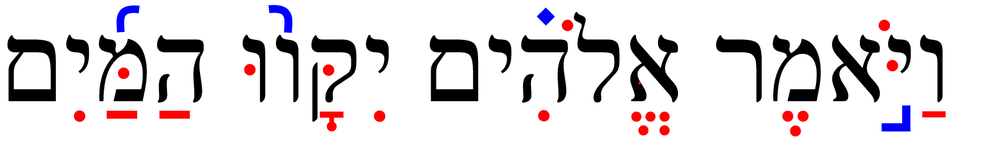
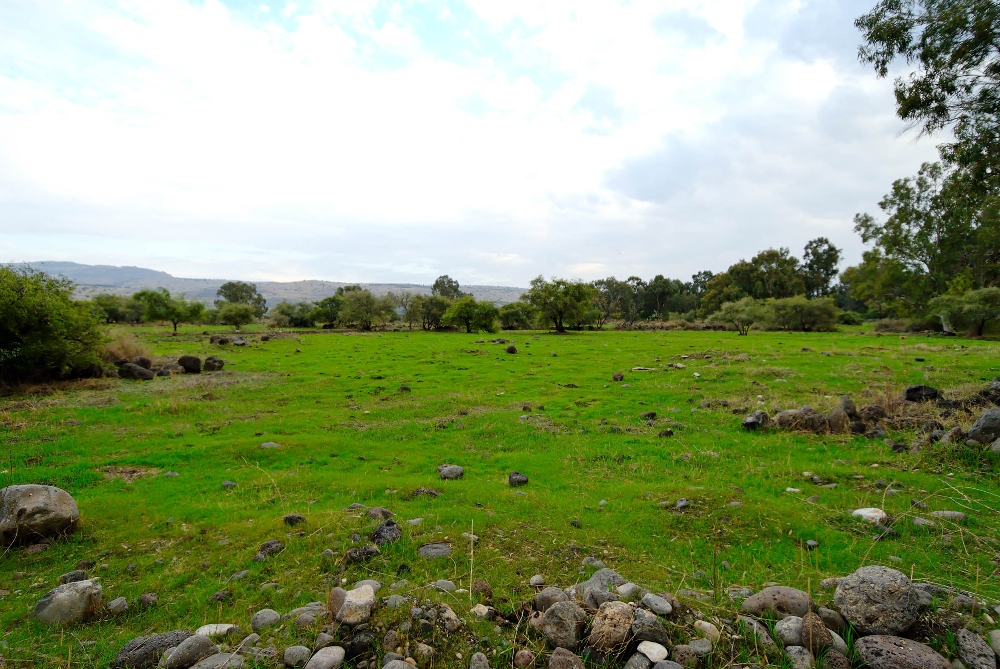
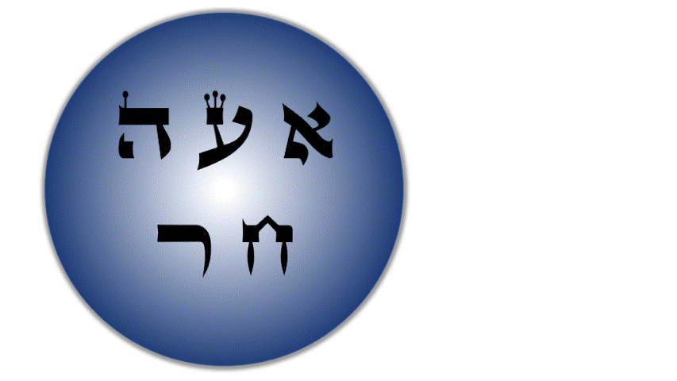

# Hebrew Vowels {.vowels}

> To comprehend Biblical Hebrew, we must understand how words are formed and pronounced

Even though our goal may not necessarily be to converse in Biblical Hebrew, hearing the sound of the language aids our learning.  Vowels are what give a language its distinctive sound.  In Hebrew, the same three consonants can change meaning depending on the vowel combination.


```{r, out.width = "600pt", fig.align='center'}
library(knitr)

```

As Izzy says in Hebrew Quest, “Vowels are important.”  On your screen, you see Genesis 1:9.  The black font shows the text with no vowels. Over time, a group known as the Masorites developed the vowel notation we use today. These are the symbols in red.  These are usually under, but sometimes in the middle of or over the affected consonant. This vowel system intends to preserve the pronunciation passed down for centuries via the oral tradition. The Hebrew name for these diacritical dots and dashes is _nikudot_. The blue font shows additional cantillation marks, which synagogues use for chanting the verses.  These marks also show where the word's accent is.<small>^[<small>Image Source: Originally uploaded as en:File:Example of biblical Hebrew trope.svg on 04:27, 19 November 2006 (UTC) by en:User:SyntaxError55. </small>]</small>

::: {.infobox .map}
**LESSON ITINERARY**

1. Memorize vowels that are not vowel letters
1. Learn vocal Sheva and silent Sheva
1. Memorize the vowel letters
1. Meet "defective" and "plene" spelling 
1. Meet Dagesh Lene's twin, Dagesh Forte
1. Know the rule for a Dagesh Forte
1. Know that the Gutturals and Resh reject Dagesh Forte
::: 

::: {.infobox .stop}
**EQUIPMENT CHECK**

Before continuing, can you recite the following groups of letters from memory?

* All twenty-two consonants of the Hebrew Aleph-Bet 
* The six BeGaD KePHaT letters
* The five KiMNePaTZ letters
* The four guttural letters and the one sometimes-guttural letter
:::

## First Thought {-}

###  הֵמָּה רָאוּ מַעֲשֵׂי יְהוָה {-}

*They have seen the works of Adonai (Psalms 107:24)*

Reflect on the works of HaShem that you have seen.

<figure>
    <figcaption>Listen to this verse in Hebrew, then say it out loud:</figcaption>
    <audio
        controls controlsList="nodownload"
        src="./images/02.ps107024.mp3">
            Your browser does not support the
            <code>audio</code> element.
    </audio>
</figure>

*****

```{r, out.width = "600pt", fig.align='center', fig.cap="Plain of Bethsaida - suggested location where 5000 saw the works of Yeshua (Mark 6). Courtesy of the [Pictorial Library of Bible Lands](https://www.bibleplaces.com)"}


``` 


## Vowels that are not vowel letters {#vowels}

### Vowels come in three types: Long, Short, Reduced | Vowels come in five classes: A, E, I, O, U {-}

* Like we memorized the Aleph-bet, we will commit the vowels in the table below to memory
* Study the table below before doing the drills in `Anki` 
  * Knowing the vowel types (Long, Short, Reduced) and classes will make your grammatical life much more comfortable in the future
  * The letter בּ is provided as a placeholder for the long/short vowels; ע represents any Guttural for the reduced vowels, since only Gutturals take the Reduced vowels
* Say the vowel _after_ saying the associated consonant<small>^[<small>We will learn that Hebrew loves to break the rules.  In the next lesson, we will learn about an exception to the "vowel comes after" rule, called the *furtive patach*.</small>]</small> So the first vowel example is "qaw" not "awq".
*  Future lessons will explain the difference between Qamets and Qamets Hatuf

Another table to memorize:

```{r, out.width = "300pt", fig.align='center'}

knitr::include_graphics("images/02.vowels_not_letters.png")
```

::: {.infobox .info}
Only **gutturals** take the "Hateph" vowels - to make it easier, we can pronounce all three Hateph vowels like the A in <u>A</u>muse

Hateph vowels are used because Gutturals reject vocal Sheva 
:::


## Vocal and Silent Sheva {#Sheva}

* The Sheva can be tricky to grasp at first, since vocal and silent Sheva are written the same, but have two very different uses
* Both are written as קְ
  * Both mark the END of a syllable
* VOCAL Sheva<small>^[<small>Many academic textbooks will use the term "Shewa" instead of "Sheva". Both words mean the same thing.</small>]</small> is a REDUCED vowel, but does NOT have a vowel Class
  *  Only non-gutturals can take a Vocal Sheva
      * Gutturals **reject** the Vocal Sheva and take the Hateph vowels instead
    * Pronounced like the A in <u>A</u>muse (same as Hateph Patach)
* SILENT Sheva is not a reduced vowel, in fact, it is NOT A VOWEL AT ALL
    * <u>Any</u> letter, including Gutturals can take a Silent Sheva
    * Silent/ No sound
* We will learn how to distinguish between the two kinds of Sheva in the next lesson

Type | Class | Hebrew | Name | Pronunciation
| :-: | :-: | :-: | :-: | :-: 
Reduced | No Class | <span class="he">ְבּ</span> | Vocal Sheva | amuse
Not a Vowel | | <span class="he">ְבּ</span> | Silent Sheva | No pronunciation

::: {.box .info}
The Sof Pasuq

* It is worth pointing out that in Hebrew Bibles, we may come across a mark that looks like a super-sized Sheva
* In English, we might say it looks like a giant colon mark (:)
* In Hebrew, this mark is called a Sof Pasuq, and it is used to mark the end of the verse
* Other than this, the mark has no meaning for us whatsoever.  You may ignore it when you encounter it.
:::

## Vowel letters {#vowel_letters}

### Vowel letters use a consonant plus a nikkud to form a vowel {-}

Another table to memorize:

```{r, out.width = "300pt", fig.align='center'}

include_graphics("images/02.vowels_letters.png")
```

* Shureq is pronounced like Qibbuts (r<u>u</u>ler)
* Hireq Yod is pronounced like the i in mach<u>i</u>ne
* All others are pronounced like their non-vowel-letter counterparts
* Yod and Vav vowels - י,ו 
    * These are Long Vowels that do not reduce
    * Therefore they are called, "Unchangeable long vowels"<small>^[<small>We'll explain what this means in the next lesson</small>]</small>
    * These occur in the middle or at the end of a word

::: {.infobox .info}
If the Yod or Vav has a vowel of it's own, then the Yod/Vav is acting as a _consonant_, not an irreducible long vowel.
:::

* Hei Vowels - ה
    * Seghol Hei is a short vowel - the other Hei vowels are long
    * Hei vowels **ONLY** occur at the end of a word (often called "word-final hei")
    * Hei vowels are extremely common in Hebrew

## Transliteration Shorthand

* Most Hebrew grammar books include transliteration values
* While learning the transliteration scheme can help in some instances, our general position is that it can be an unnecessary distraction
* Where it can be useful is as shorthand
  * It would get wordy to write "holem vav" repeatedly
  * It's much less clutter to write the shorthand version based on transliteration: $\hat O$
* As we move forward in the course, particularly in unit three, we will be making use of the vowel shorthand listed below

::: {.map. info}

* Short Vowels (no marking): $A$ for Patach, $E$ for Seghol, and so forth for the remaining short vowels
* Long Vowels (bar): $\bar A$ for Qamets, $\bar E$ for Tsere, and $\bar O$ for Holem
* Reduced Vowels (breve): $\breve A$ for Hateph Patach, $\breve E$ for Hateph Seghol, $\breve O$ = Hateph Qamets Hatuf
* Unchangeable Long Vowels (hat): $\hat E$ = Tsere+Yod, $\hat I$ = Hireq_+Yod; $\hat O$ = Holem+Vav; $\hat U$ = Shureq
* Additionally, the ending Qamets+He = $\hat A$ and Sheva = $ə$

:::

You do NOT need to memorize this.  We will review the values as we get into Unit 3.

## "Defective" and "plene" spelling {#defective_spelling}

In "defective" spelling, letter vowels can sometimes drop their letter and take on the corresponding non-letter vowel. The meaning of the word doesn’t change.

This is the word for "laws" showing both "plene" spelling (left) and "defective" spelling (right):

```{r, out.width = "300pt", fig.align='center'}


```

* Three vowel letters commonly take "defective" forms<small>^[<small>"Defective", in this sense, does not have a negative connotation.</small>]</small>
    * Holem-vav can drop the Vav and contract to Holem, as in the example above
    * Hireq-Yod can drop the Yod and contract to Hireq
    * Shuruq can drop the Vav and it's associated nikkud and contract to Qibbuts
    
The Qamets-Hei <span class="he">ה ָ  </span>sometimes drops the final ה, leaving just the Qamets under the now-final letter.

::: {.infobox .info}    
As you progress, you’ll start to develop a mental checklist when you encounter something that does not seem to follow the normal/regular rules. Asking yourself “Could this be a defective spelling?” will be one of those checklist items.
:::

::: {.box .caution}
An unchangeable long vowel written defectively is still an unchangeable long vowel


* A Qibbuts that is _not_ defective is a short vowel
* A Qibbuts that is a defective Shureq is an unchangeable long vowel

For now, do not be concerned about the difference.  As we progress in the course, you will see this in action.
:::

## The Dagesh Forte Doubles the Consonant {#dagesh_forte}

Notice the שּׁ in <span class="he">הַשָּׁמַיִם:</span>

```{r, out.width = "500pt", fig.align='center'}


```
 
* Since שׁ is not a בגד כפת letter, we know this *cannot* be a Dagesh Lene, but it is a Dagesh **Forte**
* The letter with the Dagesh Forte both ends one syllable and begins the next syllable
* If we were to syllabify <span class="he"> הַשָּׁמַיִם</span>, it would look something like the bottom line in the picture above (pronounce: `hash-sha-mayim`)<small>^[<small> `Mayim` is one syllable as we will learn in Lesson 3.  <span class="he">הַשָּׁמַיִם</span> means "the heavens."  From now on, we won't always provide a translation for every new word you encounter.  It's more important that you focus on the concepts.  You will have PLENTY of vocabulary work in Anki!</small>]</small>
* A similar word in English might be better = bet | ter
    * If we were to transliterate better into Hebrew hypothetically,  it might look like: בּטֶּר*<small>^[<small>The * means this is not a real Hebrew word, but we show it in this form for illustration.</small>]</small>
* Notice the syllable breaks in these words that have a Dagesh Forte:
```{r, out.width = "200pt", fig.align='center'}

include_graphics("images/02.forte.png")
```
* Any consonant (except for Gutturals and Resh) can take a Dagesh Forte, including a בגד כפת letter, which can take either a Dagesh Lene or a Dagesh Forte
    * The "Buck-up" letters will take the **hard** pronunciation regardless of a Dagesh Lene or Dagesh Forte - See the final word אַתָּה in the image above
    * "Any consonant" includes the Vav ו.  When a Vav has a Dagesh Forte it looks like this וּ. Does that remind you of anything?  Maybe something we just discussed on the previous page?
        * That's right. A Vav with a Dagesh Forte וּ is identical to a Shurek וּ.
        * It's surprisingly easy to tell the difference: if there is an additional vowel either under or over the same letter, or if the preceding consonant has a vowel, the letter is a Vav with Dagesh.  A Shurek will _never_ have a separate vowel following or preceding.

_Advanced tip:_ When you see a Dagesh Forte, it often means that another letter has disappeared<small>^[<small>Not entirely unlike the English apostrophe in words like _can't_.</small>]</small>.  We will talk more about this later in the course.

::: {.infobox .info}
It's good to think of the Dagesh Forte as the "Doubling Dagesh" since it doubles the consonant and often changes a word's meaning.  

Conversely, we can think of the Dagesh Lene as the "Meaningless Dagesh", since it does not ever change a word's meaning
:::


## Dagesh Forte Rule {#dagesh_forte_in_bgdkpt}

::: {.infobox .light} 
A Dagesh is a Forte if, and only if, it's preceded by a vowel that is not a Sheva<small>^[<small>Remember we said in the introduction that content in "light" information boxes should usually be memorized.  You will want to memorize the Dagesh Forte rule.</small>]</small>
:::

That's it.  That's the rule<small>^[<small>Strictly speaking, there are exceptions.  We only have one in this course and we won't see it until Unit 4.</small>]</small>.  

Quiz yourself with these examples (answers below):

* <span class="he">אַתָּה</span> = Is the Dagesh preceded by a vowel that is not a Sheva?<small>^[<small>Yes, a patach. Dagesh Forte</small>]</small>
* <span class="he">בְּרֵאשִׁית</span> = Is the Dagesh preceded by a vowel that is not a Sheva?<small>^[<small>No. Dagesh Lene</small>]</small>
* <span class="he">עַל־פְּנֵי</span> = Is the Dagesh preceded by a vowel that is not a Sheva?<small>^[<small>No. Dagesh Lene.  The "hyphen" looking mark is called a Maqquef.  It has the same function as the Hyphen does in English.</small>]</small>
* <span class="he">מַבְדִּיל</span> = Is the Dagesh preceded by a vowel that is not a Sheva?<small>^[<small>No, it is preceded by a Sheva. Dagesh Lene.</small>]</small>
* <span class="he">מִתַּחַת</span>  = Is the Dagesh preceded by a vowel that is not a Sheva?<small>^[<small>Yes, a Hiriq. Dagesh Forte</small>]</small>


## Gutturals and Resh reject Dagesh Forte {#gutturals_reject_dagesh_forte}

* We said in Lesson One that the Gutturals don’t play nice with the other Hebrew Rules, and this rejection of the Dagesh Forte is one of those ways
* A Hebrew collision like this means something has to give. . . and the gutturals tend to get their way.
* It's like they have a force-field shielding them from other Hebrew grammar rules!

```{r, out.width = "600pt", fig.align='center', fig.cap="That's no moon.  That's a Guttural!"}


```

* A large chunk of any Hebrew grammar course involves learning to resolve these guttural entanglements

::: {.box .caution}
MAPPIQ

* You may see הּ. This dot is not a Dagesh, because we just learned that gutturals never take a Dagesh but what is called a Mappiq. 
* A word final ה is typically a vowel
* A Mappiq signifies that a word-final ה is a consonant, not a vowel
* We'll talk more about the mappiq in Lesson 6
:::

## Lesson Conclusion and Activities {-}

Congratulations on completing the vowels lesson.  Make sure you memorize the vowel classes, the Dagesh Forte rule, and the guttural behavior.  

We're about halfway through the first stage of the course on Hebrew Grammar Foundations.  Keep going! You're doing great!  After you finish all of the activities for this lesson, you can claim the first of our `Twelve Tribes Badges`. 

Take a moment to review the section headings on the left side of the screen before heading on to tackle the activities.


### Anki {-}

* `Lesson 02 A. Vocab`
* `Lesson 02 B. Grammar` 
* `Lesson 02 D. Study Verses`
  * Bible verses will arrive next Lesson
  * In this module, we will be learning common Hebrew names.
  * Sound out the words using your knowledge of Hebrew consonants and vowels.
  * As a general hint, with a couple of exceptions, the English names are pretty close to how they sound in Hebrew.
  
Access Anki using your mobile app, desktop version, or [the web-based version (login may be required)](https://ankiweb.net/decks/)


### Vowel worksheet {-}

* Practice writing the vowels using the [Vowel Writing worksheet/drill](https://drive.google.com/file/d/1ETPKE3u-XGfpNdKmlIr3P_DRbkOOlcI_/copy){target="_blank"}. See note<small>^[<small>An answer key is on page two.  Repeat this worksheet until you can complete it correctly entirely from memory. The translation column is optional.</small>]</small>


## Ruth Pursuit {-}

::: {.box .map}
YOUR QUEST

1. Identify the four UNCHANGEABLE LONG vowels that use YOD in Verse 1 (blue)<small>^[<small>In most word processors, you won't be able to isolate the vowel to highlight. Get as close as you can.</small>]</small>|
2. Identify the two UNCHANGEABLE LONG vowels that use VAV in Verse 1 (Green)
3. Identify QAMETS HEI in Verse 1.  There is a TSERE Hei between Verses 5-10.  Can you find it?<small>^[<small>The other vowels that use hei are less common, but we will see them when we discuss verbs.</small>]</small> (Purple)
4. Identify the three LONG vowels in Verse 1 (that are not part of a vowel letter) (pink)|
5. Identify three of the five SHORT vowels in Verse 1 (that are not part of a vowel letter)<small>^[<small>We haven't learned to spot Qamets Hatuf yet, and Qibbuts does not appear in this passage</small>]</small> (red)
6. Five the three REDUCED/HATEPHH vowels, including Hateph Qamets Hatuf<small>^[<small>You should be able to make out the word that has the Hateph Qamets Hatuph</small>]</small>.  They are in verses 2-4. (grey)
7. One of the more common verbs in the Tanach is <span class="he">וַיֹּאמֶר</span>, which means "(and) he said.     * Vav-Patach-**Yod**-Dagesh Forte --וַיּ to start a verb means "And he (did or was something)  
    * If we change the second consonant from a Yod to a **Tav**, we get --וָתּ, "and **S**he (did or was something).  
    * Thus, <span class="he">וַתֹּאמֶר</span> means "and she said."  
    * Challenge: Find the five instances of <span class="he">וַתֹּאמֶר</span> in Ruth Chapter 1<small>^[<small>In at least three of the cases, you should be able to figure out who is speaking.</small>]</small>  (yellow)  
:::

* [Blank copy of Ruth Chapter 1](https://docs.google.com/document/d/1bcT1J-fcVmD1Zn5Jk2nj0560tEddcgtbYZLkwaVVuyE/copy){target="_blank"}
* [Ruth Pursuit Answer Key #2](./images/02_Ruth_Pursuit_KEY.pdf){target="_blank"}
* Update your Ruth Translation worksheet with <span class="he">וַתֹּאמֶר</span> = "and she said"        

## Quest Quiz {-}

[Open Quest Quiz #2 in a new window](https://docs.google.com/forms/d/e/1FAIpQLSeq_9Cy5IlAKDFy8nx9GNC3dfs5l5bJ_iX2FJ0Az7rPKXq5Jw/viewform){target="_blank"}


<div class="containerLet">
<iframe class="responsive-iframe" src="https://docs.google.com/forms/d/e/1FAIpQLSeq_9Cy5IlAKDFy8nx9GNC3dfs5l5bJ_iX2FJ0Az7rPKXq5Jw/viewform?embedded=true" frameborder="0"></iframe>
</div>

## Claim your `Twelve Tribes Badge`! {- #twelve-tribes-badge-1}

If you have completed **all activities** in Lessons 1 and 2, you may claim the first of our "Twelve Tribes" badges<small>^[<small>Once published, the full thirty-five lesson course will have a badge to be claimed after every two to three lessons.  There is only one badge available in the preview version of the course.</small>]</small>.

<div class="containerLet">
<iframe class ="responsive-iframe" src="https://docs.google.com/forms/d/e/1FAIpQLSeFujHNSMAZ5ZjJbNsr7pFJnma5RGwG-7StAR1uvevGe_5zvg/viewform?embedded=true" frameborder="0"></iframe>
</div>
