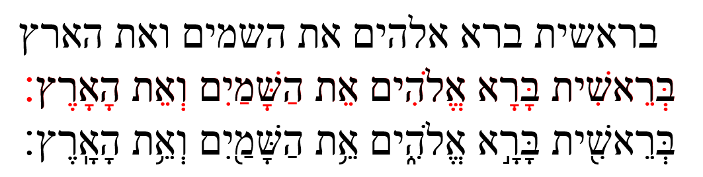

# Vowels {.vowels}

>And what is required first of all for training men for such a ministry is that the book should be given them in its very words [Hebrew, Aramaic, and Greek] as it has come from God's hand and in the fullness of its meaning, as that meaning has been ascertained by the labors of generations of men of God who have brought to bear upon it all the resources of sanctified scholarship and consecrated thought.”
---B. B. Warfield (@warfield2007bobhg)

<br>

```{r, out.width = "500px", fig.align='center'}


```
^[As Izzy says in Hebrew Quest, “Vowels are important.”  On your screen, you see three different versions of Genesis 1:1.  The top line has no vowels. Over time, vowel notation was developed by the Masorites - these are the symbols in the middle line in red that are usually under, but sometimes in the middle of, or over the affected consonant to preserve the pronunciation passed down for centuries via the oral tradition. The Hebrew name for these dots and dashes is _nikudot_. The third line has additional accent marks, which are used for accents which we’ll discuss on the next lesson and also for chanting the verses.]

### Lesson 2 Practical Preparation {-}

1. Memorize the Nikkudot/vowel symbols
1. Memorize the vowel letters
1. Learn the difference between vocal and silent sheva
1. Meet Daghesh Lene's twin, Daghesh Forte
1. See how the Gutturals and Resh reject Daghesh Forte
1. Understand differences between "seminary" and "Sephardic" pronunciation of vowels
1. Meet "defective" and "plene" writing 


## Memorize the Nikkudot/vowel symbols {-}

This is one of those things that you are just going to have to memorize, so we'll dispense with a lot of words and get right to it.  Here is a table of the vowel nikkudot

## Memorize the vowel letters {-}

## Learn the difference between vocal and silent sheva {-}

## Meet Daghesh Lene's twin, Daghesh Forte {-}

## See how the Gutturals and Resh reject Daghesh Forte {-}

## Understand differences between "seminary" and "Sephardic" pronunciation of vowels {-}

## Meet "defective" and "plene" writing {-}