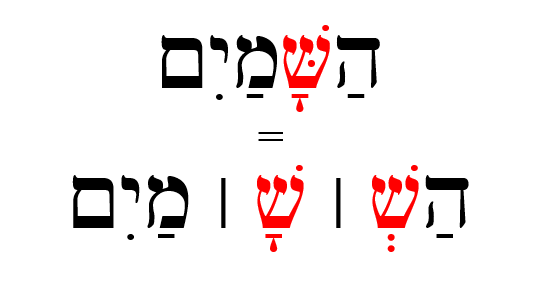

# Hebrew Vowels {.vowels}

>And what is required first of all for training men for such a ministry is that the book should be given them in its very words [Hebrew, Aramaic, and Greek] as it has come from God's hand and in the fullness of its meaning, as that meaning has been ascertained by the labors of generations of men of God who have brought to bear upon it all the resources of sanctified scholarship and consecrated thought.”
---B. B. Warfield^[Warfield, Benjamin Breckenridge. “The Languages of Pastoral Ministry.” In Basics of Biblical Hebrew: Grammar, edited by Gary D Pratico and Miles V Van Pelt. Grand Rapids, MI: Zondervan. 2007.  
B.B. Warfield was a Presbyterian minister and professor of theology at Princeton Seminary from 1887 to 1921. ([wikipedia link](https://en.wikipedia.org/wiki/B._B._Warfield))]

<br>

```{r, out.width = "500px", fig.align='center'}
library(knitr)

```
^[As Izzy says in Hebrew Quest, “Vowels are important.”  On your screen, you see Genesis 1:9.  The black font shows the text with no vowels. Over time, vowel notation was developed by the Masorites - these are the symbols in red that are usually under, but sometimes in the middle of, or over the affected consonant to preserve the pronunciation passed down for centuries via the oral tradition. The Hebrew name for these diacritical dots and dashes is _nikudot_ . The blue font shows additional cantillation marks, which are used for chanting the verses.  These marks also show where the word's accent is.  
  Image Source: Originally uploaded as en:File:Example of biblical Hebrew trope.svg on 04:27, 19 November 2006 (UTC) by en:User:SyntaxError55. ]

## Seven Practical Points for Lesson 2 {-}

1. [Memorize vowels that are not vowel letters](#two_1)
1. [Learn vocal sheva and silent sheva](#two_2)
1. [Memorize the vowel letters](#two_3)
1. [Meet "defective" and "plene" writing](#two_4) 
1. [Meet Daghesh Lene's twin, Daghesh Forte](#two_5)
1. [Know the rule for a Daghesh mark in a בגד כפת letter](#two_6) 
1. [Know that the Gutturals and Resh reject Daghesh Forte](#two_7)

[Lesson 2 ACTIVities](#two_8)

## Equipment Check {-}

```{r, out.width = "300px", fig.align='center'}

include_graphics("images/stopil.svg")
```
Before continuing, can you name the following letters?

* The twenty-two Aleph-Bet letters
* The four BeGaD KePHaT letters
* The five KiMNePaTZ letters
* The four guttural letters and the one sometimes-guttural letter

## Memorize vowels that are not vowel letters {#two_1}

> Vowels come in three types: Long, Short, Reduced\
Vowels come in five classes: A, E, I, O, U

Like the Aleph-bet, we are simply going to have to commit the table below to memory

* The letter בּ is provided as a placeholder
* Say the vowel _after_ saying the associated consonant^[We will learn that Hebrew loves to break rules.  In the next lesson we will learn about an exception to the "vowel comes after" rule, called the *furtive patach*.] So the first vowel example is "baw" not "awb".

```{r, out.width = "500px", fig.align='center'}

include_graphics("images/02.vowels_not_letters.png")
```


Notes:

* Future lessons will explain the difference between Qamets and Qamets Hatuf
* Only **gutturals** take the "Hateph" vowels - to make it easier, we can pronounce all three Hateph vowels like the A in <u>A</u>muse
* You might see Kibbuts, Kibbutz, Qibbutz, and Qibbuts used interchangeably


## Learn vocal sheva and silent sheva {#two_2}

> Both are written as: בְּ\
VOCAL Sheva is a REDUCED vowel / SILENT Sheva is NOT A Vowel


* Vocal Sheva^[Most academic textbooks will use the term "shewa" instead of "sheva".]
    * Only non-gutturals can take a Vocal Sheva
    * Pronounced like tthe A in <u>A</u>muse (same as Hateph Pathach)
    * Is a REDUCED Vowel
* Silent Sheva    
    * Any letter can take a Silent Sheva
    * Silent/ No sound
    * Is NOT A Vowel
* Both Sheva mark the end of a syllable
* We will learn how to distinguish between the two kinds of sheva in the next lesson

## Memorize the vowel letters {#two_3}

### Vowel letters use a consonant plus a nikkud to form a vowel {-}

Another table to memorize:

```{r, out.width = "500px", fig.align='center'}

include_graphics("images/02.vowels_letters.png")
```

* Shureq is pronounced like Qibbuts (r<u>u</u>ler)
* Hireq Yod is pronounced like the i in mach<u>i</u>ne
* All others are pronounced like their non-vowel-letter counterparts
* Yod and Vav vowels
    * These are Long Vowels that do not reduce
    * Therefore they are called "irreducible (unchangeable) long vowels"^[We'll explain what this means in the next lesson]
    * These occur in the middle or at the end of a word
* Hey Vowels
    * Seghol Hei is a short vowel - the other Hei vowels are long
    * Hei vowels **ONLY** occur at the end of a word 
    * Hei vowels are extremely common in Hebrew


## "Defective" and "plene" writing {#two_4}

### In "defective" writing, letter vowels can sometimes drop their letter and take on the corresponding non-letter vowel. The meaning of word doesn’t change. {-}

This is the word for "laws" showing both "plene" spelling (left) and "defective" spelling (right):

```{r, out.width = "500px", fig.align='center'}


```

* Three vowel letters can take "defective" forms^["Defective", in this sense, does not have a negative connotation.]
    * Hireq-Yod can drop the Yod and contract to Hireq
    * Holem-vav can drop the Vav and contract to Holem, as in the example above
    * Shuruq, can drop the Vav and it's associated nikkud and contract to Qibbuts
    
Over time, you’ll start to develop a mental checklist when you encounter something that doesn’t make sense. “Could this be a defective spelling?” will be one of those checklist items.

## Meet Daghesh Lene's twin, Daghesh Forte {#two_5}

### A Daghesh Forte doubles the consonant {-}

Notice the שּׁ in הַשָּׁמַיִם:

```{r, out.width = "300px", fig.align='center'}


```
 
* Since שׁ is not a בגד כפת letter, we know this *cannot* be a Daghesh Lene, but it is a Daghesh **Forte**
* The letter with the Daghesh Forte both ends one syllable and begins the next syllable
    * If we were to syllabify הַשָּׁמַיִם, it would look something like the bottom line in the picture above (pronounce: hash-sha-mayim^[Mayim is one syllable as we will learn in Lesson 3.])^[הַשָּׁמַיִם means "the heavens".  Going forward, we won't always provide a translation for every new word you encounter.  It's more important that you focus on the concepts.  You will have PLENTY of vocabulary work in Anki!]
* A similar word in English might be better = bet | ter
    * If we were to hypothetically transliterate into Hebrew,  it might look like: בּטֶּר*^[The * means this is not a real Hebrew word, but is only given for illustration.]
* Notice the syllable breaks in these words that have a Daghesh Forte:
```{r, out.width = "200px", fig.align='center'}

include_graphics("images/02.forte.png")
```
* Any consonant (except for Gutturals and Resh) can take a Dagesh Forte, including בגד כפת letter, which can take either a Daghesh Lene or a Daghesh Forte
    * The "Buck-up" letters will take the **hard** pronunciation regardless of a Daghesh Lene or Daghesh Forte
        * See the final word אַתָּה in the image above


## Daghesh Forte Rule {#two_6}

### "A Daghesh is a Forte if, and only if, it's preceeded by a vowel^[Remember the rule for the Daghesh Lene?  See Lesson 1.4] that is not a sheva." ---John Beckman {-}

That's it.  That's the rule^[Strictly speaking, there are exceptions, but you won't encounter them in a first-year Hebrew course].  

Examples:

* אַתָּה = Is the Daghesh preceeded by a vowel that is not a sheva?^[Yes, a pathach. Daghesh Forte]
* בְּרֵאשִׁית = Is the Daghesh preceeded by a vowel that is not a sheva?^[No. Daghesh Lene]
* עַל־פְּנֵי = Is the Daghesh preceeded by a vowel that is not a sheva?^[No. Daghesh Lene.  The "hyphen" looking mark is called a Maqquef.  It has the exact same function as the Hyphen does in English.]
* מַבְדִּיל = Is the Daghesh preceeded by a vowel that is not a sheva?^[No, it is preceeded by a sheva. Daghesh Lene.]
* מִתַּחַת  = Is the Daghesh preceeded by a vowel that is not a sheva?^[Yes, a Hiriq. Daghesh Forte]


## Gutturals and Resh reject Daghesh Forte {#two_7}

* We said in lesson one that the Gutturals don’t play nice with the other Hebrew Rules, and this rejection of the Daghesh Forte is one of those ways
* A Hebrew collision like this means something has to give - the gutturals tend to get their way
    * A large chunk of Hebrew GRAMMAR Quest will involve how to resolve these situations - more to come!

## Lesson 2 ACTIVities {#two_8}

* Physical
    * Anki Aerobics
        * Vocabulary - Learn (or relearn) the Vowels with Izzy 
        * Grammar - More vowel drills.  Learn the material in the "Vocabularly" deck really well and the "Grammar" deck should go smoother.
    * Worksheet
        * Practice writing the vowels using the [Vowel Writing worksheet/drill](https://drive.google.com/file/d/1ETPKE3u-XGfpNdKmlIr3P_DRbkOOlcI_/view?usp=sharing) See note^[ignore the "transliteration" column.  An answer key is on page two.  Repeat this worksheet until you can complete it correctly entirely from memory.]
* Spiritual
    * Anki Aerobics
        * Study-Verses - there is no translation yet but we will learn some very common Hebrew names that we will use when we get to the study verses
    * Ruth Pursuit [(blank copy)](https://drive.google.com/file/d/1qcfTKAlTJGChC2eYCMhSbY2w-ibzCcDV/view?usp=sharing)
        1. Identify the four UNCHANGEABLE LONG vowels that use YOD in Verse 1 (blue)^[In most word processors you won't be able to isolate the vowel to highlight. Just get as close as you can.]|
        2. Identify the two UNCHANGEABLE LONG vowels that use VAV in Verse 1 (Green)
        3. Identify QAMETS HEI in Verse 1.  There is a TSERE Hei between Verses 5-10.  Can you find it?^[The other vowels that use hei are less common, but we will see them when we discuss verbs.] (Purple)
        4. Identify the three LONG vowels in Verse 1 (that are not part of a vowel letter) (pink)|
        5. Identify three of the five SHORT vowels in Verse 1 (that are not part of a vowel letter)^[We haven't learned to spot Qamets Hatuf yet, and Qibbuts does not appear in this passage] (red)
        6. Five the three REDUCED/HATEPHH vowels, including Hateph Qamets Hatuf^[You should be able to make out the word that has the Hateph Qamets Hatuph].  They are in verses 2-4. (grey)
        7. One of the more common verbs in the Tanach is **וַיֹּאמֶר **, which means "(and) he said. 
            * Vav-Pathach-**Yod**-Daghesh Forte --וַיּ to start a verb means "And he (did or was something)  
            * If we change the second consonant from a Yod to a **Tav**, we get --וָתּ "and **S**he (did or was something).  
            * Thus, וַתֹּאמֶר  means "and she said".  
            * Challenge: Find the five instances of וַתֹּאמֶר in Ruth Chapter 1^[In at least three of the instances, you should be able to figure out who is speaking.]  (yellow)  
        * [Ruth Pursuit Answer Key #2](https://drive.google.com/file/d/1xtcXRb1PWbt-qkbVWW9yGfkC40_d8gtf/view?usp=sharing)