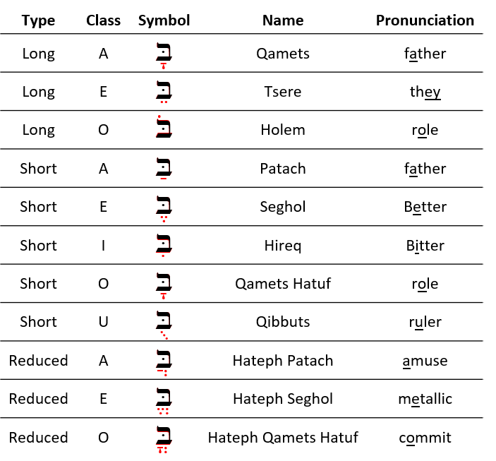

# Hebrew Vowels 

::: {.infobox .sound}
<figure> <audio id="myAudio" controls controlsList="nodownload" 
src="./images/02.intro.m4a"> 
Your browser does not support the <code>audio</code> element.</audio><button onclick="x25()" type="button">2.5x</button><button onclick="x2()" type="button">2x</button><button onclick="x15()" type="button">1.5x</button><button onclick="x1()" type="button">1x</button><button onclick="x075()" type="button">.75x</button><button onclick="x05()" type="button">.5x</button><script>
var x = document.getElementById("myAudio");
function x05() { 
    x.playbackRate = 0.5;
    x.play();}
function x075() { 
    x.playbackRate = 0.75;
    x.play();} 
function x1() { 
    x.playbackRate = 1;
     x.play();}
function x15() { 
    x.playbackRate = 1.5;
     x.play();} 
function x2() { 
    x.playbackRate = 2;
     x.play();} 
function x25() { 
    x.playbackRate = 2.5;
     x.play(); } 
</script></figure>
:::

> To comprehend Biblical Hebrew, we must understand how words are formed and pronounced

As Izzy says in _Hebrew Quest_, “vowels are important!”  Even though our goal may not necessarily be to converse in Biblical Hebrew, hearing the language's sound aids our learning.  Vowels are what give a language its distinctive sound, and are what give words their meaning.  Consider the simple English words "bay," "boy," and "buy."  These words have identical consonants but mean very different things because of the different vowels.  It is the same with Hebrew.


```{r, out.width = "600pt", fig.align='center'}
library(knitr)
include_graphics("images/02.Gen0109.png")
```

Above, you see Genesis 1:9.  The black font shows the text with no vowels. This is how the Hebrew Bible was originally written.  Over time, a group known as the Masorites developed the vowel notation we use today. These are the symbols in red.  These are usually under, but sometimes in the middle of or over the affected consonant. This vowel system intends to preserve the pronunciation passed down for centuries via the oral tradition. The Hebrew name for these diacritical dots and dashes is _nikudot_ which is the plural form of the word _nikkud_. The blue font shows additional cantillation marks, which synagogues use for chanting the verses.  These marks also show where the word's accent is.^[Image Source: Originally uploaded as en:File:Example of biblical Hebrew trope.svg on 04:27, 19 November 2006 (UTC) by en:User:SyntaxError55. ]  We will talk more about Cantillation marks in Unit 3.

::: {.infobox .map}
**LESSON ITINERARY**

1. Memorize vowels that are not vowel letters
1. Learn Vocal Sheva and Silent Sheva
1. Memorize the vowel letters
1. Meet "defective" and "plene" spelling 
1. Meet Dagesh Lene's twin, Dagesh Forte
1. Know the rule for a Dagesh Forte
1. Know that the Gutturals and Resh reject Dagesh Forte
::: 

::: {.infobox .stop}
**EQUIPMENT CHECK**

Before continuing, be sure you can recite the following groups of letters from memory.  These are concepts we learned in Lesson 1 and we just want to make sure we are ready to proceed to Lesson 2:

* All twenty-two consonants of the Hebrew Aleph-Bet 
* The six BeGaD KePHaT letters
* The five KiMNePaTZ letters
* The four guttural letters and the one sometimes-guttural letter
* The ten SQiN eM LeVY letters

:::

## First Thought {-}

::: {.infobox .sound}
<figure> <audio id="myAudio" controls controlsList="nodownload" 
src="./images/02.ps107024.mp3">
Your browser does not support the <code>audio</code> element.</audio><button onclick="x25()" type="button">2.5x</button><button onclick="x2()" type="button">2x</button><button onclick="x15()" type="button">1.5x</button><button onclick="x1()" type="button">1x</button><button onclick="x075()" type="button">.75x</button><button onclick="x05()" type="button">.5x</button><script>
var x = document.getElementById("myAudio");
function x05() { 
    x.playbackRate = 0.5;
    x.play();}
function x075() { 
    x.playbackRate = 0.75;
    x.play();} 
function x1() { 
    x.playbackRate = 1;
     x.play();}
function x15() { 
    x.playbackRate = 1.5;
     x.play();} 
function x2() { 
    x.playbackRate = 2;
     x.play();} 
function x25() { 
    x.playbackRate = 2.5;
     x.play(); } 
</script></figure>
:::

::: {.box .light}
* Listen to the verse in Hebrew
* Practice speaking until you can pronounce just like Izzy
:::


###  <span class="he">הֵמָּה רָאוּ מַעֲשֵׂי יְהוָה</span> {-}

*They have seen the works of Adonai (Psalms 107:24)*

Reflect on the works of HaShem that you have seen!


```{r, out.width = "600pt", fig.align='center', fig.cap="Plain of Bethsaida - suggested location where 5000 saw the works of Yeshua and were fed (Mark 6). Courtesy of the [Pictorial Library of Bible Lands](https://www.bibleplaces.com)"}

knitr::include_graphics("images/02-Plain of Bethsaida with green grass, tb110206630.jpg")
``` 

<!-- 2.1 -->

## _Hebrew Quest_ Vowels Lecture

::: {.infobox .sound}
<figure> <audio id="myAudio" controls controlsList="nodownload" 
src="./images/02.1.m4a"> 
Your browser does not support the <code>audio</code> element.</audio><button onclick="x25()" type="button">2.5x</button><button onclick="x2()" type="button">2x</button><button onclick="x15()" type="button">1.5x</button><button onclick="x1()" type="button">1x</button><button onclick="x075()" type="button">.75x</button><button onclick="x05()" type="button">.5x</button><script>
var x = document.getElementById("myAudio");
function x05() { 
    x.playbackRate = 0.5;
    x.play();}
function x075() { 
    x.playbackRate = 0.75;
    x.play();} 
function x1() { 
    x.playbackRate = 1;
     x.play();}
function x15() { 
    x.playbackRate = 1.5;
     x.play();} 
function x2() { 
    x.playbackRate = 2;
     x.play();} 
function x25() { 
    x.playbackRate = 2.5;
     x.play(); } 
</script></figure>
:::


View this 28:00 overview video from _Hebrew Quest_, then we will dig into the concepts in greater detail as we progress through the lesson^[As a reminder, you can speed up these videos by pressing the `gear` symbol, then adjusting the `Playback Speed`.].  You can disregard references to the "Hebrew Quest Student Manual" or "Essentials of Biblical Hebrew." Pertinent concepts have been incorporated into this Hebrew GRAMMAR Quest Guidebook. 

<div class="container">
<iframe class="responsive-iframe" src="https://www.youtube.com/embed/
MlfwNNuWgto?start=0&end=1675&rel=0&showinfo=0autohide=1&autoplay=1" frameborder="0"></iframe>
</div>

[Click to open video in a new tab](https://youtu.be/MlfwNNuWgto){target="_blank"}

* Start: 00:00
* End: 27:55

## Vowels that are not vowel letters: table

::: {.infobox .sound}
<figure> <audio id="myAudio" controls controlsList="nodownload" 
src="./images/02.2.m4a"> 
Your browser does not support the <code>audio</code> element.</audio><button onclick="x25()" type="button">2.5x</button><button onclick="x2()" type="button">2x</button><button onclick="x15()" type="button">1.5x</button><button onclick="x1()" type="button">1x</button><button onclick="x075()" type="button">.75x</button><button onclick="x05()" type="button">.5x</button><script>
var x = document.getElementById("myAudio");
function x05() { 
    x.playbackRate = 0.5;
    x.play();}
function x075() { 
    x.playbackRate = 0.75;
    x.play();} 
function x1() { 
    x.playbackRate = 1;
     x.play();}
function x15() { 
    x.playbackRate = 1.5;
     x.play();} 
function x2() { 
    x.playbackRate = 2;
     x.play();} 
function x25() { 
    x.playbackRate = 2.5;
     x.play(); } 
</script></figure>
:::

The table below lists the vowels that are not vowel letters.  This table MUST be memorized, including type and class as well as the name and symbol.

::: {.box .light}
* The Anki exercises will help us to commit this table to memory, so you don't necessarily need to drop everything and memorize the table below!
* Review the table and get familiar with it; then review the discussion points on the next slide
:::

* The letter בּ is provided as a placeholder
* Say the vowel _after_ saying the associated consonant^[We will learn that Hebrew loves to break the rules.  In the next lesson, we will learn about an exception to the "vowel comes after" rule, called the *furtive patach*.]. 
  * So, the first vowel example is "baw" not "awb."

```{r, out.width = "600pt", fig.align='center'}


```


## Vowels that are not vowel letters: discussion


::: {.infobox .sound}
<figure> <audio id="myAudio" controls controlsList="nodownload" 
src="./images/02.3.m4a"> 
Your browser does not support the <code>audio</code> element.</audio><button onclick="x25()" type="button">2.5x</button><button onclick="x2()" type="button">2x</button><button onclick="x15()" type="button">1.5x</button><button onclick="x1()" type="button">1x</button><button onclick="x075()" type="button">.75x</button><button onclick="x05()" type="button">.5x</button><script>
var x = document.getElementById("myAudio");
function x05() { 
    x.playbackRate = 0.5;
    x.play();}
function x075() { 
    x.playbackRate = 0.75;
    x.play();} 
function x1() { 
    x.playbackRate = 1;
     x.play();}
function x15() { 
    x.playbackRate = 1.5;
     x.play();} 
function x2() { 
    x.playbackRate = 2;
     x.play();} 
function x25() { 
    x.playbackRate = 2.5;
     x.play(); } 
</script></figure>
:::

### Vowels come in three types: Long, Short, Reduced | Vowels come in five classes: A, E, I, O, U {-}

* We memorized the Aleph-bet in Lesson 1, but this knowledge is incomplete without vowels
  * Make sure you can say the name and know how to write the specific vowels
  * We also must know the vowel types (Long, Short, Reduced) and classes (A, E, I, O, or U) 
  * This will make your grammatical life much more comfortable in the future
*   Only **gutturals** take the "Hateph" vowels - 
  * To make it easier, we can pronounce all three Hateph vowels like the A in <u>A</u>muse
  * Hateph vowels are used because Gutturals reject Vocal Sheva
  * We label the reduced O class, "Hateph Qamets Hatuf"
    * Note that other grammars may label this vowel, "Hateph Qamets"
    * Our label, "Hateph Qamets Hatuf," reminds us that this is the reduced O class, not to be confused with the A class Qamets, even though the symbols are the same
    *   A future section will explain the difference between Qamets and Qamets Hatuf
    * For now, remember Qamets is Long A and Qamets Hatuf is Short O


## Vocal and Silent Sheva

::: {.infobox .sound}
<figure> <audio id="myAudio" controls controlsList="nodownload" 
src="./images/02.4.m4a"> 
Your browser does not support the <code>audio</code> element.</audio><button onclick="x25()" type="button">2.5x</button><button onclick="x2()" type="button">2x</button><button onclick="x15()" type="button">1.5x</button><button onclick="x1()" type="button">1x</button><button onclick="x075()" type="button">.75x</button><button onclick="x05()" type="button">.5x</button><script>
var x = document.getElementById("myAudio");
function x05() { 
    x.playbackRate = 0.5;
    x.play();}
function x075() { 
    x.playbackRate = 0.75;
    x.play();} 
function x1() { 
    x.playbackRate = 1;
     x.play();}
function x15() { 
    x.playbackRate = 1.5;
     x.play();} 
function x2() { 
    x.playbackRate = 2;
     x.play();} 
function x25() { 
    x.playbackRate = 2.5;
     x.play(); } 
</script></figure>
:::


* The Sheva can be tricky to grasp at first since vocal and silent Sheva are written the same. They have two very different uses^[Many academic textbooks will use the term "Shewa" instead of "Sheva". Both words mean the same thing.].
* Both are written as קְ
  * Both types of a Sheva mark the END of a syllable
* VOCAL Sheva is a REDUCED vowel but does NOT have a vowel Class
  *  Only non-gutturals can take a Vocal Sheva
      * Gutturals **reject** the Vocal Sheva and take the Hateph vowels instead
    * Pronounced like the A in <u>A</u>muse (same as Hateph Patach)
* SILENT Sheva is not a reduced vowel. In fact, it is NOT A VOWEL AT ALL
    * <u>Any</u> letter, including Gutturals, can take a Silent Sheva
    * Silent/No sound
* We will learn how to distinguish between the two kinds of Sheva in the next lesson

Type | Class | Hebrew | Name | Pronunciation
| :-: | :-: | :-: | :-: | :-: 
Reduced | No Class | <span class="he">בְּ</span> | Vocal Sheva | amuse
Not a Vowel | | <span class="he">בְּ</span> | Silent Sheva | No pronunciation

::: {.box .info}
The Sof Pasuq

* It is worth pointing out that in Hebrew Bibles, we may come across a mark that looks like a super-sized Sheva
* In English, we might say it looks like a giant colon mark (:)
* In Hebrew, this mark is called a Sof Pasuq, and it is used to mark the end of the verse
* Other than this, the mark has no meaning for us whatsoever.  You may ignore it when you encounter it, except that you will know that it always marks the end of a verse.
:::


## Vowels: that are letters: table

::: {.infobox .sound}
<figure> <audio id="myAudio" controls controlsList="nodownload" 
src="./images/02.5.m4a"> 
Your browser does not support the <code>audio</code> element.</audio><button onclick="x25()" type="button">2.5x</button><button onclick="x2()" type="button">2x</button><button onclick="x15()" type="button">1.5x</button><button onclick="x1()" type="button">1x</button><button onclick="x075()" type="button">.75x</button><button onclick="x05()" type="button">.5x</button><script>
var x = document.getElementById("myAudio");
function x05() { 
    x.playbackRate = 0.5;
    x.play();}
function x075() { 
    x.playbackRate = 0.75;
    x.play();} 
function x1() { 
    x.playbackRate = 1;
     x.play();}
function x15() { 
    x.playbackRate = 1.5;
     x.play();} 
function x2() { 
    x.playbackRate = 2;
     x.play();} 
function x25() { 
    x.playbackRate = 2.5;
     x.play(); } 
</script></figure>
:::

* As Izzy mentioned in the _Hebrew Quest_ vowels segment, Hebrew has five consonants that can stand in for vowels
  * <span class="he">א, ע, ה, ו, י</span>
* א and ע simply take whichever applicable nikkud mark and are pronounced according to the vowel's sound
* ה, ו, י are slightly different, in that the consonant plus the vowel combines to form a single vowel unit
  * Note these vowels in the table below:
  
```{r, out.width = "600pt", fig.align='center'}

knitr::include_graphics("images/02.vowels_letters.png")
```


## Vowels that are letters: 

::: {.infobox .sound}
<figure> <audio id="myAudio" controls controlsList="nodownload" 
src="./images/02.6.m4a"> 
Your browser does not support the <code>audio</code> element.</audio><button onclick="x25()" type="button">2.5x</button><button onclick="x2()" type="button">2x</button><button onclick="x15()" type="button">1.5x</button><button onclick="x1()" type="button">1x</button><button onclick="x075()" type="button">.75x</button><button onclick="x05()" type="button">.5x</button><script>
var x = document.getElementById("myAudio");
function x05() { 
    x.playbackRate = 0.5;
    x.play();}
function x075() { 
    x.playbackRate = 0.75;
    x.play();} 
function x1() { 
    x.playbackRate = 1;
     x.play();}
function x15() { 
    x.playbackRate = 1.5;
     x.play();} 
function x2() { 
    x.playbackRate = 2;
     x.play();} 
function x25() { 
    x.playbackRate = 2.5;
     x.play(); } 
</script></figure>
:::


### Vowel letters use a consonant plus a nikkud to form a vowel {-}


* Shureq is pronounced like Qibbuts (r<u>u</u>ler)
* Hireq Yod is pronounced like the i in mach<u>i</u>ne (compared to Hireq (Short I), which is pronounced like "b<u>i</u>tter)
* The other vowel letters are pronounced like the corresponding vowel - Qamets Hei is pronounced like Qamets, and so forth
* All vowel letters, except Seghol Hei, are LONG
* Yod and Vav vowels - י,ו 
    * Not only are these Long vowels, they have a unique feature is that they are "immune" from "propretonic reduction"
    * Therefore they are called "Unchangeable long vowels" or sometimes "Irreducible long vowels"
    * We'll explain what this means in the next lesson
* Hei Vowels - ה
    * Hei vowels can **ONLY** occur at the END of a word
    * Hei vowels are extremely common in Hebrew
    * The Hei vowels are Long (except for Seghol Hei) but they are not labeled as irreducible/unchangeable^[Strictly speaking, this point is irrelevant as a vowel at the end of a word would never reduce anyway. But, if you are ever asked "are the Hei vowels irreducible/unchangeable?", the answer is "no."]

::: {.box .caution}
* Do not confuse "vowel reducing" with "defective spelling"
* Although unchangable long vowels CANNOT reduce, they CAN be written defectively
  * For example, what was originally <span class="he">בּוֹ</span> becomes <span class="he">בֹּ</span>
* We will discuss defective spelling next
:::


## "Defective" and "plene" spelling {#defective_spelling}

::: {.infobox .sound}
<figure> <audio id="myAudio" controls controlsList="nodownload" 
src="./images/02.7.m4a"> 
Your browser does not support the <code>audio</code> element.</audio><button onclick="x25()" type="button">2.5x</button><button onclick="x2()" type="button">2x</button><button onclick="x15()" type="button">1.5x</button><button onclick="x1()" type="button">1x</button><button onclick="x075()" type="button">.75x</button><button onclick="x05()" type="button">.5x</button><script>
var x = document.getElementById("myAudio");
function x05() { 
    x.playbackRate = 0.5;
    x.play();}
function x075() { 
    x.playbackRate = 0.75;
    x.play();} 
function x1() { 
    x.playbackRate = 1;
     x.play();}
function x15() { 
    x.playbackRate = 1.5;
     x.play();} 
function x2() { 
    x.playbackRate = 2;
     x.play();} 
function x25() { 
    x.playbackRate = 2.5;
     x.play(); } 
</script></figure>
:::


In "defective" spelling, letter vowels can sometimes drop their letter and take on the corresponding non-letter vowel. The meaning of the word does not change.

This is the word for "laws" showing both "plene" spelling and "defective" spelling.  Both spellings mean exactly the same thing: "laws" or "teachings".

```{r, out.width = "400pt", fig.align='center'}


```

* Vowel letters commonly take "defective" forms^["Defective", in this sense, does not have a negative connotation.]
* Holem-Vav can drop the Vav and contract to Holem, as in the example above
* Hireq-Yod can drop the Yod and contract to Hireq
* Shuruq can drop entirely and contract to Qibbuts - this sometimes catches students by surprise - see caution box below.
* The Qamets-Hei <span class="he">ה ָ  </span>sometimes drops the final ה, leaving just the Qamets under the now-final letter.

::: {.box .caution}
An unchangeable long vowel written defectively is still an unchangeable long vowel


* A Qibbuts that is _not_ defective is a short vowel
* A Qibbuts that is a defective Shureq is an unchangeable long vowel

For now, do not be concerned about the difference.  As we progress in the course, you will see this in action.
:::

::: {.infobox .info}    
If any of this is confusing now, as we've said before, hang in there!  As you progress in your knowledge of Hebrew, you’ll start to develop a mental checklist when you encounter something that does not seem to follow the regular rules. Asking yourself, “Could this be a defective spelling?” will be one of those checklist items.
:::


## Transliteration Shorthand

::: {.infobox .sound}
<figure> <audio id="myAudio" controls controlsList="nodownload" 
src="./images/02.8.m4a"> 
Your browser does not support the <code>audio</code> element.</audio><button onclick="x25()" type="button">2.5x</button><button onclick="x2()" type="button">2x</button><button onclick="x15()" type="button">1.5x</button><button onclick="x1()" type="button">1x</button><button onclick="x075()" type="button">.75x</button><button onclick="x05()" type="button">.5x</button><script>
var x = document.getElementById("myAudio");
function x05() { 
    x.playbackRate = 0.5;
    x.play();}
function x075() { 
    x.playbackRate = 0.75;
    x.play();} 
function x1() { 
    x.playbackRate = 1;
     x.play();}
function x15() { 
    x.playbackRate = 1.5;
     x.play();} 
function x2() { 
    x.playbackRate = 2;
     x.play();} 
function x25() { 
    x.playbackRate = 2.5;
     x.play(); } 
</script></figure>
:::


* Most Hebrew grammar books include transliteration values
* While learning the transliteration scheme can help in some instances, our general position is that it can be an unnecessary distraction
* Where it can be useful is as shorthand
  * It would get wordy to write "Holem Vav" repeatedly
  * It's much less clutter to write the shorthand version based on transliteration: $\hat O$
  * Often, the vowel marks in isolation can be difficult to detect; compare ֹ  with $\hat O$
* As we move forward in the course, particularly in unit three, we will be making use of the vowel shorthand listed below

::: {.box .info}

* Short Vowels (no marking): $A$ for Patach, $E$ for Seghol, $I$, Hireq, $O$ for Qamets Hatuf, and $U$, Qibbuts
* Long Vowels that are not letters (bar): $\bar A$ for Qamets, $\bar E$ for Tsere, and $\bar O$ for Holem
* Reduced Vowels (breve): $\breve A$ for Hateph Patach, $\breve E$ for Hateph Seghol, $\breve O$ = Hateph Qamets Hatuf
* Vowel letters (hat): $\hat E$ = Tsere+Yod^[Formal shorthand for Tsere+Hei, Seghol+Hei, and Seghol+Yod is also $\hat E$ but for this course, we will only use $\hat E$ for Tsere+Yod.], $\hat I$ = Hireq+Yod; $\hat O$ = Holem+Vav^[Formal shorthand for Holem+Hei is also $\hat O$ but for this course, we will only use $\hat O$ for Holem+Vav.], $\hat U$ = Shureq, and Qamets+Hei = $\hat A$^[Formal shorthand for Qamets+Yod is also $\hat A$ but for this course, we will only use $\hat A$ for Qamets+Hei.]
* Additionally, we have  Vocal Sheva = $ə$, and $:$ for Silent Sheva^[Vocal Sheva has a "hurried" pronunciation, like the _a_ in _amuse_ or _Tina_. ə is the [international character for this sound](https://en.wikipedia.org/wiki/Mid_central_vowel){target="_blank"}. Silent Sheva has no pronunciation transliteration value.]

:::

* We will use this shorthand frequently when we discuss verbs
* We will review the values again as we get into Unit 3

## The Dagesh Forte Doubles the Consonant {#dagesh_forte}

::: {.infobox .sound}
<figure> <audio id="myAudio" controls controlsList="nodownload" 
src="./images/02.9.m4a"> 
Your browser does not support the <code>audio</code> element.</audio><button onclick="x25()" type="button">2.5x</button><button onclick="x2()" type="button">2x</button><button onclick="x15()" type="button">1.5x</button><button onclick="x1()" type="button">1x</button><button onclick="x075()" type="button">.75x</button><button onclick="x05()" type="button">.5x</button><script>
var x = document.getElementById("myAudio");
function x05() { 
    x.playbackRate = 0.5;
    x.play();}
function x075() { 
    x.playbackRate = 0.75;
    x.play();} 
function x1() { 
    x.playbackRate = 1;
     x.play();}
function x15() { 
    x.playbackRate = 1.5;
     x.play();} 
function x2() { 
    x.playbackRate = 2;
     x.play();} 
function x25() { 
    x.playbackRate = 2.5;
     x.play(); } 
</script></figure>
:::


```{r, out.width = "500pt", fig.align='center'}

knitr::include_graphics("images/02.daghesh_forte.gif")
```
 

* Notice the dot in the שּׁ in <span class="he">הַשָּׁמַיִם:</span>
  * The dot is called a Dagesh FORTE - it is the Dagesh Lene's big brother
  * Since שׁ is not a בגד כפת letter, we know this *cannot* be a Dagesh Lene
* The letter with the Dagesh Forte both ends one syllable and begins the next syllable - in fact, a way to think of the Daghesh Forte is to call it the "doubling Daghesh"
* In <span class="he">הַשָּׁמַיִם:</span> is pronounced: `hash-sha-mayim`^[ `Mayim` is one syllable as we will learn in Lesson 3.  <span class="he">הַשָּׁמַיִם</span> means "the heavens."  From now on, we won't always provide a translation for every new word you encounter.  It's more important that you focus on the concepts.  You will have PLENTY of vocabulary work in Anki!]
* A similar word in English might be better = bet | ter
    * If we were to transliterate better into Hebrew hypothetically,  it might look like: בּטֶּר*^[The * means this is not a real Hebrew word, but we show it in this form for illustration.]
* Notice the syllable breaks in these words that have a Dagesh Forte:

```{r, out.width = "200pt", fig.align='center'}

include_graphics("images/02.forte.png")
```


## בגד כפת letters can take either a Dagesh Lene OR a Dagesh Forte

::: {.infobox .sound}
<figure> <audio id="myAudio" controls controlsList="nodownload" 
src="./images/02.10.m4a"> 
Your browser does not support the <code>audio</code> element.</audio><button onclick="x25()" type="button">2.5x</button><button onclick="x2()" type="button">2x</button><button onclick="x15()" type="button">1.5x</button><button onclick="x1()" type="button">1x</button><button onclick="x075()" type="button">.75x</button><button onclick="x05()" type="button">.5x</button><script>
var x = document.getElementById("myAudio");
function x05() { 
    x.playbackRate = 0.5;
    x.play();}
function x075() { 
    x.playbackRate = 0.75;
    x.play();} 
function x1() { 
    x.playbackRate = 1;
     x.play();}
function x15() { 
    x.playbackRate = 1.5;
     x.play();} 
function x2() { 
    x.playbackRate = 2;
     x.play();} 
function x25() { 
    x.playbackRate = 2.5;
     x.play(); } 
</script></figure>
:::

* Any consonant (except for Gutturals and Resh) can take a Dagesh Forte, including a בגד כפת letter
    * The "Buck-up" letters will take the **hard** pronunciation regardless of a Dagesh Lene or Dagesh Forte - See the final word אַתָּה in the previous section

_Advanced tip:_ When you see a Dagesh Forte, it often means that another letter has disappeared^[Not entirely unlike the English apostrophe in words like _can't_.].  We will talk more about this later in the course.

::: {.infobox .info}
It's good to think of the Dagesh Forte as the "Doubling Dagesh" since it doubles the consonant and often changes a word's meaning.  

Conversely, we can think of the Dagesh Lene as the "Meaningless Dagesh" since it does not ever change a word's meaning
:::


## The Easy Dagesh Forte Rule {#dagesh_forte_in_bgdkpt}

::: {.infobox .sound}
<figure> <audio id="myAudio" controls controlsList="nodownload" 
src="./images/02.11.m4a"> 
Your browser does not support the <code>audio</code> element.</audio><button onclick="x25()" type="button">2.5x</button><button onclick="x2()" type="button">2x</button><button onclick="x15()" type="button">1.5x</button><button onclick="x1()" type="button">1x</button><button onclick="x075()" type="button">.75x</button><button onclick="x05()" type="button">.5x</button><script>
var x = document.getElementById("myAudio");
function x05() { 
    x.playbackRate = 0.5;
    x.play();}
function x075() { 
    x.playbackRate = 0.75;
    x.play();} 
function x1() { 
    x.playbackRate = 1;
     x.play();}
function x15() { 
    x.playbackRate = 1.5;
     x.play();} 
function x2() { 
    x.playbackRate = 2;
     x.play();} 
function x25() { 
    x.playbackRate = 2.5;
     x.play(); } 
</script></figure>
:::

So how do you tell whether a Daghesh in a בגד כפת letter is Lene or Forte?

::: {.infobox .light} 
A Dagesh is a Forte if, and only if, it's preceded by a vowel that is not a Sheva^[Remember we said in the introduction that content in "light" information boxes should usually be memorized.  You will definitely want to memorize the Dagesh Forte rule.]
:::

That's it.  That's the rule^[Strictly speaking, there are exceptions.  We only have one in this course and we won't see it until Unit 4.].  

Quiz yourself with these examples (answers below):


* <span class="he">אַתָּה</span> = Is the Dagesh preceded by a vowel that is not a Sheva?^[Yes, a patach. Dagesh Forte]
* <span class="he">בְּרֵאשִׁית</span> = Is the Dagesh preceded by a vowel that is not a Sheva?^[No. Dagesh Lene]
* <span class="he">עַל־פְּנֵי</span> = Is the Dagesh preceded by a vowel that is not a Sheva?^[No. Dagesh Lene.  The "hyphen" looking mark is called a Maqquef.  It has the same function as the Hyphen does in English.]
* <span class="he">מַבְדִּיל</span> = Is the Dagesh preceded by a vowel that is not a Sheva?^[No, it is preceded by a Sheva. Dagesh Lene.]
* <span class="he">מִתַּחַת</span>  = Is the Dagesh preceded by a vowel that is not a Sheva?^[Yes, a Hiriq. Dagesh Forte]

## וּ is usually Shureq, but could be Vav with a Dagesh Forte

::: {.infobox .sound}
<figure> <audio id="myAudio" controls controlsList="nodownload" 
src="./images/02.12.m4a"> 
Your browser does not support the <code>audio</code> element.</audio><button onclick="x25()" type="button">2.5x</button><button onclick="x2()" type="button">2x</button><button onclick="x15()" type="button">1.5x</button><button onclick="x1()" type="button">1x</button><button onclick="x075()" type="button">.75x</button><button onclick="x05()" type="button">.5x</button><script>
var x = document.getElementById("myAudio");
function x05() { 
    x.playbackRate = 0.5;
    x.play();}
function x075() { 
    x.playbackRate = 0.75;
    x.play();} 
function x1() { 
    x.playbackRate = 1;
     x.play();}
function x15() { 
    x.playbackRate = 1.5;
     x.play();} 
function x2() { 
    x.playbackRate = 2;
     x.play();} 
function x25() { 
    x.playbackRate = 2.5;
     x.play(); } 
</script></figure>
:::

*   When a Vav has a Dagesh Forte, it looks like this וּ and, therefore, is identical to a Shureq וּ
*   It's surprisingly easy to tell the difference
*   A Shureq will _never_ have a separate vowel following or preceding
*   If the preceding consonant has a vowel, the וּ is a Vav with a Dagesh - that's the rule we just learned
*   Also, if there is an additional vowel either under or over the same letter, it can't be a Shureq as there are never two vowels in a row (and there is no diphthong involving a Shureq)
* Examples:
  * <span class="he">בוּ</span> = Shureq
  * <span class="he">בְוָּ</span> = Vav with Dagesh Forte - a Shureq would never take an additional vowel
  * <span class="he">בָוּ</span> = Vav with Dagesh Forte ־ the Rule of Sheva:  preceding letter has a vowel 
  * The last example is hypothetical only; generally, a Vav with the Dagesh Forte would have both a preceding vowel/Sheva AND an additional vowel/Sheva
  
::: {.box .info}

When you see <span class="he">וּ</span>, it is usually a Shureq

:::

* A similar situation happens with <span class="he">וֹ</span>
  * Consider the word, <span class="he>מִצְוֹת</span>
    * This is a consonantal Vav with a Holem, pronounced "vo"
    * The previous consonant has a Sheva ending the syllable; the next syllable cannot start with a vowel
    
    
## Gutturals and Resh reject Dagesh Forte {#gutturals_reject_dagesh_forte}

::: {.infobox .sound}
<figure> <audio id="myAudio" controls controlsList="nodownload" 
src="./images/02.13.m4a"> 
Your browser does not support the <code>audio</code> element.</audio><button onclick="x25()" type="button">2.5x</button><button onclick="x2()" type="button">2x</button><button onclick="x15()" type="button">1.5x</button><button onclick="x1()" type="button">1x</button><button onclick="x075()" type="button">.75x</button><button onclick="x05()" type="button">.5x</button><script>
var x = document.getElementById("myAudio");
function x05() { 
    x.playbackRate = 0.5;
    x.play();}
function x075() { 
    x.playbackRate = 0.75;
    x.play();} 
function x1() { 
    x.playbackRate = 1;
     x.play();}
function x15() { 
    x.playbackRate = 1.5;
     x.play();} 
function x2() { 
    x.playbackRate = 2;
     x.play();} 
function x25() { 
    x.playbackRate = 2.5;
     x.play(); } 
</script></figure>
:::

* We said in Lesson One that the Gutturals don’t play nice with the other Hebrew Rules, and this rejection of the Dagesh Forte is one of those ways
* A Hebrew collision like this means something has to give. . . and the gutturals tend to get their way.
* It's like they have a force-field shielding them from other Hebrew grammar rules!

```{r, out.width = "500pt", fig.align='center', fig.cap="That's no moon.  That's a Guttural!"}

knitr::include_graphics("images/02.reject.gif")
```

* A large chunk of any Hebrew grammar course involves learning to resolve these guttural entanglements

::: {.box .caution}
MAPPIQ

* You may see הּ. This dot is not a Dagesh because we just learned that gutturals never take a Dagesh but a Mappiq. 
* A word-final ה is typically a vowel
* A Mappiq signifies that a word-final ה is a consonant, not a vowel
* We'll talk more about the Mappiq in Lesson 7
:::

## Lesson Conclusion and Activities {-}

::: {.infobox .sound}
<figure> <audio id="myAudio" controls controlsList="nodownload" 
src="./images/02.conclusion.m4a"> 
Your browser does not support the <code>audio</code> element.</audio><button onclick="x25()" type="button">2.5x</button><button onclick="x2()" type="button">2x</button><button onclick="x15()" type="button">1.5x</button><button onclick="x1()" type="button">1x</button><button onclick="x075()" type="button">.75x</button><button onclick="x05()" type="button">.5x</button><script>
var x = document.getElementById("myAudio");
function x05() { 
    x.playbackRate = 0.5;
    x.play();}
function x075() { 
    x.playbackRate = 0.75;
    x.play();} 
function x1() { 
    x.playbackRate = 1;
     x.play();}
function x15() { 
    x.playbackRate = 1.5;
     x.play();} 
function x2() { 
    x.playbackRate = 2;
     x.play();} 
function x25() { 
    x.playbackRate = 2.5;
     x.play(); } 
</script></figure>
:::

Congratulations on completing the vowels lesson.  Make sure you memorize the vowel classes, the Dagesh Forte rule, and the guttural behavior.  

We're about halfway through the first stage of the course on Hebrew Grammar Foundations.  Keep going! You're doing great!  After you finish all of the activities for this lesson, you can claim the first of our `Twelve Tribes Badges`. 

Take a moment to review the section headings on the screen's left side before heading on to tackle the activities.


## Anki {-}

::: {.infobox .sound}
<figure> <audio id="myAudio" controls controlsList="nodownload" 
src="./images/02.anki.m4a"> 
Your browser does not support the <code>audio</code> element.</audio><button onclick="x25()" type="button">2.5x</button><button onclick="x2()" type="button">2x</button><button onclick="x15()" type="button">1.5x</button><button onclick="x1()" type="button">1x</button><button onclick="x075()" type="button">.75x</button><button onclick="x05()" type="button">.5x</button><script>
var x = document.getElementById("myAudio");
function x05() { 
    x.playbackRate = 0.5;
    x.play();}
function x075() { 
    x.playbackRate = 0.75;
    x.play();} 
function x1() { 
    x.playbackRate = 1;
     x.play();}
function x15() { 
    x.playbackRate = 1.5;
     x.play();} 
function x2() { 
    x.playbackRate = 2;
     x.play();} 
function x25() { 
    x.playbackRate = 2.5;
     x.play(); } 
</script></figure>
:::


* `Lesson 02 A. Vocab` 
  * You will be presented with the vowel symbol and you are to identify the name, type, and class of each vowel
  * There are also "reverse" cards where you will be given the name, type, and class, and you are to identify the symbol
* `Lesson 02 B. Grammar`  - the grammar section will look at vowels as groups, as well as test you on some other topics presented in this lesson
* `Lesson 02 C. Study Verses`
  * Bible verses will arrive next Lesson
  * In this module, we will be learning common Hebrew names
  * Sound out the words using your knowledge of Hebrew consonants and vowels
  * As a general hint, with a couple of exceptions, the English names are pretty close to how they sound in Hebrew
  
Access Anki using your mobile app, desktop version, or [the web-based version (login may be required)](https://ankiweb.net/decks/){target="_blank"}

We can't stress enough how important the Anki activities are.  Anki is where your learning will take place. Try to do a little each day.

## Vowel Writing Worksheet {-}

::: {.infobox .sound}
<figure> <audio id="myAudio" controls controlsList="nodownload" 
src="./images/02.vowel_worksheet.m4a"> 
Your browser does not support the <code>audio</code> element.</audio><button onclick="x25()" type="button">2.5x</button><button onclick="x2()" type="button">2x</button><button onclick="x15()" type="button">1.5x</button><button onclick="x1()" type="button">1x</button><button onclick="x075()" type="button">.75x</button><button onclick="x05()" type="button">.5x</button><script>
var x = document.getElementById("myAudio");
function x05() { 
    x.playbackRate = 0.5;
    x.play();}
function x075() { 
    x.playbackRate = 0.75;
    x.play();} 
function x1() { 
    x.playbackRate = 1;
     x.play();}
function x15() { 
    x.playbackRate = 1.5;
     x.play();} 
function x2() { 
    x.playbackRate = 2;
     x.play();} 
function x25() { 
    x.playbackRate = 2.5;
     x.play(); } 
</script></figure>
:::

* Practice writing the vowels using the [Vowel Writing worksheet/drill](./images/02_Vowel_drill.pdf){target="_blank"}
* An answer key is on page two
* Repeat this worksheet until you can complete it correctly entirely from memory at least once
* A note on transliteration
  * Note that our course uses Capital letters, while the answer key uses lower case letters
  * It is more important to make sure the long, short, reduced, and vowel letter marks are accurate
  * You may ignore transliteration for:
    * Tsere Hei / Seghol Hei / Holem Hay
    * Seghol Yod


## Ruth Pursuit {-}

::: {.infobox .sound}
<figure> <audio id="myAudio" controls controlsList="nodownload" 
src="./images/02.ruth.m4a"> 
Your browser does not support the <code>audio</code> element.</audio><button onclick="x25()" type="button">2.5x</button><button onclick="x2()" type="button">2x</button><button onclick="x15()" type="button">1.5x</button><button onclick="x1()" type="button">1x</button><button onclick="x075()" type="button">.75x</button><button onclick="x05()" type="button">.5x</button><script>
var x = document.getElementById("myAudio");
function x05() { 
    x.playbackRate = 0.5;
    x.play();}
function x075() { 
    x.playbackRate = 0.75;
    x.play();} 
function x1() { 
    x.playbackRate = 1;
     x.play();}
function x15() { 
    x.playbackRate = 1.5;
     x.play();} 
function x2() { 
    x.playbackRate = 2;
     x.play();} 
function x25() { 
    x.playbackRate = 2.5;
     x.play(); } 
</script></figure>
:::

::: {.box .map}
YOUR QUEST

1. Identify the four UNCHANGEABLE LONG vowels that use YOD in Verse 1 (blue)^[In most word processors, you may not be able to isolate the vowel to highlight it. Get as close as you can.]
2. Identify the two UNCHANGEABLE LONG vowels that use VAV in Verse 1 (Green)
3. Identify QAMETS HEI in Verse 1.  There is a TSERE Hei between Verses 5-10.  Can you find it?^[The other vowels that use Hei are less common, but we will see them when we discuss verbs.] (Purple)
4. Identify the three LONG vowels in Verse 1 (that are not part of a vowel letter) (pink)
5. Identify three of the five SHORT vowels in Verse 1 (that are not part of a vowel letter)^[We haven't learned to spot Qamets Hatuf yet, and Qibbuts does not appear in this passage] (red)
6. Identify the three REDUCED/HATEPH vowels, including Hateph Qamets Hatuf^[You should be able to make out the word that has the Hateph Qamets Hatuph].  They are in verses 2-4. (grey)
7. One of the more common verbs in the Tanach is <span class="he">וַיֹּאמֶר</span>, which means "(and) he said."     
  * Vav-Patach-**Yod**-Daghesh Forte --וַיּ to start a verb means "And he (did or was something)  
    * If we change the second consonant from a Yod to a **Tav**, we get --וָתּ, "and **S**he (did or was something).  
    * Thus, <span class="he">וַתֹּאמֶר</span> means "and she said."  
    * Challenge: Find the five instances of <span class="he">וַתֹּאמֶר</span> in Ruth Chapter 1^[In at least three of the cases, you should be able to figure out who is speaking.]  (yellow)  
:::

* [Blank copy of Ruth Chapter 1](https://docs.google.com/document/d/1bcT1J-fcVmD1Zn5Jk2nj0560tEddcgtbYZLkwaVVuyE/copy){target="_blank"}
* [Ruth Pursuit Answer Key #2](./images/02_Ruth_Pursuit_KEY.pdf){target="_blank"}
* Update your Ruth Translation worksheet with <span class="he">וַתֹּאמֶר</span> = "and she said"        

## Quest Quiz {-}

::: {.infobox .sound}
<figure> <audio id="myAudio" controls controlsList="nodownload" 
src="./images/02.quiz.m4a"> 
Your browser does not support the <code>audio</code> element.</audio><button onclick="x25()" type="button">2.5x</button><button onclick="x2()" type="button">2x</button><button onclick="x15()" type="button">1.5x</button><button onclick="x1()" type="button">1x</button><button onclick="x075()" type="button">.75x</button><button onclick="x05()" type="button">.5x</button><script>
var x = document.getElementById("myAudio");
function x05() { 
    x.playbackRate = 0.5;
    x.play();}
function x075() { 
    x.playbackRate = 0.75;
    x.play();} 
function x1() { 
    x.playbackRate = 1;
     x.play();}
function x15() { 
    x.playbackRate = 1.5;
     x.play();} 
function x2() { 
    x.playbackRate = 2;
     x.play();} 
function x25() { 
    x.playbackRate = 2.5;
     x.play(); } 
</script></figure>
:::


<div class="containerLet">
<iframe class="responsive-iframe" src="https://docs.google.com/forms/d/e/1FAIpQLSeq_9Cy5IlAKDFy8nx9GNC3dfs5l5bJ_iX2FJ0Az7rPKXq5Jw/viewform?embedded=true" frameborder="0"></iframe>
</div>

[Open Quest Quiz #2 in a new window](https://docs.google.com/forms/d/e/1FAIpQLSeq_9Cy5IlAKDFy8nx9GNC3dfs5l5bJ_iX2FJ0Az7rPKXq5Jw/viewform){target="_blank"}

## Claim your `Twelve Tribes Badge`! {- #twelve-tribes-badge-1}

::: {.infobox .sound}
<figure> <audio id="myAudio" controls controlsList="nodownload" 
src="./images/02.twelvetribes.m4a"> 
Your browser does not support the <code>audio</code> element.</audio><button onclick="x25()" type="button">2.5x</button><button onclick="x2()" type="button">2x</button><button onclick="x15()" type="button">1.5x</button><button onclick="x1()" type="button">1x</button><button onclick="x075()" type="button">.75x</button><button onclick="x05()" type="button">.5x</button><script>
var x = document.getElementById("myAudio");
function x05() { 
    x.playbackRate = 0.5;
    x.play();}
function x075() { 
    x.playbackRate = 0.75;
    x.play();} 
function x1() { 
    x.playbackRate = 1;
     x.play();}
function x15() { 
    x.playbackRate = 1.5;
     x.play();} 
function x2() { 
    x.playbackRate = 2;
     x.play();} 
function x25() { 
    x.playbackRate = 2.5;
     x.play(); } 
</script></figure>
:::

If you have completed **all activities** in Lessons 1 and 2, congratulations!  You may claim the first of our "Twelve Tribes" badges.  These are a fun way to commemorate your progress.  After you complete the form and confirm you have done the required activites, you will receive an email with a virtual "badge" along with some thoughts about what each of the Twelve Tribes represents from a spiritual perspective.  Be sure you are keeping your Quest Activities Checklist up to date as you complete each lesson and activity.

Use the form below to claim your Asher badge!

<div class="containerLet">
<iframe class ="responsive-iframe" src="https://docs.google.com/forms/d/e/1FAIpQLSeFujHNSMAZ5ZjJbNsr7pFJnma5RGwG-7StAR1uvevGe_5zvg/viewform?embedded=true" frameborder="0"></iframe>
</div>
