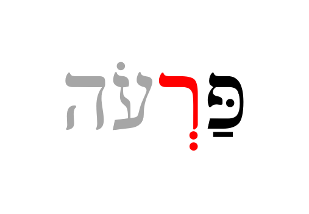

# Hebrew Syllables

::: {.infobox .sound}
<figure>
<audio
        id="myAudio"
        controls controlsList="nodownload"
        src="./images/03.0.0.intro.m4a">
            Your browser does not support the
            <code>audio</code> element.
    </audio>
<button onclick="setPlaySpeed25()" type="button">2.5x</button>
<button onclick="setPlaySpeed2()" type="button">2x</button>
<button onclick="setPlaySpeed15()" type="button">1.5x</button>
<button onclick="setPlaySpeed1()" type="button">1x</button>
<button onclick="setPlaySpeed075()" type="button">.75x</button>
<button onclick="setPlaySpeed05()" type="button">.5x</button>
<script>
var x = document.getElementById("myAudio");
function setPlaySpeed05() { 
    x.playbackRate = 0.5;
    x.play();
}
function setPlaySpeed075() { 
    x.playbackRate = 0.75;
    x.play();
} 
function setPlaySpeed1() { 
    x.playbackRate = 1;
     x.play();
}
function setPlaySpeed15() { 
    x.playbackRate = 1.5;
     x.play();
} 
function setPlaySpeed2() { 
    x.playbackRate = 2;
     x.play();
} 
function setPlaySpeed25() { 
    x.playbackRate = 2.5;
     x.play(); 
} 
</script> 
</figure>
:::

> To comprehend Biblical Hebrew, we must know how syllables function


Initially, the Bible and other ancient documents were written without spaces.  In addition to vowels, the ancient scribes and readers organically adopted a system of syllables and accents.  They knew where one word ended and where the next began without needing to write it down.  

What we call "Hebrew grammar" is truly an exciting journey into the system of spoken and written Hebrew, which had its formation thousands of years ago!

::: {.infobox .map}
**LESSON ITINERARY**

1. Learn the two basic concepts of Hebrew Syllables
1. Learn the rules and terminology related to Hebrew Word Accents
1. Know the Three Rules for Recognizing Silent Sheva
1. Know the Four Rules for Recognizing Vocal Sheva 
1. Learn the primary Hebrew diphthong
1. Understand Vowels and Syllable Preferences
1. Learn three simple miscellaneous concepts: Qamets and Qamets Hatuf, Furtive Patach, Quiescent Alef
:::

::: {.infobox .stop}
**EQUIPMENT CHECK**

Before continuing, can you describe the following concepts?

* The vowels that are not letters, including their type (long, short, reduced) and class (a, e, i, o, u)
* The vowels that are letters, including which are the "irreducible long" type
* The difference between a Dagesh Forte and a Dagesh Lene
:::


## First Thought {-}

::: {.infobox .sound}
<audio
        id="myAudio"
        controls controlsList="nodownload"
        src="./images/03.0.1.Ps3202.mp3">
            Your browser does not support the
            <code>audio</code> element.
</audio>
<button onclick="setPlaySpeed25()" type="button">2.5x</button>
<button onclick="setPlaySpeed2()" type="button">2x</button>
<button onclick="setPlaySpeed15()" type="button">1.5x</button>
<button onclick="setPlaySpeed1()" type="button">1x</button>
<button onclick="setPlaySpeed075()" type="button">.75x</button>
<button onclick="setPlaySpeed05()" type="button">.5x</button>
<script>
var x = document.getElementById("myAudio");
function setPlaySpeed05() { 
    x.playbackRate = 0.5;
    x.play();
}
function setPlaySpeed075() { 
    x.playbackRate = 0.75;
    x.play();
} 
function setPlaySpeed1() { 
    x.playbackRate = 1;
     x.play();
}

function setPlaySpeed15() { 
    x.playbackRate = 1.5;
     x.play();
} 
function setPlaySpeed2() { 
    x.playbackRate = 2;
     x.play();
} 
function setPlaySpeed25() { 
    x.playbackRate = 2.5;
     x.play(); 
} 
</script> 
</figure>
:::


::: {.box .light}
* Listen to the verse in Hebrew
* Practice speaking until you can pronounce just like Izzy 
:::


###  <span class="he">אַשְׁרֵי אָדָם לֹא יַחְשֹׁב יְהוָה לוֹ</span>  {-}

*How blessed is the man to whom the LORD does not impute iniquity  (Psalms 32:2)*

Thank God for his blessings and meditate upon them.  Is there iniquity for which you need to be cleansed of right now?  If so, that takes priority over studying!

```{r, out.width = "600pt", fig.align='center', fig.cap="Mount of Beatitudes and Sea of Galilee - suggested location of Yeshua's eight blessings in Matthew 5:3-12. Courtesy of the [Pictorial Library of Bible Lands](https://www.bibleplaces.com)"}


``` 

## Before we Begin {-}

::: {.infobox .sound}
<audio
        id="myAudio"
        controls controlsList="nodownload"
        src="./images/03.0.2.beforewebegin.m4a">
            Your browser does not support the
            <code>audio</code> element.
</audio>
<button onclick="setPlaySpeed25()" type="button">2.5x</button>
<button onclick="setPlaySpeed2()" type="button">2x</button>
<button onclick="setPlaySpeed15()" type="button">1.5x</button>
<button onclick="setPlaySpeed1()" type="button">1x</button>
<button onclick="setPlaySpeed075()" type="button">.75x</button>
<button onclick="setPlaySpeed05()" type="button">.5x</button>
<script>
var x = document.getElementById("myAudio");
function setPlaySpeed05() { 
    x.playbackRate = 0.5;
    x.play();
}
function setPlaySpeed075() { 
    x.playbackRate = 0.75;
    x.play();
} 
function setPlaySpeed1() { 
    x.playbackRate = 1;
     x.play();
}

function setPlaySpeed15() { 
    x.playbackRate = 1.5;
     x.play();
} 
function setPlaySpeed2() { 
    x.playbackRate = 2;
     x.play();
} 
function setPlaySpeed25() { 
    x.playbackRate = 2.5;
     x.play(); 
} 
</script> 
</figure>
:::
> The authors of Basics of Biblical Hebrew say that Lesson 3 and Lesson 16 are the two most content-heavy lessons in this course.  

For that reason, you must have your alephbet and vowels (including the vowel types) memorized.

Assuming you've checked your equipment as directed above, and everything is in tip-top shape for your Lesson 3 adventure, then you're ready to begin. Take your time.  Work through the written material, then do a little Anki work and see if it starts to click. 
If Anki is not making sense, then come back here and re-read the material again. Then go back to Anki.  If you find yourself getting frustrated, take a break, and come back to it later.  Continue to work through "the fog" that we talked about in the introduction.

You absolutely must have the concepts from this lesson hard-wired before you continue to Lesson 4.  The good news is that once you get this lesson down, the ones that follow will be relatively straightforward.

In addition to all of these new concepts, the authors have also seen fit to introduce a full set of vocabulary words AND study verses beginning with Lesson 3.  So the overall workload will increase, starting with this lesson (but so will your knowledge of Hebrew!)

We're praying for you in advance as we tackle this section!  Now, go climb the mountain!


## Hebrew Syllables {#syllables}

::: {.infobox .sound}
<audio
        id="myAudio"
        controls controlsList="nodownload"
        src="./images/03.1.m4a">
            Your browser does not support the
            <code>audio</code> element.
    </audio>
<button onclick="setPlaySpeed25()" type="button">2.5x</button>
<button onclick="setPlaySpeed2()" type="button">2x</button>
<button onclick="setPlaySpeed15()" type="button">1.5x</button>
<button onclick="setPlaySpeed1()" type="button">1x</button>
<button onclick="setPlaySpeed075()" type="button">.75x</button>
<button onclick="setPlaySpeed05()" type="button">.5x</button>
<script>
var x = document.getElementById("myAudio");
function setPlaySpeed05() { 
    x.playbackRate = 0.5;
    x.play();
}
function setPlaySpeed075() { 
    x.playbackRate = 0.75;
    x.play();
} 
function setPlaySpeed1() { 
    x.playbackRate = 1;
     x.play();
}


function setPlaySpeed15() { 
    x.playbackRate = 1.5;
     x.play();
} 
function setPlaySpeed2() { 
    x.playbackRate = 2;
     x.play();
} 
function setPlaySpeed25() { 
    x.playbackRate = 2.5;
     x.play(); 
} 
</script> 
:::

There are two basic concepts when it comes to Hebrew Syllables:

::: {.infobox .light}

1. Every syllable begins with one consonant and has only one vowel
2. There are only open or closed syllables 

:::

```{r, fig.align='center'}


```

We see the two basic concepts at play in this simple word (pronounced "da-var" and means word, matter, thing):

* The two syllables each begin with a consonant and have one vowel
    * <span class="he">דָּ</span> starts with the consonant Dalet and has one vowel, Qamets
      * This is also an example of an "open" syllable - open syllables end with a _vowel_, not a consonant
    * <span class="he">בָר</span> starts with the consonant Bet and has one vowel, also a Qamets
      * This is an example of a "closed" syllable - closed syllables end with a _consonant_, not a vowel 
* If you need to know how many syllables are in a Hebrew word, count the vowels
    * Remember that vowel letters, such as the Hiriq-Yod, and Diphthongs we will see later in this lesson, count as a single vowel unit

## Hebrew Word Accents {#accents}

::: {.infobox .sound}
<audio
        id="myAudio"
        controls controlsList="nodownload"
        src="./images/03.2.m4a">
            Your browser does not support the
            <code>audio</code> element.
    </audio>
<button onclick="setPlaySpeed25()" type="button">2.5x</button>
<button onclick="setPlaySpeed2()" type="button">2x</button>
<button onclick="setPlaySpeed15()" type="button">1.5x</button>
<button onclick="setPlaySpeed1()" type="button">1x</button>
<button onclick="setPlaySpeed075()" type="button">.75x</button>
<button onclick="setPlaySpeed05()" type="button">.5x</button>
<script>
var x = document.getElementById("myAudio");
function setPlaySpeed05() { 
    x.playbackRate = 0.5;
    x.play();
}
function setPlaySpeed075() { 
    x.playbackRate = 0.75;
    x.play();
} 
function setPlaySpeed1() { 
    x.playbackRate = 1;
     x.play();
}


function setPlaySpeed15() { 
    x.playbackRate = 1.5;
     x.play();
} 
function setPlaySpeed2() { 
    x.playbackRate = 2;
     x.play();
} 
function setPlaySpeed25() { 
    x.playbackRate = 2.5;
     x.play(); 
} 
</script> 
:::

::: {.infobox .info}
* Most frequently, Hebrew words are accented on the last syllable  
* If not, then the accent will be on the next-to-last syllable^[Later in the course, we will learn about a mark called a Maqqef, which is like a hyphen in English.  In Hebrew, the word to the right of the Maqqef technically does not have an accent.]
* Reduced vowels never take an accent
:::

Unlike English, Biblical Hebrew words are never stressed anywhere else^[Modern Hebrew has words (mostly borrowed from other languages) that don't always follow this rule].

```{r, fig.align='center'}

knitr::include_graphics("images/03.accent_stress.png")
```

* The word on the left is stressed on the last syllable
* The word on the right (pronounced "SAY-pher" and means book, scroll, or document) is stressed on the next to last syllable
    * Whenever the accent is NOT on the final syllable, you may see a mark over the syllable to be stressed^[Hebrew also has a very elaborate system of [cantillation marks](https://en.wikipedia.org/wiki/Hebrew_cantillation){target="_blank"} that also serve to indicate where the accent of the word is. are used for chanting and singing.  A study of these marks is beyond the scope of this book.]

## Tonic, Pretonic, and Propretonic Syllables

::: {.infobox .sound}
<audio
        id="myAudio"
        controls controlsList="nodownload"
        src="./images/03.3.m4a">
            Your browser does not support the
            <code>audio</code> element.
    </audio>
<button onclick="setPlaySpeed25()" type="button">2.5x</button>
<button onclick="setPlaySpeed2()" type="button">2x</button>
<button onclick="setPlaySpeed15()" type="button">1.5x</button>
<button onclick="setPlaySpeed1()" type="button">1x</button>
<button onclick="setPlaySpeed075()" type="button">.75x</button>
<button onclick="setPlaySpeed05()" type="button">.5x</button>
<script>
var x = document.getElementById("myAudio");
function setPlaySpeed05() { 
    x.playbackRate = 0.5;
    x.play();
}
function setPlaySpeed075() { 
    x.playbackRate = 0.75;
    x.play();
} 
function setPlaySpeed1() { 
    x.playbackRate = 1;
     x.play();
}


function setPlaySpeed15() { 
    x.playbackRate = 1.5;
     x.play();
} 
function setPlaySpeed2() { 
    x.playbackRate = 2;
     x.play();
} 
function setPlaySpeed25() { 
    x.playbackRate = 2.5;
     x.play(); 
} 
</script> 
:::

```{r, fig.align='center'}

```

* We will encounter these specific terms for a syllable's position respective to the word's accent
* Let's use the plural of <span class="he">דָּבָר</span> to illustrate: <span class="he">דְּ ׀ בָ ׀ רִים</span>
    * The **Propretonic** syllable is two (or more) steps away from the accent = <span class="he">דְּ</span>
        * Notice how the vowel changed from the Qamets in <span class="he">דָּבָר</span> to a Vocal Sheva in <span class="he">דְּבָרִים</span>
        * This vowel shortening of the propretonic syllable is called _Propretonic Reduction_ and is extremely common in Hebrew
     * The **Pretonic** Syllable is the syllable immediately before the accented syllable = <span class="he">בָ</span>
    * The **Tonic** syllable is the one with the accent =<span class="he"> רִים</span>^[If there is a syllable AFTER the accented syllable, technically it is called "Posttonic," but you will not encounter this term for the remainder of this course.]

::: {.box .light}
You will encounter the term "unaccented syllable".  This refers to any syllable other than the Tonic syllable.
:::
    
## Ultima, Penultima, and Antepenultima syllables

::: {.infobox .sound}
<audio
        id="myAudio"
        controls controlsList="nodownload"
        src="./images/03.4.m4a">
            Your browser does not support the
            <code>audio</code> element.
    </audio>
<button onclick="setPlaySpeed25()" type="button">2.5x</button>
<button onclick="setPlaySpeed2()" type="button">2x</button>
<button onclick="setPlaySpeed15()" type="button">1.5x</button>
<button onclick="setPlaySpeed1()" type="button">1x</button>
<button onclick="setPlaySpeed075()" type="button">.75x</button>
<button onclick="setPlaySpeed05()" type="button">.5x</button>
<script>
var x = document.getElementById("myAudio");
function setPlaySpeed05() { 
    x.playbackRate = 0.5;
    x.play();
}
function setPlaySpeed075() { 
    x.playbackRate = 0.75;
    x.play();
} 
function setPlaySpeed1() { 
    x.playbackRate = 1;
     x.play();
}
function setPlaySpeed15() { 
    x.playbackRate = 1.5;
     x.play();
} 
function setPlaySpeed2() { 
    x.playbackRate = 2;
     x.play();
} 
function setPlaySpeed25() { 
    x.playbackRate = 2.5;
     x.play(); 
} 
</script> 
:::

```{r, fig.align='center'}

```
Since the accent is not always in a fixed location, we sometimes will use other words that describe a syllable's position irrespective of the accent. 

  * _ultima_ = the last syllable
  * _penultima_ = the next-to-last syllable - this is also called the "penult" syllable
  * _antepenultima_ = the syllable(s) before the _penultima/penult_


## Rules for Silent Sheva {#s_sheva}

::: {.infobox .sound}
<audio
        id="myAudio"
        controls controlsList="nodownload"
        src="./images/03.5.m4a">
            Your browser does not support the
            <code>audio</code> element.
    </audio>
<button onclick="setPlaySpeed25()" type="button">2.5x</button>
<button onclick="setPlaySpeed2()" type="button">2x</button>
<button onclick="setPlaySpeed15()" type="button">1.5x</button>
<button onclick="setPlaySpeed1()" type="button">1x</button>
<button onclick="setPlaySpeed075()" type="button">.75x</button>
<button onclick="setPlaySpeed05()" type="button">.5x</button>
<script>
var x = document.getElementById("myAudio");
function setPlaySpeed05() { 
    x.playbackRate = 0.5;
    x.play();
}
function setPlaySpeed075() { 
    x.playbackRate = 0.75;
    x.play();
} 
function setPlaySpeed1() { 
    x.playbackRate = 1;
     x.play();
}
function setPlaySpeed15() { 
    x.playbackRate = 1.5;
     x.play();
} 
function setPlaySpeed2() { 
    x.playbackRate = 2;
     x.play();
} 
function setPlaySpeed25() { 
    x.playbackRate = 2.5;
     x.play(); 
} 
</script> 
:::

> Learn the three rules for differentiating a SILENT Sheva from a Vocal Sheva:

<large>A Sheva is SILENT when the previous vowel is short</large>

```{r, out.width = "200pt", fig.align='center'}

```

<large>A Sheva is SILENT when the first of two consecutive Shevas _within a word_</large>

```{r, out.width = "200pt", fig.align='center'}
knitr::include_graphics("images/03.sheva-firstoftwo.png")
```

<large>A Sheva is SILENT when at the end of a word</large>

```{r, out.width = "200pt", fig.align='center'}
knitr::include_graphics("images/03.sheva-endofword.png")
```

::: {.box .map}  
THREE SILENT SHEVA CLUES  

1. The previous vowel is short
2. First of two consecutive Sheva in the MIDDLE of a word, __OR__
3. Word-final Sheva

:::

> All consonants, including Gutturals can take a SILENT Sheva 

## Rules for Vocal Sheva {#v_sheva}

::: {.infobox .sound}
<audio
        id="myAudio"
        controls controlsList="nodownload"
        src="./images/03.6.m4a">
            Your browser does not support the
            <code>audio</code> element.
    </audio>
<button onclick="setPlaySpeed25()" type="button">2.5x</button>
<button onclick="setPlaySpeed2()" type="button">2x</button>
<button onclick="setPlaySpeed15()" type="button">1.5x</button>
<button onclick="setPlaySpeed1()" type="button">1x</button>
<button onclick="setPlaySpeed075()" type="button">.75x</button>
<button onclick="setPlaySpeed05()" type="button">.5x</button>
<script>
var x = document.getElementById("myAudio");
function setPlaySpeed05() { 
    x.playbackRate = 0.5;
    x.play();
}
function setPlaySpeed075() { 
    x.playbackRate = 0.75;
    x.play();
} 
function setPlaySpeed1() { 
    x.playbackRate = 1;
     x.play();
}


function setPlaySpeed15() { 
    x.playbackRate = 1.5;
     x.play();
} 
function setPlaySpeed2() { 
    x.playbackRate = 2;
     x.play();
} 
function setPlaySpeed25() { 
    x.playbackRate = 2.5;
     x.play(); 
} 
</script> 
:::

> Learn the four rules for differentiating a VOCAL Sheva from a Silent Sheva

<large>A Sheva is VOCAL when the initial Sheva in a word</large>

```{r, out.width = "300pt", fig.align='center'}
knitr::include_graphics("images/03.sheva-initialvocal.png")
```

<large>A Sheva is VOCAL when the second of two consecutive Shevas _within a word_^[A Sheva at the **end** of a word is **always silent**, even when it is the second of two consecutive Shevas.]</large>

```{r, out.width = "200pt", fig.align='center'}
knitr::include_graphics("images/03.sheva-secondoftwovocal.png")
```


<large>A Sheva is VOCAL when under a Dagesh Forte</large>

```{r, out.width = "200pt", fig.align='center'}
knitr::include_graphics("images/03.sheva-fortevocal.png")
```

<large>A Sheva is VOCAL after an unaccented long vowel</large>

```{r, out.width = "200pt", fig.align='center'}
knitr::include_graphics("images/03.sheva-unaccentedlongvocal.png")
```

This one may seem random, but it is relatively common with _long_ vowels in a propretonic position^[These vowels often but do not always reduce. Unchangeable long vowels will never reduce.]  The word above is not kōṯ-vim but kō-ṯᵉ-vîm.


::: {.box .map}  
FOUR VOCAL SHEVA CLUES  

1. Word-initial Sheva
2. SECOND of two Sheva within a word
3. Under a consonant with a _Dagesh Forte_, __OR__
4. After an unaccented long vowel  
:::

> Gutturals reject VOCAL Sheva; they take Hateph vowels instead


## Hebrew Diphthong = Accented Patach-Yod-Hireq {#diphthong}

::: {.infobox .sound}
<audio
        id="myAudio"
        controls controlsList="nodownload"
        src="./images/03.7.m4a">
            Your browser does not support the
            <code>audio</code> element.
    </audio>
<button onclick="setPlaySpeed25()" type="button">2.5x</button>
<button onclick="setPlaySpeed2()" type="button">2x</button>
<button onclick="setPlaySpeed15()" type="button">1.5x</button>
<button onclick="setPlaySpeed1()" type="button">1x</button>
<button onclick="setPlaySpeed075()" type="button">.75x</button>
<button onclick="setPlaySpeed05()" type="button">.5x</button>
<script>
var x = document.getElementById("myAudio");
function setPlaySpeed05() { 
    x.playbackRate = 0.5;
    x.play();
}
function setPlaySpeed075() { 
    x.playbackRate = 0.75;
    x.play();
} 
function setPlaySpeed1() { 
    x.playbackRate = 1;
     x.play();
}


function setPlaySpeed15() { 
    x.playbackRate = 1.5;
     x.play();
} 
function setPlaySpeed2() { 
    x.playbackRate = 2;
     x.play();
} 
function setPlaySpeed25() { 
    x.playbackRate = 2.5;
     x.play(); 
} 
</script> 
:::


```{r, out.width = "400pt", fig.align='center'}

```

> The diphthong is a single vowel unit, which means it is only one syllable

* We do not pronounce the word on the right above as "BUY-it," but monosyllabic, more like "BITE"^[With this said, "buy-it" makes a handy mnemonic for remembering this word means 'house' - when you see a nice house you want to "buy it." There are several look-alike words.]
* The word on the left is not "sh-MAY-im," but it sounds more like "sh-MIME"

::: {.box .light}
Remember "Accent+Patach+Yod+Hireq" as the main Hebrew Diphthong:  <span class="he">יִ ַ֫</span>
:::

Qamets-Yod-Vav is another Diphthong that you'll see in Lesson 9.  It's the pronoun suffix ending for "his" or "him."

* <span class="he">אֵלָיו</span> (to him) pronounced eLAV
* <span class="he">פָּנָיו</span> (his face) pronounced paNAV

There is scholarly disagreement as to whether (vowel)+Yod are vowel letters or diphthongs.  <u>Basics of Biblical Hebrew</u> treats them as vowel letters.


## Vowels and Syllable Preference {#vowel_pref}

::: {.infobox .sound}
<audio
        id="myAudio"
        controls controlsList="nodownload"
        src="./images/03.8.m4a">
            Your browser does not support the
            <code>audio</code> element.
    </audio>
<button onclick="setPlaySpeed25()" type="button">2.5x</button>
<button onclick="setPlaySpeed2()" type="button">2x</button>
<button onclick="setPlaySpeed15()" type="button">1.5x</button>
<button onclick="setPlaySpeed1()" type="button">1x</button>
<button onclick="setPlaySpeed075()" type="button">.75x</button>
<button onclick="setPlaySpeed05()" type="button">.5x</button>
<script>
var x = document.getElementById("myAudio");
function setPlaySpeed05() { 
    x.playbackRate = 0.5;
    x.play();
}
function setPlaySpeed075() { 
    x.playbackRate = 0.75;
    x.play();
} 
function setPlaySpeed1() { 
    x.playbackRate = 1;
     x.play();
}


function setPlaySpeed15() { 
    x.playbackRate = 1.5;
     x.play();
} 
function setPlaySpeed2() { 
    x.playbackRate = 2;
     x.play();
} 
function setPlaySpeed25() { 
    x.playbackRate = 2.5;
     x.play(); 
} 
</script> 
:::


> Memorize this table:


Syllable | Tonic | Pretonic | Propretonic
| :--: | :--: | :--: | :--:
Open  |  SHORT | LONG | REDUCED
Closed | LONG | SHORT | SHORT

* Tonic syllables PREFER the listed vowels but can take any type
* Pretonic syllable REQUIRE the listed vowels
* Propretonic syllables
  * Closed REQUIRES Short
  * Open REQUIRES reduction from a long vowel to Vocal Sheva (or Hateph if guttural), _except_ when there is an unchangeable long vowel
* Remember <span class="he">דָּבָר</span> and <span class="he">דְּבָרִים</span>
    * The vowel preference table explains why the vowel under the Dalet changes from Qamets in the Open/Pretonic to Vocal Sheva (reduced vowel) in the open propretonic when the plural suffix is added
    * This is called "_propretonic reduction_" - you will encounter this topic frequently
  * As we saw with <span class="he">כֹּתְבִים,</span> unchangeable long vowels that are written "defectively" will not reduce - at their essence, they are still unchangeable
  
::: {.box .caution}  
PAUSAL FORMS

* A notable exception to these preferences is called the "pausal form"
  * This is where a short vowel can become long (for example <span class="he">קָטַל</span> becomes <span class="he">קָטָל</span>) if the word is located at a certain point in a sentence
  * A rough approximation in English would be words concluding with a comma
* Pausal Forms are generally an intermediate Hebrew topic, but it's good to be aware of when you encounter spellings that don't seem to mesh with the vowel/syllable table

:::


<!-- former 3.9 deleted 12/10/2021 -->

## Qamets Hatuf

::: {.infobox .sound}
<audio
        id="myAudio"
        controls controlsList="nodownload"
        src="./images/03.10.m4a">
            Your browser does not support the
            <code>audio</code> element.
    </audio>
<button onclick="setPlaySpeed25()" type="button">2.5x</button>
<button onclick="setPlaySpeed2()" type="button">2x</button>
<button onclick="setPlaySpeed15()" type="button">1.5x</button>
<button onclick="setPlaySpeed1()" type="button">1x</button>
<button onclick="setPlaySpeed075()" type="button">.75x</button>
<button onclick="setPlaySpeed05()" type="button">.5x</button>
<script>
var x = document.getElementById("myAudio");
function setPlaySpeed05() { 
    x.playbackRate = 0.5;
    x.play();
}
function setPlaySpeed075() { 
    x.playbackRate = 0.75;
    x.play();
} 
function setPlaySpeed1() { 
    x.playbackRate = 1;
     x.play();
}
function setPlaySpeed15() { 
    x.playbackRate = 1.5;
     x.play();
} 
function setPlaySpeed2() { 
    x.playbackRate = 2;
     x.play();
} 
function setPlaySpeed25() { 
    x.playbackRate = 2.5;
     x.play(); 
} 
</script> 
:::

The next three sections will examine special vowel and syllable situations.


> Qamets Hatuf ONLY occurs in a Closed AND Unaccented syllable

```{r, out.width = "400pt", fig.align='center'}
knitr::include_graphics("images/03.qametshatuf.png")
```

* A Metheg mark _sometimes_ indicates a Qamets
  * There are many instances where the vowel could be a short Qamets-Hatuf vowel in a closed syllable, or the long Qamets, A-class vowel in an open syllable
  * When this ambiguity occurs, some printings will print a small vertical line called a Meteg בָּֽ.^[Unfortunately, many Tanachs DO not differentiate.]  The Meteg tells you the vowel is the **long, a-class**
  
```{r, out.width = "100pt", fig.align='center'}

```

::: {.box .info}
QAMETS OR QAMETS HATUF?  

* Know that the A-class Qamets is FAR more prevalent
* Nouns such as <span class="he">חָכְמָה</span> that have the pattern (Qamets mark)+Sheva+Qamets+Hei _TEND_ to be O-class
* You may know a word from your vocabulary that has a Holem, such as <span class="he">כֹל</span>
  * When you encounter that same word in its shortened form, <span class="he">כָל־</span>, the vowel will be shortened O-class
  * This is usually the Construct form, which we will study in Lesson 10
:::


## Furtive Patach

::: {.infobox .sound}
<audio
        id="myAudio"
        controls controlsList="nodownload"
        src="./images/03.11.m4a">
            Your browser does not support the
            <code>audio</code> element.
    </audio>
<button onclick="setPlaySpeed25()" type="button">2.5x</button>
<button onclick="setPlaySpeed2()" type="button">2x</button>
<button onclick="setPlaySpeed15()" type="button">1.5x</button>
<button onclick="setPlaySpeed1()" type="button">1x</button>
<button onclick="setPlaySpeed075()" type="button">.75x</button>
<button onclick="setPlaySpeed05()" type="button">.5x</button>
<script>
var x = document.getElementById("myAudio");
function setPlaySpeed05() { 
    x.playbackRate = 0.5;
    x.play();
}
function setPlaySpeed075() { 
    x.playbackRate = 0.75;
    x.play();
} 
function setPlaySpeed1() { 
    x.playbackRate = 1;
     x.play();
}
function setPlaySpeed15() { 
    x.playbackRate = 1.5;
     x.play();
} 
function setPlaySpeed2() { 
    x.playbackRate = 2;
     x.play();
} 
function setPlaySpeed25() { 
    x.playbackRate = 2.5;
     x.play(); 
} 
</script> 
:::

> Furtive Patach under a WORD FINAL ח or ע is said BEFORE the guttural letter and is not a full vowel.

```{r, out.width = "200pt", fig.align='center'}
knitr::include_graphics("images/03.furtivepathach.png")
```


The Furtive Patach is a significant exception to just about everything else we've discussed related to vowels and syllabification:

* The vowel is pronounced *before* the guttural - so the above word is **Ruach**, not "rucha"
* The Furtive Patach is not a full vowel and is not counted in syllabification 

## Quiescent Aleph

::: {.infobox .sound}
<audio
        id="myAudio"
        controls controlsList="nodownload"
        src="./images/03.12.m4a">
            Your browser does not support the
            <code>audio</code> element.
    </audio>
<button onclick="setPlaySpeed25()" type="button">2.5x</button>
<button onclick="setPlaySpeed2()" type="button">2x</button>
<button onclick="setPlaySpeed15()" type="button">1.5x</button>
<button onclick="setPlaySpeed1()" type="button">1x</button>
<button onclick="setPlaySpeed075()" type="button">.75x</button>
<button onclick="setPlaySpeed05()" type="button">.5x</button>
<script>
var x = document.getElementById("myAudio");
function setPlaySpeed05() { 
    x.playbackRate = 0.5;
    x.play();
}
function setPlaySpeed075() { 
    x.playbackRate = 0.75;
    x.play();
} 
function setPlaySpeed1() { 
    x.playbackRate = 1;
     x.play();
}
function setPlaySpeed15() { 
    x.playbackRate = 1.5;
     x.play();
} 
function setPlaySpeed2() { 
    x.playbackRate = 2;
     x.play();
} 
function setPlaySpeed25() { 
    x.playbackRate = 2.5;
     x.play(); 
} 
</script> 
:::

>
Quiescent Aleph is silent. It is neither a consonant nor a vowel

```{r, out.width = "200pt", fig.align='center'}
knitr::include_graphics("images/03.quiescentaleph.png")
```


* When you see an Aleph with no vowels, it is acting as a silent letter
* English has silent letters also, like the 'p' in receipt - the Quiescent Aleph works the same way
* In terms of syllabification, the Aleph is neither a vowel nor a consonant, so it doesn't count at all - it is just an extra letter
* We often encounter Quiscent Alephs in verbs, so we will have much more to say about the Quiescent Aleph when we get to Unit III
    
## Lesson 3 Conclusion

::: {.infobox .sound}
<audio
        id="myAudio"
        controls controlsList="nodownload"
        src="./images/03.13.conclusion.m4a">
            Your browser does not support the
            <code>audio</code> element.
    </audio>
<button onclick="setPlaySpeed25()" type="button">2.5x</button>
<button onclick="setPlaySpeed2()" type="button">2x</button>
<button onclick="setPlaySpeed15()" type="button">1.5x</button>
<button onclick="setPlaySpeed1()" type="button">1x</button>
<button onclick="setPlaySpeed075()" type="button">.75x</button>
<button onclick="setPlaySpeed05()" type="button">.5x</button>
<script>
var x = document.getElementById("myAudio");
function setPlaySpeed05() { 
    x.playbackRate = 0.5;
    x.play();
}
function setPlaySpeed075() { 
    x.playbackRate = 0.75;
    x.play();
} 
function setPlaySpeed1() { 
    x.playbackRate = 1;
     x.play();
}
function setPlaySpeed15() { 
    x.playbackRate = 1.5;
     x.play();
} 
function setPlaySpeed2() { 
    x.playbackRate = 2;
     x.play();
} 
function setPlaySpeed25() { 
    x.playbackRate = 2.5;
     x.play(); 
} 
</script> 
:::

Congratulations on getting this far!  We realize that there are a lot of new, and perhaps tedious, concepts in this Lesson.  Some may be asking why we need to know all of this.

> Understanding accents and vowel and syllable preferences helps to unlock God's Word

On top of the lesson content itself, we also are introducing two new activities that correspond with the official launch of `Vocabulary` and `Study Verses` you will see in `Anki`.

We understand if after reading this lesson then doing the Anki work (perhaps repeated a few times), you still aren't getting it.  The Fog isn't clearing.  This is completely normal.  Keep at it, or take a break and resume later.  If you want a more in-depth lecture covering this material, we recommend [Dr. John Beckman's hour-long YouTube Lecture on lesson 3](https://www.youtube.com/watch?v=AY7KAsD4fZg&feature=youtu.be){target="_blank"}.

### Introduction to Video Warm-ups {-}

* On the next two pages are videos of the vocabulary words and then the study verses
* Practice speaking the word/verses aloud, following along with Izzy 
* You may not know what the words mean yet, and that's fine (that's where Anki comes in)
* Consider this some "syllabic stretching" before you do your full Anki workout!

Then after watching these, go ahead and jump into `Anki`.


## Word Warm-up {-}


<div class="container">
<iframe class ="responsive-iframe" src="https://www.youtube.com/embed/h0Ni1_Zya2U" frameborder="0"></iframe>
</div>
[Click to open `Word Warm-up` video in a new tab](https://youtu.be/h0Ni1_Zya2U){target="_blank"}

## Verses Warm-up {-}

* Over the entire 35-lesson course, you will learn to translate almost 500 Hebrew Verses^[Not every verse in the Verse Warm-up activities will be included in the `Anki Study Verses` deck].  The most extraordinary journey begins with a single step.  You are now about to take that step!  

<div class="container">
<iframe class ="responsive-iframe"  src="https://www.youtube.com/embed/9IkIvWPArlA" frameborder="0"></iframe>
</div>

[Click to open `Verses Warm-up` video in a new tab](https://youtu.be/9IkIvWPArlA){target="_blank"}

::: {.box .light}
For additional practice, you may consider copying each Study Verse by hand in a Journal.

* You can find a PDF of the Study Verses in the `Lesson Extras` page
* The verses generally feature vocabulary words and grammatical concepts taught in the lesson
* Writing by hand would engage another of your senses in the learning process
* You could also record any insights HaShem may impart to you as you are learning His Holy Language
:::

## Anki {-}


* `Lesson 03 A. Vocab` - This is our first lesson with the <u>Basics of Biblical Hebrew</u> vocabulary list
* `Lesson 03 B. Grammar` - This module will reinforce and expand on the major points of this lesson
* `Lesson 03 C. Study Verses`
  * This is also our first lesson using the <u>Basics of Biblical Hebrew</u> study verses
  * With `Study Verses`, our goal is to incorporate the immersive learning aspects of _Hebrew Quest_
    * We want to expose you to Hebrew, even though you may not fully understand all the rules at this stage
    * We encourage you to use a Dictionary (such as [this one](https://holylanguage.com/resources/Pocket-Hebrew-Dictionary-Feyerabend.pdf){target="_blank"}) to help you when you come across unfamiliar words
    * Other dictionaries [are available here](https://holylanguage.com/resources-dictionaries.php){target="_blank"}
    * To help with this, for Lessons 3-10, longer verses will be divided into multiple sections
  * It may take you SEVERAL attempts before you can select `Good` in Anki
  * Be patient and stick with it - you'll get it!
  * By the end of the course, you will learn close to 500 verses in Hebrew
  


## Ruth Pursuit {-}

::: {.infobox .sound}
<audio
        id="myAudio"
        controls controlsList="nodownload"
        src="./images/03.14.ruth.m4a">
            Your browser does not support the
            <code>audio</code> element.
    </audio>
<button onclick="setPlaySpeed25()" type="button">2.5x</button>
<button onclick="setPlaySpeed2()" type="button">2x</button>
<button onclick="setPlaySpeed15()" type="button">1.5x</button>
<button onclick="setPlaySpeed1()" type="button">1x</button>
<button onclick="setPlaySpeed075()" type="button">.75x</button>
<button onclick="setPlaySpeed05()" type="button">.5x</button>
<script>
var x = document.getElementById("myAudio");
function setPlaySpeed05() { 
    x.playbackRate = 0.5;
    x.play();
}
function setPlaySpeed075() { 
    x.playbackRate = 0.75;
    x.play();
} 
function setPlaySpeed1() { 
    x.playbackRate = 1;
     x.play();
}
function setPlaySpeed15() { 
    x.playbackRate = 1.5;
     x.play();
} 
function setPlaySpeed2() { 
    x.playbackRate = 2;
     x.play();
} 
function setPlaySpeed25() { 
    x.playbackRate = 2.5;
     x.play(); 
} 
</script> 
:::

::: {.box .map}
YOUR QUEST  

1. Identify the seven Tetragrammaton examples, which we pronounce "Adonai" or "HaShem" when we encounter it in Scripture.   Also, <span class="he">שַׁדַּי</span> is another name for God.  It means "Almighty."  Find two examples of this name. (Blue)
2. In verse 16, highlight, <span class="he">"עַמֵּךְ עַמִּי וֵאלֹהַיִךְ אֱלֹהָי"</span> in green. This is the famous verse, "your people (will be) my people, and your God, my God."  One of your vocabulary words is <span class="he">אֱלֹהִים</span>. In the last two words of what you just highlighted, you can still see the core portion of <span class="he">אֱלֹהִים</span> present.  Begin to notice how Hebrew uses different suffixes to denote "your" and "my."
3. In verse 1, find one Sheva that begins a word and one Sheva that concludes a word. (Yellow). Which one is a silent Sheva, and which one is the vocal Sheva?
4. Find the Quiescent Aleph in verse 1 (pink)
5. Find the Hebrew words for Elimelech, Machlon, Chilion, and Judah in verses 1-7. Chilion has the prefix "וְ" which means "and." These names appear two times each. (grey)
6. For personal reflection, open an English translation side-by-side with your Hebrew version of Ruth 1.  Note how the foreigner Ruth uses both <span class="he">אֱלֹהִים</span> and the Tetragrammaton in verses 16 and 17, respectively.  Why do you think this might be? Would you say the names are used interchangeably, or do you think there is a deeper purpose?  May we always seek HIM, just as you have done in this activity!

:::

* [Blank copy of Ruth Chapter 1](https://docs.google.com/document/d/1bcT1J-fcVmD1Zn5Jk2nj0560tEddcgtbYZLkwaVVuyE/copy){target="_blank"}
* [Ruth Pursuit Answer Key #3](./images/03_Ruth Pursuit KEY.pdf){target="_blank"}
* Be sure to update your `Ruth Pursuit Translation` worksheet with this lesson's words.  We encourage you to use "HaShem" or "Adonai" for the Tetragrammaton.

### Ruth 1 {-}

<div class="scc">Ruth 1 read by Abraham Shmuelof:<audio controls src="./images/t2901.m4a">
Your browser does not support the <code>audio</code> element.</audio>
</div>


<span class="he"><p align="right">
‫ 1   וַיְהִ֗י בִּימֵי֙ שְׁפֹ֣ט הַשֹּׁפְטִ֔ים וַיְהִ֥י רָעָ֖ב בָּאָ֑רֶץ וַיֵּ֨לֶךְ אִ֜ישׁ מִבֵּ֧ית לֶ֣חֶם יְהוּדָ֗ה לָגוּר֙ בִּשְׂדֵ֣י מוֹאָ֔ב ה֥וּא וְאִשְׁתּ֖וֹ וּשְׁנֵ֥י בָנָֽיו׃ ‬

‫ 2   וְשֵׁ֣ם הָאִ֣ישׁ אֱ‍ֽלִימֶ֡לֶךְ וְשֵׁם֩ אִשְׁתּ֨וֹ נָעֳמִ֜י וְשֵׁ֥ם שְׁנֵֽי־בָנָ֣יו ׀ מַחְל֤וֹן וְכִלְיוֹן֙ אֶפְרָתִ֔ים מִבֵּ֥ית לֶ֖חֶם יְהוּדָ֑ה וַיָּבֹ֥אוּ שְׂדֵי־מוֹאָ֖ב וַיִּֽהְיוּ־שָֽׁם׃ ‬

‫ 3   וַיָּ֥מָת אֱלִימֶ֖לֶךְ אִ֣ישׁ נָעֳמִ֑י וַתִּשָּׁאֵ֥ר הִ֖יא וּשְׁנֵ֥י בָנֶֽיהָ׃ ‬

‫ 4   וַיִּשְׂא֣וּ לָהֶ֗ם נָשִׁים֙ מֹֽאֲבִיּ֔וֹת שֵׁ֤ם הָֽאַחַת֙ עָרְפָּ֔ה וְשֵׁ֥ם הַשֵּׁנִ֖ית ר֑וּת וַיֵּ֥שְׁבוּ שָׁ֖ם כְּעֶ֥שֶׂר שָׁנִֽים׃ ‬

‫ 5   וַיָּמ֥וּתוּ גַם־שְׁנֵיהֶ֖ם מַחְל֣וֹן וְכִלְי֑וֹן וַתִּשָּׁאֵר֙ הָֽאִשָּׁ֔ה מִשְּׁנֵ֥י יְלָדֶ֖יהָ וּמֵאִישָֽׁהּ׃ ‬

‫ 6   וַתָּ֤קָם הִיא֙ וְכַלֹּתֶ֔יהָ וַתָּ֖שָׁב מִשְּׂדֵ֣י מוֹאָ֑ב כִּ֤י שָֽׁמְעָה֙ בִּשְׂדֵ֣ה מוֹאָ֔ב כִּֽי־פָקַ֤ד יְהוָה֙ אֶת־עַמּ֔וֹ לָתֵ֥ת לָהֶ֖ם לָֽחֶם׃ ‬

‫ 7   וַתֵּצֵ֗א מִן־הַמָּקוֹם֙ אֲשֶׁ֣ר הָיְתָה־שָׁ֔מָּה וּשְׁתֵּ֥י כַלֹּתֶ֖יהָ עִמָּ֑הּ וַתֵּלַ֣כְנָה בַדֶּ֔רֶךְ לָשׁ֖וּב אֶל־אֶ֥רֶץ יְהוּדָֽה׃ ‬

‫ 8   וַתֹּ֤אמֶר נָעֳמִי֙ לִשְׁתֵּ֣י כַלֹּתֶ֔יהָ לֵ֣כְנָה שֹּׁ֔בְנָה אִשָּׁ֖ה לְבֵ֣ית אִמָּ֑הּ *יעשה **יַ֣עַשׂ יְהוָ֤ה עִמָּכֶם֙ חֶ֔סֶד כַּאֲשֶׁ֧ר עֲשִׂיתֶ֛ם עִם־הַמֵּתִ֖ים וְעִמָּדִֽי׃ ‬

‫ 9   יִתֵּ֤ן יְהוָה֙ לָכֶ֔ם וּמְצֶ֣אןָ מְנוּחָ֔ה אִשָּׁ֖ה בֵּ֣ית אִישָׁ֑הּ וַתִּשַּׁ֣ק לָהֶ֔ן וַתִּשֶּׂ֥אנָה קוֹלָ֖ן וַתִּבְכֶּֽינָה׃ ‬

‫ 10  וַתֹּאמַ֖רְנָה־לָּ֑הּ כִּי־אִתָּ֥ךְ נָשׁ֖וּב לְעַמֵּֽךְ׃ ‬

‫ 11  וַתֹּ֤אמֶר נָעֳמִי֙ שֹׁ֣בְנָה בְנֹתַ֔י לָ֥מָּה תֵלַ֖כְנָה עִמִּ֑י הַֽעֽוֹד־לִ֤י בָנִים֙ בְּֽמֵעַ֔י וְהָי֥וּ לָכֶ֖ם לַאֲנָשִֽׁים׃ ‬

‫ 12  שֹׁ֤בְנָה בְנֹתַי֙ לֵ֔כְןָ כִּ֥י זָקַ֖נְתִּי מִהְי֣וֹת לְאִ֑ישׁ כִּ֤י אָמַ֙רְתִּי֙ יֶשׁ־לִ֣י תִקְוָ֔ה גַּ֣ם הָיִ֤יתִי הַלַּ֙יְלָה֙ לְאִ֔ישׁ וְגַ֖ם יָלַ֥דְתִּי בָנִֽים׃ ‬

‫ 13  הֲלָהֵ֣ן ׀ תְּשַׂבֵּ֗רְנָה עַ֚ד אֲשֶׁ֣ר יִגְדָּ֔לוּ הֲלָהֵן֙ תֵּֽעָגֵ֔נָה לְבִלְתִּ֖י הֱי֣וֹת לְאִ֑ישׁ אַ֣ל בְּנֹתַ֗י כִּֽי־מַר־לִ֤י מְאֹד֙ מִכֶּ֔ם כִּֽי־יָצְאָ֥ה בִ֖י יַד־יְהוָֽה׃ ‬

‫ 14  וַתִּשֶּׂ֣נָה קוֹלָ֔ן וַתִּבְכֶּ֖ינָה ע֑וֹד וַתִּשַּׁ֤ק עָרְפָּה֙ לַחֲמוֹתָ֔הּ וְר֖וּת דָּ֥בְקָה בָּֽהּ׃ ‬

‫ 15  וַתֹּ֗אמֶר הִנֵּה֙ שָׁ֣בָה יְבִמְתֵּ֔ךְ אֶל־עַמָּ֖הּ וְאֶל־אֱלֹהֶ֑יהָ שׁ֖וּבִי אַחֲרֵ֥י יְבִמְתֵּֽךְ׃ ‬

‫ 16  וַתֹּ֤אמֶר רוּת֙ אַל־תִּפְגְּעִי־בִ֔י לְעָזְבֵ֖ךְ לָשׁ֣וּב מֵאַחֲרָ֑יִךְ כִּ֠י אֶל־אֲשֶׁ֨ר תֵּלְכִ֜י אֵלֵ֗ךְ וּבַאֲשֶׁ֤ר תָּלִ֙ינִי֙ אָלִ֔ין עַמֵּ֣ךְ עַמִּ֔י וֵאלֹהַ֖יִךְ אֱלֹהָֽי׃ ‬

‫ 17  בַּאֲשֶׁ֤ר תָּמ֙וּתִי֙ אָמ֔וּת וְשָׁ֖ם אֶקָּבֵ֑ר כֹּה֩ יַעֲשֶׂ֨ה יְהוָ֥ה לִי֙ וְכֹ֣ה יֹסִ֔יף כִּ֣י הַמָּ֔וֶת יַפְרִ֖יד בֵּינִ֥י וּבֵינֵֽךְ׃ ‬

‫ 18  וַתֵּ֕רֶא כִּֽי־מִתְאַמֶּ֥צֶת הִ֖יא לָלֶ֣כֶת אִתָּ֑הּ וַתֶּחְדַּ֖ל לְדַבֵּ֥ר אֵלֶֽיהָ׃ ‬

‫ 19  וַתֵּלַ֣כְנָה שְׁתֵּיהֶ֔ם עַד־בֹּאָ֖נָה בֵּ֣ית לָ֑חֶם וַיְהִ֗י כְּבֹאָ֙נָה֙ בֵּ֣ית לֶ֔חֶם וַתֵּהֹ֤ם כָּל־הָעִיר֙ עֲלֵיהֶ֔ן וַתֹּאמַ֖רְנָה הֲזֹ֥את נָעֳמִֽי׃ ‬

‫ 20  וַתֹּ֣אמֶר אֲלֵיהֶ֔ן אַל־תִּקְרֶ֥אנָה לִ֖י נָעֳמִ֑י קְרֶ֤אןָ לִי֙ מָרָ֔א כִּי־הֵמַ֥ר שַׁדַּ֛י לִ֖י מְאֹֽד׃ ‬

‫ 21  אֲנִי֙ מְלֵאָ֣ה הָלַ֔כְתִּי וְרֵיקָ֖ם הֱשִׁיבַ֣נִי יְהוָ֑ה לָ֣מָּה תִקְרֶ֤אנָה לִי֙ נָעֳמִ֔י וַֽיהוָה֙ עָ֣נָה בִ֔י וְשַׁדַּ֖י הֵ֥רַֽע לִֽי׃ ‬

‫ 22  וַתָּ֣שָׁב נָעֳמִ֗י וְר֨וּת הַמּוֹאֲבִיָּ֤ה כַלָּתָהּ֙ עִמָּ֔הּ הַשָּׁ֖בָה מִשְּׂדֵ֣י מוֹאָ֑ב וְהֵ֗מָּה בָּ֚אוּ בֵּ֣ית לֶ֔חֶם בִּתְחִלַּ֖ת קְצִ֥יר שְׂעֹרִֽים׃ ‬
</span></p>


## Quest Quiz {-}

<div class="containerLet">
<iframe class="responsive-iframe" src="https://docs.google.com/forms/d/e/1FAIpQLSfCy3m3L8z1a5EjEMtEBVWjoci-JvWfYzUVEIpnQHIgGwvu1g/viewform?embedded=true" frameborder="0"></iframe>
</div>

[Open Quest Quiz #3 in a new window](https://docs.google.com/forms/d/e/1FAIpQLSfCy3m3L8z1a5EjEMtEBVWjoci-JvWfYzUVEIpnQHIgGwvu1g/viewform){target="_blank"}


## Request your Unit 1 Completion Certificate! {-}

::: {.infobox .sound}
<audio
        id="myAudio"
        controls controlsList="nodownload"
        src="./images/03.15.certificate.m4a">
            Your browser does not support the
            <code>audio</code> element.
    </audio>
<button onclick="setPlaySpeed25()" type="button">2.5x</button>
<button onclick="setPlaySpeed2()" type="button">2x</button>
<button onclick="setPlaySpeed15()" type="button">1.5x</button>
<button onclick="setPlaySpeed1()" type="button">1x</button>
<button onclick="setPlaySpeed075()" type="button">.75x</button>
<button onclick="setPlaySpeed05()" type="button">.5x</button>
<script>
var x = document.getElementById("myAudio");
function setPlaySpeed05() { 
    x.playbackRate = 0.5;
    x.play();
}
function setPlaySpeed075() { 
    x.playbackRate = 0.75;
    x.play();
} 
function setPlaySpeed1() { 
    x.playbackRate = 1;
     x.play();
}
function setPlaySpeed15() { 
    x.playbackRate = 1.5;
     x.play();
} 
function setPlaySpeed2() { 
    x.playbackRate = 2;
     x.play();
} 
function setPlaySpeed25() { 
    x.playbackRate = 2.5;
     x.play(); 
} 
</script> 
:::

If you have completed **all activities** in Lessons 1, 2, and 3, and your Unit 1 Anki cards are all `Mature`, you may claim the first of our `Unit Completion Certificates`.

::: {.box .stop}
* Note that the Anki requirement for the `Unit Completion Certificate` is different from the `12 Tribes Badges` requirement. 
* For the Certificate, you must submit a screenshot showing that all cards are `Mature`
* It can take [21 days or greater."](https://docs.ankiweb.net/#/stats?id=types-of-cards){target="_blank"} for a card to be `Mature`
:::

* In other words, you will not be able to submit for your Certificate immediately upon completion of Lesson 3; you will need a period of time for the cards to reach **Mature** status^[See the `Hebrew Grammar Quest Checklist` for additional information].

```{r, out.width = "200pt", fig.align='center', fig.cap="Your Anki screenshot should look like this, showing all cards MATURE"}

```


[Open form in new window](https://forms.gle/hkHMebEtNi61waidA){target="_blank"}

<div class="containerLet">
<iframe class ="responsive-iframe" src="https://docs.google.com/forms/d/e/1FAIpQLScdEsX4EGwUy6EtlZsqJK49W1kfZCu0eyBD-fcJOVbzr5750w/viewform?embedded=true" frameborder="0"></iframe>
</div>

## Lesson Extras {-}

* [Dr. Beckman Lecture Video](http://youtu.be/AY7KAsD4fZg){target=“_blank”}
* [Dr. Beckman Lecture Notes](https://hebrewsyntax.org/bbh2new/03_overheads_bw.pdf){target=“_blank”}
* [BBH Lesson Summary](http://hebrew.billmounce.com/BasicsBiblicalHebrew-03.pdf){target=“_blank”}
* [BBH Study Verses PDF](http://hebrew.billmounce.com/Biblical_examples_03.pdf){target=“_blank”}
* [Dr. Beckman additional practice video](http://youtu.be/icqgATyH9qQ){target=“_blank”}
* Additional Drills/Worksheets
  * [Quiz a](https://hebrewsyntax.org/bbh2new/03_quiz_new.pdf){target=“_blank”}
  * [Quiz b](https://hebrewsyntax.org/bbh2new/03_quiz_practice.pdf){target=“_blank”}
