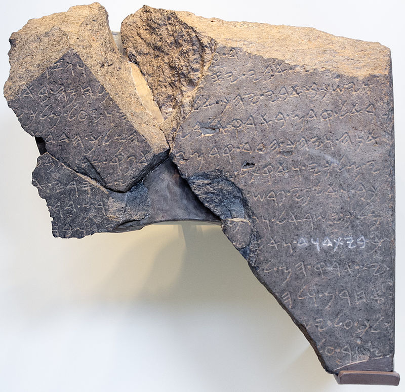
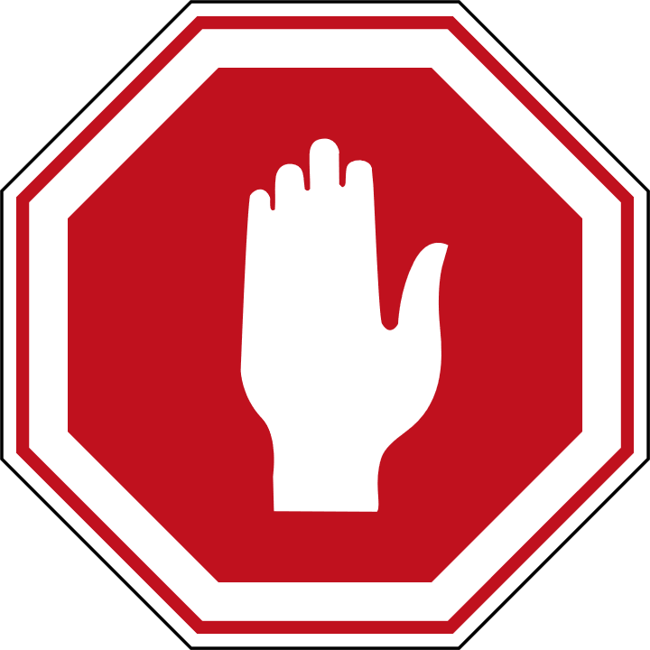

# Syllabification and Pronunciation {#Syllabification}

<!-- Grammarly check 10/24/20 273 lines -->

```{r, out.width = "300pt", fig.align='center'}
library(knitr)

```
Originally, the Bible and other ancient documents, like the "Tel Dan Stele" pictured above<small>^[<small>The Tel Dan Stele was a significant archaeological find of the late 20th century.  Written in Aramaic, closely related to Hebrew, the carving dates to the 9th Century BCE.  It is notable for containing a reference to the "house of David." It is the earliest known extra-biblical reference to King David.  Before its discovery, many scholars had cast doubt on whether David existed. Archeologists discovered it at "Dan" near the Lebanon border in modern Israel.  (Photo Credit: By Oren Rozen - Own work, CC BY-SA 4.0, https://commons.wikimedia.org/w/index.php?curid=47055869)</small>]</small>, were written without spaces.  In addition to vowels, the ancient scribes and readers organically adopted a system of syllables and accents.  They knew where one word ended, and another began without needing to write it down.  

What we call "Hebrew grammar" is truly an exciting journey into the system of spoken and written Hebrew, which had its formation thousands of years ago!


## Seven Practical Points for Lesson 2 {-}

1. Learn the two basic concepts of [Hebrew Syllables](#three_1)
1. Learn the rules and terminology related to [Hebrew Word Accents](#three_2)
1. Know the Three Rules for Recognizing [Silent Sheva](#three_3)
1. Know the Four RulesRecognizing Vocal Sheva: Four Rules Gutturals Reject [Vocal Sheva](#three_4)
1. Learn the primary [Hebrew Diphthong](#three_5)
1. Understand [Vowels and Syllable Preference](#three_6)
1. Learn three simple miscellaneous concepts: [Qamets and Qamets Hatuf, Furtive Patach Quiescent Alef](#three_7)


## Equipment Check {-}

```{r, out.width = "300pt", fig.align='center'}
library(knitr)

```

Before continuing, can you describe the following concepts?

* The vowels that are not letters, including their type (long, short, reduced) and class (a,e,i,o,u)
* The vowels that are letters, including which are the "irreducible long" type
* The difference between a Daghesh Forte and a Daghesh Lene

### **The authors of <u>Basics of Biblical Hebrew</u> believe Lesson 3 could be the most challenging chapter in the book.** {-}

Suppose you do not have the vowels and, chiefly, the vowel types memorized. In that case, this chapter will be all the more difficult.

Assuming you've checked your equipment as directed above, and everything is in tip-top shape for your Lesson 3 adventure, take your time.  Work through the written material, then do a little Anki work and see if it starts to click. 

If not, then come back here and re-read the material again. Then go back to Anki.  If you find yourself getting frustrated, take a break, and come back to it later.  Continue to work through "the fog."

You absolutely must have the concepts from this lesson hard-wired before you continue to Lesson 4.  The good news is that once you get this lesson down, the ones that follow will be relatively straightforward.

In addition to all of these new concepts, the authors have also seen fit to introduce a full set of vocabulary words AND study verses beginning with Lesson 3.  So the overall workload will increase, starting with this lesson.

We're praying for you in advance as we compile this section!  Now, climb the mountain!


## Hebrew Syllables {#three_1}

There are two basic concepts when it comes to Hebrew Syllables:

### Every syllable begins with one consonant and has only one vowel {-}

### There are only open or closed syllables {-}

```{r, out.width = "200pt", fig.align='center'}

include_graphics("images/03.syllable.png")
```

We see the two basic concepts at play in this simple word (pronounced "da-var" and means word, matter, thing):

* The two syllables each begin with a consonant and have one vowel
    * דָּ starts with the consonant Dalet, and has one vowel, Qamets
      * This is also an example of an "open" syllable - open syllables end with a _vowel_, not a consonant
    * בָר starts with the consonant Bet and has one vowel, also a Qamets
      * This is an example of a "closed" syllable - closed syllables end with a _consonant_, not a vowel 
* If you need to know how many syllables are in a Hebrew word, count the vowels
    * Remember that vowel letters, such as the Hiriq-Yod, and Diphthongs we will see later in this lesson, count as a single vowel unit

## Hebrew Word Accents {#three_2}

### Most frequently, Hebrew words are stressed on the last syllable.  {-}

### If not, then the accent will be on the next-to-last syllable {-}

Unlike English, Biblical Hebrew words are never stressed anywhere else<small>^[<small>Modern Hebrew has words (mostly borrowed from other languages) that don't follow this rule</small>]</small>.

```{r, out.width = "200pt", fig.align='center'}

include_graphics("images/03.accent_stress.png")
```

* The word on the left is stressed on the last syllable
* The word on the right (pronounced "SAY-pher" or "SEH-pher" and means book, scroll, or document) is stressed on the next to last syllable
    * Some texts will place a mark over the syllable to be stressed (except when it is on the last syllable)<small>^[<small>Hebrew has a very elaborate system of [cantillation marks](https://en.wikipedia.org/wiki/Hebrew_cantillation){target="_blank"} that also serve to indicate where the accent of the word is. are used for chanting and singing.  A study of these marks is beyond the scope of this book.</small>]</small>

### Tonic, Pretonic, and Propretonic Syllables {-}

* We will encounter specific terms for a syllable's position respective to the word's accent
* Let's use the plural of דָּבָר to illustrate: דְּ ׀ בָ ׀ רִים
    * The **Propretonic** syllable is two (or more) steps away from the accent = דְּ
        * Notice how the vowel changed from the Qamets in דָּבָר to a Vocal Shewa in דְּבָרִים
        * This vowel shortening of the propretonic syllable is called _Propretonic Reduction_ and is extremely common in Hebrew
    * The **Pretonic** Syllable is the syllable immediately before the accented syllable = בָ
    * The **Tonic** syllable is the one with the accent = רִים<small>^[<small>Additional info in the textbook that you don't need to know: 1) If there is a syllable AFTER the accented syllable, technically it is called "Posttonic," but you will not reencounter this term for the remainder of this course. 2) There is an additional set of words that signifies a syllable's position irrespective of the accent: _ultima_ = the last syllable; _penultima_ is the next to last syllable; _antepenultima_ is the syllable before the _penultima_ </small>]</small>

## Silent Sheva {#three_3}

Learn the three rules for differentiating a SILENT Sheva from a Vocal Sheva:

### SILENT when the previous vowel is short {-}

```{r, out.width = "200pt", fig.align='center'}
include_graphics("images/03.sheva-shortvowel.png")
```

### SILENT when the first of two consecutive Shevas _within a word_ {-}
```{r, out.width = "200pt", fig.align='center'}

```

### SILENT when at the end of a word {-}
```{r, out.width = "200pt", fig.align='center'}

```

## Vocal Sheva {#three_4}

Learn the four rules for differentiating a VOCAL Sheva from a Silent Sheva

### VOCAL when the initial Sheva in a word: {-}

```{r, out.width = "300pt", fig.align='center'}
include_graphics("images/03.sheva-initialvocal.png")
```

"buh-rei-sheet" and "buh-ra-cha"

### VOCAL when the second of two consecutive Shevas _within a word_<small>^[<small>A Sheva at the **end** of a word is **always silent**, even when it is the second of two consecutive Shevas.</small>]</small>:  {-}

```{r, out.width = "200pt", fig.align='center'}
include_graphics("images/03.sheva-secondoftwovocal.png")
```

"mish-puh-tai"

### VOCAL when under a Daghesh Forte: {-}
```{r, out.width = "200pt", fig.align='center'}
include_graphics("images/03.sheva-fortevocal.png")
```

"ham-muh-la-kim"

### VOCAL after an unaccented long vowel: {-}

```{r, out.width = "200pt", fig.align='center'}
include_graphics("images/03.sheva-unaccentedlongvocal.png")
```

This one may seem random, but it is relatively common with _long_ vowels in a propretonic position<small>^[<small>These vowels often but do not always reduce (see section 3.6). Unchangeable long vowels will never reduce.</small>]</small>  The word above is not kōṯ-vim but kō-ṯᵉ-vîm.

## Hebrew Diphthong = Accented Patach-Yod-Hiriq {#three_5}

```{r, out.width = "200pt", fig.align='center'}
knitr::include_graphics("images/03.diphthong.png")
```

* The fundamental concept is that the diphthong is one vowel unit, which means it is only one syllable
    * We do not pronounce as "BUY-it," but monosyllabic "BUYIT"; and not "sh-MY-im" but "sh-MYIM"


## Vowels and Syllable Preference {#three_6}

```{r, out.width = "500pt", fig.align='center'}
include_graphics("images/03.vowelpreferencetable.png")
```

This table may seem like minutiae, but do yourself a favor: memorize it!  

* Open/Propretonic _prefer_ reduced vowels, but this is why the concept of unchangeable long vowels matter.
  * Go back and look at דָּבָר and דְּבָרִים
    * The vowel preference table explains why the vowel under the Dalet changes from Qamets in the open pretonic to Vocal Shewa (reduced vowel) in the open propretonic when the plural suffix "im" is added
    * This is called "_propretonic reduction_" - you will encounter this topic frequently
  * As we saw with כֹּתְבִים, propretonic long vowels do not always reduce (and unchangeable long vowels never will)

## Qamets Hatuf, Furtive Patach, Quiescent Alef {#three_7}

These are three miscellaneous but straightforward rules.

### Qamets Hatuf ONLY occurs in a Closed AND Unaccented syllable {-}

```{r, out.width = "200pt", fig.align='center'}
include_graphics("images/03.qametshatuf.png")
```

There are many instances where the vowel could be a short qamets-hatuf vowel in a closed syllable, or the long Qamets, A-class vowel in an open syllable.  When this ambiguity occurs, many printings will print a vertical line called a meteg בָּֽ.  The meteg tells you the vowel is the **long, a-class**

```{r, out.width = "200pt", fig.align='center', fig.cap="Meteg"}
include_graphics("images/03.meteg.png")
```


### Furtive Patach under final ח or ע is said BEFORE the guttural letter and is not a full vowel {-}

```{r, out.width = "200pt", fig.align='center'}
include_graphics("images/03.furtivepathach.png")
```

* The Furtive Patach is a significant exception to just about everything else we've discussed related to vowels and syllabification:
    * The vowel is pronounced *before* the guttural - so the above word is **Ruach** not "rucha"
    * The Furtive Patach is not a full vowel and is counted in syllabification - so the above word is **Ruach** not "ru-ach"
    
### Quiescent Aleph is silent, neither a consonant nor a vowel {-}

```{r, out.width = "200pt", fig.align='center'}
knitr::include_graphics("images/03.quiescentaleph.png")
```

* When you see an Aleph with no vowels, it is acting as a silent letter
    * English has all kinds of silent letters, like the 'p' in receipt - the Quiescent Aleph works the same way
    * In terms of syllabification, the Aleph is neither a vowel nor a consonant, so it doesn't count at all - it is just an extra letter
    
## Final note on Lesson 3 {-}

Congratulations on getting this far! We realize that there are a lot of heavy concepts you face in this Lesson.

Some of you may try to read this lesson then do the Anki work (perhaps repeated a few times), and you still aren't getting it.  The Fog isn't clearing.  If this is the case, and you want a more in-depth lecture covering this material, we recommend [Dr. John Beckman's hour-long YouTube Lecture on lesson 3](https://www.youtube.com/watch?v=AY7KAsD4fZg&feature=youtu.be){target="_blank"}


## ACTIVity: Video Warm-ups {-}

* Welcome to our first group of vocabulary and study verses, featuring audio by Izzy
* Below is a video of the vocabulary words, and below that is a video of the study verses
* Practice speaking the word/verses aloud, following along with Izzy 
* You may not know what the words mean yet, and that's fine (that's where Anki comes in)
* Consider this some "syllabic stretching" before you do your full Anki workout!

## ACTIVity: Vocab Warm-up {-}

[Click to open vocabulary video in a new tab](https://www.youtube.com/embed/D0uG3_PTzGA){target="_blank"}

<iframe width="560" height="315" src="https://www.youtube.com/embed/D0uG3_PTzGA" frameborder="0" allow="accelerometer; autoplay; clipboard-write; encrypted-media; gyroscope; picture-in-picture" allowfullscreen></iframe>

## ACTIVity: Verses Warm-up {-}

* Over the entire 35 lesson course, you will learn to translate almost 500 Hebrew Verses.  The greatest journey begins with a single step.  You are now about to take that step!
        
[Click to open verses video in a new tab](https://www.youtube.com/embed/_BD0WD2cQ7c){target="_blank"}

<iframe width="560" height="315" src="https://www.youtube.com/embed/_BD0WD2cQ7c" frameborder="0" allow="accelerometer; autoplay; clipboard-write; encrypted-media; gyroscope; picture-in-picture" allowfullscreen></iframe>

## ACTIVity: Ruth Pursuit #3 {-}        

1. Identify all examples of the Tetragrammaton, which we pronounce "Adonai" when we encounter it in Scripture.  There are six instances of the Name. (Blue)
2. In verse 16, highlight, "עַמֵּךְ עַמִּי וֵאלֹהַיִךְ אֱלֹהָי" in green. This is the famous verse, "your people (will be) my people, and your God, my God."  One of your vocabulary words is אֱלֹהִים. In the last two words of what you just highlighted, you can still see the core portion of אֱלֹהִים present.  Begin to notice how Hebrew uses different suffixes to denote "your" and "my."
3. In verse 1, find one Sheva that begins a word and one Sheva that concludes a word.  Which one is a silent Sheva, and which one is the vocal Sheva?<small>^[<small>A Sheva that appears under the initial consonant of a word is always vocal, and a Sheva that appears under the final consonant of a word is always silent.</small>]</small>
4. Find the quiescent Aleph in verse 1 (pink)
5. Find the Hebrew words for Judah, Moab, and Bethlehem in Verse 1. (gray).  Bethlehem is two separate words in Hebrew. The first word has a single-letter preposition (מ) that means "from."
6. For personal reflection, open an English translation side-by-side with your Hebrew version of Ruth 1.  Note how the foreigner Ruth uses both אֱלֹהִים and the Tetragrammaton in verses 16 and 17, respectively.  Why do you think this might be? Would you say the names are used interchangeably, or do you think there is a deeper purpose?  May we always seek HIM, just as you have done in this activity!
* [Blank copy of Ruth 1](https://drive.google.com/file/d/1qcfTKAlTJGChC2eYCMhSbY2w-ibzCcDV/view?usp=sharing){target="_blank"}
* [Ruth Pursuit Answer Key #3](https://drive.google.com/file/d/1GybopWuWjBP-WpgabhwN6B1h_Yz4uXmt/view?usp=sharing){target="_blank"}

## ACTIVity: Anki Lesson 3

* Vocab - First Lesson with `Basics of Biblical Hebrew` vocabulary list
* Grammar
* Verses - First Lesson with `Basics of Biblical Hebrew` Study Verses
  * The translation may be difficult at first, and it may take you several attempts before you can select `Good.`
  * Be patient and stick with it - you'll get it!

## ACTIVity: Quest Quiz #3 {-}

[Open Quest Quiz #3 in a new window](https://docs.google.com/forms/d/e/1FAIpQLSfCy3m3L8z1a5EjEMtEBVWjoci-JvWfYzUVEIpnQHIgGwvu1g/viewform){target="_blank"}

<iframe src="https://docs.google.com/forms/d/e/1FAIpQLSfCy3m3L8z1a5EjEMtEBVWjoci-JvWfYzUVEIpnQHIgGwvu1g/viewform?embedded=true" width="800" height="600" frameborder="2" marginheight="0" marginwidth="0"></iframe>


  