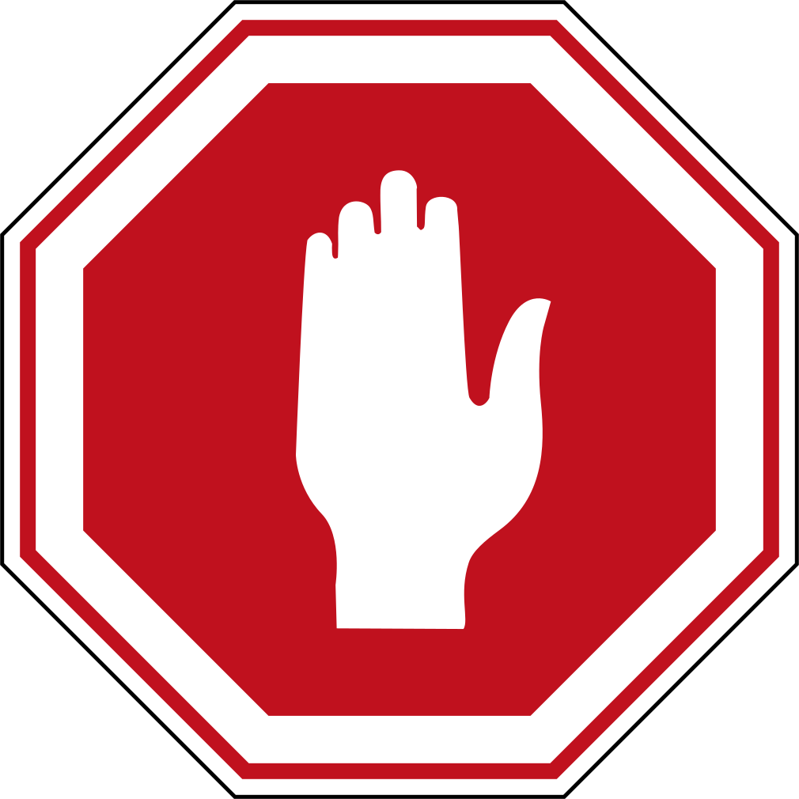

# Syllabification and Pronunciation {#Syllabification}

### Seven Practical Points for Lesson 2 {-}

1. Learn the two basic concepts of [Hebrew Syllables](#three_1)
1. Learn the rules and terminology related to [Hebrew Word Accents](#three_2)
1. Know the Three Rules for Recognizing [Silent sheva](#three_3)
1. Know the Four RulesRecognizing Vocal sheva: Four Rules Gutturals Reject [Vocal Sheva](#three_4)
1. Learn the primary [Hebrew Diphthong](#three_5)
1. Understand [Vowels and Syllable Preference](#three_6)
1. Learn three simple miscellaneous concepts: [Qamets and Qamets Hatuf, Furtive Pathach Quiescent Alef](#three_7)

[Lesson 3 ACTIVities](#three_8)

## Equipment Check {-}

```{r, out.width = "300px", fig.align='center'}


```

Before continuing, can you describe the following concepts?

* The vowels that are not letters, including their type (long, short, reduced) and class (a,e,i,o,u)
* The vowels that are letters, including which are the "irreducible long" type
* The difference between a Daghesh Forte and a Daghesh Lene


## Hebrew Syllables {#three_1}

>Two basic concepts:  
1. Every syllable begins with one consonant and has only one vowel  
2. There are only open and closed syllables

```{r, out.width = "200px", fig.align='center'}

include_graphics("images/03.syllable.png")
```

We see the two basic concepts at play in this simple word (pronounced "da-var" and means word, matter, thing):

* The two syllables each begin with a consonant and have one vowel
    * דָּ begins with the consonant Dalet, and has one vowel, Qamets
    * בָר begins with the consonant Bet, and has one vowel, also a Qamets
* The first syllable of דָּ ׀ בָר is open and the second is closed
    * An open syllable ends with a vowel
    * A closed syllable ends with a consonant 
* If you need to know how many syllables are in a Hebrew word, just count the vowels
    * Remember that vowel letters, such as the Hiriq-Yod, and Diphthongs we will later in this lesson count as a single vowel unit

## Hebrew Word Accents {#three_2}

> Hebrew words are usually stressed on the last syllable.  
If not, then the the accent will be on the next-to-last syllable.  
Never anywhere else.

```{r, out.width = "200px", fig.align='center'}


```

* The word on the left is stressed on the last syllable
* The word on the right (pronounced "SAY-pher" or "SEH-pher" and means book, scroll, or document) is stressed on the next to last syllable
    * Some texts will place a mark over the syllable to be stressed (except when it is on the last syllable)^[Hebrew has a very elaborate system of [cantillation marks](https://en.wikipedia.org/wiki/Hebrew_cantillation){target="_blank"} that also serve to indicate where the accent of the word is. are used for chanting and singing.  A study of these marks is beyond the scope of this book.]

### Syllable Nominclature {-}

* We will encounter specific terms for a syllable's position respective to the word's accent
* Let's use the plural of דָּבָר to illustrate: דְּ ׀ בָ ׀ רִים
    * The **Propretonic** syllable is two (or more) steps away from the accent = דְּ
        * Notice how the vowel changed from the Qamets in דָּבָר to a Vocal Shewa in דְּבָרִים
        * This vowel shortening of the propretonic syllable is called _Propretonic Reduction_ and is extremely common in Hebrew
    * The **Pretonic** Syllable is the syllable immediately before the accented syllable = בָ
    * The **Tonic** syllable is the one with the accent = רִים^[Additional info in the textbook that you don't need to know: 1) If there is a syllable AFTER the accented syllable, technically it is called "Posttonic" but you will not encounter this term again for the remainder of this course. 2) There is an additional set of terms that signifies a syllable's position irrespective of the accent: _ultima_ = the last syllable; _penultima_ is the next to last syllable; _antepenultima_ is the syllable before the _penultima_ ]

## Silent sheva

## Vocal Sheva

## Hebrew Diphthong

## Vowels and Syllable Preference

## Qamets Hatuf, Furtive Pathach Quiescent Alef

## Less