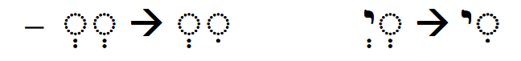
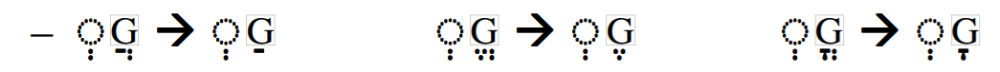
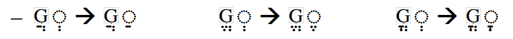

# (PART) Nouns, Prepositions, Pronouns {-}

# Hebrew Nouns {.Nouns}


> In order to comprehend Biblical Hebrew, we must understand how nouns are formed, how they are pluralized, and how to look words up in a dictionary.


## Seven Practical Points for Lesson 4 {-}


1. Hebrew Nouns have Gender and Number
2. Singular noun endings and "endingless" nouns
3. Plural and Dual Noun Endings
4. Special dual forms
6. Other/Irregular Pluralization
7. Rule of Sheva
1. Understand "Lexical Form"

Additionally, starting with this lesson we will invoke the shorthand we've been learning in Anki (e.g. MP = Masculine Plural, FS = Feminine singular).

**Digging deeper:** Many Hebrew grammar books expect students to know how to pluralize nouns in writing. Our objective with Hebrew GRAMMAR Quest is only that you recognize how nouns are pluralized so you can break down the word to identify the lexical form in the dictionary. If you wish to dig deeper, we encourage you to check out chapter 4 of <u>Basics of Biblical Hebrew</u>.


### `Lesson Prayer` {-}

Continue to pray for wisdom.  Fear of the Lord is the beginning.

> (Psalms 111:10) The fear of the LORD is the beginning of wisdom; A good understanding have all those who do His commandments; His praise endures forever.


## Equipment Check {-}

```{r, out.width = "300pt", fig.align='center'}
library(knitr)

```

Before continuing, can you describe the following concepts?

* Vowel and syllable preference
* The rules for Silent Sheva and Vocal Sheva


## Gender and Number {#gender_number}

All Hebrew nouns have Gender and Number. 

* Gender
    * The "gender" sometimes does, but usually does not, have anything to do with biologic gender.  
    * סֵ֫פֶר is masculine (M), while תּוֹרָה  is feminine (F). There is nothing inherently masculine about books nor feminine about laws or instructions
    * The gender of a noun never changes
    
* Number
    * A noun is either singular (S), plural (P), or infrequently, dual (D)
        * Dual is exactly two of something
        * Apart from the words "pair" or "both", English doesn't have too many dual forms
        * In Hebrew, typically paired body parts are in the dual form
    * The number of a noun CAN change
    * A word's ending indicates the number
    
Verbs, will introduce "person".  Collectively, when you see "PGN" in grammar, this refers to "person, gender, number"; e.g. "3MS".

## Singular Noun Endings {#sing_noun_endings}

* Singular
    * Masculine singular (MS): generally are "endingless" (but all MS are endingless and not all endingless are MS); rarely a MS noun may end in ה ֶ
    * The following words are examples of FS endings:
        * תּוֹרָה (Most common)
        * בַּת 
        * תִּפְאֶ֫רֶת  (glory)
        * בְּרִית (covenant)
        * מַלְכּוּת (kingdom)
        * אֶ֫רֶץ (land - endingless, but feminine - less common)<small>^[<small>Not all endingless nouns are MS.  Some common words are endingless but are classified as FS: אֶ֫רֶץ (land), עִיר (city), and אֶ֫בֶן (stone)</small>]</small>

## Plural and Dual Noun Endings {#noun_pluralization}

For regular nouns, simply remove the singular ending if there is one, and add the plural ending.

* Plural endings:
    * MP: ים ִ e.g.  סוּסִים 
        * דָּבָר becomes דְּבָרִים
        * עָנָן becomes עֲנָנִים (clouds)
        * כּוֹכָב becomes כּוֹכָבִים

    * FP: וֹת e.g. מְלָכוֹת (queens)
        * תּוֹרָה becomes תּוֹרוֹת 

Under the MP endings above, note the propretonic reduction when the original word is more the one syllable. As we saw in Lesson 3.2, דְּבָרִים changes from דָבָר because an open propretonic syllable prefers a reduced vowel. 

*   A vowel under a non-Guttural will reduce to Vocal Shewa - דְּבָרִים
*   A vowel under a guttural will take a Hateph vowel, usually Hateph Patach - עֲנָנִים
*   An irreducible long vowel will not reduce - כּוֹכָבִים 

* Dual endings:
    * MD: יִם ַ e.g. סוּסַ֫יִם (two horses)
    * FD: יִם ַ  e.g., יָדַ֫יִם (two hands) or תַ֫יִם ָ as in תּוֹרָתַ֫יִם (two laws).

Occasionally, we will see defective spelling of the plural and dual endings: סוּסִם תּוֹרֹת


## Special dual forms {#dual_forms}

Hebrew has three common words that have the dual ending but are usually translated as singular.

* שַׁמַ֫יִם heaven, sky (sometimes "heavens")
* מִצְרַ֫יִם Egypt
* מַ֫יִם water (sometimes "waters")


## Irregular Pluralization  {#irregular_pluralization}

* Hebrew does have a handful of irregular nouns.  For example you won't find נִשִׁים in a dictionary.  So if you need to know the singular form, אִשָּׁה
* Rather than a detailed discussion on what is going on with the plural forms (and honestly, scholars don't really know why a word like אָבוֹת looks like a feminine word), it's easier to memorize these eight most common pairs:

| S   | Def      | P     | Def.      |
|-----|----------|-------|-----------|
| אִישׁ | man      | אֲנָשִׁים | men       |
| אִשָּׁה | woman    | נָשִׁים  | women     |
| עִיר | city     | עָרִים  | cities    |
| אָב  | father   | אָבוֹת  | fathers   |
| בַּ֫יִת | house    | בָּתִּים  | houses    |
| בַּת  | daughter | בָּנוֹת  | daughters |
| בֵּן  | son      | בָּנִים  | sons      |
| יוֹם | day      | יָמִים  | day       |

An important note is that the plural forms still retain the gender of their singular noun.  אָבוֹת is still masculine,  and נָשִׁים is still feminine, despite the plural endings

The next two categories of irregular words are more straightforward:

### Segholate Nouns follow a standard vowel pattern when pluralizing {-}

You may have noticed something interesting about the words, דֶּ֫רֶךְ  and סֵ֫פֶר . The Two syllable nouns where the accent is on the first syllable are classified as _Segholate_ nouns.  They get this name because frequently, though not always, there are two Seghol vowels. נַ֫עַר  (boy, youth) is a segholate noun even though it doesn't have any Seghol vowels.

Vocal Sheva/Hateph under the first consonant and Qamets under the second, with the normal MP or FP ending.

* מֶ֫לֶךְ to מְלָכִים
* סֵ֫פֶר to סְפָרִים
* נַ֫עַר to נְעָרִים

### Geminate words take a Daghesh Forte {-}

_Geminate_ (from the Latin for "twins") words appear to have two visible letters (which we call "biconsonantal"), but at one point the second consonant appeared twice.  Example עַם (people) was once *עמם.
The lexical form drops the extra consonant.

When we pluralize a Geminate word, the "twin" letter "reappears" but as a Daghesh Forte instead of a consonant.  So in our example, עַם becomes עַמִּים (peoples).

The reason we don't have a Daghesh Forte in עַם is that the last consonant of a word rejects the Daghesh Forte when it has no vowel.

## Rule of Sheva {#rules_sheva}

Sometimes, according to other rules of grammar, we end up with a scenario where we have two reduced vowels, such as two vocal sheva, back to back.  However, an overarching facet of Hebrew is that two reduced vowels in a row cannot stand.  

> The Rule of Sheva changes the first of two reduced vowels into the corresponding short vowel.


* The first of two contiguous Vocal Sheva will usually change to a Hireq.  Note the unique situation when the second consonant is a Yod:
```{r, out.width = "600pt", fig.align='center'}
library(knitr)

```

These next two could be called "Hateph copy-cat" rules.  Notice how the vowel under the first consonant in all six examples takes on the short-vowel equivalent of the hateph vowel:

* A hateph vowel under a "G"uttural that is followed by a Vocal Sheva will change to the short vowel in the same class (e.g. hateph patach to patach)
```{r, out.width = "600pt", fig.align='center'}
library(knitr)

```
* A Vocal Sheva that is followed by a hateph vowel will change to the short-vowel in the same class as the hateph vowel.  
```{r, out.width = "600pt", fig.align='center'}
library(knitr)

```
When a prefix is added to אלֹהִים. and the Tetragramaton the vowel changes are irregular:

* With אלֹהִים the aleph becomes quiescent after a prefix:
    * אלֹהִים + לְ = לֵאלֹהִים
* With the Tetragramaton, the prefixed letter with take a Patach, with nothing under the Yod:
    *  בַיהוָה


To flip around the Rule of Sheva, suppose as you are reading, you encounter a syllable that begins with a _short_ vowel followed by a reduced vowel.  In that case, you may be looking at a grammatical scenario where there were originally been two reduced vowels.

You may be wondering why you need to know this.  Understanding that a syllable may have "originally" had a reduced vowel is an important clue when it comes to translating and parsing.  If you're 'foggy' now, hang in there.  It will make sense in a bit!


## Lexical Form {#lexical_form}

The Lexical Form is the dictionary version of the word.

English examples:
* "Oxen" may not be its own entry, but you would find it under "Ox"
* You may not find "went", but you would find "go"

Hebrew dictionaries (called "Lexicons" in academia) work the same way.

For nouns, the Lexical Form is the SINGULAR version of the noun.  Below is how to go from a plural noun to the singular, Lexical form (assuming you didn't already know the singular Lexical Form):

1. Drop the plural or dual ending
2. Perhaps add a singular ending
3. For Geiminate nouns, drop the Dagesh Forte when it lacks a vowel
4. Often change vowels if no singular ending - reduced vowels often become regular vowels but vowel letters do not change


## `Word Warm-up` {-}

[Click to open `Word Warm-up` video in a new tab](https://youtu.be/n9HYIqqvA0I){target="_blank"}

<iframe width="768" height="432" src="https://youtu.be/n9HYIqqvA0I" frameborder="0" allow="accelerometer; autoplay; clipboard-write; encrypted-media; gyroscope; picture-in-picture" allowfullscreen></iframe>

## `Verses Warm-up` {-}

[Click to open `Verses Warm-up` video in a new tab](https://youtu.be/89pLvO3wg6s){target="_blank"}

<iframe width="768" height="432" src="https://youtu.be/89pLvO3wg6s" frameborder="0" allow="accelerometer; autoplay; clipboard-write; encrypted-media; gyroscope; picture-in-picture" allowfullscreen></iframe>

## `Anki` {-}

* `Lesson 04 A.Vocab`
* `Lesson 04 B.Grammar` 
    * With Lesson 4, we are gradually increasing the depth of work.
    * From here on out, we will be doing an activity called "Parsing"
    * When we parse a Hebrew word, we identify three things:
        * the Number and Gender of the word
        * the Lexical form
        * the definition of the original word
    * For example if the instruction is to parse שִׁירִים  , we would respond with: "MP שִׁיר  Songs"
    * You may not know every word -
        * That is the point of this exercise!  As you read your Hebrew Bible, you will invariably come across words you don't know.  
        * You will need to be able to break down a word into its Lexical form so you can look it up
        * "Extra points" if you look up words you don't yet know in this Anki lesson!
    * As we advance, in future lessons, we will incorporate additional aspects into our parsing activities such as person and verb conjugation.
* `Lesson 04 C.Verses`


## `Ruth Pursuit` {-}        

### Your Quest: {-}

1. find one regular singular segholate noun in V1.  In this verse there is also a segholate noun with a propositional prefix that we haven't studied yet; this world also takes on vowel changes but we'll cover that in a few lessons. (yellow)
2. find a regular masculine plural in v1 - This work has the definite article, which we will cover in the next lesson.  Also find a regular Feminine plural in vs 1-4 (pink).  What do you think the Lexical Form of this feminine word is?
3. find an irregular plural somewhere in vs 2-6 (green)
4. find an example of the "Rule of Sheva" in verses 10-13 (blue)


* [Blank copy of Ruth 1](https://drive.google.com/file/d/1qcfTKAlTJGChC2eYCMhSbY2w-ibzCcDV/view?usp=sharing){target="_blank"}
* [Ruth Pursuit Answer Key #04](./images/04_Ruth_Pursuit_KEY.pdf){target="_blank"}

## `Quest Quiz` {-}

[Open Quest Quiz #04 in a new window](https://forms.gle/2LCEgvmpHr5mqB5Z6){target="_blank"}

<iframe src="https://forms.gle/2LCEgvmpHr5mqB5Z6" width="800" height="600" frameborder="2" marginheight="0" marginwidth="0"></iframe>


