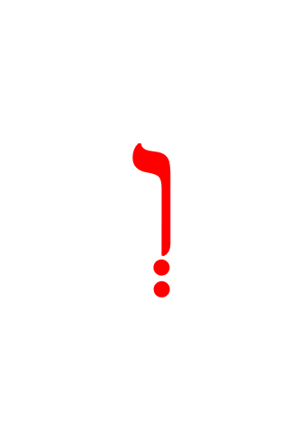
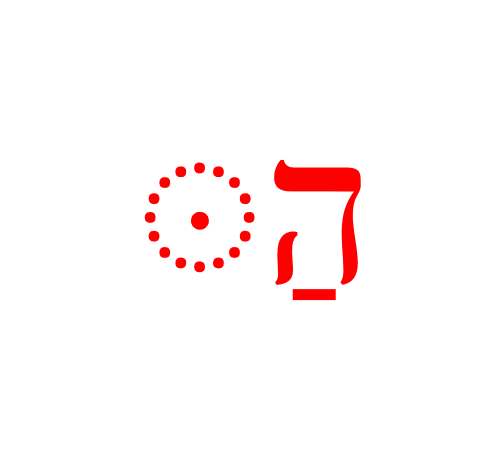

# Definite Article and Conjunction Vav {.Article}

> To comprehend Biblical Hebrew, we must identify the definite article and the conjunction Vav whenever we see them in a word.

As we say often, our focus with Hebrew GRAMMAR Quest is not to write or speak Biblical Hebrew but to _read and comprehend_ Biblical Hebrew.  In this lesson, the sections that deal with meaning are more important than those that deal with the specific spelling<small>^[<small>In contrast, _Basics of Biblical Hebrew_ places significant emphasizes on learning the spelling rules. This is not wrong; it is just not our approach.</small>]</small> 

It is unlikely you will ever need to write the article or the conjunction with the correct vowel. We discuss these spelling details because you must know how to recognize them in the Bible when you encounter them.


::: {.infobox .map}
**LESSON ITINERARY**

1. Translate the Vav Conjunction
2. Identify the Vav Conjunction
3. Understand why the Dagesh Forte is your friend
4. Translate the Article 
5. Identify the Article
6. Understand the concepts of definiteness and indefiniteness in Hebrew
7. Discuss what makes a noun definite
:::

::: {.infobox .stop}
**EQUIPMENT CHECK**

Before continuing, can you describe the following concepts?

* Identifying the lexical form of a noun
* The "rule of Sheva," including what happens in different combinations of two contiguous reduced vowels
* How vowels can shift when the number of syllables changes
* The masculine and feminine plural endings

:::

## First Thought {-}

### <span class="he">מִי־מָדַד בְּשָׁעֳלוֹ מַיִם וְשָׁמַיִם</span> {-}

_Who has measured the waters in the hollow of His hand, And marked off the heavens'  (Isaiah 40:12)_

Give thanks to the Creator for the beauty and precision of His creation


<figure>
    <figcaption>Listen to the verse in Hebrew:</figcaption>
    <audio
        controls controlsList="nodownload"
        src="./images/05.isa4012.mp3">
            Your browser does not support the
            <code>audio</code> element.
    </audio>
</figure>

*****

```{r, out.width = "400pt", fig.align='center', fig.cap="Mount of Beatitudes hillside reflecting the beauty of the Galilee region. Courtesy of the [Pictorial Library of Bible Lands](https://www.bibleplaces.com)"}


``` 

## _Hebrew Quest_ Conjunction Lecture

View this 4-minute overview video from _Hebrew Quest_, then we will dig into the concepts in greater detail as we progress through the lesson. 

<div class="container">
<iframe class="responsive-iframe" src="https://www.youtube.com/embed/
yY3O8ByYNwI?start=2460&end=2671
&rel=0&showinfo=0&autohide=1&autoplay=1" frameborder="0"></iframe>
</div>

[Click to open video in a new tab](https://youtu.be/yY3O8ByYNwI&t=2460){target="_blank"}


## Translate the Vav Conjunction {#vav_translate}

* The Vav conjunction serves _many_ different purposes in Hebrew
    * Some of these can be translated into English
    * Other times there is no direct English translation; these uses are more like "stage directions" in a play
* When translating the Vav, we must make sure our translation fits the context
    * Most often, it merely means "and"
    * Other options include: then, and then, but, also, even, together with, that is  
    * Occasionally, the best option is to leave it untranslated
        * English does not like to start sentences with "and" or have multiple "and" clauses in a sentence; we call these "run-on sentences"
        * Hebrew LOVES to start sentences with "and" and is just fine with run-on sentences
        * For example, suppose you read and translate the story of David and Goliath in 1 Samuel 17
        * You would discover that nearly every sentence would begin with "and"
            * In English, we would consider these "run-on" sentences.  
            * In Hebrew, the reader can feel the sense of tension and action building in the narrative by the use of the Vav
            * Review [this segment from _Hebrew Quest_](https://youtu.be/oZ1VbPCpMvw?t=729){target="_blank} for additional discussion
* As you advance in Hebrew, you will enjoy seeing how the Bible authors employ the Vav at the beginning of a sentence or clause to evoke different meanings
    * For example, when added to a verb, it usually serves to continue or advance the narrative
        * It can also have a particular use of changing the verb's aspect.  We'll address that in Chapter 17.
    * When added to a non-verb, it is often those stage directions we mentioned: a contrast, a scene shift, or a parenthetical comment


::: {.box .info}
* As you are starting out in Hebrew, start your translation of the Vav Conjunction with "And", but be flexible.
* Another word, such as "but" or "then" might make more sense.
* Many times for smooth English, we will leave the Vav untranslated.
:::


## Identify the Vav Conjunction {#vav_identify}

```{r, out.width = "50pt", fig.align='center'}
library(knitr)

```

* The Vav conjunction is usually <span class="he">וְ</span> prefixed to a word
* You will see <span class="he">וּ</span> before  <span class="he">במפ</span> - remember "BuMP"- this is the ONLY time a vowel will ever begin a syllable
    * The <span class="he">ב</span> and <span class="he">פ</span> will lose their Dagesh Lene 
    * It's <span class="he">בֵּן</span>, (between), but it's <span class="he">וּבֵן</span> (and between)
    * The conjunction will also be <span class="he">וּ</span> before a consonant that has a Sheva
* You may see <span class="he">וָ</span> before some accented syllables (remember the Vowel-Syllable preferences)
* Since Vav takes a Vocal Sheva, the Rule of Sheva applies when <span class="he">וְ</span> is prefixed to a word beginning with a reduced vowel (Vocal Sheva or Hateph vowel)
    * As we learned in Lesson 4, the Vav will take the corresponding short vowel

::: {.box .info}
How to tell the difference between the conjunction and words that start with <span class="he">ו</span>?

* ** A Vav or Shureq as the first letter of a word is ALMOST ALWAYS the conjunction Vav.**
* Only 10 words start with Vav, and only two occur more than once
    * <span class="he">וָו</span> means "hook," and  <span class="he">וָוִים</span> means "hooks - occurs 13 times in Exodus 26-38, talking about the hooks for the Tabernacle
    * <span class="he">וַשְׁתִּי</span> - Queen Vashti - it appears only in the book of Esther
:::

## Loss of Dagesh Forte {#loss_Dagesh_forte}

* We've been referencing the Dagesh Forte in almost every Lesson of this course, and now we're about to meet it face to face as we discuss the Hebrew Article
* We like to think of the Dagesh Forte as your friend
* When you see it, it is Hebrew's way of saying "pay attention; something is different"
* As we've discussed, sometimes the Dagesh Forte gets rejected from time to time (everybody say, "awwww.") 
* We've discussed two of those already, and in this lesson, we'll add a third
* A SQiN eM LeVY consonant with a Sheva SOMETIMES rejects the Dagesh Forte
    * When this happens, there is NEVER compensatory lengthening
* See table below:

| Scenario | Reject Dagesh | Compensatory Lengthening
| :-: | :-: | :-: 
| Gutturals/Resh | ALWAYS | Sometimes
| Word-final Dagesh without a Vowel (Lesson 4) | ALWAYS | Sometimes
| **SQiN eM Levy WITH SHEVA** | SOMETIMES | NEVER

-----

::: {.box .info}
SQiN eM LeVY Rule

* Please don't worry if you don't understand this at first
* When you start to see the SQiN eM LeVY rule in action, it will get easier
* See [this handout](./images/05_sqin_em_levy.pdf){target="_blank"} for additional discussion on SQiN eM LeVY consonants
:::


## Compensatory Lengthening

* In Compensatory Lengthening, a short vowel _lengthens_ to become a long vowel to _compensate_ for the loss of a Dagesh Forte (or sometimes a vowel) in the following consonant
    * Patach will lengthen to Qamets
    * Hireq will lengthen to Tsere
    * Qibbuts will lengthen to Holem
* Compensatory Lengthening can occur in ANY letter that precedes a Dagesh Forte-rejecting Guttural or Resh...but it does not _always_ occur
* Compensatory Lengthening can also occur in a word with a Quiescent Aleph that rejects a Sheva.

::: {.infobox .info}
* When SQiN eM LeVY consonants reject the Dagesh, there is NEVER compensatory lengthening.
* Sometimes there is no change to the preceding vowel - this is called "virtual doubling," as discussed above.
:::

## _Hebrew Quest_ Article Lecture

View this 3-minute overview video from _Hebrew Quest_, then we will dig into the concepts in greater detail as we progress through the lesson. We will discuss the Interrogative Article in Lesson 8.

<div class="container">
<iframe class="responsive-iframe" src="https://www.youtube.com/embed/
yY3O8ByYNwI?start=1649&end=1836
&rel=0&showinfo=0&autohide=1&autoplay=1" frameborder="0"></iframe>
</div>

[Click to open video in a new tab](https://youtu.be/yY3O8ByYNwI){target="_blank"}


## Translate the Article {#article_translate}

* In English, we have two "Indefinite articles" = "a" or "an", and one "Definite article" = "the"
* Hebrew just has one article for definiteness (so we just call it the "Article")
* The Hebrew article has many translations: "the", "this", "o" (as in "O king"), "his", "her", "my".
* <span class="he">הַיּוֹם</span> is literally "the day"; however, a better translation is "today", or sometimes "this day"
* The Hebrew article can make an adjective superlative: <span class="he">הַתּוֹב</span> is literally "the good", but can mean "the best".


## Identify the Article {#article_identify}

```{r, out.width = "100pt", fig.align='center'}
library(knitr)

```

* The usual form is Hei with a Patach and a Dagesh Forte in the next letter ("Hei+Patach+Dagesh"<small>^[<small>By definition, the Dagesh is a Forte as it comes after a vowel that is not a Sheva.</small>)</small>
* As we've been saying, some unusual things can happen when the letter following the <span class="he">ה</span> rejects the Dagesh Forte:
    * <span class="he">ּ הַ</span> becomes simply <span class="he">הַ</span> (no Dagesh Forte):
        * Before SQiN eM LeVY with a Sheva
        * Before a ח or another <span class="he">ה</span> (see הֶ note below)- again, this is called "Virtual Doubling"<small>^[<small>Or, as Dr. Van Pelt likes to say "virtually NO DOUBLING, because nothing changes."</small>]</small>
    * Becomes <span class="he">הָ</span> (no Dagesh Forte and the Patach lengthens to Qamets):
        * Before <span class="he">א ע ר or הָ֫ </span>
        * This is called "Compensatory Lengthening," and is quite common with these gutturals
* Becomes <span class="he">הֶ</span> (no Dagesh Forte and a Seghol instead of a Patach):
    * Before accented or unaccented <span class="he">חָ</span>, or unaccented <span class="he">הָ</span> or <span class="he">עָ</span>

::: {.box .info}
* The goal is not to memorize the alternate forms as much as recognize that they exist
* "Hei+Patach+Dagesh" is the form you need to memorize
:::


## Hebrew Indefiniteness {#indefiniteness}

Hebrew (and Greek) lacks an indefinite article.  

A word without the Article is indefinite.

Occasionally you will see "one" - <span class="he">אַחַת אֶהַר</span> to indicate indefiniteness

## Other Hebrew Definiteness {#definiteness}

* The Article is not the only way Hebrew indicates definiteness
* An individual's name and most proper nouns are definite by definition.
    * <span class="he">דָּוִד</span> is definite (we will never see: <span class="he">*הַדָּוִד</span>)
    * On the other hand, names of people groups and some geographic features often take the article. <span class="he">הַיַּרְדֵּן</span>= the Jordan River.
* A word with a pronominal suffix is definite since the suffix indicates possession, and possession is definite<small>^[Pronominal suffixes are the subject of Lesson 9</small>]</small>.
* A word in its construct state is definite when the last word in the construct chain is definite<small>^[Lesson 10</small>]</small>.

## Lesson Conclusion and Activities {-}

You made it through another lesson!  Way to go!  Even though we only studied two concepts - the word for "and" and the word for "the" - these concepts may not be as straightforward as we might have thought. 

You may be noticing how each new lesson builds upon the previous ones. If something isn't entirely making sense, or if you find yourself asking, "why in the world do I need to know this?" just be patient, and it should start to come together in a lesson or two.  Now might also be an excellent time to look back and see how far you have come in just five lessons.

As far as activities, we have the warm-up videos, Anki, the Ruth Pursuit, and the Quest Quiz. When you finish all of that, we have our second `Twelve Tribes Badge` you can claim.

Take your time and let the simple, but not so simple, concepts in this chapter sink in.  You're about half-way through the "non-verbs" portion of the course.  Lessons 6-10 will be continuing to build out sentences with prepositions, adjectives, and pronouns.  Then we'll take a little bit of a break with numbers in Lesson 11 before moving on to Unit 3 and Hebrew verbs.

Keep with it; you're doing great!


## Word Warm-up {-}


<div class="container">
<iframe class="responsive-iframe" src="https://youtube.com/embed/WQqcvmjdq1k" frameborder="0"></iframe>
</div>

[Click to open `Word Warm-up` video in a new tab](https://youtu.be/WQqcvmjdq1k){target="_blank"}

## Verses Warm-up {-}

<div class="container">
<iframe class="responsive-iframe" src="https://youtube.com/embed/Wf-nQAErcj8" frameborder="0"></iframe>
</div>

[Click to open `Verses Warm-up` video in a new tab](https://youtu.be/Wf-nQAErcj8){target="_blank"}

## Anki {-}

* `Lesson 05 A. Vocab`
* `Lesson 05 B. Grammar` 
* `Lesson 05 C. Workbook`
    * In this activity, we will have short passages of scripture that illustrate the definite article and the Vav conjunction.
    * Make sure you look up any words you do not know.  You can download an abridged [lexicon here](./images/BBH_Lexicon.pdf){target="_blank"}.
* `Lesson 05 D. Verses`

## Ruth Pursuit {-}        

::: {.box .map}
YOUR QUEST

1. Find five examples of the conjunction vav: וְ (note the Vocal Sheva) (Yellow)
2. find five examples of the standard definite article ּ  הַ (Green)
3. Find the first three examples of "Compensatory Lengthening" of the definite article.  There is one example of "Virtual Doubling" of the definite article in verses 10-15.  Can you find it? (Light Blue)
4. הִנֵה is a widespread Biblical expression that means, "look!" or "behold." Find the one example of הִנֵה in Ruth 1. (Pink)
5. Find all instances of <span class="he">אִישׁ</span> (man), and <span class="he">אִשָּׁה</span>, wife/woman. (grey) 
    * In verses 1 and 2, note that <span class="he">אִשְׁתּוֹ</span> has a pronominal suffix, so the word means "his wife."  Words that normally end with a ה tend to lose the ה when suffixes are added. We'll study more about pronominal suffixes in Lessons 9 and 19.
    * In verses 12 and 13, note that <span class="he">לְאִישׁ
</span> has a prepositional prefix mean "to" or "for."  We will learn about prepositions in the next lesson.
6. Find the vocabulary word <span class="he">כֹּה</span>. It appears once with the Vav conjunction and once without. (red)

:::


* [Blank copy of Ruth 1](https://drive.google.com/file/d/1qcfTKAlTJGChC2eYCMhSbY2w-ibzCcDV/copy){target="_blank"}
* [Ruth Pursuit Answer Key #05](./images/05_Ruth_Pursuit_KEY.pdf){target="_blank"}
* Update your `Ruth Pursuit Translation` worksheet.


## Quest Quiz {-}

[Open Quest Quiz #05 in a new window](https://forms.gle/NsrAS9XKMbtLToW1A){target="_blank"}

<div class="containerLet">
<iframe class="responsive-iframe" src="https://docs.google.com/forms/d/e/1FAIpQLSc-PREmjGXSzCh1l2qenbHEHJlGV35voeamfxuAcc_JB_2j5A/viewform?embedded=true" frameborder="0"></iframe>
</div>

## Claim your next `Twelve Tribes Badge`! {-}


When you have completed all activities on your `Hebrew GRAMMAR Quest Checklist` through lesson 5, complete the certification below, and your badge will be on its way!

<!-- Tribe Badge 2 = Benjamin -->

<div class="containerLet">
<iframe class="responsive-iframe" src="https://docs.google.com/forms/d/e/1FAIpQLSdUEWHBbR9iuUrUMSJ76Fucn0qyqIPxILQpfh3Ss6Hmz8bPZA/viewform?embedded=true" frameborder="0"></iframe>
</div>
