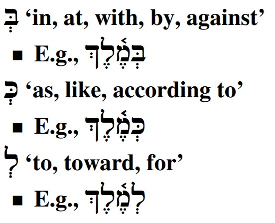

# Hebrew Prepositions

> In order to comprehend Biblical Hebrew, we must be able to identify prepositions as we read the Text.

Prepositions give us space and context.  Given that much of the Tanach is narrative, prepositions are on almost every page that we read as the authors describe the events to us.  There is one Hebrew word, מִן, that is classified as a preposition but depending on the context can convey a wide array of meanings. 

::: {.infobox}
**Seven Practical Points for Lesson 6**

1. Recognize that a Nun with Silent Sheva becomes a Daghesh Forte
2. Describe Independent and Maqqef prepositions
3. Define Inseparable prepositions
4. Identify when a word with an inseparable preposition also has the definite article
5. Understand how מִן is constructed
6. Define how מִן is used
7. Identify the Definite Direct Object (DDO) marker
:::

## First Thought {-}

Meditate and celebrate that the Lord is in the midst of our troubles.

> (Psalms 77:3 NASB) In the day of my trouble I sought the Lord  
בְּיוֹם צָרָתִי אֲדֹנָי דָּרָשְׁתִּי

<figure>
    <figcaption>Listen to the verse in Hebrew:</figcaption>
    <audio
        controls controlsList="nodownload"
        src="./images/06.ps7702.mp3">
            Your browser does not support the
            <code>audio</code> element.
    </audio>
</figure>

*****

```{r, out.width = "600pt", fig.align='center', fig.cap="Mt. Precipice in Nazareth - likely location of Luke 4:29 when the townsfolk wanted to throw Yeshua off the cliff. Courtesy of the [Pictorial Library of Bible Lands](https://www.bibleplaces.com)"}

knitr::include_graphics("images/06-Nazareth Mount of Precipitation from west panorama, tb041003219.jpg")
``` 

## Equipment Check {-}

```{r, out.width = "300pt", fig.align='center'}
library(knitr)
include_graphics("images/stopil.png")
```

Before continuing, can you describe the following concepts?

* The construction of the definite article, including what happens when the Daghesh Forte is rejected
* The construction of the Vav conjunction
* How Hebrew handles indefinite words


## Nun with Silent Sheva Becomes Daghesh Forte

You may be wondering what this has to do with prepositions, but stick with us.  It will make sense by the end of the lesson!

Nun is considered a "weak letter" and it has a tendency to drop out of a word under certain scenarios. When the nun appears with a SILENT sheva נְ (or no vowel at all) is one of those times.  You remember how we said that the Daghesh Forte is your friend, because it tells you that something has changed?  When then nun drops, whenever possible it will be replaced with a Daghesh Forte.  The technical term for this is called "assimilation".   

מִנְזָהָב* > מִזָּהָב


This is why we spend time talking about when the Daghesh Forte might get rejected.  Do you remember the three times we have studied where the Daghesh Forte may be rejected?  

* Gutturals and Resh
* At the end of a word
* With a SQiN eM LeVY with a Sheva: מִנְקְצֵה* > מִקְּצֵה* > מִקְצֵה

## Independent and Maqqef prepositions 

Prepositions explains the relationship between its object and something else.
 There are three different types of Hebrew prepositions: independent, Maqqef, and inseparable. 

An _independent_ preposition is a separate word with a space before it and after it.

The preposition comes first, followed by its object (just like English).

* Most Hebrew prepositions are written this way. – E.g.,  תַּחַת אֹתוֹ
* English prepositions are written this way. – E.g., Under it

Maqqef is the Hebrew word for dash.  They are nearly identical in meaning and appearance except the Hebrew Maqqef is raised ־ whereas the English is middle -

In a _Maqqef_ preposition, the Maqqef connects a preposition to its object. Again, the preposition comes first.

עָל־מֶלֶךְ

English prepositions are NOT written this way.  You would never see "on-a-king."

You may see the same preposition written both with and without the Maqqef.  The meaning does not change.  עַל מֶלֶךְ means the same as עַל־מֶלֶךְ


## Inseparable prepositions

Like וְ for the word "and", an inseparable preposition is a one-letter prefix that is affixed to its object. 

Three Hebrew prepositions are **ALWAYS** written this way, usually with a Vocal Sheva under the prepositional letter:

```{r, out.width = "200pt", fig.align='center'}
library(knitr)

```

The first word of the Bible contains an inseparable preposition: בְּרֵאשִׁית = "In (the) beginning".

If there is a Sheva or Hateph vowel in the next letter, the Rules of Sheva come into play.  Review Lesson 4 if you need to.

* Before another vocal Sheva, the preposition usually takes a Hireq
* Before a Guttural with a Hateph vowel, the preposition takes the corresponding short vowel
* Note the names of God again receive special treatment: לֵאלֹהִים and לַיהוָה


## The Article and Inseparable Prepositions

Words with both an inseparable preposition AND the article undergo a type of contraction.  The one-letter preposition replaces the ה of the article. The vowel under the preposition and the daghesh forte (if it is there) are your clues that the word is definite.

For example, note how we would spell "in the field":

```{r, out.width = "800pt", fig.align='center'}
library(knitr)
knitr::include_graphics("images/06.preposition_article.png")
```

For words that keep the pathach and daghesh forte of the article, it is straightforward to determine the article.  The challenge comes when the next letter rejects the Daghesh Forte.

Here's how to tell whether there is the article or not:

* NO ARTICLE if there is a Sheva under the preposition - the article never takes a Sheva
* NO ARTICLE if the short vowel under the preposition can be explained by the Rules of Sheva: אֲנָשִׁים + לְ = לַאֲנָשִׁים - for men, (not 'for the men')
* ARTICLE if vowel under the preposition is not Sheva and can NOT be explain by the Rule of Sheva: לַהֵיכָל = for THE temple

Some situations will be ambiguous; the context will guide us.

## The flexible מִן: construction

There is one preposition that is unique: מִן

It can be a Maqqef preposition, as in: מִן־זָהָב, or it can be an inseparable preposition: מִזָּהָב.  Both mean "from gold." The reason we led of this Lesson with a discussion on "nun with a silent sheva" is because this is what is happening with מִן when it is an inseparable preposition.  The nun assimilates into the following consonant, becoming a Daghesh Forte.

Unlike the regular inseparable prepositions, the ה of the article is retained: מֶהָאָ֫רֶץ = from the land.

As we know well by know, the Gutturals and Resh reject the Daghesh Forte:

* א צ ה ר have compensatory lengthening so the Hireq becomes Tsere.
* ח has virtual doubling, which as we remember means "virtually no doubling" in that the vowel under the מ remains a Hireq

## The flexible מִן: meanings 

The most direct meaning is "from" - מִזָּהָב from gold; but, it also can have comparative and superlative meanings depending on the context.

* טוֹבָה חָכְמָה מִזָּהָב = wisdom is better *than* gold
* קָשָׁה הָעֲבֹדָה מֵהָאֲנָשִׁים = the work is too difficult *for* the men
* עָרוּם מִכֹּל חַיַּת הַשָֹּדֶה ּ = the most clever living thing *of all* the field
* מֵהָאֲנָשִׁים may mean "*some* *of* the men" (lit. from the men)

Other uses: 'because', 'by', 'without', 'even', 'namely'.

This is a word that takes practice to appreciate the various nuanced meanings.

## The Definite Direct Object marker 

Hebrew has an untranslated word that is often used to mark a direct object that is definite.

Spelled תֵא (independent) or תֶא־ (Maqqef)- the challenge can be that this is the same spelling as the preposition "with".

We see the definite direct object marker (often abbreviated DDO) twice in the first verse of the Bible:

בְּרֵאשִׁית בָּרָא אֱלֹהִים *אֵת* הַשָּׁמַיִם *וְאֵת* הָאָרֶץ

## Review and Activities {-}

How are you feeling so far?  Is any component of "the fog" refusing to dissipate? Keep sticking with `Anki` and try to do your reviews at least once daily.

To help with this, we've gone a little bit lighter on the Grammar cards and the Ruth Pursuit for Lesson 6.  While there are some differences, prepositions are used much the same way in Hebrew as they are in English.  There is no sense in creating a lot of busy work.

We would recommend using the time between now and starting Lesson 7 to get caught up and make sure the new concepts start to take hold.  You might notice the intensity pick up starting with the next lesson as we get into some ways Hebrew handles adjectives and pronouns.  Until then, enjoy learning some more of God's work with Izzy in the `Word warm-up`, `Verse warm-up`, and `Anki`.

### `Anki` {-}

* `Lesson 06 A. Vocab`
* `Lesson 06 B. Grammar` 
* `Lesson 06 C. Workbook`
    *     * In this activity, we will have very short passages of scripture that illustrate prepositions.
    * Make sure you look up any words you do not know.  See the [appendix](#lexicon) for links to some lexicons (dictionaries) you may use with this course.  You can download an abridged version [here](./images/BBH_Lexicon.pdf){target="_blank"}.
* `Lesson 06 D. Verses`


## `Word Warm-up` {-}

[Click to open `Word Warm-up` video in a new tab](https://youtu.be/P-oZ1J6ZyBc){target="_blank"}

<iframe width="768" height="432" src="https://youtu.be/P-oZ1J6ZyBc" frameborder="0" allow="accelerometer; autoplay; clipboard-write; encrypted-media; gyroscope; picture-in-picture" allowfullscreen></iframe>

## `Verses Warm-up` {-}

[Click to open `Verses Warm-up` video in a new tab](){target="_blank"}

<iframe width="768" height="432" src="https://youtu.be/z4QY0pMdPsA" frameborder="0" allow="accelerometer; autoplay; clipboard-write; encrypted-media; gyroscope; picture-in-picture" allowfullscreen></iframe>


## `Ruth Pursuit` {-}        

### Your Quest: {-}

1. Find examples of the three inseparable prepositions (Yellow)
2. Find examples of מִן , one Maqqef and one inseparable (Green)
3. Find the DDO (Maqqef) (Blue)


* [Blank copy of Ruth 1](https://drive.google.com/file/d/1qcfTKAlTJGChC2eYCMhSbY2w-ibzCcDV/view?usp=sharing){target="_blank"}
* [Ruth Pursuit Answer Key #06](./images/06_Ruth_Pursuit_KEY.pdf){target="_blank"}


## `Quest Quiz` {-}

[Open Quest Quiz #06 in a new window](https://forms.gle/oeB8E6K4y4mTjPWGA){target="_blank"}

<iframe src="https://forms.gle/oeB8E6K4y4mTjPWGA" width="800" height="600" frameborder="2" marginheight="0" marginwidth="0"></iframe>


