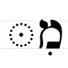

# Hebrew Prepositions

::: {.infobox .sound}
<figure> <audio id="myAudio" controls controlsList="nodownload" 
src="./images/06.intro.m4a"> 
Your browser does not support the <code>audio</code> element.</audio><button onclick="x25()" type="button">2.5x</button><button onclick="x2()" type="button">2x</button><button onclick="x15()" type="button">1.5x</button><button onclick="x1()" type="button">1x</button><button onclick="x075()" type="button">.75x</button><button onclick="x05()" type="button">.5x</button><script>
var x = document.getElementById("myAudio");
function x05() { 
    x.playbackRate = 0.5;
    x.play();}
function x075() { 
    x.playbackRate = 0.75;
    x.play();} 
function x1() { 
    x.playbackRate = 1;
     x.play();}
function x15() { 
    x.playbackRate = 1.5;
     x.play();} 
function x2() { 
    x.playbackRate = 2;
     x.play();} 
function x25() { 
    x.playbackRate = 2.5;
     x.play(); } 
</script></figure>
:::

> To comprehend Biblical Hebrew, we must be able to identify prepositions as we read the Text.

Prepositions give us space and context.  Prepositions are on almost every page as the authors seek to communicate this context to us.  Furthermore, there is one Hebrew word, <span class="he">מִן</span>, that is classified as a preposition, but, depending on the context, can convey a wide array of meanings. 

::: {.infobox .map}
**LESSON ITINERARY**

1. Recognize that a Nun with Silent Sheva becomes a Dagesh Forte
2. Describe Independent and Maqqef prepositions
3. Define Inseparable prepositions
4. Identify when a word with an inseparable preposition also has the definite article
5. Understand how <span class="he">מִן</span> is constructed
6. Define how <span class="he">מִן</span> is used
7. Identify the Definite Direct Object (DDO) marker
:::


::: {.infobox .stop}
**EQUIPMENT CHECK**

Before continuing, can you describe the following concepts?

* The construction of the definite article, including what happens when the Dagesh Forte is rejected
* The construction of the Vav conjunction
* How Hebrew handles indefinite words
:::

Prepositions are a lot of fun because of what they communicate to us.  So let's dig in!

## First Thought {-}

::: {.infobox .sound}
<figure> <audio id="myAudio" controls controlsList="nodownload" 
src="./images/06.ps7702.mp3">
Your browser does not support the <code>audio</code> element.</audio><button onclick="x25()" type="button">2.5x</button><button onclick="x2()" type="button">2x</button><button onclick="x15()" type="button">1.5x</button><button onclick="x1()" type="button">1x</button><button onclick="x075()" type="button">.75x</button><button onclick="x05()" type="button">.5x</button><script>
var x = document.getElementById("myAudio");
function x05() { 
    x.playbackRate = 0.5;
    x.play();}
function x075() { 
    x.playbackRate = 0.75;
    x.play();} 
function x1() { 
    x.playbackRate = 1;
     x.play();}
function x15() { 
    x.playbackRate = 1.5;
     x.play();} 
function x2() { 
    x.playbackRate = 2;
     x.play();} 
function x25() { 
    x.playbackRate = 2.5;
     x.play(); } 
</script></figure>
:::

### <span class="he">  בְּיוֹם צָרָתִי אֲדֹנָי דָּרָשְׁתִּי </span> {-}

_In the day of my trouble, I sought the Lord  (Psalms 77:3)_

Meditate and celebrate that the Lord is in the midst of our problems.

The בּ in <span class="he">בְּיוֹם</span> is an example of an "inseparable preposition" that means "in."  We will study various types of prepositions in this lesson.

*****

```{r, out.width = "600pt", fig.align='center', fig.cap="Mt. Precipice in Nazareth - suggested location of Luke 4:29 when the townsfolk took Yeshua 'up' the mountain, wanting to throw Him 'from' the cliff, 'down upon' the rocks, 'into' the valley below.  Again, He prevailed in His day of trouble.  Courtesy of the [Pictorial Library of Bible Lands](https://www.bibleplaces.com)"}

knitr::include_graphics("images/06-Nazareth Mount of Precipitation from west panorama, tb041003219.jpg")
``` 


## _Hebrew Quest_ Prepositions Lecture

View this 8-minute video from _Hebrew Quest_ introducing prepositions.  We will dig into the concepts in greater detail as we progress through the lesson. 

<div class="container">
<iframe class="responsive-iframe" src="https://www.youtube.com/embed/
yY3O8ByYNwI?start=1839&end=2303
&rel=0&showinfo=0&autohide=1&autoplay=1" frameborder="0"></iframe>
</div>

[Click to open video in a new tab](https://youtu.be/yY3O8ByYNwI?t=1839){target="_blank"}

Start: 30:40
End: 38:23


## Nun with Silent Sheva Becomes Dagesh Forte

::: {.infobox .sound}
<figure> <audio id="myAudio" controls controlsList="nodownload" 
src="./images/06.2.mp3">
Your browser does not support the <code>audio</code> element.</audio><button onclick="x25()" type="button">2.5x</button><button onclick="x2()" type="button">2x</button><button onclick="x15()" type="button">1.5x</button><button onclick="x1()" type="button">1x</button><button onclick="x075()" type="button">.75x</button><button onclick="x05()" type="button">.5x</button><script>
var x = document.getElementById("myAudio");
function x05() { 
    x.playbackRate = 0.5;
    x.play();}
function x075() { 
    x.playbackRate = 0.75;
    x.play();} 
function x1() { 
    x.playbackRate = 1;
     x.play();}
function x15() { 
    x.playbackRate = 1.5;
     x.play();} 
function x2() { 
    x.playbackRate = 2;
     x.play();} 
function x25() { 
    x.playbackRate = 2.5;
     x.play(); } 
</script></figure>
:::
```{r, out.width = "600pt", fig.align='center'}
library(knitr)

```

* Nun is considered a "weak letter" 
* One aspect of weak letters is that they disappear from a word under specific scenarios
* One such scenario is when the nun appears with a SILENT Sheva <span class="he">נְ</span> (or no vowel at all)
* When then nun drops, whenever possible, it will be replaced with a Dagesh Forte
* The technical term for this is called "assimilation"
    * So grammarians say, "the נ has assimilated into a Dagesh Forte"
* To get back to the original/lexical form, we would substitute the Dagesh Forte for the Nun+Sheva

::: {.box .light}
ASSIMILATED NUN

A Dagesh Forte frequently indicates an assimilated נ
:::

* When the Dagesh Forte is rejected, we have lost our big clue that a letter like נ has gone missing
    * We've said before that the Daghesh Forte is our friend; it alerts us that something unusual is going on
    * When the Daghesh Forte is rejected, we run the risk of missing out on something the language is trying to tell us
    * Occasionally, but not always, we will have Compensatory Lengthening to help us out


## Independent and Maqqef prepositions 

::: {.infobox .sound}
<figure> <audio id="myAudio" controls controlsList="nodownload" 
src="./images/06.3.mp3">
Your browser does not support the <code>audio</code> element.</audio><button onclick="x25()" type="button">2.5x</button><button onclick="x2()" type="button">2x</button><button onclick="x15()" type="button">1.5x</button><button onclick="x1()" type="button">1x</button><button onclick="x075()" type="button">.75x</button><button onclick="x05()" type="button">.5x</button><script>
var x = document.getElementById("myAudio");
function x05() { 
    x.playbackRate = 0.5;
    x.play();}
function x075() { 
    x.playbackRate = 0.75;
    x.play();} 
function x1() { 
    x.playbackRate = 1;
     x.play();}
function x15() { 
    x.playbackRate = 1.5;
     x.play();} 
function x2() { 
    x.playbackRate = 2;
     x.play();} 
function x25() { 
    x.playbackRate = 2.5;
     x.play(); } 
</script></figure>
:::

* There are three different types of Hebrew prepositions: independent, Maqqef, and inseparable
* An _independent preposition_ is a separate word with a space before it and after it
    * The preposition comes first, followed by its object (just like English). E.g.,  <span class="he">תַּחַת אֹתוֹ</span> (under it)
* _Maqqef_ is a mark like the English hyphen
    * The two marks are nearly identical in meaning and appearance
        * the Hebrew Maqqef is raised: א־בּ 
        * the English hyphen is midline: a-b  
    * Like the hyphen used to join two English words, the Maqqef lets us know that two Hebrew words are closely connected grammatically
* In a _Maqqef preposition_, the Maqqef connects a preposition to its object
    * Again, the preposition comes first:  <span class="he">עַל־מֶלֶךְ</span>
        * English prepositions are NOT written this way; we would never see "on-a-king."
    * One notable aspect about the Maqqef is that the first word (to the left of the Maqqef) loses its accent
        * As a result, the vowel that loses its accent may change
    
::: {.box .info}
The same preposition may be written both with and without the Maqqef

* The meaning does not change
* <span class="he">עַל מֶלֶךְ</span> means the same as <span class="he">עַל־מֶלֶךְ</span>
:::

## Inseparable prepositions

::: {.infobox .sound}
<figure> <audio id="myAudio" controls controlsList="nodownload" 
src="./images/06.4.mp3">
Your browser does not support the <code>audio</code> element.</audio><button onclick="x25()" type="button">2.5x</button><button onclick="x2()" type="button">2x</button><button onclick="x15()" type="button">1.5x</button><button onclick="x1()" type="button">1x</button><button onclick="x075()" type="button">.75x</button><button onclick="x05()" type="button">.5x</button><script>
var x = document.getElementById("myAudio");
function x05() { 
    x.playbackRate = 0.5;
    x.play();}
function x075() { 
    x.playbackRate = 0.75;
    x.play();} 
function x1() { 
    x.playbackRate = 1;
     x.play();}
function x15() { 
    x.playbackRate = 1.5;
     x.play();} 
function x2() { 
    x.playbackRate = 2;
     x.play();} 
function x25() { 
    x.playbackRate = 2.5;
     x.play(); } 
</script></figure>
:::

* Like <span class="he">וְ</span> for the word "and," an inseparable preposition is a one-letter prefix affixed to its object
* Three Hebrew prepositions are **ALWAYS** inseparable
    * <span class="he">בְּ</span> - in, at, with, by, against
        * <span class="he">בְּמֶ֫לֶךְ</span> -  With a king
    * <span class="he">כְּ</span> - as, like, according to
        * <span class="he">כְּמֶ֫לֶךְ</span> - Like a king
    * <span class="he">לְ</span> - to, toward, for
        * <span class="he">לְמֶ֫לֶךְ</span> - To/towards a king

::: {.box .info}
* A mnemonic to remember these three inseparable prepositions is "BucKLe"
* The first word of the Bible contains an inseparable preposition: <span class="he">בְּרֵאשִׁית</span> = "In (the) beginning"
:::

* In the lexical form of these prepositions, there is a Vocal Sheva vowel under the "buckle" consonant
* If there is a Sheva or Hateph vowel in the next letter, the Rule of Sheva come into play (see Lesson 4)
    * Before another Vocal Sheva, the preposition usually takes a Hireq
    * Before a Guttural with a Hateph vowel, the preposition takes the corresponding short vowel
    * Note the names of God again receive special treatment: <span class="he">לֵאלֹהִים</span> and <span class="he">לַיהוָה</span>
:::


* Finally, the ב and כ when they are the first letter of a word (as they usually will be), will take a Dagehsh Lene giving them the "hard" pronunciation
    * We actually saw this last lesson, but in a different context
    * It's <span class="he">בֵּן</span>, (between), but it's <span class="he">וּבֵן</span> (and between)
        * The conjunction ו becomes a וּּ before a BuMP letter
        * In this same example, you can see that <span class="he">בֵּן</span> (between) HAS the Dagesh Lene, but<span class="he">וּבֵן</span> (and between) does not and is pronounced with a "v" sound 

## _Hebrew Quest_ Preposition with Definite Article Lecture

View this 2-minute video from _Hebrew Quest_. You can ignore the references to Essentials of Biblical Hebrew. We will dig into the concepts in greater detail as we progress through the lesson. 

<div class="container">
<iframe class="responsive-iframe" src="https://www.youtube.com/embed/
yY3O8ByYNwI?start=2303&end=2460
&rel=0&showinfo=0&autohide=1&autoplay=1" frameborder="0"></iframe>
</div>

[Click to open video in a new tab](https://youtu.be/yY3O8ByYNwI?t=2303){target="_blank"}

Start: 38:23
End: 41:00


## The Article and Inseparable Prepositions

::: {.infobox .sound}
<figure> <audio id="myAudio" controls controlsList="nodownload" 
src="./images/06.6.mp3">
Your browser does not support the <code>audio</code> element.</audio><button onclick="x25()" type="button">2.5x</button><button onclick="x2()" type="button">2x</button><button onclick="x15()" type="button">1.5x</button><button onclick="x1()" type="button">1x</button><button onclick="x075()" type="button">.75x</button><button onclick="x05()" type="button">.5x</button><script>
var x = document.getElementById("myAudio");
function x05() { 
    x.playbackRate = 0.5;
    x.play();}
function x075() { 
    x.playbackRate = 0.75;
    x.play();} 
function x1() { 
    x.playbackRate = 1;
     x.play();}
function x15() { 
    x.playbackRate = 1.5;
     x.play();} 
function x2() { 
    x.playbackRate = 2;
     x.play();} 
function x25() { 
    x.playbackRate = 2.5;
     x.play(); } 
</script></figure>
:::
* When a word has both the Article and an inseparable preposition, a form of contraction occurs:
    * The one-letter preposition replaces the <span class="he">ה</span> of the Article
    * The vowel under the preposition and the Dagesh Forte (if it is there) are your clues that the word is definite.

```{r, out.width = "800pt", fig.align='center'}
library(knitr)
knitr::include_graphics("images/06.preposition_article.png")
```

### FIX GRAPHIC ^^^

* On reason we spend so much time talking about the Dagesh Forte is that it is an extremely useful clue as to what is going on within a word
* When a letter rejects the Dagesh Forte, this clue is gone
* Below is how we can tell whether there is the article with a preposition in the absence of a Dagesh

::: {.box .light}
ARTICLE WITH PREPOSITION

* NO ARTICLE if there is a Sheva under the preposition - the article never takes a Sheva
* NO ARTICLE if the short vowel under the preposition can be explained by the Rules of Sheva: 
    * <span class="he">אֲנָשִׁים + לְ = לַאֲנָשִׁים</span> - for men, (not 'for the men')
* ARTICLE if vowel under the preposition is not Sheva and can NOT be explained by the Rule of Sheva: 
    * <span class="he">לַהֵיכָל</span> = for THE temple
:::

## The flexible מִן: construction

::: {.infobox .sound}
<figure> <audio id="myAudio" controls controlsList="nodownload" 
src="./images/06.7.mp3">
Your browser does not support the <code>audio</code> element.</audio><button onclick="x25()" type="button">2.5x</button><button onclick="x2()" type="button">2x</button><button onclick="x15()" type="button">1.5x</button><button onclick="x1()" type="button">1x</button><button onclick="x075()" type="button">.75x</button><button onclick="x05()" type="button">.5x</button><script>
var x = document.getElementById("myAudio");
function x05() { 
    x.playbackRate = 0.5;
    x.play();}
function x075() { 
    x.playbackRate = 0.75;
    x.play();} 
function x1() { 
    x.playbackRate = 1;
     x.play();}
function x15() { 
    x.playbackRate = 1.5;
     x.play();} 
function x2() { 
    x.playbackRate = 2;
     x.play();} 
function x25() { 
    x.playbackRate = 2.5;
     x.play(); } 
</script></figure>
:::

* <span class="he">מִן</span> is a unique preposition
    * It can be a Maqqef preposition, as in <span class="he">מִן־זָהָב</span>
    * It can also be an inseparable preposition: <span class="he">מִזָּהָב</span>
    * Both examples above literally mean "from gold" 
* Note the spelling of the inseparable preposition:

```{r, out.width = "100pt", fig.align='center'}
library(knitr)

```

* When we see `Mem+Hireq+Dagesh`, we know it is <span class="he">מִן</span> written as an inseparable preposition
* As we know by now, the Gutturals and Resh reject the Dagesh Forte:
    * <span class="he">א ע ה ר</span> have compensatory lengthening, so the Hireq becomes Tsere
    * <span class="he">ח</span> has virtual doubling, which as we remember means "virtually no doubling" in that the vowel under the <span class="he">מ</span> remains a Hireq
* SQiN eM LeVY with a Sheva may reject the Dagesh
    * As we know, there will never be any Compensatory Lengthening with a SQiN eM LeVY scenario
    * When we see מִקְ, מִיְ or Mem+Hireq followed by a SQiN eM LeVY letter and there is no Dagesh Forte, this may be a clue
    * We should say to ourselves, "I don't see a Dagesh Forte, but that's a `SQiN eM LeVY` letter. This may still be מִן."

## The Article and מִן

::: {.infobox .sound}
<figure> <audio id="myAudio" controls controlsList="nodownload" 
src="./images/06.8.mp3">
Your browser does not support the <code>audio</code> element.</audio><button onclick="x25()" type="button">2.5x</button><button onclick="x2()" type="button">2x</button><button onclick="x15()" type="button">1.5x</button><button onclick="x1()" type="button">1x</button><button onclick="x075()" type="button">.75x</button><button onclick="x05()" type="button">.5x</button><script>
var x = document.getElementById("myAudio");
function x05() { 
    x.playbackRate = 0.5;
    x.play();}
function x075() { 
    x.playbackRate = 0.75;
    x.play();} 
function x1() { 
    x.playbackRate = 1;
     x.play();}
function x15() { 
    x.playbackRate = 1.5;
     x.play();} 
function x2() { 
    x.playbackRate = 2;
     x.play();} 
function x25() { 
    x.playbackRate = 2.5;
     x.play(); } 
</script></figure>
:::

Unlike the regular "BucKLe" inseparable prepositions, the <span class="he">ה</span> of the article is ALWAYS RETAINED with <span class="he">מִן</span>

* <span class="he">מֵהָאָ֫רֶץ</sp = from the land.

<!-- 6.9 -->
## The flexible מִן: meanings 

::: {.infobox .sound}
<figure> <audio id="myAudio" controls controlsList="nodownload" 
src="./images/06.9.mp3">
Your browser does not support the <code>audio</code> element.</audio><button onclick="x25()" type="button">2.5x</button><button onclick="x2()" type="button">2x</button><button onclick="x15()" type="button">1.5x</button><button onclick="x1()" type="button">1x</button><button onclick="x075()" type="button">.75x</button><button onclick="x05()" type="button">.5x</button><script>
var x = document.getElementById("myAudio");
function x05() { 
    x.playbackRate = 0.5;
    x.play();}
function x075() { 
    x.playbackRate = 0.75;
    x.play();} 
function x1() { 
    x.playbackRate = 1;
     x.play();}
function x15() { 
    x.playbackRate = 1.5;
     x.play();} 
function x2() { 
    x.playbackRate = 2;
     x.play();} 
function x25() { 
    x.playbackRate = 2.5;
     x.play(); } 
</script></figure>
:::

* <span class="he">מִן</span> occurs 7,592 times in the Bible, and can have multiple meanings
* The most direct purpose is "from" - <span class="he">מֵהָאָ֫רֶץ</span> from the land
* <span class="he">מִן</span> can also have comparative (think "bigger") and superlative (think "biggest") meanings depending on the context
    * <span class="he">טוֹבָה חָכְמָה מִזָּהָב</span> = wisdom is better *than* gold 
    * <span class="he">קָשָׁה הָעֲבֹדָה מֵהָאֲנָשִׁים</span> = the work is *too* difficult *for* the men
    * <span class="he">עָרוּם מִכֹל חַיַּת הַשָֹּדֶה</span>  = the *most* clever living thing *of all* the field
* There is also a use called "partitive" that denotes a portion or part of something else:
    * <span class="he">מֵהָאֲנָשִׁים</span> may mean "*some* *of* the men" (lit. from the men)
* Other uses: 'because', 'by', 'without', 'even', 'namely'.


::: {.box .info}
MEANING OF <span class="he">מִן</span>

* This is a word that takes practice to appreciate the various nuanced meanings
* As you are starting out in Hebrew, when you see <span class="he">מִן</span>, start your translation with "from..."
* However, don't be surprised if "from" does not make sense
* For example, if our translation is something like, "good the wisdom from the gold," we know that doesn't make sense
    * We need to remember the comparative or superlative uses
    * "_Better_ is wisdom _than_ gold"
:::

## The Definite Direct Object marker 

::: {.infobox .sound}
<figure> <audio id="myAudio" controls controlsList="nodownload" 
src="./images/06.10.mp3">
Your browser does not support the <code>audio</code> element.</audio><button onclick="x25()" type="button">2.5x</button><button onclick="x2()" type="button">2x</button><button onclick="x15()" type="button">1.5x</button><button onclick="x1()" type="button">1x</button><button onclick="x075()" type="button">.75x</button><button onclick="x05()" type="button">.5x</button><script>
var x = document.getElementById("myAudio");
function x05() { 
    x.playbackRate = 0.5;
    x.play();}
function x075() { 
    x.playbackRate = 0.75;
    x.play();} 
function x1() { 
    x.playbackRate = 1;
     x.play();}
function x15() { 
    x.playbackRate = 1.5;
     x.play();} 
function x2() { 
    x.playbackRate = 2;
     x.play();} 
function x25() { 
    x.playbackRate = 2.5;
     x.play(); } 
</script></figure>
:::

* Hebrew has a word that is often used to mark a definite direct object (DDO)
* It has no translational value
* Spelling:
    * <span class="he">אֵת</span> (independent) 
    * <span class="he">אֶת־</span> (Maqqef)
* The challenge can be that this is the same spelling as the preposition "with" 
* As both the DDO and preposition can take pronominal suffixes, we will save a discussion of differentiating between the two words for Lesson 9 

::: {.box .info}
We see the DDO twice in the first verse of the Bible:

<span class="he">בְּרֵאשִׁית בָּרָא אֱלֹהִים *אֵת* הַשָּׁמַיִם *וְאֵת* הָאָרֶץ</span>

:::

## _Hebrew Quest_ discussion of Genesis 1:1 

* As a conclusion to this lesson, please watch the video below where Izzy discusses how to read a passage using Genesis 1:1
* Genesis 1:1 contains examples of the Article, the conjunction, an inseparable preposition and the DDO marker (Izzy also discusses how the DDO speaks of Messiah!)
* We encourage you to take notes using [a blank copy of Genesis 1:1-5](https://docs.google.com/document/d/1FIQAtWfWlrWmzX5pKR6esRLzJKFdv5Szx3mb5_zWwLg/copy){target="_blank"}^[In Unit 3, you will have the option of completing our "_Hebrew Quest_ Study Passage Track".  In Lesson 17, we will study Genesis 1:1-5, which is why this document has verses 1-5.]

<div class="container">
<iframe class="responsive-iframe" src="https://youtube.com/embed/sQKorif_GBk?start=732&end=2815" frameborder="0"></iframe>
</div>

[Click to open video in a new tab](https://youtu.be/sQKorif_GBk?t=732){target="_blank"}

Start: 12:12
End: 46:55

## Conclusion {-}

::: {.infobox .sound}
<figure> <audio id="myAudio" controls controlsList="nodownload" 
src="./images/06.conclusion.mp3">
Your browser does not support the <code>audio</code> element.</audio><button onclick="x25()" type="button">2.5x</button><button onclick="x2()" type="button">2x</button><button onclick="x15()" type="button">1.5x</button><button onclick="x1()" type="button">1x</button><button onclick="x075()" type="button">.75x</button><button onclick="x05()" type="button">.5x</button><script>
var x = document.getElementById("myAudio");
function x05() { 
    x.playbackRate = 0.5;
    x.play();}
function x075() { 
    x.playbackRate = 0.75;
    x.play();} 
function x1() { 
    x.playbackRate = 1;
     x.play();}
function x15() { 
    x.playbackRate = 1.5;
     x.play();} 
function x2() { 
    x.playbackRate = 2;
     x.play();} 
function x25() { 
    x.playbackRate = 2.5;
     x.play(); } 
</script></figure>
:::
How are you feeling so far?  Is any component of "the fog" refusing to dissipate? Keep sticking with `Anki`, and try to do your reviews at least once daily.

To help with this, we've gone a little bit lighter on the Grammar cards and the Ruth Pursuit for Lesson 6.  While there are some differences, prepositions are used much the same way in Hebrew as they are in English.  There is no sense in creating a lot of busy work.

We recommend using the time between now and starting Lesson 7 to get caught up and make sure the new concepts begin to take hold.  You might notice the intensity pick up with the next few lessons as we get into some ways Hebrew handles adjectives and pronouns.  Until then, enjoy learning some more of God's word with Izzy in the `Word warm-up` and `Verse warm-up`.

### Anki {-}

* `Lesson 06 A. Vocab`
* `Lesson 06 B. Grammar`
* `Lesson 06 C. Workbook`
    * In this activity, we will have brief passages of scripture that illustrate prepositions.
    * Make sure you look up any words you do not know.  You can download an abridged lexicon [here](./images/BBH_Lexicon.pdf){target="_blank"}.
* `Lesson 06 D. Verses`


## Word Warm-up {-}


<div class="container">
<iframe class="responsive-iframe" src="https://youtube.com/embed/LL7YtEVZ8F0" frameborder="0"></iframe>
</div>

[Click to open `Word Warm-up` video in a new tab](https://youtu.be/LL7YtEVZ8F0){target="_blank"}


## Verses Warm-up {-}

<div class="container">
<iframe class="responsive-iframe" src="https://youtube.com/embed/isjp1Q3WPRE" frameborder="0"></iframe>
</div>

[Click to open `Verses Warm-up` video in a new tab](https://youtube.com/embed/isjp1Q3WPRE){target="_blank"}

## Ruth Pursuit {-}        

::: {.infobox .sound}
<figure> <audio id="myAudio" controls controlsList="nodownload" 
src="./images/06.ruth.mp3">
Your browser does not support the <code>audio</code> element.</audio><button onclick="x25()" type="button">2.5x</button><button onclick="x2()" type="button">2x</button><button onclick="x15()" type="button">1.5x</button><button onclick="x1()" type="button">1x</button><button onclick="x075()" type="button">.75x</button><button onclick="x05()" type="button">.5x</button><script>
var x = document.getElementById("myAudio");
function x05() { 
    x.playbackRate = 0.5;
    x.play();}
function x075() { 
    x.playbackRate = 0.75;
    x.play();} 
function x1() { 
    x.playbackRate = 1;
     x.play();}
function x15() { 
    x.playbackRate = 1.5;
     x.play();} 
function x2() { 
    x.playbackRate = 2;
     x.play();} 
function x25() { 
    x.playbackRate = 2.5;
     x.play(); } 
</script></figure>
:::

::: {.box .map}
YOUR QUEST

1. Highlight the following words that begin with the inseparable prepositions and provide a definition (Yellow)
    * <span class="he">בָּאָרֶץ</span>
    * <span class="he">בַדֶּרֶךְ</span>     
    * <span class="he">לְבֵית</span>
    * <span class="he">לִי</span>     
2. Find examples of מִן (there is one Maqqef and the rest are inseparable) - translate the Maqqef phrase (look up the object of the מִן preposition in a lexicon if needed) (Green)
3. Find one example of the DDO (Maqqef) (Blue)
4. Find Lesson 6 vocabulary words:
    * <span class="he">עַד</span>
    * <span class="he">אַחֲרֵי
</span> (note: In Ruth 1, one instance of this word also has a מִן prefix (inseparable form) as well as a pronominal suffix, which we will study in Lesson 9)
    * <span class="he">כָּל־</span>(Pink)
:::

* [Blank copy of Ruth 1](https://drive.google.com/file/d/1qcfTKAlTJGChC2eYCMhSbY2w-ibzCcDV/copy){target="_blank"}
* [Ruth Pursuit Answer Key #6](./images/06_Ruth_Pursuit_KEY.pdf){target="_blank"}


## Quest Quiz {-}

[Open Quest Quiz #6 in a new window](https://forms.gle/oeB8E6K4y4mTjPWGA){target="_blank"}


<div class="containerLet">
<iframe class="responsive-iframe" src="https://docs.google.com/forms/d/e/1FAIpQLScSk6Jya_wOUJ4W88s8wcvY-3NyS2FnDmle4T6yo00Fus4Nmg/viewform?embedded=true" frameborder="0"></iframe>
</div>