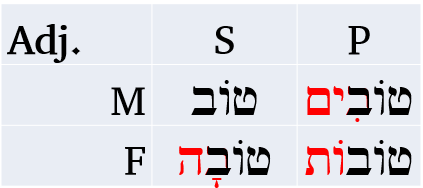

# Hebrew Adjectives

> To comprehend Biblical Hebrew, we must be able to identify and translate an adjective based on its usage, gender, and number


::: {.infobox .map}
**LESSON ITINERARY**

1. Understand how an adjective relates to the noun it is modifying
1. Define and identify Substantival se
1. Define and identify Attributive use
1. Define and identify Predicative use
1. Determine the appropriate adjectival use in a passage
1. Define the function of the Mappiq and differentiate it from Daghesh marks
1. Recognize the Directional Ending and differentiate it from the vowel ה ָ
:::

::: {.box .stop}
EQUIPMENT CHECK

Before continuing, can you describe the following concepts?

* Inseparable prepositions with and without the definite article
* Construction and meaning of מִן, including assimilation of the נ

:::

## First Thought {-}

### <span class="he">אֶת־הַכֹּל עָשָׂה יָפֶה בְעִתּוֹ</span> {-}

_He has made everything appropriate (beautiful) in its time.  (Ecclesiastes 3:11)_

Offer a word of gratitude that HaShem has made you beautiful!

<span class="he">יָפֶה</span> is an example of predicate adjective use, which we will study in this lesson.

<figure>
    <figcaption>Listen to the verse in Hebrew:</figcaption>
    <audio
        controls controlsList="nodownload"
        src="./images/07.ecc0311.mp3">
            Your browser does not support the
            <code>audio</code> element.
    </audio>
</figure>

*****

```{r, out.width = "400pt", fig.align='center', fig.cap="Tabgha - suggested location of Yeshua's restoration (making beautiful) of Shimon Kefa (Peter) on the beach in John 21, following Peter's denial of Yeshua a few days earlier. Courtesy of the [Pictorial Library of Bible Lands](https://www.bibleplaces.com)"}

knitr::include_graphics("images/07-Tabgha sacred stone where Jesus stood, tb102602022.jpg")
``` 


## Inflecting Adjectives

Adjective inflection is relatively straight-forward.

We will use the paradigm word <span class="he">טוֹב</span> to illustrate

```{r, out.width = "300pt", fig.align='center'}
library(knitr)

```


1. An adjective is either masculine or feminine
2. An adjective is either singular or plural (dual nouns take plural adjectives)
3. An adjective will match the gender and number of the noun that it modifies or for which it substitutes
    * Note that for irregular nouns, the adjective will not necessarily match the exact ending
    * <span class="he">נָשִׁים טוֹבוֹת</span> - even though "<span class="he">נָשִׁים</span>" has the irregular -im ending, the adjective <span class="he">טוֹבוֹת</span> remains the regular feminine plural
4. An adjectives will use expected endings


Unlike nouns, adjectives can inflect across genders in order to match the respective gender of the noun.  

The Lexical Form of an adjective is the MS.  MS is usually endingless, but can be Seghol+Hei as in <span class="he">יָפֶה</span>, which is MS for pleasing, beautiful.


::: {.box .info}
Note that unlike <span class="he">טוֹב</span>, most adjectives undergo vowel changes when the inflectional endings are added. 
The good news is you already know what to do. Adjectives follow the same rules as nouns.

:::

## Substantival Use

In the Substantival use, the adjective acts as a noun. We could say the "Substantiv Substitutes" for a noun. 

Perhaps an obvious example of this from pop culture is the film, "The Good, The Bad, and The Ugly."  The three words, "good", "bad" and "ugly" are adjectives being used as nouns.  In a sense the noun is implied.  It could be the "good ones" or the "bad man".

The Substantival use in Hebrew is relatively easy to identify.  You will see an adjective but there will be no related noun that matches in gender and number.

<span class="he">הַטּוֹבָה</span> - "the good" (feminine singular something). So depending on the context it could be "the good woman", or a feminine object like "the good Torah."

::: {.box .light}
In substantival use, the adjective never directly modifies a noun.
:::

## Attributive Use

The Attributive use is usually what we think of with respect to adjectives. The adjective modifies and describes a noun. "The good book" is an example of the Attributive use.

Hebrew makes it much easier to identify the Attributive use.  The adjective MUST come AFTER the noun it modifies, and it MUST match in definiteness - meaning either both the noun and the adjective have the definite article or they both will not have the article.

* <span class="he">הָאִשָּׁה הָטּוֹבָה</span> - the good woman
* <span class="he">אִשָּׁה טוֹבָה</span> - a good woman (or "the woman is good"-predicate use; see next section)

::: {.box .light}
**A**ttributive **A**fter noun, **A**rticle **A**grees
:::

## Predicative Use

The Predicative use (often called the predicate use) asserts something about the noun. The noun is the subject and the adjective is the predicate of the sentence: "The book is good."

The Predicative use is more flexible than the Attributive, in that the adjective can be either before or after the noun.  One way to differentiate it from the Attributive use is the Predicative use WILL NOT have the Article.


All of the options below can mean "the woman is good":

* <span class="he">טוֹבָה הָאִשָּׁה</span>
* <span class="he">הָאִשָּׁה טוֹבָה</span>
* <span class="he">טוֹבָה אִשָּׁה</span>
* <span class="he">אִשָּׁה טוֹבָה</span> (or "attributative")

As this illustrates, the only time there can be any ambiguity between Attributive and Predicative is when the adjective follows the noun and both are indefinite.  In these situations, we need to let context determine the use.

::: {.box .light}
**P**redicative de**P**rived of the article; **P**erhaps **P**rior
:::

## Adjective Use Summary

Here is a decision tree:

* Is the adjective modifying a noun?
    * No - *Substantival*
    * Yes - does the adjective have the article?
        * Yes - *Attributive* (Predicate dePrived of Article)
        * No - is the adjective before the noun?
            * Yes - *Predicate* (Attributive Always After)
            * No - Potentially ambiguous when both noun and following adjective are indefinite: Predicate or Attributive depending on context

## The Mappiq 

The Mappiq is a mark that looks exactly like a Daghesh, but it ONLY is found in a word-final Hei (a Hei that is the final letter of a word).

It is virtually impossible to confuse a Daghesh and a Mappiq because <span class="he">ה</span> can never take a Daghesh.

A word-final <span class="he">ה</span> is always a vowel unless it has a mappiq (<span class="he">הּ</span>).

The mappiq is a sign that the breathy sound of the consonantal hei should be accentuated slightly.

At the end of a word:

* <span class="he">ה ָ</span>  - "aaw"(long A sound)
* <span class="he">הּ ָ</span>  - "ahh"(breathy)

## The Directional Ending 

We've studied the fact that the <span class="he">ה ָ</span>  is the Feminine Singular ending.  We now need to refine this definition slightly.  

* An ACCENTED <span class="he">ה ָ</span>  is the FS ending
* However, an UNACCENTED <span class="he">ה ָ</span>  is known as a "directional ending"
* The directional ending is used to indicate motion towards or to, whatever the noun is
    * <span class="he">אַ֫רְצָה</span> - to/toward a land
    * <span class="he">הָעִ֫ירָה</span> - to/toward the city

Note that <span class="he">אֶל־הָאָ֫רֶץ</span> and <span class="he">אַ֫רְצָה</span> are essentially synonymous.

<span class="he">אָנֹכִי אֵרֵד עִמְּךָ מִצְרַ֫יְמָה </span>

_I will go down with you to Egypt (Gen 46:4)_

## Word Warm-up {-}

[Click to open `Word Warm-up` video in a new tab](https://youtu.be/8GIYqACoOcQ){target="_blank"}

<div class="container">
<iframe class="responsive-iframe" src="https://youtube.com/embed/8GIYqACoOcQ" frameborder="0"></iframe>
</div>

## Verses Warm-up {-}

[Click to open `Verses Warm-up` video in a new tab](https://youtu.be/s0JvZ9z0jAg){target="_blank"}

<div class="container">
<iframe class="responsive-iframe" src="https://youtube.com/embed/s0JvZ9z0jAg" frameborder="0"></iframe>
</div>

## Anki {-}

* `Lesson 07 A. Vocab`
* `Lesson 07 B. Grammar` 
* `Lesson 07 C. Workbook`
    * In this activity, we will have very short passages of scripture that illustrate adjectives, including examples of attributive and predicate use
    * Be sure to look up any words you do not know.  
* `Lesson 07 D. Verses`


## Ruth Pursuit {-}        

::: {.box .map}
YOUR QUEST

Curiously, there are a lack of adjectives in Ruth 1.  There are participles, which are verbal adjectives we will study in Lesson 22.    

1. There are several mappiq marks that should be relatively easy for you to locate (yellow)
2. Vocabulary words (green)
    1. Find the Hebrew word for "name", that you learned in the Lesson 3 Vocab. Frequently, the word has the Vav conjunction.
    2. Find the word for "very"
    3. Find the word for "daughters" - it occurs with a pronominal suffix, and means "my daughters"
    4. Find the phrase joined with a Maqqef that means "to the land (of)"
3. Other words (pink)
    1. Towards the end of the chapter, Naomi says "don't call me Naomi (pleasant) call me 'Mara' (bitter). Find the word for Bitter.  It occurs twice in two different forms.
    2. Find the word for Orpah
    3. <span class="he">רֵיקָם</span> is a word that means "empty". It occurs 16x, and almost always with the sense of sending someone away empty-handed.<small>^[<small>A chuckle-worthy example is 1st Samuel 6:3 when the Philistines realize that the Ark is causing nothing but trouble for them.  They purposed to send the Ark back to Israel, but said "send it not empty!" They sent it back with trespass offerings representing the plagues they suffered: five golden mice and, apparently, five golden hemorrhoids!</small>]</small>. In Ruth 1, Naomi said she left full but was sent back empty.  Find the one example of this word near the end of the chapter.
:::


* [Blank copy of Ruth 1](https://drive.google.com/file/d/1qcfTKAlTJGChC2eYCMhSbY2w-ibzCcDV/view?usp=sharing){target="_blank"}
* [Ruth Pursuit Answer Key #8](./images/08_Ruth_Pursuit_KEY.pdf){target="_blank"}
* Don't forget to update your `Ruth Pursuit Translation` worksheet with new words identified through lesson 7.

## Quest Quiz {-}

[Open Quest Quiz #07 in a new window](https://forms.gle/uYiUgRBWeRJikaR57){target="_blank"}

<div class="container">
<iframe class="responsive-iframe" src="https://docs.google.com/forms/d/e/1FAIpQLSdheixGPVo9sfn-K51QEgjP8qaZQyqd2uQY6yAGV4hn8vqYyg/viewform?embedded=true" frameborder="0"></iframe>
</div>


## Claim your next `Twelve Tribes Badge`! {-}

Check to be sure you have have completed **all activities** through this lesson, then fill out the form below.

[Check the requirements here](https://docs.google.com/spreadsheets/d/1t0C7JlygyUqgF_aQWbhq7h3s_VDn0VuvISJn5mp-LdE/edit?usp=sharing){target="_blank"}, then complete the certification and claim your badge below:

<!-- Tribe Badge 3 = Dan -->

<div class="container">
<iframe class="responsive-iframe" src="https://docs.google.com/forms/d/e/1FAIpQLSf0XIRTMiuOVLITH3DMpt8xDygItycZgs9JY3uIAc1ntmVoow/viewform?embedded=true" frameborder="0"></iframe>
</div>
