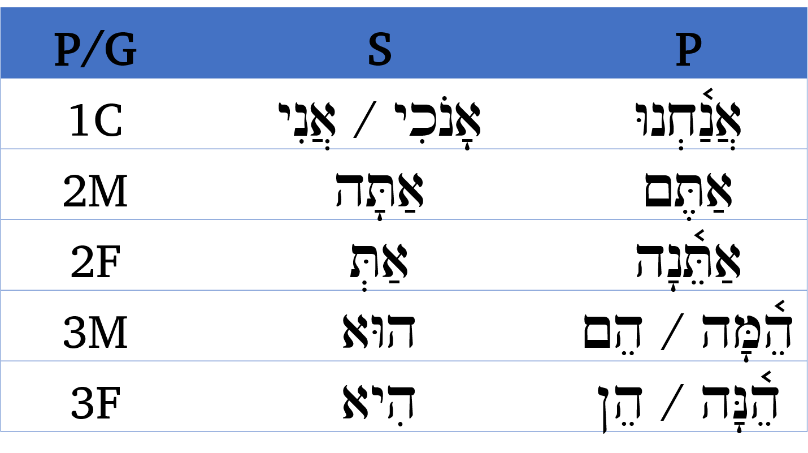
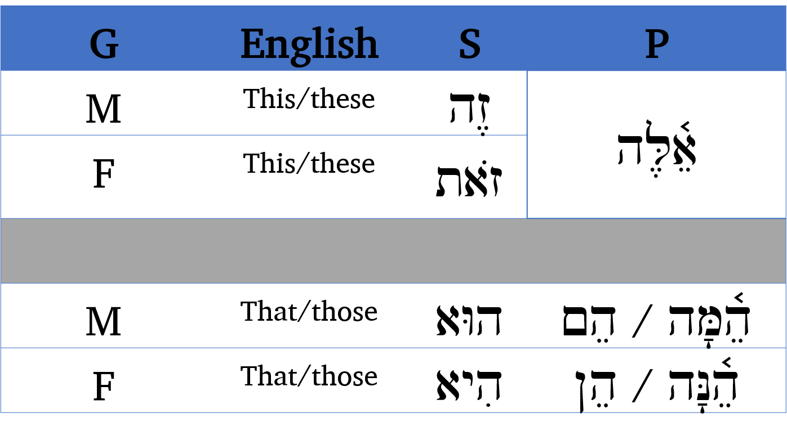

# Hebrew Pronouns

> In order to comprehend Biblical Hebrew, we must be able to know pronouns with gender, number and person 

Pronouns are essentially a language's shorthand so we don't have to keep repeating nouns (because saying all of those nouns over and over can really wear you down).

As such, this is an important chapter.  If you want to understand what you're reading, you will need a firm grasp of pronouns to help decipher what is happening in the narrative.

::: {.infobox}
**Seven Practical Points for Lesson 8**


1. Independent Personal Pronoun
2. Relative Pronoun
3. Interrogative Pronoun
4. Interrogative Particle
5. Near and Far Demonstratives
6. Demonstrative Adjective
7. Demonstrative Pronoun
:::

## First Thoughts {-}

Pray that you continually walk in His way, not your own way

> (Isaiah 30:21 NASB) This is the way, walk in it  
זֶה הַדֶּרֶךְ לְכוּ בוֹ

<figure>
    <figcaption>Listen to the verse in Hebrew:</figcaption>
    <audio
        controls controlsList="nodownload"
        src="./images/08.is3021.mp3">
            Your browser does not support the
            <code>audio</code> element.
    </audio>
</figure>

*****

```{r, out.width = "600pt", fig.align='center', fig.cap="Sea of Galilee and Plain of Gennesaret. Yeshua likely walked through the valley below on His way from Nazareth to Capernaum. Courtesy of the [Pictorial Library of Bible Lands](https://www.bibleplaces.com)"}


``` 

## Equipment Check {-}

```{r, out.width = "300pt", fig.align='center'}
library(knitr)
include_graphics("images/stopil.png")
```

Before continuing, can you describe the following concepts?

*

## Independent Personal Pronoun

Independent personal pronouns are _always_ subjects, meaning they are equivalent to I, you, she, he, it and they in English (NOT me, my, her, him, his)

```{r, out.width = "400pt", fig.align='center'}
library(knitr)

```

You will work to memorize these in `Anki`.

Notes:

* This is the first time we are officially using all three elements of Person, Gender and Number.  3MS is shorthand for Person = 3rd Person, Gender = Masculine, Number=Singular
* For 1st person, Hebrew, like English, does not distinguish between gender in the first person.  A woman says "I" and a man says "I"
    * אָנֹכִי is considered more formal or emphatic.  It is often translated, "I, myself"
* Note the following memory aids:
    * All 1st person pronouns begin with אנ
    * All 2 begin with accented אַתּ֫ - note the Daghesh Forte
    * All 3 begin with accented ה֫
    * All MP end with either מָה or ם. Think "monks" since men are monks
    * All FP end with either נָה or ן. Think "nuns" since women are nuns
    * Who is he? He is she.
* Do not confuse אַתָּה (you 2MS) with עַתָּה (now)
    
## Relative Pronoun אֲשֶׁר

* Hebrew has one general-purpose relative pronoun
* אֲשֶׁר is a vocabulary word for this lesson
* This word does not inflect/the spelling never changes
* It can refer to people (who) or things (that), subjectively (who) or objectively (whom)

Example Deuteronomy 1:1

> אֵלֶּה הַדְּבָרִים *אֲשֶׁר* דִּבֶּר מֹשֶׁה

These are the words *that* Moses spoke

## Interrogative Pronoun

* מִי = who ("Who, me?")
* מָה = what (think of your mom questioning you, "What, ma?")
    * Can also be written as Maqqef - note the vowel shortens מַה־
*   לָמָה = why
    * Remember the familiar verse "אֵלִ֣י אֵ֖לִי לָמָ֣ה עֲזַבְתָּ֑נִי " - My God, my God, WHY have you forsaken me?

Usually these words will appear at the beginning of a clause

## Interrogative Particle הֲ

English has a question mark at the end of a sentence. Hebrew has what is called an interrogative particle at the BEGINNING of a sentence that asks a yes/no question.

Questions that ask who? what? or why? will use the interrogative pronouns.

### Interrogative Particle vs Definite Article {-}

In most cases you will not have trouble differentiating the Article from the Interrogative Particle.  Below are potential sources of ambiguity:

* 1st word of a clause before חָ֫,חָ, הָ, עָ   = both are הֶ
* 1st word of a clause before ה, ח without Qamets or SQiN eM LeVY with Sheva = both are הַ

In these situations, you guessed it, you will need to let context determine whether a question is being asked.  With lots of reading practice, this will get easier.  


## Near and Far Demonstratives

In English, the near demonstratives are this and these. The far demonstratives are that and those.  Think of "this right here" and "those, over there".

Hebrew has three words to indicate nearness.  We already learned the words to indicate distance - they are the same as the subject pronouns.


```{r, out.width = "400pt", fig.align='center'}
library(knitr)

```

## Demonstrative Adjective 

Demonstratives act as adjectives or as pronouns.

A demonstrative adjective modifies a noun just as an attributive adjective does.  These daughters.

The behavior is a lot like the Attributive use: 

* Always comes after the noun (Dem Adjective Always After)
* Always has the article (Dem. Adjective Always Article)
* Always matches in Gender and Number
    * הָאִשָּׁה הַזֹּאת = this woman (FS)
    * הָאֲנָשִׁים הָהֵם  = those men (MP)

Mnemonic: 

> Demonstrative Adjective Always After noun, Always has Article

## Demonstrative Pronoun


A demonstrative pronoun takes the place of a noun as the subject of a clause.  This is her daughter.

The behavior is a lot like the Predicative use: 

* Always comes before the noun (Pronoun Perpetually Precedes)
* Does NOT have the article (Pronoun dePrived of article)
* Matches Gender and Number
    * זֹאת הַמַּלְכָּה  = this is the queen (FS)
    * זֶה הַמֶּ֫לֶךְ = this is the king (MS)
    
Mnemonic:

> Demonstrative Pronoun Perpetually Precedes, Perpetually dePrived of article

## Conclusion and Intro to Activities {-}

Your mission for the next two lessons is to focus on building your pronoun vocabulary.  You may notice more `Anki` words than usual to learn but most of these are short (and for next lesson, the pronouns will mostly be two letters each).  After you finish the stack in `Anki` we have two pronoun worksheets for you to test your memory.

It is important to know the gender, number, and where necessary the person of each.  Also the concept of multiple ways to say "you" can be confusing to the English speaker.  It's important to give the PGN, for example אַתֵּ֫נָה means "you (2FP)."

If you can picture yourself hiking the trails of Israel,  Lessons 8, 9, and 10 may represent some hills where you may need to push a little bit extra.  Then we'll get a bit of a breather with Lessons 11 and 12 before ramping up again with Verbs.  Keep at it!  You're doing awesome!

## `Word Warm-up` {-}

[Click to open `Word Warm-up` video in a new tab](https://youtu.be/8GIYqACoOcQ){target="_blank"}

<iframe width="768" height="432" src="https://youtu.be/8GIYqACoOcQ" frameborder="0" allow="accelerometer; autoplay; clipboard-write; encrypted-media; gyroscope; picture-in-picture" allowfullscreen></iframe>

## `Verses Warm-up` {-}

[Click to open `Verses Warm-up` video in a new tab](https://youtu.be/XXn6G8EWmn0){target="_blank"}

<iframe width="768" height="432" src="https://youtu.be/XXn6G8EWmn0" frameborder="0" allow="accelerometer; autoplay; clipboard-write; encrypted-media; gyroscope; picture-in-picture" allowfullscreen></iframe>

## `Anki` {-}

* `Lesson 08 A. Vocab`
* `Lesson 08 B. Grammar` 
* `Lesson 08 C. Workbook`
    * In this activity, we will have very short passages of scripture that illustrate pronouns
* `Lesson 08 D. Verses`

## `Worksheets`: Pronouns {-}

We have two worksheets for this lesson. Make sure you do the Anki work first, before tackling these worksheets.

While our focus is on reading Hebrew, pronouns are so prevalent that it's highly beneficial to commit them to memory.  Review the column on the right, then cover it up and try to complete the remaining columns by memory (right to left).

1. [Subject Personal Pronouns](./images/08_subject_paradigm.pdf){target="_blank"}
2. [Demonstrative Pronouns](./images/08_demonstrative_paradigm.pdf){target="_blank"}


## `Ruth Pursuit` {-}        

### Your Quest: {-}

1. Instruction#1 (Yellow)
2. Instruction#2 (Green)
3. Instruction3 (Light Blue)
4. Instruction4 (Pink)
5. Instruction5 (Light Grey)
6. Instruction6 (Red) <!--Try to use darker colors sparingly -->
7. instruction7 (Blue)

* [Blank copy of Ruth 1](https://drive.google.com/file/d/1qcfTKAlTJGChC2eYCMhSbY2w-ibzCcDV/view?usp=sharing){target="_blank"}
* [Ruth Pursuit Answer Key #8](){target="_blank"}


## `Quest Quiz` {-}

[Open Quest Quiz #8 in a new window](){target="_blank"}

<iframe src="" width="800" height="600" frameborder="2" marginheight="0" marginwidth="0"></iframe>

