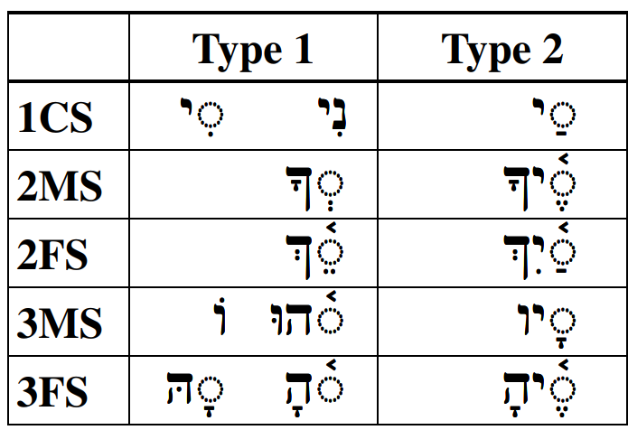
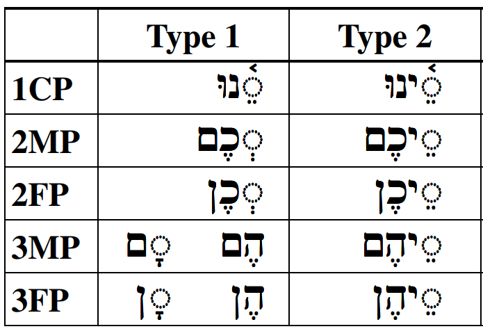
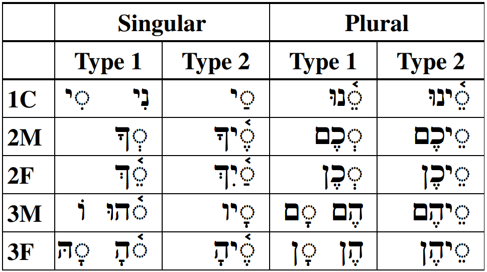
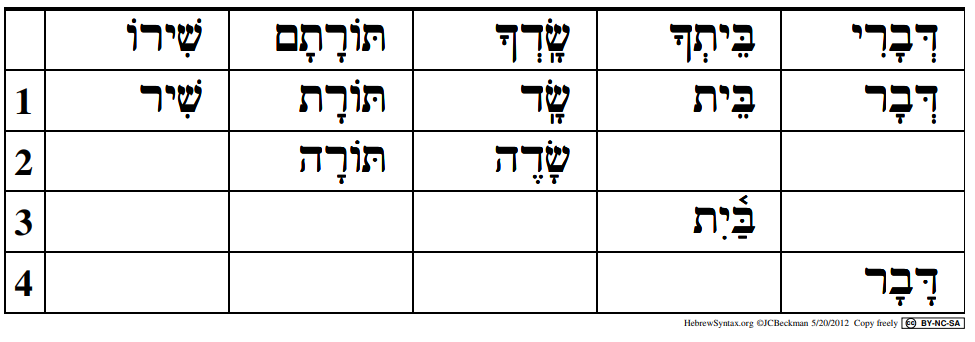
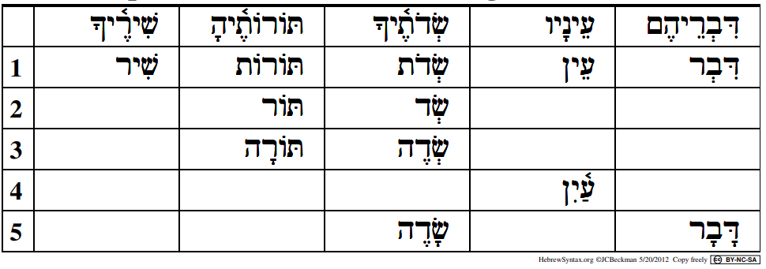

# Hebrew Pronominal Suffixes

::: {.infobox .sound}
<figure>
<audio
        id="myAudio"
        controls controlsList="nodownload"
        src="./images/09.0.0.intro.m4a">
            Your browser does not support the
            <code>audio</code> element.
    </audio>
<button onclick="setPlaySpeed25()" type="button">2.5x</button>
<button onclick="setPlaySpeed2()" type="button">2x</button>
<button onclick="setPlaySpeed15()" type="button">1.5x</button>
<button onclick="setPlaySpeed1()" type="button">1x</button>
<button onclick="setPlaySpeed075()" type="button">.75x</button>
<button onclick="setPlaySpeed05()" type="button">.5x</button>
<script>
var x = document.getElementById("myAudio");
function setPlaySpeed05() { 
    x.playbackRate = 0.5;
    x.play();
}
function setPlaySpeed075() { 
    x.playbackRate = 0.75;
    x.play();
} 
function setPlaySpeed1() { 
    x.playbackRate = 1;
     x.play();
}
function setPlaySpeed15() { 
    x.playbackRate = 1.5;
     x.play();
} 
function setPlaySpeed2() { 
    x.playbackRate = 2;
     x.play();
} 
function setPlaySpeed25() { 
    x.playbackRate = 2.5;
     x.play(); 
} 
</script> 
</figure>
:::

> To comprehend Biblical Hebrew, we must be able to translate a noun or preposition with a pronominal suffix

In this lesson, we continue the discussion on pronouns.  In Lesson 9, we focus on an aspect of pronouns we don't have in English - pronominal suffixes.  


::: {.infobox .map}
**LESSON ITINERARY**


1.  Understand the meaning of pronominal suffixes
2.  Define Type 1 and Type 2 suffixes
3.  Differentiate Type 1 from Type 2
4.  Identify the Lexical Form of a Noun with a Type 1 Suffix
5.  Identify the Lexical Form of a Noun with a Type 2 Suffix
6.  Recognize unusual changes with pronominal suffixes
7.  Identify look-alike words involving pronominal suffixes
:::

::: {.box .stop}
EQUIPMENT CHECK

Before continuing, can you describe the following concepts?

* Independent personal pronouns (memorized)
* The difference between the definite article and the interrogative particle
* Hebrew demonstratives
:::

## First Thought {-}

::: {.infobox .sound}
<figure>
<audio
        id="myAudio"
        controls controlsList="nodownload"
        src="./images/09.0.1.gen4327.mp3">
            Your browser does not support the
            <code>audio</code> element.
    </audio>
<button onclick="setPlaySpeed25()" type="button">2.5x</button>
<button onclick="setPlaySpeed2()" type="button">2x</button>
<button onclick="setPlaySpeed15()" type="button">1.5x</button>
<button onclick="setPlaySpeed1()" type="button">1x</button>
<button onclick="setPlaySpeed075()" type="button">.75x</button>
<button onclick="setPlaySpeed05()" type="button">.5x</button>
<script>
var x = document.getElementById("myAudio");
function setPlaySpeed05() { 
    x.playbackRate = 0.5;
    x.play();
}
function setPlaySpeed075() { 
    x.playbackRate = 0.75;
    x.play();
} 
function setPlaySpeed1() { 
    x.playbackRate = 1;
     x.play();
}
function setPlaySpeed15() { 
    x.playbackRate = 1.5;
     x.play();
} 
function setPlaySpeed2() { 
    x.playbackRate = 2;
     x.play();
} 
function setPlaySpeed25() { 
    x.playbackRate = 2.5;
     x.play(); 
} 
</script> 
</figure>
:::

### <span class="he">וַיֹּאמְרוּ שָׁאוֹל שָׁאַל־הָאִישׁ לָנוּ וּלְמוֹלַדְתֵּנוּ </span> {-}

*And they said, "This man heavily questioned us and our kindred." (Genesis 43:7)*

In addition to offering up our petitions, let us be sure to hear God's questions.  What is He asking you (or asking of you) today?  Take a moment.


*****

```{r, out.width = "600pt", fig.align='center', fig.cap="Banias waterfall. Region of Caesarea Philippi where Yeshua asked his talmidim a fundamental question, 'who do YOU say that I am?'. With our choices, we have the opportunity to answer this same question practically every moment of every day. See Matthew 16:13-17. Courtesy of the [Pictorial Library of Bible Lands](https://www.bibleplaces.com)"}


``` 

## _Hebrew Quest_ Possessive Pronominal Suffixes Lecture

::: {.infobox .sound}
<figure>Click to play the audio from the Hebrew Quest segment. <audio id="myAudio" controls controlsList="nodownload" 
src="./images/09.1.m4a">
Your browser does not support the <code>audio</code> element.</audio><button onclick="x25()" type="button">2.5x</button><button onclick="x2()" type="button">2x</button><button onclick="x15()" type="button">1.5x</button><button onclick="x1()" type="button">1x</button><button onclick="x075()" type="button">.75x</button><button onclick="x05()" type="button">.5x</button><script>
var x = document.getElementById("myAudio");
function x05() { 
    x.playbackRate = 0.5;
    x.play();}
function x075() { 
    x.playbackRate = 0.75;
    x.play();} 
function x1() { 
    x.playbackRate = 1;
     x.play();}
function x15() { 
    x.playbackRate = 1.5;
     x.play();} 
function x2() { 
    x.playbackRate = 2;
     x.play();} 
function x25() { 
    x.playbackRate = 2.5;
     x.play(); } 
</script></figure>
:::


View this four minute video from _Hebrew Quest_ on possessive suffixes.  Don't fret if you don't fully understand this material on the first pass through the video.  We will break down these concepts as we progress through the lesson.   We will discuss Construct forms in Lesson 10.

<div class="container">
<iframe class="responsive-iframe" src="https://www.youtube.com/embed/
yY3O8ByYNwI?start=912&end=1161
&rel=0&showinfo=0&autohide=1&autoplay=1" frameborder="0"></iframe>
</div>

[Click to open video in a new tab](https://youtu.be/yY3O8ByYNwI?t=912){target="_blank"}

Start: 15:12
End: 19:21

## _Hebrew Quest_ Pronominal Suffixes

::: {.infobox .sound}
<figure>Click to play the audio from the Hebrew Quest segment. <audio id="myAudio" controls controlsList="nodownload" 
src="./images/09.2.m4a">
Your browser does not support the <code>audio</code> element.</audio><button onclick="x25()" type="button">2.5x</button><button onclick="x2()" type="button">2x</button><button onclick="x15()" type="button">1.5x</button><button onclick="x1()" type="button">1x</button><button onclick="x075()" type="button">.75x</button><button onclick="x05()" type="button">.5x</button><script>
var x = document.getElementById("myAudio");
function x05() { 
    x.playbackRate = 0.5;
    x.play();}
function x075() { 
    x.playbackRate = 0.75;
    x.play();} 
function x1() { 
    x.playbackRate = 1;
     x.play();}
function x15() { 
    x.playbackRate = 1.5;
     x.play();} 
function x2() { 
    x.playbackRate = 2;
     x.play();} 
function x25() { 
    x.playbackRate = 2.5;
     x.play(); } 
</script></figure>
:::


Although this 10-minute video is from the "Complex Verbs" section of _Hebrew Quest_, the concepts Izzy discusses apply to Lesson 9 of Hebrew GRAMMAR Quest.  At this time, don't worry about any references to verb stems. We will study _verbal_ pronominal suffixes in Lesson 19.

<div class="container">
<iframe class="responsive-iframe" src="https://www.youtube.com/embed/hWmwyosdP-s?start=2731&end=3341&rel=0&showinfo=0&autohide=1&autoplay=1" frameborder="0"></iframe>
</div>

[Click to open video in a new tab](https://youtu.be/hWmwyosdP-s?t=2731){target="_blank"}

Start: 45:31
End: 55:41

## Possessive Pronominal Suffix Meaning

::: {.infobox .sound}
<figure>
<audio
        id="myAudio"
        controls controlsList="nodownload"
        src="./images/09.3.m4a">
            Your browser does not support the
            <code>audio</code> element.
    </audio>
<button onclick="setPlaySpeed25()" type="button">2.5x</button>
<button onclick="setPlaySpeed2()" type="button">2x</button>
<button onclick="setPlaySpeed15()" type="button">1.5x</button>
<button onclick="setPlaySpeed1()" type="button">1x</button>
<button onclick="setPlaySpeed075()" type="button">.75x</button>
<button onclick="setPlaySpeed05()" type="button">.5x</button>
<script>
var x = document.getElementById("myAudio");
function setPlaySpeed05() { 
    x.playbackRate = 0.5;
    x.play();
}
function setPlaySpeed075() { 
    x.playbackRate = 0.75;
    x.play();
} 
function setPlaySpeed1() { 
    x.playbackRate = 1;
     x.play();
}
function setPlaySpeed15() { 
    x.playbackRate = 1.5;
     x.play();
} 
function setPlaySpeed2() { 
    x.playbackRate = 2;
     x.play();
} 
function setPlaySpeed25() { 
    x.playbackRate = 2.5;
     x.play(); 
} 
</script> 
</figure>
:::

> Pronominal suffixes are always "object" or "possessive" pronouns (e.g., me, my, her, him, them, theirs)

Hebrew has another type of pronoun in addition to stand-alone words.  In Lesson 6, we learned about one-letter preposition prefixes to words.  Pronominal suffixes work similarly. The difference is these go on the back of words instead of the front.

* On a noun, a pronominal suffix indicates the one who owns or is related to the noun:  His books / her houses / their house / our father
    * As this indicates a specific noun (in other words, not just any books, but HIS books), a noun with a pronominal suffix is **DEFINITE**
    * This is our third of four factors that make a Hebrew noun definite^[We will meet #4 in Lesson 10]:
        1. Has the (definite) article
        2. Is a proper name
        3. **Has a pronominal suffix**
* On a preposition, the suffix indicates the object: to her / with them / behind him / in front of it
* Verbs also take pronominal suffixes, which will indicate the verb's object.  We will study these in Lesson 19.

Pronominal suffixes have *gender*, *number*, and *person*.


## Type 1 and Type 2 Suffixes

::: {.infobox .sound}
<figure>
<audio id="myAudio" controls controlsList="nodownload" src="./images/09.4.m4a"> Your browser does not support the <code>audio</code> element.</audio>
<button onclick="setPlaySpeed25()" type="button">2.5x</button>
<button onclick="setPlaySpeed2()" type="button">2x</button>
<button onclick="setPlaySpeed15()" type="button">1.5x</button>
<button onclick="setPlaySpeed1()" type="button">1x</button>
<button onclick="setPlaySpeed075()" type="button">.75x</button>
<button onclick="setPlaySpeed05()" type="button">.5x</button>
<script>
var x = document.getElementById("myAudio");
function setPlaySpeed05() { 
    x.playbackRate = 0.5;
    x.play();}
function setPlaySpeed075() { 
    x.playbackRate = 0.75;
    x.play();} 
function setPlaySpeed1() { 
    x.playbackRate = 1;
     x.play();}
function setPlaySpeed15() { 
    x.playbackRate = 1.5;
     x.play();} 
function setPlaySpeed2() { 
    x.playbackRate = 2;
     x.play();} 
function setPlaySpeed25() { 
    x.playbackRate = 2.5;
     x.play(); } 
</script> 
</figure>
:::

> Hebrew has two distinct groups of Pronominal suffixes.   
> Type 1 suffixes go on SINGULAR nouns
> Type 2 suffixes go on PLURAL nouns

* Keep in mind there are both plural and singular Type 1 suffixes for use on singular nouns^[As with most grammar rules, there are exceptions. For now, stick with these definitions of Type 1 and Type 2.] 
    * Multiple people can have ownership of a single object
    * In English, we would say "his house" and "their house"
* There are both singular and plural type 2 suffixes for use on plural nouns
    * "his houses" as well as "their houses"

## Singular Suffixes

::: {.infobox .sound}
<figure>
<audio id="myAudio" controls controlsList="nodownload" src="./images/09.5.m4a"> Your browser does not support the <code>audio</code> element.</audio>
<button onclick="setPlaySpeed25()" type="button">2.5x</button>
<button onclick="setPlaySpeed2()" type="button">2x</button>
<button onclick="setPlaySpeed15()" type="button">1.5x</button>
<button onclick="setPlaySpeed1()" type="button">1x</button>
<button onclick="setPlaySpeed075()" type="button">.75x</button>
<button onclick="setPlaySpeed05()" type="button">.5x</button>
<script>
var x = document.getElementById("myAudio");
function setPlaySpeed05() { 
    x.playbackRate = 0.5;
    x.play();}
function setPlaySpeed075() { 
    x.playbackRate = 0.75;
    x.play();} 
function setPlaySpeed1() { 
    x.playbackRate = 1;
     x.play();}
function setPlaySpeed15() { 
    x.playbackRate = 1.5;
     x.play();} 
function setPlaySpeed2() { 
    x.playbackRate = 2;
     x.play();} 
function setPlaySpeed25() { 
    x.playbackRate = 2.5;
     x.play(); } 
</script> 
</figure>
:::

> While Type 1 and Type 2 suffixes have key differences, there are also some commonalities with both types' singular suffixes.

* Below are the singular suffixes

```{r, out.width = "600pt", fig.align='center'}
library(knitr)

```


* 1CS end with <span class="he">י</span>
* 2MS/2FS end with <span class="he">ך</span>    
* Not all 3M/3F have <span class="he">ה</span>, but every <span class="he">ה</span> is 3M/3F

## Plural Suffixes

::: {.infobox .sound}
<figure>
<audio id="myAudio" controls controlsList="nodownload" src="./images/09.6.m4a"> Your browser does not support the <code>audio</code> element.</audio>
<button onclick="setPlaySpeed25()" type="button">2.5x</button>
<button onclick="setPlaySpeed2()" type="button">2x</button>
<button onclick="setPlaySpeed15()" type="button">1.5x</button>
<button onclick="setPlaySpeed1()" type="button">1x</button>
<button onclick="setPlaySpeed075()" type="button">.75x</button>
<button onclick="setPlaySpeed05()" type="button">.5x</button>
<script>
var x = document.getElementById("myAudio");
function setPlaySpeed05() { 
    x.playbackRate = 0.5;
    x.play();}
function setPlaySpeed075() { 
    x.playbackRate = 0.75;
    x.play();} 
function setPlaySpeed1() { 
    x.playbackRate = 1;
     x.play();}
function setPlaySpeed15() { 
    x.playbackRate = 1.5;
     x.play();} 
function setPlaySpeed2() { 
    x.playbackRate = 2;
     x.play();} 
function setPlaySpeed25() { 
    x.playbackRate = 2.5;
     x.play(); } 
</script> 
</figure>
:::
Below are the plural suffixes:

```{r, out.width = "600pt", fig.align='center'}
library(knitr)

```


* 1CP ends with <span class="he">נוּ</span>
* 2MP/2FP have <span class="he">כ</span>
* Not all 3M/3F have <span class="he">ה</span>, but every <span class="he">ה</span> is 3M/3F
* 2MP/3MP has <span class="he">ם</span> ('monks')
* 2FP/3FP has <span class="he">ן</span> ('nuns')

## Distinguish Type 1 from Type 2

::: {.infobox .sound}
<figure>
<audio id="myAudio" controls controlsList="nodownload" src="./images/09.7.m4a"> Your browser does not support the <code>audio</code> element.</audio>
<button onclick="setPlaySpeed25()" type="button">2.5x</button>
<button onclick="setPlaySpeed2()" type="button">2x</button>
<button onclick="setPlaySpeed15()" type="button">1.5x</button>
<button onclick="setPlaySpeed1()" type="button">1x</button>
<button onclick="setPlaySpeed075()" type="button">.75x</button>
<button onclick="setPlaySpeed05()" type="button">.5x</button>
<script>
var x = document.getElementById("myAudio");
function setPlaySpeed05() { 
    x.playbackRate = 0.5;
    x.play();}
function setPlaySpeed075() { 
    x.playbackRate = 0.75;
    x.play();} 
function setPlaySpeed1() { 
    x.playbackRate = 1;
     x.play();}
function setPlaySpeed15() { 
    x.playbackRate = 1.5;
     x.play();} 
function setPlaySpeed2() { 
    x.playbackRate = 2;
     x.play();} 
function setPlaySpeed25() { 
    x.playbackRate = 2.5;
     x.play(); } 
</script> 
</figure>
:::


>Type 2 ALWAYS contains `(vowel) + yod`, but NEVER `hiriq + yod`  
>Type 1 NEVER contains yod, *unless* it's `hiriq+yod`


* This simple rule, plus the tips on the previous pages about patterns in gender and number, should make it easier to identify the pronominal suffix.
* When you encounter a word with a suffix, always start by asking, "is there a `vowel + yod`, that is not `hiriq + yod`?"
* If yes, then we have a Type 2 suffix, which indicates the noun is plural
    * And if `Tsere + Yod` then both the noun and the person are plural


```{r, out.width = "80%", fig.align='center'}
library(knitr)

```


## Identifying the Lexical Form with Type 1

::: {.infobox .sound}
<figure>
<audio id="myAudio" controls controlsList="nodownload" src="./images/09.8.m4a"> Your browser does not support the <code>audio</code> element.</audio>
<button onclick="setPlaySpeed25()" type="button">2.5x</button>
<button onclick="setPlaySpeed2()" type="button">2x</button>
<button onclick="setPlaySpeed15()" type="button">1.5x</button>
<button onclick="setPlaySpeed1()" type="button">1x</button>
<button onclick="setPlaySpeed075()" type="button">.75x</button>
<button onclick="setPlaySpeed05()" type="button">.5x</button>
<script>
var x = document.getElementById("myAudio");
function setPlaySpeed05() { 
    x.playbackRate = 0.5;
    x.play();}
function setPlaySpeed075() { 
    x.playbackRate = 0.75;
    x.play();} 
function setPlaySpeed1() { 
    x.playbackRate = 1;
     x.play();}
function setPlaySpeed15() { 
    x.playbackRate = 1.5;
     x.play();} 
function setPlaySpeed2() { 
    x.playbackRate = 2;
     x.play();} 
function setPlaySpeed25() { 
    x.playbackRate = 2.5;
     x.play(); } 
</script> 
</figure>
:::

> Part of learning to read Biblical Hebrew is assembling a set of skills that make it easier to navigate when you encounter an unfamiliar word in the Text.  

A noun is more likely to be unfamiliar to you than a preposition, so we'll focus on nouns.  Below is a procedure you may follow that should help with this.  The steps for a Type 1 suffix are on this page, and the steps for Type 2 are in the next section.

1. Remove the pronominal suffix
    * With <span class="he">שִׁיר</span>, we are done at step 1
2. Remembering that type one suffixes can *only* go with SINGULAR nouns, the next step is to fix the singular ending as needed 
    * If the remaining word has a word-final <span class="he">ת</span>, it is likely feminine. Replace <span class="he">ת ַ</span> or <span class="he">ת ָ</span>  with<span class="he"> ה ָ</span> (usually)
        * See <span class="he">תּוֺרָתָם</span> as an example
        * Note <span class="he">בֵּית</span> does not have a feminine ending; we will recognize this word from our vocabulary memory
    * If the remaining word does not end with a <span class="he">ת</span>, it is likely masculine.  Most often, masculine words are endingless, but sometimes you may need to add the masculine singular ending <span class="he">ה ֶ</span>
        * See <span class="he">שָֹדֶה</span>, which is another word that should be memorized
3. If there is a word-internal `tsere+yod` (i.e. in the middle of the word), replace with the diphthong <span class="he">יִ ַ֫</span>
    * See word <span class="he">בֵּיתְךָ</span>
4. Change other vowels as needed according to the vowel preference table we studied several lessons ago
    * See word <span class="he">דָּבָר</span>
 
Here is Dr. Beckman's example of the four steps using five example words with Type 1 suffixes.  Note that words do not always need all four steps.

```{r, out.width = "600pt", fig.align='center'}
library(knitr)

```

## Identifying the Lexical Form with Type 2

::: {.infobox .sound}
<figure>
<audio id="myAudio" controls controlsList="nodownload" src="./images/09.9.m4a"> Your browser does not support the <code>audio</code> element.</audio>
<button onclick="setPlaySpeed25()" type="button">2.5x</button>
<button onclick="setPlaySpeed2()" type="button">2x</button>
<button onclick="setPlaySpeed15()" type="button">1.5x</button>
<button onclick="setPlaySpeed1()" type="button">1x</button>
<button onclick="setPlaySpeed075()" type="button">.75x</button>
<button onclick="setPlaySpeed05()" type="button">.5x</button>
<script>
var x = document.getElementById("myAudio");
function setPlaySpeed05() { 
    x.playbackRate = 0.5;
    x.play();}
function setPlaySpeed075() { 
    x.playbackRate = 0.75;
    x.play();} 
function setPlaySpeed1() { 
    x.playbackRate = 1;
     x.play();}
function setPlaySpeed15() { 
    x.playbackRate = 1.5;
     x.play();} 
function setPlaySpeed2() { 
    x.playbackRate = 2;
     x.play();} 
function setPlaySpeed25() { 
    x.playbackRate = 2.5;
     x.play(); } 
</script> 
</figure>
:::
::: {.box .light}
* Type 2 suffixes can *only* go with PLURAL nouns
* The Lexical Form is going to be the SINGULAR
* The only additional step from a Type 1 is we need to address the plural ending (step 2)
:::

1. Remove the pronominal suffix
2. Remove the <span class="he">וֹת</span> ending if there is one
    * Keep in mind that the word could exhibit defective spelling as with <span class="he">שְֹדֹת</span> below
3. Add the appropriate singular ending, if needed
    * If the word ended with a <span class="he">וֹת</span>, it is Feminine. Replace with <span class="he">ה</span> ָ (usually)
    * If the remaining word does not end with <span class="he">וֹת</span>, it is likely masculine.  Most often, masculine words are endingless, but sometimes you may need to add the masculine singular ending <span class="he">ה ֶ</span>
4. If there is a word-internal `tsere+yod` (i.e. in the middle of the word), replace with the diphthong <span class="he">יִ ַ֫</span>
5. Change other vowels as needed according to the vowel preference table we studied several lessons ago.

Here is Dr. Beckman's example of the five steps.  Note that words do not always need all five iterations.

```{r, out.width = "600pt", fig.align='center'}
library(knitr)

```

## Unexpected changes

::: {.infobox .sound}
<figure>
<audio id="myAudio" controls controlsList="nodownload" src="./images/09.10.m4a"> Your browser does not support the <code>audio</code> element.</audio>
<button onclick="setPlaySpeed25()" type="button">2.5x</button>
<button onclick="setPlaySpeed2()" type="button">2x</button>
<button onclick="setPlaySpeed15()" type="button">1.5x</button>
<button onclick="setPlaySpeed1()" type="button">1x</button>
<button onclick="setPlaySpeed075()" type="button">.75x</button>
<button onclick="setPlaySpeed05()" type="button">.5x</button>
<script>
var x = document.getElementById("myAudio");
function setPlaySpeed05() { 
    x.playbackRate = 0.5;
    x.play();}
function setPlaySpeed075() { 
    x.playbackRate = 0.75;
    x.play();} 
function setPlaySpeed1() { 
    x.playbackRate = 1;
     x.play();}
function setPlaySpeed15() { 
    x.playbackRate = 1.5;
     x.play();} 
function setPlaySpeed2() { 
    x.playbackRate = 2;
     x.play();} 
function setPlaySpeed25() { 
    x.playbackRate = 2.5;
     x.play(); } 
</script> 
</figure>
:::

> Two of the prepositions we studied in Lesson 6 undergo some irregular changes you will encounter as you read the Bible.

* <span class="he">כְּ</span> (like, as) and <span class="he">מִן</span> (from, etc.) often insert an extra <span class="he">מוֹ</span> or <span class="he">מּ</span> in some forms
    * Like you (2MS): <span class="he">כָּמ֫וֹךָ</span>
    * From you (2MS): <span class="he">מִמְּךָ</span>

* <span class="he">אָח</span> adds a hireq + yod before all type 1 suffixes
    * My brother (1CS): <span class="he">אָחִי</span>
    * Our Brother (1CP): <span class="he">אָחִינוּ</span>
    
The rule still applies:

::: {.box .light}  
* Type 2 suffixes **always** contain with vowel + yod, but **never** hireq + yod
* Type 1 suffixes **never** contain vowel + yod **unless** it's hireq + yod
:::


## Look-alike words: אֵת as "with" or as Definite Direct Object (DDO) marker

::: {.infobox .sound}
<figure>
<audio id="myAudio" controls controlsList="nodownload" src="./images/09.11.m4a"> Your browser does not support the <code>audio</code> element.</audio>
<button onclick="setPlaySpeed25()" type="button">2.5x</button>
<button onclick="setPlaySpeed2()" type="button">2x</button>
<button onclick="setPlaySpeed15()" type="button">1.5x</button>
<button onclick="setPlaySpeed1()" type="button">1x</button>
<button onclick="setPlaySpeed075()" type="button">.75x</button>
<button onclick="setPlaySpeed05()" type="button">.5x</button>
<script>
var x = document.getElementById("myAudio");
function setPlaySpeed05() { 
    x.playbackRate = 0.5;
    x.play();}
function setPlaySpeed075() { 
    x.playbackRate = 0.75;
    x.play();} 
function setPlaySpeed1() { 
    x.playbackRate = 1;
     x.play();}
function setPlaySpeed15() { 
    x.playbackRate = 1.5;
     x.play();} 
function setPlaySpeed2() { 
    x.playbackRate = 2;
     x.play();} 
function setPlaySpeed25() { 
    x.playbackRate = 2.5;
     x.play(); } 
</script> 
</figure>
:::
* As we learned previously, <span class="he">אֵת</span> can mean either the DDO or the preposition "with".  They are spelled the same way, and either form can take a pronominal suffix.

> For the DDO with a regular Type 1 pronominal suffix, the <span class="he">א</span> will take $\bar O$-Holem or $E$-Seghol
    
* DDO him (3MS): <span class="he">אֹתוֹ</span>
* DDO you/you all (2FP): <span class="he">אֶתְכֶן</span>

> For the preposition with, as in "with him", the <span class="he">א</span> will take $I$-Hireq in all forms
    
* With me (1CS): <span class="he">אִתִּי</span>
* With them (3FP): <span class="he">אִתָּן</span>

## Look-alike words: עִם, "with", or עַם "people" 

::: {.infobox .sound}
<figure>
<audio id="myAudio" controls controlsList="nodownload" src="./images/09.12.m4a"> Your browser does not support the <code>audio</code> element.</audio>
<button onclick="setPlaySpeed25()" type="button">2.5x</button>
<button onclick="setPlaySpeed2()" type="button">2x</button>
<button onclick="setPlaySpeed15()" type="button">1.5x</button>
<button onclick="setPlaySpeed1()" type="button">1x</button>
<button onclick="setPlaySpeed075()" type="button">.75x</button>
<button onclick="setPlaySpeed05()" type="button">.5x</button>
<script>
var x = document.getElementById("myAudio");
function setPlaySpeed05() { 
    x.playbackRate = 0.5;
    x.play();}
function setPlaySpeed075() { 
    x.playbackRate = 0.75;
    x.play();} 
function setPlaySpeed1() { 
    x.playbackRate = 1;
     x.play();}
function setPlaySpeed15() { 
    x.playbackRate = 1.5;
     x.play();} 
function setPlaySpeed2() { 
    x.playbackRate = 2;
     x.play();} 
function setPlaySpeed25() { 
    x.playbackRate = 2.5;
     x.play(); } 
</script> 
</figure>
:::

These two words frequently take pronouns.  It could be easy to get them confused.  As with <span class="he">את</span>, the trick is to pay close attention to the vowel under the <span class="he">ע</span>.

> <span class="he">עִם</span>, WITH, will always have $I$-Hireq, whereas <span class="he">עַם</span>, PEOPLE, will always have $A$-Patach
    
* With Me (1CS): <span class="he">עִמִּי</span>
* My People (1CS): <span class="he">עַמִּי</span>
* With them (3MP):  <span class="he">עִמָּם</span>
* Their people (3MP):  <span class="he">עַמָּם</span>

## Look-alike words: אֵל, אֱלֹהִ֑ים, "God", or אֶל, "to"

::: {.infobox .sound}
<figure>
<audio id="myAudio" controls controlsList="nodownload" src="./images/09.13.m4a"> Your browser does not support the <code>audio</code> element.</audio>
<button onclick="setPlaySpeed25()" type="button">2.5x</button>
<button onclick="setPlaySpeed2()" type="button">2x</button>
<button onclick="setPlaySpeed15()" type="button">1.5x</button>
<button onclick="setPlaySpeed1()" type="button">1x</button>
<button onclick="setPlaySpeed075()" type="button">.75x</button>
<button onclick="setPlaySpeed05()" type="button">.5x</button>
<script>
var x = document.getElementById("myAudio");
function setPlaySpeed05() { 
    x.playbackRate = 0.5;
    x.play();}
function setPlaySpeed075() { 
    x.playbackRate = 0.75;
    x.play();} 
function setPlaySpeed1() { 
    x.playbackRate = 1;
     x.play();}
function setPlaySpeed15() { 
    x.playbackRate = 1.5;
     x.play();} 
function setPlaySpeed2() { 
    x.playbackRate = 2;
     x.play();} 
function setPlaySpeed25() { 
    x.playbackRate = 2.5;
     x.play(); } 
</script> 
</figure>
:::


> Memorize <span class="he">אֵלִי</span> as "my God" ($I$-Hireq under the <span class="he">ל</span>), and <span class="he">אֶלַי</span> as "to me" ($A$-Patach under the <span class="he">ל</span>)

* <span class="he">אֵלִי</span> is the only form of <span class="he">אֵל</span> that appears with a pronominal suffix in the Bible

---

> <span class="he">אֱלֹהִ֑ים</span> retains the $O$-Holem over the <span class="he">ל</span>

* Although <span class="he">אֵל</span> may not appear with a suffix apart from this one time, <span class="he">אֱלֹהִ֑ים</span> can, and in the Torah, frequently does take suffixes.   The words below are close but not equivalent.

* <span class="he">אֱלֹהֶ֑יךָ</span>  = your God (See Deuteronomy 6:5)
* <span class="he">אֵלֶ֫יךָ</span> = to you (2MS)
* <span class="he">אֱלֹהִ֑ים</span>  = God, gods
* <span class="he">אֲלֵיהֶם</span> = to them (3MP)
* <span class="he">אֱלֹהֵֽינוּ</span> = our God (Exodus 3:18)
* <span class="he">אֵלֵ֫ינוּ</span> = to us (1CP)
* <span class="he">אֱלֹהָֽי</span> = my gods (Genesis 31:30)
* <span class="he">אֵלֶ֫יהַ</span> = to her/it (3FS)

## Word Warm-up {-}

<div class="container">
<iframe class="responsive-iframe" src="https://youtube.com/embed/J81JGz2CZak" frameborder="0"></iframe>
</div>

[Click to open `Word Warm-up` video in a new tab](https://youtu.be/J81JGz2CZak){target="_blank"}

## Word Warm-up: pronominal suffixes {-}

We have created a special `Word Warm-up` for the pronominal suffixes.

<div class="container">
<iframe class="responsive-iframe" src="https://youtube.com/embed/V12n6fg2ASE" frameborder="0"></iframe>
</div>

[Click to open `Word Warm-up` video in a new tab](https://youtu.be/V12n6fg2ASE){target="_blank"}


## Verses Warm-up {-}

<div class="container">
<iframe class="responsive-iframe" src="https://youtube.com/embed/il-4zlhzD_Y" frameborder="0"></iframe>
</div>


[Click to open `Verses Warm-up` video in a new tab](https://youtu.be/il-4zlhzD_Y){target="_blank"}

## Anki {-}

* `Lesson 09 A. Vocab`
* `Lesson 09 B. Grammar` 
* `Lesson 09 C. Workbook` - Pay close attention to gender and number
* `Lesson 09 D. Verses`

## Worksheets: Pronominal Suffixes {-}


After you have done your Anki work, we have an additional worksheet to help you drill your pronominal suffixes.  As with previous worksheets, study, then cover-up the first column on the right and see if you can complete the remainder of the worksheet by memory.

[Pronominal Suffix](./images/09_pronominal_suffix_paradigm.pdf){target="_blank"}

## Ruth Pursuit {-}        

::: {.infobox .sound}
<figure>
<audio id="myAudio" controls controlsList="nodownload" src="./images/09.ruth.m4a"> Your browser does not support the <code>audio</code> element.</audio>
<button onclick="setPlaySpeed25()" type="button">2.5x</button>
<button onclick="setPlaySpeed2()" type="button">2x</button>
<button onclick="setPlaySpeed15()" type="button">1.5x</button>
<button onclick="setPlaySpeed1()" type="button">1x</button>
<button onclick="setPlaySpeed075()" type="button">.75x</button>
<button onclick="setPlaySpeed05()" type="button">.5x</button>
<script>
var x = document.getElementById("myAudio");
function setPlaySpeed05() { 
    x.playbackRate = 0.5;
    x.play();}
function setPlaySpeed075() { 
    x.playbackRate = 0.75;
    x.play();} 
function setPlaySpeed1() { 
    x.playbackRate = 1;
     x.play();}
function setPlaySpeed15() { 
    x.playbackRate = 1.5;
     x.play();} 
function setPlaySpeed2() { 
    x.playbackRate = 2;
     x.play();} 
function setPlaySpeed25() { 
    x.playbackRate = 2.5;
     x.play(); } 
</script> 
</figure>
:::

::: {.box .map} 
YOUR QUEST

1. Identify words with pronominal suffixes affixed to the following familial nouns (yellow)
    * sons
    * children
    * people (be mindful of the difference between `people` and `with`)
    * daughters
    * God/gods (be cognizant of the difference between `God` and `to them`.)
    * mother-in-law <span class="he">לַחֲמוֹתָהּ</span>
    * widow <span class="he">יְבִמְתֵּךְ</span>
    (we are excluding "his wife", "her daughters-in-law", and "her husband" since you found those in previous lessons!)
2. Identify words with pronominal suffixes affixed to the following other nouns (green)
    * voice
3. Identify words with pronominal suffixes affixed to the following prepositions (pink)
    * between
    * with or the DDO
    * in
    * to
    * about
4. Identify the vocabulary word for "food" or "bread" that is NOT part of a city's name. See footnote for hint (only if you need to!)^[spelled as <span class="he">לָהֶם</span>.] (blue)

> You may see other words with pronominal suffixes.  Typically, these are verbs that we will cover in Lessons 19-21.

:::


* [Blank copy of Ruth 1](https://docs.google.com/document/d/1bcT1J-fcVmD1Zn5Jk2nj0560tEddcgtbYZLkwaVVuyE/copy){target="_blank"}
* [Ruth Pursuit Answer Key #09](./images/09_Ruth_Pursuit_KEY.pdf){target="_blank"}^[Note: Many English Bibles contain a footnote at Ruth 1:20 that Naomi means "pleasant"; however, the precise etymology of Naomi's name is unclear.  While her name appears to have a Type 1 1CS suffix, since it is a proper name, we are not including it in our answer key.]

### Ruth 1 {-}

<div class="scc">Click to hear Ruth 1 read by Abraham Shmuelof:<audio controls
        src="./images/t2901.m4a">
            Your browser does not support the
            <code>audio</code> element.
    </audio>
</div>


<span class="he"><p align="right">
‫ 1   וַיְהִ֗י בִּימֵי֙ שְׁפֹ֣ט הַשֹּׁפְטִ֔ים וַיְהִ֥י רָעָ֖ב בָּאָ֑רֶץ וַיֵּ֨לֶךְ אִ֜ישׁ מִבֵּ֧ית לֶ֣חֶם יְהוּדָ֗ה לָגוּר֙ בִּשְׂדֵ֣י מוֹאָ֔ב ה֥וּא וְאִשְׁתּ֖וֹ וּשְׁנֵ֥י בָנָֽיו׃ ‬

‫ 2   וְשֵׁ֣ם הָאִ֣ישׁ אֱ‍ֽלִימֶ֡לֶךְ וְשֵׁם֩ אִשְׁתּ֨וֹ נָעֳמִ֜י וְשֵׁ֥ם שְׁנֵֽי־בָנָ֣יו ׀ מַחְל֤וֹן וְכִלְיוֹן֙ אֶפְרָתִ֔ים מִבֵּ֥ית לֶ֖חֶם יְהוּדָ֑ה וַיָּבֹ֥אוּ שְׂדֵי־מוֹאָ֖ב וַיִּֽהְיוּ־שָֽׁם׃ ‬

‫ 3   וַיָּ֥מָת אֱלִימֶ֖לֶךְ אִ֣ישׁ נָעֳמִ֑י וַתִּשָּׁאֵ֥ר הִ֖יא וּשְׁנֵ֥י בָנֶֽיהָ׃ ‬

‫ 4   וַיִּשְׂא֣וּ לָהֶ֗ם נָשִׁים֙ מֹֽאֲבִיּ֔וֹת שֵׁ֤ם הָֽאַחַת֙ עָרְפָּ֔ה וְשֵׁ֥ם הַשֵּׁנִ֖ית ר֑וּת וַיֵּ֥שְׁבוּ שָׁ֖ם כְּעֶ֥שֶׂר שָׁנִֽים׃ ‬

‫ 5   וַיָּמ֥וּתוּ גַם־שְׁנֵיהֶ֖ם מַחְל֣וֹן וְכִלְי֑וֹן וַתִּשָּׁאֵר֙ הָֽאִשָּׁ֔ה מִשְּׁנֵ֥י יְלָדֶ֖יהָ וּמֵאִישָֽׁהּ׃ ‬

‫ 6   וַתָּ֤קָם הִיא֙ וְכַלֹּתֶ֔יהָ וַתָּ֖שָׁב מִשְּׂדֵ֣י מוֹאָ֑ב כִּ֤י שָֽׁמְעָה֙ בִּשְׂדֵ֣ה מוֹאָ֔ב כִּֽי־פָקַ֤ד יְהוָה֙ אֶת־עַמּ֔וֹ לָתֵ֥ת לָהֶ֖ם לָֽחֶם׃ ‬

‫ 7   וַתֵּצֵ֗א מִן־הַמָּקוֹם֙ אֲשֶׁ֣ר הָיְתָה־שָׁ֔מָּה וּשְׁתֵּ֥י כַלֹּתֶ֖יהָ עִמָּ֑הּ וַתֵּלַ֣כְנָה בַדֶּ֔רֶךְ לָשׁ֖וּב אֶל־אֶ֥רֶץ יְהוּדָֽה׃ ‬

‫ 8   וַתֹּ֤אמֶר נָעֳמִי֙ לִשְׁתֵּ֣י כַלֹּתֶ֔יהָ לֵ֣כְנָה שֹּׁ֔בְנָה אִשָּׁ֖ה לְבֵ֣ית אִמָּ֑הּ *יעשה **יַ֣עַשׂ יְהוָ֤ה עִמָּכֶם֙ חֶ֔סֶד כַּאֲשֶׁ֧ר עֲשִׂיתֶ֛ם עִם־הַמֵּתִ֖ים וְעִמָּדִֽי׃ ‬

‫ 9   יִתֵּ֤ן יְהוָה֙ לָכֶ֔ם וּמְצֶ֣אןָ מְנוּחָ֔ה אִשָּׁ֖ה בֵּ֣ית אִישָׁ֑הּ וַתִּשַּׁ֣ק לָהֶ֔ן וַתִּשֶּׂ֥אנָה קוֹלָ֖ן וַתִּבְכֶּֽינָה׃ ‬

‫ 10  וַתֹּאמַ֖רְנָה־לָּ֑הּ כִּי־אִתָּ֥ךְ נָשׁ֖וּב לְעַמֵּֽךְ׃ ‬

‫ 11  וַתֹּ֤אמֶר נָעֳמִי֙ שֹׁ֣בְנָה בְנֹתַ֔י לָ֥מָּה תֵלַ֖כְנָה עִמִּ֑י הַֽעֽוֹד־לִ֤י בָנִים֙ בְּֽמֵעַ֔י וְהָי֥וּ לָכֶ֖ם לַאֲנָשִֽׁים׃ ‬

‫ 12  שֹׁ֤בְנָה בְנֹתַי֙ לֵ֔כְןָ כִּ֥י זָקַ֖נְתִּי מִהְי֣וֹת לְאִ֑ישׁ כִּ֤י אָמַ֙רְתִּי֙ יֶשׁ־לִ֣י תִקְוָ֔ה גַּ֣ם הָיִ֤יתִי הַלַּ֙יְלָה֙ לְאִ֔ישׁ וְגַ֖ם יָלַ֥דְתִּי בָנִֽים׃ ‬

‫ 13  הֲלָהֵ֣ן ׀ תְּשַׂבֵּ֗רְנָה עַ֚ד אֲשֶׁ֣ר יִגְדָּ֔לוּ הֲלָהֵן֙ תֵּֽעָגֵ֔נָה לְבִלְתִּ֖י הֱי֣וֹת לְאִ֑ישׁ אַ֣ל בְּנֹתַ֗י כִּֽי־מַר־לִ֤י מְאֹד֙ מִכֶּ֔ם כִּֽי־יָצְאָ֥ה בִ֖י יַד־יְהוָֽה׃ ‬

‫ 14  וַתִּשֶּׂ֣נָה קוֹלָ֔ן וַתִּבְכֶּ֖ינָה ע֑וֹד וַתִּשַּׁ֤ק עָרְפָּה֙ לַחֲמוֹתָ֔הּ וְר֖וּת דָּ֥בְקָה בָּֽהּ׃ ‬

‫ 15  וַתֹּ֗אמֶר הִנֵּה֙ שָׁ֣בָה יְבִמְתֵּ֔ךְ אֶל־עַמָּ֖הּ וְאֶל־אֱלֹהֶ֑יהָ שׁ֖וּבִי אַחֲרֵ֥י יְבִמְתֵּֽךְ׃ ‬

‫ 16  וַתֹּ֤אמֶר רוּת֙ אַל־תִּפְגְּעִי־בִ֔י לְעָזְבֵ֖ךְ לָשׁ֣וּב מֵאַחֲרָ֑יִךְ כִּ֠י אֶל־אֲשֶׁ֨ר תֵּלְכִ֜י אֵלֵ֗ךְ וּבַאֲשֶׁ֤ר תָּלִ֙ינִי֙ אָלִ֔ין עַמֵּ֣ךְ עַמִּ֔י וֵאלֹהַ֖יִךְ אֱלֹהָֽי׃ ‬

‫ 17  בַּאֲשֶׁ֤ר תָּמ֙וּתִי֙ אָמ֔וּת וְשָׁ֖ם אֶקָּבֵ֑ר כֹּה֩ יַעֲשֶׂ֨ה יְהוָ֥ה לִי֙ וְכֹ֣ה יֹסִ֔יף כִּ֣י הַמָּ֔וֶת יַפְרִ֖יד בֵּינִ֥י וּבֵינֵֽךְ׃ ‬

‫ 18  וַתֵּ֕רֶא כִּֽי־מִתְאַמֶּ֥צֶת הִ֖יא לָלֶ֣כֶת אִתָּ֑הּ וַתֶּחְדַּ֖ל לְדַבֵּ֥ר אֵלֶֽיהָ׃ ‬

‫ 19  וַתֵּלַ֣כְנָה שְׁתֵּיהֶ֔ם עַד־בֹּאָ֖נָה בֵּ֣ית לָ֑חֶם וַיְהִ֗י כְּבֹאָ֙נָה֙ בֵּ֣ית לֶ֔חֶם וַתֵּהֹ֤ם כָּל־הָעִיר֙ עֲלֵיהֶ֔ן וַתֹּאמַ֖רְנָה הֲזֹ֥את נָעֳמִֽי׃ ‬

‫ 20  וַתֹּ֣אמֶר אֲלֵיהֶ֔ן אַל־תִּקְרֶ֥אנָה לִ֖י נָעֳמִ֑י קְרֶ֤אןָ לִי֙ מָרָ֔א כִּי־הֵמַ֥ר שַׁדַּ֛י לִ֖י מְאֹֽד׃ ‬

‫ 21  אֲנִי֙ מְלֵאָ֣ה הָלַ֔כְתִּי וְרֵיקָ֖ם הֱשִׁיבַ֣נִי יְהוָ֑ה לָ֣מָּה תִקְרֶ֤אנָה לִי֙ נָעֳמִ֔י וַֽיהוָה֙ עָ֣נָה בִ֔י וְשַׁדַּ֖י הֵ֥רַֽע לִֽי׃ ‬

‫ 22  וַתָּ֣שָׁב נָעֳמִ֗י וְר֨וּת הַמּוֹאֲבִיָּ֤ה כַלָּתָהּ֙ עִמָּ֔הּ הַשָּׁ֖בָה מִשְּׂדֵ֣י מוֹאָ֑ב וְהֵ֗מָּה בָּ֚אוּ בֵּ֣ית לֶ֔חֶם בִּתְחִלַּ֖ת קְצִ֥יר שְׂעֹרִֽים׃ ‬
</span></p>


## Quest Quiz {-}

<div class="containerLtr">
<iframe class="responsive-iframe" src="https://docs.google.com/forms/d/e/1FAIpQLScqXqWFXhKEtASg30CQkbkbFlpmlVMbbntNoMqXTF_O2Y-rSA/viewform?embedded=true" frameborder="0"></iframe>
</div>

[Open Quest Quiz #9 in a new window](https://forms.gle/7Jgs8W2vi6XKTukG6){target="_blank"}

## Lesson Extras {-}

* [Dr. Beckman Lecture Video](http://youtu.be/7Jnh6nAFQ1c){target=“_blank”}
* [Dr. Beckman Lecture Notes](https://hebrewsyntax.org/bbh2new/09_overheads_bw.pdf){target=“_blank”}
* [BBH Lesson Summary](http://hebrew.billmounce.com/BasicsBiblicalHebrew-09.pdf){target=“_blank”}
* [BBH Study Verses PDF](http://hebrew.billmounce.com/Biblical_examples_09.pdf){target=“_blank”}
* [Paradigm PDF](https://hebrewsyntax.org/bbh2new/09_pronominal_suffix_paradigm.pdf){target=“_blank”}
* Additional Drills/Worksheets
    * [Parsing](https://hebrewsyntax.org/bbh2new/09_pronominal_suffix_practice.pdf){target=“_blank”}
    * [Quiz a](https://hebrewsyntax.org/bbh2new/09_quiz_new.pdf){target=“_blank”}
    * [Quiz b](https://hebrewsyntax.org/bbh2new/09_quiz_practice.pdf){target=“_blank”} 
    * [Quiz c](https://hebrewsyntax.org/bbh2new/09_quiz_paradigms_7_8_9.pdf){target=“_blank”}

