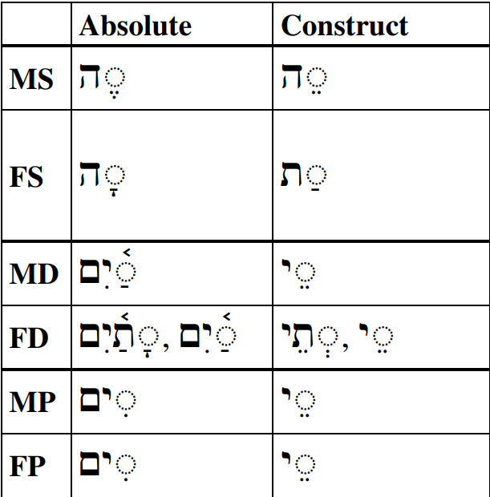

# Hebrew Construct Chain {.ConstructChain}

::: {.infobox .sound}
<figure>
<audio
        id="myAudio"
        controls controlsList="nodownload"
        src="./images/10.intro.m4a">
            Your browser does not support the
            <code>audio</code> element.
    </audio>
<button onclick="setPlaySpeed25()" type="button">2.5x</button>
<button onclick="setPlaySpeed2()" type="button">2x</button>
<button onclick="setPlaySpeed15()" type="button">1.5x</button>
<button onclick="setPlaySpeed1()" type="button">1x</button>
<button onclick="setPlaySpeed075()" type="button">.75x</button>
<button onclick="setPlaySpeed05()" type="button">.5x</button>
<script>
var x = document.getElementById("myAudio");
function setPlaySpeed05() { 
    x.playbackRate = 0.5;
    x.play();
}
function setPlaySpeed075() { 
    x.playbackRate = 0.75;
    x.play();
} 
function setPlaySpeed1() { 
    x.playbackRate = 1;
     x.play();
}
function setPlaySpeed15() { 
    x.playbackRate = 1.5;
     x.play();
} 
function setPlaySpeed2() { 
    x.playbackRate = 2;
     x.play();
} 
function setPlaySpeed25() { 
    x.playbackRate = 2.5;
     x.play(); 
} 
</script> 
</figure>
:::

> To comprehend Biblical Hebrew, we must be able to identify words in a construct state.

You might be surprised to learn that you are already familiar with at least one Hebrew Construct chain.

<span class="he">בֵּית לֶחֶם</span>, the word you probably know as "Bethlehem", literally means "house of bread" and is a Hebrew construct chain.  The first thing you might notice is that <span class="he">בַּ֫יִת</span>, the word for "house", is spelled a little differently.  The reason for this is that <span class="he">בֵּית</span> is in what we call a "construct" form or state.  

* <span class="he">בַּ֫יִת</span> means "house", and is said to be in "absolute" form
* <span class="he">בֵּית</span> means "house of", and is said to be in "construct" form

In this lesson, we will discuss the parameters of a Hebrew construct chain.  Keep in mind that we do not need to spell the construct state for a given noun.  Our primary goal is to *recognize* it and translate it adequately when we read our Bibles.

::: {.infobox .map}
**LESSON ITINERARY**

1. Describe what is meant by the term "construct chain"
2. Define a Hebrew construct chain 
3. Review and identify what makes a word definite 
4. Determine the definiteness of a chain
5. Differentiate between absolute state and construct state words
:::

::: {.box .stop}
**EQUIPMENT CHECK**

Before continuing, can you describe the following concepts?

* The pronominal suffixes (you have them memorized)
* Define Type 1 and Type 2 pronominal suffixes
:::

## First Thought {-}

::: {.infobox .sound}
<figure>
<audio
        id="myAudio"
        controls controlsList="nodownload"
        src="./images/10.09.pro0808.mp3">
            Your browser does not support the
            <code>audio</code> element.
    </audio>
<button onclick="setPlaySpeed25()" type="button">2.5x</button>
<button onclick="setPlaySpeed2()" type="button">2x</button>
<button onclick="setPlaySpeed15()" type="button">1.5x</button>
<button onclick="setPlaySpeed1()" type="button">1x</button>
<button onclick="setPlaySpeed075()" type="button">.75x</button>
<button onclick="setPlaySpeed05()" type="button">.5x</button>
<script>
var x = document.getElementById("myAudio");
function setPlaySpeed05() { 
    x.playbackRate = 0.5;
    x.play();
}
function setPlaySpeed075() { 
    x.playbackRate = 0.75;
    x.play();
} 
function setPlaySpeed1() { 
    x.playbackRate = 1;
     x.play();
}
function setPlaySpeed15() { 
    x.playbackRate = 1.5;
     x.play();
} 
function setPlaySpeed2() { 
    x.playbackRate = 2;
     x.play();
} 
function setPlaySpeed25() { 
    x.playbackRate = 2.5;
     x.play(); 
} 
</script> 
</figure>
:::

### <span class="he">בְּצֶדֶק כָּל־אִמְרֵי־פִי</span> {-}

_All the utterances of my mouth are in righteousness (Proverbs 8:8)_


<span class="he">כָּל־אִמְרֵי־פִי</span> "all _of_ the utterances _of_ my mouth" is a construct chain.

*****

```{r, out.width = "600pt", fig.align='center', fig.cap="Capernaum synagogue. Although this structure was built after the time of Yeshua, archeologists are convinced the current building rests on the foundation of an earlier synagogue.  This  synagogue was the probable location where Yeshua taught in righteousness as recorded in Mark 1:21-28, Luke 4:31-37, and John 6:59. Courtesy of the [Pictorial Library of Bible Lands](https://www.bibleplaces.com)"}


``` 


## What is a Construct Chain?
::: {.infobox .sound}
<figure>
<audio
        id="myAudio"
        controls controlsList="nodownload"
        src="./images/10.1.m4a">
            Your browser does not support the
            <code>audio</code> element.
    </audio>
<button onclick="setPlaySpeed25()" type="button">2.5x</button>
<button onclick="setPlaySpeed2()" type="button">2x</button>
<button onclick="setPlaySpeed15()" type="button">1.5x</button>
<button onclick="setPlaySpeed1()" type="button">1x</button>
<button onclick="setPlaySpeed075()" type="button">.75x</button>
<button onclick="setPlaySpeed05()" type="button">.5x</button>
<script>
var x = document.getElementById("myAudio");
function setPlaySpeed05() { 
    x.playbackRate = 0.5;
    x.play();
}
function setPlaySpeed075() { 
    x.playbackRate = 0.75;
    x.play();
} 
function setPlaySpeed1() { 
    x.playbackRate = 1;
     x.play();
}
function setPlaySpeed15() { 
    x.playbackRate = 1.5;
     x.play();
} 
function setPlaySpeed2() { 
    x.playbackRate = 2;
     x.play();
} 
function setPlaySpeed25() { 
    x.playbackRate = 2.5;
     x.play(); 
} 
</script> 
</figure>
:::

A construct chain consists of at least two nouns linked together.  

The first important thing to know about a Hebrew construct chain is this:

> The very last noun in the chain is said to be in the "absolute state".  All words in the chain before the absolute noun are said to be in "construct state."

* Back to <span class="he">בֵּית לֶחֶם</span>, "house of bread" 
    * "bread" would be in the absolute state
    * "house of" is in the construct state
    * The entire phrase would be called a "construct chain"  
        * A construct chain has one and only one absolute noun and one or more construct nouns

::: {.box .caution}
The purpose of the chain is to describe the **first** _noun_ in the chain.  

* It might be reasonable to think that the chain would be describing the noun in the absolute state, but that is not the case
* In <span class="he">בֵּית לֶחֶם</span>, we are describing the house, not the bread  
* A chain describes the first (true) NOUN in the chain, not necessarily the first word in the chain, which may be an adjective acting as a noun
* If there were a substantival adjective as the first word, e.g., "wise of heart", the chain is describing "heart," not "wise"

:::

* In English, we would typically add the word "of" after each word in the construct state.  
    * We could say "the king's son" or the "son of the king," and both would mean the same thing
    * Translating a construct word as "of" is a _starting point_ and not a hard-and-fast requirement
* Just like we may add `'s`, Hebrew has different spelling for nouns in construct
    * The absolute noun is the "normal" spelling and meaning


## What makes a construct chain different?

::: {.infobox .sound}
<figure>
<audio id="myAudio" controls controlsList="nodownload" src="./images/10.2.m4a">
            Your browser does not support the <code>audio</code> element.</audio>
<button onclick="setPlaySpeed25()" type="button">2.5x</button> <button onclick="setPlaySpeed2()" type="button">2x</button> <button onclick="setPlaySpeed15()" type="button">1.5x</button> <button onclick="setPlaySpeed1()" type="button">1x</button> <button onclick="setPlaySpeed075()" type="button">.75x</button> <button onclick="setPlaySpeed05()" type="button">.5x</button> 
<script>
var x = document.getElementById("myAudio");
function setPlaySpeed05() { 
    x.playbackRate = 0.5;
    x.play();
}
function setPlaySpeed075() { 
    x.playbackRate = 0.75;
    x.play();
} 
function setPlaySpeed1() { 
    x.playbackRate = 1;
     x.play();
}
function setPlaySpeed15() { 
    x.playbackRate = 1.5;
     x.play();
} 
function setPlaySpeed2() { 
    x.playbackRate = 2;
     x.play();
} 
function setPlaySpeed25() { 
    x.playbackRate = 2.5;
     x.play(); 
} 
</script> 
</figure>
:::

* What makes a Hebrew construct chain different is that nothing else comes between the words of the chain
    * In English, we could add an adjective like "the servant of the _wicked_ son of the king"
    * In Hebrew, any adjectives must come after the whole chain
        * A literal translation would look like: "servant of son of the king the wicked"    
        * To resolve, we would need to go back and determine which word the adjective modifies by matching the gender and number
* In the example of "servant of son of the king the wicked" there is ambiguity
    * Without more context, it is impossible to determine which of the three men is the wicked one
    * Translating is more straightforward when the nouns in the construct chain are of a mixed number or gender
    * For example: "the wife of David the strong the smart, the beautiful"
        * If "strong" and "beautiful" were FS, then we know they are referring to David's wife
        * If "smart" was MS, we know it is referring to David
        * The sentence translation would be clear: "The strong and beautiful wife of smart David"

## Review: what makes a word definite 

::: {.infobox .sound}
<figure>
<audio id="myAudio" controls controlsList="nodownload" src="./images/10.3.m4a">
            Your browser does not support the <code>audio</code> element.</audio>
<button onclick="setPlaySpeed25()" type="button">2.5x</button> <button onclick="setPlaySpeed2()" type="button">2x</button> <button onclick="setPlaySpeed15()" type="button">1.5x</button> <button onclick="setPlaySpeed1()" type="button">1x</button> <button onclick="setPlaySpeed075()" type="button">.75x</button> <button onclick="setPlaySpeed05()" type="button">.5x</button> 
<script>
var x = document.getElementById("myAudio");
function setPlaySpeed05() { 
    x.playbackRate = 0.5;
    x.play();
}
function setPlaySpeed075() { 
    x.playbackRate = 0.75;
    x.play();
} 
function setPlaySpeed1() { 
    x.playbackRate = 1;
     x.play();
}
function setPlaySpeed15() { 
    x.playbackRate = 1.5;
     x.play();
} 
function setPlaySpeed2() { 
    x.playbackRate = 2;
     x.play();
} 
function setPlaySpeed25() { 
    x.playbackRate = 2.5;
     x.play(); 
} 
</script> 
</figure>
:::

::: {.box .caution}
Nouns in construct state NEVER take the article.
:::

Construct Chains have strict rules regarding definiteness, so now would be a good time to refresh our list of what makes a noun definite in light of this lesson and Lesson 9.

A word is definite if it:

* Has the article - <span class="he">הַמֶּלֶךְ</span>
* Has a pronominal suffix - <span class="he">מַלְכִּי</span>
* Is a proper noun - <span class="he">דָּוִיד</span>
* Is in a construct chain where the last, absolute, word is definite - <span class="he">בֶּן הַמֶּלֶךְ</span> = THE son of the king

Even though a noun in construct may not have the definite article, it is deemed definite when the last word (the absolute noun) is definite.  We explain more on the next page.

## The Absolute noun establishes the definiteness of a chain

::: {.infobox .sound}
<figure>
<audio id="myAudio" controls controlsList="nodownload" src="./images/10.4.m4a">
            Your browser does not support the <code>audio</code> element.</audio>
<button onclick="setPlaySpeed25()" type="button">2.5x</button> <button onclick="setPlaySpeed2()" type="button">2x</button> <button onclick="setPlaySpeed15()" type="button">1.5x</button> <button onclick="setPlaySpeed1()" type="button">1x</button> <button onclick="setPlaySpeed075()" type="button">.75x</button> <button onclick="setPlaySpeed05()" type="button">.5x</button> 
<script>
var x = document.getElementById("myAudio");
function setPlaySpeed05() { 
    x.playbackRate = 0.5;
    x.play();
}
function setPlaySpeed075() { 
    x.playbackRate = 0.75;
    x.play();
} 
function setPlaySpeed1() { 
    x.playbackRate = 1;
     x.play();
}
function setPlaySpeed15() { 
    x.playbackRate = 1.5;
     x.play();
} 
function setPlaySpeed2() { 
    x.playbackRate = 2;
     x.play();
} 
function setPlaySpeed25() { 
    x.playbackRate = 2.5;
     x.play(); 
} 
</script> 
</figure>
:::

:::{.box .light}
A construct chain is either entirely definite or entirely indefinite

A construct chain will never mix definite and indefinite nouns
:::

* It is the last, absolute, word that defines whether the chain is definite or indefinite
    * <span class="he">בֶּן הַמֶּלֶךְ</span> = the son of the king
    * <span class="he">בֶּן מֶלֶךְ</span> = a son of a king
    * You will never see "a son of the king" or "the son of a king" in a construct chain
    * It's only one or the other
* There are examples in the Bible of mixing definiteness and indefiniteness but these are not done using construct chains^[<span class="he">מִ֭שְׁלֵי שְׁלֹמֹ֣ה</span> is a construct chain that means "THE proverbs of Solomon."<span class="he">מִזְמ֗וֹר לְדָ֫וִ֥ד</span> means "a psalm of (to) David", but this is not a construct chain.].


## How to Recognize a Construct Chain

::: {.infobox .sound}
<figure>
<audio id="myAudio" controls controlsList="nodownload" src="./images/10.5.m4a">
            Your browser does not support the <code>audio</code> element.</audio>
<button onclick="setPlaySpeed25()" type="button">2.5x</button> <button onclick="setPlaySpeed2()" type="button">2x</button> <button onclick="setPlaySpeed15()" type="button">1.5x</button> <button onclick="setPlaySpeed1()" type="button">1x</button> <button onclick="setPlaySpeed075()" type="button">.75x</button> <button onclick="setPlaySpeed05()" type="button">.5x</button> 
<script>
var x = document.getElementById("myAudio");
function setPlaySpeed05() { 
    x.playbackRate = 0.5;
    x.play();
}
function setPlaySpeed075() { 
    x.playbackRate = 0.75;
    x.play();
} 
function setPlaySpeed1() { 
    x.playbackRate = 1;
     x.play();
}
function setPlaySpeed15() { 
    x.playbackRate = 1.5;
     x.play();
} 
function setPlaySpeed2() { 
    x.playbackRate = 2;
     x.play();
} 
function setPlaySpeed25() { 
    x.playbackRate = 2.5;
     x.play(); 
} 
</script> 
</figure>
:::

The following are characteristics of nouns in the construct state:

* Never an article
* Never a pronominal suffix
* Never an unaccented long vowel unless it is a vowel letter 
    * We will see Tsere-yod and Holem-Vav
    * We will not see Holem, Qamets, or Tsere
    * We will see _accented_ long vowels in the penult^[That is the next to last syllable position.] - <span class="he">סֵ֫פֶר</span>
* No diphthong (will see Tsere+Yod or Holem-Vav)
* May have a reduced vowel in the penult
* Noun endings may change (next page)
* Two nouns connected by maqqef is a construct chain
    * <span class="he">כְּבוֹד־יְהוָה</span> = The glory of the LORD

::: {.box .light}
Long vowel, not accented, not a vowel letter = absolute
:::

## Identifying Construct state by Noun Endings


::: {.infobox .sound}
<figure>
<audio id="myAudio" controls controlsList="nodownload" src="./images/10.6.m4a">
            Your browser does not support the <code>audio</code> element.</audio>
<button onclick="setPlaySpeed25()" type="button">2.5x</button> <button onclick="setPlaySpeed2()" type="button">2x</button> <button onclick="setPlaySpeed15()" type="button">1.5x</button> <button onclick="setPlaySpeed1()" type="button">1x</button> <button onclick="setPlaySpeed075()" type="button">.75x</button> <button onclick="setPlaySpeed05()" type="button">.5x</button> 
<script>
var x = document.getElementById("myAudio");
function setPlaySpeed05() { 
    x.playbackRate = 0.5;
    x.play();
}
function setPlaySpeed075() { 
    x.playbackRate = 0.75;
    x.play();
} 
function setPlaySpeed1() { 
    x.playbackRate = 1;
     x.play();
}
function setPlaySpeed15() { 
    x.playbackRate = 1.5;
     x.play();
} 
function setPlaySpeed2() { 
    x.playbackRate = 2;
     x.play();
} 
function setPlaySpeed25() { 
    x.playbackRate = 2.5;
     x.play(); 
} 
</script> 
</figure>
:::

* Nouns in construct often sometimes (but will not always) change endings
* The table below shows the Absolute ending and then the difference in the Construct form

```{r, out.width = "300pt", fig.align='center'}
library(knitr)

```

Other nouns may not change endings but will exhibit a loss of long vowels, as discussed in the previous section

::: {.box .light}
Word-final Tsere+Yod is diagnostic of Plural and Dual construct forms
:::


## Construct Chain Conclusion {-}

::: {.infobox .sound}
<figure>
<audio id="myAudio" controls controlsList="nodownload" src="./images/10.conclusion.m4a">
            Your browser does not support the <code>audio</code> element.</audio>
<button onclick="setPlaySpeed25()" type="button">2.5x</button> <button onclick="setPlaySpeed2()" type="button">2x</button> <button onclick="setPlaySpeed15()" type="button">1.5x</button> <button onclick="setPlaySpeed1()" type="button">1x</button> <button onclick="setPlaySpeed075()" type="button">.75x</button> <button onclick="setPlaySpeed05()" type="button">.5x</button> 
<script>
var x = document.getElementById("myAudio");
function setPlaySpeed05() { 
    x.playbackRate = 0.5;
    x.play();
}
function setPlaySpeed075() { 
    x.playbackRate = 0.75;
    x.play();
} 
function setPlaySpeed1() { 
    x.playbackRate = 1;
     x.play();
}
function setPlaySpeed15() { 
    x.playbackRate = 1.5;
     x.play();
} 
function setPlaySpeed2() { 
    x.playbackRate = 2;
     x.play();
} 
function setPlaySpeed25() { 
    x.playbackRate = 2.5;
     x.play(); 
} 
</script> 
</figure>
:::
* Remember the rules for what makes a noun definite.  This will help you determine whether the entire construct chain is definite or indefinite (for it can only be entirely definite or entirely indefinite)
    * "THE son of the queen" OR "A son of a queen"
* All words, except for the last, are in the "construct state"
    * No article or pronominal suffix
    * Long vowels are limited
        * ("Long vowel, not a vowel letter = Absolute" - Dr. Beckman)
    * No diphthong
    * Review ending changes chart
        * Tsere+yod is a very common ending for a masculine plural construct noun
    * A reduced vowel in the penult is usually construct - <span class="he">נְבִיא</span>
    * Noun with Maqqef is construct - <span class="he">בֶּן־</span>

There are four extremely common constructs in the Bible, so we must be able to recognize them.  These will be reviewed in `Anki`.

* <span class="he">כָּל־</span> - all of
* <span class="he">אֲבִי־</span> = father of
* <span class="he">אֲחִי־</span> = brother of
* <span class="he">אֵ֫שֶׁת־</span> = wife of

## Word Warm-up {-}

<div class="container">
<iframe class="responsive-iframe" src="https://youtube.com/embed/YF2XieUoR3Y" frameborder="0"></iframe>
</div>

[Click to open `Word Warm-up` video in a new tab](https://youtu.be/YF2XieUoR3Y){target="_blank"}


## Verses Warm-up {-}

<div class="container">
<iframe class="responsive-iframe" src="https://youtube.com/embed/hxpScJEBMcY" frameborder="0"></iframe>
</div>

[Click to open `Verses Warm-up` video in a new tab](https://youtu.be/hxpScJEBMcY){target="_blank"}


## Anki {-}

* `Lesson 10 A. Vocab`
* `Lesson 10 B. Grammar`
* `Lesson 10 C. Workbook`
* `Lesson 10 D. Verses`

## Worksheets: Construct Identification {-}

::: {.infobox .sound}
<figure>
<audio id="myAudio" controls controlsList="nodownload" src="./images/10.worksheets.m4a">
            Your browser does not support the <code>audio</code> element.</audio>
<button onclick="setPlaySpeed25()" type="button">2.5x</button> <button onclick="setPlaySpeed2()" type="button">2x</button> <button onclick="setPlaySpeed15()" type="button">1.5x</button> <button onclick="setPlaySpeed1()" type="button">1x</button> <button onclick="setPlaySpeed075()" type="button">.75x</button> <button onclick="setPlaySpeed05()" type="button">.5x</button> 
<script>
var x = document.getElementById("myAudio");
function setPlaySpeed05() { 
    x.playbackRate = 0.5;
    x.play();
}
function setPlaySpeed075() { 
    x.playbackRate = 0.75;
    x.play();
} 
function setPlaySpeed1() { 
    x.playbackRate = 1;
     x.play();
}
function setPlaySpeed15() { 
    x.playbackRate = 1.5;
     x.play();
} 
function setPlaySpeed2() { 
    x.playbackRate = 2;
     x.play();
} 
function setPlaySpeed25() { 
    x.playbackRate = 2.5;
     x.play(); 
} 
</script> 
</figure>
:::

This attachment has a list of words, some are in absolute, and some are in construct. See if you can determine the differences^[Odd 1-35, 39, 41, 42, 44, 45, 47 are Absolute; 37 and 38 are ambiguous; even 2-36, 40, 43, 46, and 48 are Construct. Most often it is "Long vowel, not a vowel letter" that identifies absolute.].

[Construct Practice](./images/10_construct_practice.pdf){target="_blank"}

This next attachment is not really a worksheet, but is a summary of common construct vocabulary that occurs in the Bible for your review.

[Construct Vocabulary](./images/10_construct_vocab.pdf){target="_blank"}


## Ruth Pursuit {-}        

::: {.infobox .sound}
<figure>
<audio id="myAudio" controls controlsList="nodownload" src="./images/10.ruth.m4a">
            Your browser does not support the <code>audio</code> element.</audio>
<button onclick="setPlaySpeed25()" type="button">2.5x</button> <button onclick="setPlaySpeed2()" type="button">2x</button> <button onclick="setPlaySpeed15()" type="button">1.5x</button> <button onclick="setPlaySpeed1()" type="button">1x</button> <button onclick="setPlaySpeed075()" type="button">.75x</button> <button onclick="setPlaySpeed05()" type="button">.5x</button> 
<script>
var x = document.getElementById("myAudio");
function setPlaySpeed05() { 
    x.playbackRate = 0.5;
    x.play();
}
function setPlaySpeed075() { 
    x.playbackRate = 0.75;
    x.play();
} 
function setPlaySpeed1() { 
    x.playbackRate = 1;
     x.play();
}
function setPlaySpeed15() { 
    x.playbackRate = 1.5;
     x.play();
} 
function setPlaySpeed2() { 
    x.playbackRate = 2;
     x.play();
} 
function setPlaySpeed25() { 
    x.playbackRate = 2.5;
     x.play(); 
} 
</script> 
</figure>
:::

::: {.box .map} 
YOUR QUEST

1. Find the following construct nouns:
    * days of (yellow)
    * field(s) of (green)
    * two of (blue)
        * two construct M <span class="he">שְׁנֵי</span>
        * two construct F <span class="he">שְׁתֵּי</span>
    * house of (pink)
2. Find the following vocabulary words (gray)
    * Again
    * Death
    * Loyalty

As always, words may have prefixes or suffixes.  Try to identify whether the construct is definite or indefinite based on the absolute noun.  
:::

* [Blank copy of Ruth 1](https://docs.google.com/document/d/1bcT1J-fcVmD1Zn5Jk2nj0560tEddcgtbYZLkwaVVuyE/copy){target="_blank"}
* [Ruth Pursuit Answer Key #10](./images/10_Ruth_Pursuit_KEY.pdf){target="_blank"}

### Ruth 1 {-}


::: {.infobox .sound}
<figure>Click to hear Ruth 1 read by Abraham Shmuelof:<audio id="myAudioRuth" controls controlsList="nodownload" src="./images/t2901.m4a">
Your browser does not support the <code>audio</code> element.</audio>
<button onclick="setPlaySpeed25()" type="button">2.5x</button> <button onclick="setPlaySpeed2()" type="button">2x</button> <button onclick="setPlaySpeed15()" type="button">1.5x</button> <button onclick="setPlaySpeed1()" type="button">1x</button> <button onclick="setPlaySpeed075()" type="button">.75x</button> <button onclick="setPlaySpeed05()" type="button">.5x</button> 
<script>
var x = document.getElementById("myAudioRuth");
function setPlaySpeed05() { x.playbackRate = 0.5; x.play();}
function setPlaySpeed075() {x.playbackRate = 0.75; x.play();} 
function setPlaySpeed1() {x.playbackRate = 1; x.play();}
function setPlaySpeed15() {x.playbackRate = 1.5; x.play();} 
function setPlaySpeed2() {x.playbackRate = 2; x.play();} 
function setPlaySpeed25() {x.playbackRate = 2.5;x.play();} 
</script> </figure>
:::


<span class="he"><p align="right">
‫ 1     וַיְהִי בִּימֵי שְׁפֹט הַשֹּׁפְטִים וַיְהִי רָעָב בָּאָרֶץ וַיֵּלֶךְ אִישׁ מִבֵּית לֶחֶם יְהוּדָה לָגוּר בִּשְׂדֵי מוֹאָב הוּא וְאִשְׁתּוֹ וּשְׁנֵי בָנָיו׃ ‬
‫ 2     וְשֵׁם הָאִישׁ אֱלִימֶלֶךְ וְשֵׁם אִשְׁתּוֹ נָעֳמִי וְשֵׁם שְׁנֵי־בָנָיו מַחְלוֹן וְכִלְיוֹן אֶפְרָתִים מִבֵּית לֶחֶם יְהוּדָה וַיָּבֹאוּ שְׂדֵי־מוֹאָב וַיִּהְיוּ־שָׁם׃ ‬
‫ 3     וַיָּמָת אֱלִימֶלֶךְ אִישׁ נָעֳמִי וַתִּשָּׁאֵר הִיא וּשְׁנֵי בָנֶיהָ׃ ‬
‫ 4     וַיִּשְׂאוּ לָהֶם נָשִׁים מֹאֲבִיּוֹת שֵׁם הָאַחַת עָרְפָּה וְשֵׁם הַשֵּׁנִית רוּת וַיֵּשְׁבוּ שָׁם כְּעֶשֶׂר שָׁנִים׃ ‬
‫ 5     וַיָּמוּתוּ גַם־שְׁנֵיהֶם מַחְלוֹן וְכִלְיוֹן וַתִּשָּׁאֵר הָאִשָּׁה מִשְּׁנֵי יְלָדֶיהָ וּמֵאִישָׁהּ׃ ‬
‫ 6     וַתָּקָם הִיא וְכַלֹּתֶיהָ וַתָּשָׁב מִשְּׂדֵי מוֹאָב כִּי שָׁמְעָה בִּשְׂדֵה מוֹאָב כִּי־פָקַד יְהוָה אֶת־עַמּוֹ לָתֵת לָהֶם לָחֶם׃ ‬
‫ 7     וַתֵּצֵא מִן־הַמָּקוֹם אֲשֶׁר הָיְתָה־שָׁמָּה וּשְׁתֵּי כַלֹּתֶיהָ עִמָּהּ וַתֵּלַכְנָה בַדֶּרֶךְ לָשׁוּב אֶל־אֶרֶץ יְהוּדָה׃ ‬
‫ 8     וַתֹּאמֶר נָעֳמִי לִשְׁתֵּי כַלֹּתֶיהָ לֵכְנָה שֹּׁבְנָה אִשָּׁה לְבֵית אִמָּהּ *יעשה **יַעַשׂ יְהוָה עִמָּכֶם חֶסֶד כַּאֲשֶׁר עֲשִׂיתֶם עִם־הַמֵּתִים וְעִמָּדִי׃ ‬
‫ 9     יִתֵּן יְהוָה לָכֶם וּמְצֶאןָ מְנוּחָה אִשָּׁה בֵּית אִישָׁהּ וַתִּשַּׁק לָהֶן וַתִּשֶּׂאנָה קוֹלָן וַתִּבְכֶּינָה׃ ‬
‫ 10    וַתֹּאמַרְנָה־לָּהּ כִּי־אִתָּךְ נָשׁוּב לְעַמֵּךְ׃ ‬
‫ 11    וַתֹּאמֶר נָעֳמִי שֹׁבְנָה בְנֹתַי לָמָּה תֵלַכְנָה עִמִּי הַעוֹד־לִי בָנִים בְּמֵעַי וְהָיוּ לָכֶם לַאֲנָשִׁים׃ ‬
‫ 12    שֹׁבְנָה בְנֹתַי לֵכְןָ כִּי זָקַנְתִּי מִהְיוֹת לְאִישׁ כִּי אָמַרְתִּי יֶשׁ־לִי תִקְוָה גַּם הָיִיתִי הַלַּיְלָה לְאִישׁ וְגַם יָלַדְתִּי בָנִים׃ ‬
‫ 13    הֲלָהֵן תְּשַׂבֵּרְנָה עַד אֲשֶׁר יִגְדָּלוּ הֲלָהֵן תֵּעָגֵנָה לְבִלְתִּי הֱיוֹת לְאִישׁ אַל בְּנֹתַי כִּי־מַר־לִי מְאֹד מִכֶּם כִּי־יָצְאָה בִי יַד־יְהוָה׃ ‬
‫ 14    וַתִּשֶּׂנָה קוֹלָן וַתִּבְכֶּינָה עוֹד וַתִּשַּׁק עָרְפָּה לַחֲמוֹתָהּ וְרוּת דָּבְקָה בָּהּ׃ ‬
‫ 15    וַתֹּאמֶר הִנֵּה שָׁבָה יְבִמְתֵּךְ אֶל־עַמָּהּ וְאֶל־אֱלֹהֶיהָ שׁוּבִי אַחֲרֵי יְבִמְתֵּךְ׃ ‬
‫ 16    וַתֹּאמֶר רוּת אַל־תִּפְגְּעִי־בִי לְעָזְבֵךְ לָשׁוּב מֵאַחֲרָיִךְ כִּי אֶל־אֲשֶׁר תֵּלְכִי אֵלֵךְ וּבַאֲשֶׁר תָּלִינִי אָלִין עַמֵּךְ עַמִּי וֵאלֹהַיִךְ אֱלֹהָי׃ ‬
‫ 17    בַּאֲשֶׁר תָּמוּתִי אָמוּת וְשָׁם אֶקָּבֵר כֹּה יַעֲשֶׂה יְהוָה לִי וְכֹה יֹסִיף כִּי הַמָּוֶת יַפְרִיד בֵּינִי וּבֵינֵךְ׃ ‬
‫ 18    וַתֵּרֶא כִּי־מִתְאַמֶּצֶת הִיא לָלֶכֶת אִתָּהּ וַתֶּחְדַּל לְדַבֵּר אֵלֶיהָ׃ ‬
‫ 19    וַתֵּלַכְנָה שְׁתֵּיהֶם עַד־בֹּאָנָה בֵּית לָחֶם וַיְהִי כְּבֹאָנָה בֵּית לֶחֶם וַתֵּהֹם כָּל־הָעִיר עֲלֵיהֶן וַתֹּאמַרְנָה הֲזֹאת נָעֳמִי׃ ‬
‫ 20    וַתֹּאמֶר אֲלֵיהֶן אַל־תִּקְרֶאנָה לִי נָעֳמִי קְרֶאןָ לִי מָרָא כִּי־הֵמַר שַׁדַּי לִי מְאֹד׃ ‬
‫ 21    אֲנִי מְלֵאָה הָלַכְתִּי וְרֵיקָם הֱשִׁיבַנִי יְהוָה לָמָּה תִקְרֶאנָה לִי נָעֳמִי וַיהוָה עָנָה בִי וְשַׁדַּי הֵרַע לִי׃ ‬
‫ 22    וַתָּשָׁב נָעֳמִי וְרוּת הַמּוֹאֲבִיָּה כַלָּתָהּ עִמָּהּ הַשָּׁבָה מִשְּׂדֵי מוֹאָב וְהֵמָּה בָּאוּ בֵּית לֶחֶם בִּתְחִלַּת קְצִיר שְׂעֹרִים׃
</span></p>


## Quest Quiz #10 {-}

<div class="container">
<iframe class="responsive-iframe" src="https://forms.gle/ST6XfCvKRXHRfxfVA" frameborder="0"></iframe>
</div>


[Open Quest Quiz #10 in a new window](https://forms.gle/ST6XfCvKRXHRfxfVA){target="_blank"}

## Claim your next `Twelve Tribes Badge`! {-}


When you have completed all activities on your `Hebrew GRAMMAR Quest Checklist` through Lesson 10, complete the certification below, and your badge will be on its way!

<!-- Tribe Badge 4 = gad -->

<div class="containerLtr">
<iframe class="responsive-iframe" src="https://forms.gle/7X1tmBcU5WtGT46A7" frameborder="0"></iframe>
</div>

[Open Badge form in a new window](https://forms.gle/7X1tmBcU5WtGT46A7){target="_blank"}

## Lesson Extras {-}

* [Dr. Beckman Lecture Video](http://youtu.be/IqD25wwKgWc){target=“_blank”}
* [Dr. Beckman Lecture Notes](https://hebrewsyntax.org/bbh2new/10_overheads_bw.pdf){target=“_blank”}
* [BBH Lesson Summary](http://hebrew.billmounce.com/BasicsBiblicalHebrew-10.pdf){target=“_blank”}
* [BBH Study Verses PDF](http://hebrew.billmounce.com/Biblical_examples_10.pdf){target=“_blank”}
* Additional Drills/Worksheets 
    * [Practice of vocabulary words in the construct state](https://hebrewsyntax.org/bbh2new/10_construct_vocab.pdf){target=“_blank”} 
    * [Quiz a](https://hebrewsyntax.org/bbh2new/10_quiz_new.pdf){target=“_blank”}
    * [Quiz b](https://hebrewsyntax.org/bbh2new/10_quiz_practice.pdf){target=“_blank”}


