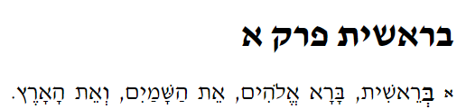

# Hebrew Numerals

::: {.infobox .sound}
<figure>
<audio id="myAudio" controls controlsList="nodownload" src="./images/11.0.0.intro.m4a">
            Your browser does not support the <code>audio</code> element.</audio>
<button onclick="setPlaySpeed25()" type="button">2.5x</button> <button onclick="setPlaySpeed2()" type="button">2x</button> <button onclick="setPlaySpeed15()" type="button">1.5x</button> <button onclick="setPlaySpeed1()" type="button">1x</button> <button onclick="setPlaySpeed075()" type="button">.75x</button> <button onclick="setPlaySpeed05()" type="button">.5x</button> 
<script>
var x = document.getElementById("myAudio");
function setPlaySpeed05() { 
    x.playbackRate = 0.5;
    x.play();
}
function setPlaySpeed075() { 
    x.playbackRate = 0.75;
    x.play();
} 
function setPlaySpeed1() { 
    x.playbackRate = 1;
     x.play();
}
function setPlaySpeed15() { 
    x.playbackRate = 1.5;
     x.play();
} 
function setPlaySpeed2() { 
    x.playbackRate = 2;
     x.play();
} 
function setPlaySpeed25() { 
    x.playbackRate = 2.5;
     x.play(); 
} 
</script> 
</figure>
:::

> To comprehend Biblical Hebrew, we must be able to figure out numbers, with or without a dictionary, when we encounter them in the Bible


You have worked very hard on the first ten lessons!  Way to go!  The authors of <u>Basics of Biblical Hebrew</u>, wisely in our opinion, strategically placed a necessary but lighter discussion on numerals right here in Lesson 11.  We are emerging from what may be a lot of foggy concepts with all of the noun, pronoun, and adjective concepts in lessons 4-10 (particularly Lessons 8-10).  The bulk of the work in Lesson 11 will be in `Anki` learning numbers from _Hebrew Quest_.

For the next 25 lessons, we will focus on the Hebrew verbal system and -- the entire point of this course -- reading and understanding Scripture, especially with the _Hebrew Quest_ study passages.

Enjoy this brief lesson on numbers!

::: {.infobox .map}
**LESSON ITINERARY** 

1. The Biblical text always spells out numbers
2. Notes and footnotes use symbols for numbers
3. Be Familiar with Hebrew Ordinal Numbers - First through Tenth
4. Hebrew Cardinal Numbers 1-9
5. Digits 1 and 2 match the gender of the noun
6. Digits 3-10 take the opposite gender of the noun
7. Learn the Cardinal Numbers Above 10
:::

::: {.box .stop}
**EQUIPMENT CHECK**

Before continuing, can you describe the following concepts?

* The difference between construct and absolute states
:::

## First Thought {-}


::: {.infobox .sound}
<figure>
<audio id="myAudio" controls controlsList="nodownload" src="./images/11.0.1.jos0402.mp3">
            Your browser does not support the <code>audio</code> element.</audio>
<button onclick="setPlaySpeed25()" type="button">2.5x</button> <button onclick="setPlaySpeed2()" type="button">2x</button> <button onclick="setPlaySpeed15()" type="button">1.5x</button> <button onclick="setPlaySpeed1()" type="button">1x</button> <button onclick="setPlaySpeed075()" type="button">.75x</button> <button onclick="setPlaySpeed05()" type="button">.5x</button> 
<script>
var x = document.getElementById("myAudio");
function setPlaySpeed05() { 
    x.playbackRate = 0.5;
    x.play();
}
function setPlaySpeed075() { 
    x.playbackRate = 0.75;
    x.play();
} 
function setPlaySpeed1() { 
    x.playbackRate = 1;
     x.play();
}
function setPlaySpeed15() { 
    x.playbackRate = 1.5;
     x.play();
} 
function setPlaySpeed2() { 
    x.playbackRate = 2;
     x.play();
} 
function setPlaySpeed25() { 
    x.playbackRate = 2.5;
     x.play(); 
} 
</script> 
</figure>
:::

### <span class="he"> קְחוּ לָכֶם מִן־הָעָם שְׁנֵים עָשָׂר אֲנָשִׁים</span> {-}

_Take for yourselves twelve men from the people (Joshua 4:2)_

Give Him praise that you are among those counted as His talmidim (disciples)!


```{r, out.width = "600pt", fig.align='center', fig.cap="Tabgha, the traditional location of the calling of the twelve disciples. Courtesy of the [Pictorial Library of Bible Lands](https://www.bibleplaces.com)"}


``` 


## _Hebrew Quest_ Numerals Lecture

::: {.infobox .sound}
<figure>Click to play the audio from the Hebrew Quest segment. <audio id="myAudio" controls controlsList="nodownload" 
src="./images/11.1.m4a">
Your browser does not support the <code>audio</code> element.</audio><button onclick="x25()" type="button">2.5x</button><button onclick="x2()" type="button">2x</button><button onclick="x15()" type="button">1.5x</button><button onclick="x1()" type="button">1x</button><button onclick="x075()" type="button">.75x</button><button onclick="x05()" type="button">.5x</button><script>
var x = document.getElementById("myAudio");
function x05() { 
    x.playbackRate = 0.5;
    x.play();}
function x075() { 
    x.playbackRate = 0.75;
    x.play();} 
function x1() { 
    x.playbackRate = 1;
     x.play();}
function x15() { 
    x.playbackRate = 1.5;
     x.play();} 
function x2() { 
    x.playbackRate = 2;
     x.play();} 
function x25() { 
    x.playbackRate = 2.5;
     x.play(); } 
</script></figure>
:::
View this 17-minute overview video from _Hebrew Quest_ on Hebrew Numerals.  Don't fret if you don't understand this material completely.  

<div class="container">
<iframe class="responsive-iframe" src="https://www.youtube.com/embed/MlfwNNuWgto?start=1675&end=2710
&rel=0&showinfo=0&autohide=1&autoplay=1" frameborder="0"></iframe>
</div>

[Click to open video in a new tab](https://youtu.be/MlfwNNuWgto?t=1675){target="_blank"}

Start: 27:55  
End:  45:10

## The Biblical text always spells out numbers

::: {.infobox .sound}
<figure>
<audio id="myAudio" controls controlsList="nodownload" src="./images/11.2.m4a">
            Your browser does not support the <code>audio</code> element.</audio>
<button onclick="setPlaySpeed25()" type="button">2.5x</button> <button onclick="setPlaySpeed2()" type="button">2x</button> <button onclick="setPlaySpeed15()" type="button">1.5x</button> <button onclick="setPlaySpeed1()" type="button">1x</button> <button onclick="setPlaySpeed075()" type="button">.75x</button> <button onclick="setPlaySpeed05()" type="button">.5x</button> 
<script>
var x = document.getElementById("myAudio");
function setPlaySpeed05() { 
    x.playbackRate = 0.5;
    x.play();
}
function setPlaySpeed075() { 
    x.playbackRate = 0.75;
    x.play();
} 
function setPlaySpeed1() { 
    x.playbackRate = 1;
     x.play();
}
function setPlaySpeed15() { 
    x.playbackRate = 1.5;
     x.play();
} 
function setPlaySpeed2() { 
    x.playbackRate = 2;
     x.play();
} 
function setPlaySpeed25() { 
    x.playbackRate = 2.5;
     x.play(); 
} 
</script> 
</figure>
:::

> Numerals will always be spelled out as words

* Example: 
  * <span class="he">כָּל־יְמֵי מְתוּשֶׁלַח **תֵּשַׁע וְשִׁשִּׁים שָׁנָה וּתְשַׁע**</span>
  * "all the days of Methuselah (were) **nine and sixty years (i.e., 960) and nine (i.e., 969)**."

## Notes and footnotes use symbols for numbers

::: {.infobox .sound}
<figure>
<audio id="myAudio" controls controlsList="nodownload" src="./images/11.3.m4a">
            Your browser does not support the <code>audio</code> element.</audio>
<button onclick="setPlaySpeed25()" type="button">2.5x</button> <button onclick="setPlaySpeed2()" type="button">2x</button> <button onclick="setPlaySpeed15()" type="button">1.5x</button> <button onclick="setPlaySpeed1()" type="button">1x</button> <button onclick="setPlaySpeed075()" type="button">.75x</button> <button onclick="setPlaySpeed05()" type="button">.5x</button> 
<script>
var x = document.getElementById("myAudio");
function setPlaySpeed05() { 
    x.playbackRate = 0.5;
    x.play();
}
function setPlaySpeed075() { 
    x.playbackRate = 0.75;
    x.play();
} 
function setPlaySpeed1() { 
    x.playbackRate = 1;
     x.play();
}
function setPlaySpeed15() { 
    x.playbackRate = 1.5;
     x.play();
} 
function setPlaySpeed2() { 
    x.playbackRate = 2;
     x.play();
} 
function setPlaySpeed25() { 
    x.playbackRate = 2.5;
     x.play(); 
} 
</script> 
</figure>
:::


> This section is presented for information only


* You may come across a system of counting that uses numerical values for each of the Hebrew letters
  * א ב ג ד ה ו ז ח ט represent 1-9
  * י כ ל מ נ ס ע פ צ represent 10-90 by tens
  * So to say 33, would be 30 and 3 = לג or often ל״ג, with the ״ indicating that this is not a real word
* ק ר ש ת are 100, 200, 300, and 400, 
* Finally, we use the sofit forms ך ם ן ף ץ for 500-900
* In some reckonings, a series of dots or diamonds above the letters, or ’ is used for numbers above 999.  For example, 1000 is ’א
* Below is how a Hebrew reference might say "Genesis 1:1"
  * בראשית פרק א
  * This means "Genesis Chapter 1"
* Next, note the diminished א indicating "1" for the first verse

```{r, out.width = "600pt", fig.align='center'}


``` 

## Hebrew Ordinal Numbers

::: {.infobox .sound}
<figure>
<audio id="myAudio" controls controlsList="nodownload" src="./images/11.4.m4a">
            Your browser does not support the <code>audio</code> element.</audio>
<button onclick="setPlaySpeed25()" type="button">2.5x</button> <button onclick="setPlaySpeed2()" type="button">2x</button> <button onclick="setPlaySpeed15()" type="button">1.5x</button> <button onclick="setPlaySpeed1()" type="button">1x</button> <button onclick="setPlaySpeed075()" type="button">.75x</button> <button onclick="setPlaySpeed05()" type="button">.5x</button> 
<script>
var x = document.getElementById("myAudio");
function setPlaySpeed05() { 
    x.playbackRate = 0.5;
    x.play();
}
function setPlaySpeed075() { 
    x.playbackRate = 0.75;
    x.play();
} 
function setPlaySpeed1() { 
    x.playbackRate = 1;
     x.play();
}
function setPlaySpeed15() { 
    x.playbackRate = 1.5;
     x.play();
} 
function setPlaySpeed2() { 
    x.playbackRate = 2;
     x.play();
} 
function setPlaySpeed25() { 
    x.playbackRate = 2.5;
     x.play(); 
} 
</script> 
</figure>
:::


> In Hebrew, Ordinal Numbers are attributive adjectives

* Ordinal numbers denote order.  first, second, third
* They follow the noun and match in gender, number, and definiteness (Attributive Always After, Always Agree)
    * <span class="he">יוֹם רִאשׁוֹן</span> or <span class="he">הַיּוֹם הָרִאשׁוֹן</span> = first day or the first day
* Ordinal numbers end in Hireq-Yod (M) or Hireq-Yod_Tav (F)
    *  <span class="he">שְׁלִישִׁי</span> and <span class="he">שְׁלִישִׁית</span> mean "third"
* To denote the 11th position or higher, we would use cardinal numbers
    * We are dependent on the context of the passage to indicate whether the number is cardinal or ordinal
    * <span class="he">בִּשְׁנַת הָאַרְבָּעִים</span>  = in the year of the forty = in the 40th year
* We encourage you to once again review the "days of the week" song with Izzy in the video below

<div class="container">
<iframe class="responsive-iframe" src="https://www.youtube.com/embed/MlfwNNuWgto?startt=2596&end=2661" frameborder="0"></iframe>
</div>

[Open video in new window](https://www.youtube.com/embed/MlfwNNuWgto?t=2596){target="_blank"}


## Cardinal Numbers 1-10

::: {.infobox .sound}
<figure>
<audio id="myAudio" controls controlsList="nodownload" src="./images/11.5.m4a">
            Your browser does not support the <code>audio</code> element.</audio>
<button onclick="setPlaySpeed25()" type="button">2.5x</button> <button onclick="setPlaySpeed2()" type="button">2x</button> <button onclick="setPlaySpeed15()" type="button">1.5x</button> <button onclick="setPlaySpeed1()" type="button">1x</button> <button onclick="setPlaySpeed075()" type="button">.75x</button> <button onclick="setPlaySpeed05()" type="button">.5x</button> 
<script>
var x = document.getElementById("myAudio");
function setPlaySpeed05() { 
    x.playbackRate = 0.5;
    x.play();
}
function setPlaySpeed075() { 
    x.playbackRate = 0.75;
    x.play();
} 
function setPlaySpeed1() { 
    x.playbackRate = 1;
     x.play();
}
function setPlaySpeed15() { 
    x.playbackRate = 1.5;
     x.play();
} 
function setPlaySpeed2() { 
    x.playbackRate = 2;
     x.play();
} 
function setPlaySpeed25() { 
    x.playbackRate = 2.5;
     x.play(); 
} 
</script> 
</figure>
:::

> The numeral one is an attributive adjective - it follows its noun and agrees in gender, number, and definiteness
    
* As we mentioned previously, it is sometimes used as an indefinite article
* <span class="he">אִישׁ אֶחָד</span> = one man = a man

> Two through Ten are nouns
    
* They have both masculine and feminine forms
* They have absolute and construct forms
* Higher numbers >10 are nouns with no specific gender


> Digits 1 and 2 match the gender of the noun

For example:

* <span class="he">בֵּן אֶחָד</span> = one son
* <span class="he">בַּת אַחַת</span> = one daughter

> Digits 3-10 take the opposite gender of the noun

Additionally, they are "singular" even though the noun is plural.  

For example:

* <span class="he">שְׁלֹשָׁה בָּנִים</span> = three sons
* <span class="he">שְׁלֹשׁ בָּנוֹת</span> = three daughters

The technical term for this is "chiastic concord" (you don't need to know this)

## Cardinal Numbers Above 10

::: {.infobox .sound}
<figure>
<audio id="myAudio" controls controlsList="nodownload" src="./images/11.6.m4a">
            Your browser does not support the <code>audio</code> element.</audio>
<button onclick="setPlaySpeed25()" type="button">2.5x</button> <button onclick="setPlaySpeed2()" type="button">2x</button> <button onclick="setPlaySpeed15()" type="button">1.5x</button> <button onclick="setPlaySpeed1()" type="button">1x</button> <button onclick="setPlaySpeed075()" type="button">.75x</button> <button onclick="setPlaySpeed05()" type="button">.5x</button> 
<script>
var x = document.getElementById("myAudio");
function setPlaySpeed05() { 
    x.playbackRate = 0.5;
    x.play();
}
function setPlaySpeed075() { 
    x.playbackRate = 0.75;
    x.play();
} 
function setPlaySpeed1() { 
    x.playbackRate = 1;
     x.play();
}
function setPlaySpeed15() { 
    x.playbackRate = 1.5;
     x.play();
} 
function setPlaySpeed2() { 
    x.playbackRate = 2;
     x.play();
} 
function setPlaySpeed25() { 
    x.playbackRate = 2.5;
     x.play(); 
} 
</script> 
</figure>
:::

* 11-19
    * 11-12 match gender, 13-19 swap
        * 11 <span class="he">אַחַד אָשָֹר</span>
        * 13 <span class="he">שְׁלֹשָׁה אָשָֹר</span>
* Decades 30 through 90 are spelled as masculine plural of the corresponding 3-9 number
    * 3 = <span class="he">שָׁלֹשׁ</span>  
    * 30 = <span class="he">שְׁלֹשִׁים</span>
* 20 is a bit unusual
    * The word for two is <span class="he">שְׁנַיִם</span> (male) and <span class="he">שְׁתַּיִם</span> (female)
    * Since these words already have a non-singular ending, Hebrew uses the masculine plural of ten
    * <span class="he">עֶשֶׂר</span> is 10
    * <span class="he">עֶשְׂרִים</span> is 20
* 100 is <span class="he">מֵאָה</span>
* 200 is <span class="he">מָאתַיִם</span>, the plural of 100
* 300 is <span class="he">שְׁלֹשׁ מֵאוֹת</span> ("three one hundred" and so forth up to 1000)
    
## Lesson 11 Conclusion 

::: {.infobox .sound}
<figure>
<audio id="myAudio" controls controlsList="nodownload" src="./images/11.conclusion.m4a">
            Your browser does not support the <code>audio</code> element.</audio>
<button onclick="setPlaySpeed25()" type="button">2.5x</button> <button onclick="setPlaySpeed2()" type="button">2x</button> <button onclick="setPlaySpeed15()" type="button">1.5x</button> <button onclick="setPlaySpeed1()" type="button">1x</button> <button onclick="setPlaySpeed075()" type="button">.75x</button> <button onclick="setPlaySpeed05()" type="button">.5x</button> 
<script>
var x = document.getElementById("myAudio");
function setPlaySpeed05() { 
    x.playbackRate = 0.5;
    x.play();
}
function setPlaySpeed075() { 
    x.playbackRate = 0.75;
    x.play();
} 
function setPlaySpeed1() { 
    x.playbackRate = 1;
     x.play();
}
function setPlaySpeed15() { 
    x.playbackRate = 1.5;
     x.play();
} 
function setPlaySpeed2() { 
    x.playbackRate = 2;
     x.play();
} 
function setPlaySpeed25() { 
    x.playbackRate = 2.5;
     x.play(); 
} 
</script> 
</figure>
:::

* This chapter omits many details about numbers and counting
* We aimed to provide an introduction to have basic familiarity when you encounter numbers in the Bible.
* For Hebrew GRAMMAR Quest, it is sufficient for you to learn the Ordinals 1-10, and the Cardinals 1-10, then 20-100 by 10s, and 1000
* There is no quiz and no Anki `Workbook` section for this lesson

> You are at an exciting point in the course.  In the next lesson, we get into Hebrew Verbs, where your understanding of Hebrew Scripture will start to move into high gear!


## Anki {-}
* `Lesson 11 A. Vocab` 
    * The vocab work will be a little bit longer than in a usual lesson.  
    * We will have the typical set of words from <u>Basics of Biblical Hebrew</u>
    * We will also incorporate the numerals cards from <u>Hebrew Quest</u>
* `Lesson 11 B. Grammar` 
* `Lesson 11 C. Study Verses` - Note: there is no `Workbook` component to this lesson.

## Word Warm-up {-}

<div class="container">
<iframe class="responsive-iframe" src="https://youtube.com/embed/Pb8TIHYRFhI" frameborder="0"></iframe>
</div>

[Click to open `Word Warm-up` video in a new tab](https://youtu.be/Pb8TIHYRFhI){target="_blank"}


## Verses Warm-up {-}


<div class="container">
<iframe class="responsive-iframe" src="https://youtube.com/embed/JeU84P1AdEM" frameborder="0"></iframe>
</div>

[Click to open `Verses Warm-up` video in a new tab](https://youtu.be/JeU84P1AdEM){target="_blank"}

## Ruth Pursuit {-}        

::: {.infobox .sound}
<figure>
<audio id="myAudio" controls controlsList="nodownload" src="./images/11.ruth.m4a">
            Your browser does not support the <code>audio</code> element.</audio>
<button onclick="setPlaySpeed25()" type="button">2.5x</button> <button onclick="setPlaySpeed2()" type="button">2x</button> <button onclick="setPlaySpeed15()" type="button">1.5x</button> <button onclick="setPlaySpeed1()" type="button">1x</button> <button onclick="setPlaySpeed075()" type="button">.75x</button> <button onclick="setPlaySpeed05()" type="button">.5x</button> 
<script>
var x = document.getElementById("myAudio");
function setPlaySpeed05() { 
    x.playbackRate = 0.5;
    x.play();
}
function setPlaySpeed075() { 
    x.playbackRate = 0.75;
    x.play();
} 
function setPlaySpeed1() { 
    x.playbackRate = 1;
     x.play();
}
function setPlaySpeed15() { 
    x.playbackRate = 1.5;
     x.play();
} 
function setPlaySpeed2() { 
    x.playbackRate = 2;
     x.play();
} 
function setPlaySpeed25() { 
    x.playbackRate = 2.5;
     x.play(); 
} 
</script> 
</figure>
:::

::: {.box .map} 
YOUR QUEST

1. Find the following numbers:
    * one (yellow)
    * second (green)
    * ten (pink)
2. Find the following vocabulary words (blue)
    * there
    * night
:::


* [Blank copy of Ruth 1](https://docs.google.com/document/d/1bcT1J-fcVmD1Zn5Jk2nj0560tEddcgtbYZLkwaVVuyE/copy){target="_blank"}

* [Ruth Pursuit Answer Key #11](./images/11_Ruth_Pursuit_KEY.pdf){target="_blank"}

### Ruth 1 {-}

<div class="scc">Ruth 1 read by Abraham Shmuelof:<audio controls src="./images/t2901.m4a">
Your browser does not support the <code>audio</code> element.</audio>
</div>


<span class="he"><p align="right">
‫ 1   וַיְהִ֗י בִּימֵי֙ שְׁפֹ֣ט הַשֹּׁפְטִ֔ים וַיְהִ֥י רָעָ֖ב בָּאָ֑רֶץ וַיֵּ֨לֶךְ אִ֜ישׁ מִבֵּ֧ית לֶ֣חֶם יְהוּדָ֗ה לָגוּר֙ בִּשְׂדֵ֣י מוֹאָ֔ב ה֥וּא וְאִשְׁתּ֖וֹ וּשְׁנֵ֥י בָנָֽיו׃ ‬

‫ 2   וְשֵׁ֣ם הָאִ֣ישׁ אֱ‍ֽלִימֶ֡לֶךְ וְשֵׁם֩ אִשְׁתּ֨וֹ נָעֳמִ֜י וְשֵׁ֥ם שְׁנֵֽי־בָנָ֣יו ׀ מַחְל֤וֹן וְכִלְיוֹן֙ אֶפְרָתִ֔ים מִבֵּ֥ית לֶ֖חֶם יְהוּדָ֑ה וַיָּבֹ֥אוּ שְׂדֵי־מוֹאָ֖ב וַיִּֽהְיוּ־שָֽׁם׃ ‬

‫ 3   וַיָּ֥מָת אֱלִימֶ֖לֶךְ אִ֣ישׁ נָעֳמִ֑י וַתִּשָּׁאֵ֥ר הִ֖יא וּשְׁנֵ֥י בָנֶֽיהָ׃ ‬

‫ 4   וַיִּשְׂא֣וּ לָהֶ֗ם נָשִׁים֙ מֹֽאֲבִיּ֔וֹת שֵׁ֤ם הָֽאַחַת֙ עָרְפָּ֔ה וְשֵׁ֥ם הַשֵּׁנִ֖ית ר֑וּת וַיֵּ֥שְׁבוּ שָׁ֖ם כְּעֶ֥שֶׂר שָׁנִֽים׃ ‬

‫ 5   וַיָּמ֥וּתוּ גַם־שְׁנֵיהֶ֖ם מַחְל֣וֹן וְכִלְי֑וֹן וַתִּשָּׁאֵר֙ הָֽאִשָּׁ֔ה מִשְּׁנֵ֥י יְלָדֶ֖יהָ וּמֵאִישָֽׁהּ׃ ‬

‫ 6   וַתָּ֤קָם הִיא֙ וְכַלֹּתֶ֔יהָ וַתָּ֖שָׁב מִשְּׂדֵ֣י מוֹאָ֑ב כִּ֤י שָֽׁמְעָה֙ בִּשְׂדֵ֣ה מוֹאָ֔ב כִּֽי־פָקַ֤ד יְהוָה֙ אֶת־עַמּ֔וֹ לָתֵ֥ת לָהֶ֖ם לָֽחֶם׃ ‬

‫ 7   וַתֵּצֵ֗א מִן־הַמָּקוֹם֙ אֲשֶׁ֣ר הָיְתָה־שָׁ֔מָּה וּשְׁתֵּ֥י כַלֹּתֶ֖יהָ עִמָּ֑הּ וַתֵּלַ֣כְנָה בַדֶּ֔רֶךְ לָשׁ֖וּב אֶל־אֶ֥רֶץ יְהוּדָֽה׃ ‬

‫ 8   וַתֹּ֤אמֶר נָעֳמִי֙ לִשְׁתֵּ֣י כַלֹּתֶ֔יהָ לֵ֣כְנָה שֹּׁ֔בְנָה אִשָּׁ֖ה לְבֵ֣ית אִמָּ֑הּ *יעשה **יַ֣עַשׂ יְהוָ֤ה עִמָּכֶם֙ חֶ֔סֶד כַּאֲשֶׁ֧ר עֲשִׂיתֶ֛ם עִם־הַמֵּתִ֖ים וְעִמָּדִֽי׃ ‬

‫ 9   יִתֵּ֤ן יְהוָה֙ לָכֶ֔ם וּמְצֶ֣אןָ מְנוּחָ֔ה אִשָּׁ֖ה בֵּ֣ית אִישָׁ֑הּ וַתִּשַּׁ֣ק לָהֶ֔ן וַתִּשֶּׂ֥אנָה קוֹלָ֖ן וַתִּבְכֶּֽינָה׃ ‬

‫ 10  וַתֹּאמַ֖רְנָה־לָּ֑הּ כִּי־אִתָּ֥ךְ נָשׁ֖וּב לְעַמֵּֽךְ׃ ‬

‫ 11  וַתֹּ֤אמֶר נָעֳמִי֙ שֹׁ֣בְנָה בְנֹתַ֔י לָ֥מָּה תֵלַ֖כְנָה עִמִּ֑י הַֽעֽוֹד־לִ֤י בָנִים֙ בְּֽמֵעַ֔י וְהָי֥וּ לָכֶ֖ם לַאֲנָשִֽׁים׃ ‬

‫ 12  שֹׁ֤בְנָה בְנֹתַי֙ לֵ֔כְןָ כִּ֥י זָקַ֖נְתִּי מִהְי֣וֹת לְאִ֑ישׁ כִּ֤י אָמַ֙רְתִּי֙ יֶשׁ־לִ֣י תִקְוָ֔ה גַּ֣ם הָיִ֤יתִי הַלַּ֙יְלָה֙ לְאִ֔ישׁ וְגַ֖ם יָלַ֥דְתִּי בָנִֽים׃ ‬

‫ 13  הֲלָהֵ֣ן ׀ תְּשַׂבֵּ֗רְנָה עַ֚ד אֲשֶׁ֣ר יִגְדָּ֔לוּ הֲלָהֵן֙ תֵּֽעָגֵ֔נָה לְבִלְתִּ֖י הֱי֣וֹת לְאִ֑ישׁ אַ֣ל בְּנֹתַ֗י כִּֽי־מַר־לִ֤י מְאֹד֙ מִכֶּ֔ם כִּֽי־יָצְאָ֥ה בִ֖י יַד־יְהוָֽה׃ ‬

‫ 14  וַתִּשֶּׂ֣נָה קוֹלָ֔ן וַתִּבְכֶּ֖ינָה ע֑וֹד וַתִּשַּׁ֤ק עָרְפָּה֙ לַחֲמוֹתָ֔הּ וְר֖וּת דָּ֥בְקָה בָּֽהּ׃ ‬

‫ 15  וַתֹּ֗אמֶר הִנֵּה֙ שָׁ֣בָה יְבִמְתֵּ֔ךְ אֶל־עַמָּ֖הּ וְאֶל־אֱלֹהֶ֑יהָ שׁ֖וּבִי אַחֲרֵ֥י יְבִמְתֵּֽךְ׃ ‬

‫ 16  וַתֹּ֤אמֶר רוּת֙ אַל־תִּפְגְּעִי־בִ֔י לְעָזְבֵ֖ךְ לָשׁ֣וּב מֵאַחֲרָ֑יִךְ כִּ֠י אֶל־אֲשֶׁ֨ר תֵּלְכִ֜י אֵלֵ֗ךְ וּבַאֲשֶׁ֤ר תָּלִ֙ינִי֙ אָלִ֔ין עַמֵּ֣ךְ עַמִּ֔י וֵאלֹהַ֖יִךְ אֱלֹהָֽי׃ ‬

‫ 17  בַּאֲשֶׁ֤ר תָּמ֙וּתִי֙ אָמ֔וּת וְשָׁ֖ם אֶקָּבֵ֑ר כֹּה֩ יַעֲשֶׂ֨ה יְהוָ֥ה לִי֙ וְכֹ֣ה יֹסִ֔יף כִּ֣י הַמָּ֔וֶת יַפְרִ֖יד בֵּינִ֥י וּבֵינֵֽךְ׃ ‬

‫ 18  וַתֵּ֕רֶא כִּֽי־מִתְאַמֶּ֥צֶת הִ֖יא לָלֶ֣כֶת אִתָּ֑הּ וַתֶּחְדַּ֖ל לְדַבֵּ֥ר אֵלֶֽיהָ׃ ‬

‫ 19  וַתֵּלַ֣כְנָה שְׁתֵּיהֶ֔ם עַד־בֹּאָ֖נָה בֵּ֣ית לָ֑חֶם וַיְהִ֗י כְּבֹאָ֙נָה֙ בֵּ֣ית לֶ֔חֶם וַתֵּהֹ֤ם כָּל־הָעִיר֙ עֲלֵיהֶ֔ן וַתֹּאמַ֖רְנָה הֲזֹ֥את נָעֳמִֽי׃ ‬

‫ 20  וַתֹּ֣אמֶר אֲלֵיהֶ֔ן אַל־תִּקְרֶ֥אנָה לִ֖י נָעֳמִ֑י קְרֶ֤אןָ לִי֙ מָרָ֔א כִּי־הֵמַ֥ר שַׁדַּ֛י לִ֖י מְאֹֽד׃ ‬

‫ 21  אֲנִי֙ מְלֵאָ֣ה הָלַ֔כְתִּי וְרֵיקָ֖ם הֱשִׁיבַ֣נִי יְהוָ֑ה לָ֣מָּה תִקְרֶ֤אנָה לִי֙ נָעֳמִ֔י וַֽיהוָה֙ עָ֣נָה בִ֔י וְשַׁדַּ֖י הֵ֥רַֽע לִֽי׃ ‬

‫ 22  וַתָּ֣שָׁב נָעֳמִ֗י וְר֨וּת הַמּוֹאֲבִיָּ֤ה כַלָּתָהּ֙ עִמָּ֔הּ הַשָּׁ֖בָה מִשְּׂדֵ֣י מוֹאָ֑ב וְהֵ֗מָּה בָּ֚אוּ בֵּ֣ית לֶ֔חֶם בִּתְחִלַּ֖ת קְצִ֥יר שְׂעֹרִֽים׃ ‬
</span></p>


## Claim your Unit 2 Completion Certificate! {-}

If you have completed **all activities** in Lessons 1-11, you may claim the second `Unit Completion Certificate`.

::: {.box .caution}
* A remember that the Anki Requirement for the `Unit Completion Certificate` is different from the `12 Tribes Badges` requirement
* You must submit a screenshot showing that all cards are **MATURE**
    * No cards may be "New," "Young," "Suspended," or "Buried"
* See the `Hebrew Grammar Quest Checklist` for additional information
:::
<div class="containerLtr">
<iframe class="responsive-iframe" src="https://docs.google.com/forms/d/e/1FAIpQLScdEsX4EGwUy6EtlZsqJK49W1kfZCu0eyBD-fcJOVbzr5750w/viewform?embedded=true" frameborder="0"></iframe>
</div>

[Please open and submit the Unit Completion Certificate Request form in new window](https://forms.gle/hkHMebEtNi61waidA){target="_blank"}

## Lesson Extras {-}

* [Dr. Beckman Lecture Video](http://youtu.be/DUxhURGLjpA){target=“_blank”}
* [Dr. Beckman Lecture Notes](https://hebrewsyntax.org/bbh2new/11_overheads_bw.pdf){target=“_blank”}
* [BBH Lesson Summary](http://hebrew.billmounce.com/BasicsBiblicalHebrew-11.pdf){target=“_blank”}
* [BBH Study Verses PDF](http://hebrew.billmounce.com/Biblical_examples_11.pdf){target=“_blank”}
* Additional Drills/Worksheets 
  * [Translation practice (review) for chapters 4 to 11](https://hebrewsyntax.org/bbh2new/11-4_translation_practice_review_bw.pdf){target=“_blank”}
