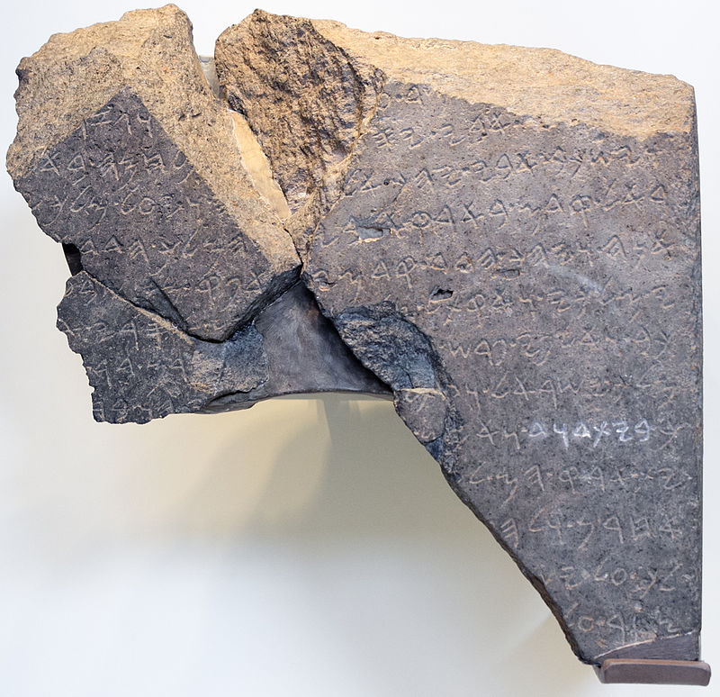

# Numerals/counting

> In order to comprehend Biblical Hebrew, we must be able to figure out numbers, with or without a dictionary, when we encounter them in the Bible


<!--Graphic or Quote -->

```{r, out.width = "300pt", fig.align='center'}
library(knitr)

```

Say something about the graphic or quote


## Seven Practical Points for Lesson xx {-}

1. The Biblical text always spells out numbers
2. Notes and footnotes use symbols for numbers
3. Be Familiar with Hebrew Ordinal Numbers - First through Tenth
4. Hebrew Cardinal Numbers
5. Digits 1 and 2 match the gender of the noun
6. Digits 3-10 take the opposite gender of the noun
7. Learn the Cardinal Numbers Above 10


### `Lesson Prayer` {-}

Lesson prayer

> scripture quotation


## Equipment Check {-}

```{r, out.width = "300pt", fig.align='center'}
library(knitr)
include_graphics("images/stopil.png")
```

Before continuing, can you describe the following concepts?

*


## The Biblical text always spells out numbers {#spp1}
## Notes and footnotes use symbols for numbers {#spp2}
## Be Familiar with Hebrew Ordinal Numbers - First through Tenth {#spp3}
## Point4
## Point5
## Point6
## Point7

## `Word Warm-up` {-}

[Click to open `Word Warm-up` video in a new tab](){target="_blank"}

<iframe width="768" height="432" src="" frameborder="0" allow="accelerometer; autoplay; clipboard-write; encrypted-media; gyroscope; picture-in-picture" allowfullscreen></iframe>

## `Verses Warm-up` {-}

[Click to open `Verses Warm-up` video in a new tab](){target="_blank"}

<iframe width="768" height="432" src="" frameborder="0" allow="accelerometer; autoplay; clipboard-write; encrypted-media; gyroscope; picture-in-picture" allowfullscreen></iframe>

## `Anki` {-}

* `Lesson xx A.Vocab`
* `Lesson xx B.Grammar` 
* `Lesson xx C.Verses`

## `Worksheets`: NameOfWorksheet {-}

<describe the worksheet>

[Name of worksheet](){target="_blank"}

## `Ruth Pursuit` {-}        

### Your Quest: {-}

1. Instruction#1 (Yellow)
2. Instruction#2 (Green)
3. Instruction3 (Light Blue)
4. Instruction4 (Pink)
5. Instruction5 (Light Grey)
6. Instruction6 (Red) <!--Try to use darker colors sparingly -->
7. instruction7 (Blue)

* [Blank copy of Ruth 1](https://drive.google.com/file/d/1qcfTKAlTJGChC2eYCMhSbY2w-ibzCcDV/view?usp=sharing){target="_blank"}
* [Ruth Pursuit Answer Key #xx](){target="_blank"}

## `Hebrew Quest Study Passage`: Numbers and Days of the Week {-}

1. Read through the passage on your own.
2. Using a [Blank copy of the passage](){target="_blank"}:
    1. Highlight any words you do not know and look them up in a [lexicon](https://holylanguage.com/resources-dictionaries.php){target="_blank"}.    
    2. Parse as many verbs as you can.
    3. Sketch out a translation.
3. Watch Izzy's _Hebrew Quest_ video below [(Click to open video in a new tab)](https://holylanguage.com/grammar-1.php){target="_blank"}
    1. How close was your translation?
    2. How did the Ruach HaQodesh speak to you?
4. Check your parsing against [this key](){target="_blank"}

<iframe width="768" height="432" src="https://www.youtube.com/embed/
MlfwNNuWgto?start=1675&end=2710
&rel=0&showinfo=0&autohide=1&autoplay=1" allow="accelerometer; autoplay; clipboard-write; encrypted-media; gyroscope; picture-in-picture" allowfullscreen>
</iframe>

## `Quest Quiz` {-}

[Open Quest Quiz #xx in a new window](){target="_blank"}

<iframe src="" width="800" height="600" frameborder="2" marginheight="0" marginwidth="0"></iframe>

## Claim your next `Twelve Tribes Badge`! {-}

Check to be sure you have have completed **all activities** through this lesson, then fill out the form below.

[Check to be sure you have completed all ACTIVities here](){target="_blank"}, complete the certification below, and your badge will be on its way!

<iframe src="" width="640" height="691" frameborder="0" marginheight="0" marginwidth="0"></iframe>

