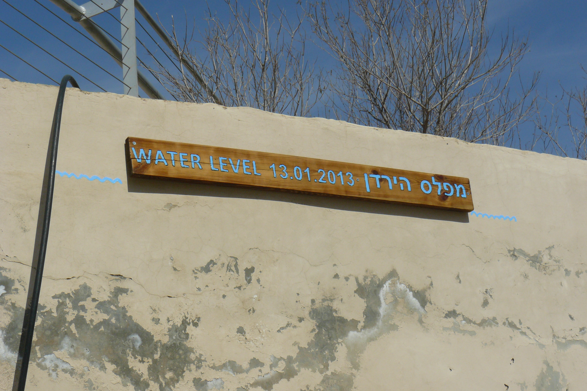

# (PART) Qal Stem {-}

# Introduction to Unit 3 {-}

::: {.infobox .sound}
<figure>
<audio
        id="myAudio"
        controls controlsList="nodownload"
        src="./images/03b.unit2intro.m4a">
            Your browser does not support the
            <code>audio</code> element.
    </audio>
<button onclick="setPlaySpeed25()" type="button">2.5x</button>
<button onclick="setPlaySpeed2()" type="button">2x</button>
<button onclick="setPlaySpeed15()" type="button">1.5x</button>
<button onclick="setPlaySpeed1()" type="button">1x</button>
<button onclick="setPlaySpeed075()" type="button">.75x</button>
<button onclick="setPlaySpeed05()" type="button">.5x</button>
<script>
var x = document.getElementById("myAudio");
function setPlaySpeed05() { 
    x.playbackRate = 0.5;
    x.play();
}
function setPlaySpeed075() { 
    x.playbackRate = 0.75;
    x.play();
} 
function setPlaySpeed1() { 
    x.playbackRate = 1;
     x.play();
}
function setPlaySpeed15() { 
    x.playbackRate = 1.5;
     x.play();
} 
function setPlaySpeed2() { 
    x.playbackRate = 2;
     x.play();
} 
function setPlaySpeed25() { 
    x.playbackRate = 2.5;
     x.play(); 
} 
</script> 
</figure>
:::

* Unit 3 represents a pivot point in this course
* From now through the end of the course, we will focus on verbs
* In Unit 3 we will be spending our time learning what is called the Qal verb stem in depth
* Then in Unit 4 we will learn the six so-called "derived" stems

We wanted to let you know of some changes:


1. Vowel Shorthand
2. $Pre$ = a diagnostic word-initial combination
3. Changes to Hebrew GRAMMAR Quest for Units 3 and 4
    1. No more quizzes!
    2. Study Verses
        * Cantillation marks added to study verses
        * Verses will be taken as a whole, versus split into smaller components
    3. OPTIONAL _Hebrew Quest_ Study Passage Translation


## Vowel Transliteration/Shorthand {-}

We will begin to use the vowel transliteration introduced in Lesson 2

::: {.box .info}

* Short Vowels (no marking): $A$ for Patach, $E$ for Seghol, $I$, Hireq, $O$ for Qamets Hatuf, and $U$, Qibbuts
* Long Vowels that are not letters (bar): $\bar A$ for Qamets, $\bar E$ for Tsere, and $\bar O$ for Holem
* Reduced Vowels (breve): $\breve A$ for Hateph Patach, $\breve E$ for Hateph Seghol, $\breve O$ = Hateph Qamets Hatuf
* Unchangeable Long Vowels (hat): $\hat E$ = Tsere+Yod^[Formal shorthand for Seghol+Yod is also $\hat E$ but for this course, we will only use $\hat E$ for Tsere+Yod.], $\hat I$ = Hireq_+Yod; $\hat O$ = Holem+Vav, and $\hat U$ = Shureq
* Additionally, we have the ending Qamets+He = $\hat A$, Vocal Sheva = $ə$, and $:$ for Silent Sheva^[Vocal Sheva has a "hurried" pronunciation, like the _a_ in _amuse_ or _Tina_. ə is the [international character for this sound](https://en.wikipedia.org/wiki/Mid_central_vowel){target="_blank"}. Silent Sheva has no pronunciation transliteration value.])

:::

## $Pre$ = Diagnostic Word-initial Combinations {-}

* A Hebrew strong verb conjugation, regardless of the stem, can usually be identified based on its initial combination of consonants, vowels, and from time-to-time, the presence of a Daghesh Forte
* For example, in Lesson 15, we will learn the "Imperfect Preformatives" (we'll describe what a preformative is a little later)
    * The 3ms and 3mp strong forms will always have:
        * Preformative consonant = Yod
        * $V_P = I$ (Hireq), and
        * $V_1 = \ :$ (Silent Sheva)
    * We can further shorten this by saying $Pre =$ <span class="he">יִקְ</span>, where ק represents $R_1$ of any strong verb
    * $Pre$ is not simply the verb's prefix or preformative, but the entire word-initial combination of preformatives, vowels, and possibly a Dagesh that can help us identify and translate a specific verb form

## Changes for Unit 3: No more quizzes! {-}

* The quizzes in Units 1 and 2 provided a checkpoint before proceeding to the next lesson
    * We wanted to make sure you had the essential components of the lesson
* At this stage of the course, we can dispense with the quizzes and leave it up to your judgment as to whether you are ready to proceed with the next lesson
* The overload workload is steadily increasing, and of course, the Anki reviews are growing (so be sure to keep up with daily reviews!)

## Changes for Unit 3: Changes to `Anki Study Verses` {-}

* In Unit 2, we split longer verses into two sections; starting with Unit 3, we're going to take it up a notch and have you review the entire study verse in one answer
* For Unit 3, we are also adding Cantillation Marks added to Study Verses
* Back in Lesson 2, we also referenced additional marking called cantillation marks
* These are the marks in addition to vowels and consonants we sometimes see in Hebrew
    * Here is the example we looked at from Genesis:

```{r, out.width = "600pt", fig.align='center'}
library(knitr)
include_graphics("images/02.Gen0109.png")
```

* Up until now, we have been using a simple accent mark whenever a Hebrew word has an accent on the second to last syllable
    * For example, <span class="he">נֶ֫גֶב</span>
    * While the Lessons and other materials will continue to use these simple accents, from now on, we will graduate to using the full set of Hebrew accents in our Study Verses and Workbook exercises
* Why do this?
    * When you read from a Tanach, you are much more likely to encounter the complete set of Hebrew accent marks
    * Becoming more comfortable with the Hebrew Bible includes having a basic familiarity with these additional marks
* Things to keep in mind:
    * There are over 20 different cantillation marks
    * We won't go into what each one means, but there are plenty of resources on the Internet if you are interested in digging deeper
    * Remember that a syllable can have only one vowel
    * Most often, there is only one cantillation mark per word - <u>where you see the mark is where the accent goes</u>
    * Occasionally, you will see a mark near the front or middle of the word, as well as a mark near the end of a word         
        * The first mark is a secondary accent
        * Remember, a primary Hebrew accent can ONLY be on the LAST or SECOND-TO-LAST syllable
* The vertical line | that can appear between two words can be ignored
* When in doubt, listen to Izzy's audio carefully as he reads each verse to determine where the accent goes

::: {.box .light}
If you see a mark that is not a vowel you recognize (such as an upside-down wishbone) or in the wrong place (such as a dot above a consonant instead of inside or below) it is a cantillation mark.

:::

::: {.box .info}
Trying to read with these marks can be visually distracting and overwhelming at first. With practice, you will get used to them.  Cantillation marks are part of the rich tradition of Biblical Hebrew passed down to us from many centuries ago.

:::

## Changes for Unit 3: OPTIONAL _Hebrew_ Quest Study Passage Translation {-}

* `Hebrew Quest Study Passages` are designed for those who seek more opportunities for additional Hebrew Bible reading and translating activity
* They also offer a method to simultaneously complete _Hebrew Quest_ and Hebrew GRAMMAR Quest
* Completion of this activity may require a significant time investment to complete
    * For this reason, completing the `Hebrew Quest Study Passage Track` is not required to earn any Hebrew GRAMMAR Quest `Badges`, `Certificates`, or the `Graduation Diploma`
* Whether you have already completed _Hebrew Quest_ or not, this activity is sure to significantly expand your Hebrew reading skills
* We will start off slowly with the verses from the Proverbs study
* Then we will go in _Hebrew Quest_ order, beginning with Genesis 1 (_Hebrew Quest_ Lesson 17) through 1 Kings 18 (_Hebrew Quest_ Lesson 40)
* Here is what we want you to do in these Study Passages activities:
    1. Download or print the applicable study passage document
    2. Read the passage straight through to gain an overview
    3. Read again, but this time, compose a translation
        1. First, see how much you can do without a reference
        2. Then, look up any words you don't know in a lexicon
    4. Watch the _Hebrew Quest_ video where Izzy reads and breaks down the passage, often with spiritual insights^[Note: Izzy intentionally speaks very slowly, so as you advance in Hebrew, you may wish to increase the speed of the YouTube video].
        * As you are watching, compare your translation with Izzy's explanation
        * How did you do?  Can you see how much you are learning?
        * For Tanach passages, [this website](https://scholarsgateway.com/search/WLC-KJV%201611-ESV/Genesis/1:1-5) has information on parts of speech and PGN information when you hover over a word
    5. Ask what the Spirit of Holiness, the Ruach HaKodesh, is teaching you

## Lessons 13-16 are critical! {-}


```{r, out.width = "400pt", fig.align='center', fig.cap="Jordan River High Water Sign. The sign says 'Level of the Jordan.'  Photo by Chris Flanagan, taken 2/12/2013."}


``` 


* The image above is of the Jordan River baptismal area in Israel near Jericho - it was taken less than a month after flooding of the area
* Lessons 13-16 could be considered the "high-water mark" of the course
    * There will be a lot of details to digest as we talk about the two most critical verb forms in the Bible, the Qal Perfect and the Qal Imperfect
    * YOU MUST MASTER the material in these four chapters
    * Doing so will make the rest of the course much smoother, and more importantly, this will help you better understand your Hebrew Bible
* The "high water" will start to recede a little starting with Lesson 17
* The rest of the course from Lessons 17-35 build upon Chapters 13-16


## _Hebrew Quest_ Verb Summary Lecture {-}

Although this three-minute _Hebrew Quest_ lecture comes at the very end of Izzy's discussion on Hebrew verbs, we wanted to share it with you here.  Izzy offers tremendous encouragement for you, which you can apply throughout your verbal journey. 
    
<div class="container">
<iframe class="responsive-iframe" src="https://www.youtube.com/embed/hWmwyosdP-s?start=3343&end=3512&rel=0&showinfo=0&autohide=1&autoplay=1" frameborder="0"></iframe>
</div>

[Click to open video in a new tab](https://youtu.be/hWmwyosdP-s?t=3343){target="_blank"}

Start: 55:43  
End:  58:32

::: {.box .map}
* Hang in there and keep going!  
* We are studying grammar to draw closer to the Holy One!
* Slow and steady wins your Hebrew verbal race!

Now, let's get to Hebrew Verbs!

:::
