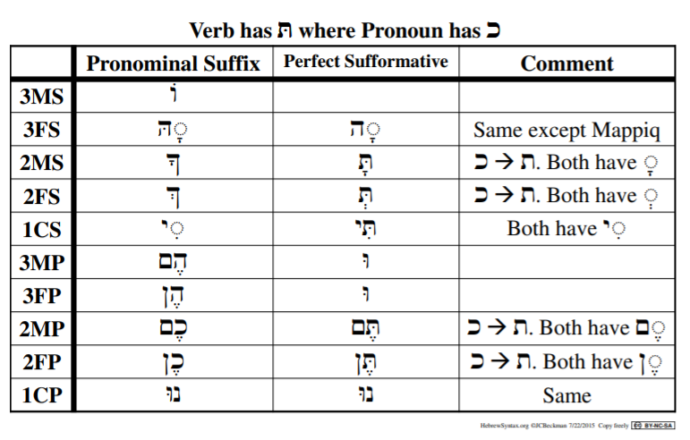
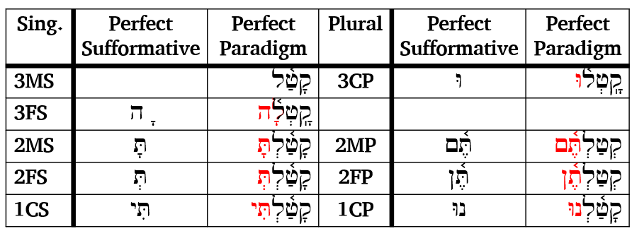
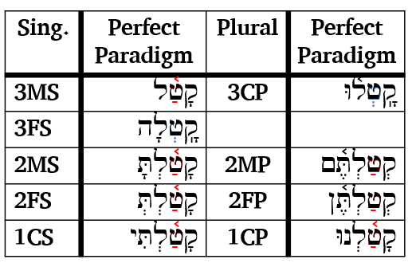
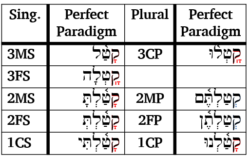

# Qal Perfect - Strong Verbs {.QP-s}

::: {.infobox .sound}
<figure>
<audio id="myAudio" controls controlsList="nodownload" src="./images/13.intro.m4a">
            Your browser does not support the <code>audio</code> element.</audio>
<button onclick="setPlaySpeed25()" type="button">2.5x</button> <button onclick="setPlaySpeed2()" type="button">2x</button> <button onclick="setPlaySpeed15()" type="button">1.5x</button> <button onclick="setPlaySpeed1()" type="button">1x</button> <button onclick="setPlaySpeed075()" type="button">.75x</button> <button onclick="setPlaySpeed05()" type="button">.5x</button> 
<script>
var x = document.getElementById("myAudio");
function setPlaySpeed05() { 
    x.playbackRate = 0.5;
    x.play();
}
function setPlaySpeed075() { 
    x.playbackRate = 0.75;
    x.play();
} 
function setPlaySpeed1() { 
    x.playbackRate = 1;
     x.play();
}
function setPlaySpeed15() { 
    x.playbackRate = 1.5;
     x.play();
} 
function setPlaySpeed2() { 
    x.playbackRate = 2;
     x.play();
} 
function setPlaySpeed25() { 
    x.playbackRate = 2.5;
     x.play(); 
} 
</script> 
</figure>
:::

> Over 2/3 of all verbs in the Hebrew Bible are in the Qal stem.  To understand Biblical Hebrew, we must be able to translate Qal verbs.

While our focus is not on writing Biblical Hebrew, we need to be able to write the details on the Qal strong verb paradigms. This will make it easier to recognize Qal weak and non-Qal verbs.  This lesson will begin with the Perfect conjugation.

::: {.box .map}
LESSON ITINERARY

1. Qal is simple action, active voice; Perfect is completed action or state
1. Components of the Qal Perfect Strong Paradigm
    1. $V_S$ is accented in Finite verbs
    1. A Sheva precedes a Finite verb sufformative 
    1. The Perfect Sufformatives
    1. The Qal Perfect Vowels
1. Building the Qal Perfect Paradigm
1. Deviations from the Strong Paradigm
:::

::: {.box .stop}
EQUIPMENT CHECK

Before continuing, make sure you understand the $R_n$ and the $V_n$ nomenclature, including $V_S$
:::


## First Thought {-}

::: {.infobox .sound}
<figure>
<audio id="myAudio" controls controlsList="nodownload" src="./images/13.08.2chr3421.mp3">
            Your browser does not support the <code>audio</code> element.</audio>
<button onclick="setPlaySpeed25()" type="button">2.5x</button> <button onclick="setPlaySpeed2()" type="button">2x</button> <button onclick="setPlaySpeed15()" type="button">1.5x</button> <button onclick="setPlaySpeed1()" type="button">1x</button> <button onclick="setPlaySpeed075()" type="button">.75x</button> <button onclick="setPlaySpeed05()" type="button">.5x</button> 
<script>
var x = document.getElementById("myAudio");
function setPlaySpeed05() { 
    x.playbackRate = 0.5;
    x.play();
}
function setPlaySpeed075() { 
    x.playbackRate = 0.75;
    x.play();
} 
function setPlaySpeed1() { 
    x.playbackRate = 1;
     x.play();
}
function setPlaySpeed15() { 
    x.playbackRate = 1.5;
     x.play();
} 
function setPlaySpeed2() { 
    x.playbackRate = 2;
     x.play();
} 
function setPlaySpeed25() { 
    x.playbackRate = 2.5;
     x.play(); 
} 
</script> 
</figure>
:::

### <span class="he">לֹא־שָׁמְר֤וּ אֲבוֹתֵ֙ינוּ֙ אֶת־דְּבַ֣ר יְהוָ֔ה </span> {-}

*Our fathers did not keep the word of Adonai (2 Chronicles 34:21)*

<span class="he">שָׁמַר</span> means to guard or keep, in the sense of obeying.  It is a verb that frequently occurs in the Hebrew Bible. 

In <span class="he">לֹא־שָׁמְרוּ</span>, the word לֹא serves to negate the verb it precedes.  Literally, this might be "not they kept", but we would say "they did not keep" in English.

Every day, and frequently throughout each day, we have two choices.  We can keep His word, or we can ignore His word.  

Let us strive to have it be told of all of us, <span class="he">שָׁמְרוּ אֶת־דְּבַר יְהוָה </span>, "they KEPT the word of Adonai."


```{r, out.width = "600pt", fig.align='center', fig.cap="Mt Gerezim, Shechem, Mt. Ebal from east.  In Deuteronomy 11, Moses instructs that when Israel enters the land, she is to read the blessings from Mt. Gerezim and the curses from not following His word from Mt. Ebal. Today, Shechem is also known as the Arab city of Nablus. Courtesy of the [Pictorial Library of Bible Lands](https://www.bibleplaces.com)"}


``` 


## _Hebrew Quest_ Qal Perfect Lecture

View this 3-minute overview video from _Hebrew Quest_ on Hebrew Verbs.  We will break down the concepts Izzy discusses as we progress through this lesson.  Note: the terms "afformatives" used by Izzy, and "sufformatives" used by <u>Basics of Biblical Hebrew</u> are synonymous.

<div class="container">
<iframe class="responsive-iframe" src="https://www.youtube.com/embed/
hfu4gjNo2K4?start=2846&end=3062&rel=0&showinfo=0&autohide=1&autoplay=1" frameborder="0"></iframe>
</div>

[Click to open video in a new tab](https://youtu.be/hfu4gjNo2K4?start=2846){target="_blank"}

Start: 47:26
End: 51:02

##  Qal Stem is Simple action, Active voice

::: {.infobox .sound}
<figure>
<audio id="myAudio" controls controlsList="nodownload" src="./images/13.2.m4a">
            Your browser does not support the <code>audio</code> element.</audio>
<button onclick="setPlaySpeed25()" type="button">2.5x</button> <button onclick="setPlaySpeed2()" type="button">2x</button> <button onclick="setPlaySpeed15()" type="button">1.5x</button> <button onclick="setPlaySpeed1()" type="button">1x</button> <button onclick="setPlaySpeed075()" type="button">.75x</button> <button onclick="setPlaySpeed05()" type="button">.5x</button> 
<script>
var x = document.getElementById("myAudio");
function setPlaySpeed05() { 
    x.playbackRate = 0.5;
    x.play();
}
function setPlaySpeed075() { 
    x.playbackRate = 0.75;
    x.play();
} 
function setPlaySpeed1() { 
    x.playbackRate = 1;
     x.play();
}
function setPlaySpeed15() { 
    x.playbackRate = 1.5;
     x.play();
} 
function setPlaySpeed2() { 
    x.playbackRate = 2;
     x.play();
} 
function setPlaySpeed25() { 
    x.playbackRate = 2.5;
     x.play(); 
} 
</script> 
</figure>
:::

| |Active Voice| Passive Voice | Reflexive Voice
|:- |:- |:- |:-
Simple Action	| __QAL__ | Niphal | (Niphal)
Intensive	| Piel | Pual | Hitpael
Cause an Action	|Hiphil | Hophal

*  Remember this table is very high-level and perhaps over-simplified; but, it is a good starting place for understanding the meaning each stem
*  Qal is the primary Hebrew stem
*  The other six major stems are said to be "derived" from the Qal stem, hence the name "derived stems"

## The Perfect Conjugation is completed action or a state as a whole

::: {.infobox .sound}
<figure>
<audio id="myAudio" controls controlsList="nodownload" src="./images/13.3.m4a">
            Your browser does not support the <code>audio</code> element.</audio>
<button onclick="setPlaySpeed25()" type="button">2.5x</button> <button onclick="setPlaySpeed2()" type="button">2x</button> <button onclick="setPlaySpeed15()" type="button">1.5x</button> <button onclick="setPlaySpeed1()" type="button">1x</button> <button onclick="setPlaySpeed075()" type="button">.75x</button> <button onclick="setPlaySpeed05()" type="button">.5x</button> 
<script>
var x = document.getElementById("myAudio");
function setPlaySpeed05() { 
    x.playbackRate = 0.5;
    x.play();
}
function setPlaySpeed075() { 
    x.playbackRate = 0.75;
    x.play();
} 
function setPlaySpeed1() { 
    x.playbackRate = 1;
     x.play();
}
function setPlaySpeed15() { 
    x.playbackRate = 1.5;
     x.play();
} 
function setPlaySpeed2() { 
    x.playbackRate = 2;
     x.play();
} 
function setPlaySpeed25() { 
    x.playbackRate = 2.5;
     x.play(); 
} 
</script> 
</figure>
:::

* In translating, we will most often use the simple English past tense
    * For example, "she studied"
* It is commonly taught that the Hebrew perfect is equivalent to the English past tense
    * This is a generality; it is often true, but it is not always true
    * Other translations may be appropriate depending on the context
        * Present perfect: "she has studied"
        * Past perfect: "she had studied"
        * Future perfect: "she will have studied"
* Stative verbs describe a state of being; these verbs are also Perfect
    * English present is often a better translation: She is wise, she knows, she loves
    * English past might also be appropriate: she was wise
    * In a few sections, we will learn that in Hebrew, stative verbs are sometimes spelled differently
    
::: {.box .info}
The Hebrew perfect conjugation describes an action or a state of being as a whole, _not as a process_

I.e., "she was studying" is an incomplete process, but "she had studied" is completed action  
:::

## Preformatives and Sufformatives

::: {.infobox .sound}
<figure>
<audio id="myAudio" controls controlsList="nodownload" src="./images/13.4.m4a">
            Your browser does not support the <code>audio</code> element.</audio>
<button onclick="setPlaySpeed25()" type="button">2.5x</button> <button onclick="setPlaySpeed2()" type="button">2x</button> <button onclick="setPlaySpeed15()" type="button">1.5x</button> <button onclick="setPlaySpeed1()" type="button">1x</button> <button onclick="setPlaySpeed075()" type="button">.75x</button> <button onclick="setPlaySpeed05()" type="button">.5x</button> 
<script>
var x = document.getElementById("myAudio");
function setPlaySpeed05() { 
    x.playbackRate = 0.5;
    x.play();
}
function setPlaySpeed075() { 
    x.playbackRate = 0.75;
    x.play();
} 
function setPlaySpeed1() { 
    x.playbackRate = 1;
     x.play();
}
function setPlaySpeed15() { 
    x.playbackRate = 1.5;
     x.play();
} 
function setPlaySpeed2() { 
    x.playbackRate = 2;
     x.play();
} 
function setPlaySpeed25() { 
    x.playbackRate = 2.5;
     x.play(); 
} 
</script> 
</figure>
:::


* In Lesson 12, we introduced the concept of preformatives and sufformatives
* These are unique verbal beginnings and endings that indicate person, gender, and number
* The Perfect has a set of "perfect sufformatives"
    * Only the 3ms does not have a perfect sufformative
    * We will learn the sufformatives for the remaining PGN forms in the next section
* The perfect sufformatives are the same across all verb stems, so what you learn for the Qal can be applied to the derived stems (good news!)
* The perfect does not have preformatives (more good news!)

::: {.box .light}
A verb with no preformative, and a perfect sufformative will be diagnostic of a Perfect conjugation
:::

## The Perfect Sufformatives Intro

::: {.infobox .sound}
<figure>
<audio id="myAudio" controls controlsList="nodownload" src="./images/13.5.m4a">
            Your browser does not support the <code>audio</code> element.</audio>
<button onclick="setPlaySpeed25()" type="button">2.5x</button> <button onclick="setPlaySpeed2()" type="button">2x</button> <button onclick="setPlaySpeed15()" type="button">1.5x</button> <button onclick="setPlaySpeed1()" type="button">1x</button> <button onclick="setPlaySpeed075()" type="button">.75x</button> <button onclick="setPlaySpeed05()" type="button">.5x</button> 
<script>
var x = document.getElementById("myAudio");
function setPlaySpeed05() { 
    x.playbackRate = 0.5;
    x.play();
}
function setPlaySpeed075() { 
    x.playbackRate = 0.75;
    x.play();
} 
function setPlaySpeed1() { 
    x.playbackRate = 1;
     x.play();
}
function setPlaySpeed15() { 
    x.playbackRate = 1.5;
     x.play();
} 
function setPlaySpeed2() { 
    x.playbackRate = 2;
     x.play();
} 
function setPlaySpeed25() { 
    x.playbackRate = 2.5;
     x.play(); 
} 
</script> 
</figure>
:::

* As Izzy said in the opening video segment, the perfect sufformatives are related to the pronominal suffixes, which in turn are related to the personal pronouns in many cases
* The table below shows the perfect sufformatives in the middle column  
* Note how the 1st person, 2nd person, and 3fs forms are similar to the respective pronominal suffix
* 2MP and 2FP are called "Heavy Sufformatives" because, as we will learn, they draw the accent


```{r, out.width = "700pt", fig.align='center'}


``` 


## Steps to Build a Qal Perfect Verb {-}

::: {.infobox .sound}
<figure>
<audio id="myAudio" controls controlsList="nodownload" src="./images/13.steps.m4a">
            Your browser does not support the <code>audio</code> element.</audio>
<button onclick="setPlaySpeed25()" type="button">2.5x</button> <button onclick="setPlaySpeed2()" type="button">2x</button> <button onclick="setPlaySpeed15()" type="button">1.5x</button> <button onclick="setPlaySpeed1()" type="button">1x</button> <button onclick="setPlaySpeed075()" type="button">.75x</button> <button onclick="setPlaySpeed05()" type="button">.5x</button> 
<script>
var x = document.getElementById("myAudio");
function setPlaySpeed05() { 
    x.playbackRate = 0.5;
    x.play();
}
function setPlaySpeed075() { 
    x.playbackRate = 0.75;
    x.play();
} 
function setPlaySpeed1() { 
    x.playbackRate = 1;
     x.play();
}
function setPlaySpeed15() { 
    x.playbackRate = 1.5;
     x.play();
} 
function setPlaySpeed2() { 
    x.playbackRate = 2;
     x.play();
} 
function setPlaySpeed25() { 
    x.playbackRate = 2.5;
     x.play(); 
} 
</script> 
</figure>
:::
1. Add perfect sufformative
2. Put a Sheva before the sufformative
3. Add a Daghesh Lene to ת , since it is a בגד כפת letter, when it follows a Sheva
4. \(V_S = A\) (Patach) in the Qal Perfect Strong paradigm
5. Accent $V_S$, if possible
6. $V _1 = \bar A$ in the Qal Perfect Strong Paradigm
7. Optionally, add a Metheg mark to denote $\bar A$ (Qamets) from $O$ (Qamets Hatuf)

```{r, out.width = "600pt", fig.align='center'}


``` 

## Step 1: Add the Perfect Sufformatives

::: {.infobox .sound}
<figure>
<audio id="myAudio" controls controlsList="nodownload" src="./images/13.6.m4a">
            Your browser does not support the <code>audio</code> element.</audio>
<button onclick="setPlaySpeed25()" type="button">2.5x</button> <button onclick="setPlaySpeed2()" type="button">2x</button> <button onclick="setPlaySpeed15()" type="button">1.5x</button> <button onclick="setPlaySpeed1()" type="button">1x</button> <button onclick="setPlaySpeed075()" type="button">.75x</button> <button onclick="setPlaySpeed05()" type="button">.5x</button> 
<script>
var x = document.getElementById("myAudio");
function setPlaySpeed05() { 
    x.playbackRate = 0.5;
    x.play();
}
function setPlaySpeed075() { 
    x.playbackRate = 0.75;
    x.play();
} 
function setPlaySpeed1() { 
    x.playbackRate = 1;
     x.play();
}
function setPlaySpeed15() { 
    x.playbackRate = 1.5;
     x.play();
} 
function setPlaySpeed2() { 
    x.playbackRate = 2;
     x.play();
} 
function setPlaySpeed25() { 
    x.playbackRate = 2.5;
     x.play(); 
} 
</script> 
</figure>
:::

* The table below lists the perfect sufformatives
    * Stand-alone
    * Affixed to the <span class="he">קטל</span> paradigm verb
* Note 3ms does not have a perfect sufformative but all the other forms do
* Since 3mp and 3fp are the same in the Perfect, we simply say "3cp" - Third-person, common, plural

```{r, out.width = "700pt", fig.align='center'}


``` 

::: {.box .map}
GOOD NEWS

As you continue with your Hebrew GRAMMAR Quest into Unit 4, you will learn these sufformatives REMAIN THE SAME throughout all seven Perfect conjugations.
:::

<figure>
    <figcaption>Listen to the Qal Perfect Strong Paradigm from _Hebrew Quest_</figcaption>
    <audio
        controls controlsList="nodownload"
        src="./images/13.Qal_perfect.mp3">
            Your browser does not support the
            <code>audio</code> element.
    </audio>
</figure>

## Step 2: Put a Sheva before the Finite Sufformative

::: {.infobox .sound}
<figure>
<audio id="myAudio" controls controlsList="nodownload" src="./images/13.7.m4a">
            Your browser does not support the <code>audio</code> element.</audio>
<button onclick="setPlaySpeed25()" type="button">2.5x</button> <button onclick="setPlaySpeed2()" type="button">2x</button> <button onclick="setPlaySpeed15()" type="button">1.5x</button> <button onclick="setPlaySpeed1()" type="button">1x</button> <button onclick="setPlaySpeed075()" type="button">.75x</button> <button onclick="setPlaySpeed05()" type="button">.5x</button> 
<script>
var x = document.getElementById("myAudio");
function setPlaySpeed05() { 
    x.playbackRate = 0.5;
    x.play();
}
function setPlaySpeed075() { 
    x.playbackRate = 0.75;
    x.play();
} 
function setPlaySpeed1() { 
    x.playbackRate = 1;
     x.play();
}
function setPlaySpeed15() { 
    x.playbackRate = 1.5;
     x.play();
} 
function setPlaySpeed2() { 
    x.playbackRate = 2;
     x.play();
} 
function setPlaySpeed25() { 
    x.playbackRate = 2.5;
     x.play(); 
} 
</script> 
</figure>
:::


* This is a general rule that results in a Sheva under $R_3$ or $R_2$
* This only applies to finite verbs (Perfect, Imperfect, Volitional)
* Take a look at the Qal Perfect Paradigm table again and note how there is a sheva next to the sufformative
* 3MS has no sufformative so it has no sheva
* 3CP and 3FS looks a little different because those sufformatives both start with a vowel
    * The ל already has an associated vowel, Shureq (3CP)and Qamets+Hei (3FS)
    * A consonant cannot have more than one vowel
    * For these two PGN forms, since the Sheva can't go under $R_3$, it shifts to $R_2$ (and displaces the Patach in $V_2$)
    
```{r, out.width = "700pt", fig.align='center'}


``` 
    
::: {.box .caution}
The Sheva is rejected in the following circumstances:

* A Sheva does not replace an unchangeable long vowel
* A Sheva does not replace $V_1$ of the Qal Perfect (and only the Qal Perfect)
* When $R_3$ is <span class="he">א</span>, the א quiesces (generally resulting in Compensatory Lengthening of $V_2$)

The Sheva may either be silent or vocal, depending on the rules we learned in Lesson 3
:::

## Step 3: Add Daghesh Lene to תּ

::: {.infobox .sound}
<figure>
<audio id="myAudio" controls controlsList="nodownload" src="./images/13.8.m4a">
            Your browser does not support the <code>audio</code> element.</audio>
<button onclick="setPlaySpeed25()" type="button">2.5x</button> <button onclick="setPlaySpeed2()" type="button">2x</button> <button onclick="setPlaySpeed15()" type="button">1.5x</button> <button onclick="setPlaySpeed1()" type="button">1x</button> <button onclick="setPlaySpeed075()" type="button">.75x</button> <button onclick="setPlaySpeed05()" type="button">.5x</button> 
<script>
var x = document.getElementById("myAudio");
function setPlaySpeed05() { 
    x.playbackRate = 0.5;
    x.play();
}
function setPlaySpeed075() { 
    x.playbackRate = 0.75;
    x.play();
} 
function setPlaySpeed1() { 
    x.playbackRate = 1;
     x.play();
}
function setPlaySpeed15() { 
    x.playbackRate = 1.5;
     x.play();
} 
function setPlaySpeed2() { 
    x.playbackRate = 2;
     x.play();
} 
function setPlaySpeed25() { 
    x.playbackRate = 2.5;
     x.play(); 
} 
</script> 
</figure>
:::

* Whenever there is a  בגדכפת letter following a Sheva, that letter will usually take a Daghesh Lene
* Because of Step 2, when we added the sheva, we must add a Daghesh Lene to the sufformatives that have a ת
* Look again at our table of sufformatives and note the 2nd person forms as well as 1CS
```{r, out.width = "700pt", fig.align='center'}


``` 

## Step 4: $V_S = A$ (Patach) in the QP Strong

::: {.infobox .sound}
<figure>
<audio id="myAudio" controls controlsList="nodownload" src="./images/13.9.m4a">
            Your browser does not support the <code>audio</code> element.</audio>
<button onclick="setPlaySpeed25()" type="button">2.5x</button> <button onclick="setPlaySpeed2()" type="button">2x</button> <button onclick="setPlaySpeed15()" type="button">1.5x</button> <button onclick="setPlaySpeed1()" type="button">1x</button> <button onclick="setPlaySpeed075()" type="button">.75x</button> <button onclick="setPlaySpeed05()" type="button">.5x</button> 
<script>
var x = document.getElementById("myAudio");
function setPlaySpeed05() { 
    x.playbackRate = 0.5;
    x.play();
}
function setPlaySpeed075() { 
    x.playbackRate = 0.75;
    x.play();
} 
function setPlaySpeed1() { 
    x.playbackRate = 1;
     x.play();
}
function setPlaySpeed15() { 
    x.playbackRate = 1.5;
     x.play();
} 
function setPlaySpeed2() { 
    x.playbackRate = 2;
     x.play();
} 
function setPlaySpeed25() { 
    x.playbackRate = 2.5;
     x.play(); 
} 
</script> 
</figure>
:::

* For QP, $V_2$ _prefers_ Patach 
* For strong verbs, $V_S = V_2$
    * So we could either say "$V_S$ for Qal Perfect Strong equals Patach"
    * Or we could use formula shorthand and say, "Qal $V_S = A$", since "A" is our shorthand for a short A vowel, i.e., Patach
* In 3cp and 3fs, the Sheva of the perfect sufformative goes in $V_2$

```{r, out.width = "700pt", fig.align='center'}


``` 

::: {.box .caution}
EXCEPTIONS

* The $V_S$ can change based on other grammar rules, for example, when the vowel must reduce to a Sheva/Reduced Vowel
* Some stative verbs can also take a Tsere or Holem in $V_2$ (see "Stative Verbs..." section in this Lesson)

:::
    
## Looking ahead: each stem will have a specific $V_S$ Formula {-}

::: {.infobox .sound}
<figure>
<audio id="myAudio2" controls controlsList="nodownload" src="./images/13.9.1.m4a">
            Your browser does not support the <code>audio</code> element.</audio>
<button onclick="setPlaySpeed25()" type="button">2.5x</button> <button onclick="setPlaySpeed2()" type="button">2x</button> <button onclick="setPlaySpeed15()" type="button">1.5x</button> <button onclick="setPlaySpeed1()" type="button">1x</button> <button onclick="setPlaySpeed075()" type="button">.75x</button> <button onclick="setPlaySpeed05()" type="button">.5x</button> 
<script>
var x = document.getElementById("myAudio2");
function setPlaySpeed05() { 
    x.playbackRate = 0.5;
    x.play();
}
function setPlaySpeed075() { 
    x.playbackRate = 0.75;
    x.play();
} 
function setPlaySpeed1() { 
    x.playbackRate = 1;
     x.play();
}
function setPlaySpeed15() { 
    x.playbackRate = 1.5;
     x.play();
} 
function setPlaySpeed2() { 
    x.playbackRate = 2;
     x.play();
} 
function setPlaySpeed25() { 
    x.playbackRate = 2.5;
     x.play(); 
} 
</script> 
</figure>
:::


* As we progress through the verbs, each major stem will end up with a formula that looks something like this: 

$$V_{S} =  Î[A] \sim  Î(Ē)$$

* This is probably complete gibberish to you right now!
* As we get into Unit 4, this formula (in combination with the $Pre$ pattern) will save you hours of paradigm memorization of the derived stems
* You will only need to memorize the Qal paradigms, then apply this formula to the other stems
* So let's start to build this formula for the Qal:

$$V_{S} = A \sim$$

* In the formula, $A$ refers to Patach
* This formula is telling you that the Stem Vowel of the Perfect Conjugation _prefers_ Patach
* The _Imperfect_ Stem Vowel will be to the right of the $\sim$ mark - we'll address this in Lesson 15

            
## Step 5: $V_S$ is accented in Finite verbs

::: {.infobox .sound}
<figure>
<audio id="myAudio" controls controlsList="nodownload" src="./images/13.10.m4a">
            Your browser does not support the <code>audio</code> element.</audio>
<button onclick="setPlaySpeed25()" type="button">2.5x</button> <button onclick="setPlaySpeed2()" type="button">2x</button> <button onclick="setPlaySpeed15()" type="button">1.5x</button> <button onclick="setPlaySpeed1()" type="button">1x</button> <button onclick="setPlaySpeed075()" type="button">.75x</button> <button onclick="setPlaySpeed05()" type="button">.5x</button> 
<script>
var x = document.getElementById("myAudio");
function setPlaySpeed05() { 
    x.playbackRate = 0.5;
    x.play();
}
function setPlaySpeed075() { 
    x.playbackRate = 0.75;
    x.play();
} 
function setPlaySpeed1() { 
    x.playbackRate = 1;
     x.play();
}
function setPlaySpeed15() { 
    x.playbackRate = 1.5;
     x.play();
} 
function setPlaySpeed2() { 
    x.playbackRate = 2;
     x.play();
} 
function setPlaySpeed25() { 
    x.playbackRate = 2.5;
     x.play(); 
} 
</script> 
</figure>
:::
* As we introduced in Lesson 12, verbs that have "person" designation are called Finite verbs
    * Perfect, Imperfect, Imperative, Cohortative, Jussive are FINITE
    * Infinitive Construct, Infinitive Absolute, Participle are NON-FINITE because they do not have "person"
* The $V_S$ is accented in Finite verbs, when possible
    * As we said in the previous lesson, $V_S$ usually = $V_2$ 
        * In <span class="he">קָטַל</span> $V_S = A$ (Patach)
    * If $R_2$ is a vowel letter, then $V_S$ = $V_1$
        * In <span class="he">קוּם</span> $V_S = \hat U$ (Shuruq)
    * If $R_2$ disappears, then $V_S$ = $V_1$ 
        * In <span class="he">קָם</span> $V_S = \bar A$ (Qamets)
* Take a look at this table again and note where the accent lands:

```{r, out.width = "500pt", fig.align='center'}


``` 

::: {.box .caution}
EXCEPTIONS

* When $V_S$ is a Sheva or Hateph vowel:
    * Sheva/reduced vowels _never_ take an accent
    * In the Perfect, we will see this in QP3fs and QP3cp
* When the verb has a "heavy sufformative"
    * A heavy sufformative takes the accent
    * There are two heavy sufformatives in Hebrew:  2mp - תֶּ֫ם and 2fp - תֶּ֫ן
* When the verb has a pronominal suffix (Lesson 19)
* When $V_S$ is not one of the final two syllables

:::


## Step 6: $V_1 = \bar A$ (Qamets) in the Qal Perfect Strong Paradigm

::: {.infobox .sound}
<figure>
<audio id="myAudio" controls controlsList="nodownload" src="./images/13.11.m4a">
            Your browser does not support the <code>audio</code> element.</audio>
<button onclick="setPlaySpeed25()" type="button">2.5x</button> <button onclick="setPlaySpeed2()" type="button">2x</button> <button onclick="setPlaySpeed15()" type="button">1.5x</button> <button onclick="setPlaySpeed1()" type="button">1x</button> <button onclick="setPlaySpeed075()" type="button">.75x</button> <button onclick="setPlaySpeed05()" type="button">.5x</button> 
<script>
var x = document.getElementById("myAudio");
function setPlaySpeed05() { 
    x.playbackRate = 0.5;
    x.play();
}
function setPlaySpeed075() { 
    x.playbackRate = 0.75;
    x.play();
} 
function setPlaySpeed1() { 
    x.playbackRate = 1;
     x.play();
}
function setPlaySpeed15() { 
    x.playbackRate = 1.5;
     x.play();
} 
function setPlaySpeed2() { 
    x.playbackRate = 2;
     x.play();
} 
function setPlaySpeed25() { 
    x.playbackRate = 2.5;
     x.play(); 
} 
</script> 
</figure>
:::

* There are other characteristics of the Qal perfect paradigm that will help us when we read the Bible
* $V_1 = \bar A$ (Qamets) almost always
* Exception: as we learned way back in this course, an unaccented long vowel in an open propretonic syllable will undergo propretonic reduction
    * When this happens, you will see a Vocal Sheva instead of Qamets
    * Because we can identify propretonic reduction, we will be able to deduce that $V_1$ used to be a long vowel - and if it's a Qal verb, you'll know it used to be a Qamets
* Study the chart below showing $V_1$
    * The vertical line in 3FS and 3CP is called a "metheg" and is used to distinguish $\bar A$ (Qamets) from $O$ (Qamets Hatuf) when followed by a Sheva
    * Note 2MP and 2FP have undergone propretonic reduction and have $ə$ (Vocal Sheva) instead of $\bar A$
    
```{r, out.width = "700pt", fig.align='center'}


``` 

## Looking ahead: Each Stem and Conjugation will have a diagnostic $Pre =$ Formula {-}


::: {.infobox .sound}
<figure>
<audio id="myAudio2" controls controlsList="nodownload" src="./images/13.11.1.m4a">
            Your browser does not support the <code>audio</code> element.</audio>
<button onclick="setPlaySpeed25()" type="button">2.5x</button> <button onclick="setPlaySpeed2()" type="button">2x</button> <button onclick="setPlaySpeed15()" type="button">1.5x</button> <button onclick="setPlaySpeed1()" type="button">1x</button> <button onclick="setPlaySpeed075()" type="button">.75x</button> <button onclick="setPlaySpeed05()" type="button">.5x</button> 
<script>
var x = document.getElementById("myAudio2");
function setPlaySpeed05() { 
    x.playbackRate = 0.5;
    x.play();
}
function setPlaySpeed075() { 
    x.playbackRate = 0.75;
    x.play();
} 
function setPlaySpeed1() { 
    x.playbackRate = 1;
     x.play();
}
function setPlaySpeed15() { 
    x.playbackRate = 1.5;
     x.play();
} 
function setPlaySpeed2() { 
    x.playbackRate = 2;
     x.play();
} 
function setPlaySpeed25() { 
    x.playbackRate = 2.5;
     x.play(); 
} 
</script> 
</figure>
:::


* HGQ SHORTHAND: $Pre$ = Strong Form Diagnostic Word-initial Sequence
* Each of the stems/conjugations has a distinctive combination of consonants, vowels, and occasionally Daghesh Forte marks the first one or two syllables of a given verb
* This serves to make the strong form of the verb easy to differentiate from the other stems
* We will call this diagnostic sequence "$Pre$"
    * Saying "diagnostic word-initial sequence of consonants and vowels" would get tiresome!
* For Qal Perfect (QP), $Pre =$ <span class="he">קָ</span>
    * ק represents any strong letter in $R_1$ 
    * This means the distinctive word-initial sequence of a <u>Q</u>al <u>P</u>erfect verb is no prefix/preformative and a Qamets in $V_1$
    
::: {.box .map}
Qal Perfect Strong $Pre =$ <span class="he">קָ</span>
:::

## Step 7: OPTIONAL - Add a Metheg mark to $V_1$ 3FS and 3CP 

::: {.infobox .sound}
<figure>
<audio id="myAudio" controls controlsList="nodownload" src="./images/13.12.m4a">
            Your browser does not support the <code>audio</code> element.</audio>
<button onclick="setPlaySpeed25()" type="button">2.5x</button> <button onclick="setPlaySpeed2()" type="button">2x</button> <button onclick="setPlaySpeed15()" type="button">1.5x</button> <button onclick="setPlaySpeed1()" type="button">1x</button> <button onclick="setPlaySpeed075()" type="button">.75x</button> <button onclick="setPlaySpeed05()" type="button">.5x</button> 
<script>
var x = document.getElementById("myAudio");
function setPlaySpeed05() { 
    x.playbackRate = 0.5;
    x.play();
}
function setPlaySpeed075() { 
    x.playbackRate = 0.75;
    x.play();
} 
function setPlaySpeed1() { 
    x.playbackRate = 1;
     x.play();
}
function setPlaySpeed15() { 
    x.playbackRate = 1.5;
     x.play();
} 
function setPlaySpeed2() { 
    x.playbackRate = 2;
     x.play();
} 
function setPlaySpeed25() { 
    x.playbackRate = 2.5;
     x.play(); 
} 
</script> 
</figure>
:::

* _Basics of Biblical Hebrew_ teaches students to use the Metheg mark so we'll present it here
* The Metheg can denote that the vowel is Qamets followed by a vocal Sheva and not Qamets Hatuf followed by a Silent Sheva
* Look again at our table and note the vertical line next to the Qamets at 3FS and 3CP
```{r, out.width = "700pt", fig.align='center'}


``` 

::: {.box .caution}
* Most Hebrew Bibles do not employ a Metheg
* The vertical line you will see is an accent/cantillation mark
:::


## Building the Qal Perfect Strong Paradigm

::: {.infobox .sound}
<figure>
<audio id="myAudio" controls controlsList="nodownload" src="./images/13.13.m4a">
            Your browser does not support the <code>audio</code> element.</audio>
<button onclick="setPlaySpeed25()" type="button">2.5x</button> <button onclick="setPlaySpeed2()" type="button">2x</button> <button onclick="setPlaySpeed15()" type="button">1.5x</button> <button onclick="setPlaySpeed1()" type="button">1x</button> <button onclick="setPlaySpeed075()" type="button">.75x</button> <button onclick="setPlaySpeed05()" type="button">.5x</button> 
<script>
var x = document.getElementById("myAudio");
function setPlaySpeed05() { 
    x.playbackRate = 0.5;
    x.play();
}
function setPlaySpeed075() { 
    x.playbackRate = 0.75;
    x.play();
} 
function setPlaySpeed1() { 
    x.playbackRate = 1;
     x.play();
}
function setPlaySpeed15() { 
    x.playbackRate = 1.5;
     x.play();
} 
function setPlaySpeed2() { 
    x.playbackRate = 2;
     x.play();
} 
function setPlaySpeed25() { 
    x.playbackRate = 2.5;
     x.play(); 
} 
</script> 
</figure>
:::

* Understanding how we build the paradigm will prepare you to identify verbs in the Bible
* It will also prepare you to spot when deviations occur in weak verbs
* Study the graphic and the steps below carefully
* It may be confusing at first, but over time, it will begin to make sense

```{r, out.width = "600pt", fig.align='center'}


``` 

1. Add the perfect sufformatives 
2. Put a Sheva before the sufformative 
    * 3fs/3cp - the Sheva can't go under $R_3$ because $R_3$ already has a vowel
        * A consonant can't have more than one vowel
        * For these forms, the Sheva goes under $R_2$
3. Add Dagesh Lene to תּ that comes after any Sheva (as we would need to do for any בגד כפת letter)
    * all 2nd person forms and 1cs
4. $V_S = A$ (Patach) in the Qal Perfect Strong paradigm
    * UNLESS $V_2$ is already a Sheva from step two
5. Accent $V_S$ 
    * Exception 1 - $V_2$ is reduced/Sheva
    * Exception 2 - there is a "heavy sufformative" that draws the accent
6. $V_1 = \bar A$ (Qamets)
    * 2mp/2fp - the Qamets is then reduced to a Vocal Sheva because of propretonic reduction
7. OPTIONAL - Add a Metheg mark to $V_1$ 3fs/3cp 

    
## Memorize the Qal Perfect Strong Paradigm

::: {.infobox .sound}
<figure>
<audio id="myAudio" controls controlsList="nodownload" src="./images/13.14.m4a">
            Your browser does not support the <code>audio</code> element.</audio>
<button onclick="setPlaySpeed25()" type="button">2.5x</button> <button onclick="setPlaySpeed2()" type="button">2x</button> <button onclick="setPlaySpeed15()" type="button">1.5x</button> <button onclick="setPlaySpeed1()" type="button">1x</button> <button onclick="setPlaySpeed075()" type="button">.75x</button> <button onclick="setPlaySpeed05()" type="button">.5x</button> 
<script>
var x = document.getElementById("myAudio");
function setPlaySpeed05() { 
    x.playbackRate = 0.5;
    x.play();
}
function setPlaySpeed075() { 
    x.playbackRate = 0.75;
    x.play();
} 
function setPlaySpeed1() { 
    x.playbackRate = 1;
     x.play();
}
function setPlaySpeed15() { 
    x.playbackRate = 1.5;
     x.play();
} 
function setPlaySpeed2() { 
    x.playbackRate = 2;
     x.play();
} 
function setPlaySpeed25() { 
    x.playbackRate = 2.5;
     x.play(); 
} 
</script> 
</figure>
:::


* Below is the complete paradigm.  Be sure to listen to Izzy read the forms with the paradigm verb, קטל and take note of pronunciation and accents.  
    * 3FS and 3CP forms are, strictly speaking, Vocal Sheva not Silent Sheva
    * In academic settings, these would be pronounced: qa-tuh-LAH and qa-tuh-LOO
    * In modern pronunciation, sometimes there is little audible difference between vocal and silent
* Repeat this several times until you have the forms memorized


| Sing | Paradigm | Plural | Paradigm
| :-  | :- | :-  | :-
| 3ms | <span class="he">קָטַל</span>  | 3cp | <span class="he">קָטְלוּ</span> 
| 3fs | <span class="he">קָטְלָה</span> | 
| 2ms | <span class="he">קָטַ֫לְתָּ</span> | 2mp | <span class="he">קְטַלְתֶּם</span>
| 2fs | <span class="he">קָטַ֫לְתְּ</span> | 2fp | <span class="he">קְטַלְתֶּן</span>
| 1cs | <span class="he">קָטַ֫לְתִּי</span> | 1cp | <span class="he">קָטַ֫לנוּ</span>

<figure>
    <figcaption>Listen to the Qal Perfect Strong Paradigm from _Hebrew Quest_</figcaption>
    <audio
        controls controlsList="nodownload"
        src="./images/13.Qal_perfect.mp3">
            Your browser does not support the
            <code>audio</code> element.
    </audio>
</figure>


## Worksheet: Qal Perfect Strong Paradigm {-}

::: {.infobox .sound}
<figure>
<audio id="myAudio" controls controlsList="nodownload" src="./images/13.activity.m4a">
            Your browser does not support the <code>audio</code> element.</audio>
<button onclick="setPlaySpeed25()" type="button">2.5x</button> <button onclick="setPlaySpeed2()" type="button">2x</button> <button onclick="setPlaySpeed15()" type="button">1.5x</button> <button onclick="setPlaySpeed1()" type="button">1x</button> <button onclick="setPlaySpeed075()" type="button">.75x</button> <button onclick="setPlaySpeed05()" type="button">.5x</button> 
<script>
var x = document.getElementById("myAudio");
function setPlaySpeed05() { 
    x.playbackRate = 0.5;
    x.play();
}
function setPlaySpeed075() { 
    x.playbackRate = 0.75;
    x.play();
} 
function setPlaySpeed1() { 
    x.playbackRate = 1;
     x.play();
}
function setPlaySpeed15() { 
    x.playbackRate = 1.5;
     x.play();
} 
function setPlaySpeed2() { 
    x.playbackRate = 2;
     x.play();
} 
function setPlaySpeed25() { 
    x.playbackRate = 2.5;
     x.play(); 
} 
</script> 
</figure>
:::


* We are going to go a little out of order
* Typically, we save all of the activities for the end of the lesson, but here, we want you to pause and complete the [Qal Perfect Strong Paradigm](./images/13_qal_perfect_strong_paradigm.pdf){target="_blank"}.

> Complete the paradigm from memory at least once, then return here and continue in the guidebook.

* We know you're tempted to keep on clicking to read the pages that follow.  Resist!
* Doing the worksheet now will maximize your learning time
* In other words, the material that follows in this lesson will make more sense to you if you have the paradigm in your short-term memory

## Qal Perfect Strong Examples
::: {.infobox .sound}
<figure>
<audio id="myAudio" controls controlsList="nodownload" src="./images/13.15.m4a">
            Your browser does not support the <code>audio</code> element.</audio>
<button onclick="setPlaySpeed25()" type="button">2.5x</button> <button onclick="setPlaySpeed2()" type="button">2x</button> <button onclick="setPlaySpeed15()" type="button">1.5x</button> <button onclick="setPlaySpeed1()" type="button">1x</button> <button onclick="setPlaySpeed075()" type="button">.75x</button> <button onclick="setPlaySpeed05()" type="button">.5x</button> 
<script>
var x = document.getElementById("myAudio");
function setPlaySpeed05() { 
    x.playbackRate = 0.5;
    x.play();
}
function setPlaySpeed075() { 
    x.playbackRate = 0.75;
    x.play();
} 
function setPlaySpeed1() { 
    x.playbackRate = 1;
     x.play();
}
function setPlaySpeed15() { 
    x.playbackRate = 1.5;
     x.play();
} 
function setPlaySpeed2() { 
    x.playbackRate = 2;
     x.play();
} 
function setPlaySpeed25() { 
    x.playbackRate = 2.5;
     x.play(); 
} 
</script> 
</figure>
:::


* <span class="he">יָדַ֥ע</span>
    * <span class="he">י</span> is an extremely common preformative consonant (but we haven't learned any preformatives yet)
    * This is why we also spend time on vocabulary - in this case, we will learn to recognize <span class="he">ידע</span> as a three-letter root
    * We remember that for the Qal Perfect, the $Pre$ combination <span class="he">קָ</span> (where ק is $R_1$ of any strong verb)
    * In <span class="he">יָדַ֥ע</span> , the $Pre$ combination is <span class="he">שָׁ</span>, so that fits Qal Perfect!
    * This word has no sufformative, which indicated 3MS
    * Based on this alone, we are almost assured this is QP3MS 
        * The lack of a preformative and a sufformative could be other Qal conjugations
            * The other conjugations will have different vowels
            * $V_1 = \bar A$ is diagnostic of Qal Perfect
        * Let's look for an additional confirmation
    * Qal Perfect, the $V_S = A$  
    * In <span class="he">יָדַ֥ע</span>, $V_S = A$ (<span class="he">דַ</span>) so we have another match
        * This is another indicator of Qal stem, Perfect conjugation (QP)
    * This combination of (lack of) preformatives, (lack of) sufformatives, and vowels can only be Qal Perfect 3MS (QP3ms) - he knows
    * As we said in the introduction to Unit 3, you will start to see the cantillation marks in words and passages
        * If you don't recognize a dot, dash, or line as a vowel, assume it is a cantillation mark
* <span class="he">שָׁמְר֤וּ</span>
    * $Pre =$ <span class="he">קָ</span> is diagnostic of Qal stem
    * <span class="he">שָׁמְר֤וּ</span> has <span class="he">שָׁ</span>
    * וּ perfect sufformative = $P3cp$ conjugation
    * In <span class="he">שָׁמְר֤וּ</span>, $V_2 = ə$
        * We're typically expecting $V_S = A$ in the Qal
        * We know one of our rules is that the Perfect sufformative is preceded by a Sheva, but in the P3cp (and P3fs), the Sheva of the sufformative displaces $V_2$
    * If we know our vocab, we also understand that the Lexical form is <span class="he">שָׁמַר</span>.
    * שָׁמְר֤וּ is Qal Perfect 3cp (QP3cp) - they guarded/observed/kept

::: {.box .map}
NAVIGATION TIP

* As we will learn in Unit 4, when there are no other signs of a different stem, we can default to Qal; this is because Qal is the most common stem
* As with <span class="he">זָכָ֑רְתְּ</span>, there are times where $V_2= \bar A$ or $V_2 = A$
    * These are often spelling variants that occur over the many hundreds of years the Tanach was written<small>^[<small>This is not unlike seeing "olde" or even "auld" on an English document from a few hundred years ago.  We know they both mean "old"</small>]</small>
    * If there is nothing otherwise to suggest that you are not looking at a Qal verb, go with a Qal translation unless/until proven otherwise

:::

## Deviations from the Paradigm

::: {.infobox .sound}
<figure>
<audio id="myAudio" controls controlsList="nodownload" src="./images/13.16.m4a">
            Your browser does not support the <code>audio</code> element.</audio>
<button onclick="setPlaySpeed25()" type="button">2.5x</button> <button onclick="setPlaySpeed2()" type="button">2x</button> <button onclick="setPlaySpeed15()" type="button">1.5x</button> <button onclick="setPlaySpeed1()" type="button">1x</button> <button onclick="setPlaySpeed075()" type="button">.75x</button> <button onclick="setPlaySpeed05()" type="button">.5x</button> 
<script>
var x = document.getElementById("myAudio");
function setPlaySpeed05() { 
    x.playbackRate = 0.5;
    x.play();
}
function setPlaySpeed075() { 
    x.playbackRate = 0.75;
    x.play();
} 
function setPlaySpeed1() { 
    x.playbackRate = 1;
     x.play();
}
function setPlaySpeed15() { 
    x.playbackRate = 1.5;
     x.play();
} 
function setPlaySpeed2() { 
    x.playbackRate = 2;
     x.play();
} 
function setPlaySpeed25() { 
    x.playbackRate = 2.5;
     x.play(); 
} 
</script> 
</figure>
:::


* As we talked about in Lesson 12, what makes a verb "weak" versus "strong" is when one or more letters cause a deviation from the strong verb paradigm
* While the bulk of the discussion on weak verbs will be in Lesson 14, there are three weak forms we will introduce in this lesson: 
    * Words where $R_3$ = <span class="he">נ</span>, which we abbreviate as  or sometimes III-נ (pronounced as, "third nun")
    * Words where $R_3$ = <span class="he">ת</span>, called  or 3ת
    * Stative verbs where $V_2 \not = A$

> In most cases, you already know the behaviors of "weak" letters!  

While "stative" verbs may be a new concept, we have already discussed the tendency of ת and נ to assimilate under certain circumstances.  This is what happens when we encounter 3ת and 3נ verbs.

## 3נ and 3ת Verbs
::: {.infobox .sound}
<figure>
<audio id="myAudio" controls controlsList="nodownload" src="./images/13.17.m4a">
            Your browser does not support the <code>audio</code> element.</audio>
<button onclick="setPlaySpeed25()" type="button">2.5x</button> <button onclick="setPlaySpeed2()" type="button">2x</button> <button onclick="setPlaySpeed15()" type="button">1.5x</button> <button onclick="setPlaySpeed1()" type="button">1x</button> <button onclick="setPlaySpeed075()" type="button">.75x</button> <button onclick="setPlaySpeed05()" type="button">.5x</button> 
<script>
var x = document.getElementById("myAudio");
function setPlaySpeed05() { 
    x.playbackRate = 0.5;
    x.play();
}
function setPlaySpeed075() { 
    x.playbackRate = 0.75;
    x.play();
} 
function setPlaySpeed1() { 
    x.playbackRate = 1;
     x.play();
}
function setPlaySpeed15() { 
    x.playbackRate = 1.5;
     x.play();
} 
function setPlaySpeed2() { 
    x.playbackRate = 2;
     x.play();
} 
function setPlaySpeed25() { 
    x.playbackRate = 2.5;
     x.play(); 
} 
</script> 
</figure>
:::


* We mentioned above how a Sheva will be placed before a Finite sufformative (if possible)
* When ת and נ have a Silent Sheva, each may assimilate depending on the letter that follows
    * In other words, the verb will lose $R_3$ and a Daghesh Forte will be placed into the first letter of the sufformative
    * An $R_3$ of ת with a Silent Sheva will only assimilate when the sufformative begins with ת
        * Not <span class="he">כָּרַ֫תְתָּ</span>*<small>^[<small>Remember, the * means the Hebrew word is an impossibility, but is shown for illustrative purposes</small>]</small> but <span class="he">כָּרַ֫תָּ</span>
        * Not <span class="he">כְּרַתְתֶּם</span>*, but <span class="he">כְּרַתֶּ֫ם</span>
        * IMPORTANT: Note how the Daghesh in the ת shifts from a Lene to a Forte (because the Daghesh is now preceded by a vowel that is not a Sheva)
            * This is your cue that something has changed, usually that a letter is missing
            * In theory, the root could be either <span class="he">כרן</span> or <span class="he">כרת</span>, but you already know כרת from your vocabulary work (and there is no verb root <span class="he">כרן)
    * An $R_3$ of נ with a Silent Sheva will tend to assimilate to either נ or ת
        * <span class="he">נַתַן</span> is an extremely common 3נ verb meaning "to give"
        * Not <span class="he">נָתַ֫נְנוּ</span>*, but <span class="he">נָתַ֫נּוּ</span>
        * Not <span class="he">נָתַ֫נְתָּ</span>*, but <span class="he">נָתַ֫תָּ</span>
    
## Stative Verbs MAY have a different $V_S$

::: {.infobox .sound}
<figure>
<audio id="myAudio" controls controlsList="nodownload" src="./images/13.18.m4a">
            Your browser does not support the <code>audio</code> element.</audio>
<button onclick="setPlaySpeed25()" type="button">2.5x</button> <button onclick="setPlaySpeed2()" type="button">2x</button> <button onclick="setPlaySpeed15()" type="button">1.5x</button> <button onclick="setPlaySpeed1()" type="button">1x</button> <button onclick="setPlaySpeed075()" type="button">.75x</button> <button onclick="setPlaySpeed05()" type="button">.5x</button> 
<script>
var x = document.getElementById("myAudio");
function setPlaySpeed05() { 
    x.playbackRate = 0.5;
    x.play();
}
function setPlaySpeed075() { 
    x.playbackRate = 0.75;
    x.play();
} 
function setPlaySpeed1() { 
    x.playbackRate = 1;
     x.play();
}
function setPlaySpeed15() { 
    x.playbackRate = 1.5;
     x.play();
} 
function setPlaySpeed2() { 
    x.playbackRate = 2;
     x.play();
} 
function setPlaySpeed25() { 
    x.playbackRate = 2.5;
     x.play(); 
} 
</script> 
</figure>
:::

* Stative verbs describe a state of being, such as "wise", "old", or even "dead"
* The $V_S$ may change in some forms
    * There is what is called a "Patach Stative" that prefers $V_S$ of (wait for it...) Patach
        * Since Qal Perfect _already_ prefers a $V_S$ of Patach, there is no visible change
        * Patach Stative has a different $V_S$ in the Imperfect conjugation
        * <span class="he">גָּדַ֫ל</span>, "he is great" is an example - this word maintains the Perfect Strong paradigm all the way through
    * Tsere Stative has $V_S$ of Tsere in the P3ms ONLY
        * <span class="he">כָּבֵ֫ד</span> = "he is honored"
        * All other PGN follow the Perfect Strong
    * Holem Stative has $V_S$ of Holem in P3ms, P2ms, and P1cp
        * Holem Statives are relatively rare and do not even appear in the Bible as P2fs or any of the plural forms other than P1cp
        * <span class="he">יַכֹ֫ל</span> = "he is able to" or "he can"
        * <span class="he">קָטֹ֫נְתִּי</span> = "I am small"
            * Note the נְ DOES NOT assimilate - Hebrew likes to keep you guessing!


## Word Warm-up {-}

<div class="container">
<iframe class="responsive-iframe" src="https://youtube.com/embed/PuYs3ZTVXVg" frameborder="0"></iframe>
</div>

[Click to open `Word Warm-up` video in a new tab](https://youtu.be/PuYs3ZTVXVg){target="_blank"}


## Verses Warm-up {-}

<div class="container">
<iframe class="responsive-iframe" src="https://youtube.com/embed/kgMX1hbnbSE" frameborder="0"></iframe>
</div>

[Click to open `Verses Warm-up` video in a new tab](https://youtu.be/kgMX1hbnbSE){target="_blank"}

## Anki {-}

* `Lesson 13 A. Vocab`
* `Lesson 13 B. Grammar` 
* `Lesson 13 C. Workbook` 
    * The verb parsing exercises are taking directly from the Study Verses
    * As we will learn next week, "weak" verbs are a lot more common than "strong" verbs
    * Even though we will formally study weak verbs in Lesson 14, you should be able to use your knowledge of $V_1$ and the Perfect preformatives to determine the parsing solution
        * Of course, we've only studied the Qal Perfect!
        * When you encounter a "weak" verb, such as <span class="he">מָלְאָ֥ה</span>, which is 3א, or <span class="he">יָדָ֔עוּ</span>, which is 3עח (A ח or ע as $R_3$), try to see what changes occur (based on what you already know about Gutturals)
* `Lesson 13 D. Study Verses`


## Ruth Pursuit {-}        

::: {.box .map} 
YOUR QUEST:

1. Identify and translate the following Qal Perfect Strong Verbs:
    * פקד QP3ms (yellow)
    * זקן QP1cs (green)
        * What is unique about this verb?
    * ילד QP1cs (gray)
    * דבק QP3fs (blue)
        * Hint: See [page 65 of this dictionary](https://holylanguage.com/resources/Pocket-Hebrew-Dictionary-Feyerabend.pdf){target="_blank"}
2. Identify and translate מלא FS (adjective)(pink)

:::


* [Blank copy of Ruth 1](https://docs.google.com/document/d/1bcT1J-fcVmD1Zn5Jk2nj0560tEddcgtbYZLkwaVVuyE/copy){target="_blank"}
* [Ruth Pursuit Answer Key #13](./images/13_Ruth_Pursuit_KEY.pdf){target="_blank"}


## Claim your next `Twelve Tribes Badge`! {-}

<!-- Lesson 13 Tribe Badge 5 = Issachar -->

When you have completed all activities on your `Hebrew GRAMMAR Quest Checklist` up to and including this lesson, complete the certification below, and your badge will be on its way!

<div class="containerLtr">
<iframe class="responsive-iframe" src="https://forms.gle/ywRYeNmuKkK441Pj9" frameborder="0"></iframe>
</div>

## Honors Track: _Hebrew Quest_ Study Passage - Proverbs #5-7 {-}

::: {.box .map}
YOUR HEBREW QUEST:

1. BEFORE WATCHING THE VIDEO, read through the passage on your own straight through one time - pick up as much as you can - [Blank copy of the Proverbs studied in sessions 5-7.](https://docs.google.com/document/d/15D5W-prZoVTGEFa9QzuBCnfW4kQnwXT4TBNYNPhcRW8/copy){target="_blank"}
2. Now re-read the passage critically
    1. Highlight any words you do not know and look them up in a [lexicon](https://holylanguage.com/resources-dictionaries.php){target="_blank"}
    2. Sketch out a translation - there is a blank line between each verse
3. Now, using your marked-up copy of the passage, watch Izzy's _Hebrew Quest_ videos (video opens in a new tab)
    1. [Proverbs #5](https://holylanguage.com/proverbs-5.php){target="_blank"}
    1. [Proverbs #6](https://holylanguage.com/proverbs-6.php){target="_blank"}
    1. [Proverbs #7](https://holylanguage.com/proverbs-7.php){target="_blank"}
4. After the video, assess your translation.  How close was it?
5. How did the Ruach HaKodesh speak to you through the passage?

:::