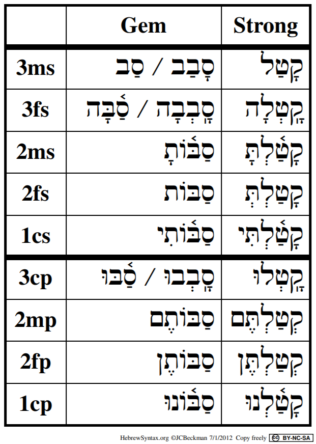
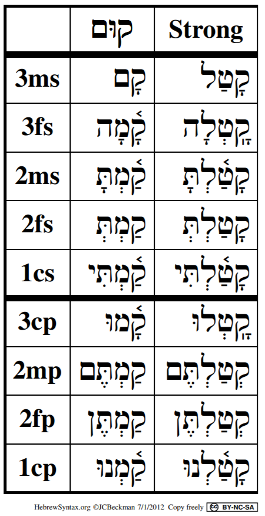
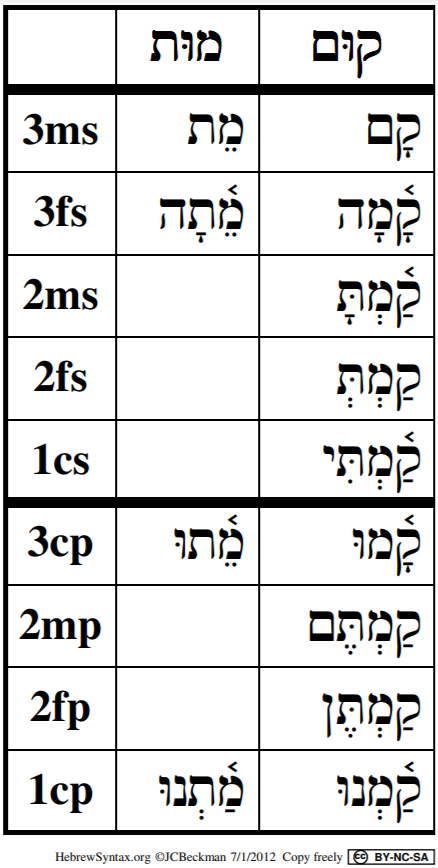

# Qal Perfect - Weak Verbs {.QP-w}


A weak verb is defined as one with one or more letters that cause the word to deviate from the strong verb pattern.  

In the Bible, weak verbs are much more common than strong verbs. Rather than memorizing all of the differences, we will study the changes caused by weak letters. By understanding these changes, we can work "backwards" to identify the strong verb's pattern.  This will enable us to correctly determine a weak verb's stem and conjugation so we can translate it accurately.


::: {.box .map}
<span class="he">LESSON ITINERARY<span class="he">

1. 3נ and 3ת assimilate
1. 1G, 2G reject Vocal Sheva
1. 2fs form of 3ע/ח is irregular
1. 3א usually quiesces
1. $R_3$ in 3ה is a vowel not a consonant
1. Gemininate and Biconsonantal often have only two root letters visible
1. Clues for your Qal Perfect Quest
:::

::: {.box .stop}
EQUIPMENT CHECK

Before continuing, can you describe the following concepts?

* You must have the Qal Perfect Strong Paradigm memorized!
:::

##  First Thought {-}

### <span class="he">בָ֤אָה נַחֲלָתֵ֙נוּ֙ אֵלֵ֔ינוּ מֵעֵ֥בֶר הַיַּרְדֵּ֖ן מִזְרָֽחָה׃</span> {-}

*our inheritance has fallen to us on this side of the Jordan toward the east (Numbers 32:19)*

Numbers 32 begins, "The Reubenites and Gadites, who had very large herds and flocks, saw that the lands of Jazer and Gilead were suitable for livestock."  They followed their eyes, which saw profit. The fact that they took the easy path caused tension between the tribes, and students of history know that these lands were often easily invaded. The lesson for us is to make we are seeking what the Lord wants for us and not our own desires.

<figure>
    <figcaption>Listen to the verse in Hebrew:</figcaption>
    <audio
        controls controlsList="nodownload"
        src="./images/14-03-Num.mp3">
            Your browser does not support the
            <code>audio</code> element.
    </audio>
</figure>


```{r, out.width = "400pt", fig.align='center', fig.cap="Cows of Bashan with Mount Hermon. Courtesy of the [Pictorial Library of Bible Lands](https://www.bibleplaces.com)"}

knitr::include_graphics("images/14_Cows of Bashan with Mount Hermon, tb032905276.jpg")
``` 


<!-- picture -->

```{r, out.width = "400pt", fig.align='center'}

knitr::include_graphics("images/07-Tabgha sacred stone where Jesus stood, tb102602022.jpg")
``` 


## Review

* Strong verbs follow the קטל strong-verb paradigm
* A weak verb has one or more root consonants that cause a spelling change when compared to the strong
* Depending on the change, a verb may be strong in one conjugation but weak in another
    * For example, Resh is only weak in forms that try to put a Daghesh Forte in it
        * The Piel stem has a Daghesh Forte in $R_2$, but the Qal does not
        * Therefore, a stem with a Resh (or a guttural) in $R_2$ is weak in the Piel, but Resh is not weak in the Qal
* Weak verbs are classified by their problematic root letter


## 3נ and 3ת with Silent Sheva Assimilate to Dagesh

* A Tav with a Sheva assimilates to another Tav only
    * It becomes a Dagesh Forte in the following Tav
    * This occurs in all Qal Perfect 2nd person forms as well as 1cs
    * NOT <span class="he">כָּרַתְתָּ</span>, BUT <span class="he">כָּרַתָּ</span>
* A Nun with a Silent Sheva assimilates to anything
    * It becomes a Daghesh Forte in the next letter
    * This occurs in all Qal Perfect 1st and 2nd Person forms
        * NOT <span class="he">נַתַ֫נְתָּ</span>, BUT <span class="he">נַתַ֫תָּ</span> 
        * NOT <span class="he">נָתַנְנוּ</span>, BUT <span class="he">נַתַ֫נּוֹ</span>
* The Daghesh 2MS ending is usually a Lene, but in these examples, each becomes a Forte (Why?<small>^[<small>A Daghesh is a Forte if it is preceded by a vowel that is not a Sheva.</small>]</small>)


## Review of Guttural Principles

1. Gutturals and Resh reject Dagesh Forte, often resulting in compensatory Lengthening:
    * From <span class="he">ִ</span> TO <span class="he">ֵ</span>
    * From <span class="he">ַ</span> TO <span class="he">ָ</span>
    * From <span class="he">ֻ</span> TO <span class="he">ֹ</span>
2. Gutturals Take Hateph Vowels instead of Vocal Sheva
    * Usually Hateph Patach, sometimes Hateph Seghol, rarely Hateph Qamets Hatuf
    * This can affect the preceding vowel, as well as the vowel associated with the guttural:
        * NOT <span class="he">עְמַדְתֶּם</span>, BUT <span class="he">עֲמַדְתֶּם</span>
* Gutturals prefer Patach
    * NOT <span class="he">יִשְׁלֹח</span>, BUT <span class="he">יִשְׁלַח</span>   

## 1G, 2G
* The Guttural will take Hateph Patach instead of Vocal Sheva
* 1G - affects QP2mp and QP2fs
    * NOT <span class="he">עְמַדְתֶּם</span>, BUT <span class="he">עֲמַדְתֶּם</span>
    * Otherwise, $V_1 = \bar A$ as is diagnostic of the QP conjugation
* 2G - affects QP3fs, QP2fs, QP3cp
    * NOT <span class="he">בָּחְרוּ</span>, BUT <span class="he">בָּהֲרוּ</span>
    * In 2G, $V_1 = \bar A$ (unless reduced in 2mp/2fp) as is diagnostic of the QP conjugation

::: {.box .light}
To get back to the strong verb paradigm, substitute Sheva for the Hateph vowels
::::

    
## 3-ע/ח

* Because different $R_3$ gutturals behave in different ways, we are unable to simply say "3G"
    * 3 ע/ח is discussed below
    * א 3 and 3 ה will be discussed in separate sections
* 3 ע/ח: We said earlier that the Gutturals reject VOCAL sheva but the Sheva in the 2nd (except 2fs) and 1st person forms is SILENT so it stays
    * <span class="he">שָׁמַ֫עְתָּ</span>
* For reasons scholars don't fully understand, the 2fs form is irregular.  
    * The  3rd ע or ח takes a Patach instead of a Sheva:
        * <span class="he">שָׁמַ֫עַתְּ</span>
    * The Dagesh is a LENE despite the preceding vowel
    * It is not necessary to memorize this oddity
* In all 3G, $V_1 = \bar A$ (unless reduced in 2mp/2fp) as is diagnostic of the QP conjugation - in other words, no matter what happens to $V_S$, you will usually be able to diagnose Qal Perfect by the regular Qamets in $V_1$

    
## א3 

* Aleph quiesces with Silent Shewa
    * Occasionally, it also quiesces with Hateph vowels (i.e. Vocal Sheva)
    * Usually there is Compensatory Lengthening (CL)
    * $V_2 = \bar A$ (Qamets) unless reduced by the perfect sufformative
    * QP2ms: NOT <span class="he">מָצַ֫אְתָּ</span>, BUT <span class="he">מָצָ֫עתָ</span>
    * QP3ms, the Aleph is already quiescent (CL): NOT <span class="he">מָצַא</span>, BUT <span class="he">מָצָא</span>
    * בגד כפת have Dagesh Lene only if not after a vowel
        * In other words, the Quiscent Aleph is ignored
        * Note how the 2fs forms drops the Dagesh Lene and final Silent Sheva if a vowel is before the בגד כפת:
        * NOT <span class="he">מָצַאְתְּ</span>, BUT <span class="he">מָצָאת</span>
* As mentioned, in 3G, $V_1 = \bar A$ (unless reduced in 2mp/2fp) as is diagnostic of the QP conjugation - (are you beginning to see the pattern?)

## <span class="he">יָרֵא</span> is 3א AND Tsere Stative

* $V_S = \bar E$ unless reduced (P3fs, P3cp)
* Most Tsere statives have $\bar E$ only in the 3ms - ירא is irregular


## 3ה  

* 3ה verbs are in a unique class
* $R_3$ is not a consonant; in fact there is no $R_3$ consonant
* 3ה verbs only have two root consonants, $R_1$ and $R_2$ - the final slot is taken up by the vowel letter <span class="he">ה ָ</span>

::: {.box .light}
Historically, third ה verbs used to be 3-י.  In some conjugations, the Yod "reappears."
:::

* $V_2$ of 3H verbs follow a unique pattern:
    * IF there is no sufformative THEN add the vowel <span class="he">ה ָ</span> in the Perfect
    * IF the sufformative starts with a vowel, THEN the vowel of the sufformative is $V_2$
    * IF the sufformative starts with a consonant, THEN $V_2$ is <vowel>+Yod
        * The specific <vowel> depends on the stem - for the QP $V_2 = \hat I$ (Hireq+Yod)
* Additionally, to avoid ambiguity with the P3ms, the P3fs sufformative becomes <span class="he">תָה</span>
* With all these changes, the  $V_1 = \bar A$ (unless reduced in 2mp/2fp) diagnostic of QP does not change
    
## Doubly Weak

* Doubly weak verbs have two (or all three<small>^[<small>Even those verbs with three weak letters are still referred to as 'doubly weak'</small>]</small>)
* Most frequently, it will be a 3ה verb with a 1G or 2G
* These verbs have an additional step to scavenger hunt our way back to the Strong Verb Paradigm but overall, these are not difficult
* We simply need to combine the 1G/2G aspects of the hateph vowel instead of a sheva with the 3ה endings we studied in the previous section

## <span class="he">הָיָה</span>

* This is a very common verb meaning "to be"
* As you can see, it is both 1G and 3ה
* It follows the 3ה endings we discussed above
* $V_1$ is <span class="he">הֱ</span> in 2mp and 2fp
    * <span class="he">הֱיִיתֶם</span> and <span class="he">הֱיִיתֵן</span>
    * The first Yod is $R_2$
    * The second is $V_2 = \hat I$ (Hireq Yod)

## Geminate

* In Geminate verbs, $R_3 = $R_2$
* No Hebrew words have $R_1 = R_2$ - this will prove to be important later in the course
* Frequently, $R_2$ assimilates into its twin $R_3$
    * $R_3$ will then take a Dagesh Forte, unless it is the final consonant in a word
    * 3rd person forms will have both
        * <span class="he">סַב</span> or <span class="he">סָבַב</span>
    * When there is assimilation, the accent tries to shift to $V_1$ since that is the new Stem Vowel
        * The accent must be on the last two syllables
        * The heavy sufformatives (2mp and 2fp) continue to take the accent
    * $V_2 = \hat O$ before sufformative that starts with a consonant
* Review the table below, noting $V_1$ and accent changes:

```{r, out.width = "400pt", fig.align='center', fig.cap="Qal Perfect: Geminate/Strong Paradigms"}


``` 

::: {.box .map}
Although they can be troublesome, Geminate verbs are relatively infrequent, so the changes in the table above needn't distract you from your verb parsing quest!  You will learn the major geminate verbs in your vocabulary. To start with, here are a few of the most common:

* <span class="he">סָבַב</span>, to surround
* <span class="he">שָׁלַל</span>, to plunder
* <span class="he">אָרַר</span>, to curse
* <span class="he">תָמַמ</span>, to finish
:::

## Biconsonantal

* Biconsonantal have two root consonants, $R_1$ and $R_3$
* What appears to be $R_2$ is actually an unchangable long vowel, Holem+Vav, Shuruq, or Hireq+Yod
    * This vowel is called the __LEXICAL VOWEL__
    * It will be important to memorize the Lexical Vowel
        * For example, NOT <span class="he">קִים</span>, NOT <span class="he">קוֹם</span>, BUT <span class="he">קוּם</span>
    * The word with the Lexical Vowel is the Lexical Form (the version that is in the dictionary)
    * This is an exception to the QP3ms = Lexical Form guideline
* $V_S$ and its accent move to $V_1$ and do not reduce
    * $V_S$ lengthens in 3rd person
    
Review the table below, noting $V_1$ and accent changes:

```{r, out.width = "400pt", fig.align='center', fig.cap="Qal Perfect: Biconsonantal/Strong Paradigms"}


``` 

## <span class="he">םוּת</span> is Biconsonantal and Stative

* Recognize Biconsonantal by the accent and missing root consonant
* $V_S$ and accent moved to $V_1$
* Tsere stem vowel in 3rd person
* In the perfect, only occurs in 3rd person and 1cp
* Compare <span class="he">םוּת</span> and <span class="he">קוּם</span> in the table below:
```{r, out.width = "400pt", fig.align='center', fig.cap="Qal Perfect: מוּת/קוּם Paradigms"}


``` 

## Qal Perfect Quest Clues

1. No preformative
2. Perfect sufformative
3. $V_1 \bar A$ (Qamets)
    * Reduced if 2mp/2fp
    * $A$ (Patach) if Biconsonantal or Geminate 1st or 2nd Person
    * (_reduced if pronominal suffix - Lesson 19_)
    
## Clues for Qal Perfect Special Situations

::: {.box .map}
Commit the 3ה clues to memory.  Geminate and Biconsonantal are much less frequent.
:::

* Missing a Root Consonant?
    * If $V_1$ is accented, it is biconsonantal or geminate
    * 1st or 2nd person: look at the vowel before the sufformative
        * <span class="he">י ִ</span> = 3ה
        * <span class="he">וֹ ּ </span> = GEMINATE
        * <span class="he">ְ </span> = BICONSONANTAL
        * <span class="he">תּ ַ </span> (where Tav is the sufformative) = 3נ/ת
        * <span class="he">נּוּ ַ </span> in the 1cp = 3נ
    * 3rd Person
        * Dagesh Forte in what looks like $R_2$ = GEMINATE
        * $V_1$ is accented and no Dagesh in $R_2$ = BICONSONANTAL
        * $V_2$ accented as usual = 3ה

## Word Warm-up {-}

[Click to open `Word Warm-up` video in a new tab](https://youtu.be/eoDmrjNixN4){target="_blank"}


<div class="container">
<iframe class="responsive-iframe" src="https://youtube.com/embed/eoDmrjNixN4" frameborder="0"></iframe>
</div>


## Verses Warm-up {-}

[Click to open `Verses Warm-up` video in a new tab](https://youtu.be/8MouGMH5bCQ){target="_blank"}

<div class="container">
<iframe class="responsive-iframe" src="https://youtube.com/embed/8MouGMH5bCQ" frameborder="0"></iframe>
</div>

## Anki {-}

* `Lesson 14 A. Vocab`
* `Lesson 14 B. Grammar` 
* `Lesson 14 C. Workbook`
* `Lesson 14 D. Study Verses`

> unless there is something unique to point out, we will omit the Anki section from the Hebrew GRAMMAR Quest Guidebook going foward. You know the drill!  Be sure to do the four Anki levels after each Lesson.

## Ruth Pursuit {-}    

::: {.box .map} 
YOUR QUEST

Identify and translate the Qal Perfect Weak Verbs below.  All verbal roots are vocabulary words from Lesson 12 or Lesson 14.

1. שׁמע QP3fs
2. היה QP3fs
3. עשה QP2mp
4. אמר QP1cs
5. יצא QP3fs - why is this verb 3fs?
6. שׁוּב QP3fs X2
7. הלך QP1cs
8. ענה QP3ms
9  בוֹא QP3cp

:::

* [Blank copy of Ruth 1](https://docs.google.com/document/d/1bcT1J-fcVmD1Zn5Jk2nj0560tEddcgtbYZLkwaVVuyE/copy){target="_blank"}
* [Ruth Pursuit Answer Key #14](./images/14_Ruth_Pursuit_KEY.pdf){target="_blank"}


## X Quest Quiz {-}

[Open Quest Quiz #xx in a new window](){target="_blank"}

<div class="containerLtr">
<iframe class="responsive-iframe" src="" frameborder="0"></iframe>
</div>


## OPTIONAL: _Hebrew Quest_ Study Passage: Proverbs #8-10 {-}


::: {.box .map}
YOUR HEBREW QUEST:

1. BEFORE WATCHING THE VIDEO, read through the passage on your own straight through one time - pick up as much as you can. [Blank copy of the Proverbs studied in sessions 5-7.](https://docs.google.com/document/d/15D5W-prZoVTGEFa9QzuBCnfW4kQnwXT4TBNYNPhcRW8/copy){target="_blank"}
2. Now re-read the passage critically
    1. Highlight any words you do not know and look them up in a [lexicon](https://holylanguage.com/resources-dictionaries.php){target="_blank"}
    2. Sketch out a translation - there is a blank line between each verse
3. Now, using your marked-up copy of the passage, watch Izzy's _Hebrew Quest_ videos (video opens in a new tab)
    1. [Proverbs #8](https://holylanguage.com/proverbs-8.php){target="_blank"}
    1. [Proverbs #9](https://holylanguage.com/proverbs-9.php){target="_blank"}
    1. [Proverbs #10](https://holylanguage.com/proverbs-10.php){target="_blank"}
4. After the video, assess your translation.  How close was it?
5. How did the Ruach HaQodesh speak to you through the passage?

:::
