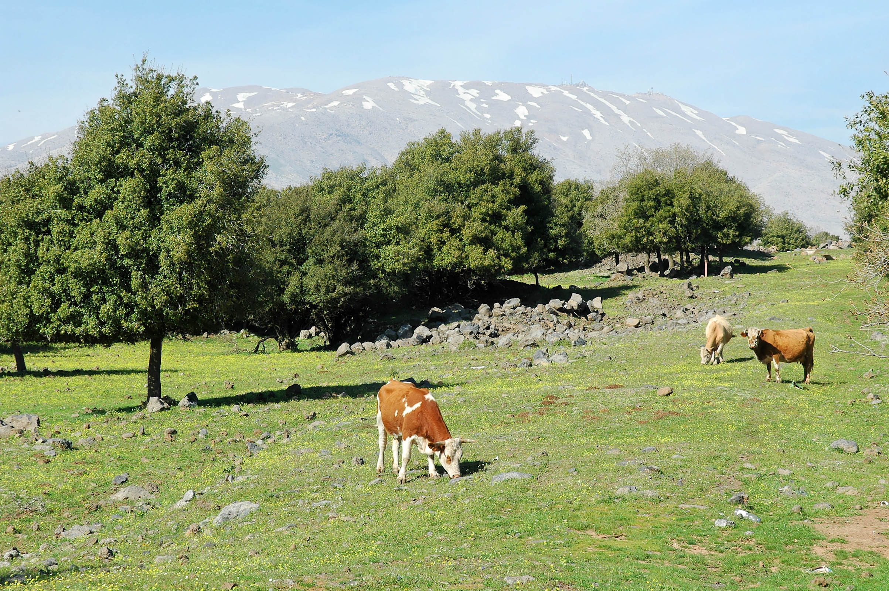

# Qal Perfect - Weak Verbs {.QP-w}

::: {.infobox .sound}
<figure><audio id="myAudio" controls controlsList="nodownload" src="./images/14.intro.m4a">
Your browser does not support the <code>audio</code> element.</audio>
<button onclick="setPlaySpeed25()" type="button">2.5x</button> <button onclick="setPlaySpeed2()" type="button">2x</button> <button onclick="setPlaySpeed15()" type="button">1.5x</button> <button onclick="setPlaySpeed1()" type="button">1x</button> <button onclick="setPlaySpeed075()" type="button">.75x</button> <button onclick="setPlaySpeed05()" type="button">.5x</button> 
<script>
var x = document.getElementById("myAudio");
function setPlaySpeed05() { x.playbackRate = 0.5; x.play();}
function setPlaySpeed075() {x.playbackRate = 0.75; x.play();} 
function setPlaySpeed1() {x.playbackRate = 1; x.play();}
function setPlaySpeed15() {x.playbackRate = 1.5; x.play();} 
function setPlaySpeed2() {x.playbackRate = 2; x.play();} 
function setPlaySpeed25() {x.playbackRate = 2.5;x.play();} 
</script> </figure>
:::

> In the Bible, weak verbs are much more common than strong verbs. To understand Biblical Hebrew, we must be able to translate weak verbs.


A weak verb is defined as a verb with one or more letters that cause the word to deviate from the strong verb pattern. We already looked at two of these in the previous lesson:  נ and ת assimilate under certain conditions. 

Many Hebrew grammar textbooks asked students to memorize _all_ of the differences in each stem and conjugation.  Fortunately, there is an easier way.  

We can simply study the changes caused by weak letters. These changes then become clues we can use to uncover the applicable strong verb pattern.  This will enable us to correctly determine a weak verb's stem and conjugation to translate it accurately.


::: {.box .map}
LESSON ITINERARY

1. 3נ and 3ת assimilate
1. 1G, 2G reject Vocal Sheva
1. 2fs form of 3ע/ח is irregular
1. 3א usually quiesces
1. $R_3$ in 3ה is a vowel, not a consonant
1. Geminate and Biconsonantal often have only two root letters visible
1. Clues for your Qal Perfect Quest

:::

::: {.box .stop}
EQUIPMENT CHECK

Before continuing, can you describe the following concepts?

* You must have the Qal Perfect Strong Paradigm memorized!

:::

##  First Thought {-}

::: {.infobox .sound}
<figure>
<audio id="myAudio" controls controlsList="nodownload" src="./images/14-03-Num.mp3">
            Your browser does not support the <code>audio</code> element.</audio>
<button onclick="setPlaySpeed25()" type="button">2.5x</button> <button onclick="setPlaySpeed2()" type="button">2x</button> <button onclick="setPlaySpeed15()" type="button">1.5x</button> <button onclick="setPlaySpeed1()" type="button">1x</button> <button onclick="setPlaySpeed075()" type="button">.75x</button> <button onclick="setPlaySpeed05()" type="button">.5x</button> 
<script>
var x = document.getElementById("myAudio");
function setPlaySpeed05() { 
    x.playbackRate = 0.5;
    x.play();
}
function setPlaySpeed075() { 
    x.playbackRate = 0.75;
    x.play();
} 
function setPlaySpeed1() { 
    x.playbackRate = 1;
     x.play();
}
function setPlaySpeed15() { 
    x.playbackRate = 1.5;
     x.play();
} 
function setPlaySpeed2() { 
    x.playbackRate = 2;
     x.play();
} 
function setPlaySpeed25() { 
    x.playbackRate = 2.5;
     x.play(); 
} 
</script> 
</figure>
:::

### <span class="he"><rtl>בָ֤אָה נַחֲלָתֵ֙נוּ֙ אֵלֵ֔ינוּ מֵעֵ֥בֶר הַיַּרְדֵּ֖ן מִזְרָֽחָה׃</rtl></span> {-}

*our inheritance has fallen to us on this side of the Jordan toward the east (Numbers 32:19)*

Numbers 32 begins, "The Reubenites and Gadites, who had very large herds and flocks, saw that the lands of Jazer and Gilead were suitable for livestock."  They followed their eyes, which saw profit. They took the easy path, which caused tension between the tribes. Students of history know that these lands to the east were often easily invaded. The lesson for us is to make sure we seek what the Lord wants for us and not our own desires.


```{r, out.width = "400pt", fig.align='center', fig.cap="Cows of Bashan with Mount Hermon. Courtesy of the [Pictorial Library of Bible Lands](https://www.bibleplaces.com)"}


``` 


## Weak Verb Review
::: {.infobox .sound}
<figure>
<audio id="myAudio" controls controlsList="nodownload" src="./images/14.1.m4a">
            Your browser does not support the <code>audio</code> element.</audio>
<button onclick="setPlaySpeed25()" type="button">2.5x</button> <button onclick="setPlaySpeed2()" type="button">2x</button> <button onclick="setPlaySpeed15()" type="button">1.5x</button> <button onclick="setPlaySpeed1()" type="button">1x</button> <button onclick="setPlaySpeed075()" type="button">.75x</button> <button onclick="setPlaySpeed05()" type="button">.5x</button> 
<script>
var x = document.getElementById("myAudio");
function setPlaySpeed05() { x.playbackRate = 0.5; x.play();}
function setPlaySpeed075() {x.playbackRate = 0.75; x.play();} 
function setPlaySpeed1() {x.playbackRate = 1; x.play();}
function setPlaySpeed15() {x.playbackRate = 1.5; x.play();} 
function setPlaySpeed2() {x.playbackRate = 2; x.play();} 
function setPlaySpeed25() {x.playbackRate = 2.5;x.play();} 
</script> </figure>
:::

* Strong verbs always follow the קטל strong-verb paradigm we learned in Lesson 13
    * The literal meaning of קטל is not material to our study
    * Like a math formula, these three letters are placeholders represent any verbal root containing three strong letters
* A weak letter behaves differently in some fashion
    * It could reject a dagesh forte, prefer a different vowel, or disappear entirely under certain situations
* A weak verb is a verbal root with one or more weak letters
* It is possible for a verb to be strong in one conjugation but weak in another
    * For example, Resh is only a weak letter in verbs that try to put a Daghesh Forte in it
    * The Qal stem does not require a Dagesh Forte in any form; therefore, verbs with Resh are not considered weak in Qal
        * In Unit 4, we will learn the Piel stem requires a Daghesh Forte in $R_2$
        * Therefore, a verb with a Resh in $R_2$ is a weak verb in the Piel
* Weak verbs are classified by their problematic root letter 
    * [Refer to Lesson 12](#weak-class) for a review of weak verb classes


## 3נ and 3ת with Silent Sheva Assimilate to Dagesh

::: {.infobox .sound}
<figure>
<audio id="myAudio" controls controlsList="nodownload" src="./images/14.2.m4a">
            Your browser does not support the <code>audio</code> element.</audio>
<button onclick="setPlaySpeed25()" type="button">2.5x</button> <button onclick="setPlaySpeed2()" type="button">2x</button> <button onclick="setPlaySpeed15()" type="button">1.5x</button> <button onclick="setPlaySpeed1()" type="button">1x</button> <button onclick="setPlaySpeed075()" type="button">.75x</button> <button onclick="setPlaySpeed05()" type="button">.5x</button> 
<script>
var x = document.getElementById("myAudio");
function setPlaySpeed05() { x.playbackRate = 0.5; x.play();}
function setPlaySpeed075() {x.playbackRate = 0.75; x.play();} 
function setPlaySpeed1() {x.playbackRate = 1; x.play();}
function setPlaySpeed15() {x.playbackRate = 1.5; x.play();} 
function setPlaySpeed2() {x.playbackRate = 2; x.play();} 
function setPlaySpeed25() {x.playbackRate = 2.5;x.play();} 
</script> </figure>
:::

* A Tav with a Silent Sheva assimilates to another Tav only
    * It becomes a Dagesh Forte in the following Tav
    * This occurs in all Qal Perfect 2nd person forms as well as 1cs
    * NOT <span class="he">כָּרַתְתָּ</span>*, BUT <span class="he">כָּרַתָּ</span>
* A Nun with a Silent Sheva assimilates to anything
    * It becomes a Dagesh Forte in the next letter
    * This occurs in all Qal Perfect 1st and 2nd Person forms
        * NOT <span class="he">נַתַ֫נְתָּ</span>*, BUT <span class="he">נַתַ֫תָּ</span> 
        * NOT <span class="he">נָתַנְנוּ</span>*, BUT <span class="he">נַתַ֫נּוֹ</span>
* The Dagesh mark in the 2MS ending is usually a Lene, but when preceded by נ or ת it becomes a Forte (Why?^[A Dagesh is a Forte if it is preceded by a vowel that is not a Sheva.])

::: {.box .info}
DAGESH FORTE

* The Dagesh Forte is your clue that something is different
* Often, it replaces a missing letter

:::

## Review of Guttural Principles

::: {.infobox .sound}
<figure>
<audio id="myAudio" controls controlsList="nodownload" src="./images/14.3.m4a">
            Your browser does not support the <code>audio</code> element.</audio>
<button onclick="setPlaySpeed25()" type="button">2.5x</button> <button onclick="setPlaySpeed2()" type="button">2x</button> <button onclick="setPlaySpeed15()" type="button">1.5x</button> <button onclick="setPlaySpeed1()" type="button">1x</button> <button onclick="setPlaySpeed075()" type="button">.75x</button> <button onclick="setPlaySpeed05()" type="button">.5x</button> 
<script>
var x = document.getElementById("myAudio");
function setPlaySpeed05() { x.playbackRate = 0.5; x.play();}
function setPlaySpeed075() {x.playbackRate = 0.75; x.play();} 
function setPlaySpeed1() {x.playbackRate = 1; x.play();}
function setPlaySpeed15() {x.playbackRate = 1.5; x.play();} 
function setPlaySpeed2() {x.playbackRate = 2; x.play();} 
function setPlaySpeed25() {x.playbackRate = 2.5;x.play();} 
</script> </figure>
:::

* Gutturals and Resh reject Dagesh Forte, often resulting in compensatory Lengthening:
    * From $I$ to $\bar E$ 
    * From $A$ to $\bar A$ 
    * From $U$ to $\bar O$
* Gutturals take Hateph Vowels instead of Vocal Sheva
    * Usually Hateph Patach, sometimes Hateph Seghol, rarely Hateph Qamets Hatuf
    * This can affect the preceding vowel, as well as the vowel associated with the guttural:
        * NOT <span class="he">עְמַדְתֶּם</span>*, BUT <span class="he">עֲמַדְתֶּם</span>
* Gutturals prefer Patach
    * NOT <span class="he">יִשְׁלֹח</span>*, BUT <span class="he">יִשְׁלַח</span>   

## 1G, 2G

::: {.infobox .sound}
<figure>
<audio id="myAudio" controls controlsList="nodownload" src="./images/14.4.m4a">
            Your browser does not support the <code>audio</code> element.</audio>
<button onclick="setPlaySpeed25()" type="button">2.5x</button> <button onclick="setPlaySpeed2()" type="button">2x</button> <button onclick="setPlaySpeed15()" type="button">1.5x</button> <button onclick="setPlaySpeed1()" type="button">1x</button> <button onclick="setPlaySpeed075()" type="button">.75x</button> <button onclick="setPlaySpeed05()" type="button">.5x</button> 
<script>
var x = document.getElementById("myAudio");
function setPlaySpeed05() { x.playbackRate = 0.5; x.play();}
function setPlaySpeed075() {x.playbackRate = 0.75; x.play();} 
function setPlaySpeed1() {x.playbackRate = 1; x.play();}
function setPlaySpeed15() {x.playbackRate = 1.5; x.play();} 
function setPlaySpeed2() {x.playbackRate = 2; x.play();} 
function setPlaySpeed25() {x.playbackRate = 2.5;x.play();} 
</script> </figure>
:::

* The Guttural will take Hateph Patach instead of Vocal Sheva
* 1G - affects QP2mp and QP2fp
    * NOT <span class="he">עְמַדְתֶּם</span>*, BUT <span class="he">עֲמַדְתֶּם</span>
    * Otherwise, $V_1 = \bar A$ as is diagnostic of the QP conjugation
* 2G - affects QP3fs, QP2fs, QP3cp
    * NOT <span class="he">בָּחְרוּ</span>*, BUT <span class="he">בָּהֲרוּ</span>
    * In 2G, $V_1 = \bar A$ (unless reduced in 2mp/2fp) as is diagnostic of the QP conjugation

::: {.box .light}
To get back to the strong verb paradigm, substitute Sheva for the Hateph vowels
::::

    
## 3-ע/ח

::: {.infobox .sound}
<figure>
<audio id="myAudio" controls controlsList="nodownload" src="./images/14.5.m4a">
            Your browser does not support the <code>audio</code> element.</audio>
<button onclick="setPlaySpeed25()" type="button">2.5x</button> <button onclick="setPlaySpeed2()" type="button">2x</button> <button onclick="setPlaySpeed15()" type="button">1.5x</button> <button onclick="setPlaySpeed1()" type="button">1x</button> <button onclick="setPlaySpeed075()" type="button">.75x</button> <button onclick="setPlaySpeed05()" type="button">.5x</button> 
<script>
var x = document.getElementById("myAudio");
function setPlaySpeed05() { 
    x.playbackRate = 0.5;
    x.play();
}
function setPlaySpeed075() { 
    x.playbackRate = 0.75;
    x.play();
} 
function setPlaySpeed1() { 
    x.playbackRate = 1;
     x.play();
}
function setPlaySpeed15() { 
    x.playbackRate = 1.5;
     x.play();
} 
function setPlaySpeed2() { 
    x.playbackRate = 2;
     x.play();
} 
function setPlaySpeed25() { 
    x.playbackRate = 2.5;
     x.play(); 
} 
</script> 
</figure>
:::

* Because different $R_3$ gutturals behave in different ways, we are unable to simply say "third guttural"
    * 3 ע/ח is discussed below
    * א 3 and 3 ה will be discussed in separate sections
* 3 ע/ח: We said earlier that the Gutturals reject VOCAL Sheva, but the Sheva in the 2nd (except 2fs) and 1st person forms is SILENT, so it stays
    * <span class="he">שָׁמַ֫עְתָּ</span>
* For reasons scholars don't fully understand, the 2fs form is irregular        
    * The  3rd ע or ח takes a Patach instead of a Sheva:
        * <span class="he">שָׁמַ֫עַתְּ</span>
    * The Dagesh is a LENE despite the preceding vowel
    * It is not necessary to memorize this oddity
* In all 3G, $V_1 = \bar A$ (unless reduced in 2mp/2fp) as is diagnostic of the QP conjugation - in other words, no matter what happens to $V_S$, you will usually be able to diagnose Qal Perfect by the regular Qamets in $V_1$

    
## א-3 

::: {.infobox .sound}
<figure>
<audio id="myAudio" controls controlsList="nodownload" src="./images/14.6.m4a">
            Your browser does not support the <code>audio</code> element.</audio>
<button onclick="setPlaySpeed25()" type="button">2.5x</button> <button onclick="setPlaySpeed2()" type="button">2x</button> <button onclick="setPlaySpeed15()" type="button">1.5x</button> <button onclick="setPlaySpeed1()" type="button">1x</button> <button onclick="setPlaySpeed075()" type="button">.75x</button> <button onclick="setPlaySpeed05()" type="button">.5x</button> 
<script>
var x = document.getElementById("myAudio");
function setPlaySpeed05() { 
    x.playbackRate = 0.5;
    x.play();
}
function setPlaySpeed075() { 
    x.playbackRate = 0.75;
    x.play();
} 
function setPlaySpeed1() { 
    x.playbackRate = 1;
     x.play();
}
function setPlaySpeed15() { 
    x.playbackRate = 1.5;
     x.play();
} 
function setPlaySpeed2() { 
    x.playbackRate = 2;
     x.play();
} 
function setPlaySpeed25() { 
    x.playbackRate = 2.5;
     x.play(); 
} 
</script> 
</figure>
:::

* Aleph quiesces with Silent Sheva
    * Occasionally, it also quiesces with Hateph vowels (i.e., Vocal Sheva)
    * Usually, there is Compensatory Lengthening (CL)
    * $V_2 = \bar A$ (Qamets) unless reduced by the perfect sufformative
    * QP2ms: NOT <span class="he">מָצַ֫אְתָּ</span>*, BUT <span class="he">מָצָ֫אתָּ</span>
    * QP3ms, the Aleph is already quiescent (CL): NOT <span class="he">מָצַא</span>*, BUT <span class="he">מָצָא</span>
    * בגד כפת have Dagesh Lene only if not after a vowel
        * In other words, the Quiescent Aleph is ignored - it is neither a consonant, nor a vowel and does not affect syllabification
        * Note how the 2fs forms drop the Dagesh Lene and final Silent Sheva - this is because a vowel is before the בגד כפת letter
        * NOT <span class="he">מָצַאְתְּ</span>*, BUT <span class="he">מָצָאת</span>
* As mentioned, in 3G, $V_1 = \bar A$ (unless reduced in 2mp/2fp) as is diagnostic of the QP conjugation - (are you beginning to see the pattern?)

::: {.box .caution}

יָרֵא is 3א AND Tsere Stative

:::

* <span class="he">יָרֵא</span> is irregular
* Most Tsere statives have $\bar E$ only in the 3ms, but with <span class="he">יָרֵא</span>, $V_S = \bar E$ unless $V_2$ is reduced (P3fs, P3cp)


## 3ה  

::: {.infobox .sound}
<figure>
<audio id="myAudio" controls controlsList="nodownload" src="./images/14.8.m4a">
            Your browser does not support the <code>audio</code> element.</audio>
<button onclick="setPlaySpeed25()" type="button">2.5x</button> <button onclick="setPlaySpeed2()" type="button">2x</button> <button onclick="setPlaySpeed15()" type="button">1.5x</button> <button onclick="setPlaySpeed1()" type="button">1x</button> <button onclick="setPlaySpeed075()" type="button">.75x</button> <button onclick="setPlaySpeed05()" type="button">.5x</button> 
<script>
var x = document.getElementById("myAudio");
function setPlaySpeed05() { 
    x.playbackRate = 0.5;
    x.play();
}
function setPlaySpeed075() { 
    x.playbackRate = 0.75;
    x.play();
} 
function setPlaySpeed1() { 
    x.playbackRate = 1;
     x.play();
}
function setPlaySpeed15() { 
    x.playbackRate = 1.5;
     x.play();
} 
function setPlaySpeed2() { 
    x.playbackRate = 2;
     x.play();
} 
function setPlaySpeed25() { 
    x.playbackRate = 2.5;
     x.play(); 
} 
</script> 
</figure>
:::


* 3ה verbs are in a unique class
* $R_3$ is not a consonant; in fact, there is no $R_3$ consonant^[This is per Dr. Beckman's lessons. Other scholars, including _Basics of Biblical Hebrew_, view the ה as $R_3$. Beckman's approach turns out to be easier to grasp.]
* 3ה verbs only have two root consonants, $R_1$ and $R_2$ - the final slot is taken up by the _vowel_ $\hat A$ (Qamats+Hei)
* $V_2$ of 3ה verbs follow a unique pattern:
    * If there is no sufformative, THEN add the vowel $\hat A$ in the Perfect
    * If the sufformative starts with a vowel, THEN the vowel of the sufformative is $V_2$
    * If the sufformative starts with a consonant, THEN $V_2$ is (vowel)+Yod
        * The specific (vowel) depends on the conjugation
        * For the Perfect, $V_2 = \hat I$ (Hireq+Yod)
* Additionally, to avoid ambiguity with the P3ms, the P3fs sufformative becomes <span class="he">תָה</span>
* With all these changes, the  $V_1 = \bar A$ (unless reduced in 2mp/2fp) diagnostic of the QP does not change


::: {.box .light}
* 3ה Verbs are frequent, so we will want to memorize these rules and endings
* Good news! They are consistent throughout all stems; e.g., P3ms 3ה verbs end in $\hat A$ (Qamets+Hei) in all seven stems

:::

Below is a summary table showing the verb <span class="he">בָנָה</span> in the Qal Perfect.  Note $\hat I$ in all 2nd/1st person perfect forms.

```{r, out.width = "400pt", fig.align='center', fig.cap="3-Hei Qal Perfect"}


``` 

::: {.box .info}
* Historically, third ה verbs used to be 3-י.  In some conjugations, the Yod "reappears."
* In the Qal Perfect, the diagnostic $V_S = \hat I$ will help you to identify the 3-ה class of verbs.
:::

## Doubly Weak

::: {.infobox .sound}
<figure>
<audio id="myAudio" controls controlsList="nodownload" src="./images/14.9.m4a">
            Your browser does not support the <code>audio</code> element.</audio>
<button onclick="setPlaySpeed25()" type="button">2.5x</button> <button onclick="setPlaySpeed2()" type="button">2x</button> <button onclick="setPlaySpeed15()" type="button">1.5x</button> <button onclick="setPlaySpeed1()" type="button">1x</button> <button onclick="setPlaySpeed075()" type="button">.75x</button> <button onclick="setPlaySpeed05()" type="button">.5x</button> 
<script>
var x = document.getElementById("myAudio");
function setPlaySpeed05() { 
    x.playbackRate = 0.5;
    x.play();
}
function setPlaySpeed075() { 
    x.playbackRate = 0.75;
    x.play();
} 
function setPlaySpeed1() { 
    x.playbackRate = 1;
     x.play();
}
function setPlaySpeed15() { 
    x.playbackRate = 1.5;
     x.play();
} 
function setPlaySpeed2() { 
    x.playbackRate = 2;
     x.play();
} 
function setPlaySpeed25() { 
    x.playbackRate = 2.5;
     x.play(); 
} 
</script> 
</figure>
:::


* Doubly weak verbs have two (or all three<small>^[<small>Even those verbs with three weak letters are still referred to as 'doubly weak'</small>]</small>) weak letters
* Most frequently, it will be a 3ה verb with a 1G or 2G
* These verbs have an additional step to scavenger hunt our way back to the Strong Verb Paradigm
* We simply need to combine the 1G/2G aspects of the Hateph vowel instead of a Sheva with the 3ה endings we studied in the previous section

::: {.box .light}
<span class="he"> הָיָה </span> is a very common verb meaning "to be"
 
:::

* As you can see, it is both 1G and 3ה
* It follows the 3ה endings we discussed above
* $V_1$ is <span class="he">הֱ</span> in 2mp and 2fp
    * <span class="he">הֱיִיתֶם</span> and <span class="he">הֱיִיתֵן</span>
    * The first Yod is $R_2$
    * The second Yod is part of the vowel $V_2 = \hat I$ (Hireq+Yod), which is diagnostic of a 3ה verb in the Perfect 2p/1p conjugation
* The key to unlocking these is learning your 3ה vocabulary words


## Geminate 

::: {.infobox .sound}
<figure>
<audio id="myAudio" controls controlsList="nodownload" src="./images/14.10.m4a">
            Your browser does not support the <code>audio</code> element.</audio>
<button onclick="setPlaySpeed25()" type="button">2.5x</button> <button onclick="setPlaySpeed2()" type="button">2x</button> <button onclick="setPlaySpeed15()" type="button">1.5x</button> <button onclick="setPlaySpeed1()" type="button">1x</button> <button onclick="setPlaySpeed075()" type="button">.75x</button> <button onclick="setPlaySpeed05()" type="button">.5x</button> 
<script>
var x = document.getElementById("myAudio");
function setPlaySpeed05() { 
    x.playbackRate = 0.5;
    x.play();
}
function setPlaySpeed075() { 
    x.playbackRate = 0.75;
    x.play();
} 
function setPlaySpeed1() { 
    x.playbackRate = 1;
     x.play();
}
function setPlaySpeed15() { 
    x.playbackRate = 1.5;
     x.play();
} 
function setPlaySpeed2() { 
    x.playbackRate = 2;
     x.play();
} 
function setPlaySpeed25() { 
    x.playbackRate = 2.5;
     x.play(); 
} 
</script> 
</figure>
:::


* In Geminate verbs, $R_3 = R_2$
* No Hebrew words have $R_1 = R_2$ - this will prove to be important later in the course
* Frequently, $R_2$ assimilates into its twin $R_3$
    * $R_3$ will then take a Dagesh Forte, unless it is the final consonant in a word

::: {.box .caution}
* 3rd person forms may be spelled either with or without assimilation
* <span class="he">סַב</span> or <span class="he">סָבַב</span>
:::

* When there is assimilation, $V_S$ shifts to $V_1$ position
    * So this is a time where you may _not_ see our diagnostic Qal Perfect $V_1 = \bar A$
    * Additionally, the accent tries to shift to $V_1$ since that is the new Stem Vowel
        * The accent must be on the last two syllables
        * The heavy sufformatives (2mp and 2fp) continue to take the accent
    * $V_2 = \hat O$ before sufformative that starts with a consonant
* Review the table below, noting $V_1$, $V_2$, and accent changes:


| PGN | Gem | Strong
| :- | :- | :-
3ms | <span class="he">סָבַב</span> | <span class="he">קָטַל</span>
3fs | <span class="he">סָֽבְבָה</span> | <span class="he">קָֽטְלָה</span>
2ms | <span class="he">סַבּ֫וֹתָ</span> | <span class="he">קָטַ֫לְתָּ</span>
2fs | <span class="he">סַבּוֹת</span> | <span class="he">קָטַלְתְּ</span>
1cs | <span class="he">סַבּ֫וֹתִי</span> | <span class="he">קָטַ֫לְתִּי</span>
3cp | <span class="he">סָֽבְבוּ</span> | <span class="he">קָֽטְלוּ</span>
2mp | <span class="he">סַבּוֹתֶם</span> | <span class="he">קְטַלְתֶּם</span>
2fp | <span class="he">סַבָּוֹתֶן</span> | <span class="he">קְטַלְתֶּן</span>
1cp | <span class="he">סַבּ֫וֹנוּ</span> | <span class="he">קָטַ֫לְנוּ</span>


::: {.box .map}
Geminate verbs are relatively infrequent, so the changes in the table above needn't distract you from your verb parsing quest!
:::

You will learn the major geminate verbs in your vocabulary. To start with, here are a few of the most common:

* <span class="he">סָבַב</span>, to surround
    * We can also see QP3ms as <span class="he">סַב</span>
* <span class="he">שָׁלַל</span>, to plunder
* <span class="he">אָרַר</span>, to curse
    * Resh rejects = Compensatory Lengthening
    * <span class="he">אָר֫וֹתִי</span> = QP1cs
    * In the table above, note how $V_1 = A$, but in <span class="he">אָר֫וֹתִי</span>, $V_1 = \bar A$
* <span class="he">תָמַם</span>, to finish
    * The first מ will assimilate into a Dagesh Forte (except QP3ms)
    * <span class="he">תַּ֫מּוּ</span> = QP3cp

## Biconsonantal

::: {.infobox .sound}
<figure>
<audio id="myAudio" controls controlsList="nodownload" src="./images/14.11.m4a">
            Your browser does not support the <code>audio</code> element.</audio>
<button onclick="setPlaySpeed25()" type="button">2.5x</button> <button onclick="setPlaySpeed2()" type="button">2x</button> <button onclick="setPlaySpeed15()" type="button">1.5x</button> <button onclick="setPlaySpeed1()" type="button">1x</button> <button onclick="setPlaySpeed075()" type="button">.75x</button> <button onclick="setPlaySpeed05()" type="button">.5x</button> 
<script>
var x = document.getElementById("myAudio");
function setPlaySpeed05() { 
    x.playbackRate = 0.5;
    x.play();
}
function setPlaySpeed075() { 
    x.playbackRate = 0.75;
    x.play();
} 
function setPlaySpeed1() { 
    x.playbackRate = 1;
     x.play();
}
function setPlaySpeed15() { 
    x.playbackRate = 1.5;
     x.play();
} 
function setPlaySpeed2() { 
    x.playbackRate = 2;
     x.play();
} 
function setPlaySpeed25() { 
    x.playbackRate = 2.5;
     x.play(); 
} 
</script> 
</figure>
:::

* Biconsonantal have two root consonants, $R_1$ and $R_3$
* What appears to be $R_2$ is actually an unchangeable long vowel, Holem+Vav, Shuruq, or Hireq+Yod
    * This vowel is called the __LEXICAL VOWEL__
    * It will be important to memorize the Lexical Vowel
        * For example, NOT <span class="he">קִים</span>**, NOT <span class="he">קוֹם</span>**, BUT <span class="he">קוּם</span>
    * The word with the Lexical Vowel is the Lexical Form (the version that is in the dictionary)
    * This is an exception to the rule that the Lexical Form = QP3ms
* $V_S$ and its accent move to $V_1$ and do not reduce
    * $V_S$ lengthens in 3rd person
    
Review the table below, noting $V_1$ and accent changes:

| PGN | קוּם  | Strong
| :- | :- | :-
3ms | <span class="he">קָם</span> | <span class="he">קָטַל</span>
3fs | <span class="he">קָ֫מָה</span> | <span class="he"></span>
2ms | <span class="he">קַ֫מְתָּ</span> | <span class="he">קָטַ֫לְתָּ</span>
2fs | <span class="he">קַמְתְּ</span> | <span class="he">קָטַלְתְּ</span>
1cs | <span class="he">קַ֫מְתִּי</span> | <span class="he">קָטַ֫לְתִּי</span>
3cp | <span class="he">קָ֫מוּ</span> | <span class="he">קָֽטְלוּ</span>
2mp | <span class="he">קַמְתֶּם</span> | <span class="he">קְטַלְתֶּם</span>
2fp | <span class="he">קַמְתֶּן</span> | <span class="he">קְטַלְתֶּן</span>
1cp | <span class="he">קַ֫מְנוּ</span> | <span class="he">קָטַ֫לְנוּ</span>

::: {.box .caution}
<span class="he">מוּת</span> is Biconsonantal and Stative
:::

* Recognize a Biconsonantal by the accent and missing root consonant
    * $V_S$ and accent moved to $V_1$
* With a Tsere-stative, we have a Tsere stem vowel in 3rd person
* In the perfect, מוּת only occurs in 3rd person and 1cp
* Compare <span class="he">מוּת</span> and <span class="he">קוּם</span> in the table below:


| PGN | קוּם  | מוֹת
| :- | :- | :-
3ms | <span class="he">קָם</span> | <span class="he">מֵת</span>
3fs | <span class="he">קָ֫מָה</span> |  <span class="he">מֵתָה</span>
3cp | <span class="he">קָ֫מוּ</span> |  <span class="he">מֵתוּ</span>
1cp | <span class="he">קַ֫מְנוּ</span> | <span class="he">מַ֫תְנוּ</span>

## Qal Perfect Summary

::: {.infobox .sound}
<figure>
<audio id="myAudio" controls controlsList="nodownload" src="./images/14.12.m4a">
            Your browser does not support the <code>audio</code> element.</audio>
<button onclick="setPlaySpeed25()" type="button">2.5x</button> <button onclick="setPlaySpeed2()" type="button">2x</button> <button onclick="setPlaySpeed15()" type="button">1.5x</button> <button onclick="setPlaySpeed1()" type="button">1x</button> <button onclick="setPlaySpeed075()" type="button">.75x</button> <button onclick="setPlaySpeed05()" type="button">.5x</button> 
<script>
var x = document.getElementById("myAudio");
function setPlaySpeed05() { 
    x.playbackRate = 0.5;
    x.play();
}
function setPlaySpeed075() { 
    x.playbackRate = 0.75;
    x.play();
} 
function setPlaySpeed1() { 
    x.playbackRate = 1;
     x.play();
}
function setPlaySpeed15() { 
    x.playbackRate = 1.5;
     x.play();
} 
function setPlaySpeed2() { 
    x.playbackRate = 2;
     x.play();
} 
function setPlaySpeed25() { 
    x.playbackRate = 2.5;
     x.play(); 
} 
</script> 
</figure>
:::

1. No preformative
2. Perfect sufformative
3. $V_1 = \bar A$ (Qamets)
    * $V_1$ will be reduced if 2mp/2fp
    * $V_1 =A$ (Patach) if Biconsonantal or Geminate 1st or 2nd Person
    * $V_1$ will be reduced if there is a pronominal suffix - Lesson 19

::: {.box .map}
MISSING A ROOT CONSONANT?
:::

You can refer back to these clues if you encounter a word that doesn't seem to fit the Qal Perfect form because it is missing a root consonant.

* If $V_1$ is accented, it is biconsonantal or geminate
* 1st or 2nd person: look at the vowel before the sufformative
    * $\hat I$ = 3ה
    * <span class="he">וֹ ּ </span> = GEMINATE
    * <span class="he">ְ </span> = BICONSONANTAL
    * <span class="he">תּ ַ </span> (where Tav is the sufformative) = 3נ/ת
    * <span class="he">נּוּ ַ </span> in the 1cp = 3נ
* 3rd Person
    * Dagesh Forte in what looks like $R_2$ = GEMINATE
    * $V_1$ is accented and no Dagesh in $R_2$ = BICONSONANTAL
    * $V_2$ accented as usual = 3ה
  

## Word Warm-up {-}

<div class="container">
<iframe class="responsive-iframe" src="https://youtube.com/embed/eoDmrjNixN4" frameborder="0"></iframe>
</div>

[Click to open `Word Warm-up` video in a new tab](https://youtu.be/eoDmrjNixN4){target="_blank"}

## Verses Warm-up {-}

<div class="container">
<iframe class="responsive-iframe" src="https://youtube.com/embed/8MouGMH5bCQ" frameborder="0"></iframe>
</div>

[Click to open `Verses Warm-up` video in a new tab](https://youtu.be/8MouGMH5bCQ){target="_blank"}

## Anki {-}

* `Lesson 14 A. Vocab`
* `Lesson 14 B. Grammar` 
* `Lesson 14 C. Workbook`
* `Lesson 14 D. Study Verses`

> Unless there is something unique to point out, we will omit the Anki section from the Hebrew GRAMMAR Quest Guidebook going forward. You know the drill!  Be sure to do the four Anki levels after each Lesson.

## Ruth Pursuit {-}    

::: {.box .map} 
YOUR QUEST

Identify and translate the Qal Perfect Weak Verbs below.  All verbal roots are vocabulary words from Lesson 12 or Lesson 14.

1. שׁמע QP3fs
2. היה QP3fs
3. עשה QP2mp
4. אמר QP1cs
5. יצא QP3fs - why is this verb 3fs?
6. שׁוּב QP3fs (occurs two times)
7. הלך QP1cs
8. ענה QP3ms
9  בוֹא QP3cp

:::

* [Blank copy of Ruth 1](https://docs.google.com/document/d/1bcT1J-fcVmD1Zn5Jk2nj0560tEddcgtbYZLkwaVVuyE/copy){target="_blank"}
* [Ruth Pursuit Answer Key #14](./images/14_Ruth_Pursuit_KEY.pdf){target="_blank"}


## Honors Track: _Hebrew Quest_ Study Passage - Proverbs #8-10 {-}


::: {.box .map}
YOUR HEBREW QUEST:

1. BEFORE WATCHING THE VIDEO, read through the passage on your own straight through one time - pick up as much as you can. [Blank copy of the Proverbs studied in sessions 5-7.](https://docs.google.com/document/d/15D5W-prZoVTGEFa9QzuBCnfW4kQnwXT4TBNYNPhcRW8/copy){target="_blank"}
2. Now re-read the passage critically
    1. Highlight any words you do not know and look them up in a [lexicon](https://holylanguage.com/resources-dictionaries.php){target="_blank"}
    2. Sketch out a translation - there is a blank line between each verse
3. Now, using your marked-up copy of the passage, watch Izzy's _Hebrew Quest_ videos (video opens in a new tab)
    1. [Proverbs #8](https://holylanguage.com/proverbs-8.php){target="_blank"}
    1. [Proverbs #9](https://holylanguage.com/proverbs-9.php){target="_blank"}
    1. [Proverbs #10](https://holylanguage.com/proverbs-10.php){target="_blank"}
4. After the video, assess your translation.  How close was it?
5. How did the Ruach HaKodesh speak to you through the passage?

:::
