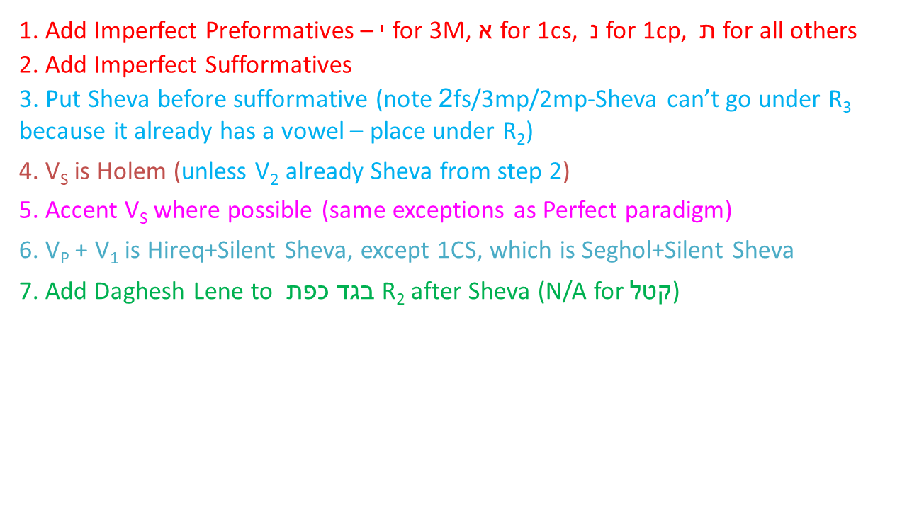

# Qal Imperfect - Strong Verbs {.QI-s}

> To comprehend Biblical Hebrew, we must be able to parse and translate Qal imperfect verbs

In a few lessons, we will learn about the Vav Conjunction.  The Vav Conjunction + the Qal imperfect is the most frequent verb form in the Hebrew Bible, so understanding the imperfect is essential.  Like the Qal Perfect Strong paradigm, we must have robotic-like recall of the Qal Imperfect Strong Paradigm.

<span class="he">וַיֹּאמֶר אֱלֹהִים יְהִי אוֹר וַיְהִי־אוֹר׃</span>

You might recognize this from Genesis 1:3 - "And God said, let there be light; and there was light."  There are three verbs in this short sentence and all three are Qal Imperfect.

::: {.box .map}
LESSON ITINERARY

1. Imperfect is future, modal, or imperfective
1. Components of the Qal Imperfect Strong Paradigm
    1. The Imperfect Preformatives and Sufformatives
    1. The Qal Imerfect Vowels
1. Building the Qal Imerfect Paradigm
1. Deviations from the Strong Paradigm
1. Negative Commands
:::

::: {.box .stop}
<span class="he">EQUIPMENT CHECK<span class="he">

Before continuing, can you describe the following concepts?

The Qal Perfect Strong Paradigm, from memory

:::

## First Thought {-}

### <span class="he">יִ֝שְׁמֹ֗ר כָּל־אָרְחֹתָֽי׃ </span> {-}

*He watches all my paths (Job 33:11)*

There's a story of a small child who was beginning to understand the implications of God's power.  "Do you mean God is watching everything I do?", the child asked with mounting fear.  Her father quickly replied, "God loves you so much, He can't take His eyes of you."

Let that sink in as you study Biblical Hebrew.


<figure>
    <figcaption>Listen to the verse in Hebrew:</figcaption>
    <audio
        controls controlsList="nodownload"
        src="./images/15-02-Job.mp3">
            Your browser does not support the
            <code>audio</code> element.
    </audio>
</figure>


```{r, out.width = "600pt", fig.align='center', fig.cap="Ascent of Adummim Roman road remains - this was the main route from Jericho to Jerusalem in antiquity. It was notoriously trecharous, both in terms of physical exertion, rising 3500 feet in just 15 miles, as well as in terms of physical safety. This latter aspect provided the geographical context of Yeshua's story of the Good Samaritan in Luke 17. Courtesy of the [Pictorial Library of Bible Lands](https://www.bibleplaces.com)"}

knitr::include_graphics("images/15.Ascent of Adummim Roman road remains, tb113006725.jpg")
``` 


## Translating the Imperfect

* The Imperfect has many potential translations
* Watch to see whether the imperfect verb begins a clause as this is a clue
* When the Imperfect does not begin a clause . . .
    * future, "I will run"
    * imperfective, "I am running" or "I was running"
* When the Imperfect begins a clause (and does not have a Vav Consecutive prefix<small>^[<small>An imperfect verb _with_ the Vav Consuctive changes the verb's aspect to Perfect.  We'll study this in Lesson 17.</small>]</small> . . .
    * modal, cohortative: "I should run" or "I might run" or "let us run"
    * modal, jussive: "may he run"
    * We will study the modal forms in greater detail in Lesson 18
* When the imperfect is preceded by <span class="he">לֹא</span> or <span class="he">אַל</span> it is a negative command
    * We'll have more to say about this towards the end of the lesson
    

## The Imperfect Always has a Preformative

* All stems have the same set of preformatives
* The Imperfect is called the Prefix Conjugation
* <span class="he">י</span> for 3ms, 3mp
* <span class="he">א</span> for 1cs
* <span class="he">נ</span> for 1cp
* <span class="he">תּ</span> for everywhere else (3fs,3fp, 2ms, 2fs, 2mp, 2fp)


## Qal Imperfect Vowels

Qal Imperfect strong verbs have a diagnostic $V_P$ + $V_1$ combination

* All QI strong verbs except 1cs begin with Hireq+Silent Shewa
    *  <span class="he">ְ יִ</span> for 3ms, 3mp
    *  <span class="he">ְ נִ</span> for 1cp
    *  <span class="he">ְ תִּ</span> for all others except 1cs
* 1cs begins with Aleph+Seghol+Silent Sheva **ְ אֶ***
* The vowels behave as if they were from the Rule of Sheva (they aren't)

```{r, out.width = "400pt", fig.align='center'}

knitr::include_graphics("images/15-rule-of-sheva.png")
``` 


## Imperfect Sufformatives

* Of the singular forms, only 2fs has a sufformative
    * It is **י ִ***
    * The **ְ תִּ*** preformative with the **י ִ*** sufformative is diagnostic of the QI2fs
* Of the plural forms, only 1cp does NOT have a sufformative
    * 2mp/3mp sufformative - **וּ***
        * Occasionally, there may be what is called a Paragogic Nun, as in **וּן***
        * The ן sometimes causes the shuruk to shorten to a Qubbutz
        * In other words, you may see **יִקְטְלוּ*** or **יִקְטְלוּן*** or **יִקְטְלֻן***.  All three words are QI3mp
    * 2fp/3fp sufformative - **נָה***
    * You'll note that QI2fp and QI3fp are identical.  Context will determine whether the verb is being used in the 3rd person or the 2nd person.  These forms are relatively infrequent.
* There are no "heavy sufformatives" in the Imperfect
    * In fact, the two we studied previously (2mp and 2fp) are the only ones
* The Imperfect is a Finite verb so a Sheva prefers to go before a finite verb sufformative


> Now we're ready to put all this together and learn the Qal Imperfect Strong Paradigm, the samw way we built the Qal Perfect Strong Paradigm!

## Building the Qal Imperfect Strong Paradigm

Study the graphic and the steps below carefully.  It may seem confusing at first but, with practice, you'll get it.  You'll note that the steps work backwards from left to right.


```{r, out.width = "900pt", fig.align='center'}

knitr::include_graphics("images/15.Qal_imperfect_Strong.png")
``` 

```{r, out.width = "600pt", fig.align='center'}


``` 

## Hearing the Qal Imperfect Strong Paradigm

```{r, out.width = "200pt", fig.align='center'}


``` 
<figure>
    <figcaption>Qal Imperfect Strong (Singular) read by Izzy</figcaption>
    <audio
        controls controlsList="nodownload"
        src="./images/15.QIsingularIzzy.mp3">
            Your browser does not support the
            <code>audio</code> element.
    </audio>
</figure>

<figure>
    <figcaption>Qal Imperfect Strong (Plural) read by Izzy</figcaption>
    <audio
        controls controlsList="nodownload"
        src="./images/15.QIpluralIzzy.mp3">
            Your browser does not support the
            <code>audio</code> element.
    </audio>
</figure>
## Worksheets: Qal Imperfect Strong Paradigm {-}

As with Lesson 13 we want you to pause here and do the [Qal Imperfect Strong Paradigm](./images/15_qal_imperfect_strong_paradigm.pdf){target="_blank"}.

> Complete the paradigm from memory at least once, then return here and continue in the guidebook.


Doing the worksheet now will maximize your learning time - in other words, the material that follows in this lesson will make more sense to you if you have the paradigm in your short-term memory.

## Qal Imperfect Strong Examples

* **תִּזְכְּר֔וּ***
    * Preformative: Tav+Hireq+Sheva = QI2xx or QI3Fx
    * Sufformative: Shuruq = I2mp or I3mp
    * Together: QI2mp
    * You will remember
* **יִכְתֹּ֤ב***
    * Preformative: Yod+Hireq+Sheva = QI3mx
    * Sufformative: none = QIxxS or QI1CP
    * Together: QI3ms
    * He will write
* **תִשְׁבַּ֤ת ***
    * Preformative: Tav+Hireq+Sheva = QI2xx or QI3Fx
    * Sufformative: none = QIxxS or QI1CP
    * Together: QI3fs or QI2fs - context will determine which one
    * Context: **לָ֣מָּה תִשְׁבַּ֤ת הַמְּלָאכָה֙*** = Lit: why she will stop, the work" or "Why should the work stop" = the verb is modifying "the work" which is a feminine noun.
    * QI3fs


## Deviations from the Paradigm

* All stative verbs have $V_S$ of Pathach (QI strong paradigm $V_S$ is Holem)
    * This is true in all PGN except where $V_S$ has been replaced by a Sheva (in step 3 of the workflow)
    * **יִגְדַּל*** = he/it will be great or let him/it be great
* 3נ assimilates to a consonant as usual when the sufformative starts with a consonant
    * This happens in the QI(2/3)Pfp
    * **תִּשְׁכֹּנָּה*** = you (fp)/they (f) will dwell
    * Since $V_1$ is a Sheva in the imperfect, 1נ verbs will be affected by this (Lesson 16)
    


## Translating Negative Commands

* An imperfect form that is preceded by a negation is a negative imperative
    * Hebrew has an imperative form (Lesson 18), but this form is not used for negative commends
    * Hebrew has two primary words for negative commands: <span class="he">לֹא</span> and <span class="he">אַל</span>
    * <span class="he">לֹא</span> + imperfect is for permanent prohibitions
        * <span class="he">לֹא תִּרְצָח</span> Thou shalt not murder (Ex 20:13)
    * </span><span class="he"> + jussive (closely related to imperfect) is usually a temporary or circumstantial prohibition
        * <span class="he">אַל־ת־ִשְׁמְעוּ אֶל־דִּבְרֵי נְבִיאֵיצֶם</span> Do not listen to the words of your prophets (Jer 27:16)
        * Jeremiah is not saying don't EVER listen to ANY prophets, but in this circumstance, they were listening to FALSE prophets.  That is what Jeremiah is prohibiting.


## Word Warm-up {-}

[Click to open `Word Warm-up` video in a new tab](https://youtu.be/IA1LEEbvOKw){target="_blank"}


<div class="container">
<iframe class="responsive-iframe" src="https://youtube.com/embed/IA1LEEbvOKw" frameborder="0"></iframe>
</div>


## Verses Warm-up {-}

[Click to open `Verses Warm-up` video in a new tab](https://youtu.be/fellWe2bUt8){target="_blank"}

<div class="container">
<iframe class="responsive-iframe" src="https://youtube.com/embed/fellWe2bUt8" frameborder="0"></iframe>
</div>

## Anki {-}

* `Lesson 15 A. Vocab`
* `Lesson 15 B. Grammar` 
* `Lesson 15 C. Workbook`
* `Lesson 15 D. Study Verses`

## Worksheets: Qal Imperfect Strong Paradigm {-}

> Complete the paradigm from memory at least once, then return here and continue in the guidebook.

[Qal Imperfect Strong Paradigm](15_qal_imperfect_strong_paradigm.pdf){target="_blank"}

## X Ruth Pursuit {-}        

### X Your Quest: {-}

1. Instruction#1 (Yellow)
2. Instruction#2 (Green)
3. Instruction3 (Light Blue)
4. Instruction4 (Pink)
5. Instruction5 (Light Grey)
6. Instruction6 (Red) <!--Try to use darker colors sparingly -->
7. instruction7 (Blue)

* [Blank copy of Ruth 1](https://drive.google.com/file/d/1qcfTKAlTJGChC2eYCMhSbY2w-ibzCcDV/view?usp=sharing){target="_blank"}
* [Ruth Pursuit Answer Key #xx](./images/xx_Ruth_Pursuit_KEY.pdf){target="_blank"}


## Hebrew Quest Study Passage: Proverbs #11-14 {-}

[Blank copy of Proverbs #11-14(https://docs.google.com/document/d/1E1Qbbx3tHw8pOfMSGwQHwD406eHIMd1O5lAS_tDWllE/edit?usp=sharing){target="_blank"}

* DO: `File | Make a copy` to store in your local Google Drive so you can highlight and edit
* DON'T: `Request Edit Access`

1. BEFORE WATCHING THE VIDEO, read through the passage on your own straight through one time - pick up as much as you can
2. Now re-read the passage critically
    1. Highlight any words you do not know and look them up in a [lexicon](https://holylanguage.com/resources-dictionaries.php){target="_blank"}
    2. Parse as many verbs as you can
    3. Sketch out a translation - there is a blank line between each verse
3. Next, using your marked-up copy of the passage, watch Izzy's _Hebrew Quest_ videos (video opens in a new tab)
    1. [Proverbs #11](https://holylanguage.com/proverbs-11.php){target="_blank"}
    1. [Proverbs #12](https://holylanguage.com/proverbs-12.php){target="_blank"}
    1. [Proverbs #13](https://holylanguage.com/proverbs-13.php){target="_blank"}
    1. [Proverbs #14](https://holylanguage.com/proverbs-14.php){target="_blank"}
4. After the video, assess your translation.  How close was it.
5. How did the Ruach HaQodesh speak to you through the passage.

Optionally, as we discussed in Lesson 17, you may complete the passage memorization in the separate `Anki` deck, or in Memrise [here](https://app.memrise.com/course/5406435/hebrew-quest-lessons-1-to-40/##/garden/learn/?source_element=level_details_session&source_screen=level_details){target="_blank}.

## X Quest Quiz {-}

[Open Quest Quiz #xx in a new window](){target="_blank"}

<div class="containerLtr">
<iframe class="responsive-iframe" src="" frameborder="0"></iframe>
</div>

## X Claim your next `Twelve Tribes Badge`! {-}

Check to be sure you have have completed <span class="he">all activities<span class="he"> through this lesson, then fill out the form below.

[Check to be sure you have completed all ACTIVities here](){target="_blank"}, complete the certification below, and your badge will be on its way!

<div class="containerLtr">
<iframe class="responsive-iframe" src="" frameborder="0"></iframe>
</div>


