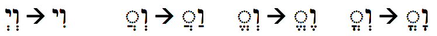

# Vav Consecutive {.wc}

::: {.infobox .sound}
<figure><audio id="myAudio" controls controlsList="nodownload" src="./images/17.intro.m4a">
Your browser does not support the <code>audio</code> element.</audio>
<button onclick="setPlaySpeed25()" type="button">2.5x</button> <button onclick="setPlaySpeed2()" type="button">2x</button> <button onclick="setPlaySpeed15()" type="button">1.5x</button> <button onclick="setPlaySpeed1()" type="button">1x</button> <button onclick="setPlaySpeed075()" type="button">.75x</button> <button onclick="setPlaySpeed05()" type="button">.5x</button> 
<script>
var x = document.getElementById("myAudio");
function setPlaySpeed05() { x.playbackRate = 0.5; x.play();}
function setPlaySpeed075() {x.playbackRate = 0.75; x.play();} 
function setPlaySpeed1() {x.playbackRate = 1; x.play();}
function setPlaySpeed15() {x.playbackRate = 1.5; x.play();} 
function setPlaySpeed2() {x.playbackRate = 2; x.play();} 
function setPlaySpeed25() {x.playbackRate = 2.5;x.play();} 
</script> </figure>
:::

> To understand Biblical Hebrew, we must be able to distinguish the Vav Consecutive from the conjunction Vav and translate accurately.

Way back from Lesson 2 of _Hebrew Quest_, there was a vocabulary word that illustrates the Vav Consecutive: <span class="he">וּכְתְַבְתָּם</span>.

The initial ו means "and", so we might want to say that this word simply means "and you wrote them." In Hebrew, the Vav Consecutive also has a grammatical purpose of changing the verb's meaning from Perfect to Imperfect.  This is true even though it is affixed to a Perfect verb, <span class="he">כָּתַבְתָּ</span> means "you (ms) wrote" (perfect), but putting a ו as prefix changes the meaning to "and you will write" (imperfect).  The opposite happens when the Vav Consecutive is affixed to an Imperfect verb: the resulting word is Perfect (past tense). Less frequently, there are times with the Vav is just a Vav and is not acting as a Consecutive.  We'll learn more about these changes in this Lesson.

The terminology on this topic is a bit fluid. The term "Waw Consecutive" is significantly more prevalent than "Vav Consecutive" in academic circles, so we will still encounter the "w" references frequently in Hebrew grammar materials.


::: {.box .map}
LESSON ITINERARY

1. Qal Perfect + ו 
1. Qal Imperfect + ו
1. Qal Perfect Vav Consecutive
1. Qal Imperfect Vav Consecutive

:::

::: {.box .stop}
EQUIPMENT CHECK

Before continuing, be sure you have the Perfect and Imperfect strong paradigms memorized.

:::

## First Thought {-}


::: {.infobox .sound}
<figure><audio id="myAudio" controls controlsList="nodownload" src="./images/17-13-Numb.mp3">
Your browser does not support the <code>audio</code> element.</audio>
<button onclick="setPlaySpeed25()" type="button">2.5x</button> <button onclick="setPlaySpeed2()" type="button">2x</button> <button onclick="setPlaySpeed15()" type="button">1.5x</button> <button onclick="setPlaySpeed1()" type="button">1x</button> <button onclick="setPlaySpeed075()" type="button">.75x</button> <button onclick="setPlaySpeed05()" type="button">.5x</button> 
<script>
var x = document.getElementById("myAudio");
function setPlaySpeed05() { x.playbackRate = 0.5; x.play();}
function setPlaySpeed075() {x.playbackRate = 0.75; x.play();} 
function setPlaySpeed1() {x.playbackRate = 1; x.play();}
function setPlaySpeed15() {x.playbackRate = 1.5; x.play();} 
function setPlaySpeed2() {x.playbackRate = 2; x.play();} 
function setPlaySpeed25() {x.playbackRate = 2.5;x.play();} 
</script> </figure>
:::

### <span class="he">וַיַּשְׁכִּ֣מוּ בַבֹּ֔קֶר וַיַּֽעֲל֥וּ אֶל־רֹאשׁ־הָהָ֖ר </span> {-}

*In the morning, however, they rose up early and went up to the ridge of the hill country (Numbers 14:40)*

The conjunction ו is a powerful linguistic tool in Scripture.  Later in this lesson, we will study Genesis 1:1-5 from _Hebrew Quest_.  Verse 2 begins with the conjunction prefixed to a noun, while verses 3-5 begin with the "Vav Consecutive", which is to say the letter Vav is prefixed to a verb.

Like the dawning of a new day, after you complete this lesson, most of the verb forms that appear in the Hebrew Scriptures will be opened to you.  We hope you are as excited about taking this new step into a larger world as we are excited for you!


```{r, out.width = "400pt", fig.align='center', fig.cap="Masada sunrise over the Dead Sea. Courtesy of the [Pictorial Library of Bible Lands](https://www.bibleplaces.com)"}


``` 

## _Hebrew Quest_ Qal Vav Consecutive Lecture (from Lesson 14)

View this 2-minute overview video from _Hebrew Quest_ Lesson 14 on Hebrew Qal Vav Consecutive Verbs.  We will break down the concepts Izzy discusses as we progress through this lesson.  


<div class="container">
<iframe class="responsive-iframe" src="https://www.youtube.com/embed/
hfu4gjNo2K4?start=3308&end=3425&rel=0&showinfo=0&autohide=1&autoplay=1" frameborder="0"></iframe>
</div>

[Click to open video in a new tab](https://youtu.be/hfu4gjNo2K4?start=3308){target="_blank"}

## _Hebrew Quest_  Vav Consecutive Lecture (from Lesson 5)

View this 2-minute overview video from _Hebrew Quest_ Lesson 5 on the letter Vav's grammatical function as a consecutive/conversive; that is, changing an imperfect verb to perfect and a perfect verb to imperfect.  


<div class="container">
<iframe class="responsive-iframe" src="https://www.youtube.com/embed/
oZ1VbPCpMvw?start=1508&end=1811&rel=0&showinfo=0&autohide=1&autoplay=1" frameborder="0"></iframe>
</div>

[Click to open video in a new tab](https://youtu.be/oZ1VbPCpMvw?start=1508){target="_blank"}


## Review of the Conjunction Vav from Lesson 5


::: {.infobox .sound}
<figure><audio id="myAudio" controls controlsList="nodownload" src="./images/17.3.m4a">
Your browser does not support the <code>audio</code> element.</audio>
<button onclick="setPlaySpeed25()" type="button">2.5x</button> <button onclick="setPlaySpeed2()" type="button">2x</button> <button onclick="setPlaySpeed15()" type="button">1.5x</button> <button onclick="setPlaySpeed1()" type="button">1x</button> <button onclick="setPlaySpeed075()" type="button">.75x</button> <button onclick="setPlaySpeed05()" type="button">.5x</button> 
<script>
var x = document.getElementById("myAudio");
function setPlaySpeed05() { x.playbackRate = 0.5; x.play();}
function setPlaySpeed075() {x.playbackRate = 0.75; x.play();} 
function setPlaySpeed1() {x.playbackRate = 1; x.play();}
function setPlaySpeed15() {x.playbackRate = 1.5; x.play();} 
function setPlaySpeed2() {x.playbackRate = 2; x.play();} 
function setPlaySpeed25() {x.playbackRate = 2.5;x.play();} 
</script> </figure>
:::


* Usually spelled <span class="he">וְ</span>
* Spelled <span class="he">וּ</span> before פ, מ, ב, or Sheva
* Because the normal spelling contains a Vocal Sheva, the rule of Sheva can cause changes, most commonly <span class="he">וִי</span> or, with a guttural, <span class="he">וַעֲ</span>


```{r, out.width = "600pt", fig.align='center'}


``` 

## Perfect with וְ: Spelling

::: {.infobox .sound}
<figure><audio id="myAudio" controls controlsList="nodownload" src="./images/17.4.m4a">
Your browser does not support the <code>audio</code> element.</audio>
<button onclick="setPlaySpeed25()" type="button">2.5x</button> <button onclick="setPlaySpeed2()" type="button">2x</button> <button onclick="setPlaySpeed15()" type="button">1.5x</button> <button onclick="setPlaySpeed1()" type="button">1x</button> <button onclick="setPlaySpeed075()" type="button">.75x</button> <button onclick="setPlaySpeed05()" type="button">.5x</button> 
<script>
var x = document.getElementById("myAudio");
function setPlaySpeed05() { x.playbackRate = 0.5; x.play();}
function setPlaySpeed075() {x.playbackRate = 0.75; x.play();} 
function setPlaySpeed1() {x.playbackRate = 1; x.play();}
function setPlaySpeed15() {x.playbackRate = 1.5; x.play();} 
function setPlaySpeed2() {x.playbackRate = 2; x.play();} 
function setPlaySpeed25() {x.playbackRate = 2.5;x.play();} 
</script> </figure>
:::

* Always first letter
* Accent shift to ultima in 2ms and 1cs when used as Vav Consecutive

| | QP | add ו 
| :- | :- | :- 
3ms | <span class="he">קָטַל</span> | <span class="he">וְקָטַל</span>
1cs | <span class="he">קָטַ֫לְתִּי</span> | <span class="he">וְקָטַלְתִּ֫י</span>
3cp | <span class="he">קָטְלוּ</span> | <span class="he">וְקָטְ֫לוּ</span>

## Perfect with וְ: Translating

::: {.infobox .sound}
<figure><audio id="myAudio" controls controlsList="nodownload" src="./images/17.5.m4a">
Your browser does not support the <code>audio</code> element.</audio>
<button onclick="setPlaySpeed25()" type="button">2.5x</button> <button onclick="setPlaySpeed2()" type="button">2x</button> <button onclick="setPlaySpeed15()" type="button">1.5x</button> <button onclick="setPlaySpeed1()" type="button">1x</button> <button onclick="setPlaySpeed075()" type="button">.75x</button> <button onclick="setPlaySpeed05()" type="button">.5x</button> 
<script>
var x = document.getElementById("myAudio");
function setPlaySpeed05() { x.playbackRate = 0.5; x.play();}
function setPlaySpeed075() {x.playbackRate = 0.75; x.play();} 
function setPlaySpeed1() {x.playbackRate = 1; x.play();}
function setPlaySpeed15() {x.playbackRate = 1.5; x.play();} 
function setPlaySpeed2() {x.playbackRate = 2; x.play();} 
function setPlaySpeed25() {x.playbackRate = 2.5;x.play();} 
</script> </figure>
:::

* More Common: used as Perfect Vav Consecutive
* Parsing code: Pwc (Perfect Waw Consecutive, also called the `Weqatal` from the 3ms form וְקָטַל)
* Often used for the next event in a future narrative
* Usually translated as IMPERFECT
    * Future: And I will study
    * Modal: And I would/could/should study
    * Imperfective: And I am/was/will be studying
* After an imperative, we usually will translate as another imperative:
    * Go _and_ _study_!
* Less Common (in fact relatively infrequently): translated as the regular perfect (past tense)
    * The Parsing code, in this case, would be the perfect code "+ ו", as in QP3ms + ו
    * The accent MAY be a clue for the 2ms and 1cs
        * <span class="he">וְשָׁמַרְתִּ֫י</span> = QPwc1cs - and I will guard
        * <span class="he">וְשָׁמַ֫רְתִּי</span> = QP1cs + ו - and I guarded
    * Context is a better guide
* For a smoother English translation, the "and" may need to be changed or omitted entirely
    * Hebrew: And I will study and I will run and I will guard
    * English: Then I will study, run, and guard
    

## Imperfect + וְ: Spelling

::: {.infobox .sound}
<figure><audio id="myAudio" controls controlsList="nodownload" src="./images/17.6.m4a">
Your browser does not support the <code>audio</code> element.</audio>
<button onclick="setPlaySpeed25()" type="button">2.5x</button> <button onclick="setPlaySpeed2()" type="button">2x</button> <button onclick="setPlaySpeed15()" type="button">1.5x</button> <button onclick="setPlaySpeed1()" type="button">1x</button> <button onclick="setPlaySpeed075()" type="button">.75x</button> <button onclick="setPlaySpeed05()" type="button">.5x</button> 
<script>
var x = document.getElementById("myAudio");
function setPlaySpeed05() { x.playbackRate = 0.5; x.play();}
function setPlaySpeed075() {x.playbackRate = 0.75; x.play();} 
function setPlaySpeed1() {x.playbackRate = 1; x.play();}
function setPlaySpeed15() {x.playbackRate = 1.5; x.play();} 
function setPlaySpeed2() {x.playbackRate = 2; x.play();} 
function setPlaySpeed25() {x.playbackRate = 2.5;x.play();} 
</script> </figure>
:::

* Always first letter
* Usually spelled וְ
    * On the Perfect, there is no difference between the spelling of the Conjunction and the Vav Consecutive - both are וְ
        * Vav+Vocal Sheva
        * Both forms are also called the `Weqatal` from וְקָטַל
    * On the Imperfect, the CONJUNCTION is spelled, וְ
        * Vav+Vocal Sheva
        * This is QI+ו
        * Also called `W_e_yiqtol` from וְיִקְטֹל
    * The Imperfect Vav CONSECUTIVE is spelled, וַיִּ
        * Vav + Patach + Dagesh Forte
        * This is QIwc
        * Also called `W_a_yiqtol` from וַיִּקְטֹל

| | QI | + ו 
| :- | :- | :- 
3ms | <span class="he">יִקְטֹל</span> | <span class="he">וְיִקְטֹל</span>
1cs | <span class="he">אֶקְטֹל</span> | <span class="he">וְאֶקְטֹל</span>
3cp | <span class="he">יִקְטְלוּ</span> | <span class="he">וְיִקְטְלוּ</span>

## Imperfect with Vav often indicates purpose


::: {.infobox .sound}
<figure><audio id="myAudio" controls controlsList="nodownload" src="./images/17.7.m4a">
Your browser does not support the <code>audio</code> element.</audio>
<button onclick="setPlaySpeed25()" type="button">2.5x</button> <button onclick="setPlaySpeed2()" type="button">2x</button> <button onclick="setPlaySpeed15()" type="button">1.5x</button> <button onclick="setPlaySpeed1()" type="button">1x</button> <button onclick="setPlaySpeed075()" type="button">.75x</button> <button onclick="setPlaySpeed05()" type="button">.5x</button> 
<script>
var x = document.getElementById("myAudio");
function setPlaySpeed05() { x.playbackRate = 0.5; x.play();}
function setPlaySpeed075() {x.playbackRate = 0.75; x.play();} 
function setPlaySpeed1() {x.playbackRate = 1; x.play();}
function setPlaySpeed15() {x.playbackRate = 1.5; x.play();} 
function setPlaySpeed2() {x.playbackRate = 2; x.play();} 
function setPlaySpeed25() {x.playbackRate = 2.5;x.play();} 
</script> </figure>
:::

* Instead of "and", translate, "so that...may"
    * "Shall I go call a Hebrew nurse SO THAT she MAY nurse the child for you?" (Ex 2:7)
    * "Let's make a tower...SO THAT we MAY make a name for ourselves." (Gen 11:4)
* Regular imperfect translations are possible 

## Imperfect Vav Consecutive: Spelling (Strong)


::: {.infobox .sound}
<figure><audio id="myAudio" controls controlsList="nodownload" src="./images/17.8.m4a">
Your browser does not support the <code>audio</code> element.</audio>
<button onclick="setPlaySpeed25()" type="button">2.5x</button> <button onclick="setPlaySpeed2()" type="button">2x</button> <button onclick="setPlaySpeed15()" type="button">1.5x</button> <button onclick="setPlaySpeed1()" type="button">1x</button> <button onclick="setPlaySpeed075()" type="button">.75x</button> <button onclick="setPlaySpeed05()" type="button">.5x</button> 
<script>
var x = document.getElementById("myAudio");
function setPlaySpeed05() { x.playbackRate = 0.5; x.play();}
function setPlaySpeed075() {x.playbackRate = 0.75; x.play();} 
function setPlaySpeed1() {x.playbackRate = 1; x.play();}
function setPlaySpeed15() {x.playbackRate = 1.5; x.play();} 
function setPlaySpeed2() {x.playbackRate = 2; x.play();} 
function setPlaySpeed25() {x.playbackRate = 2.5;x.play();} 
</script> </figure>
:::

* Vav + Patach + Dagesh Forte
    * Similar to the independent preposition with the definite article
    * In the 1cs form, the Aleph preformative rejects the Dagesh, resulting in Compensatory Lengthening
* This is also called `Wayiqtol` from וַיִּקְטֹל

| | QI | QIwc
| :- | :- | :- 
3ms | <span class="he">יִקְטֹל</span> | <span class="he">וַיִּקְטֹל</span>
1cs | <span class="he">אֶקְטֹל</span> | <span class="he">וָאֶקְטֹל</span>
3cp | <span class="he">יִקְטְלוּ</span> | <span class="he">וַיִּקְטְלוּ</span>


## Imperfect Vav Consecutive: Spelling (Weak)


::: {.infobox .sound}
<figure><audio id="myAudio" controls controlsList="nodownload" src="./images/17.9.m4a">
Your browser does not support the <code>audio</code> element.</audio>
<button onclick="setPlaySpeed25()" type="button">2.5x</button> <button onclick="setPlaySpeed2()" type="button">2x</button> <button onclick="setPlaySpeed15()" type="button">1.5x</button> <button onclick="setPlaySpeed1()" type="button">1x</button> <button onclick="setPlaySpeed075()" type="button">.75x</button> <button onclick="setPlaySpeed05()" type="button">.5x</button> 
<script>
var x = document.getElementById("myAudio");
function setPlaySpeed05() { x.playbackRate = 0.5; x.play();}
function setPlaySpeed075() {x.playbackRate = 0.75; x.play();} 
function setPlaySpeed1() {x.playbackRate = 1; x.play();}
function setPlaySpeed15() {x.playbackRate = 1.5; x.play();} 
function setPlaySpeed2() {x.playbackRate = 2; x.play();} 
function setPlaySpeed25() {x.playbackRate = 2.5;x.play();} 
</script> </figure>
:::

* 3ה verbs drop the ending
* Biconsonantal verbs can change middle vowel
* Some other verbs change stem vowel to Seghol

|3ms | QI | QIwc
| :- | :- | :- 
3ה | <span class="he">יִבְנֶה</span> | <span class="he">וַיִּבֶן</span>
Bicons | <span class="he">יָקוּם</span> | <span class="he">וַיָּקָם</span>
Seghol | <span class="he">יֹאמַר</span> | <span class="he">וַיֹּ֫אמֶר</span>

## Imperfect Vav Consecutive: Translation

::: {.infobox .sound}
<figure><audio id="myAudio" controls controlsList="nodownload" src="./images/17.10.m4a">
Your browser does not support the <code>audio</code> element.</audio>
<button onclick="setPlaySpeed25()" type="button">2.5x</button> <button onclick="setPlaySpeed2()" type="button">2x</button> <button onclick="setPlaySpeed15()" type="button">1.5x</button> <button onclick="setPlaySpeed1()" type="button">1x</button> <button onclick="setPlaySpeed075()" type="button">.75x</button> <button onclick="setPlaySpeed05()" type="button">.5x</button> 
<script>
var x = document.getElementById("myAudio");
function setPlaySpeed05() { x.playbackRate = 0.5; x.play();}
function setPlaySpeed075() {x.playbackRate = 0.75; x.play();} 
function setPlaySpeed1() {x.playbackRate = 1; x.play();}
function setPlaySpeed15() {x.playbackRate = 1.5; x.play();} 
function setPlaySpeed2() {x.playbackRate = 2; x.play();} 
function setPlaySpeed25() {x.playbackRate = 2.5;x.play();} 
</script> </figure>
:::

### Usually, translate Iwc as PAST TENSE {-}

* Often used for the next event in a past-time narrative
    * AND GOD SAID (QIwc3ms)...AND THERE WAS (QIwc3ms)
* In a narrative sequence of verbs, the second (and following) verb uses the opposite form from what we might expect:
    * Iwc in a PAST narrative
        * He did X (the first verb will be P), and then he did Y (the next verb is Iwc), and then he did Z (Iwc)
    * Pwc in a FUTURE narrative
        * He will do X (the first verb is I), then he will do Y (the next verb is Pwc)
* We will explore additional uses in Lesson 23

## Vav Consecutive Summary


::: {.infobox .sound}
<figure><audio id="myAudio" controls controlsList="nodownload" src="./images/17.11.m4a">
Your browser does not support the <code>audio</code> element.</audio>
<button onclick="setPlaySpeed25()" type="button">2.5x</button> <button onclick="setPlaySpeed2()" type="button">2x</button> <button onclick="setPlaySpeed15()" type="button">1.5x</button> <button onclick="setPlaySpeed1()" type="button">1x</button> <button onclick="setPlaySpeed075()" type="button">.75x</button> <button onclick="setPlaySpeed05()" type="button">.5x</button> 
<script>
var x = document.getElementById("myAudio");
function setPlaySpeed05() { x.playbackRate = 0.5; x.play();}
function setPlaySpeed075() {x.playbackRate = 0.75; x.play();} 
function setPlaySpeed1() {x.playbackRate = 1; x.play();}
function setPlaySpeed15() {x.playbackRate = 1.5; x.play();} 
function setPlaySpeed2() {x.playbackRate = 2; x.play();} 
function setPlaySpeed25() {x.playbackRate = 2.5;x.play();} 
</script> </figure>
:::

The chart below summarizes the four different types of Vav verbal prefixes:

| Hebrew | Description | Also known as | Shorthand | Usually Translate as
| :- | :- | :- | :- | :-
<span class="he">וְקָטַל</span> | Qal Perfect + ו | Weqatal | QP + ו | Perfect 
<span class="he">וְיִקְטֹל</span> | Qal Imperfect + ו | Weyiqtol | QI + ו | Purpose/Intent
<span class="he">וְקָטַל</span> | Qal Perfect Vav Consecutive  | Weqatal | QPwc | Imperfect
<span class="he">יַיִּקְטֹל</span> | Qal Imperfect Vav Consecutive  | Wayyiqtol | QIwc | Perfect


* Iwc is most common <span class="he">וַיִּקְטֹל</span>
* Pwc is next <span class="he">וְקָטֹל</span>
* P+ו and I+ו are relatively uncommon
* Reading practice is the key to demystifying these verbal Vav forms

## Word Warm-up {-}

<div class="container">
<iframe class="responsive-iframe" src="https://youtube.com/embed/_usEc7vYIXI" frameborder="0"></iframe>
</div>

[Click to open `Word Warm-up` video in a new tab](https://youtu.be/_usEc7vYIXI){target="_blank"}


## Verses Warm-up {-}

<div class="container">
<iframe class="responsive-iframe" src="https://youtube.com/embed/mfNf7nNcRPA" frameborder="0"></iframe>
</div>

[Click to open `Verses Warm-up` video in a new tab](https://youtu.be/mfNf7nNcRPA){target="_blank"}

## Worksheet: Qal Vav-Consecutive Paradigms {-}

Write the paradigm until you can complete it correctly at least once. Focus on using the rules we have studied rather than forced memorization of the paradigm.

[Qal Vav-consecutive Paradigms](images/17_qal_waw-consecutive_paradigms.pdf){target="_blank"}

## Ruth Pursuit {-}   

::: {.box .map} 
YOUR QUEST

1. Identify and translate the Qal Vav Consecutive Verbs below from verses 1-5. Be sure to look up any unfamiliar words
    * היה QIwc3ms x2
    * הלך QIwc3ms
    * בוא QIwc3mp
    * היה QIwc3mp
    * מות QIwc3ms
    * נשׂא QIwc3mp
    * ישׁב QIwc3mp
    * מות QIwc3mp

2. Identify, parse, and translate all remaining Qal Vav Consecutive verbs in verses 6-22
    * There is one QPwc, and the rest are QIwc
    * As needed, break down the preformatives and sufformatives and identify the lexical form to look up its meaning
    * For completeness, we will note the instances of <span class="he">וַתֹּאמֶר</span> in gray on the answer key

:::

* [Blank copy of Ruth 1](https://docs.google.com/document/d/1bcT1J-fcVmD1Zn5Jk2nj0560tEddcgtbYZLkwaVVuyE/copy){target="_blank"}
* [Ruth Pursuit Answer Key #17](./images/17_Ruth_Pursuit_KEY.pdf){target="_blank"}


## Honors Track: _Hebrew Quest_ Study Passage: Genesis 1:1-5 {-}

With this lesson, we move away from the selected verses in Proverbs to lengthier study passages.

::: {.box .map}
YOUR HEBREW QUEST:

1. Read the passage - [Blank copy of Genesis 1:1-5](https://docs.google.com/document/d/1FIQAtWfWlrWmzX5pKR6esRLzJKFdv5Szx3mb5_zWwLg/copy){target="_blank"}, or you may use your copy from Lesson 6
2. Now re-read the passage critically, highlighting ([lexicon here](https://holylanguage.com/resources-dictionaries.php){target="_blank"} and translating (you will need to parse verbs to translate)
3. [Watch Izzy's _Hebrew Quest_ video (video opens in a new tab)](https://holylanguage.com/genesis-1.php){target="_blank"}
    * Though we would encourage viewing the entire segment, since you already reviewed Genesis 1:1 back in Lesson 6, you can start with Genesis 1:2 at the 46:50 mark
4. After the video, assess your translation.  How close was it?
5. How did the Ruach HaKodesh speak to you through the passage?

:::

::: {.box .info}
MEMRISE

* If your goal is to simultaneously complete both _Hebrew Quest_ and Hebrew GRAMMAR Quest, you may wish to complete the associated _Hebrew Quest_ passage memorization in Memrise
* The Genesis passage begins in [Memrise Level 17](https://app.memrise.com/course/5406435/hebrew-quest-lessons-1-to-40/17/garden/learn/?source_element=level_details_session&source_screen=level_details){target="_blank}
    * Note that the Memrise work may contain vocabulary and passages in addition to the study passage (for example, Names of God, Titles of Messiah, Terms of Love/Friendship, and Proverbs)
* Although the majority of time in each _Hebrew Quest_ lesson is spent on the Study Passages, be sure to set aside time to watch the lesson's video in its entirety to meet the _Hebrew Quest_ Graduation requirements (also be sure to complete any videos/Memrise modules for Lessons 1-16 that you have not completed)
* See additional resources on the Holylanguage.com page:
    * [Hebrew Quest Overview](https://holylanguage.com/quest.html){target="_blank"}
    * [Hebrew Quest Graduation](https://holylanguage.com/graduate.html){target="_blank"}
    * [Memrise](https://holylanguage.com/memrise.html){target="_blank"}
:::

## Lesson Extras {-}

* [Dr. Beckman Lecture Video](http://youtu.be/mHf7IQGPWyM){target=“_blank”}
* [Dr. Beckman Lecture Notes](https://hebrewsyntax.org/bbh2new/17_overheads_bw.pdf){target=“_blank”}
* [BBH Lesson Summary](http://hebrew.billmounce.com/BasicsBiblicalHebrew-17.pdf){target=“_blank”}
* [BBH Study Verses PDF](http://hebrew.billmounce.com/Biblical_examples_17.pdf){target=“_blank”}
* [Paradigm PDF](https://hebrewsyntax.org/bbh2new/17_qal_waw-consecutive_paradigms.pdf){target=“_blank”}
* Additional Drills/Worksheets 
    * [Quiz a](https://hebrewsyntax.org/bbh2new/17_quiz_new.pdf){target=“_blank”}
    * [Quiz b](https://hebrewsyntax.org/bbh2new/17_quiz_practice.pdf){target=“_blank”}

As Lesson 17 marks the end of the 1st semester in a traditional academic course, Dr. Beckman has additional cumulative review materials.

[Summary Study Guide](https://hebrewsyntax.org/bbh2new/17x_Hebrew1_summary_study_guide.pdf){target=“_blank”}  (_Note: Most of this material is contained in our Hebrew GRAMMAR Quest `Anki` cards._)
 
* Additional Drills/Worksheets/Practice Exams
    * [Quiz](https://hebrewsyntax.org/bbh2new/17_quiz_vocab.pdf){target=“_blank”}
     *[Quiz Paradigms](https://hebrewsyntax.org/bbh2new/17_quiz_paradigms.pdf){target=“_blank”}
    * [Quiz QI Preformatives](https://hebrewsyntax.org/bbh2new/17_quiz_paradigms_QI-begins.pdf){target=“_blank”}
    * [Quiz Parsing](https://hebrewsyntax.org/bbh2new/17_quiz_parsing.pdf){target=“_blank”}
    * [Quiz Translation](https://hebrewsyntax.org/bbh2new/17_quiz_translation.pdf){target=“_blank”}
    * [Practice final exam 1](https://hebrewsyntax.org/bbh2new/17x_Hebrew_1_final_1.pdf){target=“_blank”}
        * [Final exam 1 answer key](https://hebrewsyntax.org/bbh2new/17x_Hebrew_1_final_1_answers.pdf){target=“_blank”}
        * [Final exam 1 explanations](https://hebrewsyntax.org/bbh2new/17x_Hebrew_1_final_1_explanations.pdf){target=“_blank”}
    * [Practice final exam 2](https://hebrewsyntax.org/bbh2new/17x_Hebrew_1_final_2.pdf){target=“_blank”}
        * [Final exam 2 answer key](https://hebrewsyntax.org/bbh2new/17x_Hebrew_1_final_2_answers.pdf){target=“_blank”}
    * [Practice final exam 3](https://hebrewsyntax.org/bbh2new/17x_Hebrew_1_final_3.pdf){target=“_blank”}
        * [Final exam 3 answer key](https://hebrewsyntax.org/bbh2new/17x_Hebrew_1_final_3_answers.pdf){target=“_blank”}
    * [Practice final exam 4:](https://hebrewsyntax.org/bbh2new/17x_Hebrew_1_final_4.pdf){target=“_blank”}
        * [Final exam 4 answer key](https://hebrewsyntax.org/bbh2new/17x_Hebrew_1_final_4_answers.pdf){target=“_blank”}
    * [Practice final exam 5](https://hebrewsyntax.org/bbh2new/17x_Hebrew_1_final_5.pdf){target=“_blank”}
        * [Final exam 5 answer key](https://hebrewsyntax.org/bbh2new/17x_Hebrew_1_final_5_answers.pdf){target=“_blank”}

