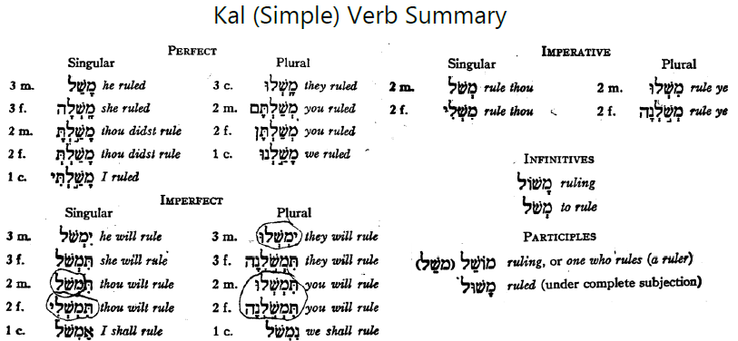

# Qal Participle and Qal Summary {.QPt}

::: {.infobox .sound}
<figure><audio id="myAudio" controls controlsList="nodownload" src="./images/22.intro.m4a">
Your browser does not support the <code>audio</code> element.</audio>
<button onclick="setPlaySpeed25()" type="button">2.5x</button> <button onclick="setPlaySpeed2()" type="button">2x</button> <button onclick="setPlaySpeed15()" type="button">1.5x</button> <button onclick="setPlaySpeed1()" type="button">1x</button> <button onclick="setPlaySpeed075()" type="button">.75x</button> <button onclick="setPlaySpeed05()" type="button">.5x</button> 
<script>
var x = document.getElementById("myAudio");
function setPlaySpeed05() { x.playbackRate = 0.5; x.play();}
function setPlaySpeed075() {x.playbackRate = 0.75; x.play();} 
function setPlaySpeed1() {x.playbackRate = 1; x.play();}
function setPlaySpeed15() {x.playbackRate = 1.5; x.play();} 
function setPlaySpeed2() {x.playbackRate = 2; x.play();} 
function setPlaySpeed25() {x.playbackRate = 2.5;x.play();} 
</script> </figure>
:::


Participles are verbal adjectives.  For Hebrew, this means:

* Participles inflect like adjectives: MS, FS, MP, and FP
* Participles are used like adjectives: attributively, predicatively, and substantively


::: {.box .map}
__LESSON ITINERARY__

1. Meaning of the Qal Participle
1. Spelling of the Qal Participle

:::

::: {.box .stop}
__EQUIPMENT CHECK__

Before continuing, can you describe the following concepts?

* The three ways an adjective can be used
* The four ways adjectives can inflect for person and number

As needed, review [Lesson 7 on Adjectives](#adjectives) prior to beginning Lesson 22

:::

##  First Thought {-}

::: {.infobox .sound}
<figure><audio id="myAudio" controls controlsList="nodownload" src="./images/22-10.Psalms 9.11.mp3">
Your browser does not support the <code>audio</code> element.</audio>
<button onclick="setPlaySpeed25()" type="button">2.5x</button> <button onclick="setPlaySpeed2()" type="button">2x</button> <button onclick="setPlaySpeed15()" type="button">1.5x</button> <button onclick="setPlaySpeed1()" type="button">1x</button> <button onclick="setPlaySpeed075()" type="button">.75x</button> <button onclick="setPlaySpeed05()" type="button">.5x</button> 
<script>
var x = document.getElementById("myAudio");
function setPlaySpeed05() { x.playbackRate = 0.5; x.play();}
function setPlaySpeed075() {x.playbackRate = 0.75; x.play();} 
function setPlaySpeed1() {x.playbackRate = 1; x.play();}
function setPlaySpeed15() {x.playbackRate = 1.5; x.play();} 
function setPlaySpeed2() {x.playbackRate = 2; x.play();} 
function setPlaySpeed25() {x.playbackRate = 2.5;x.play();} 
</script> </figure>
:::

###  <span class="he">וְיִבְטְח֣וּ בְ֭ךָ יוֹדְעֵ֣י שְׁמֶ֑ךָ כִּ֤י לֹֽא־עָזַ֖בְתָּ דֹרְשֶׁ֣יךָ יְהוָֽה׃ </span> {-}

*And those who know Your name will put their trust in You, For You, O LORD, have not forsaken those who seek You. (Psalms 9:11)*

Our _Hebrew Quest_ study passage for this lesson is Matthew 13 and the parable of the sower. Yeshua clarifies that the "good soil" is someone who hears the word, understands it, and then does something with it.  In contrast, the soil among the thorns is someone who hears the word but doesn't fully trust in Adonai or his promises.  We see one of these promises in Psalms 9:11.

It's become a cliche for Bible teachers to ask, "which of the four soils are you?"  In truth, for most of us, our lives at some point have reflected each of four soils.  So the better question to ask might be:

> "Today, in the next 1440 minutes, how can I make sure that I am the 'good soil', trusting in Adonai, and producing a yield for the Kingdom?"


```{r, out.width = "400pt", fig.align='center', fig.cap="Cove of the Sower from the east. This is the suggested location of Yeshua's teaching we call 'The Parable of the Sower' (Matthew 13). This region's acoustic properties have been analyzed.  Scientists found that a person could be in a boat a few feet from the shore and easily be heard without amplification by ‘large crowds’ scattered several hundred feet up the embankment.  Courtesy of the [Pictorial Library of Bible Lands](https://www.bibleplaces.com)"}

knitr::include_graphics("images/22_Cove of the Sower from east, tb112000201.jpg")
``` 

## _Hebrew Quest_ Qal Participles Lecture


::: {.infobox .sound}
<figure>Click to play the audio from the Hebrew Quest segment. <audio id="myAudio" controls controlsList="nodownload" 
src="./images/22.1.m4a">
Your browser does not support the <code>audio</code> element.</audio><button onclick="x25()" type="button">2.5x</button><button onclick="x2()" type="button">2x</button><button onclick="x15()" type="button">1.5x</button><button onclick="x1()" type="button">1x</button><button onclick="x075()" type="button">.75x</button><button onclick="x05()" type="button">.5x</button><script>
var x = document.getElementById("myAudio");
function x05() { 
    x.playbackRate = 0.5;
    x.play();}
function x075() { 
    x.playbackRate = 0.75;
    x.play();} 
function x1() { 
    x.playbackRate = 1;
     x.play();}
function x15() { 
    x.playbackRate = 1.5;
     x.play();} 
function x2() { 
    x.playbackRate = 2;
     x.play();} 
function x25() { 
    x.playbackRate = 2.5;
     x.play(); } 
</script></figure>
:::

View this 1-minute overview video from _Hebrew Quest_ on Hebrew Qal Participle Verbs. 

<div class="container">
<iframe class="responsive-iframe" src="https://www.youtube.com/embed/
hfu4gjNo2K4?start=3668&end=3737&rel=0&showinfo=0&autohide=1&autoplay=1" frameborder="0"></iframe>
</div>

[Click to open video in a new tab](https://youtu.be/hfu4gjNo2K4?start=3668){target="_blank"}

* Start 1:01:08
* End 1:02:04

## Participles are Verbal Adjectives

::: {.infobox .sound}
<figure><audio id="myAudio" controls controlsList="nodownload" src="./images/22.2.m4a">
Your browser does not support the <code>audio</code> element.</audio>
<button onclick="setPlaySpeed25()" type="button">2.5x</button> <button onclick="setPlaySpeed2()" type="button">2x</button> <button onclick="setPlaySpeed15()" type="button">1.5x</button> <button onclick="setPlaySpeed1()" type="button">1x</button> <button onclick="setPlaySpeed075()" type="button">.75x</button> <button onclick="setPlaySpeed05()" type="button">.5x</button> 
<script>
var x = document.getElementById("myAudio");
function setPlaySpeed05() { x.playbackRate = 0.5; x.play();}
function setPlaySpeed075() {x.playbackRate = 0.75; x.play();} 
function setPlaySpeed1() {x.playbackRate = 1; x.play();}
function setPlaySpeed15() {x.playbackRate = 1.5; x.play();} 
function setPlaySpeed2() {x.playbackRate = 2; x.play();} 
function setPlaySpeed25() {x.playbackRate = 2.5;x.play();} 
</script> </figure>
:::

* Participles are non-finite because they do not have 1st, 2nd, or 3rd person
* Since Participles are adjectives, the DO inflect for gender and number
    * They use the same adjectival endings we learned many lessons ago: MS, FS, MP, FP
    * They are used as adjectives
        * Attributive: I saw running water
            * Match the noun in gender, number, and definiteness
            * Attributive Always After (the noun), Article Always Agrees (with definiteness of noun)
        * Predicative: The water is running
            * Matches the subject in gender and number, but not definiteness
            * Predicate dePrived of the Article, Perhaps Precedes (the noun)
        * Substantival: running is good exercise
            * Has the gender and number of the noun it is replacing

::: {.box .info}
Review [Lesson 7](#adjectives) if you need a review on adjectives
:::

## Qal Active and Passive Participles

::: {.infobox .sound}
<figure><audio id="myAudio" controls controlsList="nodownload" src="./images/22.3.m4a">
Your browser does not support the <code>audio</code> element.</audio>
<button onclick="setPlaySpeed25()" type="button">2.5x</button> <button onclick="setPlaySpeed2()" type="button">2x</button> <button onclick="setPlaySpeed15()" type="button">1.5x</button> <button onclick="setPlaySpeed1()" type="button">1x</button> <button onclick="setPlaySpeed075()" type="button">.75x</button> <button onclick="setPlaySpeed05()" type="button">.5x</button> 
<script>
var x = document.getElementById("myAudio");
function setPlaySpeed05() { x.playbackRate = 0.5; x.play();}
function setPlaySpeed075() {x.playbackRate = 0.75; x.play();} 
function setPlaySpeed1() {x.playbackRate = 1; x.play();}
function setPlaySpeed15() {x.playbackRate = 1.5; x.play();} 
function setPlaySpeed2() {x.playbackRate = 2; x.play();} 
function setPlaySpeed25() {x.playbackRate = 2.5;x.play();} 
</script> </figure>
:::

* The Qal (and only the Qal) stem has both active and passive particles
* Active: 
    * Parsing code QPtms - Qal Participle masculine singular (no need to say "active")
    * "He who blesses"
* Passive: 
    * Parsing code QPpMS - Qal Passive Participle Masculine Singular (important to denote "passive")
    * "Blessed are you"

## Qal Participle Spelling


::: {.infobox .sound}
<figure><audio id="myAudio" controls controlsList="nodownload" src="./images/22.4.m4a">
Your browser does not support the <code>audio</code> element.</audio>
<button onclick="setPlaySpeed25()" type="button">2.5x</button> <button onclick="setPlaySpeed2()" type="button">2x</button> <button onclick="setPlaySpeed15()" type="button">1.5x</button> <button onclick="setPlaySpeed1()" type="button">1x</button> <button onclick="setPlaySpeed075()" type="button">.75x</button> <button onclick="setPlaySpeed05()" type="button">.5x</button> 
<script>
var x = document.getElementById("myAudio");
function setPlaySpeed05() { x.playbackRate = 0.5; x.play();}
function setPlaySpeed075() {x.playbackRate = 0.75; x.play();} 
function setPlaySpeed1() {x.playbackRate = 1; x.play();}
function setPlaySpeed15() {x.playbackRate = 1.5; x.play();} 
function setPlaySpeed2() {x.playbackRate = 2; x.play();} 
function setPlaySpeed25() {x.playbackRate = 2.5;x.play();} 
</script> </figure>
:::
* Participles use adjective endings and can appear in Absolute or Construct forms
* Active
    * $V_1 = \bar O$ defective: Holem (more common than plene Holem+Vav)
      * Every form except biconsonantal (which has $V_1 = \bar A$ (Qamets))
    * $V_2$ 
      * Usually $\bar E$ for Masculine singular: <span class="he">קֹטֵל</span>
      * Reduces before adjective endings
        * MP - <span class="he">קֹטְלִים</span>
        * FP - <span class="he">קֹטְלוֹת</span>
    * Two Feminine Singular variations
      * Seghol+Tav - <span class="he">קֹטֶ֫לֶת</span> - MORE COMMON
      * Qamets+Hei - <span class="he">קֹטְלָה</span> - Less common
* Passive: 
    * Every QPp as $V_2 = \hat U$ plene: Shureq (more common than defective Qibbuts)
    * Since $V_2 = \hat U$ it can't reduce; therefore $V_1$ will reduce before adjective endings
    * No FS "T" form

| |Abs | Con
| :- | :- | :-
QPtMS | <span class="he">קֹטֵל</span> | <span class="he">קֹטֵל</span>
QPtFS | <span class="he">קֹטֶ֫לֶת</span> or <span class="he">קֹטְלָה</span> | <span class="he">קֹטְלַת</span>
QPtMP | <span class="he">קֹטְלִים</span> | <span class="he">קֹטְלֵי</span>
QPtFp | <span class="he">קֹטְלוֹת</span> | <span class="he">קֹטְלוֹת</span>
| | |
QPpMS | <span class="he">קָטוּל</span> | <span class="he">קְטוּל</span> 
QPpFS | <span class="he">קְטוּלָה</span> | <span class="he">קְטוַּת</span> 
QPpMP | <span class="he">קְטוּלִים</span> | <span class="he">קְטוּלֵי</span> 
QPpFP | <span class="he">קְטוּלוֹת</span> | <span class="he">קְטוּלוֹת</span> 

## Prefixes and Suffixes

::: {.infobox .sound}
<figure><audio id="myAudio" controls controlsList="nodownload" src="./images/22.5.m4a">
Your browser does not support the <code>audio</code> element.</audio>
<button onclick="setPlaySpeed25()" type="button">2.5x</button> <button onclick="setPlaySpeed2()" type="button">2x</button> <button onclick="setPlaySpeed15()" type="button">1.5x</button> <button onclick="setPlaySpeed1()" type="button">1x</button> <button onclick="setPlaySpeed075()" type="button">.75x</button> <button onclick="setPlaySpeed05()" type="button">.5x</button> 
<script>
var x = document.getElementById("myAudio");
function setPlaySpeed05() { x.playbackRate = 0.5; x.play();}
function setPlaySpeed075() {x.playbackRate = 0.75; x.play();} 
function setPlaySpeed1() {x.playbackRate = 1; x.play();}
function setPlaySpeed15() {x.playbackRate = 1.5; x.play();} 
function setPlaySpeed2() {x.playbackRate = 2; x.play();} 
function setPlaySpeed25() {x.playbackRate = 2.5;x.play();} 
</script> </figure>
:::

* Like any adjective, the conjunction, the definite article, the interrogative particle, and prepositions can be added to Participles
    * Infinitive constructs and participles are the only verb conjugations that can take a prefixed preposition
* Type 1 pronominal suffixes may be added to singular participles
* Type 2 pronominal suffixes may be added to plural participles


## Biconsonantal 

::: {.infobox .sound}
<figure><audio id="myAudio" controls controlsList="nodownload" src="./images/22.6.m4a">
Your browser does not support the <code>audio</code> element.</audio>
<button onclick="setPlaySpeed25()" type="button">2.5x</button> <button onclick="setPlaySpeed2()" type="button">2x</button> <button onclick="setPlaySpeed15()" type="button">1.5x</button> <button onclick="setPlaySpeed1()" type="button">1x</button> <button onclick="setPlaySpeed075()" type="button">.75x</button> <button onclick="setPlaySpeed05()" type="button">.5x</button> 
<script>
var x = document.getElementById("myAudio");
function setPlaySpeed05() { x.playbackRate = 0.5; x.play();}
function setPlaySpeed075() {x.playbackRate = 0.75; x.play();} 
function setPlaySpeed1() {x.playbackRate = 1; x.play();}
function setPlaySpeed15() {x.playbackRate = 1.5; x.play();} 
function setPlaySpeed2() {x.playbackRate = 2; x.play();} 
function setPlaySpeed25() {x.playbackRate = 2.5;x.play();} 
</script> </figure>
:::

* QPt $V_1 = \bar A$ (Qamets) - always - DOES NOT REDUCE
    * Irregular: <span class="he">מוּת</span> becomes <span class="he">מֵת</span> in Qpt
* QPp $V_1 = \hat U$ or the lexical vowel $\hat I$ (Hireq+Yod)
* Ambiguities
    * <span class="he">קָם</span> - QP3ms, QPtMS
    * <span class="he">בּוֹא</span> - QM2ms, Q∞, QA
    * <span class="he">קָמָה</span> is QPtFS, but <span class="he">קָ֫מָה</span> (note accent) is QP3fs
    
## 3ה 

::: {.infobox .sound}
<figure><audio id="myAudio" controls controlsList="nodownload" src="./images/22.7.m4a">
Your browser does not support the <code>audio</code> element.</audio>
<button onclick="setPlaySpeed25()" type="button">2.5x</button> <button onclick="setPlaySpeed2()" type="button">2x</button> <button onclick="setPlaySpeed15()" type="button">1.5x</button> <button onclick="setPlaySpeed1()" type="button">1x</button> <button onclick="setPlaySpeed075()" type="button">.75x</button> <button onclick="setPlaySpeed05()" type="button">.5x</button> 
<script>
var x = document.getElementById("myAudio");
function setPlaySpeed05() { x.playbackRate = 0.5; x.play();}
function setPlaySpeed075() {x.playbackRate = 0.75; x.play();} 
function setPlaySpeed1() {x.playbackRate = 1; x.play();}
function setPlaySpeed15() {x.playbackRate = 1.5; x.play();} 
function setPlaySpeed2() {x.playbackRate = 2; x.play();} 
function setPlaySpeed25() {x.playbackRate = 2.5;x.play();} 
</script> </figure>
:::
* The "third" ה drops in all forms of the Qpt
  * In the MS, it is replaced by Seghol+Hei - <span class="he">בֹּנֶה</span>
    * Although the final vowel is shared with the Imperfect, the Pt will never have an imperfect preformative
    * Thus, there is little risk of confusing a 3ה Imperfect with a 3ה Participle
  * In the FS, it is replaced by $\hat A$ (Qamets+Hei) - <span class="he">בֹּנָה</span> (the Tsere+Tav form $\nexists$))
  * There is no vowel letter ה ִ in the plural forms
* The Yod reappears as $R_3$ in all forms of the QPp (and the non "T" form of QPtFS)
  * <span class="he">בָּנוּי</span>

### We can now complete our 3ה $V_2$ table {-}


| Conj | Hebrew | Vowel
| :- | :- | :-
| P | <span class="he">בָּנָה</span> | Qamets+Hei
| I | <span class="he">יִבְנֶה</span> | Seghol+Hei
| M | <span class="he">בְּנֵה</span> | Tsere+Hei
| ∞ | <span class="he">בְּנוֹת</span> | Holem+Vav Tav
| A | <span class="he">בָנֹה</span> or <span class="he">בָנוֹ</span> | Holem+Hei or Holem+Vav
| Pt | <span class="he">בֹּנֶה</span> | Seghol+Hei

::: {.box .map}
MEMORIZE THE 3ה ENDINGS

* As we get ready to journey into Unit 4, this table will be your friend!
* These endings are the same throughout all the derived stems  
:::

## Stem Comparison Table

::: {.infobox .sound}
<figure><audio id="myAudio" controls controlsList="nodownload" src="./images/22.8.m4a">
Your browser does not support the <code>audio</code> element.</audio>
<button onclick="setPlaySpeed25()" type="button">2.5x</button> <button onclick="setPlaySpeed2()" type="button">2x</button> <button onclick="setPlaySpeed15()" type="button">1.5x</button> <button onclick="setPlaySpeed1()" type="button">1x</button> <button onclick="setPlaySpeed075()" type="button">.75x</button> <button onclick="setPlaySpeed05()" type="button">.5x</button> 
<script>
var x = document.getElementById("myAudio");
function setPlaySpeed05() { x.playbackRate = 0.5; x.play();}
function setPlaySpeed075() {x.playbackRate = 0.75; x.play();} 
function setPlaySpeed1() {x.playbackRate = 1; x.play();}
function setPlaySpeed15() {x.playbackRate = 1.5; x.play();} 
function setPlaySpeed2() {x.playbackRate = 2; x.play();} 
function setPlaySpeed25() {x.playbackRate = 2.5;x.play();} 
</script> </figure>
:::
* Now that we have concluded our discussion on the Qal stem, take a moment to review this table.
* It currently shows the Perfect 3ms, the Imperfect 3ms, and the Participle ms strong verb forms for the Qal stem
  * We will add the additional stems as we work through Unit 4
* Take note of the $Pre$ patterns in red and the $V_S$ in blue
    * When you are able work your way back to the $Pre$ pattern of the Strong verb, it means you will correctly identify the stem and conjugation most of the time
* The last column indicates the $V_S$ pattern for perfects on the left, and Imperfects/Imperatives/Infinitives on the right.


```{r, out.width = "600pt", fig.align='center'}
library(knitr)
include_graphics("images/22_stemcomp.png")
```

## _Hebrew Quest_ Qal Summary Lecture

::: {.infobox .sound}
<figure>Click to play the audio from the Hebrew Quest segment. <audio id="myAudio" controls controlsList="nodownload" 
src="./images/22.9.m4a">
Your browser does not support the <code>audio</code> element.</audio><button onclick="x25()" type="button">2.5x</button><button onclick="x2()" type="button">2x</button><button onclick="x15()" type="button">1.5x</button><button onclick="x1()" type="button">1x</button><button onclick="x075()" type="button">.75x</button><button onclick="x05()" type="button">.5x</button><script>
var x = document.getElementById("myAudio");
function x05() { 
    x.playbackRate = 0.5;
    x.play();}
function x075() { 
    x.playbackRate = 0.75;
    x.play();} 
function x1() { 
    x.playbackRate = 1;
     x.play();}
function x15() { 
    x.playbackRate = 1.5;
     x.play();} 
function x2() { 
    x.playbackRate = 2;
     x.play();} 
function x25() { 
    x.playbackRate = 2.5;
     x.play(); } 
</script></figure>
:::

As a conclusion to our study of Qal verbs, view this 5-minute summary of the Qal stem from _Hebrew Quest_. 

<div class="container">
<iframe class="responsive-iframe" src="https://www.youtube.com/embed/
hfu4gjNo2K4?start=3737&end=4069&rel=0&showinfo=0&autohide=1&autoplay=1" frameborder="0"></iframe>
</div>

[Click to open video in a new tab](https://youtu.be/hfu4gjNo2K4?start=3737){target="_blank"}

* Start: 1:02:17
* End: 1:07:49

```{r, out.width = "800pt",fig.cap="Qal Verb Summary from the _Hebrew Quest_ Student Manual", fig.align='center'}
library(knitr)

```

## Worksheet: All Qal Paradigms {-}

The attached worksheet has all of the Qal strong forms we have studied in Lessons 13-22. Side 1 has placeholders, while side 2 has the קטל paradigm verb.  Complete either side of the worksheet until you can complete one entire column without looking at the answer column on the right.  

[All Qal paradigms worksheet](./images/22_qal_paradigms_strong_verbs.pdf){target="_blank"}


## Word Warm-up {-}


<div class="container">
<iframe class="responsive-iframe" src="https://youtube.com/embed/6inZWylM5U8" frameborder="0"></iframe>
</div>


[Click to open `Word Warm-up` video in a new tab](https://youtu.be/6inZWylM5U8){target="_blank"}

## Verses Warm-up {-}

<div class="container">
<iframe class="responsive-iframe" src="https://youtube.com/embed/uCkJD0fhT74" frameborder="0"></iframe>
</div>


[Click to open `Verses Warm-up` video in a new tab](https://youtu.be/uCkJD0fhT74){target="_blank"}


## Ruth Pursuit {-}        

:::  {.box .map}
YOUR QUEST

Identify the one Participle in Ruth 1.  You might recall that we discussed this word in the Lesson 4 `Ruth Pursuit`.

:::

* [Blank copy of Ruth 1](https://docs.google.com/document/d/1bcT1J-fcVmD1Zn5Jk2nj0560tEddcgtbYZLkwaVVuyE/copy){target="_blank"}
* [Ruth Pursuit Answer Key #22](./images/22_Ruth_Pursuit_KEY.pdf){target="_blank"}

### Ruth 1 {-}


### Ruth 1 {-}

::: {.infobox .sound}

<figure>Click to hear Ruth 1 read by Abraham Shmuelof:<audio id="myAudio" controls controlsList="nodownload" src="./images/t2901.m4a">
Your browser does not support the <code>audio</code> element.</audio>
<button onclick="setPlaySpeed25()" type="button">2.5x</button> <button onclick="setPlaySpeed2()" type="button">2x</button> <button onclick="setPlaySpeed15()" type="button">1.5x</button> <button onclick="setPlaySpeed1()" type="button">1x</button> <button onclick="setPlaySpeed075()" type="button">.75x</button> <button onclick="setPlaySpeed05()" type="button">.5x</button> 
<script>
var x = document.getElementById("myAudio");
function setPlaySpeed05() { x.playbackRate = 0.5; x.play();}
function setPlaySpeed075() {x.playbackRate = 0.75; x.play();} 
function setPlaySpeed1() {x.playbackRate = 1; x.play();}
function setPlaySpeed15() {x.playbackRate = 1.5; x.play();} 
function setPlaySpeed2() {x.playbackRate = 2; x.play();} 
function setPlaySpeed25() {x.playbackRate = 2.5;x.play();} 
</script> </figure>
:::

<span class="he"><p align="right">
‫ 1   וַיְהִ֗י בִּימֵי֙ שְׁפֹ֣ט הַשֹּׁפְטִ֔ים וַיְהִ֥י רָעָ֖ב בָּאָ֑רֶץ וַיֵּ֨לֶךְ אִ֜ישׁ מִבֵּ֧ית לֶ֣חֶם יְהוּדָ֗ה לָגוּר֙ בִּשְׂדֵ֣י מוֹאָ֔ב ה֥וּא וְאִשְׁתּ֖וֹ וּשְׁנֵ֥י בָנָֽיו׃ ‬

‫ 2   וְשֵׁ֣ם הָאִ֣ישׁ אֱ‍ֽלִימֶ֡לֶךְ וְשֵׁם֩ אִשְׁתּ֨וֹ נָעֳמִ֜י וְשֵׁ֥ם שְׁנֵֽי־בָנָ֣יו ׀ מַחְל֤וֹן וְכִלְיוֹן֙ אֶפְרָתִ֔ים מִבֵּ֥ית לֶ֖חֶם יְהוּדָ֑ה וַיָּבֹ֥אוּ שְׂדֵי־מוֹאָ֖ב וַיִּֽהְיוּ־שָֽׁם׃ ‬

‫ 3   וַיָּ֥מָת אֱלִימֶ֖לֶךְ אִ֣ישׁ נָעֳמִ֑י וַתִּשָּׁאֵ֥ר הִ֖יא וּשְׁנֵ֥י בָנֶֽיהָ׃ ‬

‫ 4   וַיִּשְׂא֣וּ לָהֶ֗ם נָשִׁים֙ מֹֽאֲבִיּ֔וֹת שֵׁ֤ם הָֽאַחַת֙ עָרְפָּ֔ה וְשֵׁ֥ם הַשֵּׁנִ֖ית ר֑וּת וַיֵּ֥שְׁבוּ שָׁ֖ם כְּעֶ֥שֶׂר שָׁנִֽים׃ ‬

‫ 5   וַיָּמ֥וּתוּ גַם־שְׁנֵיהֶ֖ם מַחְל֣וֹן וְכִלְי֑וֹן וַתִּשָּׁאֵר֙ הָֽאִשָּׁ֔ה מִשְּׁנֵ֥י יְלָדֶ֖יהָ וּמֵאִישָֽׁהּ׃ ‬

‫ 6   וַתָּ֤קָם הִיא֙ וְכַלֹּתֶ֔יהָ וַתָּ֖שָׁב מִשְּׂדֵ֣י מוֹאָ֑ב כִּ֤י שָֽׁמְעָה֙ בִּשְׂדֵ֣ה מוֹאָ֔ב כִּֽי־פָקַ֤ד יְהוָה֙ אֶת־עַמּ֔וֹ לָתֵ֥ת לָהֶ֖ם לָֽחֶם׃ ‬

‫ 7   וַתֵּצֵ֗א מִן־הַמָּקוֹם֙ אֲשֶׁ֣ר הָיְתָה־שָׁ֔מָּה וּשְׁתֵּ֥י כַלֹּתֶ֖יהָ עִמָּ֑הּ וַתֵּלַ֣כְנָה בַדֶּ֔רֶךְ לָשׁ֖וּב אֶל־אֶ֥רֶץ יְהוּדָֽה׃ ‬

‫ 8   וַתֹּ֤אמֶר נָעֳמִי֙ לִשְׁתֵּ֣י כַלֹּתֶ֔יהָ לֵ֣כְנָה שֹּׁ֔בְנָה אִשָּׁ֖ה לְבֵ֣ית אִמָּ֑הּ *יעשה **יַ֣עַשׂ יְהוָ֤ה עִמָּכֶם֙ חֶ֔סֶד כַּאֲשֶׁ֧ר עֲשִׂיתֶ֛ם עִם־הַמֵּתִ֖ים וְעִמָּדִֽי׃ ‬

‫ 9   יִתֵּ֤ן יְהוָה֙ לָכֶ֔ם וּמְצֶ֣אןָ מְנוּחָ֔ה אִשָּׁ֖ה בֵּ֣ית אִישָׁ֑הּ וַתִּשַּׁ֣ק לָהֶ֔ן וַתִּשֶּׂ֥אנָה קוֹלָ֖ן וַתִּבְכֶּֽינָה׃ ‬

‫ 10  וַתֹּאמַ֖רְנָה־לָּ֑הּ כִּי־אִתָּ֥ךְ נָשׁ֖וּב לְעַמֵּֽךְ׃ ‬

‫ 11  וַתֹּ֤אמֶר נָעֳמִי֙ שֹׁ֣בְנָה בְנֹתַ֔י לָ֥מָּה תֵלַ֖כְנָה עִמִּ֑י הַֽעֽוֹד־לִ֤י בָנִים֙ בְּֽמֵעַ֔י וְהָי֥וּ לָכֶ֖ם לַאֲנָשִֽׁים׃ ‬

‫ 12  שֹׁ֤בְנָה בְנֹתַי֙ לֵ֔כְןָ כִּ֥י זָקַ֖נְתִּי מִהְי֣וֹת לְאִ֑ישׁ כִּ֤י אָמַ֙רְתִּי֙ יֶשׁ־לִ֣י תִקְוָ֔ה גַּ֣ם הָיִ֤יתִי הַלַּ֙יְלָה֙ לְאִ֔ישׁ וְגַ֖ם יָלַ֥דְתִּי בָנִֽים׃ ‬

‫ 13  הֲלָהֵ֣ן ׀ תְּשַׂבֵּ֗רְנָה עַ֚ד אֲשֶׁ֣ר יִגְדָּ֔לוּ הֲלָהֵן֙ תֵּֽעָגֵ֔נָה לְבִלְתִּ֖י הֱי֣וֹת לְאִ֑ישׁ אַ֣ל בְּנֹתַ֗י כִּֽי־מַר־לִ֤י מְאֹד֙ מִכֶּ֔ם כִּֽי־יָצְאָ֥ה בִ֖י יַד־יְהוָֽה׃ ‬

‫ 14  וַתִּשֶּׂ֣נָה קוֹלָ֔ן וַתִּבְכֶּ֖ינָה ע֑וֹד וַתִּשַּׁ֤ק עָרְפָּה֙ לַחֲמוֹתָ֔הּ וְר֖וּת דָּ֥בְקָה בָּֽהּ׃ ‬

‫ 15  וַתֹּ֗אמֶר הִנֵּה֙ שָׁ֣בָה יְבִמְתֵּ֔ךְ אֶל־עַמָּ֖הּ וְאֶל־אֱלֹהֶ֑יהָ שׁ֖וּבִי אַחֲרֵ֥י יְבִמְתֵּֽךְ׃ ‬

‫ 16  וַתֹּ֤אמֶר רוּת֙ אַל־תִּפְגְּעִי־בִ֔י לְעָזְבֵ֖ךְ לָשׁ֣וּב מֵאַחֲרָ֑יִךְ כִּ֠י אֶל־אֲשֶׁ֨ר תֵּלְכִ֜י אֵלֵ֗ךְ וּבַאֲשֶׁ֤ר תָּלִ֙ינִי֙ אָלִ֔ין עַמֵּ֣ךְ עַמִּ֔י וֵאלֹהַ֖יִךְ אֱלֹהָֽי׃ ‬

‫ 17  בַּאֲשֶׁ֤ר תָּמ֙וּתִי֙ אָמ֔וּת וְשָׁ֖ם אֶקָּבֵ֑ר כֹּה֩ יַעֲשֶׂ֨ה יְהוָ֥ה לִי֙ וְכֹ֣ה יֹסִ֔יף כִּ֣י הַמָּ֔וֶת יַפְרִ֖יד בֵּינִ֥י וּבֵינֵֽךְ׃ ‬

‫ 18  וַתֵּ֕רֶא כִּֽי־מִתְאַמֶּ֥צֶת הִ֖יא לָלֶ֣כֶת אִתָּ֑הּ וַתֶּחְדַּ֖ל לְדַבֵּ֥ר אֵלֶֽיהָ׃ ‬

‫ 19  וַתֵּלַ֣כְנָה שְׁתֵּיהֶ֔ם עַד־בֹּאָ֖נָה בֵּ֣ית לָ֑חֶם וַיְהִ֗י כְּבֹאָ֙נָה֙ בֵּ֣ית לֶ֔חֶם וַתֵּהֹ֤ם כָּל־הָעִיר֙ עֲלֵיהֶ֔ן וַתֹּאמַ֖רְנָה הֲזֹ֥את נָעֳמִֽי׃ ‬

‫ 20  וַתֹּ֣אמֶר אֲלֵיהֶ֔ן אַל־תִּקְרֶ֥אנָה לִ֖י נָעֳמִ֑י קְרֶ֤אןָ לִי֙ מָרָ֔א כִּי־הֵמַ֥ר שַׁדַּ֛י לִ֖י מְאֹֽד׃ ‬

‫ 21  אֲנִי֙ מְלֵאָ֣ה הָלַ֔כְתִּי וְרֵיקָ֖ם הֱשִׁיבַ֣נִי יְהוָ֑ה לָ֣מָּה תִקְרֶ֤אנָה לִי֙ נָעֳמִ֔י וַֽיהוָה֙ עָ֣נָה בִ֔י וְשַׁדַּ֖י הֵ֥רַֽע לִֽי׃ ‬

‫ 22  וַתָּ֣שָׁב נָעֳמִ֗י וְר֨וּת הַמּוֹאֲבִיָּ֤ה כַלָּתָהּ֙ עִמָּ֔הּ הַשָּׁ֖בָה מִשְּׂדֵ֣י מוֹאָ֑ב וְהֵ֗מָּה בָּ֚אוּ בֵּ֣ית לֶ֔חֶם בִּתְחִלַּ֖ת קְצִ֥יר שְׂעֹרִֽים׃ ‬
</span></p>


## Claim your next Twelve Tribes Badge! {-}

<!-- Lesson 22 Tribe Badge 8 = LEVI -->

Once you have completed all activities through this lesson, complete the form below to receive your next badge!

[Open Badge form in a new window](https://forms.gle/ncXmf7QRuoYCL3hz8){target="_blank"}

<div class="containerLtr">
<iframe class="responsive-iframe" src="https://forms.gle/ncXmf7QRuoYCL3hz8" frameborder="0"></iframe>
</div>


## Hebrew Quest Study Passage: The Parables of the Master - Matthew 13 {-}

This is one of our longest _Hebrew Quest_ Study Passages, but don't be daunted!  Take your time and do one verse (or word!) at a time.  You may find that much of it is familiar to you.  

YOUR _HEBREW QUEST_!

| | 
|:- |:-  
| *Read* | [Blank copy of Matthew 13](https://docs.google.com/document/d/1rl--X01fxApzUiadlxg68F6qVcx_nEsYlJP5LCGSsxo/edit?usp=sharing){target="_blank"}
| *Record* | Parse as many verbs as you can and translate each word
| *Review* | Watch Izzy's _Hebrew Quest_ Videos: [Part 1 (1-9, 18-33)](https://holylanguage.com/matthew-13.1.php){target="_blank"} and [Part 2 (36-52)](https://holylanguage.com/matthew-13.2.php){target="_blank"}
| *Revise* | Refine your translation
| *Reflect* | How is the Ruach HaKodesh speaking to you?
| *Reinforce* | Optional- continue [Memrise](https://app.memrise.com/course/5406435/hebrew-quest-lessons-1-to-40/){target="_blank"}

### Matthew 13 {-}

<span class="he"><p align="right">

וַיְהִי בַּיּוֹם הַהוּא וַיֵּצֵא יֵשׁוּעַ  מִן־הַבָּיִת וַיֵּשֶׁב עַל־הַיָּם׃
1
 
 
וַיִקָּהֲלוּ אֵלָיו הֲמוֹן עַם רָב וַיֵּרֶד  אֶל־הָאֳנִיָּה וַיֵּשֶׁב בָּהּ וְכָל־הָעָם עֹמְדִים עַל־שְׂפַת הַיָּם׃
2
 
 
וַיֶּרֶב לְדַבֵּר אֲלֵיהֶם בִּמְשָׁלִים לֵאמֹר-- הִנֵּה הַזּוֹרֵעַ יָצָא לִזְרֹעַ׃
3
 
 
וַיִּזְרַע וַיִּפֹּל מִן־הַזֶּרַע עַל־יַד הַדָּרֶךְ וַיָבֹאוּ הָעוֹף וַיֹּאכְלֻהוּ׃
4
 
 
וְיֵשׁ אֲשֶׁר נָפַל עַל־מְקֹם הַסְּלָעִים אֲשֶׁר  אֵין שָׁם אֲדָמָה הַרְבֵּה וַיְמַהֵר לִצְמֹחַ כִּי אֵין לוֹ עֹמֶק אֲדָמָה׃
5
 
 
וַיְהִי כִּזְרֹחַ הַשֶׁמֶשׁ וַיִּצָּרֵב  וַיּיבָשׁ כִּי אֵין־לוֹ שֹׁרֶשׁ׃ וְיֵשׂ אֲשֶׁר נָפַל בֵּין הַקֹּצִים  וַיַּעֲלוּ הַקֹּצִים וַיְמַעֲכֻהוּ׃
6
 
 
וְיֵשׂ אֲשֶׁר נָפַל בֵּין הַקֹּצִים וַיַּעֲלוּ  הַקֹּצִים וַיְמַעֲכֻהוּ׃
7
 
 
וְיֵשׁ אֲשֶׁר נָפַל עַל־הָאֲדָמָה הַטּוֹבָה  וַיִּתֵּן פֶּרִי זֶה מֵאָה שְׁעָרִים וְזֶה שִׁשִׁים וְזֶה שְׁלֹשִׁים׃ 
8
 
 
מִי אֲשֶׁר לוֹ אָזְנַיִם לִשְׁמֹעַ יִשְׁמָע׃
9
 
--
 
לָכֵן אַתֶּם שִׁמְעוּ־נָא אֵת מְשַׁל הַזּוֹרֵעַ׃
18
 
 
כָּל־אִישׁ שֹׁמֵעַ אֶת־דְּבַר הַמַּלְכוּת וְלֹא יְבִינֵהוּ וּבָא הָרָע וְחָטַף אֶת־הַזָּרוּעַ בִּלְבָבוֹ הוּא הַנִּזְרָע עַל־יַד הַדָּרֶךְ׃
19
 
 
וְהַנִּזְרָע עַל־מְקוֹם הַסְּלָעִים הוּא הַשֹׁמֵעַ אֶת־הַדָּבָר וּמִיָּד יִקָּחֶנּוּ בְשִׂמְחָה׃
20
 
 
וְלוֹ אֵין שֹׁרֶשׁ תַּחְתָּיו וְיָקוּם רַק לְשָׁעָה וּבִהְיוֹת צָרָה וּרְדִיפָה בִּגְלַל הַדָּבָר יִכָּשֵׁל כְּרָגַע׃
21
 
 
וְהַנִּזְרָע אֶל־הַקֹּצִים הוּא הַשֹׁמֵעַ אֶת־הַדָּבָר וְדַאֲגַת הָעוֹלָם הַזֶּה וְנִכְלֵי הָעֹשֶׁר יְמַעֲכוּ אֶת־הַדָּבָר וּפְרִי לֹא־יִהְיֶה לּוֹ׃
22
 
 
וְהַנִּזְרָע עַל־הָאֲדָמָה הַטּוֹבָה הוּא הַשֹׁמֵעַ אֶת־הַדָּבָר וּמֵבִין אֹתוֹ אַף־יַעֲשֶׂה פֶרִי וְנָתַן זֶה מֵאָה שְׁעָרִים וְזֶה שִׁשִׁים וְזֶה שְׁלֹשִׁים׃
23
 
 
וַיָּשֶׂם לִפְנֵיהֶם מָשָׁל אַחֵר וַיּאֹמַר מַלְכוּת הַשָׁמַיִם דּוֹמָה לְאָדָם אֲשֶׁר זָרַע זֶרַע טוֹב בְּשָׂדֵהוּ׃
24
 
 
וַיְהִי בִּהְיוֹת הָאֲנָשִׁים יְשֵׁנִים וַיָּבֹא אֹיְבוֹ וַיִּזְרַע זוּנִין בֵּין הַחִטִּים וַיֵּלֶךְ לוֹ׃
25
 
 
וְכַאֲשֶׁר פָּרַח הַדֶּשֶׁא וַיַּעַשׂ פֶּרִי וַיֵּרָאוּ גַּם־הַזּוּנִין׃
26
 
 
וַיִּגְשׁוּ עַבְדֵי בַעַל־הַבַּיִת וַיֹּאמְרוּ אֵלָיו אֲדֹנֵינוּ הֲלֹא־זֶרַע טוֹב זָרַעְתָּ בְשָׂדֶךָ וּמֵאַיִן לוֹ הַזּוּנִין׃
27
 
 
וַיּאֹמֶר לָהֶם אִישׁ אֹיֵב עָשָׂה זֹאת וַיֹּאמְרוּ אֵלָיו הָעֲבָדִים הֲתַחְפֹּץ כִּי־נֵלֵךְ וּנְלַקֵּט אֹתָם׃
28
 
 
וַיֹּאמֶר לֹא פֶּן־תְּלַקְּטוּ אֶת־הַזּוּנִין וְשֵׁרַשְׁתֶּם גַּם אֶת־הַחִטִּים׃
29
 
 
הַנִּיחוּ אֹתָם וְיִגְדְּלוּ שְׁנֵיהֶם יַחַד עַד־הַקָּצִיר וְהָיָה בְּעֵת הַקָּצִיר וְאָמַרְתִּי לַקּוֹצְרִים לַקְּטוּ בָרִאשׁוֹנָה אֶת־הַזּוּנִין וְאִגְדוּ אֹתָם אֲגֻדּוֹת לְשָׂרְפָם וְאֵת הַחִטִּים אִסְפוּ לְאוֹצָרִי׃
30
 
 
וַיָּשֶׂם לִפְנֵיהֶם מָשָׁל אַחֵר וַיּאֹמַר מַלְכוּת הַשָׁמַיִם דּוֹמָה לְגַרְגַּר שֶׁל־חַרְדָּל אֲשֶׁר לְקָחוֹ אִישׁ וַיִּזְרַע בְּשָׂדֵהוּ׃
31
 
 
וְהוּא קָטֹן מִכָּל־הַזֵּרוֹעִים וְכַאֲשֶׁר צָמַח גָּדוֹל הוּא מִן־הַיְרָקוֹת וְהָיָה לְעֵץ עַד־אֲשֶׁר יָבֹאוּ עוֹף הַשָׁמַיִם וְקִנְּנוּ בַּעֲנָפָיו׃
32
 
 
וַיִּשָּׂא עוֹד מְשָׁלוֹ וַיּאֹמֶר אֲלֵיהֶם מַלְכוּת הַשָׁמַיִם דּוֹמָה לִשְׂאֹר אֲשֶׁר לְקָחַתּוּ אִשָׁה וַתִּטְמֹן בִּשְׁלשׁ סְאִים קֶמַח עַד כִּי־יֶחְמַץ כֻּלּוֹ׃
33
 
-- 
 
אָז שִׁלַּח יֵשׁוּעַ אֶת־הֲמוֹן הָעָם וַיָּבֹא הַבָּיְתָה וַיִּגְּשׁוּ אֵלָיו תַּלְמִידָיו וַיֹּאמְרוּ בָּאֶר־נָא לָנוּ אֶת־מְשַׁל זוּנֵי הַשָּׂדֶה׃
36
 
 
וַיַּעַן וַיּאֹמֶר אֲלֵיהֶם הַזּוֹרֵעַ אֶת־הַזֶּרַע הַטּוֹב הוּא בֶּן־הָאָדָם׃
37
 
 
וְהַשָּׂדֶה הוּא הָעוֹלָם וְהַזֶּרַע הַטּוֹב בְּנֵי הַמַּלְכוּת הֵם וְהַזּוּנִין בְּנֵי הָרַע הֵמָּה׃
38
 
 
וְהָאֹיֵב אֲשֶׁר זְרָעָם הוּא הַשָּׂטָן וְהַקָּצִיר הוּא קֵץ הָעוֹלָם וְהַקֹּצְרִים הֵם הַמַּלְאָכִים׃
39
 
 
וְהִנֵּה כַּאֲשֶׁר יְלֻקְּטוּ הַזּוּנִין וְנִשְׂרְפוּ בָאֵשׁ כֵּן יִהְיֶה לְקֵץ הָעוֹלָם הַזֶּה׃
40
 
 
בֶּן־הָאָדָם יִשְׁלַח אֶת־מַלְאָכָיו וְלִקְּטוּ מִמַּלְכוּתוֹ אֵת כָּל־הַמַּכְשֵׁלוֹת וְאֵת כָּל־פֹּעֲלֵי הָאָוֶן׃
41
 
 
וְהִשְׁלִיכוּ אֹתָם אֶל־תַּנּוּר הָאֵשׁ שָׁם תִּהְיֶה הַיְלָלָה וַחֲרֹק הַשִׁנָּיִם׃
42
 
 
אָז יַזְהִירוּ הַצַּדִּיקִים כַּשֶׁמֶשׁ בְּמַלְכוּת אֲבִיהֶם מִי אֲשֶׁר לוֹ אָזְנַיִם לִשְׁמֹעַ יִשְׁמָע׃
43
 
 
עוֹד דּוֹמָה מַלְכוּת הַשָׁמַיִם לְאוֹצָר טָמוּן בַּשָּׂדֶה אֲשֶׁר מְצָאוֹ אִישׁ וַיִּטְמְנֵהוּ וּבְשִׂמְחָתוֹ יֵלֵךְ וּמָכַר אֶת־כָּל־אֲשֶׁר־לוֹ וְקָנָה אֶת־הַשָּׂדֶה הַהוּא׃
44
 
 
עוֹד דּוֹמָה מַלְכוּת הַשָׁמָיִם לְאִישׁ סֹחֵר הַמְבַקֵּשׁ מַרְגָּלִיּוֹת טֹבוֹת׃
45
 
 
וְכַאֲשֶׁר מָצָא מַרְגָּלִית אַחַת יְקָרָה מְאֹד הָלַךְ וַיִּמְכֹּר אֶת־כָּל־אֲשֶׁר־לוֹ וַיִּקֶן אֹתָהּ׃
46
 
 
עוֹד דּוֹמָה מַלְכוּת הַשָׁמַיִם לְמִכְמֶרֶת אֲשֶׁר הָשְׁלְכָה לַיָּם וּמִינִים שׁוֹנִים יֵאָסְפוּ לְתוֹכָהּ׃
47
 
 
וְכַאֲשֶׁר נִמְלְאָה הֶעֱלוּ אֹתָהּ אֶל־שְׂפַת הַיָּם וַיֵּשְׁבוּ וַיִּלְקְטוּ אֶת־הַמִּינִים הַטּוֹבִים לְתוֹךְ הַכֵּלִים וְאֵת הָרָעִים הִשְׁלִיכוּ׃
48
 
 
כֵּן יִהְיֶה לְקֵץ הָעוֹלָם הַמַּלְאָכִים יֵצְאוּ וְהִבְדִּילוּ אֶת־הָרְשָׁעִים מִתּוֹךְ הַצַּדִּיקִים׃
49
 
 
וְהִשְׁלִיכוּם אֶל־תַּנּוּר הָאֵשׁ שָׁם תִּהְיֶה הַיְלָלָה וַחֲרֹק הַשִׁנָּיִם׃
50
 
 
וַיֹּאמֶר אֲלֵיהֶם יֵשׁוּעַ הֲתָבִינוּ אֶת־כָּל־אֵלֶּה וַיֹּאמְרוּ אֵלָיו הֵן אֲדֹנֵינוּ׃
51
 
 
וַיֹּאמֶר אֲלֵיהֶם עַל־כֵּן כָּל־סוֹפֵר מְלֻמָּד לְמַלְכוּת הַשָׁמַיִם דּוֹמֶה לְאִישׁ בַּעַל־בַּיִת הַמּוֹצִיא מֵאוֹצָרוֹ חֲדָשׁוֹת וְגַם יְשָׁנוֹת׃
52
 
</span></p>


## Lesson Extras {-}

* [Dr. Beckman Lecture Video](http://youtu.be/6Z9nHqzkCDk){target=“_blank”}
* [Dr. Beckman Lecture Notes](https://hebrewsyntax.org/bbh2new/22_overheads_bw.pdf){target=“_blank”}
* [BBH Lesson Summary](http://hebrew.billmounce.com/BasicsBiblicalHebrew-22.pdf){target=“_blank”}
* [BBH Study Verses PDF](http://hebrew.billmounce.com/Biblical_examples_22.pdf){target=“_blank”}
* Additional Drills/Worksheets 
  * [Quiz a](https://hebrewsyntax.org/bbh2new/22_quiz_new.pdf){target=“_blank”}
  * [Quiz b](https://hebrewsyntax.org/bbh2new/22_quiz_practice.pdf){target=“_blank”}
  * [Quiz Qal Paradigms](https://hebrewsyntax.org/bbh2new/22_quiz_qal_paradigms.pdf){target=“_blank”}
  * [Quiz Qal Parsing](https://hebrewsyntax.org/bbh2new/22_quiz_qal_parsing.pdf){target=“_blank”}
