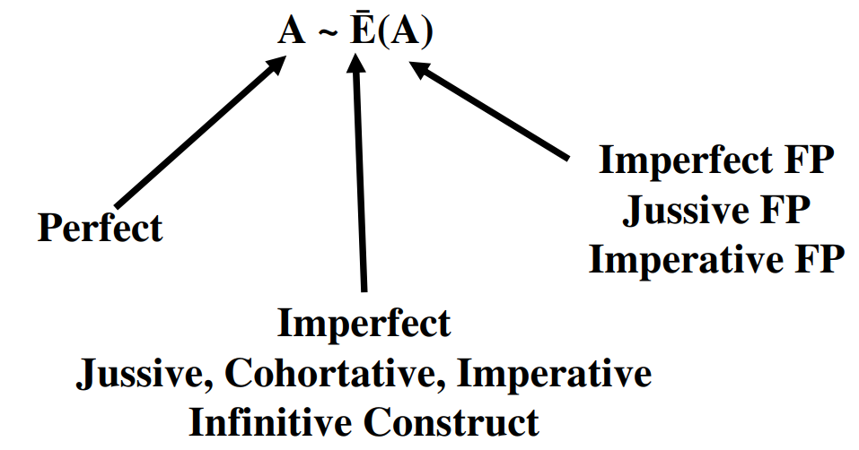

# (PART) Derived Binyanim {-}

# Introduction to Unit 4 {-}

Congratulations!  You now have the heaviest work of a first-year Hebrew grammar course behind you.  From here on out, we will be studying the six major derived Hebrew Verb stems: Niphal, Piel, Pual, Hiphil, Hophal and Hitpael.

The reason we spent so much time on the Qal stem is not only because it's the most frequently occurring stem, but everything from this point forward is based on what you learned in Unit 3.  This means, for the most part, the Lessons that follow will be shorter and much more methodical.

Summaries of each of the derived stems will consist of the overall diagnostic features.  It is THESE features that should be memorized, not the numerous paradigms.

## Lessons 24-35 {-}

Each stem will have two lessons:

* Lesson 1/2 (even number) - The "Strong" Verb paradigm
    * The meaning of the Stem
    * The spelling of the stem
        * Word-initial Prefix/Preformative combinations
        * $V_S$ formulas to help you "diagnose" the stem when you encounter it in the Bible
    * Complete forms of each conjugation using the קטל paradigm verb
        * The Perfect and Imperfect forms will have the Audio from Chapter 15 of _Hebrew Quest_
        * The Anki deck will have exercises to help you with paradigm identification
        * Each lesson will have a worksheet for you to practice the paradigm
        * From here on out, identification of patterns is more important than memorization of paradigms
* Lesson 2/2 (odd number) - Weak verb deviations
    * Spelling changes within caused by the behaviors of gutturals and other weak letters, Geminate verbs, Biconsonantal verbs, and other irregular verbs
    * Most of the time, you already know the concepts
        * For example, in some forms of the Niphal Strong paradigm, $R_1$ takes a Dagesh Forte
        * You already know that if $R_1$ is a guttural or Resh, $R_1$ will reject the Dagesh Forte and often (but not always), there will be Compensatory Lengthening

## Review: Vowel and Consonant Shorthand

* To reduce clutter and redundancy, the following chapters will make extensive use of the "Vowel Shorthand" we discussed in the Unit 3 Introduction - be sure you are comfortable with this nomenclature
* $V_P$ is the vowel that is affixed to the verb's preformative, if there is one
* $R_1$ is root consonant #1 and $V_1$ is that consonant's vowel
* $R_2$ is root consonant #2 and $V_2$ is that consonant's vowel
* $R_3$ is root consonant #3 (we do not use $V_3$).

## Review: Stem Vowel is the Vowel with the 2nd Root Consonant

* $V_S$ is the "Stem Vowel", this is _usually_ $V_2$ 
    * If the first consonant is lost, $V_S$ is still the vowel with the second root consonant
        * In **שֵׁב***, $V_S = V_2 = \bar E$ - (Long E - Tsere)
    * For biconsonantal verbs, $V_S$ is between the consonants
        * In **קָם***, $V_S = \bar A$ (Long A - Qamets)
        * In **יַקוּם***, $V_S = \bar U$ (Long U - Shureq)

## Stem Vowel Pattern Nomenclature

* The derived stems tend to be much more consistent with their application of stem vowels
* We will use a code to memorize the stem vowels for non-Qal Strong verbs
* For example, the stem vowel code is 

$$V_{S_N} = A \sim \bar E (A)$$

* V_{S_N}$ means the <u>S</u>tem <u>V</u>owel for the <u>N</u>iphal. The final letter is the stem's parsing code.
* Everything to the LEFT of the tilde, $\sim$, is the PERFECT
* Everything to the RIGHT of the tilde is the IMPERFECT and related forms, Jussive, Cohortative, Imperative and Infinitive Construct
* Any exceptions are inside ()
    * Imperfect form exceptions apply to the Feminine Plural
        * Therefore $(A)$ in the formula means the Stem Vowel in the Imperfect FP, the Jussive FP and the Imperative FP is Short A - Patach
    * Perfect exceptions will tend to apply to the 2nd and 1st person forms
    * Niphal does not have any Perfect exceptions
    
```{r, out.width = "300pt", fig.align='center'}


``` 

## Review: Sheva before Finite Verb Endings

* Finite Verbs have Person (1st, 2nd, 3rd)
    * Thus the Finite verb conjugations are: Perfect, Imperfect, Imperative, Jussive, Cohortative
    * The non-Finite conjugations are: Infinitive Construct, Infinitve Absolute, Participle
* A sheva goes before a Finite Verb ending
    * This means the $V_S$ will REDUCE if the sufformative begins with a VOWEL
    * An exception to the above is that Unchangeable vowel letters do not reduce, so they do NOT take a Sheva
* The Adjective Endings do NOT take a Sheva - since Participles use adjective endings, they do not take a Sheva
    * One exception: if the Participle $V_S = \bar E$, then it REDUCES
        * Qal Active: <span class="he">קֹטֵל</span> (QPTms) becomes <span class="he">קֹטְלִים</span> (QPTmp)
        * Piel: <span class="he">מְקַתֵּל</span> (DPtms) becomes <span class="he">מְקַטְּלוֹת</span> (DPtfp)
        
