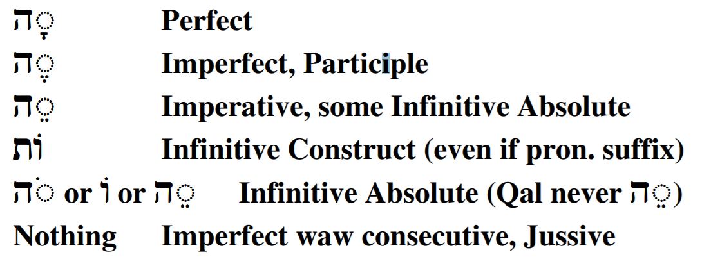

# X The Niphal Stem - Weak Verbs {.N-w}


Now that we have learned the basic groundrules for the Niphal stem in Lesson 24, we now turn our attention to the spelling changes caused by verbs with one or more weak letters.  In all stems, weak verbs tend to be much more prevalent, but it is easier to start with the strong verb patterns, then "manage by exception" when it comes to the corresponding weak verbs.

::: {.box .map}
LESSON ITINERARY

1. 1-Guttural Take Hateph Vowels, which changes $V_P$
1. 1-Guttural/Resh Compensatory Lengthening
1. 1-Yod Becomes וֹ or וָּ
1. 1-Nun with Silent Sheva Assimilates
1. 3-Aleph Changes $V_S$
1. 3-Hei Endings
:::

::: {.box .stop}
__EQUIPMENT CHECK__

Before continuing, can you describe the following concepts from Lesson 24?

* The Niphal $Pre$ sequences
* The Niphal $V_S$ formula
* What to Memorize for Derived Stems
:::

## First Thought {-}

###  <span class="he">וְקָרְא֥וּ לָהֶ֛ם עַם־הַקֹּ֖דֶשׁ גְּאוּלֵ֣י יְהוָ֑ה וְלָךְ֙ יִקָּרֵ֣א דְרוּשָׁ֔ה עִ֖יר לֹ֥א נֶעֱזָֽבָה׃</span> {-}

*And they will call them, "The holy people, The redeemed of Adonai"; And you will be called, "Sought out, a city not forsaken." (Isaiah 62:12)*

We are called "Redeemed of Adonai."  Let that sink in.  Each new day offers us a chance to reflect on what it means to be redeemed and live our lives accordingly.

<figure>
    <figcaption>Listen to the verse in Hebrew:</figcaption>
    <audio
        controls controlsList="nodownload"
        src="./images/25-13.Isaiah65.19.mp3">
            Your browser does not support the
            <code>audio</code> element.
    </audio>
</figure>


```{r, out.width = "400pt", fig.align='center', fig.cap="Sunrise over Mount of Olives. Courtesy of the [Pictorial Library of Bible Lands](https://www.bibleplaces.com)"}


``` 


## A weak consonant affects the vowels that touch it

* A weak $R_1$ affects $V_P$ and $V_1$ (but NOT $V_S$)
* A weak $R_2$ affects $V_S$ and $V_1$ (but NOT $V_P$)
* A weak $R_3$ affects $V_S$ and sufformative (but NOT $V_1$ or $V_P$)


## X 1-Guttural 

* Guttural takes Hateph Vowel instead of Sheva
    * Remember the Rule of Sheva - "Hateph Copy Cat"
    * Whichever Hatef vowel is under the guttural, the Niphal prefix will take the corresponding short Vowel
        * Strong - <span class="he">נִקְ</span>
        * 1G - <span class="he">נַעֲ</span> or <span class="he">נֶאֱ</span>
    * If $R_2$ has a sheva, then $R_1$ lengthens from Hateph to it's corresponding short vowel
        * 1G -<span class="he">נֶאֶמְ</span>
* Guttural and Resh reject Dagesh Forte
    * Strong - <span class="he">הִקָּ</span>
    * 1G/1R - <span class="he">יֵעָ</span>

## 1-Yod

::: {.box .info}
* Most 1-Yod verbs were originally 1-Vav
* In some forms, the "original Vav" reappears
:::

* 1-Yod shifts to Holem Vav when $Pre$ = <span class="he">נִקְ</span>
    * Perfect - NOT *<span class="he">נִיְשַׁב</span>, but <span class="he">נוֹשַׁב</span>
    * Participle - NOT *<span class="he">נִיְשָׁב</span>, but <span class="he">נוֹשָׁב</span>
* 1-Yod shifts to consonantal Vav when $Pre =$ <span class="he">יִקָּ</span> (or similar)
    * Imperfect - NOT *<span class="he">יִיָּשֶׁב</span>, but <span class="he">יִוָּשֶׁב</span>
        * Imperfect 1C is ALWAYS <span class="he">אִ</span>, NOT *<span class="he">אֶ</span> if 1-Yod 
    * Imperative - NOT *<span class="he">הִיָּשֵׁב</span>, but <span class="he">הִוָּשֵׁב</span>

::: {.box .light}
If you see what looks like a "1-Vav" verb, parse it as 1-Yod
:::


## 1-Nun with Silent Sheva Assimilates

* When Niphal $Pre =$ <span class="he">נִקְ</span>:
    * NP3ms - NOT *<span class="he">נִנְצַל</span> but <span class="he">נִצַּל</span>
    * NPtMS - NOT *<span class="he">נִנְטָל</span> but <span class="he">נִצָּל</span>

## X 3-Aleph Changes $V_S$

::: {.map .light}
You can usually parse a 3-Aleph verb based on the preformative alone
:::

* For 3-Aleph, there is a unique Niphal $V_S$ formula

$$V_S = \bar A(\bar E) \sim \bar E(E)$$
* Don't memorize the changed pattern, since you can still parse based on the preformative
* $\bar A(\bar E)$ means:
    * $\bar A$ (Qamets) in the NP <u>3rd person</u>, (reduced except in 3ms)
    * $(\bar E)$ (Tsere) in the NP <u>1st and 2nd person</u>
* NPt is still the P3ms $V_S$ lengthened
    * $\bar A$ is already a long vowel
    * So 3-Aleph NP3ms and NPtMS have the same spelling
    * <span class="he">נִמְצָא</span> is NP3ms or NPtMS
    
## 3-Hei Verbs Follow the same general principles

::: {.map .info}
To review: 

* 3-ה verbs have two root consonants, not three
* 3-ה verbs add a vowel after $R_2$
:::

1. If the sufformative begins with a vowel, the sufformative vowel goes after $R_2$
    * NP3cp - NOT *<span class="he">נִבְנָהוּ</span>, but <span class="he">נִבְנוּ</span>
    * Ni2fs - NOT *<span class="he">תִּבָּנָהִי</span>, but <span class="he">תִּבָּנִי</span>
2. If the sufformative begins with a consonant, (vowel)+Yod goes between $R_2$ and the sufformative
    * NP2ms - NOT *<span class="he">נִבְנָהתָ</span>, but <span class="he">נִבְנֵ֫יתַ</span> (Tsere+Yod for Perfect in the PASSIVE stems: Niphal, Pual, Hophal)
    * Ni3fp - NOT *<span class="he">תִּבָּנָהנָה</span>, but <span class="he">תִּבָּנֶ֫ינָה</span> (Seghol+Yod for Imperfect and IMperative)
    * Hireq+Yod for Perfect in the NON-PASSIVE stems: Qal, Piel, Hiphil, Hitpael)
3. If NO sufformative or pronominal suffix, add 3-Hei ending after $R_2$
    * NP3ms <span class="he">נִבְנָה</span> (Qamets-Hei for Perfect)
    * QI3ms <span class="he">יִבְנֶה</span> (Seghol+Hei for Imperfect, Participle)
    * NI3ms <span class="he">יִבָּנֶה</span> (note the Dagesh Forte in $R_1$ is how you distinguish from QI3ms)
    * NM2ms <span class="he">הִבָּנֵה</span> (Tsere+Hei for Imperative, some Absolute)
    * QJ3ms <span class="he">יִ֫בֶן</span> (No ending for Iwc or Jussive)
4. Perfect 3fs uses sufformative <span class="he">תָה</span> to distinguish from P3ms
    * NP3ms - <span class="he">נִבְנָה</span>
    * NP3fs - <span class="he">נִבְנְתָה</span>

## What to Memorize for Niphal Weak

::: {.box .light}
Think your way through the weak verb $Pre$ to get back to the 
Niphal Strong $Pre$
:::

* 1G - $Pre$ <span class="he">נַעֲ</span> or <span class="he">נֶאֱ </span> or <span class="he">נֶאֶמְ</span> is the same as strong $Pre$ <span class="he">נִקְ</span>
* 1G/R - $Pre =$ <span class="he">הֵרָ</span> is the same as strong $Pre =$ <span class="he">הִקָּ</span>
* 1Y - $Pre =$ <span class="he">נוֹ</span> is the same as strong $Pre =$ <span class="he">נִקְ</span>
* 1N - $Pre =$ <span class="he">ָנִתּ</span> is the same as strong $Pre =$ <span class="he">נִקְתַ</span>

Also:

* Verbs that look "1-Vav" are actually 1-Yod - <span class="he">יִוָּשֵׁב</span>
* Memorize the list of 3-ה verb endings:

```{r, out.width = "500pt", fig.align='center'}


``` 

## Top 10 Niphal Verbs 

1. <span class="he">לָחַם</span> - (Q, N) to fight, do battle with (167x in Niphal Stem)
1. <span class="he">שָׁבַע</span> - (N) to swear, swear (take) an oath, adjure (154x)
1. <span class="he">מָצָא</span> - (Q) to find (out), reach, obtain, achieve; (N) be found, be found sufficient (142x)
1. <span class="he">רָאָה</span> - (Q) to see, perceive, understand; (N) appear, become visible (101x)
1. <span class="he">עָשָֹה</span> - (Q) to do, make, create, acquire, prepare, carry out; (N) be done, be made (99x)
1. <span class="he">שָׁאַר</span> - (N) to remain, be left over, survive (94x)
1. <span class="he">נָבָא</span> - (N) to prophesy, be in a state of prophetic ecstasy (87x)
1. <span class="he">נָתַן</span> - (Q) to give, put, set; (N) be given (83x)
1. <span class="he">אָסַף</span> - (Q) to gather (in), take in, take away; (N) be gathered, be taken away (81x)
1. <span class="he">יָתַר</span> - (N) to be left over, remain (81x)

## Word Warm-up {-}

[Click to open `Word Warm-up` video in a new tab](https://youtu.be/Pq3PWd41uQE){target="_blank"}


<div class="container">
<iframe class="responsive-iframe" src="https://youtube.com/embed/Pq3PWd41uQE" frameborder="0"></iframe>
</div>


## Verses Warm-up {-}

[Click to open `Verses Warm-up` video in a new tab](https://youtu.be/hgbj52voNtw){target="_blank"}

<div class="container">
<iframe class="responsive-iframe" src="https://youtube.com/embed/hgbj52voNtw" frameborder="0"></iframe>
</div>


## Ruth Pursuit {-}        

:::  {.box .map}
YOUR QUEST

Identify, parse, and translate the five Niphal verbs in Ruth 1.

You are likely unfamiliar with the meanings of at least two of these.  Identify the Niphal forms by their diagnostics, then identify and look-up the meaning of the root. 

By now, if you have been completing your `Ruth Pursuit` table along with each Lesson, you may have noted that there aren't that many words left in the passage that we haven't translated.  This may make it easier for you to identify the remaining verbs by process of elimination, but do make sure you understand WHY the words you select are Niphal.
:::

* [Blank copy of Ruth 1](https://drive.google.com/file/d/1qcfTKAlTJGChC2eYCMhSbY2w-ibzCcDV/view?usp=sharing){target="_blank"}
* [Ruth Pursuit Answer Key #25](./images/25_Ruth_Pursuit_KEY.pdf){target="_blank"}


## Hebrew Quest Study Passage: John 1 {-}

[Blank copy of John 1 in Hebrew](https://docs.google.com/document/d/1jWt3rS5Z5az2X_gCRO4Wg9mS4svUIHa5CrjUoqg-xnk/view?usp=sharing){target="_blank"}


1. Read through the passage straight through
2. Now re-read the passage critically, highlighting ([lexicon here](https://holylanguage.com/resources-dictionaries.php){target="_blank"} and translating (you will need to parse verbs to translate)
3.[Watch Izzy's _Hebrew Quest_ video (video opens in a new tab)](https://holylanguage.com/john-1.php){target="_blank"}
4. After the video, assess your translation.  How close was it?
5. How did the Ruach HaQodesh speak to you through the passage?

Optionally, you may complete the passage memorization in Memrise [here](https://app.memrise.com/course/5406435/hebrew-quest-lessons-1-to-40/28/garden/learn/?source_element=level_details_session&source_screen=level_details){target="_blank}.

## X Quest Quiz {-}

[Open Quest Quiz #xx in a new window](){target="_blank"}

<div class="containerLtr">
<iframe class="responsive-iframe" src="" frameborder="0"></iframe>
</div>

## X Claim your next `Twelve Tribes Badge`! {-}

Check to be sure you have have completed <span class="he">all activities<span class="he"> through this lesson, then fill out the form below.

[Check to be sure you have completed all ACTIVities here](){target="_blank"}, complete the certification below, and your badge will be on its way!

<div class="containerLtr">
<iframe class="responsive-iframe" src="" frameborder="0"></iframe>
</div>

