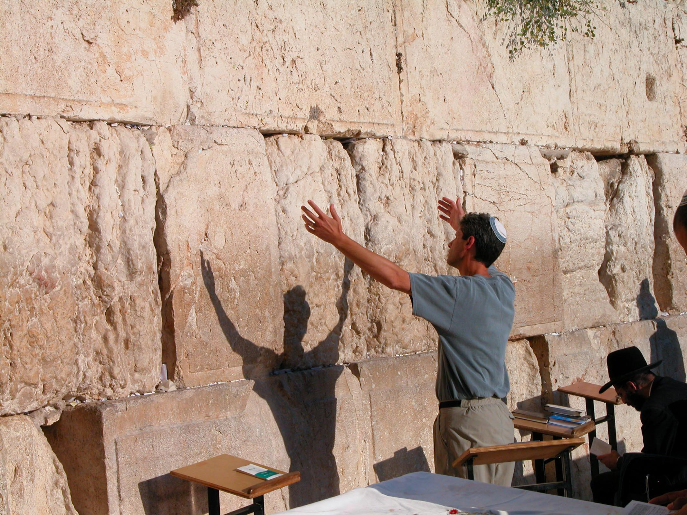

# The Piel Stem - Strong Verbs {.D-s}

The Piel stem occurs 6,473 times in the Hebrew Bible. It appears in the Perfect 2,120 times, Imperfect 2,446 times, Imperative 436 times, Infinitive Construct 708 times, Infinitive Absolute 84 times, and Participle 679 times

Many students find the Piel is one of the easier stems to identify.  It is one of only three Verb stems (along with the Pual and Hitpael) that has a Dagesh Forte in $R_2$. The Piel is easily distinguished from the Pual, which has a steady U-class vowel and the Hitpael, which has a unique prefix.

In addition to the Dagesh Forte, the Piel has a $Pre$ combination that (in the strong form) is relatively free from confusion with any other Hebrew Verb Stem.

::: {.box .map}
__LESSON ITINERARY__

1. Understand the meaning of the Piel Stem
1. Identify the distinctive diagnostics of the Piel Strong conjugations
:::


## First Thought {-}

### <span class="he">בִּשְׂפָתַ֥י סִפַּ֑רְתִּי כֹּ֝֗ל מִשְׁפְּטֵי־פִֽיךָ׃</span> {-}

*With my lips I have told of All the ordinances of Your mouth (Psalms 119:13)*

-brief meditation-

<figure>
    <figcaption>Listen to the verse in Hebrew:</figcaption>
    <audio
        controls controlsList="nodownload"
        src="./images/26-18.Psalms119.13.mp3">
            Your browser does not support the
            <code>audio</code> element.
    </audio>
</figure>


```{r, out.width = "400pt", fig.align='center', fig.cap="Man with arms upraised at Western Wall. Courtesy of the [Pictorial Library of Bible Lands](https://www.bibleplaces.com)"}


``` 


<!-- FOR STRONG VERB CHAPTERS -->

## Piel Verb Stem Table 

| |Active Voice| Passive Voice | Reflexive Voice
|:- |:- |:- |:-
Simple Action	| Qal | Niphal | Niphal
Cause a State	| _PIEL_ | Pual | Hitpael
Cause an Action	| Hiphil | Hophal

* Reminders:
    * The table gives broad generalization; many verbs do not fit neatly into the table's definitions
    * Use a lexicon/dictionary to check the meanings in different stems
    * Many Tables like this one will label the 2nd row as "Intensive Action" but this is a controversial topic in the academic community


## Piel Meanings

* Cause a state ('factitive')
    * <span class="he">מִלֵּא </span>
        * Q - He filled
        * D (Piel) - He caused <something> to be full
    <span class="he">אָנַשף </span>
        * Q - He was angry
        * D - He made <someone> angry
* Do something repeatedly ('iterative')
    * <span class="he">הָלַךְ</span>
        * Q - He walked
        * D - He walked around
* Declarative - he declared <someone> innocent
* Denominative (verb made from noun) - He acted as a priest (<span class="he">כִּהֵן</span> from <span class="he">כֹּהֵן</span> "priest")
* Intensive?
    * <span class="he">שִׁבֵּר </span>
        * Q - He broke
        * D - He smashed
            * This is hotly debated
            * Perhaps he caused it to be in a state of brokneness?
            * Perhaps he broke repeatedly?

## Piel is the D stem because $R_2$ takes a Doubling Dagesh Forte

* In fact, when you see a Dagesh in $R_2$, it's more than likely either a Piel form or a 1-נ verb that has assimilated.  If you see three root letters, it's probably a Piel
    * Two other Stems take a Dagesh in $R_2$ - Pual (Lesson 28) and Hitpael (Lesson 34).  As we will learn in those Lessons, both forms are easily distinguished from Piel.
* Gutturals, Resh, SQiN eM LeVY letters reject the Daghesh Forte
    * SQiN eM LeVY discussed later in this Lesson
    * Gutturals/Resh discussed in Lesson 27

## Memorize piēl - paēl

::: {.box .info}
The Piel is remarkably consistent.  
While there are distinctive $Pre$ and $V_S$ combinations, it's easiest to remember the Stem by the mnemonic "PIEL - PAEL"
:::

* piēl in PERFECT
    * $V_1 = I$
    * $V_S = \bar E$ in the 3rd person
        * <span class="he">קִטֵּל</span> - DP3ms
    * $V_S = A in the 2nd/1st person
        * <span class="he">קִטַּ֫לְתָּ</span> - DP2ms
* paēl in ALL OTHER CONJUGATIONS
    * $V_1 = A$
    * $V_P = :$ (or Hateph Patach in DI1cs), where applicable
    * $V_S = \bar E$
    * <span class="he">יְקַטֵּל</span> - DI3ms
    * <span class="he">קַטֵּל</span> - DM2ms/D∞/DA
    * <span class="he">מְקַטֵּל</span> - DPtMS

* The Piel $V_S$ formula is:

$$V_{S_D} = \bar E(A) \sim \bar E$$


## Pay attention when $R_2$ is a SQiN eM LeVY consonant

* As we have mentioned previously, SQiN eM LeVY is a mnemonic for a group of letters that can reject a Dagesh Forte when the letter has a Sheva
    * S - סצשׁסֹ
    * Q - ק
    * N - נ
    * M - מ
    * L - ל
    * V - ו
    * Y - י

* If you see a SQiN eM LeVY consonant with a Sheva, it might have a "hidden" Daghesh Forte

* DIwc
    * The Iwc has a Dagesh in the Imperfect Preformative
    * the DI preformative has a Sheva
    * Therefore, DIwc3ms and DIwc3mp lose Dagesh
    * DIwc3ms - Not *<span class="he">וַיְּקַטֵּל</span>, but <span class="he">וַיְקַטֵּל</span>
    * DIwc3mp - Not *<span class="he">וַיְּקַטְּלוּ</span>, but <span class="he">וַיְקַטְּלוּ</span>
* Forms with reduced $V_2$
    * Example DP3cp - Not *<span class="he">שִׁמְּרוּ</span>, but <span class="he">שִׁמְרוּ</span>
    
## Piel: what to memorize

* Parsing code D - Dagesh Forte in $R_2$
* "piēl - paēl"
    * This is easier than remembering the $Pre$ and $V_S$ combinations separately
    * piēl - Perfect $V_1 = I$
    * paēl - everywhere else: $V_1 = A$
    * $V_S = E$ everywhere except Perfect 1st/2nd person (where $V_S = A$)
* $V_P = :$ in all Strong Conjugations with preformatives
    * This compares to $V_P = I$ in the Qal
* Participle preformative <span class="he">מ</span> (all stems except Qal and Niphal)
* The SQiN eM LeVY exceptions
    * $R_2$ and $DIwc$

## Piel Perfect Strong

| Sing | Paradigm | Plural | Paradigm
| :-  | :- | :-  | :-
| 3ms | <span class="he">קִטֵּל</span>  | 3cp | <span class="he">קִטְּלוּ</span> 
| 3fs | <span class="he">קִטְּלָה</span> | 
| 2ms | <span class="he">קִטַּ֫לְתָּ</span> | 2mp | <span class="he">קִטַּלְתֶּם</span>
| 2fs | <span class="he">קִטַּלְתְּ</span> | 2fp | <span class="he">קִטַּלְתֶּן</span>
| 1cs | <span class="he">קִטַּ֫לְתִּי</span> | 1cp | <span class="he">קִטַּ֫לְנוּ</span>

* 3rd person $Pre$ is distinctive Hireq+Dagesh+Tsere
* 1st/2nd person $Pre$ is Hireq+Dagesh+Patach

<figure>
    <figcaption>X Piel Perfect Strong from _Hebrew Quest_ Chapter 15</figcaption>
    <audio
        controls controlsList="nodownload"
        src="./images/.mp3">
            Your browser does not support the
            <code>audio</code> element.
    </audio>
</figure>


֫## Piel Imperfect Strong

| Sing | Paradigm | Plural | Paradigm
| :-  | :- | :-  | :-
| 3ms | <span class="he">יְקַטֵּל</span>  | 3mp | <span class="he">יְקַטְּלוּ</span> 
| 3fs | <span class="he">תְּקַטֵּל</span> | 3fp | <span class="he">תְּקַטֵּ֫לְנָה</span>
| 2ms | <span class="he">תְּקַטֵּל</span> | 2mp | <span class="he">תְּקַטְּלוּ</span>
| 2fs | <span class="he">תְּקַטְּלִי</span> | 2fp | <span class="he">תְּקַטֵּ֫לְנָה</span>
| 1cs | <span class="he">אֲקַטֵּל</span> | 1cp | <span class="he">נְקַטֵּל</span>

* Piel Imperfect $Pre$ is very consistent: Sheva+Patach+Dagesh+Tsere
    * Compare to Qal Imperfect $Pre$ of Hireq+Sheva+Holem
    
<figure>
    <figcaption>X Imperfect Strong from _Hebrew Quest_ Chapter 15</figcaption>
    <audio
        controls controlsList="nodownload"
        src="./images/.mp3">
            Your browser does not support the
            <code>audio</code> element.
    </audio>
</figure>

## Piel Imperative Strong

| Sing | Paradigm | Plural | Paradigm
| :-  | :- | :-  | :-
| 2ms | <span class="he">קַטֵּל</span> | 2mp | <span class="he">קַטְּלוּ</span>
| 2fs | <span class="he">קַטְּלִי</span> | 2fp | <span class="he">קַטֵּ֫לְנָה</span>

## Piel Infinitives Strong


| Type | Paradigm 
| :-  | :- 
| ∞ | <span class="he">קַטֵּל</span>  
| A | <span class="he">קַטֵּל</span>

* Same as DM2ms

## Piel Participle Strong

| Sing | Paradigm | Plural | Paradigm
| :-  | :- | :-  | :-
| ms | <span class="he">מְקַטֵּל</span> | mp | <span class="he">מְקַטְּלִים</span>
| fs | <span class="he">מְקַטֶּ֫לֶת</span> | fp | <span class="he">מְקַטְּלוֹת</span>

* Distinctive <span class="he">מְ</span> prefix

### Participle Prefixes in the Derived Stems {-}

Again we present this table for review:

Stem | Prefix 
:- | :-: 
Niphal | נִ |
PIEL | <span class="he">מְ</span>
Pual | מְ
Hiphil | ַמ
Hophal (u-class) | מֻ
Hophal (o-class) | ָמ
Hithpael | תִמְ

## Piel Parsing Examples

* Word: <span class="he">גדַּ֫לְנוּ </span>
    * The dagesh in the gimmel is a Lene (not preceded by a vowel), but the Dagesh in the Dalet is preceded by a vowel that is not a sheva, so this must be a forte.
        * A Forte in what appears to be $R_2$ Should get your attention and you start asking "Is this Piel?"
    * $Pre =$ גִּדַּ, distintly Piel
    * $Sufformative =$ נוּ, Perfect 1cp
    * $Root =$ <span class="he">גדל</span>
    * $V_S = A$ - We might expect Tsere in the Piel but then we remember that Piel Perfect takes Patach in 1st/2nd person
    * Result: Piel Perfect 1cp, we made great

* Word: <span class="he">אֲדַבֶּר</span>
    * Immediately, note the Daghesh in $R_2$ - your mind should already be asking "is this Piel?"
        * This could be an assimilated 1-nun verb but you already have what appears to be three-root letters visible
    * Then remember "Piel-Pael" and note this rhymes with Pael.  So without doing much analysis, we're already pretty sure this is a Piel, non Perfect.
    * $Pre =$ אֲדַבּ, 
        * We might expect $V_P$ of sheva in the Piel but of course the Aleph takes the Hateph vowel
        * The Patach+Dagesh+Tsere combination is consistent with Piel non-Perfect
    * $Sufformative =$ None. With the Aleph preformative, this is I1cs
    * $Root =$ <span class="he">דבר</span>
    * $V_S = \bar E$, consistent with Piel (except DP1/2 person)
    * Result: Piel Imperfect 1cs I will speak

* Word: <span class="he">לַמֵּד</span>
    * The Dagesh Forte in $R_2$ suggests Piel or assimilated 1-Nun<small>^[<small> Of the three examples on this page, this is the only one where a 1-nun might be plausible.  We have the ל which is a common prefix to an infinitive construct.  If there was a verb נמד, we might want to probe this further as a possible ∞, but we don't know a verb נמד.  Even if we did, the vowels don't match up.  We DO know a verb למד though.  Like in other areas of life, when we have a set of multiple possibilities, the most direct path is often the correct one.</small>]</small>.  You also note that the word rhymes with "Pael", suggesting a "working hypothesis" of Piel, non-perfect.
    * $Pre =$ לַמּ,
    * $Sufformative =$ none.  No preformative, no sufformative could be QP, but the vowels don't match Qal at all. The vowels do match Piel.
        * This can't be DP because $V_1 \not = I$
        * This can't be DI because all Imperfects have a preformative
        * This can't be DPt because DPt begins with <span class="he">מְ</span>
        * DM2ms, D∞, and DA each work
    * $Root =$ <span class="he">למד</span>
    * $V_S = \bar E$, consistent with Piel (except DP1/2 person)
    * Result: D(M2ms/∞/A) - Teach! or to teach

## Stem Comparison Table

* Here is the Stem Comparison Table showing Qal, Niphal, and now Piel


```{r, out.width = "600pt", fig.align='center'}
library(knitr)
include_graphics("images/26_stemcomp.png")
```

## Word Warm-up {-}

[Click to open `Word Warm-up` video in a new tab](https://youtu.be/6A3f3WemMmE){target="_blank"}


<div class="container">
<iframe class="responsive-iframe" src="https://youtube.com/embed/6A3f3WemMmE" frameborder="0"></iframe>
</div>


## Verses Warm-up {-}

[Click to open `Verses Warm-up` video in a new tab](https://youtu.be/NGT8fiuGGp0){target="_blank"}

<div class="container">
<iframe class="responsive-iframe" src="https://youtube.com/embed/NGT8fiuGGp0" frameborder="0"></iframe>
</div>


## Worksheets: Piel Strong Paradigms {-}

Use your knowledge of the $Pre$, $Suf$, and $V_S$ of the Piel stem, complete the worksheet until you can do it once through correctly.

Strive for pattern recognition over rote memorization.

[Name of worksheet](26_piel_strong_paradigms.pdf){target="_blank"}

## Ruth Pursuit Analysis

We are now at the exciting stage where we can begin to stitch together an analysis of Ruth 1.  This will be much the same as you have done with the `Hebrew Quest Study Passages`.  The main difference is you will not have Izzy's video explanation.  In that sense, you will now be wading a little deeper into the Hebrew pool! 

We're going to do this in small chunks over the next several lessons.  

If Ruth 1 is "Act 1" of the drama, then we'll start with what is essentially "scene 1": Ruth 1:1-6.

::: {.box .map}
YOUR QUEST

1. Read Ruth 1:1-6 in the Hebrew text and underline any words or forms do you not recognize
    * For the first time, try doing this without any study aids, including your `Ruth Pursuit Translation Worksheet`
    * Then as needed, look up the words you don't recognize
2. Using what you have learned about syntax/phrase constructions and context, provide your own interpretative translation (using whatever resources you'd like!)
    * You may wish to compose a structural outline of "mini-scenes" identified by conjunctive or disjunctive clauses, quotations, or other constructions
3. Compare your version with translations such as JPS, KJV, ESV, NASB, NIV, or NLT.  
    * At what points do you agree and disagree with translation decisions made by these publications?  It's OK to disagree!

This exercise is for you.  You do not have to turn this in and it will not be graded as a part of this course.  We would encourage you to share your passage with the Holy Language Institute Tribe for their edification. 

:::

## Hebrew Quest Study Passage: Exodus 31 {-}

[Blank copy of Exodus 31](https://docs.google.com/document/d/1uRkk2MNy6-8CqSzXQAadDqhnHqUTI6i7Bd6OOxCbYjQ/edit?usp=sharing){target="_blank"}


1. Read through the passage straight through
2. Now re-read the passage critically, highlighting ([lexicon here](https://holylanguage.com/resources-dictionaries.php){target="_blank"} and translating (you will need to parse verbs to translate)
3.[Watch Izzy's _Hebrew Quest_ video (video opens in a new tab)](https://holylanguage.com/exodus-31.php){target="_blank"}
4. After the video, assess your translation.  How close was it?
5. How did the Ruach HaQodesh speak to you through the passage?

Optionally, you may complete the passage memorization in Memrise [here](https://app.memrise.com/course/5406435/hebrew-quest-lessons-1-to-40/29/garden/learn/?source_element=level_details_session&source_screen=level_details){target="_blank}.

## X Quest Quiz {-}

[Open Quest Quiz #xx in a new window](){target="_blank"}

<div class="containerLtr">
<iframe class="responsive-iframe" src="" frameborder="0"></iframe>
</div>

## X Claim your next `Twelve Tribes Badge`! {-}

Check to be sure you have have completed <span class="he">all activities<span class="he"> through this lesson, then fill out the form below.

[Check to be sure you have completed all ACTIVities here](){target="_blank"}, complete the certification below, and your badge will be on its way!

<div class="containerLtr">
<iframe class="responsive-iframe" src="" frameborder="0"></iframe>
</div>

