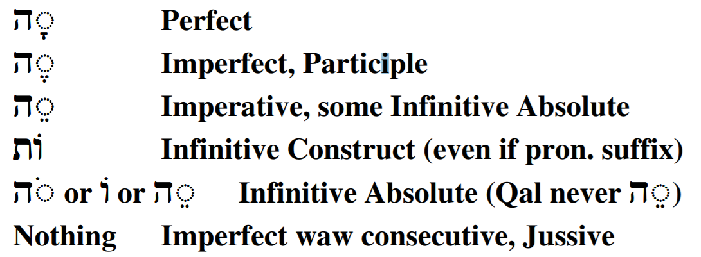

# The Piel Stem - Weak Verbs {.D-w}

> To comprehend Biblical Hebrew, we must be able to . . . 

Say something general bridging the desired outcome above with the learning objectives below

::: {.box .map}
<span class="he">LESSON ITINERARY<span class="he">

1. learning_objective_1
1. learning_objective_2
1. learning_objective_3
1. learning_objective_4
1. learning_objective_5
1. learning_objective_6
1. learning_objective_7
:::

::: {.box .stop}
<span class="he">EQUIPMENT CHECK<span class="he">

Before continuing, can you describe the following concepts?

* 
*
:::

## First Thought {-}

### <span class="he">בֹּ֤אוּ שְׁעָרָ֨יו ׀ בְּתוֹדָ֗ה חֲצֵרֹתָ֥יו בִּתְהִלָּ֑ה הֽוֹדוּ־ל֝֗וֹ בָּרֲכ֥וּ שְׁמֽוֹ׃</span> {-}

*Enter His gates with thanksgiving And His courts with praise. Give thanks to Him, bless His name. (Psalms 100:4)*

<figure>
    <figcaption>Listen to the verse in Hebrew:</figcaption>
    <audio
        controls controlsList="nodownload"
        src="./images/27-16.Psalms100.4.mp3">
            Your browser does not support the
            <code>audio</code> element.
    </audio>
</figure>


```{r, out.width = "400pt", fig.align='center', fig.cap="Golden menorah for third temple. Courtesy of the [Pictorial Library of Bible Lands](https://www.bibleplaces.com)"}

knitr::include_graphics("images/27_Golden menorah for third temple, tb123199206.jpg")
``` 


<!-- picture -->

```{r, out.width = "400pt", fig.align='center'}

knitr::include_graphics("images/07-Tabgha sacred stone where Jesus stood, tb102602022.jpg")
``` 


## 3-Guttural

::: {.box .light}
* 3-G verbs will change the Stem Vowel
* In the Piel, we can determine the Stem by the $Pre$ and $Suf$, so we can effectively ignore what happens to the $V_S$
:::

* Strong - $V_S = \bar E(A) \sim \bar E$
* 3-ע/ח - $V_S = A \sim A$
* 3-א - $V_S = \bar E \sim \bar E(A)$
* 3-ה - The same as 3-ה in other stems
    * Memorize the 3-ה endings:

```{r, out.width = "500pt", fig.align='center'}


``` 


## 2-Aleph/Resh often cause DP $V_1 = \bar E$ and $V_1 = \bar A$ in all other forms

* 2-G verbs will take Hateph vowel instead of Vocal Sheva
    * By know, you already know this.  Whenever you see a hateph vowel just substitute a Sheva to get back to the Strong paradigm
    * DP3cp - <span class="he">קִטְּלוּ</span> (strong) is <span class="he">נִחֲלוּ</span> (2-G)
* 2-G and 2-ר will reject the Dagesh that is diagnostic of the Piel stem
    * 2-ר/א will almost always have Compensatory Lengthening
        * DP2ms, Not *<span class="he">בִרַּ֫כְתָּ</span>, but <span class="he">יְבֶרַ֫כְתָּ</span> (Hireq lengthens to Tsere)
        * DI3ms, Not *<span class="he">תְּבַרֵךְ</span>, but <span class="he">תְּבָרֵךְ</span>(Patach lengthens to Qamets) 
    * 2-ה/ח/ע usually do NOT have compensatory lengthening in Piel
        * DP3cp - Not *<span class="he">נִחֲּמוּ</span>, but <span class="he">נִחֲמוּ</span>

::: {.box .info}
Most verbs either exhibit compensatory lengthening or they do not; however, some verbs may exhibit either pattern.
:::

## 1-Nun

* As we know, what makes a 1-nun verb weak is the tendency to assimilate when the nun has a sheva
* $V_1$ is NEVER a sheva<small>^[<small>To "connect the dots", if $V_2$ MUST be a Dagesh Forte, than $V_1$ MUST be a vowel that is not a sheva.</small>]</small> so 1-Nuns are actually strong in the Piel (meaning there are no spelling changes compared to the Piel Strong Verb Paradigms)
* The challenge is that the $Pre$ of a 1-nun Piel Perfect verb is identical to the $Pre$ of a Niphal Perfect verb
* To demonstrate, consider <span class="he">נִגַּ֫שְׁתָּ</span>, which is either DP2ms or NP2ms:
    * We do not know whether the <span class="he">נִ</span> is the nun of the Niphal prefix or the 1-nun of the Root in the Piel
    * We also do not know whether the dagesh in <span class="he">גּ</span> represents the assimilated 1-Nun in the Niphal or the Doubled $R_2$ in Piel
    * The $V_S = A$ in both the perfect 1st and 2nd person
        * and $V_S$ is reduced in the P3fs and P3cp in both stems
    * Context may help if the voice is clearly active or passive, but remember many Niphal meanings are active
    * You may need to consult a reference for these
    
::: {.box .info}
The good news is that the P3ms $V_S$ are not the same in Piel ($\bar E$, as in <span class="he">נִצֵּל</span>) and Niphal ($A$, as in <span class="he">נִַצָּל</span>), so the far more common P3ms forms can be differentiated.
:::

## Biconsonantal: the Polel minor stem

* Biconsonantal verbs lack $R_2$ so there will be no Dagesh
* What happens is that $R_3$ is doubled (as if it were a geminate) and there is a Holem Vav (sometimes written as a defective Holem) at $V_1$
* Example <span class="he">רוּם</span>
    * DP3ms <span class="he">רוֹמֵם</span> - this is also the same as DM2ms and D∞
    * DP2ms <span class="he">רוֹמַ֫מְתָּ</span>

::: {.box .info}
* Biconsonantal Piel is sometimes referred to by the mnemonic, pôlēl
* Take note that pôlēl is also the form for the QPt 
:::

## Geminate

* Gemininate verbs are sometimes strong
    * <span class="he">הִלֵּל</span> or <span class="he">יְהַלֵּל</span>
* Sometimes they are like pôlēl
    * <span class="he">פּוֹרֵר</span> or <span class="he">יְפוֹלֵל</span>

## Other weak $R_1$ forms

Generally, these are not a problem because we are not trying to reduce $R_1$ or put a Dagesh Forte in $R_1$

## What to Memorize for Piel Weak

* 3-ה verb endings in all stems
* 2-G/2-ר verbs lack the Dagesh in $R_2$ - may have compensatory lengthening
* 1-נ verbs in DP = NP (except for 3ms)
* The mnemonic, pôlēl, to remind you of Biconsonantal or Gemininate

::: {.box .info}
For most weak verbs, the strong diagnostics of the Piel are retained: 

1. Dagesh Forte in $R_2$
2. "Piel-Pael" ($V_1 = I$ in the Perfect, and $V_1 = A$ everywhere else)
3. $V_P = \ :$ where applicable (Imperfect and Participle)
:::

## Piel Weak Parsing Examples

* Word: <span class="he">כַּלּוּ </span>
    * $Pre =$ כַּלּ 
        * The Dagesh has us thinking Piel and the Patach fits with a non-Perfect Piel beginning.  
        * There is no imperfect preformative, which indicates D(M/∞/A)
    * $Suf =$ וּ -
        * Could be P3cp, but we already ruled Perfect out above. 
        * This is also 3mp Imperfect or 2mp Imperative
        * Based only on $Pre$ and $Suf$, we have a strong suspicion this is likely DM2mp
    * $Root =$ <span class="he">כלה</span> - 
        * We might think כלו, but there is no such word, and we're already pretty sure the shurek is the $Suf$
        * When a $Suf$ begins with a vowel, the ה of a 3-ה verb drops.  
        * From our vocabulary, we know כלה means "to finish"
    * $V_S$ has been erased as is common with 3-ה verbs
    * Result: DI2mp - Finish!

* Word: <span class="he">כִּלּוּ</span>
    * Use the same detective work as כַּלּוֹ above, only the Hireq+Daghesh now takes us down a Piel Perfect trail
    * Result: DP3cp

* Word: <span class="he">שֵׁרְתוּ </span>
    * $Pre$: $V_1 = \bar E$ might give you pause, but when you look at the next letter, you see a Resh, which rejects the Dagesh forte.
        * The first question to ask is, "I wonder whether this was Hireq+Dagesh originally? Given that there is no other prefix or preformative, this could be Piel Perfect."
    * $Suf=$ Shurek P3cp/I3mp/M2mp
        * The lack of preformative rules out this being an I3mp
        * There are no imperatives that have $V_1 = I / \bar E$
    * $Root =$ <span class="he">שׁרת</span>
    * $V_S = :$, The original $V_S$ (whatever it was) has been reduced by the Sheva of the finite sufformative.  As it is, we have enough to conclude that this is Piel Perfect.
    * Result: DP3cp - they served

## Top 10 Piel Verbs

1. <span class="he">דָּבַר</span> - (Q) to speak; (D) speak to, with or about (someone or something) (1,085x in the Piel)
1. <span class="he">צָוָה</span> - (D) to command, give an order, charge (487x)
1. <span class="he">שָׁלַח</span> - (Q) to send, stretch out; (D) send, stretch out, send away, expel, let go free (267x)
1. <span class="he">בָּרַךְ</span> - (Q Pass Ptc) blessed, praised, adored; (D) bless, praise (233x)
1. <span class="he">בָּקַשׁ</span> - (D) to seek (to find or obtain), search for, look for, discover, demand, require (222x)
1. <span class="he">כָּלָה</span> - (Q) to (be) complete, be finished, be at an end,come to an end; (D) complete, finish, bring to an end (141x)
1. <span class="he">כָּסָה</span> - (Q) to cover, conceal, hide; (D) cover (up), conceal, clothe (132x) 
1. <span class="he">הָלַל</span> - (D) to praise, sing hallelujah (113x)
1. <span class="he">מָלֵא</span> - (Q) to be full, fill (up); (D) fill, perform, carry out, consecrate as priest (111x)
1. <span class="he">שָׁרַת</span> - (D) to minister, serve, attend to the service of God (98x)

## Word Warm-up {-}

[Click to open `Word Warm-up` video in a new tab](https://youtu.be/b_Iu9NXRQS8){target="_blank"}


<div class="container">
<iframe class="responsive-iframe" src="https://youtube.com/embed/b_Iu9NXRQS8" frameborder="0"></iframe>
</div>


## Verses Warm-up {-}

[Click to open `Verses Warm-up` video in a new tab](https://youtu.be/nIcuyVOHIhw){target="_blank"}

<div class="container">
<iframe class="responsive-iframe" src="https://youtube.com/embed/nIcuyVOHIhw" frameborder="0"></iframe>
</div>

## Anki {-}

* `Lesson 27 A. Vocab`
* `Lesson 27 B. Grammar` 
* `Lesson 27 C. Workbook`
* `Lesson 27 D. Study Verses`


## Ruth Pursuit {-}        

:::  {.box .map}

Your Quest: Find the two Piel Verbs in Ruth 1 (Yellow)
:::

* [Blank copy of Ruth 1](https://drive.google.com/file/d/1qcfTKAlTJGChC2eYCMhSbY2w-ibzCcDV/view?usp=sharing){target="_blank"}
* [Ruth Pursuit Answer Key #xx](./images/27_Ruth_Pursuit_KEY.pdf){target="_blank"}


## Hebrew Quest Study Passages: Psalms 1 and 27 {-}

[Blank copy of Psalms 1](https://docs.google.com/document/d/16fIA7dWqvQ-0GFpcwTC-tKwAr1-GgxDxlQN09_kGX3o/edit?usp=sharing){target="_blank"}

[Blank copy of Psalms 27](https://docs.google.com/document/d/13erJPTE91FuYRR8OZWlASBpwn_r_x2YSkS2ikFPcAHc/edit?usp=sharing){target="_blank"}


1. Read through the passages straight through
2. Now re-read the passage critically, highlighting ([lexicon here](https://holylanguage.com/resources-dictionaries.php){target="_blank"} and translating (you will need to parse verbs to translate)
3. Watch Izzy's _Hebrew Quest_ videos
    * [Psalm 1](https://holylanguage.com/psalm-1.php){target="_blank"}
    * [Psalm 27](https://holylanguage.com/psalm-27.php){target="_blank"}
4. After the video, assess your translation.  How close was it?
5. How did the Ruach HaQodesh speak to you through the passage?

Optionally, you may complete the passage memorization in Memrise [here](https://app.memrise.com/course/5406435/hebrew-quest-lessons-1-to-40/30/garden/learn/?source_element=level_details_session&source_screen=level_details){target="_blank}.

## X Quest Quiz {-}

[Open Quest Quiz #xx in a new window](){target="_blank"}

<div class="containerLtr">
<iframe class="responsive-iframe" src="" frameborder="0"></iframe>
</div>

## X Claim your next `Twelve Tribes Badge`! {-}

Check to be sure you have have completed <span class="he">all activities<span class="he"> through this lesson, then fill out the form below.

[Check to be sure you have completed all ACTIVities here](){target="_blank"}, complete the certification below, and your badge will be on its way!

<div class="containerLtr">
<iframe class="responsive-iframe" src="" frameborder="0"></iframe>
</div>


