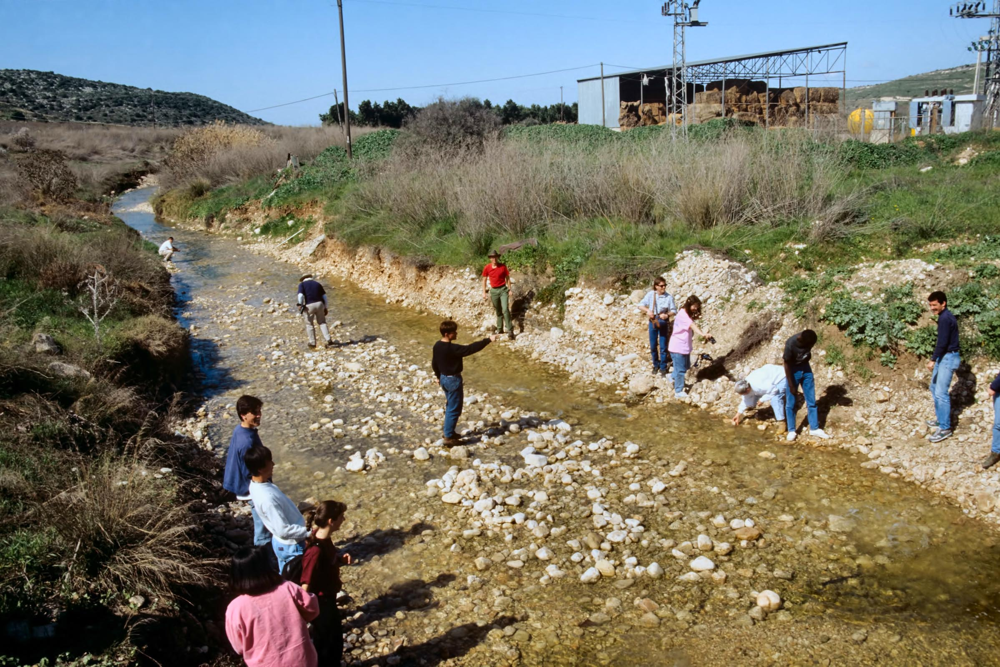

# The Hophal Stem - Strong {.Hp-s}

::: {.infobox .sound}
<figure><audio id="myAudio" controls controlsList="nodownload" src="./images/32.intro.m4a">
Your browser does not support the <code>audio</code> element.</audio>
<button onclick="setPlaySpeed25()" type="button">2.5x</button> <button onclick="setPlaySpeed2()" type="button">2x</button> <button onclick="setPlaySpeed15()" type="button">1.5x</button> <button onclick="setPlaySpeed1()" type="button">1x</button> <button onclick="setPlaySpeed075()" type="button">.75x</button> <button onclick="setPlaySpeed05()" type="button">.5x</button> 
<script>
var x = document.getElementById("myAudio");
function setPlaySpeed05() { x.playbackRate = 0.5; x.play();}
function setPlaySpeed075() {x.playbackRate = 0.75; x.play();} 
function setPlaySpeed1() {x.playbackRate = 1; x.play();}
function setPlaySpeed15() {x.playbackRate = 1.5; x.play();} 
function setPlaySpeed2() {x.playbackRate = 2; x.play();} 
function setPlaySpeed25() {x.playbackRate = 2.5;x.play();} 
</script> </figure>
:::

Of the seven major stems, the Hophal occurs with the least frequency (396 times, roughly split between the Perfect, Imperfect, and Participle). Like the Pual, the Hophal has some distinctive characteristics making it straightforward to identify.

::: {.box .map}
LESSON ITINERARY

1. Meaning of the Hophal Stem
1. Hophal Strong paradigms
:::

::: {.box .stop}
EQUIPMENT CHECK

Before continuing, make sure you understand the meaning of the Hiphil stem

:::

## First Thought {-}

::: {.infobox .sound}
<figure><audio id="myAudio" controls controlsList="nodownload" src="./images/32-8.1Samuel 25.15.mp3">
Your browser does not support the <code>audio</code> element.</audio>
<button onclick="setPlaySpeed25()" type="button">2.5x</button> <button onclick="setPlaySpeed2()" type="button">2x</button> <button onclick="setPlaySpeed15()" type="button">1.5x</button> <button onclick="setPlaySpeed1()" type="button">1x</button> <button onclick="setPlaySpeed075()" type="button">.75x</button> <button onclick="setPlaySpeed05()" type="button">.5x</button> 
<script>
var x = document.getElementById("myAudio");
function setPlaySpeed05() { x.playbackRate = 0.5; x.play();}
function setPlaySpeed075() {x.playbackRate = 0.75; x.play();} 
function setPlaySpeed1() {x.playbackRate = 1; x.play();}
function setPlaySpeed15() {x.playbackRate = 1.5; x.play();} 
function setPlaySpeed2() {x.playbackRate = 2; x.play();} 
function setPlaySpeed25() {x.playbackRate = 2.5;x.play();} 
</script> </figure>
:::

### <span class="he">וְהָ֣אֲנָשִׁ֔ים טֹבִ֥ים לָ֖נוּ מְאֹ֑ד וְלֹ֤א הָכְלַ֙מְנוּ֙ וְלֹֽא־פָקַ֣דְנוּ מְא֔וּמָה כָּל־יְמֵי֙ הִתְהַלַּ֣כְנוּ אִתָּ֔ם בִּֽהְיוֹתֵ֖נוּ בַּשָּׂדֶֽה׃</span> {-}

*Yet the men were very good to us, and we were not insulted, nor did we miss anything as long as we went about with them, while we were in the fields. (1 Samuel 25:15)*

The _Hebrew Quest_ Study Passage for this lesson is David and Goliath from 1st Samuel 17.  The passage's geographic detail reminds us that the events involved real people and real places.  This is true even though these events took place thousands of years ago and thousands of miles away. 

HaShem had these details recorded for a reason. Through our study of Hebrew, we can connect with these great stories in a more intimate way.  Praise Him for that!


```{r, out.width = "400pt", fig.align='center', fig.cap="Elah brook with students picking smooth stones. Courtesy of the [Pictorial Library of Bible Lands](https://www.bibleplaces.com)"}


``` 


## Hophal Verb Stem Table

::: {.infobox .sound}
<figure><audio id="myAudio" controls controlsList="nodownload" src="./images/32.1.m4a">
Your browser does not support the <code>audio</code> element.</audio>
<button onclick="setPlaySpeed25()" type="button">2.5x</button> <button onclick="setPlaySpeed2()" type="button">2x</button> <button onclick="setPlaySpeed15()" type="button">1.5x</button> <button onclick="setPlaySpeed1()" type="button">1x</button> <button onclick="setPlaySpeed075()" type="button">.75x</button> <button onclick="setPlaySpeed05()" type="button">.5x</button> 
<script>
var x = document.getElementById("myAudio");
function setPlaySpeed05() { x.playbackRate = 0.5; x.play();}
function setPlaySpeed075() {x.playbackRate = 0.75; x.play();} 
function setPlaySpeed1() {x.playbackRate = 1; x.play();}
function setPlaySpeed15() {x.playbackRate = 1.5; x.play();} 
function setPlaySpeed2() {x.playbackRate = 2; x.play();} 
function setPlaySpeed25() {x.playbackRate = 2.5;x.play();} 
</script> </figure>
:::

| |Active Voice| Passive Voice | Reflexive Voice
|:- |:- |:- |:-
Simple Action	| Qal | Niphal | (Niphal)
Cause a State	| Piel | Pual | Hitpael
Cause an Action	|Hiphil | __HOPHAL__

Meanings:

* Being Caused to Do Something
* Passive of Hiphil -  <span class="he">יצא</span>
    * Q - he went out
    * H - he brought out
    * Hp - he was brought out
* Sometimes passive of Qal - <span class="he">נתן</span>
    * Q - to give
    * Hp - to be given

Parsing Code: Hp (_P_assive of _H_iphil)

## Hophal Strong Parsing Clues - $Pre$: Think "Houûphal"

::: {.infobox .sound}
<figure><audio id="myAudio" controls controlsList="nodownload" src="./images/32.2.m4a">
Your browser does not support the <code>audio</code> element.</audio>
<button onclick="setPlaySpeed25()" type="button">2.5x</button> <button onclick="setPlaySpeed2()" type="button">2x</button> <button onclick="setPlaySpeed15()" type="button">1.5x</button> <button onclick="setPlaySpeed1()" type="button">1x</button> <button onclick="setPlaySpeed075()" type="button">.75x</button> <button onclick="setPlaySpeed05()" type="button">.5x</button> 
<script>
var x = document.getElementById("myAudio");
function setPlaySpeed05() { x.playbackRate = 0.5; x.play();}
function setPlaySpeed075() {x.playbackRate = 0.75; x.play();} 
function setPlaySpeed1() {x.playbackRate = 1; x.play();}
function setPlaySpeed15() {x.playbackRate = 1.5; x.play();} 
function setPlaySpeed2() {x.playbackRate = 2; x.play();} 
function setPlaySpeed25() {x.playbackRate = 2.5;x.play();} 
</script> </figure>
:::

* Preformatives
    * Hophal verbs have preformative ה like the Hiphil
    * Imperfects and Participles have the usual preformatives
* $V_P = O$, $U$, or $\hat U$, indicates Hophal 
    * So a mnemonic for this stem might be: "<u>houûphal</u>"
    * The Hophal occurs with either u-class or o-class
    * O - Qamets Hatuf <span class="he">הָקְטַל</span>  
    * U - Qibbuts <span class="he">הֻקְטַל</span>
    * Û - Shureq 
        * <span class="he">הוּרַד</span> (Iי)
        * <span class="he">הוּשַׁט</span> (Biconsonantal)
        * <span class="he">הוּחַל</span> (Geminate)
    * HIPHIL 1-Yod will have $\bar O$ or $\hat O$ (see Lesson 31)
* Hophal Strong $Pre$ sequences are:
    * <span class="he">הָקְ</span> or <span class="he">הֻקְ</span> - HpP
    * <span class="he">יָקְ</span> or <span class="he">יֻקְ</span> - (etc.) HpI
    * <span class="he">מָקְ</span> or <span class="he">מֻקְ</span> - HpPt^[The remaining conjugations are rare in the Hebrew Bible, so we will skip them.]
* Given that $V_1 = ə$, we expect 1נ to assimilate (as it does in QI and NP)

::: {.box .caution}
QAMETS HATUF OR QAMETS?

* We learned many lessons ago that Qamets or Qamets Hatuf, <span class="he">ָ</span>, followed by a Sheva is potentially ambiguous
    * QAMETS followed by VOCAL Sheva _or_ QAMETS HATUF followed by SILENT Sheva?
* When $V_P$ is <span class="he">ָ</span> followed by $V_1$ of Sheva or Hateph Qamets Hatuf, $V_P$ is ALWAYS QAMETS HATUF
    * This is not necessarily the case when the positions are $V_1$ and $V_2$
* Therefore, in the Hophal Stem, <span class="he">הָקְטַל</span> is pronounced "hoq-TAL" (rhymes with "Hophal").
:::

## Hophal Strong Parsing Clues - $V_S$ = A

::: {.infobox .sound}
<figure><audio id="myAudio" controls controlsList="nodownload" src="./images/32.3.m4a">
Your browser does not support the <code>audio</code> element.</audio>
<button onclick="setPlaySpeed25()" type="button">2.5x</button> <button onclick="setPlaySpeed2()" type="button">2x</button> <button onclick="setPlaySpeed15()" type="button">1.5x</button> <button onclick="setPlaySpeed1()" type="button">1x</button> <button onclick="setPlaySpeed075()" type="button">.75x</button> <button onclick="setPlaySpeed05()" type="button">.5x</button> 
<script>
var x = document.getElementById("myAudio");
function setPlaySpeed05() { x.playbackRate = 0.5; x.play();}
function setPlaySpeed075() {x.playbackRate = 0.75; x.play();} 
function setPlaySpeed1() {x.playbackRate = 1; x.play();}
function setPlaySpeed15() {x.playbackRate = 1.5; x.play();} 
function setPlaySpeed2() {x.playbackRate = 2; x.play();} 
function setPlaySpeed25() {x.playbackRate = 2.5;x.play();} 
</script> </figure>
:::

* P,I,M,∞ is $A$, just like the Pual stem
* Particle stem is lengthened P3ms as expected - HpP3ms uses $A$, so HpPt use $\bar A$ 
* Infinitive Absolute is $\bar E$ as expected (but there are only 6 HpA in the Bible)

## Hophal Perfect Strong Paradigm

* The standard Perfect sufformatives
* $V_S = A$
* $V_P$ is variable between Qibbuts and Qamets Hatuf.  Only the O-class is listed below and in the audio. 


| Sing | Paradigm | Plural | Paradigm
| :-  | :- | :-  | :-
| 3ms | <span class="he">הָקְטַל</span>  | 3cp | <span class="he">הָקְטְלוּ</span> 
| 3fs | <span class="he">הָקְטְלָה</span> | 
| 2ms | <span class="he">הָקְטַ֫לְתָּ</span> | 2mp | <span class="he">הָקְטַלְתֶּם</span>
| 2fs | <span class="he">הָקְטַלְתְּ</span> | 2fp | </span><span class="he">
| 1cs | <span class="he">הָקְטַ֫לְתִּי</span> | 1cp | <span class="he">הָקְטַ֫לְנוּ</span>

<figure>
    <figcaption>Hophal Perfect Strong from _Hebrew Quest_ Chapter 15</figcaption>
    <audio
        controls controlsList="nodownload"
        src="./images/32-Hp-perfect-strong.mp3">
            Your browser does not support the
            <code>audio</code> element.
    </audio>
</figure>


## Hophal Imperfect Strong Paradigm

* The standard Imperfect preformatives and sufformatives
* $V_S = A$
* $V_P$ is variable between Qibbuts and Qamets Hatuf.  Only the O-class is listed below and in the audio. 

| Sing | Paradigm | Plural | Paradigm
| :-  | :- | :-  | :-
| 3ms | <span class="he">יָקְטַל</span>  | 3mp | <span class="he">יָקְטְלוּ</span> 
| 3fs | <span class="he">תָּקְטַל</span> | 3fp | <span class="he">תָּקְטַ֫לְנָה</span>
| 2ms | <span class="he">תָּקְטַל</span> | 2mp | <span class="he">תָּקְטְלוּ</span>
| 2fs | <span class="he">תָּקְטְלִי</span> | 2fp | <span class="he">תָּקְטַ֫לְנָה</span>
| 1cs | <span class="he">אָקְטַל</span> | 1cp | <span class="he">נָקְטַל</span>

<figure>
    <figcaption>Hophal Imperfect Strong from _Hebrew Quest_ Chapter 15</figcaption>
    <audio
        controls controlsList="nodownload"
        src="./images/32-Hp-imperfect-strong.mp3">
            Your browser does not support the
            <code>audio</code> element.
    </audio>
</figure>


## Hophal Participle Strong Paradigm

* The standard Participle prefix (מ)
* The standard $V_S = \bar A$ - lengthening of P3ms
* The standard inflectional endings of the Participle
* Again, both Qibbuts and Qamets Hatuf are used interchangeably

| Sing | Paradigm | Plural | Paradigm
| :-  | :- | :-  | :-
| ms | <span class="he">מָקְטָל</span> | mp | <span class="he">מָקְטָלִים</span>
| fs | <span class="he">מָקְטֶ֫לֶת</span> | fp | <span class="he">מָקְטָלוֹת</span>

### Participle Prefixes in the Derived Stems {-}

Again we present this table for review:

Stem | Prefix 
:- | :-: 
Niphal | נִ |
Piel | מְ
Pual | מְ
Hiphil | ַמ
HOPHAL (u-class) | <span class="he">מֻ</span>
HOPHAL (o-class) | ָ<span class="he">מ</span>
Hitpael | מִתְ


## What to memorize: Hophal

::: {.infobox .sound}
<figure><audio id="myAudio" controls controlsList="nodownload" src="./images/32.7.m4a">
Your browser does not support the <code>audio</code> element.</audio>
<button onclick="setPlaySpeed25()" type="button">2.5x</button> <button onclick="setPlaySpeed2()" type="button">2x</button> <button onclick="setPlaySpeed15()" type="button">1.5x</button> <button onclick="setPlaySpeed1()" type="button">1x</button> <button onclick="setPlaySpeed075()" type="button">.75x</button> <button onclick="setPlaySpeed05()" type="button">.5x</button> 
<script>
var x = document.getElementById("myAudio");
function setPlaySpeed05() { x.playbackRate = 0.5; x.play();}
function setPlaySpeed075() {x.playbackRate = 0.75; x.play();} 
function setPlaySpeed1() {x.playbackRate = 1; x.play();}
function setPlaySpeed15() {x.playbackRate = 1.5; x.play();} 
function setPlaySpeed2() {x.playbackRate = 2; x.play();} 
function setPlaySpeed25() {x.playbackRate = 2.5;x.play();} 
</script> </figure>
:::

* Like $V_1$ in the Pual, the Hophal has a distinguishing O or U class $V_P$
* Think "Houûphal"
* $V_S$ is almost always Patach
    * There is expected lengthening to Qamets in the Participle
    * The rare Infinitive Absolute has the expected Tsere (see `Ruth Pursuit` below)

## Stem Comparison Table

* Here is the Stem Comparison Table showing the stems we have studied thus far


```{r, out.width = "600pt", fig.align='center'}
library(knitr)
include_graphics("images/32_stemcomp.png")
```

## Word Warm-up {-}

<div class="container">
<iframe class="responsive-iframe" src="https://youtube.com/embed/MdXXlMyr4Lg" frameborder="0"></iframe>
</div>


[Click to open `Word Warm-up` video in a new tab](https://youtu.be/MdXXlMyr4Lg){target="_blank"}


## Verses Warm-up {-}

<div class="container">
<iframe class="responsive-iframe" src="https://youtube.com/embed/O5CU62O94Cw" frameborder="0"></iframe>
</div>


[Click to open `Verses Warm-up` video in a new tab](https://youtu.be/O5CU62O94Cw){target="_blank"}

## Hophal Strong Worksheet {-}

Complete this [Hophal parsing worksheet](./images/32_hophal_strong_paradigms.pdf){target="_blank"} using the concepts discussed in this lesson.  Paradigm memorization should not be necessary.

     
## Ruth Pursuit {-}

There are no Hophal verbs in Ruth 1, so there will be no `Ruth Pursuit` for Lessons 32 or 33.

* There ARE two Hophal verbs in 2:11.  Can you find them?
    * <span class="he"> וַיַּ֤עַן בֹּ֙עַז֙ וַיֹּ֣אמֶר לָ֔הּ הֻגֵּ֨ד הֻגַּ֜ד לִ֗י כֹּ֤ל אֲשֶׁר־עָשִׂית֙ אֶת־חֲמוֹתֵ֔ךְ אַחֲרֵ֖י מ֣וֹת אִישֵׁ֑ךְ וַתַּֽעַזְבִ֞י אָּבִ֣יךְ וְאִמֵּ֗ךְ וְאֶ֙רֶץ֙ מֽוֹלַדְתֵּ֔ךְ וַתֵּ֣לְכִ֔י אֶל־עַ֕ם אֲשֶׁ֥ר לֹא־יָדַ֖עַתְּ תְּמ֥וֹל שִׁלְשֽׁוֹם׃</span>
    * There are only six HpA forms in all of the Hebrew Bible (and some sources say there are only five).  One of those forms is in Ruth 2:11.  Note how $V_S$ is Tsere for the HpA verb, and how $V_S$ is Qamets in the HpP3ms verb that follows.
    * The verb root is נגד
    * The Daghesh Forte in the Gimmel represents the assimilated 1נ
* Dr. Beckman explains, "Infinitive Absolutes typically underscore the certainty of something. But in this past tense context where Boaz uses the word <span class="he">כֹּל</span>, it seems more likely that he is referring to the completeness of the report that he has received."^[Beckman. "Notes on Ruth" p. 27.  https://hebrewsyntax.org/bbh2new/00_Ruth_notes.pdf ]


## Ruth Pursuit Analysis {-}

It's time for the next segment of translating Ruth.  We'll continue with "Scene 2": Ruth 1:15-19a.

::: {.box .map}
YOUR QUEST

1. Read Ruth 1:15-19a (the first וַיְהִי marks the start of 19b) in the Hebrew text and underline any words or forms do you not recognize
    * There is one Hitpael form in this passage in verse 18 that we have not yet studied
2. Using what you have learned about syntax/phrase constructions and context, provide your own interpretative translation 
3. Compare your version with translations such as JPS, KJV, ESV, NASB, NIV, or NLT.  
    * At what points do you agree and disagree with translation decisions made by these publications? 

:::


## Honors Track: _Hebrew Quest_ Study Passage: 1 Samuel 17 {-}


::: {.box .map}
YOUR HEBREW QUEST

1. Read the passage - [Blank copy of 1 Samuel 17](https://docs.google.com/document/d/1jX0OyJq3--vHWysXkZfXKNDCUFvOf04TalAEQInX6C8/copy){target="_blank"}
2. Now re-read the passage critically
    1. Highlight any words you do not know and look them up in a [lexicon](https://holylanguage.com/resources-dictionaries.php){target="_blank"}
    2. Parse as many verbs as you can
    3. Sketch out a translation - there is a blank line between each verse
3. Now, using your marked-up copy of the passage, watch Izzy's _Hebrew Quest_ video (video opens in a new tab)
    * [part 1](https://holylanguage.com/samuel-17.1.php){target="_blank"}
    * [part 2](https://holylanguage.com/samuel-17.2.php){target="_blank"}
4. After the video, assess your translation.  How close was it?
    * You may wish to check your parsing and translation [here](https://scholarsgateway.com/search/WLC-ESV/1%20Samuel/17){target="_blank"}
    * Check the "verbs" box to highlight all of the verbs in the passage, then hover over each verb for parsing information
5. How did the Ruach HaKodesh speak to you through the passage?
:::


## Lesson Extras {-}

* [Dr. Beckman Lecture Video](http://youtu.be/CeGTW1NOmrc){target=“_blank”}
* [Dr. Beckman Lecture Notes](https://hebrewsyntax.org/bbh2new/32-33_overheads_bw.pdf){target=“_blank”}
* [BBH Lesson Summary](http://hebrew.billmounce.com/BasicsBiblicalHebrew-32.pdf){target=“_blank”}
* [BBH Study Verses PDF](http://hebrew.billmounce.com/Biblical_examples_32.pdf){target=“_blank”}
* Additional Drills/Worksheets 
    * [Quiz](https://hebrewsyntax.org/bbh2new/32_quiz_new.pdf){target=“_blank”} 

