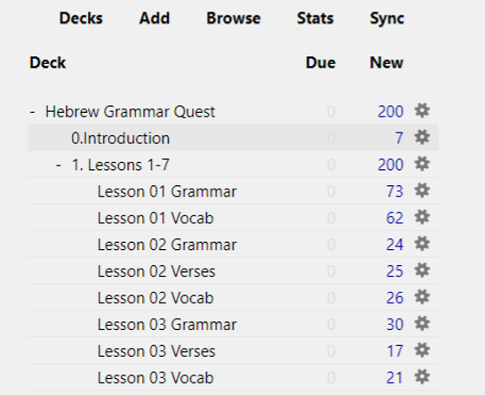
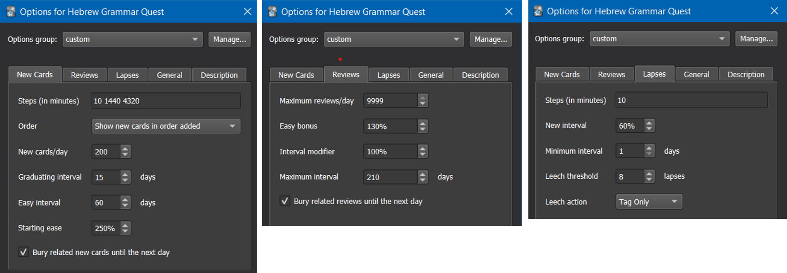
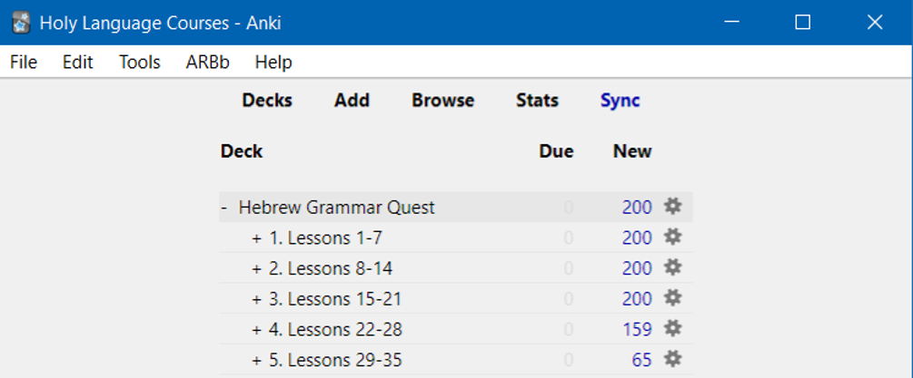
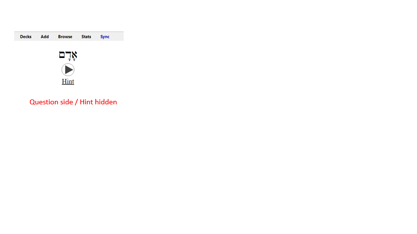
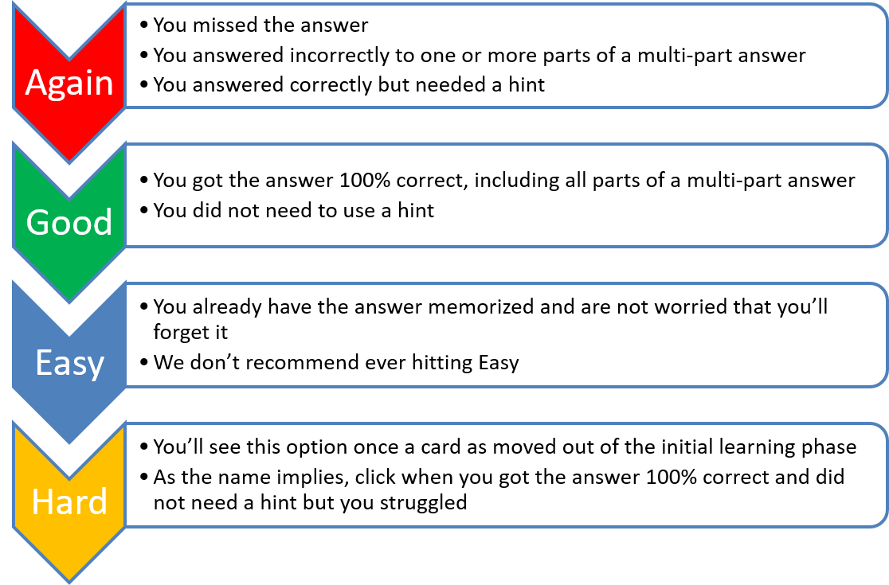
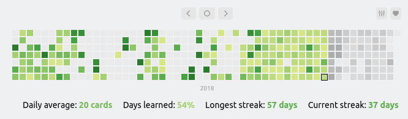
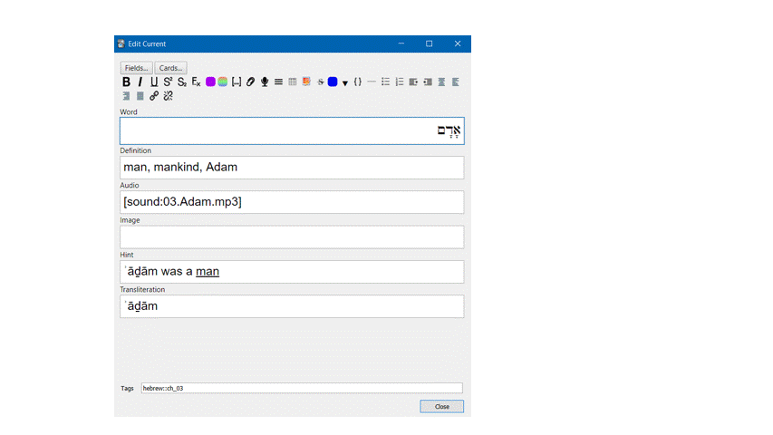

# Appendix A: About Anki {- #Anki}

<!-- Grammarly check: 10/24/2020 - 179 lines -->

> Strength and Endurance Builds Muscle


```{r, fig.show="hold", out.width = "250pt", fig.align='center', fig.cap="Strength and Endurance"}

include_graphics("images/weight.png")
include_graphics("images/treadmill.png")
```


If one wants to build strength, she might use the weight machine.  If one wants to build endurance and overall health, she might use the treadmill.  Most people will want to use a combination of both. What does this have to do with Anki (whatever that is)? I’m glad you asked!


## Anki is Gym Equipment for your Brain {-}

```{r, out.width = "150pt", fig.align='center', fig.cap="Anki Home Screen"}


```

Anki is free<small>^[<small>all platforms are free, except for the iOS app, which costs $25. The developers use the proceeds to fund future development.  Most reviews say the cost is worth it if you have Apple devices and use Anki regularly.</small>]</small> flashcard application that contains a unique algorithm to present you with cards to review at just the right times.

Thus, it is not just a flashcard program but is a tremendous strength and endurance tool for learning, and it is where we will be spending the bulk of your time in the course.  It has become the “go-to” for many medical school students to learn all the intricate facts they have to know.

## How to install Anki {-}

While eventually, you can do all work from a mobile device, you do need to do the initial set up from a desktop.  We're not sure why, but this is how it is.  Once you do this and then synch to the free Anki cloud, you'll be off and running with mobile use.

1. Download and install the [free Ezra SIL font](https://software.sil.org/downloads/r/ezra/EzraSIL-2.51.zip ){target="_blank"}
1. [Sign up for a free account here](https://ankiweb.net/account/register){target="_blank"}
1. [Download the Anki Program (Mac/PC/Linux)](https://apps.ankiweb.net/){target="_blank"}

## Change some Anki Settings {-}

1. Change USER1 Name 
    1. In Anki, click File, then Switch Profile  
    2. Select “User 1,” then Rename and type your name
1. Change global settings
    1. Click `Tools,` then `Preferences.`
        1. On the `Basic` tab, some people prefer `night mode` - if this is you, check the `Night Mode` box
        2. On the `Scheduling` tab:
            1. Check the box that says `Anki 2.1 Scheduler.`
            2. Note the hour the `next day` starts - 
                * You want to set this for a time where you will NOT be doing reviews.  
                * For most people, 4:00 am is a safe time, but if you're routinely awake at 4:00 am, set this field to be earlier or later.

### Below is the main set you will want to change.  Enter these numbers carefully: {-}

1. Back on the main page, click the gear wheel to the right of “Hebrew Grammar Quest” and select “Options”
    1. Change settings on each tab to match this picture
```{r, out.width = "700pt", fig.align='center', fig.cap="Settings"}


```

## [Download the Hebrew GRAMMAR Quest (Preview Version) Anki Deck](./images/Hebrew Grammar Quest PREVIEW.apkg){target="_blank"} {-}


## Navigating within Anki {-}

* Click the +/- buttons to expand/collapse the folders within the Anki deck
```{r, out.width = "400pt", fig.align='center', fig.cap="Anki - subdecks collapsed"}


```
    * To start with Lesson 01 Vocabulary, expand to reveal this deck, click on `Lesson 01 Vocabulary` and click the `STUDY NOW` button
* Many cards have "hints" - click on the `hint` button to reveal
    * If you needed a hint, be sure to select `Again` on the answer side. See discussion below.
    ```{r, out.width = "800pt", fig.align='center', fig.cap="Revealing a hint in Anki"}


```  
* For cards that have audio, it should play when you are first shown the card. If you need to hear the audio again, hit the `play` button
* When you are ready to see the answer, click Spacebar, Enter, or the `Show Answer` button

## How do I know when to hit the `Good` button on a **Vocabulary** or **Grammar** card? {-}

We suggest using the following guidelines to select the most appropriate answer.

```{r, out.width = "700pt", fig.align='center', fig.cap="Anki Response Definitions"}


```     

* There is no “value judgment” to hitting `Again` – you will learn on your timeline
* Be honest with yourself! 
* If you doubt, between `Again` and `Good,` select `Again.`

## How do I know when to hit the `Good` button on a **Verse Translation** card? {-}

While the same general guidelines apply to all cards, one of the main goals of this course is to give you the ability to translate from Hebrew to English at a basic level.    

Below are some guidelines for answering the Verse Translation cards:
* You do not necessarily need to be able to translate the entire passage from memory.  Suppose you can comfortably read the Hebrew. Your translation is roughly similar to the English answer (it doesn't have to be exact).  In that scenario, you should hit `good.`
1. If your translation is missing one or more words (again excluding roughly equivalent meanings), you should select `again.`
1. If you need to use a `hint,` you should select `again` until you can translate without needing to refer to the hint.
1. We do not recommend selecting `easy.` An exception might be when you are confident that you already have the word, rule, or passage memorized.

Most importantly, be patient with yourself.  It may take you many tries in the early going before you can hit `good.`

Learning a new language is not easy.  We applaud you for the Hebrew learning road you are now taking!

## Anki Add-ons {-}

* Add-ons are small packages that extend the base application of Anki.
* Many add-ons are geared towards the developers/editors of decks, but there are a few that enhance the end-user experience
* To access, select `Tools,` `Add-ons,` then click `Get Add-ons...`
* You will then be asked for the add-on code, which will install the add-on
* Click `Browse Add-ons` to be taken to the Anki Add-on website, where you can get the code
* For example, this add-on will change the button colors:
    * `The KING of Button Add-ons` - `374005964.`

## How often should I expect to work in Anki? {-}

The best case is DAILY.

Once you get going, you may find you look forward to it.

There is a custom add-on called `Review Heatmap.`  At the time we are writing this Guidebook, the Add-on is still in beta, so it's not available on the Anki Add-on page.  

* [Click here to download](./images/review-heatmap-v1.0.0-beta.1-anki21.ankiaddon)
* Then double-click and restart Anki
* You will now see a grid that shows you your daily reviews to keep you motivated

```{r, out.width = "800pt", fig.align='center', fig.cap="Keep your daily Anki streak going!"}


```  


## Can I add an image or a hint? {-}

* If you would like to edit a card, such as to add a picture or change/add a hint - you can do this.  Just press `E.`
    * You can do this from either the "question" or the "answer" side of the card
    * We do not recommend you change the `word,` `definition` or `audio` fields
    * To add an image simply copy and paste into the image field
```{r, out.width = "400pt", fig.align='center', fig.cap="Adding a custom image in Anki"}


```  

## Can I modify the layout of a card? {-}

The short answer is `yes,` but you would need to learn more about how Anki works.  Such a discussion is beyond our scope with this book. Still, if you are interested in learning more about Anki, there are dozens of YouTube videos.

### Proceed with caution: {-}

With the above caveat, if you are comfortable with Anki, we have added some extra `Note Types.` 

1. Click `Browse.`
1. Select the card(s) you wish to change 
1. If you want to be tested on both Hebrew-to-English and reverse, English-to-Hebrew, select note type `Vocab Basic Hebrew/English.`
1. If you have added images and want Anki to test you on Hebrew-to-English, English-to-Hebrew, and Image-to-Hebrew, select note type `Vocab Basic Hebrew/English/Image.`
1. If you have added images and only want to be tested on Hebrew-to-English and Image-to-Hebrew, select note type `Vocab Basic Hebrew/Image.`
1. If you want to be tested audio to Hebrew (and reverse), select note type `Vocab Basic Hebrew/Audio` - the Aleph-bet cards use this note type
Just be aware that changing to one of these optional note types will double (or triple if you chose Hebrew/English/Image) the number of vocabulary cards.  If you decide you want to go back to Hebrew-to-English, repeat steps 1-4 and select Note Type `Vocab Basic Hebrew.`

## What does `There are more new cards available, but the daily limit has been reached` mean? {-}

Anki is doing precisely what we told it to do in the `settings`!  As much as possible, we want to let Anki tell _us_ when to work.

* We go when it tells us there are cards to learn or review
* We stop when it tells us there are no cards

1. We set new cards to `200` - it's essential not to overload yourself.
    * Generally, if you work one deck at a time, e.g. `Lesson 01 A. Vocab`, then `Lesson 01 B. Grammar` and so on, you will be less likely to hit the daily limit
    * You can keep going using the `Custom Study.` Do note the warning: `You can increase the limit in the options, but please bear in mind that the more new cards you introduce, the higher your short-term review workload will become.`
2. We checked `bury related cards.`
    * If an answer has two parts in two separate questions, we want to make sure you answer the second question from your knowledge, not because you just saw the solution on a related card
    * If you want to work on these cards anyway, click `Unbury.`

```{r, out.width = "400pt", fig.align='center', fig.cap="With `Custom Study` you can temporarily increase your daily new cards"}

include_graphics("images/a.anki_custom_study")
``` 

