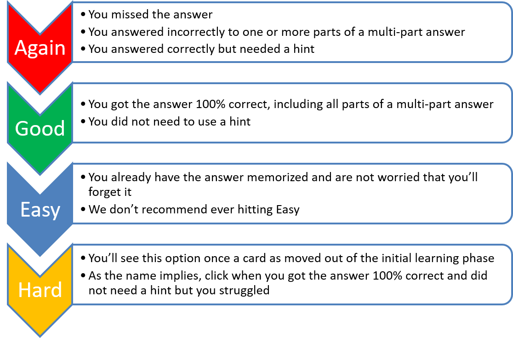
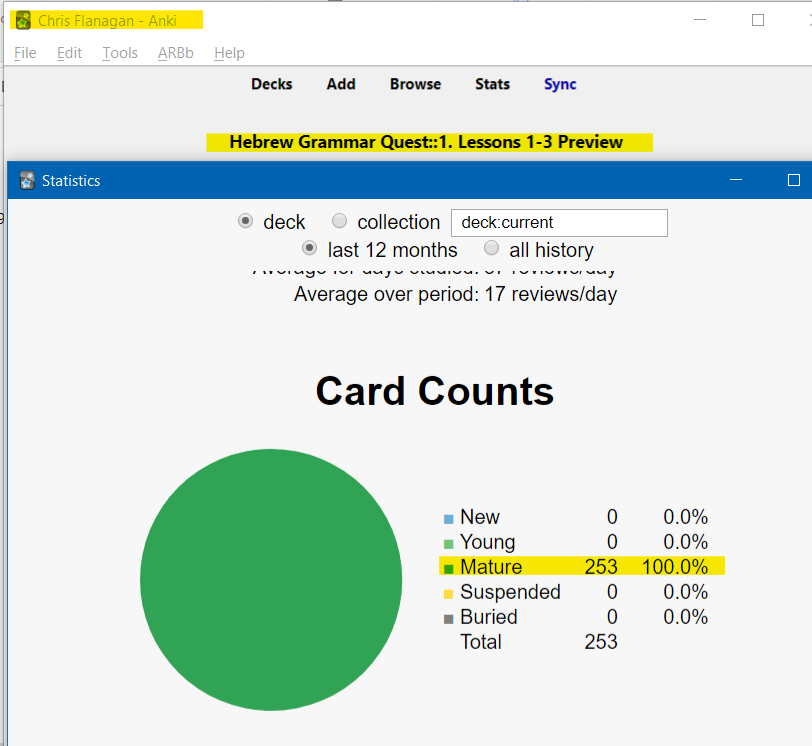
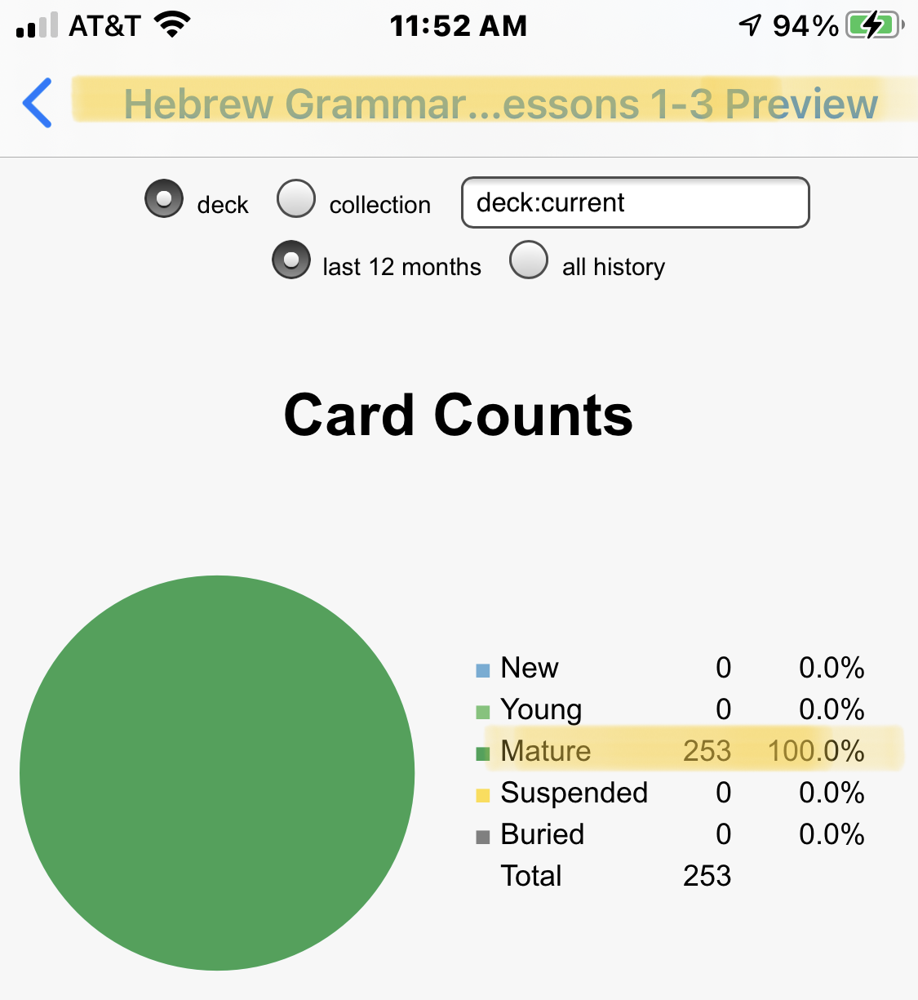
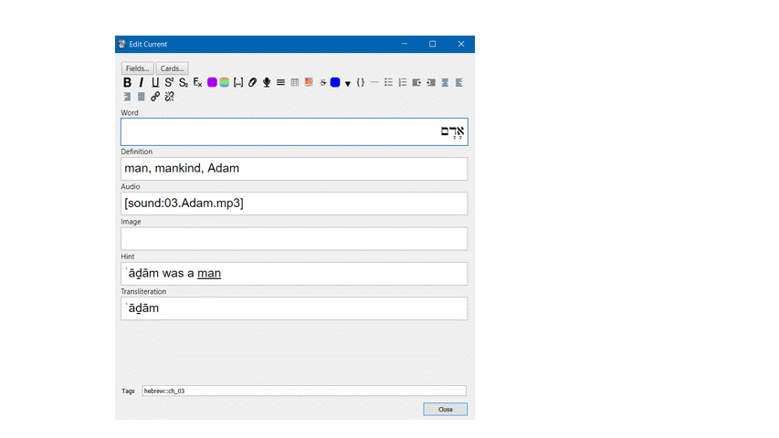
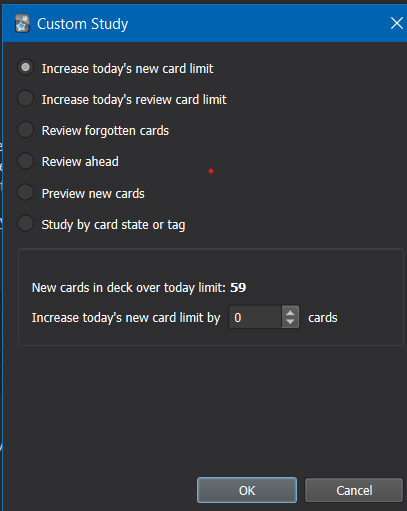

# Anki info and FAQ {#anki_faq}


> Strength and Endurance Builds Muscle


```{r, fig.show="hold", out.width = "250pt", fig.align='center', fig.cap="Strength and Endurance"}

include_graphics("images/weight.png")
include_graphics("images/treadmill.png")
```


If one wants to build strength, she might use a weight machine.  If one wants to build endurance and overall health, she might use the treadmill.  Most people will want to use a combination of both. What does this have to do with Anki (whatever that is)? I’m glad you asked!


> Anki is Gym Equipment for your Brain 

```{r, out.width = "350pt", fig.align='center', fig.cap="Anki Home Screen"}

include_graphics("images/Anki_home_screen.png")
```

Anki is free<small>^[<small>all platforms are free, except for the iOS app, which costs $25. The developers use the proceeds to fund future development.  Most reviews say the cost is worth it if you have Apple devices and use Anki regularly.</small>]</small> flashcard application that contains a unique algorithm to present you with cards to review at just the right times.

Thus, it is not just a flashcard program but is a tremendous strength and endurance tool for learning, and it is where we will be spending the bulk of your time in the course.  It has become the “go-to” for many medical school students to learn all the intricate facts they have to know.

::: {.box .info}
It is beyond our scope to give you a complete tutorial on Anki.  There are plenty of blogs and videos posted by the Anki community, which you can find from a simple websearch: `Anki tuturial`.
:::

## Installation {- #installation_anki}

**Anki NOTE**: Eventually, you can do all work from a mobile device.  _For the initial Anki install, you do need to do these steps from a desktop<small>^[<small>By "desktop" we generically mean a desktop or laptop computer (as opposed to a mobile device) running a Windows, Mac, or Linux operating system.</small>]</small> computer_.

Follow the steps outlined on the Quick Start page.

## Customize Anki Settings {- #anki_settings}

1. Change USER1 Name 
    1. In Anki, click File, then Switch Profile  
    2. Select “User 1,” then Rename and type your name
1. Change global settings
    1. Click `Tools,` then `Preferences.`
        1. On the `Basic` tab, some people prefer `night mode` - if this is you, check the `Night Mode` box
        2. On the `Scheduling` tab:
            1. Check the box that says `Anki 2.1 Scheduler.`
            2. Note the hour the `next day` starts - 
                * You want to set this for a time where you will NOT be doing reviews.  
                * For most people, 4:00 am is a safe time, but if you're routinely awake at 4:00 am, set this field to be earlier or later.

### Below is the main set you will want to change.  Enter these numbers carefully: {-}

1. Back on the main page, click the gear wheel to the right of “Hebrew Grammar Quest” and select “Options”
    1. `New Cards`<small>^[<small> See https://docs.ankiweb.net/#/deck-options?id=new-cards for additional information</small>]</small>
        * `Steps` = 10 1440 4320
        * `New cards/day` = 200
        * `Graduating interval` = 15
        * `Easy interval` = 60
        * `Starting ease` = 250%
        * `Bury related new cards...` = Up to you but we recommend - CHECKED
    2. `Reviews`<small>^[<small> See https://docs.ankiweb.net/#/deck-options?id=reviews for additional information</small>]</small>
        * `Maximum reviews/day` = 9999
        * `Easy bonus` = 130%
        * `Interval modifier` = 100
        * `Maximum interval` = 210
        * `Bury related reviews...` = Up to you but we recommend - CHECKED    
    3. `Lapses`
        * `Steps` = 10
        * `New interval` = 60
        * `Maximum interval` = 1
        * `Leech threshold` = 8
        * `Leech action` = TAG ONLY

Your settings should look like this:
```{r, out.width = "700pt", fig.align='center', fig.cap="Settings"}

knitr::include_graphics("images/anki_custom_new.png")
```

[Return to Quick Start page](#get_started)

## How do I access Anki on my mobile device? {-}

After you have installed Anki, loaded a deck and then synched to your Ankiweb account, theoretically, you do not ever need to access the non-mobile version again.

There are versions of the mobile app in the Google or Apple store.  As we mentioned above, the apple version is a one-time cost of $25. Once you download the app, you can login with your same Ankiweb account and, if you synched from the desktop version of the software, you should see the Hebrew GRAMMAR Quest deck appear.

You can also access a [web-based version of Anki (login with your Ankiweb credentials)](https://ankiweb.net/decks/).  Functionality is a bit more limited, but it is generally sufficient for the learning aspects.  Please note you will need the not be able to meet the `Graduation Process` requirements for the `Certificate` or `Diploma` using only ankiweb.net  

One note: if you plan to go back and forth between a computer and a mobile device, make sure you sync after each session.

Here are the steps:

1. On your laptop/desktop: Sync → Log In → log in using your account information
1. If a pop-up window asks you, choose "**Upload to** AnkiWeb"
1. On your phone, download and install the Anki app.
    * The Android app is free. The iPhone app costs $25.
1. On your phone, start the Anki app and log in using your account information
1. If a pop-up window asks you, choose "**Download from** AnkiWeb"
1. Anki will now automatically keep your work on your phone and laptop/desktop in sync.

```{r, fig.show="hold", out.width = "250pt", fig.align='center', fig.cap="Anki web and mobile views"}


```

## How do I navigate within Anki? {-}

* Click the +/- buttons to expand/collapse the folders within the Anki deck
```{r, out.width = "400pt", fig.align='center', fig.cap="Anki - subdecks collapsed"}

include_graphics("images/anki.png")
```
    * To start with Lesson 01 Vocabulary, expand to reveal this deck, click on `Lesson 01 Vocabulary` and click the `STUDY NOW` button
* Many cards have "hints" - click on the `hint` button to reveal
    * If you needed a hint, be sure to select `Again` on the answer side. See discussion below.
    ```{r, out.width = "800pt", fig.align='center', fig.cap="Revealing a hint in Anki"}

include_graphics("images/a.anki_hint.gif")
```  
* For cards that have audio, it should play when you are first shown the card. If you need to hear the audio again, hit the `play` button
* When you are ready to see the answer, click Spacebar, Enter, or the `Show Answer` button

## How do I know when to hit the `Good` button on a **Vocabulary** or **Grammar** card? {-}

We suggest using the following guidelines to select the most appropriate answer.

```{r, out.width = "700pt", fig.align='center', fig.cap="Anki Response Definitions"}


```     

* There is no “value judgment” to hitting `Again` – you will learn on your timeline
* Be honest with yourself! 
* If you doubt, between `Again` and `Good,` select `Again.`

## How do I know when to hit the `Good` button on a **Verse Translation** card? {-}

While the same general guidelines apply to all cards, one of the main goals of this course is to give you the ability to translate from Hebrew to English at a basic level.    

Below are some guidelines for answering the Verse Translation cards:
* You do not necessarily need to be able to translate the entire passage from memory.  Suppose you can comfortably read the Hebrew. Your translation is roughly similar to the English answer (it doesn't have to be exact).  In that scenario, you should hit `good.`
1. If your translation is missing one or more words (again excluding roughly equivalent meanings), you should select `again.`
1. If you need to use a `hint,` you should select `again` until you can translate without needing to refer to the hint.
1. We do not recommend selecting `easy.` An exception might be when you are confident that you already have the word, rule, or passage memorized.

Most importantly, be patient with yourself.  It may take you many tries in the early going before you can hit `good.`

Learning a new language is not easy.  We applaud you for the Hebrew learning road you are now taking!

## What are Anki Add-ons? {-}

* Add-ons are small packages that extend the base application of Anki.
* Many add-ons are geared towards the developers/editors of decks, but there are a few that enhance the end-user experience
* To access, select `Tools,` `Add-ons,` then click `Get Add-ons...`
* You will then be asked for the add-on code, which will install the add-on
* Click `Browse Add-ons` to be taken to the Anki Add-on website, where you can get the code
* For example, this add-on will change the button colors:
    * `The KING of Button Add-ons` - `374005964.`

## How often should I expect to work in Anki? {-}

The best case is DAILY.

Once you get going, you may find you look forward to it.

There is a custom add-on called `Review Heatmap.`  At the time we are writing this Guidebook, the Add-on is still in beta, so it's not available on the Anki Add-on page.  

* [Click here to download](./images/review-heatmap-v1.0.0-beta.1-anki21.ankiaddon)
* Then double-click and restart Anki
* You will now see a grid that shows you your daily reviews to keep you motivated

```{r, out.width = "800pt", fig.align='center', fig.cap="Keep your daily Anki streak going!"}

include_graphics("images/a.year_heatmap.png")
```  

## How do I know when I'm done with a deck? {-}

Learning and active-recall is an on-going process. In theory, Anki will keep scheduling reviews until you delete the deck.  This follows a "use it or lose it" philosophy.  If we spend a day learning some material but then don't think about it again for two weeks, we're likely to forget most of it.

So while this could be an indefinite process, we do have some guidelines as they pertain to the `Course Checklist` and the `Certificate`/`Diploma`.

* For the `Course Checklist`, all cards should be moved out of the `New` category and into the `Young` or `Mature` categories, with no cards `Suspended` or `Buried`. 
* To qualify for a `Certificate` or `Diploma`, all cards must be in the `Mature` category with no cards `New`, `Young`, `Suspended`, or `Buried`.

```{r, out.width = "900pt", fig.align='center', fig.cap="DESKTOP Card Counts chart from Anki Stats showing all cards = Mature"}


``` 

See the next two pages for more information on how to locate your statistics.

## Anki Completion Requirements for the`Course Checklist` {-}

For each lesson, we are looking for all cards to be moved out of the `New` category and into the `Young` or `Mature` categories, with no cards `Suspended` or `Buried`.  Below are the steps to check.

_You must do the steps below  from a Desktop (or laptop) or the ios/Android mobile app.  Statistics are not available from the ankiweb.net site_.

1. In Anki, select the applicable deck, for example "`Lesson 01 A.Vocab`"
    1. On mobile, once you tap the deck it may take you into the deck information section.
    1. Click the left arrow in the upper left of the screen to access the bar chart icon
2. Click on `Stats` (desktop) or tap the Bar chart icon (mobile)
3. Scroll down to the `Card Counts` pie graph
4. If all cards are `Young` or `Mature` with no cards `New`, `Suspended`, or `Buried` as shown on the acceptable examples below, you can mark that deck as completed on your `Course Checklist`

```{r, out.width = "1000pt", fig.align='center', fig.cap="DESKTOP Card Counts chart from Anki Stats showing all cards = Mature"}


``` 


## Anki Completion Requirements for the `Certificate` {-}

To be eligible for the `Certificate`<small>^[<small>Certificates are not available in the Preview Version of Hebrew GRAMMAR Quest.</small>]</small> and `Diploma`, you will need to provide a screenshot from the Anki `Stats`.  The `Card Counts` pie chart should reflect ALL cards for the unit are in the `Mature` row.

_You must do the steps below  from a Desktop (or laptop) or the ios/Android mobile app.  Statistics are not available from the ankiweb.net site_.

1. In Anki, select the applicable unit, for example "`Hebrew Grammar Quest::1. Lessons 1-3`"
    1. On mobile, once you tap the deck it may take you into the deck information section.
    1. Click the left arrow in the upper left of the screen to access the bar chart icon
2. Click on `Stats` (desktop) or tap the Bar chart icon (mobile)
3. Scroll down to the `Card Counts` pie graph
4. If all cards are  `Mature` with no cards `New`, `Young`, `Suspended`, or `Buried`, and you have done everything else for that unit on the `Course Checklist`, you are ready to apply for your unit completion `Certificate` or `Diploma`.  CAPTURE A SCREENSHOT as directed below:
    * Desktop: Make sure the Statistics window is aligned on top of the main Anki widow so that the course name is visible as shown in the image below:
```{r, out.width = "300pt", fig.align='center', fig.cap="DESKTOP Card Counts chart from Anki Stats showing all cards = Mature"}


``` 
    * Mobile - simply capture a screenshot showing the `Card Counts` statistics as shown below:
    
```{r, out.width = "300pt", fig.align='center', fig.cap="MOBILE: Card Counts chart from Anki Stats showing all cards = Mature"}


``` 
<!-- Please see [`Graduation` process page]() for additional information -->

## What do the different card stages mean? {-}

There are a few different terms Anki uses for different stages of card maturity:


* `New` Cards
    * `Unseen` - A card you have not seen!
    * `Learn` - a card you have seen that is in the initial learning phase. Based on our settings above, you need to get a card correctly three consecutive times for three days in a row (4320 minutes) to move from `Learn` to `Young`.
* `Review` Cards
    * `Young` - a card that has "graduated" from the `Learn` stage, but has a calculated review interval of less than 21 days
    * `Mature` - a card that has a calculated review interval greater than 21 days
* `Lapse` - a card formerly in the `Review` category that was answered incorrectly
    * `Relearn` - the phase to describe a lapsed card that you are relearning

## Can I add an image or a hint? {-}

* If you would like to edit a card, such as to add a picture or change/add a hint - you can do this.  Just press `E.`
    * You can do this from either the "question" or the "answer" side of the card
    * We do not recommend you change the `word,` `definition` or `audio` fields
    * To add an image simply copy and paste into the image field
```{r, out.width = "400pt", fig.align='center', fig.cap="Adding a custom image in Anki"}


```  

## Can I modify the layout of a card? {-}

The short answer is `yes,` but you would need to learn more about how Anki works.  Such a discussion is beyond our scope with this book. Still, if you are interested in learning more about Anki, there are dozens of YouTube videos.

### Proceed with caution: {-}

With the above caveat, if you are comfortable with Anki, we have added some extra `Note Types.` 

1. Click `Browse.`
1. Select the card(s) you wish to change 
1. If you want to be tested on both Hebrew-to-English and reverse, English-to-Hebrew, select note type `Vocab Basic Hebrew/English.`
1. If you have added images and want Anki to test you on Hebrew-to-English, English-to-Hebrew, and Image-to-Hebrew, select note type `Vocab Basic Hebrew/English/Image.`
1. If you have added images and only want to be tested on Hebrew-to-English and Image-to-Hebrew, select note type `Vocab Basic Hebrew/Image.`
1. If you want to be tested audio to Hebrew (and reverse), select note type `Vocab Basic Hebrew/Audio` - the Aleph-bet cards use this note type
Just be aware that changing to one of these optional note types will double (or triple if you chose Hebrew/English/Image) the number of vocabulary cards.  If you decide you want to go back to Hebrew-to-English, repeat steps 1-4 and select Note Type `Vocab Basic Hebrew.`

## What does `There are more new cards available, but the daily limit has been reached` mean? {-}

Anki is doing precisely what we told it to do in the `settings`!  As much as possible, we want to let Anki tell _us_ when to work.

* We go when it tells us there are cards to learn or review
* We stop when it tells us there are no cards

1. We set new cards to `200` - it's essential not to overload yourself.
    * Generally, if you work one deck at a time, e.g. `Lesson 01 A. Vocab`, then `Lesson 01 B. Grammar` and so on, you will be less likely to hit the daily limit
    * You can keep going using the `Custom Study.` Do note the warning: `You can increase the limit in the options, but please bear in mind that the more new cards you introduce, the higher your short-term review workload will become.`
2. We checked `bury related cards.`
    * If an answer has two parts in two separate questions, we want to make sure you answer the second question from your knowledge, not because you just saw the solution on a related card
    * If you want to work on these cards anyway, click `Unbury.`

```{r, out.width = "400pt", fig.align='center', fig.cap="With `Custom Study` you can temporarily increase your daily new cards"}


``` 


## How do I submit screenshots for the `Certificate`? {-}
