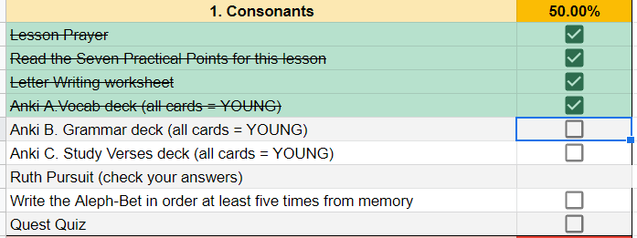

# About this course {- #about_this_course}

FAQs about the Course

* [Why is Holy Language Institute offering a Hebrew grammar course?](#why_grammar)
* [How does this grammar course relate to _Hebrew Quest_?](#hgq_and_hq)
* [What if I haven't finished _Hebrew Quest_?](#finish_hq)
* [What can I do with the knowledge taught in Hebrew GRAMMAR Quest?](#whocanuse)
* [What is a typical Hebrew GRAMMAR Quest lesson?](#typical_lesson)
* [What are the required/optional course resources?](#optional_resources)
* [How do I use and navigate the Hebrew GRAMMAR Quest website?](#navigating)
* [Why is it called "Hebrew GRAMMAR Quest"?](#whygrammarquest)


FAQs about Anki

* [How do I navigate within Anki?](#anki_navigate)
* [How do I know which button to select on an Anki card?](#anki_buttons)
* [How do I get help with Anki?](#anki_help)
* [What is the `HGQ Custom Words` Deck?](#anki_custom_words)

## Why is Holy Language offering a Hebrew grammar course? {- #why_grammar}


::: {.infobox .sound}
<figure> <audio id="myAudio" controls controlsList="nodownload" src="./images/61.01.whyhebrewgrammar.m4a"> Your browser does not support the <code>audio</code> element.</audio><button onclick="x25()" type="button">2.5x</button><button onclick="x2()" type="button">2x</button><button onclick="x15()" type="button">1.5x</button><button onclick="x1()" type="button">1x</button><button onclick="x075()" type="button">.75x</button><button onclick="x05()" type="button">.5x</button><script>
var x = document.getElementById("myAudio");
function x05() { 
    x.playbackRate = 0.5;
    x.play();}
function x075() { 
    x.playbackRate = 0.75;
    x.play();} 
function x1() { 
    x.playbackRate = 1;
     x.play();}
function x15() { 
    x.playbackRate = 1.5;
     x.play();} 
function x2() { 
    x.playbackRate = 2;
     x.play();} 
function x25() { 
    x.playbackRate = 2.5;
     x.play(); } 
</script></figure>
:::


If you are familiar with our ministry, you know our flagship course ***Hebrew Quest***, which introduces our students to Yeshua and our Jewish Bible.

***Hebrew Quest*** was designed to get students into the Hebrew text as quickly as possible, with minimal focus on learning rules. For many of our students, this approach is quite successful.  We noticed that many other students started to drop off between lessons 12 and 16, after the Aleph-Bet lectures. For some students, these lessons were too much Hebrew grammar too fast, and for others, it was not enough Hebrew grammar.  

As a result, several of our students have asked us for a grammar resource to supplement _Hebrew Quest_.  

As we searched for a resource to recommend to these students, we noticed that they tended to fall into one of two camps:

1. <u>A workbook or a series of videos that are entirely self-paced/self-directed</u> 
2. <u>Academic/Seminary level textbooks and courses</u>

These two are often opposite extremes.  Self-paced courses can have too little structure and often provide only a superficial review of Hebrew.  In the end, the student may only be slightly more prepared to read the Hebrew Bible than if they had not done the course.  There are also limited feedback opportunities as these courses are designed for independent learning.  On the other hand, seminary courses and seminary-level textbooks are usually incredibly rigorous with copious amounts of reading, rote memorization of paradigms, lectures, and exams. Academic courses are fast-paced and high-stress ^[For example, in a seminary course, the 36 lessons in <u>Basics of Biblical Hebrew</u> are usually completed in 16 weeks.]. Seminary textbooks generally are much more detailed and advanced than most of our students need (or would enjoy)^[For example, there is usually an emphasis on writing Hebrew and conducting English-to-Hebrew translations.  While these may be important skills to become fluent in Hebrew, one does not need these skills to read and understand the Bible, especially from a spiritual or devotional perspective.]
   
Additionally, with either option, our Holy Language students would incur additional fees to purchase these materials.  Many of the resources we researched are top-notch.  Depending on a student's goals, we would not hesitate to recommend them.  It's just that they were not quite what we were seeking for the majority of our students.

See the next section to learn how Hebrew GRAMMAR Quest is distinct.

## What is the Relationship to _Hebrew Quest_? {- #hgq_and_hq}

::: {.infobox .sound}
<figure> <audio id="myAudio" controls controlsList="nodownload" src="./images/61.02.relationtohq.m4a"> Your browser does not support the <code>audio</code> element.</audio><button onclick="x25()" type="button">2.5x</button><button onclick="x2()" type="button">2x</button><button onclick="x15()" type="button">1.5x</button><button onclick="x1()" type="button">1x</button><button onclick="x075()" type="button">.75x</button><button onclick="x05()" type="button">.5x</button><script>
var x = document.getElementById("myAudio");
function x05() { 
    x.playbackRate = 0.5;
    x.play();}
function x075() { 
    x.playbackRate = 0.75;
    x.play();} 
function x1() { 
    x.playbackRate = 1;
     x.play();}
function x15() { 
    x.playbackRate = 1.5;
     x.play();} 
function x2() { 
    x.playbackRate = 2;
     x.play();} 
function x25() { 
    x.playbackRate = 2.5;
     x.play(); } 
</script></figure>
:::

```{r, out.width = "800pt", fig.align='center'}

knitr::include_graphics("images/i.hq_hgq.png")
``` 

We've said that Hebrew GRAMMAR Quest does not replace _Hebrew Quest_.  Instead, we believe Hebrew GRAMMAR Quest supports and extends _Hebrew Quest_.  In fact, one way to think of Hebrew GRAMMAR Quest could be as "Hebrew Quest: Extended Edition"!  

Suppose you were to take a hypothetical microscope and inspect Lessons 12-15 of _Hebrew Quest_. These are the lessons where Izzy reviews Vowels, Nouns, Pronouns, Verbs, and other grammar topics.  Under that microscope, <u>Hebrew GRAMMAR Quest</u> is what you would see. 


* Hebrew GRAMMAR Quest will start with a brief review of the Aleph-bet and the vowels we learned in _Hebrew Quest_ Lessons 1-12
* Then we begin our deep dive into core grammar topics touched upon in _Hebrew Quest_ Lessons 13-15
* Additionally, starting with Hebrew GRAMMAR Quest Lesson 12, students can elect to complete a "_Hebrew Quest_ Study Passage Track"
    * Primary geared for students who have not yet completed all of _Hebrew Quest_, this will incorporate the Proverbs study and the Bible reading sections from _Hebrew Quest_
    * Students will read through the passage and compose a translation
    * They will then watch Izzy's _Hebrew Quest_ teaching video explaining the passage
    * Students who complete all of the _Hebrew Quest_ Study Passage Tracks will receive extra special recognition upon completion of the course.  It our way of saying you have graduated "with honors"!

## Is completion of _Hebrew Quest_ is a prerequisite? {- #finish_hq}

::: {.infobox .sound}
<figure> <audio id="myAudio" controls controlsList="nodownload" 
src="./images/61.03.hqprerequisite.m4a"> 
Your browser does not support the <code>audio</code> element.</audio><button onclick="x25()" type="button">2.5x</button><button onclick="x2()" type="button">2x</button><button onclick="x15()" type="button">1.5x</button><button onclick="x1()" type="button">1x</button><button onclick="x075()" type="button">.75x</button><button onclick="x05()" type="button">.5x</button><script>
var x = document.getElementById("myAudio");
function x05() { 
    x.playbackRate = 0.5;
    x.play();}
function x075() { 
    x.playbackRate = 0.75;
    x.play();} 
function x1() { 
    x.playbackRate = 1;
     x.play();}
function x15() { 
    x.playbackRate = 1.5;
     x.play();} 
function x2() { 
    x.playbackRate = 2;
     x.play();} 
function x25() { 
    x.playbackRate = 2.5;
     x.play(); } 
</script></figure>
:::

Emphatically NO!

If you _have_ finished _Hebrew Quest_, Hebrew GRAMMAR Quest might be a logical next step to go deeper.

On the other hand, maybe you started _Hebrew Quest_ but hit some roadblocks.  In that case, Hebrew GRAMMAR Quest can provide you with important underlying grammatical concepts so, eventually, you can return to _Hebrew Quest_ and finish up. 

It's important to know that Hebrew GRAMMAR Quest is an _extension_ of Hebrew Quest, not a substitute.  

As a best-case, we recommend you complete _Hebrew Quest_ Lessons 1-12 before starting Hebrew GRAMMAR Quest.  So, if you haven't started either course, go ahead and start with the first part of _Hebrew Quest_.  _Hebrew Quest_ [videos are here](https://holylanguage.com/quest.html){target="_blank"}, and the accompanying [Memrise module is here](https://app.memrise.com/course/5406435/hebrew-quest-lessons-1-to-40/){target="_blank"}.

To say it differently, _Hebrew Quest_ and Hebrew GRAMMAR Quest complement one another in a circular (and maybe slightly paradoxical!) form:

* The more _Hebrew Quest_ you have completed, the more you will get out of Hebrew GRAMMAR Quest, and . . .
* The more Hebrew GRAMMAR Quest you have completed, the more you will get out of _Hebrew Quest_ (especially _Hebrew Quest_ Lessons 13-40)
* Either way, you can't go wrong!  The most important thing is to start and ultimately complete both.  Again, the _Hebrew Quest_ study passage track within Hebrew Grammar Quest will get you on your way to this lofty goal of completing both courses.


Refer to the section on Anki and course setup to get your Hebrew GRAMMAR Quest outfitted properly.

## What can I do with the knowledge taught in Hebrew GRAMMAR Quest? {- #whocanuse}

* We believe this course, in conjunction with __Hebrew Quest__, would prepare a pastor or lay-teacher of a small-group, or traditional Christian or Messianic congregation to have a basic understanding of the Hebrew text in order to exegete and communicate beginning and intermediate level Hebrew/Hebraic concepts to a lay audience.  
* Even so, we are not presenting this as a substitute for seminary-level Hebrew for those who are seeking (or whose vocational position requires) more of a formal instructional approach. 
* With all this said, the more of THIS course and _Hebrew Quest_ you complete, the more rewarding and enriching any future formal Hebrew coursework will be!. 
* In any case, ***our prayer is that this course, along with Hebrew Quest, will give new life to Hebrew application in that person's teaching ministry***.  This book's compiler can testify to this!

## Why is the course called "Hebrew GRAMMAR Quest"? {- #whygrammarquest}

* **Hebrew** - the course is about _Hebrew_ grammar as opposed to some other kind of grammar!
* **GRAMMAR** - The word "GRAMMAR", in all caps, emphasizes its distinctness from _Hebrew Quest_; yet placing the word "GRAMMAR" in the middle of _Hebrew Quest_ is a nod to the course's roots and integration with the original _Hebrew Quest_
* **Quest**  - calling the course a "Quest" means there is joy and reward in the _journey_ as well as treasure once the mission is completed

  

## Navigating the Hebrew GRAMMAR Quest website {- #navigating}

::: {.infobox .sound}
<figure> <audio id="myAudio" controls controlsList="nodownload" 
src="./images/61.04.navigate.m4a"> 
Your browser does not support the <code>audio</code> element.</audio><button onclick="x25()" type="button">2.5x</button><button onclick="x2()" type="button">2x</button><button onclick="x15()" type="button">1.5x</button><button onclick="x1()" type="button">1x</button><button onclick="x075()" type="button">.75x</button><button onclick="x05()" type="button">.5x</button><script>
var x = document.getElementById("myAudio");
function x05() { 
    x.playbackRate = 0.5;
    x.play();}
function x075() { 
    x.playbackRate = 0.75;
    x.play();} 
function x1() { 
    x.playbackRate = 1;
     x.play();}
function x15() { 
    x.playbackRate = 1.5;
     x.play();} 
function x2() { 
    x.playbackRate = 2;
     x.play();} 
function x25() { 
    x.playbackRate = 2.5;
     x.play(); } 
</script></figure>
:::

In the upper-left corner of this page, you will see a series of icons.  

```{r, out.width = "300pt", fig.align='center'}

knitr::include_graphics("images/toolbar.png")
``` 

These do the following tasks:

* the file drawer expands/collapses the sidebar table of contents; you can also click `s`
* the magnifying glass toggles search input; you can also click `f`
* the big `A` allows you to change the font size and theme
* the little `i` shows you available keyboard shortcuts


There are several ways to navigate from page to page within this website:

* Use the left-navigation sidebar (type `s` to reveal/hide)
* Click the left or right arrow on each page to go forward or back
* Use the left or right arrow keys on your keyboard to move forward or back
* Use hyperlinks on selected pages, like this one: [Continue to "A Typical Lesson" section](#features)

### Information Boxes {-}

As you work though Hebrew GRAMMAR Quest, you will notice several different information boxes uses to call out various topics.

::: {.infobox .map}
QUEST BOX

* The Lesson Itinerary - learning objectives
* Ruth Pursuit, Hebrew Quest Study Passages, and other "Quest" related topics
:::

::: {.infobox .stop}
STOP BOX

* Equipment Check - concepts from previous lessons you must know before starting the next lesson
* Other "Dont's"
:::

::: {.infobox .light}
LIGHT  BOX

* A critical point not to be missed
* Other "Do's"
* You will often want to MEMORIZE the concepts in a LIGHT box (but note the memory work will be done in Anki)
:::

::: {.infobox .info}
INFO  BOX


Additional information that is good to know
:::

::: {.infobox .caution}
CAUTION  BOX

A potential pitfall, such as a concept that could be easily confused with another
:::

::: {.infobox .sound}
AUDIO BOX

Either the section narration, read by Chris Flanagan, or the "First Thought" Hebrew verse, read by Izzy Avraham.

* Press the play button to start the audio and make sure your device's volume is at a comfortable level
* You can press one of the speed buttons to play the audio at that speed (2.5x - 0.5x) 
:::

We also have footnotes^[Citations and parenthetical/non-essential points will be included as footnotes throughout each lesson, if indicated.]


## What is a Typical Lesson? {- #typical_lesson}

```{r, out.width = "400pt", fig.align='center'}

```

::: {.infobox .sound}
<figure> <audio id="myAudio" controls controlsList="nodownload" 
src="./images/61.05.typicallesson.m4a"> 
Your browser does not support the <code>audio</code> element.</audio><button onclick="x25()" type="button">2.5x</button><button onclick="x2()" type="button">2x</button><button onclick="x15()" type="button">1.5x</button><button onclick="x1()" type="button">1x</button><button onclick="x075()" type="button">.75x</button><button onclick="x05()" type="button">.5x</button><script>
var x = document.getElementById("myAudio");
function x05() { 
    x.playbackRate = 0.5;
    x.play();}
function x075() { 
    x.playbackRate = 0.75;
    x.play();} 
function x1() { 
    x.playbackRate = 1;
     x.play();}
function x15() { 
    x.playbackRate = 1.5;
     x.play();} 
function x2() { 
    x.playbackRate = 2;
     x.play();} 
function x25() { 
    x.playbackRate = 2.5;
     x.play(); } 
</script></figure>
:::

In this course, you won't just read; you will DO!  This course is going to be jam-packed with activities. Below is what a typical lesson will contain^[We are following the same chapter organization as the textbook <u>Basics of Biblical Hebrew</u>, while extensively leveraging supplemental materials created by Dr. John Beckman, which he has generously made available for free to the Hebrew learning community.  See the [Course Structure](#what_to_expect) and our [Acknowledgments](#acknowledgments) pages for additional information.]:

::: {.box .caution}
A general comment about Hebrew GRAMMAR Quest

* At times, you may feel like information is being shot at you from a firehose and nothing is sinking in
* Often, this is just how it is when learning a new language
* You may be absorbing more than you think you are
* This is why we emphasize reinforcement of these concepts through activities
    * Notice the root word "active" in activities
* You will get introduced to the material via the Lesson Points, but don't expect to learn everything on the first pass (or from simply reading alone) 
* You will LEARN the material through the activities
::: 

**Title**|**Description**|**Estimated Minutes**
:-----|:----- | :---
  READING | 
Lesson Itinerary | Introduction and the lesson's learning objectives | <1
Equipment Check|Things you must have in your backpack before proceeding with the next phase of your journey | <1
First Thought | A Bible verse from the lesson in Hebrew, audio from Izzy, and a brief devotional | 5
Lesson Points | The main grammar concepts. Our goal is to give you just enough information to get started in `Anki`.  You can easily identify the Lesson Points as they will be the numbered sections in each lesson. 1.1, 1.2, etc.  Following each lesson, there will be a `BBH Lesson Summary` available from the `Lesson Extras` pages | 15-45
 ACTIVITIES|
 `Word and Verse Warm-ups`|Starting with Lesson 3, these are brief "stretching" exercises before doing the `Anki` workouts, narrated by Izzy! | 5-10
 `Anki`^[See [appendix](#anki_faq) for more information on Anki if you are not familiar with it.]| This is where the majority of your learning will take place.  There will be four modules to each Anki Lesson: `A. Vocab`, `B. Grammar`, `C. Workbook/Parsing`, and `D. Study Verses` | 60-180 total (Anki is meant to do a little each day as driven by the software's algorithm)
`A. Vocab`|By the end of the course, you will have around 500 Hebrew words memorized
 `B. Grammar`|Here, you will work through the main grammar concepts discussed in the lesson. Also, from time to time, Anki cards will contain material not covered in the Hebrew GRAMMAR Quest lessons.
 `C. Workbook/Parsing`| Brief Hebrew word activities to reinforce the grammar concepts.  In Unit 3, the focus shifts to what is called "parsing" of verbs.  Verb parsing means identifying the root, stem, person, gender, number, and meaning of a verb.
 `D. Study Verses`| You will begin to translate from Hebrew to English. This component may not be easy at first but stick with it!  Although these verses are similar to the _Hebrew Quest_ Memrise modules, our goal for the `Study Verses` is translation and comprehension, not rote memorization.
`Worksheets`|Additional activities to reinforce learning (selected lessons) | 30-45
`Ruth Pursuit`|Similar to the "bag the letter" activity in the early lessons of  _Hebrew Quest_. You will identify examples of grammar concepts in Ruth Chapter 1 | 15-60
`Quest Quiz`|Self-assessment activity to measure your familiarity with the material for YOU to assess whether you are ready to advance in your quest to the next lesson.  No grades are recorded or granted in this course. There are no quizzes after Lesson 11. | 15-30
`Twelve Tribes Badges`, Unit Completion `Certificates`, and `Graduation`| Fun things to mark and celebrate the completion of various stages of your GRAMMAR Quest | 3-5
TOTAL |Depending on how fast you work:|2.5-6 hours per Lesson

Of course, some lessons will be more involved than others, and each of us works at a different pace. One of the beautiful things about a self-paced class is the speed and due dates are not set by a course syllabus.   With a self-paced class, YOU are in control!

::: {.box .light}
DON'T BE OVERWHELMED!  YOU GOT THIS!

Use the `Course Checklist` to help keep you organized and do a little bit at a time. Instructions for accessing this are on the Quick Start page. If you haven't already downloaded it, you can get it [here](https://docs.google.com/spreadsheets/d/1t0C7JlygyUqgF_aQWbhq7h3s_VDn0VuvISJn5mp-LdE/copy){target="_blank"} 
:::

Also, for those seeking additional translation practice and exposure to the Hebrew Bible, we have an OPTIONAL "Honors Track", _Hebrew Quest_ Study Passages."  These will begin with Lesson 12.  You will read through the passage, compose a translation, then watch (or re-watch) the _Hebrew Quest_ video where Izzy walks us through the passage.  There is more information on this in the Unit 3 introduction.


  
## Course Resources {- #optional_resources}

```{r, out.width = "600pt", fig.align='center'}
library(knitr)
include_graphics("images/lexicon.jpg")
```

::: {.infobox .sound}
<figure> <audio id="myAudio" controls controlsList="nodownload" 
src="./images/61.06.resources.m4a"> 
Your browser does not support the <code>audio</code> element.</audio><button onclick="x25()" type="button">2.5x</button><button onclick="x2()" type="button">2x</button><button onclick="x15()" type="button">1.5x</button><button onclick="x1()" type="button">1x</button><button onclick="x075()" type="button">.75x</button><button onclick="x05()" type="button">.5x</button><script>
var x = document.getElementById("myAudio");
function x05() { 
    x.playbackRate = 0.5;
    x.play();}
function x075() { 
    x.playbackRate = 0.75;
    x.play();} 
function x1() { 
    x.playbackRate = 1;
     x.play();}
function x15() { 
    x.playbackRate = 1.5;
     x.play();} 
function x2() { 
    x.playbackRate = 2;
     x.play();} 
function x25() { 
    x.playbackRate = 2.5;
     x.play(); } 
</script></figure>
:::

REQUIRED: 

* Other than being a subscriber to Holy Language Institute, you will not need to purchase or obtain anything for this course (unless you want to)
* You will need a computer with internet access, a free Google account to open and complete documents and exercises, the free Anki desktop software to do the flashcard activities, a printer and a pen or a pencil to complete writing worksheets

OPTIONAL:

Below are additional resources, some of which are free and some paid:

* Free of charge
  * Thanks to his extremely generous reuse license, we have leveraged many of the worksheets and content from [Dr. John Beckman](https://hebrewsyntax.org/bbh2new/){target="_blank"}.  If you want more detail into any lesson, you may wish to refer to his videos and handouts.  Everything on [his site](https://hebrewsyntax.org/bbh2new/){target="_blank"} is free.  We have included most of these resources in our `Lesson Extras` sections.
  * [The Basics of Biblical Hebrew Lexicon](./images/BBH_Lexicon.pdf){target="_blank"}
    * A `lexicon` and a `dictionary` are virtually synonymous terms - academians tend to use the term `lexicon`
    * The authors of <u>Basics of Biblical Hebrew</u> have created an abridged lexicon to accompany this course
    * This document is beneficial as vocabulary words are indexed to the Lesson #, and irregular plural forms and selected construct forms are also included^[Students are also encouraged to review the Lexicon resources in the [Holy Language Heritage Library](https://holylanguage.com/resources-dictionaries.php){target="_blank"}.  These dictionaries are much more exhaustive.]
* Paid
  * Anki's iOS app requires a one-time purchase through the Apple store of $25.  If you have an iPhone, we believe this is a relatively inexpensive investment in your Hebrew journey, but the decision to purchase is entirely up to you.  You would be able to complete the course without purchase of the app.
  * To further supplement your studies, you may wish to purchase the _Basics of Biblical Hebrew_ textbook or any of the accompanying resources
    * [Basics of Biblical Hebrew Textbook](https://www.amazon.com/gp/product/031053349X/&tag=holylanginst-20)
    * [Basics of Biblical Hebrew Workbook](https://www.amazon.com/gp/product/0310533554/&tag=holylanginst-20)
    * [Basics of Biblical Hebrew Laminated Reference Card](https://www.amazon.com/gp/product/031026295X/&tag=holylanginst-20)
    * We would appreciate it if you would use one of the affiliate links, which allows Holy Language Institute to receive a small commission
    
    
::: {.box .caution}
You might want wait and see how you are doing with Hebrew GRAMMAR Quest through about Lesson 7 or 8 before deciding to purchase the iOS app or any of the books
:::


## How do I navigate within Anki? {- #anki_navigate}

```{r, out.width = "400pt", fig.align='center', fig.cap="Settings"}

```

::: {.infobox .sound}
<figure> <audio id="myAudio" controls controlsList="nodownload" 
src="./images/61.11.ankinavigate.m4a"> 
Your browser does not support the <code>audio</code> element.</audio><button onclick="x25()" type="button">2.5x</button><button onclick="x2()" type="button">2x</button><button onclick="x15()" type="button">1.5x</button><button onclick="x1()" type="button">1x</button><button onclick="x075()" type="button">.75x</button><button onclick="x05()" type="button">.5x</button><script>
var x = document.getElementById("myAudio");
function x05() { 
    x.playbackRate = 0.5;
    x.play();}
function x075() { 
    x.playbackRate = 0.75;
    x.play();} 
function x1() { 
    x.playbackRate = 1;
     x.play();}
function x15() { 
    x.playbackRate = 1.5;
     x.play();} 
function x2() { 
    x.playbackRate = 2;
     x.play();} 
function x25() { 
    x.playbackRate = 2.5;
     x.play(); } 
</script></figure>
:::


::: {.box .map}  
* We have created a brief tutorial within our Hebrew GRAMMAR Quest Unit 1 `Anki` deck
* This is contained in the `0.Introduction` folder
* Click on this deck for an introduction and helpful hints
* When you are finished you may `Suspend` the cards in the this folder only so you don't see them again (these are the only cards in the deck you should `Suspend`!)

:::

* Click the +/- buttons to expand/collapse the folders within the Anki deck [(click to see example)](./images/00.ankifolders.png){target="_blank"}
    * To start with Lesson 01 Vocabulary, click on the plus buttons within Unit 1, until you see `Lesson 01 Vocabulary` and click the `STUDY NOW` button
    * In your initial learning, start with the `module` level, i.e. `Lesson 01 Vocabulary` - do this untill all cards reach the `mature` stage
    * Once you have learned all cards in all modules, REVIEW at the Lesson level, e.g. `Lesson 01`
    * Once you have learned all cards in all Lessons in a unit, then REVIEW at the Unit level, e.g. `1. Lessons 1-3`
* Many cards have "hints" - click on the `hint` button to reveal [(click to see example)](./images/a.anki_hint.gif){target="_blank"}
    * If you needed a hint, be sure to select `Again` on the answer side
* When you are ready to see the answer, click Spacebar, Enter, or the `Show Answer` button

::: {.box .info}
Hints/Mnemonics

Several of the cards have silly mnemonics.  As we borrowed and reformatted the `Vocab` and `Grammar` cards from Dr. Beckman, most of the mnemonics were created by his students.  In most cases, we retained these but feel free to delete these from your deck (or simply ignore them)
:::

## How do I know which button to select on an Anki card? {- #anki_buttons}

```{r, out.width = "700pt", fig.align='center', fig.cap="Settings"}

```

::: {.infobox .sound}
<figure> <audio id="myAudio" controls controlsList="nodownload" 
src="./images/61.12.anki_good.m4a"> 
Your browser does not support the <code>audio</code> element.</audio><button onclick="x25()" type="button">2.5x</button><button onclick="x2()" type="button">2x</button><button onclick="x15()" type="button">1.5x</button><button onclick="x1()" type="button">1x</button><button onclick="x075()" type="button">.75x</button><button onclick="x05()" type="button">.5x</button><script>
var x = document.getElementById("myAudio");
function x05() { 
    x.playbackRate = 0.5;
    x.play();}
function x075() { 
    x.playbackRate = 0.75;
    x.play();} 
function x1() { 
    x.playbackRate = 1;
     x.play();}
function x15() { 
    x.playbackRate = 1.5;
     x.play();} 
function x2() { 
    x.playbackRate = 2;
     x.play();} 
function x25() { 
    x.playbackRate = 2.5;
     x.play(); } 
</script></figure>
:::

We suggest using the following guidelines:

* `Again`
  * Your answer was incorrect, or a mixture of correct and incorrect on a multi-part answer
  * Your answer was correct, but you required a hint
* `Hard` 
  * You otherwise met the requirements for `Good`, but you struggled to produce the correct answer or guessed. 
  * If you believe your correct answer had more to do with short-term recall instead of a firm grasp of the concept (e.g. you just saw the right answer a few minutes earlier and remembered what it was), you should select `Hard`.  This will present the card to you sooner (usually about 12 hours later) to make sure you really understand
  * Similarly for `Study Verses`, if you got the correct answer for any other reason than you were able to read the verse in Hebrew (for example, you happen to have that verse memoried in English), select `Hard`
* `Good`
  * All parts of the answer are correct; no hints
  * For Bible Verses, mark `Good` when:
    * you can read and understand the verse in Hebrew
    * Your translation is roughly similar to the English answer, even if you need to take a few moments to work through the verse
    * Your verb tense is correct (even though we won't study verbs until Unit 3)
    * You do NOT need to have the passage and its meaning memorized to mark `Good`
  * Be patient and honest with yourself.  If you are unsure between `Again` and `Good,` then select `Again.`
* `Easy`
  * We recommend limiting `Easy` to those instances where you are confident that you already have the word, rule, or passage memorized
    * If someone asked you in 60 days, would you be positive you'd remember the answer?
  * It would be too `easy` to circumvent the learning algorhithm in Anki by clicking `Easy` instead of `Good`


::: {.box .info}
Be patient with yourself.  It may take you _many_ tries in the early going before you can hit `Good.`

:::

## How do I get help with Anki? {- #anki_help}

::: {.infobox .sound}
<figure> <audio id="myAudio" controls controlsList="nodownload" 
src="./images/61.13.anki_help.m4a"> 
Your browser does not support the <code>audio</code> element.</audio><button onclick="x25()" type="button">2.5x</button><button onclick="x2()" type="button">2x</button><button onclick="x15()" type="button">1.5x</button><button onclick="x1()" type="button">1x</button><button onclick="x075()" type="button">.75x</button><button onclick="x05()" type="button">.5x</button><script>
var x = document.getElementById("myAudio");
function x05() { 
    x.playbackRate = 0.5;
    x.play();}
function x075() { 
    x.playbackRate = 0.75;
    x.play();} 
function x1() { 
    x.playbackRate = 1;
     x.play();}
function x15() { 
    x.playbackRate = 1.5;
     x.play();} 
function x2() { 
    x.playbackRate = 2;
     x.play();} 
function x25() { 
    x.playbackRate = 2.5;
     x.play(); } 
</script></figure>
:::


* We do have [help](#feedback_forms) forms to assist you with any issues related to the course, including our `Hebrew Grammar Quest Anki Deck`. 
  * Use the ["Get Help/Give Feedback" form](#get_help) to ask a question or report an error related to the Hebrew GRAMMAR Quest Anki decks
* Unfortunately, it is beyond our scope to give you a complete tutorial _or offer any technical support with the Anki software or mobile app_.  
* The good news is that there is a LARGE Anki user community across the globe
    * We encourage you to check out the numerous articles and tutorial videos posted by the Anki community
    * Generally, if you type your question or issue in a web search, you will find exactly the answer you are seeking
* The official Anki documentation is available [here](https://docs.ankiweb.net/#/){target="_blank"}.


<!-- deleted anki cards: -->
<!-- Introduction: -->
<!-- front: I want to test English to Hebrew. How can I set the deck to do this? -->
<!-- back: Our primary goal with Hebrew Grammar Quest is to translate from Hebrew to English.   -->

<!-- Most of our students studying Biblical Hebrew are not going to need to translate from English to Hebrew, although that is certainly a worthy pursuit.   -->


<!-- If you would like to add a reverse direction to your vocabularly words (Prompt with English - Answer with Hebrew) this is can be done in Anki. We have added "Note Types" to accomodate this. -->

<!-- Click "Browse" -->
<!-- From the Left Navigation, scroll down to "Vocab Basic Hebrew" -->
<!-- Select the card(s) you wish to change and add the additional options (To change ALL cards click CTRL+A to select all cards) -->
<!-- Click CTRL+SHIFT+M to change the note type to one of the following: -->
<!-- If you want to be tested on both Hebrew-to-English and reverse, English-to-Hebrew, select note type "Vocab Basic Hebrew/English" -->
<!-- If you have added images and want to be tested on Hebrew-to-English, English-to-Hebrew, and Image-to-Hebrew, select note type "Vocab Basic Hebrew/English/Image" -->
<!-- If you have added images and only want to be tested on Hebrew-to-English and Image-to-Hebrew, select note type "Vocab Basic Hebrew/Image" -->
<!-- Just be aware that changing to one of these optional note types, will literally double (or triple if you chose Hebrew/English/Image) the number of vocabularly cards.  If you decide you want to go back to just Hebrew-to-English, repeat steps 1-4 and select Note Type "Vocab Basic Hebrew." -->

<!-- Type ! (exclamation point) to dismiss this card. -->

## What is the `HGQ Custom Words` Deck? {- #anki_custom_words}


::: {.infobox .sound}
<figure> Note: this is the audio from the YouTube video: <audio id="myAudio" controls controlsList="nodownload" 
src="./images/61.14.anki_cust_words.mp3"> 
Your browser does not support the <code>audio</code> element.</audio><button onclick="x25()" type="button">2.5x</button><button onclick="x2()" type="button">2x</button><button onclick="x15()" type="button">1.5x</button><button onclick="x1()" type="button">1x</button><button onclick="x075()" type="button">.75x</button><button onclick="x05()" type="button">.5x</button><script>
var x = document.getElementById("myAudio");
function x05() { 
    x.playbackRate = 0.5;
    x.play();}
function x075() { 
    x.playbackRate = 0.75;
    x.play();} 
function x1() { 
    x.playbackRate = 1;
     x.play();}
function x15() { 
    x.playbackRate = 1.5;
     x.play();} 
function x2() { 
    x.playbackRate = 2;
     x.play();} 
function x25() { 
    x.playbackRate = 2.5;
     x.play(); } 
</script></figure>
:::

 
```{r, out.width = "500pt", fig.align='center', fig.cap="Settings"}

```

* On the Get started page, you should have downloaded and installed a deck called `HGQ Custom Words`
* This is an OPTIONAL deck for you to add additional cards for words or concepts that you would like extra focus or to expand your Hebrew vocabulary
* Steps in Anki:
  1. Copy the Hebrew word from one of the main Hebrew GRAMMAR Quest decks
  2. Click `Decks`
  3. Select `HGQ Custom Words` deck
  4. Click `Add`
  5. Make sure `type = Grammar Cloze`; if not, change type to `Grammar Cloze` by clicking on the type field
  6. Paste your Hebrew word, and type the English meaning next to the Hebrew word
  7. Select/highlight the English text then click the `Cloze` button: `[...]`
  8. Add any notes you want in the remaining fields, including any hints or mnemonics that will help you remember the word
  9. Click `Add`


::: {.box .info}
* We will learn the "parsing code" shown in the image in Unit 3
* [This site](https://scholarsgateway.com/search/WLC-ESV/Exodus/16:25) is extremely helpful with identifying parts of speech in the Tanach.
:::

The video link walks through these steps:  [YouTube: About Custom Words Deck](https://www.youtube.com/watch?v=jp8rhufAMU){target="_blank"}:

<div class="container">
<iframe class="responsive-iframe" src="https://www.youtube.com/embed/
jp8rhufAMU?rel=0&showinfo=0&autohide=1&autoplay=0" frameborder="0"></iframe>
</div>

