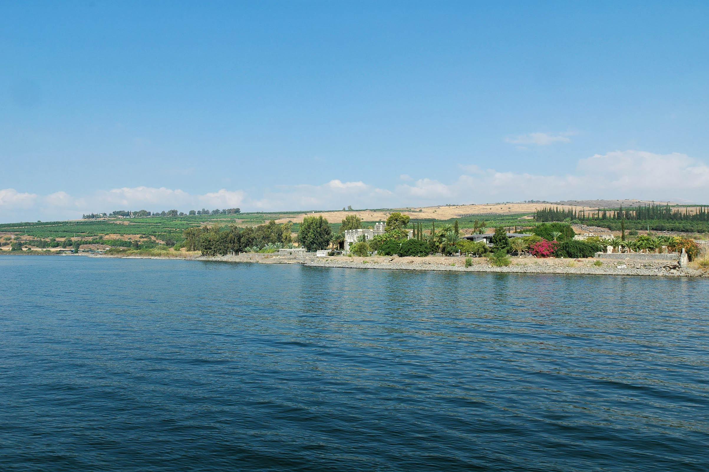

# LessonTitle {#lessontitle}

> To comprehend Biblical Hebrew, we must be able to . . . 

Say something general bridging the desired outcome above with the learning objectives below

::: {.box .map}
**LESSON ITINERARY**

1. learning_objective_1
1. learning_objective_2
1. learning_objective_3
1. learning_objective_4
1. learning_objective_5
1. learning_objective_6
1. learning_objective_7
:::

::: {.box .stop}
**EQUIPMENT CHECK**

Before continuing, can you describe the following concepts?

* 
*
:::

## First Thought {-}

### <span class="he"> </span> {-}

*verse (reference 1:1)*

-brief meditation-

<figure>
    <figcaption>Listen to the verse in Hebrew:</figcaption>
    <audio
        controls controlsList="nodownload"
        src="">
            Your browser does not support the
            <code>audio</code> element.
    </audio>
</figure>


*****

```{r, out.width = "400pt", fig.align='center', fig.cap="Capernaum and Mount of Beatitudes - suggested location of Yeshua's teachings we call 'the Sermon on the Mount' (Matthew 5-7). Courtesy of the [Pictorial Library of Bible Lands](https://www.bibleplaces.com)"}


``` 


---


```{r, out.width = "400pt", fig.align='center', fig.cap="Tabgha (John 21). Courtesy of the [Pictorial Library of Bible Lands](https://www.bibleplaces.com)"}


``` 

## Equipment Check {-}

```{r, out.width = "300pt", fig.align='center'}
library(knitr)
include_graphics("images/stopil.png")
```

Before continuing, can you describe the following concepts?

*


## Point1 


## Point2 


## Point3 


## Point4 


## Point5 


## Point6 


## Point7 


## `Word Warm-up` {-}

[Click to open `Word Warm-up` video in a new tab](){target="_blank"}


<div class="container">
<iframe class="responsive-iframe" src="https://youtube.com/embed/" frameborder="0"></iframe>
</div>


## `Verses Warm-up` {-}

[Click to open `Verses Warm-up` video in a new tab](){target="_blank"}

<div class="container">
<iframe class="responsive-iframe" src="https://youtube.com/embed/" frameborder="0"></iframe>
</div>

## `Anki` {-}

* `Lesson xx A. Vocab`
* `Lesson xx B. Grammar` 
* `Lesson xx C. Verses`
* `Lesson xx D. Workbook`

## `Worksheets`: NameOfWorksheet {-}

<describe the worksheet>

[Name of worksheet](){target="_blank"}

## `Ruth Pursuit` {-}        

### Your Quest: {-}

1. Instruction#1 (Yellow)
2. Instruction#2 (Green)
3. Instruction3 (Light Blue)
4. Instruction4 (Pink)
5. Instruction5 (Light Grey)
6. Instruction6 (Red) <!--Try to use darker colors sparingly -->
7. instruction7 (Blue)

* [Blank copy of Ruth 1](https://drive.google.com/file/d/1qcfTKAlTJGChC2eYCMhSbY2w-ibzCcDV/view?usp=sharing){target="_blank"}
* [Ruth Pursuit Answer Key #xx](./images/xx_Ruth_Pursuit_KEY.pdf){target="_blank"}


## `Hebrew Quest Study Passage`: Book Chapter# {-}

1. Read through the passage on your own.
2. Using a [Blank copy of the passage](){target="_blank"}:
    1. Highlight any words you do not know and look them up in a [lexicon](https://holylanguage.com/resources-dictionaries.php){target="_blank"}.    
    2. Parse as many verbs as you can.
    3. Sketch out a translation.
3. Watch Izzy's _Hebrew Quest_ video below [(Click to open video in a new tab)](https://www.youtube.com/embed/5hulHf6r7vk?end=874&rel=0&showinfo=0&autohide=1&autoplay=1){target="_blank"}
    1. How close was your translation?
    2. How did the Ruach HaQodesh speak to you?
4. Check your parsing against [this key](){target="_blank"}

<div class="container">
<iframe class="responsive-iframe" src="https://youtube.com/embed/" frameborder="0"></iframe>
</div>

## `Quest Quiz` {-}

[Open Quest Quiz #xx in a new window](){target="_blank"}

<div class="container">
<iframe class="responsive-iframe" src="" frameborder="0"></iframe>
</div>

## Claim your next `Twelve Tribes Badge`! {-}

Check to be sure you have have completed **all activities** through this lesson, then fill out the form below.

[Check to be sure you have completed all ACTIVities here](){target="_blank"}, complete the certification below, and your badge will be on its way!

<div class="container">
<iframe class="responsive-iframe" src="" frameborder="0"></iframe>
</div>

