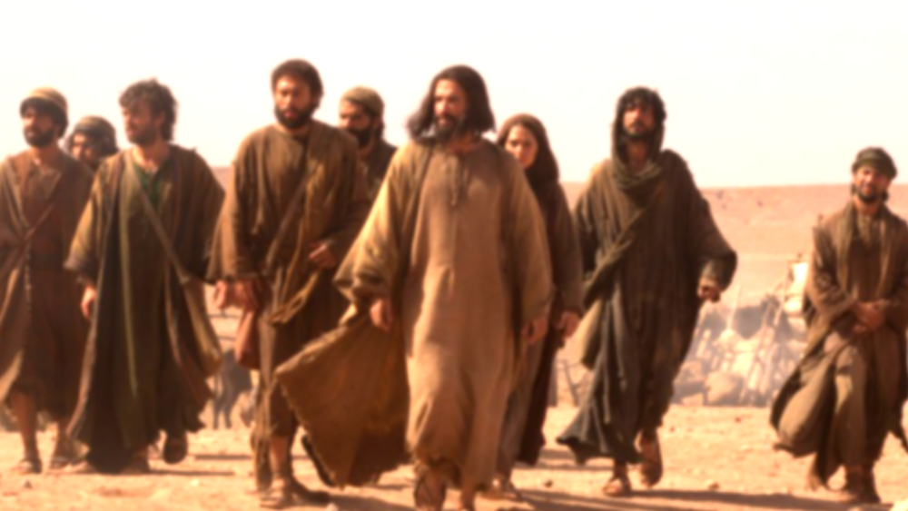
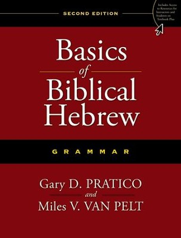
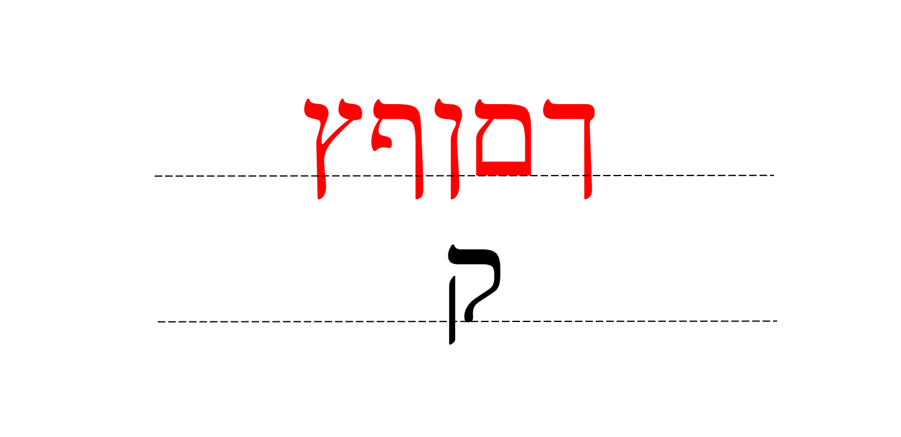
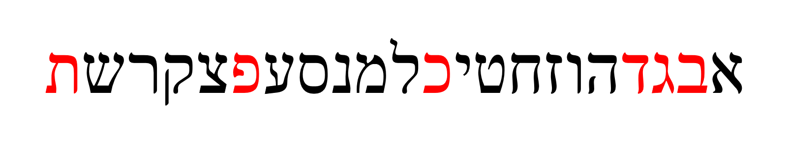
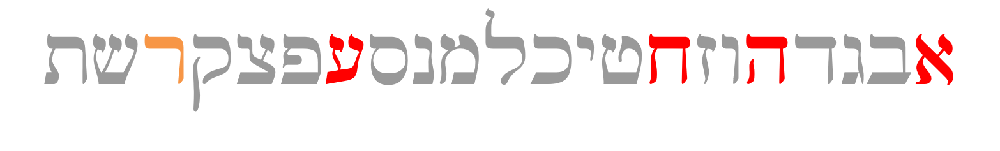
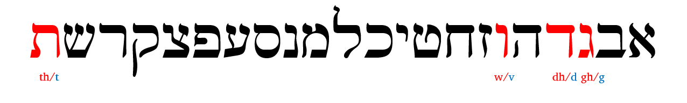

--- 
title: "Hebrew GRAMMAR Quest"
author: "Chris Flanagan"
date: "`r Sys.Date()`"
site: bookdown::bookdown_site
documentclass: turabian-researchpaper
bibliography: [book.bib, packages.bib]
biblio-style: apalike
link-citations: yes
description: "A Hebrew Grammar resource for students of Holy Language Institute."


colorlinks: yes
graphics: yes
lot: no
lof: no
mainfont: Ezra SIL

---
```{r setup, include=FALSE}
library(knitr)
knitr::opts_chunk$set(echo = FALSE)

```
# Hebrew GRAMMAR Quest {-}

> Biblical Hebrew Grammar the Holy Language way

```{r, out.width = "500px", fig.align='center'}

```


<!--chapter:end:index.Rmd-->

# About Holy Language Institute {-}

```{r, out.width = "500px", fig.align='center'}
include_graphics("images/following_yeshua.jpg")
```

## ***Jesus is Jewish.*** {-}

What if you could get closer to him through Hebrew?

Read on to see what "following Yeshua in a Hebrew way, together" means to us.

## Following Yeshua {-}

When the first disciples heard "follow me", they understood they were being invited into a relationship with this Rabbi from Nazareth. Through this journey of discipleship they would become like him and go on to change the world with him. They knew that following Yeshua was all about knowing Yeshua. That's what our learning experiences are all about.

## In a Hebrew Way {-}

The disciples of Jesus joined him in reading the Hebrew Bible and praying the Hebrew prayers. That's why this isn't just a language - it's a way of following in the footsteps of the Master, a way of encountering the King of the Jews through the language of his people. 

## Together {-}

The men and women who followed Yeshua became a safe and loving community. Same with us! As an organization we're Holy Language "Institute". As a community of disciples we're the Holy Language "Tribe". Together we're a movement, making disciples and changing the world.

***LEARN MORE:***

[Email sign-up](https://holylanguage.com/index.html)

[Become a member](https://holylanguage.com/subscribe.html) to access the full Hebrew GRAMMAR Quest course, as well as our complete library of teaching materials.

<!--chapter:end:00-About_HLI.Rmd-->

# Acknowledgments {-}

All honor and glory to Yeshua, our Lord.  שֵׁם יְהוָה אֶקְרָא

Unless, otherwise noted, English Scripture quotations taken from the NASB. Copyright by The Lockman Foundation. Used by permission.

Biblical Hebrew text is courtesy of tanach.us (version 26.0).

Our thanks to Dr. Gary Pratico and Dr. Myles Van Pelt for <u>Basics of Biblical Hebrew</u>, the seminary textbook that inspired the format of **Hebrew Grammar Quest**.  We encourage any of our students interested in going deeper with Hebrew grammar to purchase the textbook or any related materials.

Additionally our most grateful thanks to Dr. John Beckman for making his extensive library of materials to accompany <u>Basics of Biblical Hebrew</u> freely available for reuse under CC-BY-SA.

As applicable:

* Vocabulary portions of this book are derivatives of [00_vocabulary.pdf](https://hebrewsyntax.org/bbh2new/00_vocabulary.pdf) by John Beckman, used under [CC-BY-SA](https://creativecommons.org/licenses/by-nc-sa/4.0/).
* Grammar portions of this book are derivatives of [00_study_guide.pdf](https://hebrewsyntax.org/bbh2new/00_study_guide.pdf) as well as the "overhead" files for each individual chapter (for example [Chapter 1-The Hebrew Alephabet](https://hebrewsyntax.org/bbh2new/01_overheads_bw.pdf), and so on for each successive chapter) by John Beckman, used under [CC-BY-SA](https://creativecommons.org/licenses/by-nc-sa/4.0/).
* Study verses portions of this Anki deck are derivatives of [00_workbook_answers.pdf](https://hebrewsyntax.org/bbh2new/00_workbook_answers.pdf) by John Beckman, used under [CC-BY-SA](https://creativecommons.org/licenses/by-nc-sa/4.0/).

Finally, we thank YOU for your interest in this course! 

<!--chapter:end:00-Acknowledgments.Rmd-->

# License {-}


© 2021 Holy Language Institute. All rights reserved.


This work is licensed under the Creative Commons Attribution-NonCommercial-ShareAlike 4.0 International License. 

This license is for personal use only.  This publication may not be downloaded, redistributed, re-uploaded, published, or used for any other purposes without explicit permission from the copyright holder.

If you received this book and you are not a member of Holy Language Institute, [become a member](https://holylanguage.com/subscribe.html) today!  This will give you access to the full Hebrew GRAMMAR Quest course, as well as our complete library of teaching materials.


<!--chapter:end:00-License.Rmd-->

# Preface: The philosophy of this book and course  {-}

```{r, out.width = "500px", fig.align='center'}
include_graphics("images/torah_scroll.jpg")
```

## What is the format/structure of Hebrew GRAMMAR Quest? {-}

>Learning Hebrew Grammar, the Holy Language way, is a lot like taking a tour to Israel

To get the most of of a tour, there are stages of preparation^[Stiles, Wayne, “How to prepare for a Holy Land Tour” (https://waynestiles.com/how-to-prepare-for-a-holy-land-tour/)]:

1. Practical Preparation
2. Physical Preparation
3. Spiritual Preparation

Read the next few sections to see how we apply these principles to learning Hebrew grammar.

## _Practical_ Preparation {-}

Before a big trip, you need to know the basics.  Geography, what type of current and outlets are used in Israel, and you have to be ready for the cultural differences.  You might call this "getting the lay of the land".  


>In each lesson of Hebrew Grammar Quest, we will give you the lay of the Hebrew Grammar land

| Israel      | Grammar |
| :-----------: | :-----------: |
|Overview of Geography | Overview of Grammar |
| Different Electrical Outlets      |   Don't use a seghol-shaped plug in a tsere-shaped outlet!   |
| Modest Dress   |  If the rules say you need to be covered with a Qamets, don't show up wearing nothing but a pathach!^[These are vowels we will study in Lesson 2]  |


Each lesson in this book/course will provide a high-level summary of the concepts taught in "Basics of Biblical Hebrew", by Gary Pratico, PhD, and Miles Van Pelt, PhD.^[More specifically, we have made extensive use of the many resources that have been developed to accompany this textbook; most notably, the vast amount of materials published by John Beckman, PhD, copyright under the Creative Commons "Share Alike" license.]

```{r, out.width = "500px", fig.align='center'}

```

## _Physical_ Preparation: Anki Aerobics and Quest Quizzes {-}

Israel is a rocky, hilly place.  For maximum benefit, travelers must be ready for a lot of walking.  Additionally, for most of us, Israel is close to halfway around the globe away from home.  After such a long flight, we are unlikely to completely avoid jet lag, but we can take steps to minimize the effects and work through it as quickly as possible.

> In Hebrew GRAMMAR Quest, we will get into Hebrew Health by using Anki Most of your class time will be spent in Anki –this is where the majority of your learning will take place


> Learning an ancient language also comes with a concept similar to jet lag called "The Fog" - Hebrew GRAMMAR quest is designed to help you work through the fog.

| Israel      | Grammar |
| ----------- | ----------- |
| Get in shape      |  Anki software - Gym equipment for your brain!   |
| Prepare for Jet Lag   | ^[By Ilias81 - Own work, Public Domain, https://commons.wikimedia.org/w/index.php?curid=1651258] "The Fog"   |


### Get in Hebrew shape! {-}

* **Anki** is your gym and cardio equipment for Hebrew Health^[See Appendix A for a deeper discussion on Anki]

* Just like working out is not easy and you don’t always see quick results, don’t expect Anki to be easy or expect to breeze through it

> Most of your class time will be spent in Anki –this is where the majority of your learning will take place

*(I know we already said that, but it bears repeating!)*

* Some lessons will have additional worksheets to reinforce concepts


### Prepare for “The Fog” {-}


Jet lag is similar to a phenomenon Dr. Bill Mounce calls "the fog.'

* Many times things won’t make sense until a lesson or two later

* A strategy suggested by Dr. Mounce is to "look back at your previous victories to assure you of your progres"s^[https://medium.com/@ellingburg/surviving-the-fog-dcb3f148ffa1]

* Anki has structured reviews to help you keep working through your grammar jet lag

* Periodically, there will be **Quest Quizzes** in the online course
    * Periodic checkpoints for you to assess your progress
        * Are you OK to continue?
        * Do you need to review some more before going on?
    * The quizzes are scored for your assessment, but no grades are "recorded" -  
    * In fact, no grades are given for the course.


## _Spiritual_ Preparation {-}

A trip to Israel is not like any other "vacation" - it's a spiritual journey. If all you do see some cool sites and take some pictures, you would have missed out on a tremendous opportunity to meet Yeshua in His special Land.

>Hebrew GRAMMAR Quest is a spiritual journey!

*Pray and be open to what Yeshua may be teaching you*

We will be reading a lot of Scripture!

* Ruth Pursuits - learning grammar concepts while learning Ruth 1
* Verse Translation in Anki

View each activity as an act of worship!

## Typical Lesson {-}

1. **Practical Preparation: Overview of Lesson key points** (in this book)

2. **Physical: Anki Aerobics** (using Anki software)

3. **Spiritual: Ruth Pursuit** (in this book or in the online course)

4. **Quest Quiz** and **worksheets** (in the online course) 

As of 11/1/2020, the online course is accessible through Google Classroom - you will need a free Google account.^[The access code for the course is available to financial supporters at holylanguage.com ]


## Let’s get Started! {-}


<!--chapter:end:00-Preface.Rmd-->

# Aleph-bet {#alephbet}

> Knowledge of the Hebrew alphabet opens the door of understanding . . . Pastor Robert Valci

<br>
<br>

```{r, out.width = "500px", fig.align='center'}

include_graphics("images/alephbet_multi.png")
```


## The Consonants

```{r, out.width = "500px", fig.align='center'}

```


* Immediately you will notice that Hebrew GRAMMAR Quest is going to be different from other learn Hebrew books
* Almost every other grammar book would start with a lengthy description of each letter, how to write it and how to pronounce it
* But with Hebrew GRAMMAR Quest:

> *We* are not going to teach you the Aleph-Bet - *YOU* are going to teach you the Aleph-Bet!

* You will accomplish this in Anki
    * **You will not want to move on to lesson 2 until you have the Aleph-bet memorized**
    * This would be a great time to review those introductory lessons in Hebrew Quest
    * Practical teaching on how to write the letter
    * Spiritual insights - what the letter teaches us

## Twenty-two Consonants(?)

```{r, out.width = "500px", fig.align='center'}
include_graphics("images/shinsin.png")
```

* Twenty-two vs twenty-three letters depends on how you count ש:
    * One letter with two forms = 22
    * Two separate letters = 23

* Most sources would align with 22 letters
* When you look words up in a Hebrew lexicon^[A "lexicon" is another word for a dictionary], words beginning with שׁ are segregated from words that begin with שֹ.

### How do you tell the difference between שׁ and ֹש?  {-}

* Look at the location of the dot  
    * RIGHT side = SHIN **שׁ**
    * LEFT side = SIN   **שֹ**
* One way you can remember this is “SIN IS NEVER RIGHT!"


## Written and read from Right to Left

```{r, out.width = "500px", fig.align='center'}
include_graphics("images/right_to_left.png")
```

Note the front of a Hebrew book:

```{r, out.width = "300px", fig.align='center'}
include_graphics("images/hebrewbook.png")
```

* To our western eyes, this looks "backwards" (but Israelis would say _we_ are reading backwards!)
* When reading Hebrew, always start at the "back" and go from RIGHT to LEFT

## Three important groups of letters

Of the 22 Hebrew consonants, there are three sub-groups of letters you need to memorize for this lesson:

1. "KiMNePaTZ" letters that have a final/sofit form
2. "BeGaD KePHaT" letters 
3. Guttural letters

Let's look at the sofit letters first.

## Five Final (“Sofit”) Forms 

```{r, out.width = "500px", fig.align='center'}
include_graphics("images/kimnepatz.png")
```

* Hebrew does not have capital letters the way English does, but it does have a generally similiar concept
* Certain letters take what are called “Final” or “Sofit” forms when they appear at the END of a word
    * Those letters are in red text above
    * _Sofit_ is just the Hebrew word for final
* The names of these letters is quite simple
    * Take the letter Kaf כּ, which is the first letter in the Aleph-bet with a sofit form
    * The final form is simply named Kaf Sofit ך (or "final kaf").  Same for Mem מ and Mem sofit ם and so on

* The five letters that have these forms are the letters, kaf, mem, nun, pei and Tsaddi:  ך ם ן ף ץ   
* You can remember the acronym, KiMNePaTZ, which is the made-up word you get when you string the five letters in a row

## KiMNePaTZ sofit forms can look like other letters.

```{r, out.width = "500px", fig.align='center'}

```

* Some of the KimNepatz letters look like other letters
* Note that four of the five letters extend below the writing line
* Of the regular (non-sofit) consonants, only the Quf extends below
    * The Quf is one of those fortunate letters that has no look alike
* If you see a letter that goes below the line and it’s not a Quf, it can only be a Sofit form

## Kaf Sofit and Look-alikes


```{r, out.width = "500px", fig.align='center'}

```

* The three letters above actually spell a Hebrew word. We haven’t learned the vowels yet so they are omitted but the word pronounced "derech" means road or way.  
* דרך is a good word so you can see the differences between the Dalet, the first letter, the Resh, the middle letter, and the Kaf Sofit, the last letter (did you catch that we're reading right to left?)
* The Dalet and the Kaf Sofit have a lot in common
    * Depending on the font or the handwriting, they can look almost exactly the same
    * The difference is that Kaf Sofit extends below the line, and Dalet does not
* Resh and Kaf Sofit are easier to tell apart
    * Resh has a rounded corner
    * Resh doesn’t extend below the line

## Nun Sofit and Look-alikes

```{r, out.width = "500px", fig.align='center'}

```

* This is a word pronounced "zaqen", and means old man or elder
* Here you can see some similarities between the Zayin, the first letter and the Nun Sofit
    * Again, note the Nun Sofit extends below the line


```{r, out.width = "500px", fig.align='center'}
include_graphics("images/Kimnepatz-ion.png")
```

* Here are three letters that can often be confused with each-other
* This is actually a borrowed word, ion (yes, referring tot he sub-atomic particle)^[In lesson 2, we will learn about vowel letters and how the vav can be an "o" or "u" vowel}. 
* Take note of the differences among the yod, which doesn’t even reach the bottom line, the vav, which does not go below, and the nun sofit which extends beyond the bottom line


## Six “BeGaD KePHaT” Consonants take a "Daghesh Lene"


```{r, out.width = "500px", fig.align='center'}

```


* The next sub-group of letters you need to study are the "BeGaD Kephat" letters.  
    * Izzy talked about this in Lesson 3 of Hebrew Quest
* ONLY applies to Bet - Gimmel - Dalet - Kaf - Pei - and Tav.
* At one time all six of these letters had different pronunciation - a hard form and a soft form.  A dot called a **DAGHESH LENE** is inserted into the middle of the consonant which makes the letter hard.   


```{r, out.width = "300px", fig.align='center'}
include_graphics("images/bdgkpt_with_lene.png")
```

In Sephardic pronunciation, only three of these letters actually change pronunciation:
|Letter | Pronunciation|
|:--:|:---:|
| בּ |b/**b**oy|
| ב |v/**v**et|
| כּ |k/ba**ck**|
| כ |ch/ba**ch**|
| פּ |p/**p**ick|
| פ |ph/**ph**one|

Since the letters without the Daghesh Lene want to be "lazy" - for example a weak 'v' instead of a strong 'b'- our mnemonic for these is "BuCK uP! You Lazy Letters!"

```{r, out.width = "300px", fig.align='center'}
include_graphics("images/buckup.png")
```

* When will I see a בגד כפת letter with and without the Daghesh Forte?
    * There is a rule:  <u>A Daghesh Lene is not used whenever the BDGKPT letter follows a Vowel</u>

You don’t need to memorise this right now and if this doesn’t make any sense, that’s ok.  We’ll dig deeper into the Daghesh Lene, and his twin, the Daghesh Forte over the next few lessons.


## Four Guttural Consonants and ר

```{r, out.width = "500px", fig.align='center'}

```

The third of our three sub-groups are called the gutturals.

In fact, knowing the gutturals and how they behave will turn out to be one of the most important facets of Hebrew.  

Gutturals are everywhere.  We like to say that the gutturals will be our ‘problem children’ because they tend not to play nice with the other Hebrew rules.  

There are four proper gutturals.  Aleph, Hei, CHET and AYIN.  These are in the darker red above.

The letter resh ר is not formally a guttural, but since it can’t decide whether to behave or not. it is often grouped in as a guttural.  Resh is the letter in orange above.

Sometimes Resh is a good letter and gets along with the other Hebrew rules and other times it’s a naughty letter that causes trouble.

The good news is this bad boy behavior of the gutturals and Resh is entirely predictable.  We will learn this over the next few lessons  For now just memorize the four guttural consonants in red, and Resh, the sometimes-guttural-like letter in orange.


## Look-alike Letters

```{r, out.width = "300px", fig.align='center'}
include_graphics("images/lookalikes.png")
```

We met some of these letters earlier when we learned the Sofit forms, but Hebrew has many letters that can look similar, especially to someone just learning the Aleph-bet

You don’t need to memorize the list above.  The Anki deck will give you practice on distinguishing these.

Also, when Izzy reviewed the Aleph-Bet in lessons 2-11, he also talked about each letter’s twin and how to spot the difference.  If it’s been a while, or if this is new to you, you might want to revisit those letter lessons.


## Sephardic vs "Seminary" Pronunciation

```{r, out.width = "500px", fig.align='center'}

```


We've already talked about how only three of the Daghesh Lene letters need to "buckup".  There is one other major difference between Sephardic and Seminary pronunciation, which is how to pronounce ו.  

In academia, the consonant receives the "w" sound and is called "Waw."  In most non-academic circles, it receives the "v" sound and is pronounced "vav".

* For the most part, Hebrew GRAMMAR Quest will follow the Sephardic pronunciation


## Lesson 1 Activities


* Anki 
    * Vocabularly - Alephbet memorization with Izzy
    * Grammar - letter identification and pronunciation, look-alike letters
    * Translation - there is no translation yet but we will learn some grammar shorthand we will use when we get to the study verses
* Letter writing worksheet to practice writing the letters
* Ruth Pursuit - Find all of the consonants and the five Sofit forms in Ruth 1

<!--chapter:end:01-Alephbet.Rmd-->

# Vowels {.vowels}


<!--chapter:end:02-Vowels.Rmd-->

# Syllabification and Pronunciation {.Syllabification}


<!--chapter:end:03-Syllabification.Rmd-->

# Hebrew Nouns {.Nouns}


<!--chapter:end:04-NounsPlural.Rmd-->

# Definite Article and Conjunction Vav {.Article}


<!--chapter:end:05-DefArt_Conjunction.Rmd-->

# Hebrew Prepositions 


<!--chapter:end:06-Prepositions.Rmd-->

# Hebrew Adjectives


<!--chapter:end:07-Adjectives.Rmd-->

# Hebrew Pronouns


<!--chapter:end:08-Pronouns.Rmd-->

# Hebrew Pronominal Suffixes

<!--chapter:end:09-Pronominal_Suffixes.Rmd-->

# Hebrew Construct Chain {.ConstructChain}


<!--chapter:end:10-ConstructChain.Rmd-->

# Numerals/counting


<!--chapter:end:11-Numerals.Rmd-->

# Introduction to Hebrew Verbs{.Verbs}

<!--chapter:end:12-Verbs_Intro.Rmd-->

# Qal Perfect - Strong Verbs {.QP-s}

<!--chapter:end:13-Qal_Perfect_Strong.Rmd-->

# Qal Perfect - Weak Verbs {.QP-w}


<!--chapter:end:14-Qal_Perfect_Weak.Rmd-->

# Qal Imperfect - Strong Verbs {.QI-s}


<!--chapter:end:15-Qal_Imperfect_strong.Rmd-->

# Qal Imperfect Weak {.QI-w}


<!--chapter:end:16-Qal_Imperfect_Weak.Rmd-->

# Vav Consecutive {.wc}


<!--chapter:end:17-Vav_Consecutive.Rmd-->

# Qal Imperative {.QM}


<!--chapter:end:18-Qal_Imperative_strong.Rmd-->

# Pronominal Suffixes on Verbs {.VerbSuffix}


<!--chapter:end:19-Pronominal_Suffix_Verbs.Rmd-->

# Qal Infinitive Construct {.Q∞}


<!--chapter:end:20-Qal_Infinitive_Construct.Rmd-->

# Qal Infinitive Absolute {.QA}

<!--chapter:end:21-Qal_Infinitive_Absolute.Rmd-->

# Qal Participle {.QPt}


<!--chapter:end:22-Qal_Participle.Rmd-->

# Hebrew Syntax {.Syntax}


<!--chapter:end:23-Hebrew_Syntax.Rmd-->

# The Niphal Stem - Strong Verbs {.N-s}

<!--chapter:end:24-Niphal_Strong.Rmd-->

# The Niphal Stem - Weak Verbs {.N-w}


<!--chapter:end:25-Niphal_Weak.Rmd-->

# The Piel Stem - Strong Verbs {.D-s}


<!--chapter:end:26-Piel_Strong.Rmd-->

# The Piel Stem - Weak Verbs {.D-w}


<!--chapter:end:27-Piel_Weak.Rmd-->

# The Pual Stem - Strong Verbs {.Dp-s}

<!--chapter:end:28-Pual_Strong.Rmd-->

# The Pual Stem - Weak Verbs {.Dp-w}


<!--chapter:end:29-Pual_Weak.Rmd-->

# The Hiphil Stem - Strong Verbs {.H-s}

<!--chapter:end:30-Hiphil-Strong.Rmd-->

# The Hiphil Stem - Weak Verbs {.H-w}


<!--chapter:end:31-Hiphil-Weak.Rmd-->

# The Hophal Stem - Strong Verbs {.Hp-s}


<!--chapter:end:32-Hophal_Strong.Rmd-->

# The Hophal Stem - Weak Verbs {.Hp-w}


<!--chapter:end:33-Hophal_weak.Rmd-->

# The Hithpael Stem - Strong Verbs {.HT-s}

<!--chapter:end:34-Hitpael_Strong.Rmd-->

# The Hithpael Stem - Weak Verbs {.Ht-w}

<!--chapter:end:35-Hitpael_Weak.Rmd-->

# Final Words {.Conclusion}

<!--chapter:end:36-Conclusion_Next_Steps.Rmd-->

# (APPENDIX) Appendix {-} 

# About Anki {-}


> Anki is like gym equipment for your brain

|:-----:|:-----:|
| | 
| Heavy lifting | Cardio |

If one wants to build strength she might use the weight machine.  If one wants to build endurance and overall health, she might use the treadmill.  Most people will want to use a combination of both. What does this have to do with Anki (whatever that is)? I’m glad you asked!

What if I told you you could have the equivalent pieces of equipment, only for your brain instead of your physical health and the machine didn’t cost you a penny? It’s true! That machine is called Anki. 

Anki is a tremendous tool for learning and it is where we will be spending the bulk of your time in the course.  In fact it has become the “go to” for many medical school students for learning all the intricate facts they have to know.


## The Forgetting Curve


<!--chapter:end:70-Appendices.Rmd-->

# Appendix B: Questions and Answers about Hebrew GRAMMAR Quest {-}


## What is the difference between Hebrew Quest and Hebrew GRAMMAR Quest? {-}

* Both courses are born of the same Holy Language Learning philosophy: the optimal way to interact with the Sacred Scriptures is by *doing*

* Hebrew Quest was intentionally designed to get students into Hebrew texts with as little "grammar" as possible.

* Hebrew GRAMMAR Quest is designed to fill a gap for those students who want to know more about the inner workings of Hebrew, but wish to do so in a fun, low pressure format (as opposed to taking a formal Hebrew course or trying to read a textbook on their own).

* Also, we know that everyone learns a little differently
    * Many are able view the 40 lessons of Hebrew Quest, and they "get it" with respect to Hebrew
    * Others may have found themselves getting stuck on the "grammar" sections of Hebrew Quest and need some more in-depth grammar preparation before returning to the study passages
    * Still others made it through some or all of Hebrew Quest and just have a desire to know more

* Wherever you find yourself, if you have an interest in digging deeper, you have come to the right place!

## Do I need to have completed Hebrew Quest before I start Hebrew GRAMMAR Quest? {-}

* Emphatically - **No!** 
    * This grammar course starts from the beginning (with learning the Aleph-bet) and assumes no prior knowledge of Hebrew.
* With that said, the more of Hebrew Quest you have completed the easier you may find it is to work through the grammar material.

* If we were to categorize as "good", "better", "best" in terms of Hebrew Quest completion, here's what we would say:
    * **Good**: 
        * You have completed some or no Hebrew Quest lessons.  
        * This means that the first three lessons of Hebrew GRAMMAR Quest might take you a little longer, but, once you have that foundation, you'll be up to speed.
    * **Better**: 
        * You have completed through Hebrew Quest Lesson 12 (the Aleph-bet and Vowels).  
        * This means the first three lessons will go a little more quickly for you.
    * **Best**: 
        * You have completed through Lesson 15 (verbs) and beyond
        * This means that more of the concepts presented in Hebrew GRAMMAR Quest will tend be things you have heard before, versus brand new.

## When I complete this course, should I go back and finish Hebrew Quest? {-}

* **ABSOLUTELY!**
* In fact, the most logical next step after completing a first year Hebrew grammar course is to dig into the Scriptures and start reading.  
* Hebrew Quest, starting with Lesson 16 is all about reading Hebrew^[Although, with your deeper knowledge you may be able to go a little faster.If the Hebrew Quest videos are too slow for you, click the "Settings" gear icon in the bottom right corner of the video, then click "Speed", and then select a faster speed]
* In other words, Hebrew Quest and Hebrew GRAMMAR Quest compliment each other in a circular (and maybe slightly paradoxical) way:
    * The more Hebrew Quest you have completed, the more you will get out of Hebrew GRAMMAR Quest, and
    * The more Hebrew GRAMMAR Quest you have completed, the more you will get out of Hebrew Quest
    * Either way, you can't go wrong!

## There are many books out there to learn Hebrew.  What makes Hebrew GRAMMAR Quest different? {-}

* As we say above, we want students to learn by **doing**
    * While **Hebrew GRAMMAR Quest** will cover the same concepts as a typical first-year Hebrew textbook, the instructional design team at Holy Language Institute are huge proponents of _active_ learning as opposed to passive learning.
    * Reading a book is largely a passive activity. Therefore, our goal for this book and the accompanying lectures, is to simply provide a quick orientation to the concepts.^[In fact, if you're looking for a stand-alone textbook, there is none better than <u>Basics of Biblical Hebrew</u>.]

* Textbooks have their place, but in our view, your "real" learning will take place when you complete the ACTIVities (see root of the word "active" in there?).  This is the impetus behind the current "flipped classroom" philosophy in traditional education.

## What is a "flipped classroom"? {-}

* Hebrew GRAMMAR Quest applies concepts from what is called a "flipped classroom"
* In a traditional classroom, lecture and exams are the priority
    * What educators have started to notice was that these two aspects of teaching, though valuable for different reasons, are not when the student's primary learning occurs
* In a flipped classroom, the activities usually thought of as "homework" are the priority
    * Interactive reading (with note-taking and active-recall), worksheets, and discussion are much better vehicles for learning than a lecture
* Therefore in Hebrew GRAMMAR quest there is an intentional de-emphasis on lectures and exams and an intentional emphasis on activities


## What are the activities? {-}

* First and foremost, there is the Anki deck; and it's, well..., massive
    * See the appendix for a discussion on Anki if you are not familiar with it
* Anki is based on active recall and it has been described as one of the best ways to "upload information to your brain"
* Each lesson will also have a **Ruth Pursuit** 
    * You may remember in Hebrew Quest, when Izzy was teaching the aleph-bet, and part of your quest was to "bag" each letter by reading a passage of scripture
    * We are continuing that, with using Ruth chapter 1 as our anchor text.
* Certain lessons may also have other activities, such as worksheets for you to complete

## How do I access the Anki deck or online course? {-}

* The full program including the Anki package and access to the online course, are available to subscribers of Holy Language Institute 
* Login to [holylanguage.com](holylanguage.com)
* Click on the LEARN button then select "Hebrew GRAMMAR Quest" ***(pending development)***

## Will I need to buy anything? {-} 

* **NO**.  Other than being a subscriber to Holy Language Institute, you will not need to purchase anything for this course (unless you want to)
* We would like to disclose that the iOS version of the Anki app requires a one-time purchase through the Apple store of $25
    * Note: Holy Language Institute has nothing to do with this policy and receives nothing should you decide to purchase the app
    * The developers of Anki provide every other platform for free, and say they use the proceeds from the iOS app to fund these other platforms and program enhancements
    * While the price is steep for an app, most online reviews say the cost is justified (a few pennies a day over the course of a year)
    * If you have an Apple device and do not wish to purchase the app, you may use a web-based version of mobile Anki at no charge (you just can't use it offline)

* There are lots of additional resources available that accompany Basics of Biblical Hebrew for free and to purchase - we will incorporate many of the free resources into the online course
* In other words, we have designed this course so that you should not have a need to purchase anything additional by way of learning materials
* With that said, if you wish to purchase _Basics of Biblical Hebrew_ or any of the accompanying resources for deeper study, some options are below^[We would like to make our students aware that the authors of these materials take an academic, as opposed to a reverential approach regarding God's Holy Name and you will see the transliteration of the Tetragrammaton printed on yearly every page.  While we believe this is unfortunate and unnecessary, Basics of Biblical Hebrew remains an excellent resource for first-year Hebrew grammar] 
    * [Basics of Biblical Hebrew Textbook](https://www.amazon.com/gp/product/031053349X/&tag=holylanginst-20)
    * [Basics of Biblical Hebrew Workbook](https://www.amazon.com/gp/product/0310533554/&tag=holylanginst-20)
    * [Basics of Biblical Hebrew Laminated Reference Card](https://www.amazon.com/gp/product/031026295X/&tag=holylanginst-20)
    * We would appreciate it if you would use one of the affiliate links, which allows Holy Language Institute to receive a small commission
    
## Who will (and who might not) benefit from Hebrew GRAMMAR Quest? {-}

* Hebrew GRAMMAR Quest is focused on reading and understanding Hebrew for the English speaker
    * If you desire to read the Hebrew Scriptures in the original language and have a greater comprehension of what you read, this course is for you!
    * If one was looking to be a fluent writer or speaker of Hebrew, or teach Hebrew in an academic setting, this course probably would not fully meet that person's goals (although it would be a great first step)
    
* This course focuses on Biblical Hebrew, not Modern Hebrew
    * If you are looking to translate "can you direct me to the railway station?", we apologize, but this course will not benefit you!
    
* Hebrew GRAMMAR Quest is designed to be self-directed and (mostly) stress-free; by design, it will not have the accountability and rigor of a traditional academic program
    * You will spend many hours on this course - we believe it will be a tremendous investment you can make for the kingdom and the impact you can have on others; when you start to see your knowledge building up in Anki, we believe you will find it rewarding and perhaps even fun as well
    * Those who seeking more of an academic/seminary type of setting might fare better with a traditional, instructor-led, Hebrew course
    
### What if I am a Bible teacher? Should I take this course? {-}

* We believe this course, in conjunction with Hebrew Quest, would prepare a pastor or teacher of a traditional Christian congregation to have a basic understanding of the Hebrew text to be able to exegete and communicate higher-level Hebrew/Hebraic concepts to a lay audience
    * Additionally, for those who have had first-year Hebrew at seminary (perhaps many years ago) but found it meaningless to their vocation, or for those pastors/teachers who may have never taken a grammar course in Hebrew, our prayer is that this course will give new life to Hebrew application in that person's teaching ministry
    * Conversely, if you are leading a congregation sophisticated with Hebrew and will be frequently reading from Torah, such as at a synagogue, you may benefit from formal Hebrew training instead of, or in addition to Hebrew GRAMMAR Quest.

<!--chapter:end:75-faq.RMD-->

# About the Author {-}

* Chris Flanagan has been a member of HLI since 2013 and joined as a ministry volunteer in 2015.
* He has completed Hebrew Quest as a student, which planted a desire to dig deeper into the original languages. He has completed both Hebrew and Greek courses at the seminary level.  
* He has worked on a number of projects for HLI, including leading of "Hebrew Quest Memrise" and now "Hebrew Grammar Quest"
* He is a lifelong learner, with a passion for instructional design
* Professionally, Chris has worked in the healthcare compliance field for over 30 years
* Personally, Chris is married and has two men in college.  He and his wife, Sarah, love to travel, especially to Israel

<center>
 
</center>

<!--chapter:end:80-abouttheauthor.Rmd-->

`r if (knitr::is_html_output()) '
# References {-}
'`

<!--chapter:end:99-references.Rmd-->

