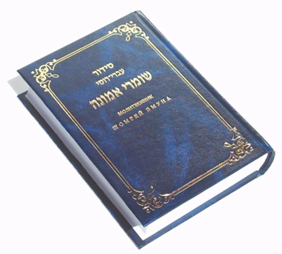
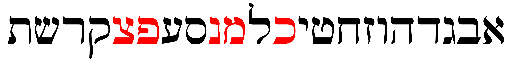
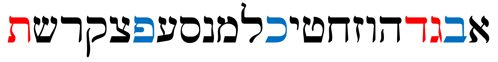
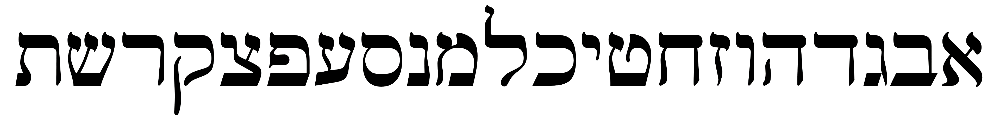
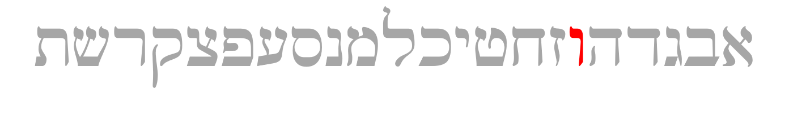

# Cover {.unnumbered}

Placeholder


<!--chapter:end:index.Rmd-->


# Quest Introduction {-}

Placeholder


## Getting Started (IMPORTANT!) {-}
## Customize Anki Settings {- #anki_settings}
### Daily limits and New Cards {-}
### Lapses and Timer {-}
### Burying and Audio {-}
### Advanced {-}
## The Fog {-}
## Other course information {-}

<!--chapter:end:00c-Anki.Rmd-->


# Get Help/Give Feedback {- #get_help}

Placeholder


<!--chapter:end:00d-help.Rmd-->

# (PART) Hebrew Grammar Foundations {-}

<!--chapter:end:01a-Part_I_header.Rmd-->

# The Hebrew Aleph-bet {#alephbet}

::: {.infobox .sound}
<figure>
<audio
        id="myAudio"
        controls controlsList="nodownload"
        src="./images/01.intro.m4a">
            Your browser does not support the
            <code>audio</code> element.
    </audio>
<button onclick="setPlaySpeed25()" type="button">2.5x</button>
<button onclick="setPlaySpeed2()" type="button">2x</button>
<button onclick="setPlaySpeed15()" type="button">1.5x</button>
<button onclick="setPlaySpeed1()" type="button">1x</button>
<button onclick="setPlaySpeed075()" type="button">.75x</button>
<button onclick="setPlaySpeed05()" type="button">.5x</button>
<script>
var x = document.getElementById("myAudio");
function setPlaySpeed05() { 
    x.playbackRate = 0.5;
    x.play();
}
function setPlaySpeed075() { 
    x.playbackRate = 0.75;
    x.play();
} 
function setPlaySpeed1() { 
    x.playbackRate = 1;
     x.play();
}
function setPlaySpeed15() { 
    x.playbackRate = 1.5;
     x.play();
} 
function setPlaySpeed2() { 
    x.playbackRate = 2;
     x.play();
} 
function setPlaySpeed25() { 
    x.playbackRate = 2.5;
     x.play(); 
} 
</script> 
</figure>
:::

> To comprehend Biblical Hebrew, we must have the Aleph-Bet memorized

<br>


```r
library(knitr)
knitr::include_graphics("images/alephbet_multi.png")
```


This graphic shows the evolution of Hebrew. Top to bottom: proto-Canaanite (~1600 BCE), paleo-Hebrew (~900 BCE), Rashi (1500 CE), Ketav Stam (used in Torah scrolls and other formal documents), contemporary block, and modern cursive. This course will use the contemporary block style. 

In this initial lesson, we will meet the Hebrew Aleph-Bet.  The letters are like a family.  Like a family, there can be unique dynamics (including not always playing nice with each other!).  This lesson will take a look at some of those dynamics.


::: {.infobox .map}
**LESSON ITINERARY**

1. Meet the Hebrew Aleph-Bet
1. Understand that Hebrew is written and read from RIGHT to LEFT
1. Identify the group of five letters that have final/Sofit forms
1. Identify the group of six letters that can take a Daghesh Lene
1. Identify the group of four "guttural" letters that cause significant changes in spelling and punctuation (and the one additional letter that sometimes acts as a guttural)
1. Identify the group of ten letters that _sometimes_ behave differently in limited circumstances
1. Differentiate among "look-alike" letters
1. Note differences between "Seminary" and "Sephardic" pronunciation

:::


::: {.infobox .stop}

**EQUIPMENT CHECK**

If you are eager to jump right in with Lesson 1, we understand.  We are also excited for you to start!

"Equipment Check" is where we will pause before each lesson to make sure you have the right tools and supplies in your backpack before heading on the next phase of your Quest.  In future lessons, we will want to make sure you understand specific concepts before continuing.

For Lesson 1, BEFORE CONTINUING, MAKE SURE YOU HAVE COMPLETED ALL OF THE `PRELIMINARY` TASKS ON YOUR `COURSE CHECKLIST` AND ARE READY TO GO WITH `ANKI`!

:::

## First Thought {-}
::: {.infobox .sound}
<figure> <audio id="myAudio" controls controlsList="nodownload" 
src="./images/01.Deu3203.mp3">
Your browser does not support the <code>audio</code> element.</audio><button onclick="x25()" type="button">2.5x</button><button onclick="x2()" type="button">2x</button><button onclick="x15()" type="button">1.5x</button><button onclick="x1()" type="button">1x</button><button onclick="x075()" type="button">.75x</button><button onclick="x05()" type="button">.5x</button><script>
var x = document.getElementById("myAudio");
function x05() { 
    x.playbackRate = 0.5;
    x.play();}
function x075() { 
    x.playbackRate = 0.75;
    x.play();} 
function x1() { 
    x.playbackRate = 1;
     x.play();}
function x15() { 
    x.playbackRate = 1.5;
     x.play();} 
function x2() { 
    x.playbackRate = 2;
     x.play();} 
function x25() { 
    x.playbackRate = 2.5;
     x.play(); } 
</script></figure>
:::

::: {.box .light}
* Listen to the verse in Hebrew
* Practice speaking until you can pronounce just like Izzy 
  * You can slow the audio down if needed
:::

### <span class="he">שֵׁם יְהוָה אֶקְרָא</span> {-}

*For I proclaim the name of Adonai  (Deuteronomy 32:3)*  

As you undertake this study, pray for this Grammar adventure to be fruitful.  May God use your growing knowledge of Hebrew as an instrument to advance His Kingdom, and may you never cease to proclaim His Name! 


```r

```

<div class="figure" style="text-align: center">

<p class="caption">(\#fig:unnamed-chunk-2)Cove of the Sower - suggested location where Yeshua proclaimed the words of Adonai to the crowd in Mark 4:1. Courtesy of the [Pictorial Library of Bible Lands](https://www.bibleplaces.com)</p>
</div>

Note: acoustic tests performed at this location have confirmed that a person in a boat in the middle of the cove can _easily_ be heard without amplification by people sitting on these rocks several hundred feet up the embankment, and Yeshua didn't have to deal with road noise!  A description of the acoustics study can be found in the following article: Crisler, B. "The Acoustics and Crowd Capacity of Natural Theaters in Palestine." Biblical Archaeologist, vol. 39, no. 4 (1976):128–41.


## The Hebrew Aleph-Bet {#consonants}

::: {.infobox .sound}
<figure> <audio id="myAudio" controls controlsList="nodownload" 
src="./images/01.1.m4a"> 
Your browser does not support the <code>audio</code> element.</audio><button onclick="x25()" type="button">2.5x</button><button onclick="x2()" type="button">2x</button><button onclick="x15()" type="button">1.5x</button><button onclick="x1()" type="button">1x</button><button onclick="x075()" type="button">.75x</button><button onclick="x05()" type="button">.5x</button><script>
var x = document.getElementById("myAudio");
function x05() { 
    x.playbackRate = 0.5;
    x.play();}
function x075() { 
    x.playbackRate = 0.75;
    x.play();} 
function x1() { 
    x.playbackRate = 1;
     x.play();}
function x15() { 
    x.playbackRate = 1.5;
     x.play();} 
function x2() { 
    x.playbackRate = 2;
     x.play();} 
function x25() { 
    x.playbackRate = 2.5;
     x.play(); } 
</script></figure>
:::


```r

```


Almost every other grammar book would start with a lengthy description of each letter, how to write it, and how to pronounce it.  We omit this because this is (and much more!) covered in detail in [_Hebrew Quest_ Lessons 2-11](https://holylanguage.com/letters.html){target="_blank"}.  

* Hopefully, you have already watched these foundational _Hebrew Quest_ lessons; if not, click the link above!  
* If you need a refresher on identifying each of the letters, there will be cards on the Aleph-Bet in your `Anki` deck for Lesson 1.

The points below and on the following pages will provide some foundations. This way, your grammar journey gets started in the right direction.

* All letters you see in the picture of the Aleph-Bet above are classified as "consonants."

* Whereas English has the vowel letters (A, E, I, O, U) as a core part of the Aleph-Bet, Hebrew treats vowels differently

* א and ע are not vowels but silent consonants; in Sephardic pronunciation, they take on the pronunciation of their associated vowel (if there is one)

* We'll talk about vowels in Lesson 2

::: {.box .stop}
Have you completed _Hebrew Quest_ Lessons 1-11?

If not, we encourage you to stop here and move over to _Hebrew Quest_ to complete the Alephbet lessons.

Besides learning the letters, you will learn deeper meanings each letter teaches us from a spiritual perspective.
:::

## Aleph-Bet Memory Song

::: {.infobox .sound}
<figure> <audio id="myAudio" controls controlsList="nodownload" 
src="./images/01.2.m4a"> 
Your browser does not support the <code>audio</code> element.</audio><button onclick="x25()" type="button">2.5x</button><button onclick="x2()" type="button">2x</button><button onclick="x15()" type="button">1.5x</button><button onclick="x1()" type="button">1x</button><button onclick="x075()" type="button">.75x</button><button onclick="x05()" type="button">.5x</button><script>
var x = document.getElementById("myAudio");
function x05() { 
    x.playbackRate = 0.5;
    x.play();}
function x075() { 
    x.playbackRate = 0.75;
    x.play();} 
function x1() { 
    x.playbackRate = 1;
     x.play();}
function x15() { 
    x.playbackRate = 1.5;
     x.play();} 
function x2() { 
    x.playbackRate = 2;
     x.play();} 
function x25() { 
    x.playbackRate = 2.5;
     x.play(); } 
</script></figure>
:::

As needed, sing along with this video by Dr. John Walton of Wheaton College to help you memorize the Aleph-bet^[Unfortunately, YouTube won't let us embed this video on this page]:

[Open Aleph-Bet video in new tab](https://www.youtube.com/watch?v=hIEB8bpJZhY&feature=youtu.be){target="_blank"}


```r

```


## Hebrew is written and read from RIGHT-to-LEFT {#right_to_left}

::: {.infobox .sound}
<figure> <audio id="myAudio" controls controlsList="nodownload" 
src="./images/01.3.m4a"> 
Your browser does not support the <code>audio</code> element.</audio><button onclick="x25()" type="button">2.5x</button><button onclick="x2()" type="button">2x</button><button onclick="x15()" type="button">1.5x</button><button onclick="x1()" type="button">1x</button><button onclick="x075()" type="button">.75x</button><button onclick="x05()" type="button">.5x</button><script>
var x = document.getElementById("myAudio");
function x05() { 
    x.playbackRate = 0.5;
    x.play();}
function x075() { 
    x.playbackRate = 0.75;
    x.play();} 
function x1() { 
    x.playbackRate = 1;
     x.play();}
function x15() { 
    x.playbackRate = 1.5;
     x.play();} 
function x2() { 
    x.playbackRate = 2;
     x.play();} 
function x25() { 
    x.playbackRate = 2.5;
     x.play(); } 
</script></figure>
:::

Note the front of a Hebrew book is the back of an English one:


```r
include_graphics("images/right_to_left.png")

```


* To our western eyes, this looks "backward" (but Israelis would say _we_ are reading backward!)

* When reading Hebrew, always start at the "back" and go from RIGHT to LEFT

*****

See **Hebrew Quest** discussion on Right to Left:

<center>
<iframe width="560" height="315" src="https://www.youtube.com/embed/4xKQSvRvmN8?start=108" frameborder="0" allow="accelerometer; autoplay; clipboard-write; encrypted-media; gyroscope; picture-in-picture" allowfullscreen></iframe>
</center>


<!-- 1.4 -->
## Five "KiMNePaTZ" letters have different final forms {#sofit_letters}

::: {.infobox .sound}
<figure> <audio id="myAudio" controls controlsList="nodownload" 
src="./images/01.4.m4a"> 
Your browser does not support the <code>audio</code> element.</audio><button onclick="x25()" type="button">2.5x</button><button onclick="x2()" type="button">2x</button><button onclick="x15()" type="button">1.5x</button><button onclick="x1()" type="button">1x</button><button onclick="x075()" type="button">.75x</button><button onclick="x05()" type="button">.5x</button><script>
var x = document.getElementById("myAudio");
function x05() { 
    x.playbackRate = 0.5;
    x.play();}
function x075() { 
    x.playbackRate = 0.75;
    x.play();} 
function x1() { 
    x.playbackRate = 1;
     x.play();}
function x15() { 
    x.playbackRate = 1.5;
     x.play();} 
function x2() { 
    x.playbackRate = 2;
     x.play();} 
function x25() { 
    x.playbackRate = 2.5;
     x.play(); } 
</script></figure>
:::


```r

```


* Hebrew does not have capital letters the way English does, but a somewhat similar concept is five letters take what are called “Final” or “Sofit”^[_Sofit_ is just the Hebrew word for final] forms when they appear at the END of a word
    * Those letters are in red text above
* The letter Kaf כּ is the first letter in the Aleph-bet with a sofit form
    * The final form is named Kaf Sofit ך
    * Same for Mem מ and Mem sofit ם and so on^["Final Kaf," "Final Mem," etc., are also terms you may hear.]
* The five letters that have these forms are Kaf, Mem, Nun, Pei, and Tsaddi: ך ם ן ף ץ
* You can remember the acronym, KiMNePaTZ, which is the made-up word you get when you string the five letters in a row
* The KiMNePaTZ sofit forms can look like other letters - your `Anki` work for this Lesson will give you practice with identifying look-alike letters


## Activity: Practice Letter Writing  {- #worksheets-1}

::: {.infobox .sound}
<figure> <audio id="myAudio" controls controlsList="nodownload" 
src="./images/01.activity_letters.m4a"> 
Your browser does not support the <code>audio</code> element.</audio><button onclick="x25()" type="button">2.5x</button><button onclick="x2()" type="button">2x</button><button onclick="x15()" type="button">1.5x</button><button onclick="x1()" type="button">1x</button><button onclick="x075()" type="button">.75x</button><button onclick="x05()" type="button">.5x</button><script>
var x = document.getElementById("myAudio");
function x05() { 
    x.playbackRate = 0.5;
    x.play();}
function x075() { 
    x.playbackRate = 0.75;
    x.play();} 
function x1() { 
    x.playbackRate = 1;
     x.play();}
function x15() { 
    x.playbackRate = 1.5;
     x.play();} 
function x2() { 
    x.playbackRate = 2;
     x.play();} 
function x25() { 
    x.playbackRate = 2.5;
     x.play(); } 
</script></figure>
:::
::: {.box .info}
Depending on your existing familiarity with the Aleph-bet, you may wish to review the `Lesson 01 A. Vocab` module in Anki before attempting the worksheet.   In fact, these flashcards are borrowed from _Hebrew Quest_! 
:::

* Memorizing the Alephbet is essential
* Normally, Activities will be at the end of a lesson
* In this case however, we would ask you to stop right here and complete the writing activity - it will help you tremendously as you complete the remaining sections of Lesson 1
* Once you complete both parts of the activity, return here and continue the lesson

::: {.box .info}
* In Hebrew GRAMMAR Quest, we try to keep "brute-force memorization" to a minimum
* This way, if we are asking you to memorize something, you will know it's important!
:::

::: {.box .map }
YOUR QUEST (aka, instructions for the activity):

1. Practice writing the letters individually (letter by letter) using the [Letter Writing worksheet](./images/01_Letter_Writing_Worksheet.pdf){target="_blank"}
    * If you would like some tips on how to write the letters, you can use [this guide](./images/01_Letter_Writing_Guide.pdf){target="_blank"} from Dr. Beckman.
    * As we've said before, we strongly encourage everyone to watch (or re-watch) the [_Hebrew Quest_ lessons on the Aleph-Bet](https://holylanguage.com/letters.html){target="_blank"}
    
2. On the reverse side of the worksheet (or on a separate piece of paper), practice writing the entire AlephBet, including the final/sofit forms, until you can do it at least ONCE entirely from memory. Be sure to cover up your previous attempts and any other reference materials.  

::: 

<!-- 1.5 -->
## Six "BeGaD KePHaT" letters take a mark called a Daghesh Lene {#daghesh_lene}
 
::: {.infobox .sound}
<figure> <audio id="myAudio" controls controlsList="nodownload" 
src="./images/01.5.m4a"> 
Your browser does not support the <code>audio</code> element.</audio><button onclick="x25()" type="button">2.5x</button><button onclick="x2()" type="button">2x</button><button onclick="x15()" type="button">1.5x</button><button onclick="x1()" type="button">1x</button><button onclick="x075()" type="button">.75x</button><button onclick="x05()" type="button">.5x</button><script>
var x = document.getElementById("myAudio");
function x05() { 
    x.playbackRate = 0.5;
    x.play();}
function x075() { 
    x.playbackRate = 0.75;
    x.play();} 
function x1() { 
    x.playbackRate = 1;
     x.play();}
function x15() { 
    x.playbackRate = 1.5;
     x.play();} 
function x2() { 
    x.playbackRate = 2;
     x.play();} 
function x25() { 
    x.playbackRate = 2.5;
     x.play(); } 
</script></figure>
:::


```r

```


* Next, we need to learn the "BeGaD KePhaT" letters^[See also Lesson 3 of _Hebrew Quest_]
* The red and blue dots in the above letters are called **DAGHESH LENE**
* The Daghesh Lene is inserted into the middle of the consonant
* The Daghesh Lene affects the pronunciation of these letters 
    * "hard" if the Daghesh Lene present 
    * "soft" if not present
* At one time, all six of these letters had different pronunciations, but today in Hebrew as spoken in Israel, only three do
* These are the letters in blue above **<span class="he">בּ כּ פּ</span>**:
    * <span class="he">ב</span> has a "soft b" sound, in other words, a "v" sound, while <span class="he">בּ</span> has a "hard b" sound, in other words, a "b" sound
    * <span class="he">כ</span> sounds like the "ch" in "bach", while <span class="he">כּ</span> is "k" as in "kangaroo"
    * <span class="he">פ</span> is the "ph" (or "f") in "phone", while <span class="he">פּ</span> is the "p" in "pulley"
    * Since the letters without the Daghesh Lene want to be "lazy" - for example, a weak 'v' instead of a strong 'b'- our mnemonic for these is "BucK uP! You Lazy Letters!"
    * בּכּפּ = BKP, which with a little imagination can mean "BucK uP!"
      
::: {.box .caution}
* There are many other "dots" in Hebrew with various meanings - not all are Daghesh Lene marks
* The Daghesh Lene ONLY applies to Bet - Gimmel - Dalet - Kaf - Pei - and Tav 
    * If a dot appears in any other letter, it is NOT a Daghesh Lene
* We’ll dig deeper into the Daghesh Lene and its much more notable big brother, the Daghesh Forte, over the next several lessons.  Both play a big factor in studying and understanding Hebrew grammar.
:::

<!-- 1.6 -->

<!-- 1.6 -->
## We classify four consonants as **Gutturals** (and one additional consonant is a sometimes-guttural)^[In modern linguistics, these are called `glottals`] {#gutturals}

::: {.infobox .sound}
<figure> <audio id="myAudio" controls controlsList="nodownload" 
src="./images/01.6.m4a"> 
Your browser does not support the <code>audio</code> element.</audio><button onclick="x25()" type="button">2.5x</button><button onclick="x2()" type="button">2x</button><button onclick="x15()" type="button">1.5x</button><button onclick="x1()" type="button">1x</button><button onclick="x075()" type="button">.75x</button><button onclick="x05()" type="button">.5x</button><script>
var x = document.getElementById("myAudio");
function x05() { 
    x.playbackRate = 0.5;
    x.play();}
function x075() { 
    x.playbackRate = 0.75;
    x.play();} 
function x1() { 
    x.playbackRate = 1;
     x.play();}
function x15() { 
    x.playbackRate = 1.5;
     x.play();} 
function x2() { 
    x.playbackRate = 2;
     x.play();} 
function x25() { 
    x.playbackRate = 2.5;
     x.play(); } 
</script></figure>
:::


```r

```


* There are four proper gutturals: Aleph, Hei, Chet, and Ayin (in red above)
* The letter Resh <span class="he">ר</span> (in orange above) is not formally a Guttural; but since it can’t decide whether to behave or not, sometimes we include Resh with the other Gutturals
* We like to say that the gutturals (and sometimes Resh) will be our trouble-makers because they tend not to play nice with the other Hebrew rules! 
    * The good news is the behavior of the Gutturals and Resh is entirely predictable
    * We will learn this over the next few lessons (and indeed, the rest of the course) 
* For now, memorize the group of four guttural consonants in red and Resh, the sometimes-guttural-like letter in orange.

::: {.infobox .info}
Learning how the gutturals behave and what spelling changes they cause is one of the most critical facets of Hebrew grammar.

It is core objective of this course.
:::

<!-- 1.7 -->


## We classify ten Hebrew letters as "SQiN eM LeVY" consonants

::: {.infobox .sound}
<figure> <audio id="myAudio" controls controlsList="nodownload" 
src="./images/01.7.m4a"> 
Your browser does not support the <code>audio</code> element.</audio><button onclick="x25()" type="button">2.5x</button><button onclick="x2()" type="button">2x</button><button onclick="x15()" type="button">1.5x</button><button onclick="x1()" type="button">1x</button><button onclick="x075()" type="button">.75x</button><button onclick="x05()" type="button">.5x</button><script>
var x = document.getElementById("myAudio");
function x05() { 
    x.playbackRate = 0.5;
    x.play();}
function x075() { 
    x.playbackRate = 0.75;
    x.play();} 
function x1() { 
    x.playbackRate = 1;
     x.play();}
function x15() { 
    x.playbackRate = 1.5;
     x.play();} 
function x2() { 
    x.playbackRate = 2;
     x.play();} 
function x25() { 
    x.playbackRate = 2.5;
     x.play(); } 
</script></figure>
:::


```r

```


* This is another group of letters that can behave differently
* They are called the _SQiN eM LeVY_ letters because of the made-up word that is formed by the letters:
    * S - <span class="he">שׂשׁסצ</span> the Sibilants (letters that make an S sound)^[The ז is also a sibilant, but as it turns out, it is not generally affected by the SQiN eM LeVY exception.]
    * Q - <span class="he">ק</span>
    * N - <span class="he">נ</span>
    * M - <span class="he">מ</span>
    * L - <span class="he">ל</span>
    * V - <span class="he">ו</span>
    * Y - <span class="he">י</span>
* We will save a discussion on exactly how this group (mis)behaves for another lesson
* For now, memorize which letters are the _SQiN eM LeVY_ consonants
    
<!-- 1.8 -->
## Look out for look-alike Letters {#look-alike-letters}

::: {.infobox .sound}
<figure> <audio id="myAudio" controls controlsList="nodownload" 
src="./images/01.8.m4a"> 
Your browser does not support the <code>audio</code> element.</audio><button onclick="x25()" type="button">2.5x</button><button onclick="x2()" type="button">2x</button><button onclick="x15()" type="button">1.5x</button><button onclick="x1()" type="button">1x</button><button onclick="x075()" type="button">.75x</button><button onclick="x05()" type="button">.5x</button><script>
var x = document.getElementById("myAudio");
function x05() { 
    x.playbackRate = 0.5;
    x.play();}
function x075() { 
    x.playbackRate = 0.75;
    x.play();} 
function x1() { 
    x.playbackRate = 1;
     x.play();}
function x15() { 
    x.playbackRate = 1.5;
     x.play();} 
function x2() { 
    x.playbackRate = 2;
     x.play();} 
function x25() { 
    x.playbackRate = 2.5;
     x.play(); } 
</script></figure>
:::

* Hebrew has many letters that can look similar, especially to someone just learning the Aleph-bet
* For example <span class="he">נ</span>, <span class="he">ג</span> and <span class="he">כ</span>; <span class="he">ס</span> and <span class="he">ם</span>; or <span class="he">ר</span>, <span class="he">ד</span>, and <span class="he">ך</span>
* The `Anki` deck will give you practice on distinguishing these.
* Also, in Hebrew Quest, when Izzy reviewed the Aleph-Bet in lessons 2-11, he talked about each letter’s "twin" and how to spot the difference 
* So again, if you haven't watched those lessons or if it has been a while, we encourage you to revisit those [letter lessons](https://holylanguage.com/letters.html). 


```r

```


<!-- 1.9 -->

## Sephardic versus Seminary Pronunciation {#pronunciation}

::: {.infobox .sound}
<figure> <audio id="myAudio" controls controlsList="nodownload" 
src="./images/01.9.m4a"> 
Your browser does not support the <code>audio</code> element.</audio><button onclick="x25()" type="button">2.5x</button><button onclick="x2()" type="button">2x</button><button onclick="x15()" type="button">1.5x</button><button onclick="x1()" type="button">1x</button><button onclick="x075()" type="button">.75x</button><button onclick="x05()" type="button">.5x</button><script>
var x = document.getElementById("myAudio");
function x05() { 
    x.playbackRate = 0.5;
    x.play();}
function x075() { 
    x.playbackRate = 0.75;
    x.play();} 
function x1() { 
    x.playbackRate = 1;
     x.play();}
function x15() { 
    x.playbackRate = 1.5;
     x.play();} 
function x2() { 
    x.playbackRate = 2;
     x.play();} 
function x25() { 
    x.playbackRate = 2.5;
     x.play(); } 
</script></figure>
:::


```r

```


* There are some notable differences between what we might call academic or "seminary^["Seminary Hebrew" is a term borrowed from Dr. John Beckman. We don't say "Seminary Hebrew" to be disrespectful; we only mean to differentiate between the two pronunciation types.]" Hebrew and "real-world" Hebrew spoken in Israel.  Seminary pronunciation is in red above, while Sephardic pronunciation is in blue.
    * Real-world Hebrew is based on Sephardic pronunciation^[There is also what is called Ashkenazi pronunciation, which is beyond the scope of this course.  It also has some different pronunciations.  Most notably, the letter ת is given an "s" sound at the end of a word, and "O" vowels are more prominent.  So שׁבּת (shabbat), would be pronounced "Shabbos" in Ashkenazi]
* We've already talked about how only three of the Daghesh Lene letters need to "BucK-uP"
* With "Seminary Hebrew," all six letters take on a soft pronunciation.
    * The <span class="he">ג</span> without the Daghesh Lene receives something like the GH in "aGHast." The <span class="he">ד</span> and <span class="he">ת</span> without the Daghesh Lene are closer to the English DH/TH like "this" 
* Another difference between Sephardic and Seminary pronunciation is how to pronounce <span class="he">ו</span> 
    * In academia, the consonant receives the "w" sound and is called "waw" (pronounced like the English "wow!")
    * In most non-academic circles, it receives the "v" sound and is pronounced "vav"
    * This is important because a lot of the resources that we will reference come from academia and thus will have the "w" pronunciation.  For example instead of "vav-imperfect", we will frequently see "waw-imperfect"
* There are also significant differences in pronouncing vowels, most notably the short a ("a" like "apple"; versus "ah" like "father")
* For the most part, Hebrew GRAMMAR Quest will follow the Sephardic pronunciation
* Lastly, since we are talking about pronunciation differences, will use "Adonai" or "the LORD" when we encounter the Covenant Name^[Please read Izzy's statement on the Covenant Name: "When I filmed Hebrew Quest I read God's Hebrew name as "Yahweh". This is a relatively common practice in academic circles and was also an expression of my personal love for God's holy name. Since then though I've encountered conclusive evidence that Yeshua and his disciples followed the Jewish tradition of saying "Adonai" instead of using the Sacred Name. It's my deep conviction that we should follow the example of Messiah and his apostles, so I've returned to saying "Adonai" (Hebrew for "the LORD") or "HaShem" (Hebrew for "the Name") instead of using the Sacred Name, and I encourage our students to do likewise." ]
    * Again, in some of the materials that we have leveraged from academic circles, you may see (or hear) the Covenant Name ("Ya---h") written out as this is common in those settings
    * We are taking a devotional approach

## Activity: Anki {-}

::: {.infobox .sound}
<figure> <audio id="myAudio" controls controlsList="nodownload" 
src="./images/01.anki.m4a"> 
Your browser does not support the <code>audio</code> element.</audio><button onclick="x25()" type="button">2.5x</button><button onclick="x2()" type="button">2x</button><button onclick="x15()" type="button">1.5x</button><button onclick="x1()" type="button">1x</button><button onclick="x075()" type="button">.75x</button><button onclick="x05()" type="button">.5x</button><script>
var x = document.getElementById("myAudio");
function x05() { 
    x.playbackRate = 0.5;
    x.play();}
function x075() { 
    x.playbackRate = 0.75;
    x.play();} 
function x1() { 
    x.playbackRate = 1;
     x.play();}
function x15() { 
    x.playbackRate = 1.5;
     x.play();} 
function x2() { 
    x.playbackRate = 2;
     x.play();} 
function x25() { 
    x.playbackRate = 2.5;
     x.play(); } 
</script></figure>
:::

Congratulations on completing your first lesson!

Now we'll move into the Activities.  This is where you take what you learned above and put it into practice using `Anki`^[See the `Anki and Course Setup` section in the `Introduction` for more information on Anki and to download the Hebrew GRAMMAR Quest Anki decks.].  

* `Lesson 01 A. Vocab` - Learn (or relearn) the Aleph-Bet with Izzy
* `Lesson 01 B. Grammar` - Identify look-alike Hebrew letters
* `Lesson 01 C. Study Verses` - we won't be working on any Study Verses just yet, but we will learn some grammar shorthand that we will use when we get to Lesson 3.

Access Anki using your mobile app, desktop version, or [the web-based version (login may be required)](https://ankiweb.net/decks/){target="_blank"}


## Activity: Ruth Pursuit {-}

::: {.infobox .sound}
<figure> <audio id="myAudio" controls controlsList="nodownload" 
src="./images/01.ruth.m4a"> 
Your browser does not support the <code>audio</code> element.</audio><button onclick="x25()" type="button">2.5x</button><button onclick="x2()" type="button">2x</button><button onclick="x15()" type="button">1.5x</button><button onclick="x1()" type="button">1x</button><button onclick="x075()" type="button">.75x</button><button onclick="x05()" type="button">.5x</button><script>
var x = document.getElementById("myAudio");
function x05() { 
    x.playbackRate = 0.5;
    x.play();}
function x075() { 
    x.playbackRate = 0.75;
    x.play();} 
function x1() { 
    x.playbackRate = 1;
     x.play();}
function x15() { 
    x.playbackRate = 1.5;
     x.play();} 
function x2() { 
    x.playbackRate = 2;
     x.play();} 
function x25() { 
    x.playbackRate = 2.5;
     x.play(); } 
</script></figure>
:::

* This is a QUEST activity, similar to "bag the letters" from _Hebrew Quest_.  
* You can do this activity online using Google Docs or download/print and use physical highlighters.
* Click the link to open a [blank copy of Ruth Chapter 1](https://docs.google.com/document/d/1bcT1J-fcVmD1Zn5Jk2nj0560tEddcgtbYZLkwaVVuyE/copy){target="_blank"}
    * You may need to sign in with a Google account
    * You may wish to rename the document with the applicable lesson # as you will be reusing the blank document multiple times
      * In fact, instead of downloading from the above link each time, we recommend you save a blank copy to your personal Google Drive, then select `File` then `Make a Copy` whenever you wish to begin a new `Ruth Pursuit`.
* We strongly encourage you to go line by line through the passage and do not use the "Find" function in your word processor
    * Line by line will take longer, but you will learn more (even though you may think it's a waste of time because at this point you may not know much, if any, Hebrew.  Just go through the passage as best as you can; you may be surprised what sinks in!)

::: {.box .map} 
YOUR QUEST

1. Find ONE example of the following
    1. Identify the four guttural letters in Ruth chapter 1(pink)^[The color is to let you know what color the answer key will use, but feel free to highlight in any color, underline, change the font color, or otherwise identify anyway you like.]
    2. Identify the one half-guttural (red)
    3. Identify the six BeGaD KePHaT letters, both with and without the Daghesh Lene, for a total of 12 letters (green)
    4. Identify the five final/sofit forms (blue)
    5. Identify the 12 remaining consonants not included in the above categories (including both forms of ש) (yellow)
2. Find ALL examples of the names listed below (grey)
    * Ruth - spelled <span class="he">רוּת</span>; also "and Ruth" - <span class="he">וְרוּת</span>
    * Naomi - spelled <span class="he">נָעֳמִי</span> 
    * Bethlehem - spelled <span class="he">בֵּית לֶחֶם  </span>, also "from Bethlehem" - <span class="he">מִבֵּית לֶחֶם</span>
        * Our one word "Bethlehem" is two words in Hebrew: <span class="he">בֵּית</span> means "house of" and  <span class="he">לֶחֶם</span> means "bread"
    * Moab - spelled <span class="he">מוֹאָב</span>, also "Moabites" <span class="he">מֹאֲבִיּוֹת</span>^[As a taste of what is to come, this word מֹאֲבִיּוֹת has 1) defective spelling - notice how the Vav in מוֹאָב is not in מֹאֲבִיּוֹת? (Lesson 2), 2) propretonic reducticn - Compare the markings under the aleph in מֹאֲבִיּוֹת as compared to מוֹאָב. (Lesson 3), and a 3) Feminine plural suffix - Notice the Vav + Tav in מֹאֲבִיּוֹת are not present in מוֹאָב. (Lesson 4)], and "the Moabitess" <span class="he">הַמּוֹאֲבִיָּה</span>
:::


* Check your results against the [Ruth Pursuit #1 Answer Key](./images/01_Ruth_Pursuit_KEY.pdf){target="_blank"}


### Ruth 1 {-}

::: {.infobox .sound}
<figure>Click to hear Ruth 1 read by Abraham Shmuelof:<audio id="myAudio2" controls controlsList="nodownload" src="./images/t2901.m4a">
Your browser does not support the <code>audio</code> element.</audio>
<button onclick="setPlaySpeed25()" type="button">2.5x</button> <button onclick="setPlaySpeed2()" type="button">2x</button> <button onclick="setPlaySpeed15()" type="button">1.5x</button> <button onclick="setPlaySpeed1()" type="button">1x</button> <button onclick="setPlaySpeed075()" type="button">.75x</button> <button onclick="setPlaySpeed05()" type="button">.5x</button> 
<script>
var x = document.getElementById("myAudio2");
function setPlaySpeed05() { x.playbackRate = 0.5; x.play();}
function setPlaySpeed075() {x.playbackRate = 0.75; x.play();} 
function setPlaySpeed1() {x.playbackRate = 1; x.play();}
function setPlaySpeed15() {x.playbackRate = 1.5; x.play();} 
function setPlaySpeed2() {x.playbackRate = 2; x.play();} 
function setPlaySpeed25() {x.playbackRate = 2.5;x.play();} 
</script> </figure>
:::


<span class="he"><p align="right">
‫ 1     וַיְהִי בִּימֵי שְׁפֹט הַשֹּׁפְטִים וַיְהִי רָעָב בָּאָרֶץ וַיֵּלֶךְ אִישׁ מִבֵּית לֶחֶם יְהוּדָה לָגוּר בִּשְׂדֵי מוֹאָב הוּא וְאִשְׁתּוֹ וּשְׁנֵי בָנָיו׃ ‬
‫ 2     וְשֵׁם הָאִישׁ אֱלִימֶלֶךְ וְשֵׁם אִשְׁתּוֹ נָעֳמִי וְשֵׁם שְׁנֵי־בָנָיו מַחְלוֹן וְכִלְיוֹן אֶפְרָתִים מִבֵּית לֶחֶם יְהוּדָה וַיָּבֹאוּ שְׂדֵי־מוֹאָב וַיִּהְיוּ־שָׁם׃ ‬
‫ 3     וַיָּמָת אֱלִימֶלֶךְ אִישׁ נָעֳמִי וַתִּשָּׁאֵר הִיא וּשְׁנֵי בָנֶיהָ׃ ‬
‫ 4     וַיִּשְׂאוּ לָהֶם נָשִׁים מֹאֲבִיּוֹת שֵׁם הָאַחַת עָרְפָּה וְשֵׁם הַשֵּׁנִית רוּת וַיֵּשְׁבוּ שָׁם כְּעֶשֶׂר שָׁנִים׃ ‬
‫ 5     וַיָּמוּתוּ גַם־שְׁנֵיהֶם מַחְלוֹן וְכִלְיוֹן וַתִּשָּׁאֵר הָאִשָּׁה מִשְּׁנֵי יְלָדֶיהָ וּמֵאִישָׁהּ׃ ‬
‫ 6     וַתָּקָם הִיא וְכַלֹּתֶיהָ וַתָּשָׁב מִשְּׂדֵי מוֹאָב כִּי שָׁמְעָה בִּשְׂדֵה מוֹאָב כִּי־פָקַד יְהוָה אֶת־עַמּוֹ לָתֵת לָהֶם לָחֶם׃ ‬
‫ 7     וַתֵּצֵא מִן־הַמָּקוֹם אֲשֶׁר הָיְתָה־שָׁמָּה וּשְׁתֵּי כַלֹּתֶיהָ עִמָּהּ וַתֵּלַכְנָה בַדֶּרֶךְ לָשׁוּב אֶל־אֶרֶץ יְהוּדָה׃ ‬
‫ 8     וַתֹּאמֶר נָעֳמִי לִשְׁתֵּי כַלֹּתֶיהָ לֵכְנָה שֹּׁבְנָה אִשָּׁה לְבֵית אִמָּהּ *יעשה **יַעַשׂ יְהוָה עִמָּכֶם חֶסֶד כַּאֲשֶׁר עֲשִׂיתֶם עִם־הַמֵּתִים וְעִמָּדִי׃ ‬
‫ 9     יִתֵּן יְהוָה לָכֶם וּמְצֶאןָ מְנוּחָה אִשָּׁה בֵּית אִישָׁהּ וַתִּשַּׁק לָהֶן וַתִּשֶּׂאנָה קוֹלָן וַתִּבְכֶּינָה׃ ‬
‫ 10    וַתֹּאמַרְנָה־לָּהּ כִּי־אִתָּךְ נָשׁוּב לְעַמֵּךְ׃ ‬
‫ 11    וַתֹּאמֶר נָעֳמִי שֹׁבְנָה בְנֹתַי לָמָּה תֵלַכְנָה עִמִּי הַעוֹד־לִי בָנִים בְּמֵעַי וְהָיוּ לָכֶם לַאֲנָשִׁים׃ ‬
‫ 12    שֹׁבְנָה בְנֹתַי לֵכְןָ כִּי זָקַנְתִּי מִהְיוֹת לְאִישׁ כִּי אָמַרְתִּי יֶשׁ־לִי תִקְוָה גַּם הָיִיתִי הַלַּיְלָה לְאִישׁ וְגַם יָלַדְתִּי בָנִים׃ ‬
‫ 13    הֲלָהֵן תְּשַׂבֵּרְנָה עַד אֲשֶׁר יִגְדָּלוּ הֲלָהֵן תֵּעָגֵנָה לְבִלְתִּי הֱיוֹת לְאִישׁ אַל בְּנֹתַי כִּי־מַר־לִי מְאֹד מִכֶּם כִּי־יָצְאָה בִי יַד־יְהוָה׃ ‬
‫ 14    וַתִּשֶּׂנָה קוֹלָן וַתִּבְכֶּינָה עוֹד וַתִּשַּׁק עָרְפָּה לַחֲמוֹתָהּ וְרוּת דָּבְקָה בָּהּ׃ ‬
‫ 15    וַתֹּאמֶר הִנֵּה שָׁבָה יְבִמְתֵּךְ אֶל־עַמָּהּ וְאֶל־אֱלֹהֶיהָ שׁוּבִי אַחֲרֵי יְבִמְתֵּךְ׃ ‬
‫ 16    וַתֹּאמֶר רוּת אַל־תִּפְגְּעִי־בִי לְעָזְבֵךְ לָשׁוּב מֵאַחֲרָיִךְ כִּי אֶל־אֲשֶׁר תֵּלְכִי אֵלֵךְ וּבַאֲשֶׁר תָּלִינִי אָלִין עַמֵּךְ עַמִּי וֵאלֹהַיִךְ אֱלֹהָי׃ ‬
‫ 17    בַּאֲשֶׁר תָּמוּתִי אָמוּת וְשָׁם אֶקָּבֵר כֹּה יַעֲשֶׂה יְהוָה לִי וְכֹה יֹסִיף כִּי הַמָּוֶת יַפְרִיד בֵּינִי וּבֵינֵךְ׃ ‬
‫ 18    וַתֵּרֶא כִּי־מִתְאַמֶּצֶת הִיא לָלֶכֶת אִתָּהּ וַתֶּחְדַּל לְדַבֵּר אֵלֶיהָ׃ ‬
‫ 19    וַתֵּלַכְנָה שְׁתֵּיהֶם עַד־בֹּאָנָה בֵּית לָחֶם וַיְהִי כְּבֹאָנָה בֵּית לֶחֶם וַתֵּהֹם כָּל־הָעִיר עֲלֵיהֶן וַתֹּאמַרְנָה הֲזֹאת נָעֳמִי׃ ‬
‫ 20    וַתֹּאמֶר אֲלֵיהֶן אַל־תִּקְרֶאנָה לִי נָעֳמִי קְרֶאןָ לִי מָרָא כִּי־הֵמַר שַׁדַּי לִי מְאֹד׃ ‬
‫ 21    אֲנִי מְלֵאָה הָלַכְתִּי וְרֵיקָם הֱשִׁיבַנִי יְהוָה לָמָּה תִקְרֶאנָה לִי נָעֳמִי וַיהוָה עָנָה בִי וְשַׁדַּי הֵרַע לִי׃ ‬
‫ 22    וַתָּשָׁב נָעֳמִי וְרוּת הַמּוֹאֲבִיָּה כַלָּתָהּ עִמָּהּ הַשָּׁבָה מִשְּׂדֵי מוֹאָב וְהֵמָּה בָּאוּ בֵּית לֶחֶם בִּתְחִלַּת קְצִיר שְׂעֹרִים׃
</span></p>

## Activity: Ruth Pursuit Translation Worksheet {-}

::: {.infobox .sound}
<figure> <audio id="myAudio" controls controlsList="nodownload" 
src="./images/01.ruthtranslate.m4a"> 
Your browser does not support the <code>audio</code> element.</audio><button onclick="x25()" type="button">2.5x</button><button onclick="x2()" type="button">2x</button><button onclick="x15()" type="button">1.5x</button><button onclick="x1()" type="button">1x</button><button onclick="x075()" type="button">.75x</button><button onclick="x05()" type="button">.5x</button><script>
var x = document.getElementById("myAudio");
function x05() { 
    x.playbackRate = 0.5;
    x.play();}
function x075() { 
    x.playbackRate = 0.75;
    x.play();} 
function x1() { 
    x.playbackRate = 1;
     x.play();}
function x15() { 
    x.playbackRate = 1.5;
     x.play();} 
function x2() { 
    x.playbackRate = 2;
     x.play();} 
function x25() { 
    x.playbackRate = 2.5;
     x.play(); } 
</script></figure>
:::

* With almost every lesson of Hebrew GRAMMAR Quest, we will be gradually building a translation of Ruth chapter one
* Instead of going sequentially, we will be working to identify concepts; so we may be skipping around the chapter a bit
    * We started with the simple words in the previous section
    * Towards the end of the course, you will be translating complex verbs
* We want you to keep track of your progress because, in Unit 4, you will know enough Hebrew to compose your own translation of Ruth 1
* After you finish each `Ruth Pursuit`, be sure to update the `Ruth 1 Translation` tab in your course checklist

::: {.box .map}
RUTH PURSUIT TRANSLATION WORKSHEET INSTRUCTIONS

* Download and open your `Hebrew GRAMMAR Quest Checklist` if you haven't already done so
* Find the `Ruth 1 Translation` tab
* As you identify complete words (Ruth, Bethlehem and Moab, not the individual letters), enter the English meaning next to the applicable word - note that the same word may occur multiple times in the passage
    * For example, next to each occurrence of <span class="he">מוֹאָב</span>, type the word `Moab`, for <span class="he">רוּת</span>, enter "Ruth" and so forth
    * You might want to make a note of the Lesson # (in this case "1") if you need to refer back to the lesson
    * There is also a column for any notes you wish to make
    * See examples for verse 1 in the worksheet
* You may use either your worksheet or the answer key to populate the Ruth Translation Worksheet
* Remember to update your translation worksheet after each lesson (we will not have `Ruth Pursuit Translation` section like this going forward; you can consider the translation work part of the `Ruth Pursuit`)
* This should be a fun and valuable exercise as you progress through Hebrew GRAMMAR Quest!
:::

## Activity: Quest Quiz {-}

::: {.infobox .sound}
<figure> <audio id="myAudio" controls controlsList="nodownload" 
src="./images/01.quiz.m4a"> 
Your browser does not support the <code>audio</code> element.</audio><button onclick="x25()" type="button">2.5x</button><button onclick="x2()" type="button">2x</button><button onclick="x15()" type="button">1.5x</button><button onclick="x1()" type="button">1x</button><button onclick="x075()" type="button">.75x</button><button onclick="x05()" type="button">.5x</button><script>
var x = document.getElementById("myAudio");
function x05() { 
    x.playbackRate = 0.5;
    x.play();}
function x075() { 
    x.playbackRate = 0.75;
    x.play();} 
function x1() { 
    x.playbackRate = 1;
     x.play();}
function x15() { 
    x.playbackRate = 1.5;
     x.play();} 
function x2() { 
    x.playbackRate = 2;
     x.play();} 
function x25() { 
    x.playbackRate = 2.5;
     x.play(); } 
</script></figure>
:::

Again, congratulations on finishing lesson 1.  Here is our first `Quest Quiz`.  Remember to treat this as a self-assessment.  If you do well, you should be ready to progress to Lesson 2.  If not, you may need to go back and review some concepts from Lesson 1.  This is not for a grade, as there are no grades given in this course.

::: {.box .light}
Most of the time, you will want the `Quest Quiz` to be your very last activity in a given lesson.  
In other words after you have completed `Anki` so that all the lesson's cards are in the 'mature' stage, and all the other activities, come back here to your guidebook and attempt the `Quest Quiz` to make sure you are ready to move on to the next lesson.
:::

::: {.box .info}
* Most of the time, videos, quizzes, and other feedback forms will be embedded directly into the Hebrew GRAMMAR Quest Guidebook
* If you ever have issues with the video or form not loading, click the "View in new window" link that will appear below (or instead of) the embedded frame; this will open a new window in your web browser  
:::

<div class="containerLet">
<iframe class="responsive-iframe" src="https://docs.google.com/forms/d/e/1FAIpQLSeqHcE8PvfkOYbTu51cNO8sf-ln6CEnRrcTBUxM0EaeojSSsA/viewform?embedded=true" frameborder="0"></iframe>
</div>

[Open Quest Quiz #1 in a new window](https://docs.google.com/forms/d/e/1FAIpQLSeqHcE8PvfkOYbTu51cNO8sf-ln6CEnRrcTBUxM0EaeojSSsA/viewform){target="_blank"}

## Lesson Extras {-}

::: {.infobox .sound}
<figure> <audio id="myAudio" controls controlsList="nodownload" 
src="./images/01.lesson_extras.m4a"> 
Your browser does not support the <code>audio</code> element.</audio><button onclick="x25()" type="button">2.5x</button><button onclick="x2()" type="button">2x</button><button onclick="x15()" type="button">1.5x</button><button onclick="x1()" type="button">1x</button><button onclick="x075()" type="button">.75x</button><button onclick="x05()" type="button">.5x</button><script>
var x = document.getElementById("myAudio");
function x05() { 
    x.playbackRate = 0.5;
    x.play();}
function x075() { 
    x.playbackRate = 0.75;
    x.play();} 
function x1() { 
    x.playbackRate = 1;
     x.play();}
function x15() { 
    x.playbackRate = 1.5;
     x.play();} 
function x2() { 
    x.playbackRate = 2;
     x.play();} 
function x25() { 
    x.playbackRate = 2.5;
     x.play(); } 
</script></figure>
:::

* [Dr. Beckman Lecture Video](http://youtu.be/edv-QEGJI3k){target="_blank"}
* [Dr. Beckman Lecture Notes](https://hebrewsyntax.org/bbh2new/01_overheads_bw.pdf){target="_blank"}
* [BBH Lesson Summary](http://hebrew.billmounce.com/BasicsBiblicalHebrew-01.pdf){target=“_blank”}
* [Additional Drills/Worksheets- Quiz](https://hebrewsyntax.org/bbh2new/01_quiz.pdf){target="_blank"}
* Additional אב song versions (© John Walton):
  * [Audio](https://hebrewsyntax.org/bbh2new/01_alef_bet_song.mp3){target="_blank"}
  * [Video with names](http://youtu.be/xl_11xvc3Bw){target="_blank"}
  * [Video letters only](http://youtu.be/mwWznK3dAS4){target="_blank"}

<!--chapter:end:01b-Alephbet.Rmd-->


# Hebrew Vowels 

Placeholder


## First Thought {-}
###  <span class="he">הֵמָּה רָאוּ מַעֲשֵׂי יְהוָה</span> {-}
## _Hebrew Quest_ Vowels Lecture
## Vowels that are not vowel letters: table
## Vowels that are not vowel letters: discussion
### Vowels come in three types: Long, Short, Reduced | Vowels come in five classes: A, E, I, O, U {-}
## Vocal and Silent Sheva
## Vowels: that are letters: table
## Vowels that are letters: 
### Vowel letters use a consonant plus a nikkud to form a vowel {-}
## "Defective" and "plene" spelling {#defective_spelling}
## Transliteration Shorthand
## The Dagesh Forte Doubles the Consonant {#dagesh_forte}
## בגד כפת letters can take either a Dagesh Lene OR a Dagesh Forte
## The Easy Dagesh Forte Rule {#dagesh_forte_in_bgdkpt}
## וּ is usually Shureq, but could be Vav with a Dagesh Forte
## Gutturals and Resh reject Dagesh Forte {#gutturals_reject_dagesh_forte}
## Lesson Conclusion and Activities {-}
## Anki {-}
## Vowel Writing Worksheet {-}
## Ruth Pursuit {-}
## Quest Quiz {-}
## Claim your `Twelve Tribes Badge`! {- #twelve-tribes-badge-1}
## Lesson Extras {-}

<!--chapter:end:02-Vowels.Rmd-->


# Hebrew Syllables

Placeholder


## First Thought {-}
###  <span class="he">אַשְׁרֵי אָדָם לֹא יַחְשֹׁב יְהוָה לוֹ</span>  {-}
## Hebrew Syllables {#syllables}
## Hebrew Word Accents {#accents}
## Tonic, Pretonic, and Propretonic Syllables
## Ultima, Penultima, and Antepenultima syllables
## Rules for Silent Sheva {#s_sheva}
## Rules for Vocal Sheva {#v_sheva}
## Hebrew Diphthong = Accented Patach-Yod-Hireq {#diphthong}
## Vowels and Syllable Preference {#vowel_pref}
## Qamets Hatuf, Furtive Patach, Quiescent Aleph {#misc_vowels}
## Qamets Hatuf
## Furtive Patach
## Quiescent Aleph
## Lesson Conclusion and Activities {-}
### Introduction to Video Warm-ups {-}
## Word Warm-up {-}
## Verses Warm-up {-}
## Ruth Pursuit {-}
## Quest Quiz {-}
## Request your `Unit 1 Completion Certificate`! {-}
## Lesson Extras {-}

<!--chapter:end:03-Syllabification.Rmd-->

# (PART) Nouns, Adjectives, Pronouns {-}

<!--chapter:end:04a-Part_II_header.Rmd-->


# Introduction to Unit II {-}

Placeholder


<!--chapter:end:04c-unit2intro.Rmd-->


# Hebrew Nouns {.Nouns}

Placeholder


## First Thought {-}
### <span class="he">רְאֵה לִמַּדְתִּי אֶתְכֶם חֻקִּים וּמִשְׁפָּטִים</span> {-}
## _Hebrew Quest_ Grammatical Gender and Plural Endings Lecture
## Gender and Number {#gender_number}
## Lexical Form {#lexical_form}
## Parsing vs. Inflecting
## Singular Noun Endings {#sing_noun_endings}
## Plural Noun Endings {#noun_pluralization}
## Dual Noun Endings
## Special dual forms {#dual_forms}
## Irregular Pluralization  {#irregular_pluralization}
## Segholate Nouns follow a standard vowel pattern when pluralizing 
## Geminate Words take a Daghesh Forte
## Working back to the Lexical Form {#back_to_lexical_form}
## Rule of Sheva I {#rules_sheva}
## Rule of Sheva II
## Lesson Conclusion {-}
## Word Warm-up {-}
## Verses Warm-up {-}
## Anki {-}
## Ruth Pursuit {-}        
## Quest Quiz {-}
## Lesson Extras {-}

<!--chapter:end:04f-NounsPlural.Rmd-->


# Article and Conjunction {.Article}

Placeholder


## First Thought {-}
### <span class="he">מִי־מָדַד בְּשָׁעֳלוֹ מַיִם וְשָׁמַיִם</span> {-}
## _Hebrew Quest_ Vav Lecture (from HQ Lesson 5)
## _Hebrew Quest_ Conjunction Lecture (from HQ Lesson 13)
## Translate the Vav Conjunction {#vav_translate}
## Identify the Vav Conjunction {#vav_identify}
## Loss of Dagesh Forte {#loss_Dagesh_forte}
## Compensatory Lengthening
## _Hebrew Quest_ Article Lecture
## Translate the Article {#article_translate}
## Identify the Article {#article_identify}
## Hebrew Indefiniteness {#indefiniteness}
## Other Hebrew Definiteness {#definiteness}
## Lesson Conclusion and Activities {-}
## Word Warm-up {-}
## Verses Warm-up {-}
## Anki {-}
## Ruth Pursuit {-}        
## Quest Quiz {-}
## Claim your next `Twelve Tribes Badge`! {-}
## Lesson Extras {-}

<!--chapter:end:05-DefArt_Conjunction.Rmd-->


# Hebrew Prepositions

Placeholder


## First Thought {-}
### <span class="he">  בְּיוֹם צָרָתִי אֲדֹנָי דָּרָשְׁתִּי </span> {-}
## _Hebrew Quest_ Prepositions Lecture
## Nun with Silent Sheva Becomes Dagesh Forte
## Independent and Maqqef prepositions 
## Inseparable prepositions
## _Hebrew Quest_ Preposition with Definite Article Lecture
## The Article and Inseparable Prepositions
## The flexible מִן: construction
## The Article and מִן
## The flexible מִן: meanings 
## The Definite Direct Object marker 
## _Hebrew Quest_ discussion of Genesis 1:1 
## Conclusion {-}
### Anki {-}
## Word Warm-up {-}
## Verses Warm-up {-}
## Ruth Pursuit {-}        
## Quest Quiz {-}
## Lesson Extras {-}

<!--chapter:end:06-Prepositions.Rmd-->


# Hebrew Adjectives {#adjectives}

Placeholder


## First Thought {-}
### <span class="he">אֶת־הַכֹּל עָשָׂה יָפֶה בְעִתּוֹ</span> {-}
## _Hebrew Quest_ Adjectives Lecture
## Inflecting Adjectives
## Substantival Use
## Attributive Use
## Predicative Use
## Adjective Use Comparison
## The Mappiq 
## The Directional Ending 
## Word Warm-up {-}
## Verses Warm-up {-}
## Anki {-}
## Ruth Pursuit {-}        
## Quest Quiz {-}
## Claim your next `Twelve Tribes Badge`! {-}
## Lesson Extras {-}

<!--chapter:end:07-Adjectives.Rmd-->


# Hebrew Pronouns

Placeholder


## First Thought {-}
### <span class="he">זֶה הַדֶּרֶךְ לְכוּ בוֹ</span> {-}
## _Hebrew Quest_ Independent Pronouns Lecture
## Independent Personal Pronoun Table
## Independent Personal Pronouns Discussion
## Relative Pronoun אֲשֶׁר
## Interrogative Pronouns
## _Hebrew Quest_ Interrogative Particle Lecture
## Interrogative Particle הֲ
## Interrogative Particle vs. Definite Article 
## _Hebrew Quest_ Demonstratives Lecture
## Near and Far Demonstratives
## Demonstrative Pronoun
## Demonstrative Adjective 
## Lesson 8 Conclusion {-}
## Word Warm-up {-}
## Verses Warm-up {-}
## Anki {-}
## Worksheets: Pronouns {-}
## Ruth Pursuit {-}        
## Quest Quiz {-}
## Lesson Extras {-}

<!--chapter:end:08-Pronouns.Rmd-->


# Hebrew Pronominal Suffixes

Placeholder


## First Thought {-}
### <span class="he">וַיֹּאמְרוּ שָׁאוֹל שָׁאַל־הָאִישׁ לָנוּ וּלְמוֹלַדְתֵּנוּ </span> {-}
## _Hebrew Quest_ Possessive Pronominal Suffixes Lecture
## _Hebrew Quest_ Pronominal Suffixes
## Possessive Pronominal Suffix Meaning
## Type 1 and Type 2 Suffixes
## Singular Suffixes
## Plural Suffixes
## Distinguish Type 1 from Type 2
## Identifying the Lexical Form with Type 1
## Identifying the Lexical Form with Type 2
## Unexpected changes
## Look-alike words: אֵת as "with" or as Definite Direct Object (DDO) marker
## Look-alike words: עִם, "with", or עַם "people" 
## Look-alike words: אֵל "God", or אֶל, "to"
## Word Warm-up {-}
## Word Warm-up: pronominal suffixes {-}
## Verses Warm-up {-}
## Anki {-}
## Worksheets: Pronominal Suffixes {-}
## Ruth Pursuit {-}        
## Quest Quiz {-}
## Lesson Extras {-}

<!--chapter:end:09-Pronominal_Suffixes.Rmd-->


# Hebrew Construct Chain {.ConstructChain}

Placeholder


## First Thought {-}
### <span class="he">בְּצֶדֶק כָּל־אִמְרֵי־פִי</span> {-}
## What is a Construct Chain?
## What makes a construct chain different?
## Review: what makes a word definite 
## The Absolute noun establishes the definiteness of a chain
## How to Recognize a Construct Chain
## Identifying Construct state by Noun Endings
## Construct Chain Conclusion {-}
## Word Warm-up {-}
## Verses Warm-up {-}
## Anki {-}
## Worksheets: Construct Identification {-}
## Ruth Pursuit {-}        
## Quest Quiz #10 {-}
## Claim your next `Twelve Tribes Badge`! {-}
## Lesson Extras {-}

<!--chapter:end:10-ConstructChain.Rmd-->


# Hebrew Numerals

Placeholder


## First Thought {-}
### <span class="he"> קְחוּ לָכֶם מִן־הָעָם שְׁנֵים עָשָׂר אֲנָשִׁים</span> {-}
## _Hebrew Quest_ Numerals Lecture
## The Biblical text always spells out numbers
## Notes and footnotes use symbols for numbers
## Hebrew Ordinal Numbers
## Cardinal Numbers 1-10
### Digits 1 and 2 match the gender of the noun {-}
### Digits 3-10 take the opposite gender of the noun {-}
## Cardinal Numbers Above 10
## Lesson 11 Conclusion {-}
### Anki {-}
## Word Warm-up {-}
## Verses Warm-up {-}
## Ruth Pursuit {-}        
## Claim your Unit 2 Completion Certificate! {-}
## Lesson Extras {-}

<!--chapter:end:11-Numerals.Rmd-->


# (PART) Qal Stem {-}
# Introduction to Unit III {-}

Placeholder


## Vowel Transliteration/Shorthand {-}
## $Pre$ = Diagnostic Word-initial Combinations {-}
## Changes for Unit 3: No more quizzes! {-}
## Changes for Unit 3: Changes to `Anki Study Verses` and Cantilation Marks {-}
## Changes for Unit 3: Optional Honors Track: _Hebrew Quest_ Study Passages {-}
## Lessons 13-16 are critical! {-}
## _Hebrew Quest_ Verb Summary Lecture {-}

<!--chapter:end:11b-Unit3_Intro.Rmd-->


# Introduction to Verbs

Placeholder


## First Thought {-}
### <span class="he">וְהֽוּא־הָלַ֤ךְ בַּמִּדְבָּר֙ דֶּ֣רֶךְ י֔וֹם </span> {-}
## _Hebrew Quest_ Verb Introduction Lecture
## A note on the paradigm strong verb קטל
## The Verbal Root
## Inflecting and Parsing Review
## Person, Gender, Number
## Verb Nomenclature
## Lexical Form for Verbs
## Preformatives, Sufformatives, Prefixes, and Suffixes
## Verbal Vowels
## _Hebrew Quest_ Verb Stems Lecture
## The Seven Hebrew Verb Stems
## The Seven Stems: Summary Table
## Conjugation Introduction
## The Eight Basic Conjugations
## Finite vs. Non-Finite Conjugations
## Parsing
## Parsing Codes
## Strong and Weak Verbs
## Weak Verbs Contain At Least One Weak Letter
## Weak Verb Classes {#weak-class}
## Weak Verbs Are Usually Predictable
## Hebrew GRAMMAR Quest is a Quest for RECOGNITION, NOT RECALL
## Introduction to Stem Comparison Table
## Word Warm-up {-}
## Verses Warm-up {-}
## Anki {-}
## Ruth Pursuit {-}        
## Honors Track: Hebrew Quest Study Passage - Proverbs Studies #1-4 {-}
## Lesson Extras {-}

<!--chapter:end:12-Verbs_Intro.Rmd-->


# Qal Perfect - Strong {.QP-s}

Placeholder


## First Thought {-}
### <span class="he">לֹא־שָׁמְר֤וּ אֲבוֹתֵ֙ינוּ֙ אֶת־דְּבַ֣ר יְהוָ֔ה </span> {-}
## _Hebrew Quest_ Qal Perfect Lecture
##  Qal Stem is Simple action, Active voice
## The Perfect Conjugation is completed action or a state of being as a whole
## Preformatives and Sufformatives
## The Perfect Sufformatives Intro
## Steps to Build a Qal Perfect Verb {-}
## Step 1: Add the Perfect Sufformatives
## Step 2: Put a Sheva before the Finite Sufformative
## Step 3: Add Daghesh Lene to תּ
## Step 4: $V_S = A$ (Patach) in the QP Strong
## Looking ahead: each stem will have a specific $V_S$ Formula {-}
## Step 5: $V_S$ is accented in Finite verbs
## Step 6: $V_1 = \bar A$ (Qamets) in the Qal Perfect Strong Paradigm
## Looking ahead: Each Stem and Conjugation will have a diagnostic $Pre =$ Formula {-}
## Step 7: OPTIONAL - Add a Metheg mark to $V_1$ 3FS and 3CP 
## Building the Qal Perfect Strong Paradigm
## Memorize the Qal Perfect Strong Paradigm
## Worksheet: Qal Perfect Strong Paradigm {-}
## Qal Perfect Strong Examples
## Weak Verbs are Deviations from the Strong Verb Paradigm
## 3נ and 3ת Verbs
## Stative Verbs MAY have a different $V_S$
## Word Warm-up {-}
## Verses Warm-up {-}
## Anki {-}
## Ruth Pursuit {-}        
## Claim your next `Twelve Tribes Badge`! {-}
## Honors Track: Hebrew Quest Study Passage - Proverbs #5-7 {-}
## Lesson Extras {-}

<!--chapter:end:13-Qal_Perfect_Strong.Rmd-->


# Qal Perfect - Weak {.QP-w}

Placeholder


##  First Thought {-}
### <span class="he"><rtl>בָ֤אָה נַחֲלָתֵ֙נוּ֙ אֵלֵ֔ינוּ מֵעֵ֥בֶר הַיַּרְדֵּ֖ן מִזְרָֽחָה׃</rtl></span> {-}
## Weak Verb Review
## 3נ and 3ת with Silent Sheva Assimilate to Dagesh
## Review of Guttural Principles
## 1G, 2G
## 3עח
## 3א
## 3ה  
## Doubly Weak
## Geminate 
## Biconsonantal
## Qal Perfect Summary
## Word Warm-up {-}
## Verses Warm-up {-}
## Anki {-}
## Ruth Pursuit {-}    
## Honors Track: Hebrew Quest Study Passage - Proverbs #8-10 {-}
## Lesson Extras {-}

<!--chapter:end:14-Qal_Perfect_Weak.Rmd-->


# Qal Imperfect - Strong {.QI-s}

Placeholder


## First Thought {-}
### <span class="he">יִ֝שְׁמֹ֗ר כָּל־אָרְחֹתָֽי </span> {-}
## _Hebrew Quest_ Qal Imperfect Lecture
## Translating the Imperfect
## The Imperfect Always has a Preformative
## Qal Imperfect Vowels
## Imperfect Sufformatives
## Building the Qal Imperfect Strong Paradigm
## Qal Imperfect Strong Paradigm Audio
## Worksheet: Qal Imperfect Strong Paradigm {-}
## Qal Imperfect Strong Examples
## Deviations from the Qal Imperfect Strong Paradigm
## Translating Negative Commands
## Qal Imperfect Strong Conclusion {-}
## Word Warm-up {-}
## Verses Warm-up {-}
## Ruth Pursuit {-}   
## Honors Track: Hebrew Quest Study Passage: Proverbs #11-14 {-}
## Lesson Extras {-}

<!--chapter:end:15-Qal_Imperfect_strong.Rmd-->


# Qal Imperfect - Weak {.QI-w}

Placeholder


## First Thought {-}
### <span class="he">וְעֵינֵיכֶ֖ם תִּרְאֶ֑ינָה</span> {-}
## 2G 
## 3חע
## 3א  
## 3ה 
## 3ה ending comparison table
## 1G
## 1א "Angry Baker"
## Geminate
## Biconsonantal
## 1י
## הלך behaves as 1י
## יכל takes $V_P = \hat U$ in the QI
## 1נ Assimilates with Silent Sheva
## לקח behaves as 1נ
## Doubly Weak
## נתן is 1נ and 3נ
## ראה vs. ירא
## Qal Imperfect Weak Summary {-}
## Word Warm-up {-}
## Verses Warm-up {-}
## Ruth Pursuit {-}   
## Claim your next Twelve Tribes Badge! {-}
## Honors Track: Hebrew Quest Study Passage: Proverbs #15-17 {-}
## Lesson Extras {-}

<!--chapter:end:16-Qal_Imperfect_Weak.Rmd-->


# Vav Consecutive {.wc}

Placeholder


## First Thought {-}
### <span class="he">וַיַּשְׁכִּ֣מוּ בַבֹּ֔קֶר וַיַּֽעֲל֥וּ אֶל־רֹאשׁ־הָהָ֖ר </span> {-}
## _Hebrew Quest_ Qal Vav Consecutive Lecture (from Lesson 14)
## _Hebrew Quest_  Vav Consecutive Lecture (from Lesson 5)
## Review of the Conjunction Vav from Lesson 5
## Perfect with וְ: Spelling
## Perfect with וְ: Translating
## Imperfect + וְ: Spelling
## Imperfect with Vav often indicates purpose
## Imperfect Vav Consecutive: Spelling (Strong)
## Imperfect Vav Consecutive: Spelling (Weak)
## Imperfect Vav Consecutive: Translation
### Usually, translate Iwc as PAST TENSE {-}
## Vav Consecutive Summary
## Word Warm-up {-}
## Verses Warm-up {-}
## Worksheet: Qal Vav-Consecutive Paradigms {-}
## Ruth Pursuit {-}   
## Honors Track: Hebrew Quest Study Passage: Genesis 1:1-5 {-}
## Lesson Extras {-}

<!--chapter:end:17-Vav_Consecutive.Rmd-->


# Qal Imperative {.QM}

Placeholder


## First Thought {-}
### <span class="he">וְעַתָּ֣ה יִשְׂרָאֵ֗ל שְׁמַ֤ע אֶל־הַֽחֻקִּים֙ וְאֶל־הַמִּשְׁפָּטִ֔ים אֲשֶׁ֧ר אָֽנֹכִ֛י מְלַמֵּ֥ד אֶתְכֶ֖ם לַעֲשׂ֑וֹת</span> {-}
## _Hebrew Quest_ Qal Imperative Lecture
## Volitional Forms Introduction
## Negative Commands use the Jussive or the Imperfect
## The Imperative is the Imperfect without the Imperfect Preformative
## Identifying QM
## Volitional verbs sometimes followed by נָה
## Distinguishing QM2ms, QI2ms, and QP3ms
## Paragogic ה 
## 3ה Verbs
## 3ה Comparison Table
## 1נ and 1י
## Biconsonantal and Geminate
## Masculine Third Person QP and 2nd Person QM are potential look-alikes
## Cohortative and Jussive Introduction
## Some weak verbs shorten in the Jussive singular
## Word Warm-up {-}
## Verses Warm-up {-}
## Worksheet: Qal Volitional Forms {-}
## Ruth Pursuit {-}   
## Honors Track: Hebrew Quest Study Passage: The Shema {-}
## Lesson Extras {-}

<!--chapter:end:18-Qal_Imperative_strong.Rmd-->


# Pronominal Suffixes {.VerbSuffix}

Placeholder


##  First Thought {-}
### <span class="he">אֲנִֽי־קְרָאתִ֣יךָ כִֽי־תַעֲנֵ֣נִי אֵ֑ל הַֽט־אָזְנְךָ֥ לִ֝֗י שְׁמַ֣ע אִמְרָתִֽי׃</span> {-}
## _Hebrew Quest_ Pronominal Suffixes on Verbs
## Hebrew Direct Object Pronouns
## Verbs use Type 1 Suffixes
## Qal Perfect Vowel and Accent Changes When a Pronominal Suffix is added
## QI Vowel Changes 
## QM Vowel Changes
## Word Warm-up {-}
## Verses Warm-up {-}
## Ruth Pursuit {-}        
## Claim your next Twelve Tribes Badge! {-}
## Honors Track: Hebrew Quest Study Passage:  Matthew 6 {-}
## Lesson Extras {-}

<!--chapter:end:19-Pronominal_Suffix_Verbs.Rmd-->


# Qal Infinitive Construct {.Qinfinitive}

Placeholder


## First Thought {-}
###  <span class="he">וְשָׁ֣מַרְתָּ֔ אֶת־מִצְוֺ֖ת יְהוָ֣ה אֱלֹהֶ֑יךָ לָלֶ֥כֶת בִּדְרָכָ֖יו וּלְיִרְאָ֥ה אֹתֽוֹ׃</span> {-}
## _Hebrew Quest_ Qal Infinitves Lecture
## Two types of Infinitives
## Q∞ Spelling
## 3ה Endings
## 1י and 1נ Spelling
## Biconsonantal
## Q∞ often is identical to QM2ms
## ∞ take Type 1 Pronominal Suffixes
## Most ∞ have a prefixed preposition
## Meaning of ∞
## Negating the Infinitive
## Word Warm-up {-}
## Verses Warm-up {-}
## Ruth Pursuit {-}   
## Honors Track: Hebrew Quest Study Passage: Genesis 22:1-19 {-}
## Lesson Extras {-}

<!--chapter:end:20-Qal_Infinitive_Construct.Rmd-->


# Qal Infinitive Absolute {.QA}

Placeholder


## First Thought {-}
### <span class="he">אָנֹכִ֗י אֵרֵ֤ד עִמְּךָ֙ מִצְרַ֔יְמָה וְאָנֹכִ֖י אַֽעַלְךָ֣ גַם־עָלֹ֑ה</span> {-}
## _Hebrew Quest_ Qal Infinitives Lecture
## QA Spelling
## 3ה Comparison Table
## Meaning of Infinitive Absolute
## Comparison of Infinitive Construct and Infinitive Absolute
## יֵשׁ and אֵין 
## Word Warm-up {-}
## Verses Warm-up {-}
## Ruth Pursuit {-}   
## Honors Track: Hebrew Quest Study Passage: Aaronic/Priestly Blessing {-}
## Lesson Extras {-}

<!--chapter:end:21-Qal_Infinitive_Absolute.Rmd-->


# Qal Participle and Qal Summary {.QPt}

Placeholder


##  First Thought {-}
###  <span class="he">וְיִבְטְח֣וּ בְ֭ךָ יוֹדְעֵ֣י שְׁמֶ֑ךָ כִּ֤י לֹֽא־עָזַ֖בְתָּ דֹרְשֶׁ֣יךָ יְהוָֽה׃ </span> {-}
## _Hebrew Quest_ Qal Participles Lecture
## Participles are Verbal Adjectives
## Qal Active and Passive Participles
## Qal Participle Spelling
## Prefixes and Suffixes
## Biconsonantal 
## 3ה 
### We can now complete our 3ה $V_2$ table {-}
## Stem Comparison Table
## _Hebrew Quest_ Qal Summary Lecture
## Worksheet: All Qal Paradigms {-}
## Word Warm-up {-}
## Verses Warm-up {-}
## Ruth Pursuit {-}        
## Claim your next Twelve Tribes Badge! {-}
## Honors Track: Hebrew Quest Study Passage: Matthew 13 {-}
## Lesson Extras {-}

<!--chapter:end:22-Qal_Participle.Rmd-->


# Hebrew Syntax {.Syntax}

Placeholder


## First Thought {-}
### <span class="he">עַתָּה יָדַעְתִּי כִּי־גָדוֹל יְהוָה מִכָּל־הָאֱלֹהִים</span> {-}
## Clause versus Sentence
## Word Order
## Syntax of the Perfect
## Syntax of the Imperfect
## Syntax of the Volitional
## Conditional Phrases
## Disjunctive Vav
## Adverbs
## Word Warm-up {-}
## Verses Warm-up {-}
## Ruth Pursuit Syntax Study {-}        
## Claim your Unit 3 Completion Certificate! {-}
## Honors Track: Hebrew Quest Study Passage: Psalm 19 {-}
## Lesson Extras {-}

<!--chapter:end:23-Hebrew_Syntax.Rmd-->


# (PART) Derived Stems {-}
# Introduction to Unit IV {-}

Placeholder


## Structure of Unit 4: Lessons 24-35 {-}
## Ruth Pursuits {-}
## Stem Vowel Pattern Nomenclature {-}

<!--chapter:end:23b-Unit4_Intro.Rmd-->


# The Niphal Stem - Strong

Placeholder


## First Thought {-}
### <span class="he"> וּמִן־הַגָּדִ֡י נִבְדְּל֣וּ אֶל־דָּוִיד֩ לַמְצַ֨ד מִדְבָּ֜רָה</span> {-}
## Verb Stem Table
## Niphal Meanings
## Parsing Clues - _Pre_:  the נ prefix is added to EVERY conjugation
## Parsing Clues - $V_S = A \sim \bar E(A)$
## Paradigm: Niphal Perfect Strong
## Paradigm: Niphal Imperfect Strong
## Paradigm: Niphal Imperative Strong
## Paradigm: Niphal Infinitives Strong
### Derived Stem Infinitive Absolute $V_S = \bar E$ (usually) {-}
## Paradigm: Niphal Participle Strong
### Derived Stem Participle $V_S =$ the P3ms Vowel, lengthened if possible (usually) {-}
## Participle Prefixes in the Derived Stems
## Forms with Identical Spelling
## Easily Confused Forms
## What to memorize for Niphal 
## Niphal Parsing Examples
## Stem Comparison Table
## Word Warm-up {-}
## Verses Warm-up {-}
## Worksheet: Niphal Strong Paradigm {-}
## Hebrew Quest Study Passage: Numbers 15:37-41 {-}
## Lesson Extras {-}

<!--chapter:end:24-Niphal_Strong.Rmd-->


# The Niphal Stem - Weak {.N-w}

Placeholder


## First Thought {-}
###  <span class="he">וְקָרְא֥וּ לָהֶ֛ם עַם־הַקֹּ֖דֶשׁ גְּאוּלֵ֣י יְהוָ֑ה וְלָךְ֙ יִקָּרֵ֣א דְרוּשָׁ֔ה עִ֖יר לֹ֥א נֶעֱזָֽבָה׃</span> {-}
## A weak consonant affects the vowels that touch it
## 1-Guttural / 1-Resh
## 1י
## 1נ with Silent Sheva Assimilates
## 3א 
## 3ה Verbs follow the same general principles
## What to Memorize for Niphal Weak
## Top 10 Niphal Verbs 
## Word Warm-up {-}
## Verses Warm-up {-}
## Ruth Pursuit {-}        
## Claim your next `Twelve Tribes Badge`! {-}
## Hebrew Quest Study Passage: John 1 {-}
## Lesson Extras {-}

<!--chapter:end:25-Niphal_Weak.Rmd-->


# The Piel Stem - Strong {.D-s}

Placeholder


## First Thought {-}
### <span class="he">בִּשְׂפָתַ֥י סִפַּ֑רְתִּי כֹּ֝֗ל מִשְׁפְּטֵי־פִֽיךָ׃</span> {-}
## Piel Verb Stem Table 
## Piel Meanings
## Piel is the "D" stem because $R_2$ takes a Doubling Dagesh Forte
## Memorize Piēl - Paēl
## Piel Perfect Strong Paradigm
## Piel Imperfect Strong Paradigm
## Piel Imperative Strong Paradigm
## Piel Infinitives Strong Paradigm
## Piel Participle Strong Paradigm
### Participle Prefixes in the Derived Stems {-}
## SQiN eM LeVY consonants with Sheva may reject Daghesh Forte
## Piel: what to memorize
## Piel Parsing Examples
## Stem Comparison Table
## Word Warm-up {-}
## Verses Warm-up {-}
## Worksheet: Piel Strong Paradigms {-}
## Ruth Pursuit Analysis {-}
## Hebrew Quest Study Passage: Exodus 31:12-17 {-}
## Lesson Extras {-}

<!--chapter:end:26-Piel_Strong.Rmd-->


# The Piel Stem - Weak {.D-w}

Placeholder


## First Thought {-}
### <span class="he">בֹּ֤אוּ שְׁעָרָ֨יו ׀ בְּתוֹדָ֗ה חֲצֵרֹתָ֥יו בִּתְהִלָּ֑ה הֽוֹדוּ־ל֝֗וֹ בָּרֲכ֥וּ שְׁמֽוֹ׃</span> {-}
## Third Guttural (all variants)
## 2-Guttural Reject Sheva
## 2G/2ר Reject Dagesh Forte
## 1נ
## Biconsonantal and Geminate: the Polel minor stem
## What to Memorize for Piel Weak
## Piel Weak Parsing Examples
## Top 10 Piel Verbs
## Word Warm-up {-}
## Verses Warm-up {-}
## Ruth Pursuit {-}        
## Hebrew Quest Study Passage: Psalms 1 and 27 {-}
## Lesson Extras {-}

<!--chapter:end:27-Piel_Weak.Rmd-->


# The Pual Stem - Strong {.Dp-s}

Placeholder


## First Thought {-}
### <span class="he">בְּחֶ֣סֶד וֶ֭אֱמֶת יְכֻפַּ֣ר עָוֺ֑ן וּבְיִרְאַ֥ת יְ֝הוָ֗ה ס֣וּר מֵרָֽע׃</span> {-}
## Pual Verb Stem Table
## Parsing Clues - $V_1 = U$ - ALWAYS for strong verbs
## Pual Perfect Paradigm
## Pual Imperfect Paradigm
## Pual Participle Paradigm
### Participle Prefixes in the Derived Stems {-}
## Pual: what to memorize
## Pual Parsing Examples
## Stem Comparison Table
## Worksheet: Pual Paradigm {-}
## Word Warm-up {-}
## Verses Warm-up {-}
## Ruth Pursuit Analysis {-}
## Claim your next `Twelve Tribes Badge`! {-}
## Hebrew Quest Study Passage: Revelation 1 {-}
## Lesson Extras {-}

<!--chapter:end:28-Pual_Strong.Rmd-->


# The Pual Stem - Weak {.Dp-w}

Placeholder


## First Thought {-}
### <span class="he">גִּבּ֣וֹר בָּ֭אָרֶץ יִהְיֶ֣ה זַרְע֑וֹ דּ֭וֹר יְשָׁרִ֣ים יְבֹרָֽךְ׃</span> {-}
## 2-Gutturals/ר Reject Dagesh Forte
## Other Changes
## Word Warm-up {-}
## Verses Warm-up {-}
## Hebrew Quest Study Passage: Psalms 145 {-}
## Lesson Extras {-}

<!--chapter:end:29-Pual_Weak.Rmd-->


# The Hiphil Stem - Strong {.H-s}

Placeholder


## First Thought {-}
### <span class="he">לְכוּ־נָ֛א וְנִוָּֽכְחָ֖ה יֹאמַ֣ר יְהוָ֑ה אִם־יִֽהְי֨וּ חֲטָאֵיכֶ֤ם כַּשָּׁנִים֙ כַּשֶּׁ֣לֶג יַלְבִּ֔ינוּ אִם־יַאְדִּ֥ימוּ כַתּוֹלָ֖ע כַּצֶּ֥מֶר יִהְיֽוּ׃</span> {-}
## Verb Stem Table: Hiphil
## Hiphil tip: Think "hIphil-hAphil"
## Hiphil $V_S = Î[A] \sim Î(Ē)$
### Exception to $V_S$ pattern {-}
## Don’t confuse Hiphil <span class="he">ְ הִ</span> with Niphal Imperative Preformative  <span class="he">ָּּ הִ</span>
## Don't confuse Hiphil Imperfect  <span class="he">ְ יַ</span> with Qal Imperfect  <span class="he">ְ יִ</span>
## Hiphil Perfect Strong Paradigm
## Hiphil Imperfect Strong Paradigm
## Hiphil Imperative Strong Paradigm
## Hiphil Infinitives Strong
## Hiphil Participle Strong Paradigm
### Participle Prefixes in the Derived Stems {-}
## What to Memorize: Hiphil
## Stem Comparison Table
## Hiphil Strong Paradigm Worksheet {-}
## Word Warm-up {-}
## Verses Warm-up {-}
## Ruth Pursuit Analysis {-}
## Hebrew Quest Study Passage: Exodus 19 {-}
## Lesson Extras {-}

<!--chapter:end:30-Hiphil-Strong.Rmd-->


# The Hiphil Stem - Weak {.H-w}

Placeholder


## First Thought {-}
### <span class="he">תּ֘וֹרַ֤ת יְהוָ֣ה תְּ֭מִימָה מְשִׁ֣יבַת נָ֑פֶשׁ עֵד֥וּת יְהוָ֥ה נֶ֝אֱמָנָ֗ה מַחְכִּ֥ימַת פֶּֽתִי׃</span> {-}
## Weak Verbs Review: 
## 1-Guttural
## 2-Guttural
## 3א and 3עח
## 3ה
## 1נ always assimilates in Hiphil
## 1י 
## Biconsonantal Hiphil
## Top 10 Hiphil Verbs
## Word Warm-up {-}
## Verses Warm-up {-}
## Ruth Pursuit {-}        
## Claim your next Twelve Tribes Badge! {-}
## Hebrew Quest Study Passage: Exodus 20 {-}
## Lesson Extras {-}

<!--chapter:end:31-Hiphil-Weak.Rmd-->


# The Hophal Stem - Strong {.Hp-s}

Placeholder


## First Thought {-}
### <span class="he">וְהָ֣אֲנָשִׁ֔ים טֹבִ֥ים לָ֖נוּ מְאֹ֑ד וְלֹ֤א הָכְלַ֙מְנוּ֙ וְלֹֽא־פָקַ֣דְנוּ מְא֔וּמָה כָּל־יְמֵי֙ הִתְהַלַּ֣כְנוּ אִתָּ֔ם בִּֽהְיוֹתֵ֖נוּ בַּשָּׂדֶֽה׃</span> {-}
## Hophal Verb Stem Table
## Hophal Strong Parsing Clues - $Pre$: Think "Houûphal"
## Hophal Strong Parsing Clues - $V_S$ = A
## Hophal Perfect Strong Paradigm
## Hophal Imperfect Strong Paradigm
## Hophal Participle Strong Paradigm
### Participle Prefixes in the Derived Stems {-}
## What to memorize: Hophal
## Stem Comparison Table
## Word Warm-up {-}
## Verses Warm-up {-}
## Hophal Strong Worksheet {-}
## Ruth Pursuit {-}
## Ruth Pursuit Analysis {-}
## Hebrew Quest Study Passage: 1 Samuel 17 {-}
## Lesson Extras {-}

<!--chapter:end:32-Hophal_Strong.Rmd-->


# The Hophal Stem - Weak {.Hp-w}

Placeholder


## First Thought {-}
### <span class="he">נִשְׁאַ֥ר בָּעִ֖יר שַׁמָּ֑ה וּשְׁאִיָּ֖ה יֻכַּת־שָֽׁעַר׃ </span> {-}
## 1G and 3ה Verbs prefer Qamets Hatuf as $V_P$
## 1נ assimilates as expected
## Geminate/Biconsonantal prefer Shureq as $V_P$
## Top 10 Hophal Verbs
## Word Warm-up {-}
## Verses Warm-up {-}
## Hebrew Quest Study Passage: Psalms 45 {-}
## Lesson Extras {-}

<!--chapter:end:33-Hophal_weak.Rmd-->


# The Hitpael Stem - Strong {.HT-s}

Placeholder


##  First Thought {-}
###  <span class="he"> וַיַּסֵּ֧ב חִזְקִיָּ֛הוּ פָּנָ֖יו אֶל־הַקִּ֑יר וַיִּתְפַּלֵּ֖ל אֶל־יְהוָֽה׃ </span> {-}
## Hitpael Verb Stem Table
## Parsing Clues - _Pre_: a distinctive הִתְ prefix
## Hitpael Perfect Strong Paradigm
## Hitpael Imerfect Strong Paradigm
## Hitpael Imperative Strong Paradigm
## Hitpael Infinitives Strong Paradigm
## Hitpael Participle Strong Paradigm
### Participle Prefixes in the Derived Stems {-}
## What to memorize: Hitpael
## Stem Comparison Table
## Word Warm-up {-}
## Verses Warm-up {-}
## Hitpael Parsing Worksheet {-}
## Ruth Pursuit Analysis {-}
## Claim your next Twelve Tribes Badge! {-}
## Hebrew Quest Study Passage: Leviticus 23 {-}
## Lesson Extras {-}

<!--chapter:end:34-Hitpael_Strong.Rmd-->


# The Hitpael Stem - Weak {.Ht-w}

Placeholder


## First Thought {-}
###  <span class="he">וְנָמַ֤סּוּ הֶֽהָרִים֙ תַּחְתָּ֔יו וְהָעֲמָקִ֖ים יִתְבַּקָּ֑עוּ כַּדּוֹנַג֙ מִפְּנֵ֣י הָאֵ֔שׁ כְּמַ֖יִם מֻגָּרִ֥ים בְּמוֹרָֽד׃ </span> {-}
## $R_2$ can lose Daghesh Forte
## Transposition of ת and $R_1$ when $R_1$ is sibilant
## Preformative תְ assimilates when $R_1$ is ז ד ט ת,
## Hitpolel minor stem
## Hishtapel minor stem
## Top 10 Hitpael Verbs
## Word Warm-up {-}
## Verses Warm-up {-}
## Ruth Pursuit {-}        
## Hebrew Quest Study Passage: 1 Kings 18 {-}
## Lesson Extras {-}

<!--chapter:end:35-Hitpael_Weak.Rmd-->


# Conclusion {-}

Placeholder


### Overall Next steps {-}
## Lesson Extras {-}
## You did it!  Claim your Diploma! {-}

<!--chapter:end:36-Conclusion.Rmd-->

# (APPENDIX) Appendices {-} 

<!--chapter:end:40-Appendices.Rmd-->

# About Holy Language Institute {-}


```r
include_graphics("images/following_yeshua.jpg")
```


***Jesus is Jewish.*** 

What if you could get closer to him through Hebrew?

Read on to see what "Following Yeshua, in a Hebrew way, together" means to us.

## Following Yeshua {-}

When the first disciples heard "follow me", they understood they were being invited into a relationship with this Rabbi from Nazareth. Through this journey of discipleship, they would become like him and go on to change the world with him. They knew that following Yeshua was all about knowing Yeshua. That's what our learning experiences are all about.

## In a Hebrew Way {-}

The disciples of Jesus joined him in reading the Hebrew Bible and praying the Hebrew prayers. That's why this isn't just a language - it's a way of following in the footsteps of the Master, a way of encountering the King of the Jews through the language of his people. 

## Together {-}

The men and women who followed Yeshua became a safe and loving community.  Same with us! As an organization, we're Holy Language "Institute".  As a community of disciples, we're the Holy Language "Tribe".  Together we're a movement, making disciples and changing the world.

***LEARN MORE:***

[Email sign-up](https://holylanguage.com/index.html)

[Become a member](https://holylanguage.com/subscribe.html) to access the full Hebrew GRAMMAR Quest course, as well as our complete library of teaching materials.

<!--chapter:end:60-About_HLI.Rmd-->


# About this course {- #about_this_course}

Placeholder


## Why is Holy Language offering a Hebrew grammar course? {- #why_grammar}
## What is the Relationship to _Hebrew Quest_? {- #hgq_and_hq}
## Is completion of _Hebrew Quest_ is a prerequisite? {- #finish_hq}
## Why is the course called "Hebrew GRAMMAR Quest"? {- #whygrammarquest}
## Navigating the Hebrew GRAMMAR Quest guidebook {- #navigating}
### Information Boxes {-}
## What is a Typical Lesson? {- #typical_lesson}
## Course Resources {- #optional_resources}
## How do I navigate within Anki? {- #anki_navigate}
## How do I know which button to select on an Anki card? {- #anki_buttons}
## How do I get help with Anki? {- #anki_help}
## What is the `HGQ Custom Words` Deck? {- #anki_custom_words}

<!--chapter:end:61-introduction.Rmd-->

# About the designer of this book {-}

* Chris Flanagan has been a member of HLI since 2013 and joined as a ministry volunteer in 2015.
* He has completed Hebrew Quest as a student, which planted a desire to dig deeper into the original languages. He has completed both Hebrew and Greek courses at the seminary level.
* He has worked on several projects for HLI from an instructional design standpoint, including leading of "Hebrew Quest Memrise" and now "Hebrew Grammar Quest"
    * This work is simply a compilation of many various first-year Hebrew resources, which he has knitted together to present in an original and engaging format
    * For this reason, he likes to refer to himself as the "designer" or "compiler" of this dynamic Hebrew learning tool and not the "author" of a static book
* Professionally, Chris has worked in the healthcare compliance field for over 30 years
* Personally, Chris is married and has two men in college.  He and his wife, Sarah, love to travel, especially to Israel; (which, as you can tell, has inspired the format of each lesson in this book)


```r
knitr::include_graphics("images/cf.jpg")
```

<div class="figure" style="text-align: center">

<p class="caption">(\#fig:unnamed-chunk-13)Chris Flanagan</p>
</div>

<!--chapter:end:65-abouttheauthor.Rmd-->


# Credits and Acknowledgments {-}

Placeholder


<!--chapter:end:70-credits.Rmd-->


# References {-}


<!--chapter:end:99-References.Rmd-->

