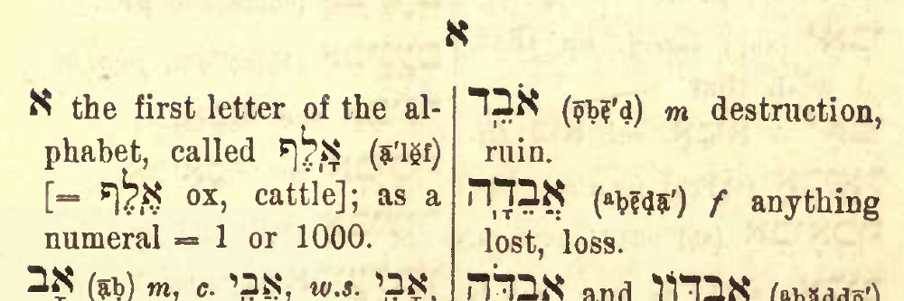

# Cover {.unnumbered}

Placeholder


<!--chapter:end:index.Rmd-->


# About This Course {-}

Placeholder


## Why an HLI Hebrew Grammar Course {- #motivation}
## How our course Is distinct {- #our_course}
## Relationship to _Hebrew Quest_ {- #hgq_and_hq}
## Completion of _Hebrew Quest_ is NOT a prerequisite! {- #finish_hq}

<!--chapter:end:00b-introduction.Rmd-->


# Getting Started / Getting Help {-}

Placeholder


## Navigating this book {- #navigating}
## A Typical Lesson {- #typical-lesson}
## Information Boxes {-}
## Quick Start Instructions {.unnumbered #get_started}
## Help with Anki {- #anki_help}
### Customize Anki Settings {- #anki_settings}
### How do I navigate within Anki? {-}
### How do I know when to hit the Good button on an Anki card? {-}
### How do I get help with Anki? {-}
## Course Resources {- #optional_resources}
## Report an Issue {- #report_issue}
## Ask a question {- #get_help}

<!--chapter:end:00d-help.Rmd-->

# (PART) Hebrew Grammar Foundations {-}

<!--chapter:end:01a-Part_I_header.Rmd-->


# The Hebrew Aleph-bet {#alephbet}

Placeholder


## First Thought {-}
### שֵׁם יְהוָה אֶקְרָא {-}
## The Hebrew Aleph-Bet {#consonants}
## Hebrew is written and read from RIGHT-to-LEFT {#right_to_left}
## Five "KiMNePaTZ" letters have different final forms {#sofit_letters}
## Six" BeGaD KePHaT" letters take a Daghesh Lene {#daghesh_lene}
## We classify four consonants as **Gutturals** (and one is a sometimes-guttural) {#gutturals}
## We classify ten consonants as "SQiN eM LeVY"
## Look out for look-alike Letters {#look-alike-letters}
## Sephardic and "Seminary" Pronunciation {#pronunciation}
## Lesson Conclusion and Activities {-}
### Anki {- #anki-1}
### Worksheets: Letter Writing {- #worksheets-1}
## Ruth Pursuit {-}
## Ruth Pursuit Translation Worksheet {-}
## Quest Quiz {-}

<!--chapter:end:01b-Alephbet.Rmd-->


# Hebrew Vowels {.vowels}

Placeholder


## First Thought {-}
###  הֵמָּה רָאוּ מַעֲשֵׂי יְהוָה {-}
## Vowels that are not vowel letters {#vowels}
### Vowels come in three types: Long, Short, Reduced | Vowels come in five classes: A, E, I, O, U {-}
## Vocal and Silent Sheva {#Sheva}
## Vowel letters {#vowel_letters}
### Vowel letters use a consonant plus a nikkud to form a vowel {-}
## Transliteration Shorthand
## "Defective" and "plene" spelling {#defective_spelling}
## The Dagesh Forte Doubles the Consonant {#dagesh_forte}
## Dagesh Forte Rule {#dagesh_forte_in_bgdkpt}
## Gutturals and Resh reject Dagesh Forte {#gutturals_reject_dagesh_forte}
## Lesson Conclusion and Activities {-}
### Anki {-}
### Vowel worksheet {-}
## Ruth Pursuit {-}
## Quest Quiz {-}
## Claim your `Twelve Tribes Badge`! {- #twelve-tribes-badge-1}

<!--chapter:end:02-Vowels.Rmd-->


# Syllabification and Pronunciation {#Syllabification}

Placeholder


## First Thought {-}
###  אַשְׁרֵי אָדָם לֹא יַחְשֹׁב יְהוָה לוֹ  {-}
## Hebrew Syllables {#syllables}
## Hebrew Word Accents {#accents}
## Tonic, Pretonic, and Propretonic Syllables
## Ultima, Penultima, and Antepenultima syllables
## Rules for Silent Sheva {#s_sheva}
### A Sheva is SILENT when the previous vowel is short: {-}
### A Sheva is SILENT when the first of two consecutive Shevas _within a word_: {-}
### A Sheva is SILENT when at the end of a word: {-}
## Rules for Vocal Sheva {#v_sheva}
### A Sheva is VOCAL when the initial Sheva in a word: {-}
### A Sheva is VOCAL when the second of two consecutive Shevas _within a word_<small>^[<small>A Sheva at the **end** of a word is **always silent**, even when it is the second of two consecutive Shevas.</small>]</small>:  {-}
### A Sheva is VOCAL when under a Dagesh Forte: {-}
### A Sheva is VOCAL after an unaccented long vowel: {-}
## Hebrew Diphthong = Accented Patach-Yod-Hireq {#diphthong}
## Vowels and Syllable Preference {#vowel_pref}
## Qamets Hatuf, Furtive Patach, Quiescent Aleph {#misc_vowels}
## Qamets Hatuf
## Furtive Patach 
## Quiescent Aleph
## Lesson Conclusion and Activities {-}
### Introduction to Video Warm-ups {-}
## Word Warm-up {-}
## Verses Warm-up {-}
## Ruth Pursuit {-}        
## Quest Quiz {-}
## Claim your `Unit 1 Completion Certificate`! {-}

<!--chapter:end:03-Syllabification.Rmd-->


# (PART) Nouns, Prepositions, Pronouns {-}
# Hebrew Nouns {.Nouns}

Placeholder


## First Thought {-}
### רְאֵה לִמַּדְתִּי אֶתְכֶם חֻקִּים וּמִשְׁפָּטִים {-}
## _Hebrew Quest_ Grammatical Gender Lecture
## Gender and Number {#gender_number}
## Parsing vs. Inflecting
## Singular Noun Endings {#sing_noun_endings}
## Plural Noun Endings {#noun_pluralization}
## Dual Noun Endings
## Special dual forms {#dual_forms}
## Irregular Pluralization  {#irregular_pluralization}
### Segholate Nouns follow a standard vowel pattern when pluralizing {-}
### Geminate Words take a Daghesh Forte {-}
## Rule of Sheva {#rules_sheva}
## Lexical Form {#lexical_form}
## Word Warm-up {-}
## Verses Warm-up {-}
## Anki {-}
## Ruth Pursuit {-}        
## Quest Quiz {-}

<!--chapter:end:04-NounsPlural.Rmd-->


# Definite Article and Conjunction Vav {.Article}

Placeholder


## First Thought {-}
### <span class="he">מִי־מָדַד בְּשָׁעֳלוֹ מַיִם וְשָׁמַיִם</span> {-}
## _Hebrew Quest_ Conjunction Lecture
## Translate the Vav Conjunction {#vav_translate}
## Identify the Vav Conjunction {#vav_identify}
## Loss of Dagesh Forte {#loss_Dagesh_forte}
## Compensatory Lengthening
## _Hebrew Quest_ Article Lecture
## Translate the Article {#article_translate}
## Identify the Article {#article_identify}
## Hebrew Indefiniteness {#indefiniteness}
## Other Hebrew Definiteness {#definiteness}
## Lesson Conclusion and Activities {-}
## Word Warm-up {-}
## Verses Warm-up {-}
## Anki {-}
## Ruth Pursuit {-}        
## Quest Quiz {-}
## Claim your next `Twelve Tribes Badge`! {-}

<!--chapter:end:05-DefArt_Conjunction.Rmd-->


# Hebrew Prepositions

Placeholder


## First Thought {-}
### <span class="he">  בְּיוֹם צָרָתִי אֲדֹנָי דָּרָשְׁתִּי </span> {-}
## _Hebrew Quest_ Prepositions Lecture
## Nun with Silent Sheva Becomes Dagesh Forte
## Independent and Maqqef prepositions 
## Inseparable prepositions
## The Article and Inseparable Prepositions
## The flexible <span class="he">מִן</span>: construction
## The Article and <span class="he">מִן</span>
## The flexible <span class="he">מִן</span>: meanings 
## The Definite Direct Object marker 
## _Hebrew Quest_ discussion of Genesis 1:1 
## Conclusion {-}
### Anki {-}
## Word Warm-up {-}
## Verses Warm-up {-}
## Ruth Pursuit {-}        
## Quest Quiz {-}

<!--chapter:end:06-Prepositions.Rmd-->


# Hebrew Adjectives {#adjectives}

Placeholder


## First Thought {-}
### <span class="he">אֶת־הַכֹּל עָשָׂה יָפֶה בְעִתּוֹ</span> {-}
## _Hebrew Quest_ Adjectives Lecture
## Inflecting Adjectives
## Substantival Use
## Attributive Use
## Predicative Use
## Attributive, Predicative, and Substantival Comparison
## The Mappiq 
## The Directional Ending 
## Word Warm-up {-}
## Verses Warm-up {-}
## Anki {-}
## Ruth Pursuit {-}        
## Quest Quiz {-}
## Claim your next `Twelve Tribes Badge`! {-}

<!--chapter:end:07-Adjectives.Rmd-->


# Hebrew Pronouns

Placeholder


## First Thought {-}
### <span class="he">זֶה הַדֶּרֶךְ לְכוּ בוֹ</span> {-}
## _Hebrew Quest_ Independent Pronouns Lecture
## Independent Personal Pronoun Table
## Independent Personal Pronouns Discussion
## Relative Pronoun <span class="he">אֲשֶׁר</span>
## Interrogative Pronoun
## Interrogative Particle <span class="he">הֲ</span>
## Interrogative Particle vs. Definite Article 
## _Hebrew Quest_ Demonstratives Lecture
## Near and Far Demonstratives
## Demonstrative Pronoun
## Demonstrative Adjective 
## Lesson 8 Conclusion {-}
## Word Warm-up {-}
## Verses Warm-up {-}
## Anki {-}
## Worksheets: Pronouns {-}
## Ruth Pursuit {-}        
## Quest Quiz {-}

<!--chapter:end:08-Pronouns.Rmd-->


# Hebrew Pronominal Suffixes

Placeholder


## First Thought {-}
### <span class="he">וַיֹּאמְרוּ שָׁאוֹל שָׁאַל־הָאִישׁ לָנוּ וּלְמוֹלַדְתֵּנוּ </span> {-}
## _Hebrew Quest_ Possessive Pronominal Suffixes Lecture
## _Hebrew Quest_ Pronominal Suffixes
## Possessive Pronominal Suffix Meaning
## Type 1 and Type 2 Suffixes
## Singular Suffixes
## Plural Suffixes
## Distinguish Type 1 from Type 2
## Identifying the Lexical Form with Type 1
## Identifying the Lexical Form with Type 2
## Unexpected changes
## Look-alike words: <span class="he">אֵת</span> as "with" or as Definite Direct Object (DDO) marker
## Look-alike words:   <span class="he">עִם</span>, "with", or <span class="he">עַם</span>, "people" 
## Look-alike words: <span class="he">אֵל</span>, "God", or <span class="he">אֶל</span>, "to"
## Word Warm-up {-}
## Word Warm-up: pronominal suffixes {-}
## Verses Warm-up {-}
## Anki {-}
## Worksheets: Pronominal Suffixes {-}
## Ruth Pursuit {-}        
## `Quest Quiz` {-}

<!--chapter:end:09-Pronominal_Suffixes.Rmd-->


# Hebrew Construct Chain {.ConstructChain}

Placeholder


## First Thought {-}
### <span class="he">בְּצֶדֶק כָּל־אִמְרֵי־פִי</span> {-}
## What is a Construct Chain?
## What makes a construct chain
## Review: what makes a word definite 
## The Absolute noun establishes the definiteness of a chain
## How to Recognize a Construct Chain
## Identifying Construct state by Noun Endings
## Construct Chain Summary
## Word Warm-up {-}
## Verses Warm-up {-}
## Anki {-}
## Worksheets: Construct Identification {-}
## Ruth Pursuit {-}        
## Quest Quiz #10 {-}
## Claim your next `Twelve Tribes Badge`! {-}

<!--chapter:end:10-ConstructChain.Rmd-->


# Hebrew Numerals

Placeholder


## First Thought {-}
## _Hebrew Quest_ Numerals Lecture
## The Biblical text always spells out numbers
## Notes and footnotes use symbols for numbers
## Hebrew Ordinal Numbers
### _Hebrew Quest_ Ordinal Numbers Video {-}
## Cardinal Numbers 1-10
### Digits 1 and 2 match the gender of the noun {-}
### Digits 3-10 take the opposite gender of the noun {-}
## Cardinal Numbers Above 10
## Conclusion
### Anki {-}
## Word Warm-up {-}
## Verses Warm-up` {-}
## Ruth Pursuit {-}        
## Claim your Unit 2 Completion Certificate! {-}

<!--chapter:end:11-Numerals.Rmd-->


# (PART) Qal Stem {-}
# Introduction to Unit 3 {-}

Placeholder


## Vowel Transliteration/Shorthand {-}
## $Pre$ = Diagnostic Word-initial Combinations {-}
## Changes for Unit 3: No more quizzes! {-}
## Changes for Unit 3: Cantillation Marks added to Study Verses {-}
## Changes for Unit 3: OPTIONAL _Hebrew_ Quest Study Passage Translation {-}
## Lessons 13-16 are critical! {-}
## _Hebrew Quest_ Verb Summary Lecture {-}

<!--chapter:end:11b-Unit3_Intro.Rmd-->


# Introduction to Hebrew Verbs

Placeholder


## First Thought {-}
### <span class="he">וְהֽוּא־הָלַ֤ךְ בַּמִּדְבָּר֙ דֶּ֣רֶךְ י֔וֹם </span> {-}
## _Hebrew Quest_ Verb Introduction Lecture
## A note on the paradigm strong verb <span class="he">קטל</span>
## The Verbal Root
## Inflecting and Parsing Review
## Person, Gender, Number
## Verb nomenclature
## Lexical form for Verbs
## Preformatives, Sufformatives, Prefixes, and Suffixes
## Verbal Vowels
## _Hebrew Quest_ Verb Stems Lecture
## The Seven Hebrew Verb Stems
## The Seven Stems: Summary Table
## Conjugation
## The Eight Basic Conjugations
## Finite vs. Non-Finite Conjugations
## Parsing
## Parsing Codes
## Strong and Weak Verbs
## Weak Verbs
## Weak Verb Classes {#weak-class}
## Weak Verbs Are Usually Predictable
## Hebrew GRAMMAR Quest is a Quest for RECOGNITION, NOT RECALL
## Stem Comparison Table
## Word Warm-up {-}
## Verses Warm-up {-}
## Anki {-}
## Ruth Pursuit {-}        
## OPTIONAL _Hebrew Quest_ Study Passage Track: Proverbs Study #1-4 {-}

<!--chapter:end:12-Verbs_Intro.Rmd-->

# Qal Perfect - Strong Verbs {.QP-s}


Over 2/3 of all verbs in the Hebrew Bible are in the Qal stem.  To understand Biblical Hebrew, we must be able to translate Qal verbs.

While our focus is not on writing Biblical Hebrew, we need to be able to write the details on the Qal strong verb paradigms. This will make it easier to recognize Qal weak and non-Qal verbs.  This lesson will begin with the Perfect conjugation.

::: {.box .map}
LESSON ITINERARY

1. Qal is simple action, active voice; Perfect is completed action or state
1. Components of the Qal Perfect Strong Paradigm
    1. $V_S$ is accented in Finite verbs
    1. A Sheva precedes a Finite verb sufformative 
    1. The Perfect Sufformatives
    1. The Qal Perfect Vowels
1. Building the Qal Perfect Paradigm
1. Deviations from the Strong Paradigm
:::

::: {.box .stop}
EQUIPMENT CHECK

Before continuing, make sure you understand the $R_n$ and the $V_n$ nomenclature, including $V_S$
:::


## First Thought {-}

### <span class="he">לֹא־שָׁמְר֤וּ אֲבוֹתֵ֙ינוּ֙ אֶת־דְּבַ֣ר יְהוָ֔ה </span> {-}

*Our fathers did not keep the word of Adonai (2 Chronicles 34:21)*

<span class="he">שָׁמַר</span> means to guard or keep, in the sense of obeying.  It is a verb that frequently occurs in the Hebrew Bible. In <span class="he">לֹא־שָׁמְרוּ</span>, the word לֹא serves to negate the verb it precedes.  Literally, this might be "not they kept", but we would say "they did not keep" in English.

Every day, and frequently throughout each day, we have two choices.  We can keep His word, or we can ignore His word.  Let us strive to have it be said of all of us, <span class="he">שָׁמְרוּ אֶת־דְּבַר יְהוָה </span>, "they KEPT the word of Adonai."

<figure>
    <figcaption>Listen to the verse in Hebrew:</figcaption>
    <audio
        controls controlsList="nodownload"
        src="./images/13.08.2chr3421.mp3">
            Your browser does not support the
            <code>audio</code> element.
    </audio>
</figure>


```r
knitr::include_graphics("images/13.Mount Gerizim, Shechem, Mount Ebal from east, tb070507660.jpg")
```

<div class="figure" style="text-align: center">

<p class="caption">(\#fig:unnamed-chunk-1)Mt Gerezim, Shechem, Mt. Ebal from east.  In Deuteronomy 11, Moses instructs that when Israel enters the land, she is to read the blessings from Mt. Gerezim and the curses from not following His word from Mt. Ebal. Today, Shechem is also known as the Arab city of Nablus. Courtesy of the [Pictorial Library of Bible Lands](https://www.bibleplaces.com)</p>
</div>


## _Hebrew Quest_ Qal Perfect Lecture

View this 3-minute overview video from _Hebrew Quest_ on Hebrew Verbs.  We will break down the concepts Izzy discusses as we progress through this lesson.  Note: the terms "afformatives" used by Izzy, and "sufformatives" used by <u>Basics of Biblical Hebrew</u> are synonymous.

<div class="container">
<iframe class="responsive-iframe" src="https://www.youtube.com/embed/
hfu4gjNo2K4?start=2846&end=3062&rel=0&showinfo=0&autohide=1&autoplay=1" frameborder="0"></iframe>
</div>

[Click to open video in a new tab](https://youtu.be/hfu4gjNo2K4?start=2846){target="_blank"}

##  Qal is Simple action, Active voice

| |Active Voice| Passive Voice | Reflexive Voice
|:- |:- |:- |:-
Simple Action	| __QAL__ | Niphal | (Niphal)
Intensive	| Piel | Pual | Hitpael
Cause an Action	|Hiphil | Hophal

*  Remember this table is very high-level and perhaps over-simplified; but, it is a good starting place for understanding the meaning each stem
*  Qal is the primary Hebrew stem
*  The other six major stems are said to be "derived" from the Qal stem, hence the name "derived stems"

## Perfect is completed action or a state as a whole

* In translating, we will most often use the simple English past tense
    * For example, "she studied"
* It is commonly taught that the Hebrew perfect is equivalent to the English past tense
    * This is a generality; it is often true, but it is not always true
    * Other translations may be appropriate depending on the context
        * Present perfect: "she has studied"
        * Past perfect: "she had studied"
        * Future perfect: "she will have studied"
* Stative verbs describe a state of being; these verbs are also Perfect
    * English present is often a better translation: She is wise, she knows, she loves
    * English past might also be appropriate: she was wise
    * In a few sections, we will learn that in Hebrew, stative verbs are sometimes spelled differently
    
::: {.box .info}
The Hebrew perfect aspect describes an action or a state of being as a whole, not as a process

I.e., "she was studying" is an incomplete process, but "she had studied" is completed action  
:::

## Preformatives and Sufformatives

* In Lesson 12, we introduced the concept of preformatives and sufformatives
* These are unique verbal beginnings and endings that indicate person, gender, and number
* The Perfect has a set of "perfect sufformatives"
    * Only the 3ms does not have a perfect sufformative
    * We will learn the sufformatives for the remaining forms in the next section
    * The perfect does not have preformatives
    * A verb without a preformative, and a perfect sufformative will be diagnostic of a Perfect conjugation
    * The perfect sufformatives are the same across all verb stems, so what you learn for the Qal can be applied to the derived stems
* The Imperfect primarily has "imperfect preformatives"
    * All forms have an imperfect preformative
    * Many forms also have an imperfect sufformative

## The Perfect Sufformatives I

* The table below shows the perfect sufformatives in the middle column  
* Note how the 1st person, 2nd person, and 3fs forms are similar to the respective pronominal suffix
* 2MP and 2FP are called "Heavy Sufformatives" because, as we will learn, they draw the accent


```r
knitr::include_graphics("images/13_perfect sufformatives.png")
```


## The Perfect Sufformatives II

* The table below lists the perfect sufformatives both stand-alone and affixed to the <span class="he">קטל</span> paradigm verb
* Note 3ms does not have a perfect sufformative but all the other forms do
* Since 3mp and 3fp are the same in the Perfect, we simply say "3cp" - Third-person, common, plural


```r
knitr::include_graphics("images/13.qptable.png")
```


::: {.box .map}
GOOD NEWS

As you continue with your Hebrew GRAMMAR Quest into Unit 4, you will learn these sufformatives REMAIN THE SAME throughout all seven Perfect conjugations.
:::

## A Sheva precedes a Finite Sufformative

* This is a general rule that results in a Sheva under $R_3$ or $R_2$
* Of course, when the Sheva is under $R_2$, this means the Sheva displaces the conjugation's normal $V_S$
* Because of this rule, when the sufformative has a בגדכפת letter (usually ת), that letter will take a Daghesh Lene
* Take a look at this table again and note how there is a sheva next to the sufformative
    * 3MS has no sufformative so it has no sheva
    * 3CP looks a little different because the sufformative starts with a vowel
        * The ל already has an associated vowel, Shureq
        * A consonant cannot have more than one vowel
        * Therefore the Sheva displaces the Patach in $V_2$
        * The same thing happens in 3FS; the Sheva can't go under the ל because it already has a vowel
    

```r
knitr::include_graphics("images/13.qptable.png")
```


    
::: {.box .caution}
The Sheva is rejected in the following circumstances:

* A Sheva does not replace an unchangeable long vowel
* A Sheva does not replace $V_1$ of the Qal Perfect (and only the Qal Perfect)
* When $R_3$ is <span class="he">א</span>, the א quiesces (generally resulting in Compensatory Lengthening of $V_2$)

:::


## Qal Perfect Vowels: $V_1$ is almost always Qamets

* On previous chart, you likely noticed other markings under <span class="he">קטל</span> besides the sufformatives
* These are the other characteristics of the Qal perfect paradigm
* $V_1 = \bar A$ (Qamets) almost always
    * As we learned way back in this course, an unaccented long vowel in an open propretonic syllable will undergo propretonic reduction
    * When this happens, you will see a Vocal Sheva, but you will be able to deduce that $V_1$ used to be a long vowel - and if it's a Qal verb, you'll know it used to be a Qamets
* Study the chart below showing $V_1$
    * The vertical line in 3FS and 3CP is called a "metheg" and is used to distinguish $\bar A$ (Qamets) from $O$ (Qamets Hatuf) when followed by a Sheva
    * Note 2MP and 2FP have undergone propretonic reduction and have $ə$ (Vocal Sheva) instead of $\bar A$
    

```r
knitr::include_graphics("images/13.qptablev1.png")
```


## Qal Perfect Strong $Pre =$ <span class="he">קָ</span>

* HGQ SHORTHAND: $Pre$ = Strong Form Diagnostic Word-initial Sequence
* Each of the stems/conjugations has a distinctive combination of consonants, vowels, and occasionally Daghesh Forte marks the first one or two syllables of a given verb
* This serves to make the strong form of the verb easy to differentiate from the other stems
* We will call this diagnostic sequence "$Pre$"
    * Saying "diagnostic word-initial sequence of consonants and vowels" would get tiresome!
* For Qal Perfect (QP), $Pre =$ <span class="he">קָ</span>
    * ק represents any strong letter in $R_1$ 
    * This means the distinctive word-initial sequence of a <u>Q</u>al <u>P</u>erfect verb is no prefix/preformative and a Qamets in $V_1$

    
## Qal Perfect Strong $V_S = A$

* For QP, $V_2$ prefers Patach 
* For strong verbs, $V_S = V_2$
    * So we could either say "$V_S$ for Qal Perfect Strong equals Patach"
    * Or we could use formula shorthand and say "Qal $V_S = A$", since "A" is our shorthand for a short A vowel, i.e., Patach
* In 3cp and 3fs, the Sheva of the perfect sufformative goes in $V_2$


```r

```


::: {.box .caution}
EXCEPTIONS

* The $V_S$ can change based on other grammar rules, for example, when the vowel must reduce to a Sheva/Reduced Vowel
* Some stative verbs can also take a Tsere or Holem in $V_2$ (see "Stative Verbs..." section in this Lesson)

:::
    

## Each Stem will have a $V_S$ FORMULA

* As we progress through the verbs, each major stem will end up with a formula that looks something like this: 

$$V_{S} =  Î[A] \sim  Î(Ē)$$

* This is probably complete gibberish to you right now
* As we get into Unit 4, this formula (in combination with the $Pre$ pattern) will save you hours of paradigm memorization of the derived stems
* You will only need to memorize the Qal paradigms, then apply this formula to the other stems
* So let's start to build this formula for the Qal:

$$V_{S} = A \sim$$

* In the formula, $A$ refers to Patach
* This formula is telling you that the Stem Vowel of the Perfect Conjugation _prefers_ Patach
* The _Imperfect_ Stem Vowel will be to the right of the $\sim$ mark - we'll address this in Lesson 15

            

## $V_S$ is accented in Finite verbs

* As we introduced in Lesson 12, verbs that have "person" designation are called Finite verbs
    * Perfect, Imperfect, Imperative, Cohortative, Jussive are FINITE
    * Infinitive Construct, Infinitive Absolute, Participle are NON-FINITE because they do not have "person"
* The $V_S$ is accented in Finite verbs, when possible
    * As we said in the previous lesson, $V_S$ usually = $V_2$ 
        * In <span class="he">קָטַל</span> $V_S = A$ (Patach)
    * If $R_2$ is a vowel letter, then $V_S$ = $V_1$
        * In <span class="he">קוּם</span> $V_S = \hat U$ (Shuruq)
    * If $R_2$ disappears, then $V_S$ = $V_1$ 
        * In <span class="he">קָם</span> $V_S = \bar A$ (Qamets)
* Take a look at this table again and note where the accent lands:


```r

```


::: {.box .caution}
EXCEPTIONS

* When $V_S$ is a Sheva or Hateph vowel:
    * Sheva/reduced vowels _never_ take an accent
    * In the Perfect, we will see this in QP3fs and QP3cp
* When the verb has a "heavy sufformative"
    * A heavy sufformative takes the accent
    * There are two heavy sufformatives in Hebrew:  2mp - תֶּ֫ם and 2fp - תֶּ֫ן
* When the verb has a pronominal suffix (Lesson 19)
* When $V_S$ is not one of the final two syllables

:::


## Building the Qal Perfect Strong Paradigm

* Understanding how we build the paradigm will prepare you to identify verbs in the Bible
* It will also prepare you to spot when deviations occur in weak verbs
* Study the graphic and the steps below carefully
* It may be confusing at first, but over time, it will begin to make sense


```r
knitr::include_graphics("images/13.Qal_Perfect_Strong.gif")
```


1. Add the perfect sufformatives 
2. Put a Sheva before the sufformative 
    * 3fs/3cp - the Sheva can't go under $R_3$ because $R_3$ already has a vowel
        * A consonant can't have more than one vowel
        * For these forms, the Sheva goes under $R_2$
3. Add Dagesh Lene to תּ that comes after any Sheva
    * all 2nd person forms and 1cs
4. $V_S = A$ (Patach) in the Qal Perfect Strong paradigm (13.5)
    * UNLESS $V_2$ is already a Sheva from step two
5. Accent $V_S$ (unless there is one of the exceptions listed in 13.6)
6. $V_1 = \bar A$ (Qamets) (13.5)
    * 2mp/2fp - the Qamets is then reduced to a Vocal Sheva because of propretonic reduction
7. OPTIONAL - Add a metheg mark to $V_1$ 3fs/3cp 
    * The Metheg can denote that the vowel is Qamets followed by a vocal Sheva and not Qamets Hatuf followed by a Silent Sheva
    * Most Hebrew Bibles do not employ a Metheg for this purpose.
    
## Qal Perfect Strong Paradigm

Below is the complete paradigm.  Be sure to listen to Izzy read the forms with the paradigm verb, קטל and take note of pronunciation and accents.  


| Sing | Paradigm | Plural | Paradigm
| :-  | :- | :-  | :-
| 3ms | <span class="he">קָטַל</span>  | 3cp | <span class="he">קָטְלוּ</span> 
| 3fs | <span class="he">קַטְלָה</span> | 
| 2ms | <span class="he">קָטַ֫לְתָּ</span> | 2mp | <span class="he">קְטַלְתֶּם</span>
| 2fs | <span class="he">קָטַ֫לְתְּ</span> | 2fp | <span class="he">קְטַלְתֶּן</span>
| 1cs | <span class="he">קָטַ֫לְתִּי</span> | 1cp | <span class="he">קָטַ֫לנוּ</span>


<figure>
    <figcaption>Listen to the Qal Perfect Strong Paradigm from _Hebrew Quest_</figcaption>
    <audio
        controls controlsList="nodownload"
        src="./images/13.Qal_perfect.mp3">
            Your browser does not support the
            <code>audio</code> element.
    </audio>
</figure>

## Worksheet: Qal Perfect Strong Paradigm {-}

* We are going to go a little out of order
* Typically, we save all of the activities for the end of the lesson, but here, we want you to pause and complete the [Qal Perfect Strong Paradigm](./images/13_qal_perfect_strong_paradigm.pdf){target="_blank"}.

> Complete the paradigm from memory at least once, then return here and continue in the guidebook.

* We know you're tempted to keep on clicking to read the pages that follow.  Resist!
* Doing the worksheet now will maximize your learning time
* In other words, the material that follows in this lesson will make more sense to you if you have the paradigm in your short-term memory

## Qal Perfect Strong Examples

* <span class="he">יָדַ֥ע</span>
    * No Preformative + No sufformative =  $P3ms$ conjugation
    * $Pre =$ <span class="he">קָ</span> and  $V_2 = A$ are diagnostic of $Q$ stem
        * In the Qal, can also have $V_2 = \bar A$
    * This combination of Preformatives, sufformatives, and vowels can only be Qal Perfect 3MS (QP3ms) - he knows
    * As we said in the introduction to Unit 3, you will start to see the cantillation marks in words and passages.  If you don't recognize a mark as a vowel, it is a cantillation mark.
* <span class="he">שָׁמְר֤וּ</span>
    * No preformative + וּ sufformative = $P3cp$ conjugation
    * $Pre =$ <span class="he">קָ</span> is diagnostic of $Q$ stem
        * $V_2 = :$
        * The Perfect sufformative is preceded by a Sheva whenever possible
        * In the P3cp and P3fs, the Sheva of the sufformative displaces $V_2$
        * If we know our vocab, we also understand that the Lexical form is <span class="he">שָׁמַר</span>.
    * שָׁמְר֤וּ is Qal Perfect 3cp (QP3cp) - they guarded/observed

::: {.box .map}
NAVIGATION TIP

* As we will learn in Unit 4 when there are no other signs of a different stem we can default to Qal; this is because Qal is the most common stem
* As with <span class="he">זָכָ֑רְתְּ</span>, there are times where $V_2= \bar A$ or $V_2 = A$
    * These are often spelling variants that occur over the many hundreds of years the Tanach was written<small>^[<small>This is not unlike seeing "olde" or even "auld" on an English document from a few hundred years ago.  We know they both mean "old"</small>]</small>
    * There is nothing otherwise to suggest that these are not Qal verbs

:::

## Deviations from the Paradigm

* As we talked about in Lesson 12, what makes a verb "weak" versus "strong" is when one or more letters cause a deviation from the strong verb paradigm
* While the bulk of the discussion on weak verbs will be in Lesson 14, there are three weak forms we will introduce in this lesson: 
    * Words where $R_3$ = <span class="he">נ</span>, which we abbreviate as  or sometimes III-נ (pronounced as, "third nun")
    * Words where $R_3$ = <span class="he">ת</span>, called  or 3ת
    * Stative verbs where $V_2 \not = A$

> In most cases, you already know the behaviors of "weak" letters!  

While "stative" verbs may be a new concept, we have already discussed the tendency of ת and נ to assimilate under certain circumstances.  This is what happens when we encounter 3ת and 3נ verbs.

## 3נ and 3ת Verbs

* We mentioned above how a Sheva will be placed before a Finite sufformative (if possible)
* When ת and נ have a Silent Sheva, each may assimilate depending on the letter that follows
    * In other words, the verb will lose $R_3$ and a Daghesh Forte will be placed into the first letter of the sufformative
    * An $R_3$ of ת with a Silent Sheva will only assimilate when the sufformative begins with ת
        * Not <span class="he">כָּרַ֫תְתָּ</span>*<small>^[<small>Remember, the * means the Hebrew word is an impossibility, but is shown for illustrative purposes</small>]</small> but <span class="he">כָּרַ֫תָּ</span>
        * Not <span class="he">כְּרַתְתֶּם</span>*, but <span class="he">כְּרַתֶּ֫ם</span>
        * IMPORTANT: Note how the Daghesh in the ת shifts from a Lene to a Forte (because the Daghesh is now preceded by a vowel that is not a Sheva)
            * This is your cue that something has changed, usually that a letter is missing
            * In theory, the root could be either <span class="he">כרן</span> or <span class="he">כרת</span>, but you already know כרת from your vocabulary work (and there is no verb root <span class="he">כרן)
    * An $R_3$ of נ with a Silent Sheva will tend to assimilate to either נ or ת
        * <span class="he">נַתַן</span> is an extremely common 3נ verb meaning "to give"
        * Not <span class="he">נָתַ֫נְנוּ</span>*, but <span class="he">נָתַ֫נּוּ</span>
        * Not <span class="he">נָתַ֫נְתָּ</span>*, but <span class="he">נָתַ֫תָּ</span>
    
## Stative Verbs MAY have a different $V_S$

* Stative verbs describe a state of being, such as "wise", "old", or even "dead"
* The $V_S$ may change in some forms
    * There is what is called a "Patach Stative" that prefers $V_S$ of (wait for it...) Patach
        * Since Qal Perfect _already_ prefers a $V_S$ of Patach, there is no visible change
        * Patach Stative has a different $V_S$ in the Imperfect conjugation
        * <span class="he">גָּדַ֫ל</span>, "he is great" is an example - this word maintains the Perfect Strong paradigm all the way through
    * Tsere Stative has $V_S$ of Tsere in the P3ms ONLY
        * <span class="he">כָּבֵ֫ד</span> = "he is honored"
        * All other PGN follow the Perfect Strong
    * Holem Stative has $V_S$ of Holem in P3ms, P2ms, and P1cp
        * Holem Statives are relatively rare and do not even appear in the Bible as P2fs or any of the plural forms other than P1cp
        * <span class="he">יַכֹ֫ל</span> = "he is able to" or "he can"
        * <span class="he">קָטֹ֫נְתִּי</span> = "I am small"
            * Note the נְ DOES NOT assimilate - Hebrew likes to keep you guessing!
            * When you see only $R_1$ and $R_2$, and then a Daghesh Forte in the next consonant, it's better to ask "did $R_3$ assimilate?"


## Word Warm-up {-}

<div class="container">
<iframe class="responsive-iframe" src="https://youtube.com/embed/PuYs3ZTVXVg" frameborder="0"></iframe>
</div>

[Click to open `Word Warm-up` video in a new tab](https://youtu.be/PuYs3ZTVXVg){target="_blank"}


## Verses Warm-up {-}

<div class="container">
<iframe class="responsive-iframe" src="https://youtube.com/embed/kgMX1hbnbSE" frameborder="0"></iframe>
</div>

[Click to open `Verses Warm-up` video in a new tab](https://youtu.be/kgMX1hbnbSE){target="_blank"}

## Anki {-}

* `Lesson 13 A. Vocab`
* `Lesson 13 B. Grammar` 
* `Lesson 13 C. Workbook` 
    * The verb parsing exercises are taking directly from the Study Verses
    * As we will learn next week, "weak" verbs are a lot more common than "strong" verbs
    * Even though we will formally study weak verbs in Lesson 14, you should be able to use your knowledge of $V_1$ and the Perfect preformatives to determine the parsing solution
        * Of course, we've only studied the Qal Perfect!
        * When you encounter a "weak" verb, such as <span class="he">מָלְאָ֥ה</span>, which is 3א, or <span class="he">יָדָ֔עוּ</span>, which is 3עח (A ח or ע as $R_3$), try to see what changes occur (based on what you already know about Gutturals)
* `Lesson 13 D. Study Verses`


## Ruth Pursuit {-}        

::: {.box .map} 
YOUR QUEST:

1. Identify and translate the following Qal Perfect Strong Verbs:
    * פקד QP3ms (yellow)
    * זקן QP1cs (green)
        * What is unique about this verb?
    * ילד QP1cs (gray)
    * דבק QP3fs (blue)
        * Hint: See [page 65 of this dictionary](https://holylanguage.com/resources/Pocket-Hebrew-Dictionary-Feyerabend.pdf){target="_blank"}
2. Identify and translate מלא FS (adjective)(pink)

:::


* [Blank copy of Ruth 1](https://docs.google.com/document/d/1bcT1J-fcVmD1Zn5Jk2nj0560tEddcgtbYZLkwaVVuyE/copy){target="_blank"}
* [Ruth Pursuit Answer Key #13](./images/13_Ruth_Pursuit_KEY.pdf){target="_blank"}


## Claim your next `Twelve Tribes Badge`! {-}

<!-- Lesson 13 Tribe Badge 5 = Issachar -->

When you have completed all activities on your `Hebrew GRAMMAR Quest Checklist` up to and including this lesson, complete the certification below, and your badge will be on its way!

<div class="containerLtr">
<iframe class="responsive-iframe" src="https://forms.gle/ywRYeNmuKkK441Pj9" frameborder="0"></iframe>
</div>

## OPTIONAL _Hebrew Quest_ Study Passage: Proverbs #5-7 {-}

::: {.box .map}
YOUR HEBREW QUEST:

1. BEFORE WATCHING THE VIDEO, read through the passage on your own straight through one time - pick up as much as you can - [Blank copy of the Proverbs studied in sessions 5-7.](https://docs.google.com/document/d/15D5W-prZoVTGEFa9QzuBCnfW4kQnwXT4TBNYNPhcRW8/copy){target="_blank"}
2. Now re-read the passage critically
    1. Highlight any words you do not know and look them up in a [lexicon](https://holylanguage.com/resources-dictionaries.php){target="_blank"}
    2. Sketch out a translation - there is a blank line between each verse
3. Now, using your marked-up copy of the passage, watch Izzy's _Hebrew Quest_ videos (video opens in a new tab)
    1. [Proverbs #5](https://holylanguage.com/proverbs-5.php){target="_blank"}
    1. [Proverbs #6](https://holylanguage.com/proverbs-6.php){target="_blank"}
    1. [Proverbs #7](https://holylanguage.com/proverbs-7.php){target="_blank"}
4. After the video, assess your translation.  How close was it?
5. How did the Ruach HaKodesh speak to you through the passage?

:::

<!--chapter:end:13-Qal_Perfect_Strong.Rmd-->


# Qal Perfect - Weak Verbs {.QP-w}

Placeholder


##  First Thought {-}
### <span class="he">בָ֤אָה נַחֲלָתֵ֙נוּ֙ אֵלֵ֔ינוּ מֵעֵ֥בֶר הַיַּרְדֵּ֖ן מִזְרָֽחָה׃</span> {-}
## Introduction and Review
## 3נ and 3ת with Silent Sheva Assimilate to Dagesh
## Review of Guttural Principles
## 1G, 2G
## 3-ע/ח
## א3 
## יָרֵא is 3א AND Tsere Stative
## 3ה  
## Doubly Weak
## הָיָה
## Geminate Paradigm
## Geminate Vocabulary
## Biconsonantal
## מוּת is Biconsonantal and Stative
## Qal Perfect Quest Clues
## Clues for Qal Perfect Special Situations
## Word Warm-up {-}
## Verses Warm-up {-}
## Anki {-}
## Ruth Pursuit {-}    
## OPTIONAL _Hebrew Quest_ Study Passage: Proverbs #8-10 {-}

<!--chapter:end:14-Qal_Perfect_Weak.Rmd-->


# Qal Imperfect - Strong Verbs {.QI-s}

Placeholder


## First Thought {-}
### <span class="he">יִ֝שְׁמֹ֗ר כָּל־אָרְחֹתָֽי </span> {-}
## _Hebrew Quest_ Qal Imperfect Lecture
## Translating the Imperfect
## The Imperfect Always has a Preformative
## Qal Imperfect Vowels
## Imperfect Sufformatives
## Building the Qal Imperfect Strong Paradigm
## Qal Imperfect Strong Paradigm
## Worksheet: Qal Imperfect Strong Paradigm {-}
## Qal Imperfect Strong Examples
## Deviations from the Paradigm
## Translating Negative Commands
## Word Warm-up {-}
## Verses Warm-up {-}
## Ruth Pursuit {-}   
## OPTIONAL _Hebrew Quest_ Study Passage: Proverbs #11-14 {-}

<!--chapter:end:15-Qal_Imperfect_strong.Rmd-->


# Qal Imperfect Weak {.QI-w}

Placeholder


## First Thought {-}
### <span class="he">וְעֵינֵיכֶ֖ם תִּרְאֶ֑ינָה</span> {-}
## Our Quest
## 2G 
## 3חע
## 3א  
## 3ה 
## 3ה ending comparison table
## 1G
## 1א "Angry Baker"
## Geminate
## Biconsonantal
## 1-Yod 
## הלך 
## <span class="he">יכל</span> takes $V_P = \hat U$
## 1נ Assimilates with Silent Sheva
## לקח
## Doubly Weak
## נתן is 1נ and 3נ
## ראה vs. ירא
## Qal Imperfect Weak Summary
## Word Warm-up {-}
## Verses Warm-up {-}
## Ruth Pursuit {-}   
## Claim your next `Twelve Tribes Badge`! {-}
## OPTIONAL _Hebrew Quest_ Study Passage: Proverbs #15-17 {-}

<!--chapter:end:16-Qal_Imperfect_Weak.Rmd-->


# Vav Consecutive {.wc}

Placeholder


## First Thought {-}
### <span class="he">וַיַּשְׁכִּ֣מוּ בַבֹּ֔קֶר וַיַּֽעֲל֥וּ אֶל־רֹאשׁ־הָהָ֖ר </span> {-}
## _Hebrew Quest_ Qal Vav Consecutive Lecture (
## _Hebrew Quest_  Vav Consecutive Lecture (from Lesson 5)
## Review of the Conjunction Vav
## Perfect + וְ: Spelling
## Perfect + וְ: Translating
## Imperfect + וְ: Spelling
## Imperfect with Vav often indicates purpose
## Imperfect Waw Consecutive: Spelling (Strong)
## Imperfect Waw Consecutive: Spelling (Weak)
## Imperfect Waw Consecutive: Translation
### Usually, translate Iwc as PAST TENSE {-}
## Summary
## Word Warm-up {-}
## Verses Warm-up {-}
## Worksheets: Qal Vav-Consecutive Paradigms {-}
## Ruth Pursuit {-}   
## OPTIONAL _Hebrew Quest_ Study Passage: Genesis 1:1-5 {-}

<!--chapter:end:17-Vav_Consecutive.Rmd-->


# Qal Imperative {.QM}

Placeholder


## First Thought {-}
### <span class="he">וְעַתָּ֣ה יִשְׂרָאֵ֗ל שְׁמַ֤ע אֶל־הַֽחֻקִּים֙ וְאֶל־הַמִּשְׁפָּטִ֔ים אֲשֶׁ֧ר אָֽנֹכִ֛י מְלַמֵּ֥ד אֶתְכֶ֖ם לַעֲשׂ֑וֹת</span> {-}
## _Hebrew Quest_ Qal Imperative Lecture
## Volitional Forms Introduction
## Negative Commands use the Jussive or the Imperfect
## The Imperative is the Imperfect without the Imperfect Preformative
## Identifying QM
## <span class="he">נָה</span> can follow volitional verbs
## Distinguishing QM2ms, QI3ms, and QP3ms
## Paragogic ה 
## 3ה Verbs
## 3ה Comparison Table
## 1נ and 1י
## Biconsonantal and Geminate
## Masculine Third Person QP and 2nd Person QM are potential look-alikes
## Cohortative and Jussive Introduction
## Some weak verbs often shorten the Jussive singular
## Word Warm-up {-}
## Verses Warm-up {-}
## Worksheets: Qal Volitional Forms {-}
## Ruth Pursuit {-}   
## OPTIONAL _Hebrew Quest_ Study Passage: The Shema {-}

<!--chapter:end:18-Qal_Imperative_strong.Rmd-->


# Pronominal Suffixes on Verbs {.VerbSuffix}

Placeholder


##  First Thought {-}
### <span class="he">אֲנִֽי־קְרָאתִ֣יךָ כִֽי־תַעֲנֵ֣נִי אֵ֑ל הַֽט־אָזְנְךָ֥ לִ֝֗י שְׁמַ֣ע אִמְרָתִֽי׃</span> {-}
## _Hebrew Quest_ Pronominal Suffixes
## Hebrew Direct Object Pronouns
## Verbs use Type 1 Suffixes
## Qal Perfect Vowel and Accent Changes When a Pronominal Suffix is added
## QI Vowel Changes 
## QM Vowel Changes
## Imperative/Perfect Ambiguity when normal Imperative $V_S = A$
## Word Warm-up {-}
## Verses Warm-up {-}
## Ruth Pursuit {-}        
## Claim your next Twelve Tribes Badge! {-}
## OPTIONAL _Hebrew Quest_ Study Passage: Matthew 6 {-}

<!--chapter:end:19-Pronominal_Suffix_Verbs.Rmd-->


# Qal Infinitive Construct {.Qinfinitive}

Placeholder


## First Thought {-}
###  <span class="he">וְשָׁ֣מַרְתָּ֔ אֶת־מִצְוֺ֖ת יְהוָ֣ה אֱלֹהֶ֑יךָ לָלֶ֥כֶת בִּדְרָכָ֖יו וּלְיִרְאָ֥ה אֹתֽוֹ׃</span> {-}
## _Hebrew Quest_ Qal Infinitves Lecture
## Two types of Infinitives
## Q∞ Spelling
## 3ה Endings
## 1י and 1נ Spelling
## Biconsonantal
## Q∞ often is identical to QM2ms
## ∞ take Type 1 Pronominal Suffixes
## Most ∞ have a prefixed preposition
## Meaning of ∞
## Negating the Infinitive
## Word Warm-up {-}
## Verses Warm-up {-}
## Ruth Pursuit {-}   
## OPTIONAL _Hebrew Quest_ Study Passage: Genesis 22:1-19 {-}

<!--chapter:end:20-Qal_Infinitive_Construct.Rmd-->


# Qal Infinitive Absolute {.QA}

Placeholder


## First Thought {-}
### <span class="he">אָנֹכִ֗י אֵרֵ֤ד עִמְּךָ֙ מִצְרַ֔יְמָה וְאָנֹכִ֖י אַֽעַלְךָ֣ גַם־עָלֹ֑ה</span> {-}
## _Hebrew Quest_ Qal Infinitves Lecture
## QA Spelling
## 3ה Comparison Table
## Meaning of Infinitive Absolute
## Infinitive Construct vs Infinitive Absolute Comparison
## יֵשׁ and אֵין 
## Word Warm-up {-}
## Verses Warm-up {-}
## Ruth Pursuit {-}   
## OPTIONAL _Hebrew Quest_ Study Passage: Aaronic/Priestly Blessing {-}

<!--chapter:end:21-Qal_Infinitive_Absolute.Rmd-->


# Qal Participle {.QPt}

Placeholder


##  First Thought {-}
###  <span class="he">וְיִבְטְח֣וּ בְ֭ךָ יוֹדְעֵ֣י שְׁמֶ֑ךָ כִּ֤י לֹֽא־עָזַ֖בְתָּ דֹרְשֶׁ֣יךָ יְהוָֽה׃ </span> {-}
## _Hebrew Quest_ Qal Participles Lecture
## Participles are Verbal Adjectives
## Qal Active and Passive Participles
## Qal Participle Spelling
## Prefixes and Suffixes
## Biconsonantal 
## 3ה 
### We can now complete our 3ה $V_2$ table {-}
## Stem Comparison Table
## _Hebrew Quest_ Qal Summary Lecture
## Word Warm-up {-}
## Verses Warm-up {-}
## Worksheets: All Qal Paradigms {-}
## Ruth Pursuit {-}        
## Claim your next `Twelve Tribes Badge`! {-}
## OPTIONAL _Hebrew Quest_ Study Passage: Matthew 13 {-}

<!--chapter:end:22-Qal_Participle.Rmd-->


# Hebrew Syntax {.Syntax}

Placeholder


## First Thought {-}
### <span class="he">עַתָּה יָדַעְתִּי כִּי־גָדוֹל יְהוָה מִכָּל־הָאֱלֹהִים</span> {-}
## Clause versus Sentence
## Word Order
## Perfect Syntax
## Imperfect Syntax
## Volitional Syntax
## Conditional Phrases
## Disjunctive Vav
## Adverbs
## Word Warm-up {-}
## Verses Warm-up {-}
## Ruth Pursuit {-}        
## Claim your Unit 3 Completion Certificate! {-}
## OPTIONAL _Hebrew Quest_ Study Passage: Psalm 19 {-}

<!--chapter:end:23-Hebrew_Syntax.Rmd-->


# (PART) Derived Binyanim {-}
# Introduction to Unit 4 {-}

Placeholder


## Structure of Lessons 24-35 {-}
## Ruth Pursuits {-}
## Stem Vowel Pattern Nomenclature
## What to memorize for all Derived Stems {-}
## Review: Sheva before Finite Verb Endings

<!--chapter:end:23b-Unit4_Intro.Rmd-->


# The Niphal Stem - Strong Verbs

Placeholder


## First Thought {-}
### <span class="he"> וּמִן־הַגָּדִ֡י נִבְדְּל֣וּ אֶל־דָּוִיד֩ לַמְצַ֨ד מִדְבָּ֜רָה</span> {-}
## Niphal Verb Stem Table
## Niphal Meanings
## Parsing Clues - _Pre_:  the נ prefix is added to EVERY conjugation
## Parsing Clues - $V_S = A \sim \bar E(A)$
## What to memorize for Niphal 
## Paradigm: Niphal Perfect Strong
## Paradigm: Niphal Imperfect Strong
## Paradigm: Niphal Imperative Strong
## Paradigm: Niphal Infinitives Strong
### Derived Stem Infinitive Absolute $V_S = \bar E$ (usually) {-}
## Paradigm: Niphal Participle Strong
### Derived Stem Participle $V_S =$ the P3ms Vowel, lengthened if possible (usually) {-}
## Participle Prefixes in the Derived Stems
## Forms with Identical Spelling
## Easily Confused Forms
## Niphal Parsing Examples
## Stem Comparison Table
## Word Warm-up {-}
## Verses Warm-up {-}
## Worksheets: Niphal Strong Paradigm {-}
## Optional _Hebrew Quest_ Study Passage: Numbers 15 {-}

<!--chapter:end:24-Niphal_Strong.Rmd-->


# The Niphal Stem - Weak Verbs {.N-w}

Placeholder


## First Thought {-}
###  <span class="he">וְקָרְא֥וּ לָהֶ֛ם עַם־הַקֹּ֖דֶשׁ גְּאוּלֵ֣י יְהוָ֑ה וְלָךְ֙ יִקָּרֵ֣א דְרוּשָׁ֔ה עִ֖יר לֹ֥א נֶעֱזָֽבָה׃</span> {-}
## A weak consonant affects the vowels that touch it
## 1-Guttural 
## 1-Yod
## 1-Nun with Silent Sheva Assimilates
## 3-Aleph Changes $V_S$
## 3-Hei Verbs Follow the same general principles
## What to Memorize for Niphal Weak
## Top 10 Niphal Verbs 
## Word Warm-up {-}
## Verses Warm-up {-}
## Ruth Pursuit {-}        
## Claim your next `Twelve Tribes Badge`! {-}
## OPTIONAL _Hebrew Quest_ Study Passage: John 1 {-}

<!--chapter:end:25-Niphal_Weak.Rmd-->


# The Piel Stem - Strong Verbs {.D-s}

Placeholder


## First Thought {-}
### <span class="he">בִּשְׂפָתַ֥י סִפַּ֑רְתִּי כֹּ֝֗ל מִשְׁפְּטֵי־פִֽיךָ׃</span> {-}
## Piel Verb Stem Table 
## Piel Meanings
## Piel is the "D" stem because $R_2$ takes a Doubling Dagesh Forte
## Memorize Piēl - Paēl
## Pay attention when $R_2$ is a SQiN eM LeVY consonant
## DIwc
## Piel: what to memorize
## Piel Perfect Strong Paradigm
## Piel Imperfect Strong Paradigm
## Piel Imperative Strong Paradigm
## Piel Infinitives Strong Paradigm
## Piel Participle Strong Paradigm
### Participle Prefixes in the Derived Stems {-}
## Piel Parsing Examples
## Stem Comparison Table
## Word Warm-up {-}
## Verses Warm-up {-}
## Worksheets: Piel Strong Paradigms {-}
## Ruth Pursuit Analysis
## OPTIONAL _Hebrew Quest_ Study Passage: Exodus 31 {-}

<!--chapter:end:26-Piel_Strong.Rmd-->


# The Piel Stem - Weak Verbs {.D-w}

Placeholder


## First Thought {-}
### <span class="he">בֹּ֤אוּ שְׁעָרָ֨יו ׀ בְּתוֹדָ֗ה חֲצֵרֹתָ֥יו בִּתְהִלָּ֑ה הֽוֹדוּ־ל֝֗וֹ בָּרֲכ֥וּ שְׁמֽוֹ׃</span> {-}
## Third Guttural (all variants)
## 2-Guttural Reject Sheva 
## 2-Guttural and 2-Resh Reject Dagesh Forte
## 1-Nun
## Biconsonantal: the Polel minor stem
## Geminate
## Other weak $R_1$ forms
## What to Memorize for Piel Weak
## Piel Weak Parsing Examples
## Top 10 Piel Verbs
## Word Warm-up {-}
## Verses Warm-up {-}
## Ruth Pursuit {-}        
## Hebrew Quest Study Passages: Psalms 1 and 27 {-}

<!--chapter:end:27-Piel_Weak.Rmd-->


# The Pual Stem - Strong Verbs {.Dp-s}

Placeholder


## First Thought {-}
### <span class="he">בְּחֶ֣סֶד וֶ֭אֱמֶת יְכֻפַּ֣ר עָוֺ֑ן וּבְיִרְאַ֥ת יְ֝הוָ֗ה ס֣וּר מֵרָֽע׃</span> {-}
## Pual Verb Stem Table and Meaning
## Parsing Clues - _Pre_: $V_1 = U$ - ALWAYS for strong verbs
## Parsing Clues - $V_S = A$ and Dagesh Forte in $R_2$
## Pual: what to memorize
## Perfect  
## Imperfect  
## Participle
### Participle Prefixes in the Derived Stems {-}
## Pual Parsing Examples
## Stem Comparison Table
## Worksheets: Pual Paradigm {-}
## Word Warm-up {-}
## Verses Warm-up {-}
## Ruth Pursuit Analysis {-}
## Claim your next `Twelve Tribes Badge`! {-}
## OPTIONAL Hebrew Quest Study Passage: Revelation 1 {-}

<!--chapter:end:28-Pual_Strong.Rmd-->


# The Pual Stem - Weak Verbs {.Dp-w}

Placeholder


## First Thought {-}
### <span class="he">גִּבּ֣וֹר בָּ֭אָרֶץ יִהְיֶ֣ה זַרְע֑וֹ דּ֭וֹר יְשָׁרִ֣ים יְבֹרָֽךְ׃</span> {-}
## The Pual diagnostic $V_1 = U$ is maintained in almost all weak verbs
## 2-Gutturals Reject Dagesh Forte
## Biconsonantal: the Polal minor stem
## Word Warm-up {-}
## Verses Warm-up {-}
## Ruth Pursuit 
## OPTIONAL _Hebrew Quest_ Study Passage: Psalms 145 {-}

<!--chapter:end:29-Pual_Weak.Rmd-->


# The Hiphil Stem - Strong Verbs {.H-s}

Placeholder


## First Thought {-}
### <span class="he">לְכוּ־נָ֛א וְנִוָּֽכְחָ֖ה יֹאמַ֣ר יְהוָ֑ה אִם־יִֽהְי֨וּ חֲטָאֵיכֶ֤ם כַּשָּׁנִים֙ כַּשֶּׁ֣לֶג יַלְבִּ֔ינוּ אִם־יַאְדִּ֥ימוּ כַתּוֹלָ֖ע כַּצֶּ֥מֶר יִהְיֽוּ׃</span> {-}
## Meaning of the Hiphil
## Hiphil Strong Word Initial Combinations - Think "HIphil-HAphil"
## Hiphil $V_S = Î[A] \sim Î(Ē)$
### Exception to $V_S$ pattern {-}
## Don’t confuse  <span class="he">ְ הִ</span> with Niphal Preformative  <span class="he">ָּּ הִ</span>
## Don't confususe Hiphil Imperfect  <span class="he">ְ יַ</span> with Qal Imperfect  <span class="he">ְ יִ</span>
## Hiphil Perfect Strong Paradigm
## Hiphil Imperfect Strong Paradigm
## Hiphil Imperative Strong Paradigm
## Hiphil Infinitives Strong
## Participle Strong
### Participle Prefixes in the Derived Stems {-}
## Strong Summary
## Stem Comparison Table
## Hiphil Strong Paradigm Worksheet {-}
## Word Warm-up {-}
## Verses Warm-up {-}
## Ruth Pursuit Analysis {-}
## OPTIONAL _Hebrew Quest_ Study Passage: Exodus 19 {-}

<!--chapter:end:30-Hiphil-Strong.Rmd-->


# The X Hiphil Stem - Weak Verbs {.H-w}

Placeholder


## First Thought {-}
### <span class="he">תּ֘וֹרַ֤ת יְהוָ֣ה תְּ֭מִימָה מְשִׁ֣יבַת נָ֑פֶשׁ עֵד֥וּת יְהוָ֥ה נֶ֝אֱמָנָ֗ה מַחְכִּ֥ימַת פֶּֽתִי׃</span> {-}
## Weak Verbs Review: 
## Strong Summary
## 1-Guttural
## 2-Guttural
## 3א and 3עח
## 3ה
## 1נ always assimilates in Hiphil
## 1י 
## Biconsonantal Hiphil
## Top 10 Hiphil Verbs
## Word Warm-up {-}
## Verses Warm-up {-}
## Ruth Pursuit {-}        
## Claim your next Twelve Tribes Badge! {-}
## OPTIONAL _Hebrew Quest_ Study Passage: Exodus 20 {-}

<!--chapter:end:31-Hiphil-Weak.Rmd-->


# The Hophal Stem - Strong Verbs {.Hp-s}

Placeholder


## First Thought {-}
### <span class="he">וְהָ֣אֲנָשִׁ֔ים טֹבִ֥ים לָ֖נוּ מְאֹ֑ד וְלֹ֤א הָכְלַ֙מְנוּ֙ וְלֹֽא־פָקַ֣דְנוּ מְא֔וּמָה כָּל־יְמֵי֙ הִתְהַלַּ֣כְנוּ אִתָּ֔ם בִּֽהְיוֹתֵ֖נוּ בַּשָּׂדֶֽה׃</span> {-}
## Meaning of the Hophal
## Hophal Strong Parsing Clues - $Pre$: Think "Houûphal"
## Hophal Strong Parsing Clues - $V_S$ = A
## Hophal Perfect Strong
## Hophal Imperfect Strong
## Hiphal Participle Strong
### Participle Prefixes in the Derived Stems {-}
## Hophal Strong Summary
## Stem Comparison Table
## Word Warm-up {-}
## Verses Warm-up {-}
## Hophal Strong Worksheet {-}
## Ruth Pursuit {-}
## Ruth Pursuit Analysis {-}
## OPTIONAL Hebrew Quest Study Passage: 1 Samuel 17 {-}

<!--chapter:end:32-Hophal_Strong.Rmd-->


# The Hophal Stem - Weak Verbs {.Hp-w}

Placeholder


## First Thought {-}
### <span class="he">נִשְׁאַ֥ר בָּעִ֖יר שַׁמָּ֑ה וּשְׁאִיָּ֖ה יֻכַּת־שָֽׁעַר׃ </span> {-}
## 1G and 3ה Verbs prefer Qamets Hatuf as $V_P$
## 1נ assimilates as expected
## Geminate/Biconsonant prefer Shureq as $V_P$
## Top 10 Hophal Verbs
## Word Warm-up {-}
## Verses Warm-up {-}
## OPTIONAL _Hebrew Quest_ Study Passage: Psalms 45 {-}

<!--chapter:end:33-Hophal_weak.Rmd-->


# The Hithpael Stem - Strong Verbs {.HT-s}

Placeholder


##  First Thought {-}
###  <span class="he"> וַיַּסֵּ֧ב חִזְקִיָּ֛הוּ פָּנָ֖יו אֶל־הַקִּ֑יר וַיִּתְפַּלֵּ֖ל אֶל־יְהוָֽה׃ </span> {-}
## Meaning of Hitpael
## Parsing Clues - _Pre_: a distinctive "_h_IT" prefix
## Parsing Clues - $V_S = /bar E[A] /sim /bar E$
## Perfect Strong
## Imperfect Strong
## Imperative Strong
## Infinitives Strong
## Participle Strong
### Participle Prefixes in the Derived Stems {-}
## Stem Comparison Table
## Word Warm-up {-}
## Verses Warm-up {-}
## Hitpael Parsing Worksheet {-}
## Ruth Pursuit Analysis
## Claim your next `Twelve Tribes Badge`! {-}
## OPTIONAL _Hebrew Quest_ Study Passage: Leviticus 23 {-}

<!--chapter:end:34-Hitpael_Strong.Rmd-->


# The Hitpael Stem - Weak Verbs {.Ht-w}

Placeholder


## First Thought {-}
###  <span class="he">וְנָמַ֤סּוּ הֶֽהָרִים֙ תַּחְתָּ֔יו וְהָעֲמָקִ֖ים יִתְבַּקָּ֑עוּ כַּדּוֹנַג֙ מִפְּנֵ֣י הָאֵ֔שׁ כְּמַ֖יִם מֻגָּרִ֥ים בְּמוֹרָֽד׃ </span> {-}
## $R_2$ can lose Daghesh Forte
## Transposition of ת and $R_1$ when $R_1$ is sibilant
## Preformative תְ assimilates when $R_1$ is ז ד ט ת,
## Hitpolel is tD of some Biconsonantal and Geminate Verbs
## <span class="he">חָוָה </span> - Hishtapel Stem
## Top 10 Hitpael Verbs
## Word Warm-up {-}
## Verses Warm-up {-}
## Ruth Pursuit {-}        
## You did it!  Claim your Diploma! {-}
## OPTIONAL _Hebrew Quest_ Study Passage: 1 Kings 18 {-}

<!--chapter:end:35-Hitpael_Weak.Rmd-->


# Conclusion {-}

Placeholder


<!--chapter:end:36-Conclusion.Rmd-->

# (APPENDIX) Appendices {-} 

<!--chapter:end:40-Appendices.Rmd-->

# Hebrew Lexicon 


```r
library(knitr)

```


The authors of <u>Basics of Biblical Hebrew</u> have created an abridged Lexicon to accompany this course.  This document is beneficial       as vocabulary words are indexed to the Lesson #, and irregular plural forms and selected construct forms are also included.

[Open/download BBH Lexicon](./images/BBH_Lexicon.pdf){target="_blank"}

You are also encouraged to check out the Lexicon resources in the [Holy Language Heritage Library](https://holylanguage.com/resources-dictionaries.php){target="_blank"}.  They are much more exhaustive.  

<!--chapter:end:57-Lexicon.Rmd-->


# (PART\*) About us and this book {-}
# About Holy Language Institute {-}

Placeholder


## Following Yeshua {-}
## In a Hebrew Way {-}
## Together {-}

<!--chapter:end:60-About_HLI.Rmd-->

# About the designer of this book {-}

* Chris Flanagan has been a member of HLI since 2013 and joined as a ministry volunteer in 2015.
* He has completed Hebrew Quest as a student, which planted a desire to dig deeper into the original languages. He has completed both Hebrew and Greek courses at the seminary level.
* He has worked on several projects for HLI from an instructional design standpoint, including leading of "Hebrew Quest Memrise" and now "Hebrew Grammar Quest"
    * This work is simply a compilation of many various first-year Hebrew resources, which he has knitted together to present in an original and engaging format
    * For this reason, he likes to refer to himself as the "designer" or "compiler" of this dynamic Hebrew learning tool and not the "author" of a static book
* Professionally, Chris has worked in the healthcare compliance field for over 30 years
* Personally, Chris is married and has two men in college.  He and his wife, Sarah, love to travel, especially to Israel; (which, as you can tell, has inspired the format of each lesson in this book)


```r
knitr::include_graphics("images/cf.jpg")
```

<div class="figure" style="text-align: center">

<p class="caption">(\#fig:unnamed-chunk-10)Chris Flanagan</p>
</div>


<!--chapter:end:65-abouttheauthor.Rmd-->


# References {-}


<!--chapter:end:99-References.Rmd-->

