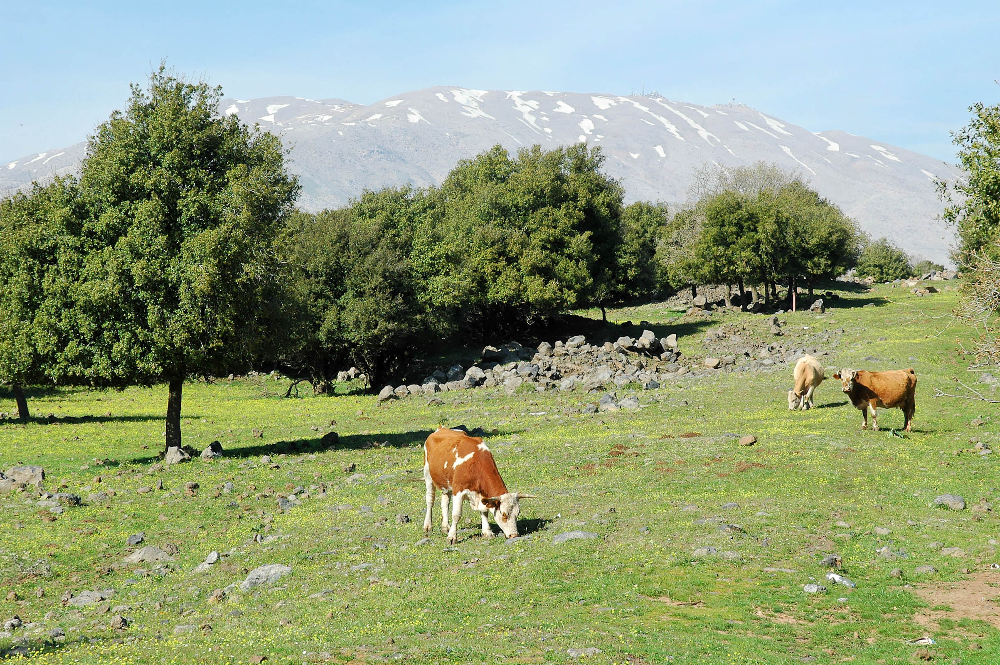
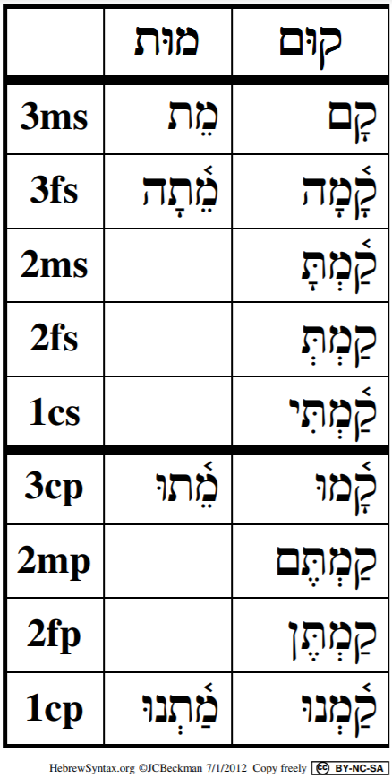

# Cover {.unnumbered}

Placeholder


<!--chapter:end:index.Rmd-->


# About This Course {-}

Placeholder


## Why an HLI Hebrew Grammar Course {- #motivation}
## How our course Is distinct {- #our_course}
## Relationship to _Hebrew Quest_ {- #hgq_and_hq}
## Completion of _Hebrew Quest_ is NOT a prerequisite! {- #finish_hq}

<!--chapter:end:00b-introduction.Rmd-->


# Getting Started / Getting Help {-}

Placeholder


## Navigating this book {- #navigating}
## A Typical Lesson {- #typical-lesson}
## Information Boxes {-}
## Quick Start Instructions {.unnumbered #get_started}
## Help with Anki {- #anki_help}
### Customize Anki Settings {- #anki_settings}
### How do I navigate within Anki? {-}
### How do I know when to hit the Good button on an Anki card? {-}
### How do I get help with Anki? {-}
## Course Resources {- #optional_resources}
## Report an Issue {- #report_issue}
## Ask a question {- #get_help}

<!--chapter:end:00d-help.Rmd-->

# (PART) Hebrew Grammar Foundations {-}

<!--chapter:end:01a-Part_I_header.Rmd-->


# The Hebrew Aleph-bet {#alephbet}

Placeholder


## First Thought {-}
### שֵׁם יְהוָה אֶקְרָא {-}
## The Hebrew Aleph-Bet {#consonants}
## Hebrew is written and read from RIGHT-to-LEFT {#right_to_left}
## Five "KiMNePaTZ" letters have different final forms {#sofit_letters}
## Six" BeGaD KePHaT" letters take a Daghesh Lene {#daghesh_lene}
## We classify four consonants as **Gutturals** (and one is a sometimes-guttural) {#gutturals}
## We classify ten consonants as "SQiN eM LeVY"
## Look out for look-alike Letters {#look-alike-letters}
## Sephardic and "Seminary" Pronunciation {#pronunciation}
## Lesson Conclusion and Activities {-}
### Anki {- #anki-1}
### Worksheets: Letter Writing {- #worksheets-1}
## Ruth Pursuit {-}
## Ruth Pursuit Translation Worksheet {-}
## Quest Quiz {-}

<!--chapter:end:01b-Alephbet.Rmd-->


# Hebrew Vowels {.vowels}

Placeholder


## First Thought {-}
###  הֵמָּה רָאוּ מַעֲשֵׂי יְהוָה {-}
## Vowels that are not vowel letters {#vowels}
### Vowels come in three types: Long, Short, Reduced | Vowels come in five classes: A, E, I, O, U {-}
## Vocal and Silent Sheva {#Sheva}
## Vowel letters {#vowel_letters}
### Vowel letters use a consonant plus a nikkud to form a vowel {-}
## Transliteration Shorthand
## "Defective" and "plene" spelling {#defective_spelling}
## The Dagesh Forte Doubles the Consonant {#dagesh_forte}
## Dagesh Forte Rule {#dagesh_forte_in_bgdkpt}
## Gutturals and Resh reject Dagesh Forte {#gutturals_reject_dagesh_forte}
## Lesson Conclusion and Activities {-}
### Anki {-}
### Vowel worksheet {-}
## Ruth Pursuit {-}
## Quest Quiz {-}
## Claim your `Twelve Tribes Badge`! {- #twelve-tribes-badge-1}

<!--chapter:end:02-Vowels.Rmd-->


# Syllabification and Pronunciation {#Syllabification}

Placeholder


## First Thought {-}
###  אַשְׁרֵי אָדָם לֹא יַחְשֹׁב יְהוָה לוֹ  {-}
## Hebrew Syllables {#syllables}
## Hebrew Word Accents {#accents}
## Tonic, Pretonic, and Propretonic Syllables
## Ultima, Penultima, and Antepenultima syllables
## Rules for Silent Sheva {#s_sheva}
### A Sheva is SILENT when the previous vowel is short: {-}
### A Sheva is SILENT when the first of two consecutive Shevas _within a word_: {-}
### A Sheva is SILENT when at the end of a word: {-}
## Rules for Vocal Sheva {#v_sheva}
### A Sheva is VOCAL when the initial Sheva in a word: {-}
### A Sheva is VOCAL when the second of two consecutive Shevas _within a word_<small>^[<small>A Sheva at the **end** of a word is **always silent**, even when it is the second of two consecutive Shevas.</small>]</small>:  {-}
### A Sheva is VOCAL when under a Dagesh Forte: {-}
### A Sheva is VOCAL after an unaccented long vowel: {-}
## Hebrew Diphthong = Accented Patach-Yod-Hireq {#diphthong}
## Vowels and Syllable Preference {#vowel_pref}
## Qamets Hatuf, Furtive Patach, Quiescent Aleph {#misc_vowels}
## Qamets Hatuf
## Furtive Patach 
## Quiescent Aleph
## Lesson Conclusion and Activities {-}
### Introduction to Video Warm-ups {-}
## Word Warm-up {-}
## Verses Warm-up {-}
## Ruth Pursuit {-}        
## Quest Quiz {-}
## Claim your `Unit 1 Completion Certificate`! {-}

<!--chapter:end:03-Syllabification.Rmd-->


# (PART) Nouns, Prepositions, Pronouns {-}
# Hebrew Nouns {.Nouns}

Placeholder


## First Thought {-}
### רְאֵה לִמַּדְתִּי אֶתְכֶם חֻקִּים וּמִשְׁפָּטִים {-}
## _Hebrew Quest_ Grammatical Gender Lecture
## Gender and Number {#gender_number}
## Parsing vs. Inflecting
## Singular Noun Endings {#sing_noun_endings}
## Plural Noun Endings {#noun_pluralization}
## Dual Noun Endings
## Special dual forms {#dual_forms}
## Irregular Pluralization  {#irregular_pluralization}
### Segholate Nouns follow a standard vowel pattern when pluralizing {-}
### Geminate Words take a Daghesh Forte {-}
## Rule of Sheva {#rules_sheva}
## Lexical Form {#lexical_form}
## Word Warm-up {-}
## Verses Warm-up {-}
## Anki {-}
## Ruth Pursuit {-}        
## Quest Quiz {-}

<!--chapter:end:04-NounsPlural.Rmd-->


# Definite Article and Conjunction Vav {.Article}

Placeholder


## First Thought {-}
### <span class="he">מִי־מָדַד בְּשָׁעֳלוֹ מַיִם וְשָׁמַיִם</span> {-}
## _Hebrew Quest_ Conjunction Lecture
## Translate the Vav Conjunction {#vav_translate}
## Identify the Vav Conjunction {#vav_identify}
## Loss of Dagesh Forte {#loss_Dagesh_forte}
## Compensatory Lengthening
## _Hebrew Quest_ Article Lecture
## Translate the Article {#article_translate}
## Identify the Article {#article_identify}
## Hebrew Indefiniteness {#indefiniteness}
## Other Hebrew Definiteness {#definiteness}
## Lesson Conclusion and Activities {-}
## Word Warm-up {-}
## Verses Warm-up {-}
## Anki {-}
## Ruth Pursuit {-}        
## Quest Quiz {-}
## Claim your next `Twelve Tribes Badge`! {-}

<!--chapter:end:05-DefArt_Conjunction.Rmd-->


# Hebrew Prepositions

Placeholder


## First Thought {-}
### <span class="he">  בְּיוֹם צָרָתִי אֲדֹנָי דָּרָשְׁתִּי </span> {-}
## _Hebrew Quest_ Prepositions Lecture
## Nun with Silent Sheva Becomes Dagesh Forte
## Independent and Maqqef prepositions 
## Inseparable prepositions
## The Article and Inseparable Prepositions
## The flexible <span class="he">מִן</span>: construction
## The Article and <span class="he">מִן</span>
## The flexible <span class="he">מִן</span>: meanings 
## The Definite Direct Object marker 
## _Hebrew Quest_ discussion of Genesis 1:1 
## Conclusion {-}
### Anki {-}
## Word Warm-up {-}
## Verses Warm-up {-}
## Ruth Pursuit {-}        
## Quest Quiz {-}

<!--chapter:end:06-Prepositions.Rmd-->


# Hebrew Adjectives

Placeholder


## First Thought {-}
### <span class="he">אֶת־הַכֹּל עָשָׂה יָפֶה בְעִתּוֹ</span> {-}
## _Hebrew Quest_ Adjectives Lecture
## Inflecting Adjectives
## Substantival Use
## Attributive Use
## Predicative Use
## Attributive, Predicative, and Substantival Comparison
## The Mappiq 
## The Directional Ending 
## Word Warm-up {-}
## Verses Warm-up {-}
## Anki {-}
## Ruth Pursuit {-}        
## Quest Quiz {-}
## Claim your next `Twelve Tribes Badge`! {-}

<!--chapter:end:07-Adjectives.Rmd-->


# Hebrew Pronouns

Placeholder


## First Thought {-}
### <span class="he">זֶה הַדֶּרֶךְ לְכוּ בוֹ</span> {-}
## _Hebrew Quest_ Independent Pronouns Lecture
## Independent Personal Pronoun Table
## Independent Personal Pronouns Discussion
## Relative Pronoun <span class="he">אֲשֶׁר</span>
## Interrogative Pronoun
## Interrogative Particle <span class="he">הֲ</span>
## Interrogative Particle vs Definite Article 
## _Hebrew Quest_ Demonstratives Lecture
## Near and Far Demonstratives
## Demonstrative Pronoun
## Demonstrative Adjective 
## Lesson 8 Conclusion {-}
## Word Warm-up {-}
## Verses Warm-up {-}
## Anki {-}
## Worksheets: Pronouns {-}
## Ruth Pursuit {-}        
## Quest Quiz {-}

<!--chapter:end:08-Pronouns.Rmd-->


# Hebrew Pronominal Suffixes

Placeholder


## First Thought {-}
### <span class="he">וַיֹּאמְרוּ שָׁאוֹל שָׁאַל־הָאִישׁ לָנוּ וּלְמוֹלַדְתֵּנוּ </span> {-}
## _Hebrew Quest_ Possessive Pronominal Suffixes Lecture
## _Hebrew Quest_ Pronominal Suffixes
## Possessive Pronominal Suffix Meaning
## Type 1 and Type 2 Suffixes
## Singular Suffixes
## Plural Suffixes
## Distinguish Type 1 from Type 2
## Identifying the Lexical Form with Type 1
## Identifying the Lexical Form with Type 2
## Unexpected changes
## Look-alike words: <span class="he">אֵת</span> as "with" or as Definite Direct Object (DDO) marker
## Look-alike words:   <span class="he">עִם</span>, "with", or <span class="he">עַם</span>, "people" 
## Look-alike words: <span class="he">אֵל</span>, "God", or <span class="he">אֶל</span>, "to"
## Word Warm-up {-}
## Word Warm-up: pronominal suffixes {-}
## Verses Warm-up {-}
## Anki {-}
## Worksheets: Pronominal Suffixes {-}
## Ruth Pursuit {-}        
## `Quest Quiz` {-}

<!--chapter:end:09-Pronominal_Suffixes.Rmd-->


# Hebrew Construct Chain {.ConstructChain}

Placeholder


## First Thought {-}
### <span class="he">בְּצֶדֶק כָּל־אִמְרֵי־פִי</span> {-}
## What is a Construct Chain?
## What makes a construct chain
## Review: what makes a word definite 
## The Absolute noun establishes the definiteness of a chain
## How to Recognize a Construct Chain
## Identifying Construct state by Noun Endings
## Construct Chain Summary
## Word Warm-up {-}
## Verses Warm-up {-}
## Anki {-}
## Worksheets: Construct Identification {-}
## Ruth Pursuit {-}        
## Quest Quiz #10 {-}
## Claim your next `Twelve Tribes Badge`! {-}

<!--chapter:end:10-ConstructChain.Rmd-->


# Hebrew Numerals

Placeholder


## First Thought {-}
## _Hebrew Quest_ Numerals Lecture
## The Biblical text always spells out numbers
## Notes and footnotes use symbols for numbers
## Hebrew Ordinal Numbers
### _Hebrew Quest_ Ordinal Numbers Video {-}
## Cardinal Numbers 1-10
### Digits 1 and 2 match the gender of the noun {-}
### Digits 3-10 take the opposite gender of the noun {-}
## Cardinal Numbers Above 10
## Conclusion
### Anki {-}
## Word Warm-up {-}
## Verses Warm-up` {-}
## Ruth Pursuit {-}        
## Claim your Unit 2 Completion Certificate! {-}

<!--chapter:end:11-Numerals.Rmd-->


# (PART) Qal Stem {-}
# Introduction to Unit 3 {-}

Placeholder


## Vowel Transliteration/Shorthand {-}
## Word Initial Combinations {-}
## Changes for Unit 3: No more quizzes! {-}
## Changes for Unit 3: Cantillation Marks added to Study Verses {-}
## Changes for Unit 3: OPTIONAL _Hebrew_ Quest Study Passage Translation {-}
## Lessons 13-16 are critical! {-}
## _Hebrew Quest_ Verb Summary Lecture

<!--chapter:end:11b-Unit3_Intro.Rmd-->


# Introduction to Hebrew Verbs

Placeholder


## First Thought {-}
### <span class="he">וְהֽוּא־הָלַ֤ךְ בַּמִּדְבָּר֙ דֶּ֣רֶךְ י֔וֹם </span> {-}
## _Hebrew Quest_ Verb Introduction Lecture
## A note on the paradigm strong verb <span class="he">קטל</span>
## The Verbal Root
## Inflecting and Parsing Review
## Person, Gender, Number
## Verb nomenclature
## Lexical form for Verbs
## Preformatives, Sufformatives, Prefixes, and Suffixes
## Verbal Vowels
## _Hebrew Quest_ Verb Stems Lecture
## The Seven Hebrew Verb Stems
## The Seven Stems: Summary Table
## Conjugation
## The Eight Basic Conjugations
## Finite vs. Non-Finite Conjugations
## Parsing
## Parsing Codes
## Strong and Weak Verbs
## Weak Verbs
## Weak Verb Classes {#weak-class}
## Weak Verbs Are Predictable
## Hebrew GRAMMAR Quest is a Quest for RECOGNITION, NOT RECALL
## Stem Comparison Table
## Word Warm-up {-}
## Verses Warm-up {-}
## Anki {-}
## Ruth Pursuit {-}        
## OPTIONAL _Hebrew Quest_ Study Passage Track: Proverbs Study #1-4 {-}

<!--chapter:end:12-Verbs_Intro.Rmd-->


# Qal Perfect - Strong Verbs {.QP-s}

Placeholder


## First Thought {-}
### <span class="he">לֹא־שָׁמְר֤וּ אֲבוֹתֵ֙ינוּ֙ אֶת־דְּבַ֣ר יְהוָ֔ה </span> {-}
## _Hebrew Quest_ Qal Perfect Lecture
##  Qal is Simple action, Active voice
## Perfect is completed action or a state as a whole
## Components of the Qal Perfect Strong Paradigm
## The Perfect Sufformatives
## Qal Perfect Vowels: $V_1$ is almost always Qamets
## Qal Perfect Strong $Pre =$ <span class="he">קָ</span>
## Qal Perfect Strong $V_S = A$
## Each Stem will have a $V_S$ FORMULA
## $V_S$ is accented in Finite verbs
## A Sheva precedes a Finite Sufformative
## Building the Qal Perfect Strong Paradigm
## Qal Perfect Strong with Audio
## Worksheet: Qal Perfect Strong Paradigm {-}
## Qal Perfect Strong Examples
## Deviations from the Paradigm
## 3נ and 3ת Verbs
## Stative Verbs MAY have a different $V_S$
## Word Warm-up {-}
## Verses Warm-up {-}
## Anki {-}
## Ruth Pursuit {-}        
## Claim your next `Twelve Tribes Badge`! {-}
## OPTIONAL _Hebrew Quest_ Study Passage: Proverbs #5-7 {-}

<!--chapter:end:13-Qal_Perfect_Strong.Rmd-->

# Qal Perfect - Weak Verbs {.QP-w}

In the Bible, weak verbs are much more common than strong verbs.

A weak verb is defined as one with one or more letters that cause the word to deviate from the strong verb pattern.  

Many Hebrew grammar textbooks asked students to memorize all of the differences in each stem and conjugation.  Fortunately, there is an easier way.  

We can simply study the changes caused by weak letters. These changes then become clues we can use to uncover the applicable strong verb pattern.  This will enable us to correctly determine a weak verb's stem and conjugation to translate it accurately.


::: {.box .map}
<span class="he">LESSON ITINERARY<span class="he">

1. 3נ and 3ת assimilate
1. 1G, 2G reject Vocal Sheva
1. 2fs form of 3ע/ח is irregular
1. 3א usually quiesces
1. $R_3$ in 3ה is a vowel, not a consonant
1. Geminate and Biconsonantal often have only two root letters visible
1. Clues for your Qal Perfect Quest
:::

::: {.box .stop}
EQUIPMENT CHECK

Before continuing, can you describe the following concepts?

* You must have the Qal Perfect Strong Paradigm memorized!
:::

##  First Thought {-}

### <span class="he">בָ֤אָה נַחֲלָתֵ֙נוּ֙ אֵלֵ֔ינוּ מֵעֵ֥בֶר הַיַּרְדֵּ֖ן מִזְרָֽחָה׃</span> {-}

*our inheritance has fallen to us on this side of the Jordan toward the east (Numbers 32:19)*

Numbers 32 begins, "The Reubenites and Gadites, who had very large herds and flocks, saw that the lands of Jazer and Gilead were suitable for livestock."  They followed their eyes, which saw profit. They took the easy path, which caused tension between the tribes. Students of history know that these lands to the east were often easily invaded. The lesson for us is to make sure we are seeking what the Lord wants for us and not our own desires.

<figure>
    <figcaption>Listen to the verse in Hebrew:</figcaption>
    <audio
        controls controlsList="nodownload"
        src="./images/14-03-Num.mp3">
            Your browser does not support the
            <code>audio</code> element.
    </audio>
</figure>


```r

```

<div class="figure" style="text-align: center">

<p class="caption">(\#fig:unnamed-chunk-1)Cows of Bashan with Mount Hermon. Courtesy of the [Pictorial Library of Bible Lands](https://www.bibleplaces.com)</p>
</div>


## Introduction and Review

* Strong verbs follow the קטל strong-verb paradigm
    * The literal meaning of קטל is not material to our study
    * Like a math formula, these three letters are placeholders represent any verbal root containing three strong letters
* A weak letter behaves differently in some fashion
    * It could reject a dagesh forte, prefer a different vowel, or disappear entirely under certain situations
* A weak verb is a verbal root with one or more weak letters
* It is possible for a verb may be strong in one conjugation but weak in another
    * For example, Resh is only a weak letter in verbs that try to put a Daghesh Forte in it
    * The Qal stem does not require a Dagesh Forte in any form, therefore verbs with Resh are not weak in Qal
    * In Unit 4, we will learn the Piel stem requires a Daghesh Forte in $R_2$; therefore, a verb with a Resh (or any guttural) in $R_2$ is a weak verb in the Piel
* Weak verbs are classified by their problematic root letter 
    * [Refer to Lesson 12](#weak-class) for a review of weak verb classes


## 3נ and 3ת with Silent Sheva Assimilate to Dagesh

* A Tav with a Sheva assimilates to another Tav only
    * It becomes a Dagesh Forte in the following Tav
    * This occurs in all Qal Perfect 2nd person forms as well as 1cs
    * NOT <span class="he">כָּרַתְתָּ</span>*, BUT <span class="he">כָּרַתָּ</span>
* A Nun with a Silent Sheva assimilates to anything
    * It becomes a Daghesh Forte in the next letter
    * This occurs in all Qal Perfect 1st and 2nd Person forms
        * NOT <span class="he">נַתַ֫נְתָּ</span>*, BUT <span class="he">נַתַ֫תָּ</span> 
        * NOT <span class="he">נָתַנְנוּ</span>*, BUT <span class="he">נַתַ֫נּוֹ</span>
* The Dagesh 2MS ending is usually a Lene, but each becomes a Forte (Why?<small>^[<small>A Daghesh is a Forte if it is preceded by a vowel that is not a Sheva.</small>]</small>)

::: {.box .info}
DAGESH FORTE

* The Dagesh Forte is your clue that something is different
* Often, it replaces a missing letter

:::

## Review of Guttural Principles

* Gutturals and Resh reject Dagesh Forte, often resulting in compensatory Lengthening:
    * From <span class="he">ִ</span> TO <span class="he">ֵ</span>
    * From <span class="he">ַ</span> TO <span class="he">ָ</span>
    * From <span class="he">ֻ</span> TO <span class="he">ֹ</span>
* Gutturals Take Hateph Vowels instead of Vocal Sheva
    * Usually Hateph Patach, sometimes Hateph Seghol, rarely Hateph Qamets Hatuf
    * This can affect the preceding vowel, as well as the vowel associated with the guttural:
        * NOT <span class="he">עְמַדְתֶּם</span>*, BUT <span class="he">עֲמַדְתֶּם</span>
* Gutturals prefer Patach
    * NOT <span class="he">יִשְׁלֹח</span>*, BUT <span class="he">יִשְׁלַח</span>   

## 1G, 2G

* The Guttural will take Hateph Patach instead of Vocal Sheva
* 1G - affects QP2mp and QP2fs
    * NOT <span class="he">עְמַדְתֶּם</span>*, BUT <span class="he">עֲמַדְתֶּם</span>
    * Otherwise, $V_1 = \bar A$ as is diagnostic of the QP conjugation
* 2G - affects QP3fs, QP2fs, QP3cp
    * NOT <span class="he">בָּחְרוּ</span>*, BUT <span class="he">בָּהֲרוּ</span>
    * In 2G, $V_1 = \bar A$ (unless reduced in 2mp/2fp) as is diagnostic of the QP conjugation

::: {.box .light}
To get back to the strong verb paradigm, substitute Sheva for the Hateph vowels
::::

    
## 3-ע/ח

* Because different $R_3$ gutturals behave in different ways, we are unable to simply say "third guttural"
    * 3 ע/ח is discussed below
    * א 3 and 3 ה will be discussed in separate sections
* 3 ע/ח: We said earlier that the Gutturals reject VOCAL Sheva, but the Sheva in the 2nd (except 2fs) and 1st person forms is SILENT, so it stays
    * <span class="he">שָׁמַ֫עְתָּ</span>
* For reasons scholars don't fully understand, the 2fs form is irregular        
    * The  3rd ע or ח takes a Patach instead of a Sheva:
        * <span class="he">שָׁמַ֫עַתְּ</span>
    * The Dagesh is a LENE despite the preceding vowel
    * It is not necessary to memorize this oddity
* In all 3G, $V_1 = \bar A$ (unless reduced in 2mp/2fp) as is diagnostic of the QP conjugation - in other words, no matter what happens to $V_S$, you will usually be able to diagnose Qal Perfect by the regular Qamets in $V_1$

    
## א3 

* Aleph quiesces with Silent Sheva
    * Occasionally, it also quiesces with Hateph vowels (i.e., Vocal Sheva)
    * Usually, there is Compensatory Lengthening (CL)
    * $V_2 = \bar A$ (Qamets) unless reduced by the perfect sufformative
    * QP2ms: NOT <span class="he">מָצַ֫אְתָּ</span>*, BUT <span class="he">מָצָ֫אתָּ</span>
    * QP3ms, the Aleph is already quiescent (CL): NOT <span class="he">מָצַא</span>*, BUT <span class="he">מָצָא</span>
    * בגד כפת have Dagesh Lene only if not after a vowel
        * In other words, the Quiescent Aleph is ignored
        * Note how the 2fs forms drop the Dagesh Lene and final Silent Sheva if a vowel is before the בגד כפת:
        * NOT <span class="he">מָצַאְתְּ</span>*, BUT <span class="he">מָצָאת</span>
* As mentioned, in 3G, $V_1 = \bar A$ (unless reduced in 2mp/2fp) as is diagnostic of the QP conjugation - (are you beginning to see the pattern?)

## <span class="he">יָרֵא</span> is 3א AND Tsere Stative

* $V_S = \bar E$ unless reduced (P3fs, P3cp)
* Most Tsere statives have $\bar E$ only in the 3ms - ירא is irregular


## 3ה  

* 3ה verbs are in a unique class
* $R_3$ is not a consonant; in fact, there is no $R_3$ consonant
* 3ה verbs only have two root consonants, $R_1$ and $R_2$ - the final slot is taken up by the vowel letter <span class="he">ה ָ</span>

::: {.box .light}
Historically, third ה verbs used to be 3-י.  In some conjugations, the Yod "reappears."
:::

* $V_2$ of 3ה verbs follow a unique pattern:
    * IF there is no sufformative THEN add the vowel <span class="he">ה ָ</span> in the Perfect
    * IF the sufformative starts with a vowel, THEN the vowel of the sufformative is $V_2$
    * IF the sufformative starts with a consonant, THEN $V_2$ is <vowel>+Yod
        * The specific <vowel> depends on the stem - for the QP $V_2 = \hat I$ (Hireq+Yod)
* Additionally, to avoid ambiguity with the P3ms, the P3fs sufformative becomes <span class="he">תָה</span>
* With all these changes, the  $V_1 = \bar A$ (unless reduced in 2mp/2fp) diagnostic of QP does not change
    
## Doubly Weak

* Doubly weak verbs have two (or all three<small>^[<small>Even those verbs with three weak letters are still referred to as 'doubly weak'</small>]</small>) weak letters
* Most frequently, it will be a 3ה verb with a 1G or 2G
* These verbs have an additional step to scavenger hunt our way back to the Strong Verb Paradigm
* We simply need to combine the 1G/2G aspects of the Hateph vowel instead of a Sheva with the 3ה endings we studied in the previous section

## <span class="he">הָיָה</span>

* This is a very common verb meaning "to be"
* As you can see, it is both 1G and 3ה
* It follows the 3ה endings we discussed above
* $V_1$ is <span class="he">הֱ</span> in 2mp and 2fp
    * <span class="he">הֱיִיתֶם</span> and <span class="he">הֱיִיתֵן</span>
    * The first Yod is $R_2$
    * The second is $V_2 = \hat I$ (Hireq Yod)

## Geminate

* In Geminate verbs, $R_3 = $R_2$
* No Hebrew words have $R_1 = R_2$ - this will prove to be important later in the course
* Frequently, $R_2$ assimilates into its twin $R_3$
    * $R_3$ will then take a Dagesh Forte, unless it is the final consonant in a word
    * 3rd person forms will have both
        * <span class="he">סַב</span> or <span class="he">סָבַב</span>
    * When there is assimilation, the accent tries to shift to $V_1$ since that is the new Stem Vowel
        * The accent must be on the last two syllables
        * The heavy sufformatives (2mp and 2fp) continue to take the accent
    * $V_2 = \hat O$ before sufformative that starts with a consonant
* Review the table below, noting $V_1$ and accent changes:


| PGN | Gem | Strong
| :- | :- | :-
3ms | <span class="he">סָבַב</span> | <span class="he">קָטַל</span>
3fs
| <span class="he">סָֽבְבָה</span> | <span class="he">קָֽטְלָה</span>
2ms | <span class="he">סַבּ֫וֹתָ</span> | <span class="he">קָטַ֫לְתָּ</span>
2fs | <span class="he">סַבּוֹת</span> | <span class="he">קָטַלְתְּ</span>
1cs | <span class="he">סַבּ֫וֹתִי</span> | <span class="he">קָטַ֫לְתִּי</span>
3cp | <span class="he">סָֽבְבוּ</span> | <span class="he">קָֽטְלוּ</span>
2mp | <span class="he">סַבּוֹתֶם</span> | <span class="he">קְטַלְתֶּם</span>
2fp | <span class="he">סַבָּוֹתֶן</span> | <span class="he">קְטַלְתֶּן</span>
1cp | <span class="he">סַבּ֫וֹנוּ</span> | <span class="he">קָטַ֫לְנוּ</span>


::: {.box .map}
Geminate verbs are relatively infrequent, so the changes in the table above needn't distract you from your verb parsing quest!
:::

You will learn the major geminate verbs in your vocabulary. To start with, here are a few of the most common:

* <span class="he">סָבַב</span>, to surround
    * Also see QP3ms as <span class="he">סַב</span>
* <span class="he">שָׁלַל</span>, to plunder
* <span class="he">אָרַר</span>, to curse
    * Resh rejects = Compensatory Lengthening
    * <span class="he">אָר֫וֹתִי</span> = QP1cs
    * In the table above, note how $V_1 = A$, but in אָר֫וֹתִי, $V_1 = \bar A$
* <span class="he">תָמַם</span>, to finish
    * The first מ will assimilate into a Dagesh Forte (except QP3ms)
    * <span class="he">תַּ֫מּוּ</span> = QP3cp


## Biconsonantal

* Biconsonantal have two root consonants, $R_1$ and $R_3$
* What appears to be $R_2$ is actually an unchangeable long vowel, Holem+Vav, Shuruq, or Hireq+Yod
    * This vowel is called the __LEXICAL VOWEL__
    * It will be important to memorize the Lexical Vowel
        * For example, NOT <span class="he">קִים</span>*, NOT <span class="he">קוֹם</span>*, BUT <span class="he">קוּם</span>
    * The word with the Lexical Vowel is the Lexical Form (the version that is in the dictionary)
    * This is an exception to the QP3ms = Lexical Form guideline
* $V_S$ and its accent move to $V_1$ and do not reduce
    * $V_S$ lengthens in 3rd person
    
Review the table below, noting $V_1$ and accent changes:


| PGN | קוּם  | Strong
| :- | :- | :-
3ms | <span class="he">קָם</span> | <span class="he">קָטַל</span>
3fs
| <span class="he">קָ֫מָה</span> | <span class="he"></span>
2ms | <span class="he">קַ֫מְתָּ</span> | <span class="he">קָטַ֫לְתָּ</span>
2fs | <span class="he">קַמְתְּ</span> | <span class="he">קָטַלְתְּ</span>
1cs | <span class="he">קַ֫מְתִּי</span> | <span class="he">קָטַ֫לְתִּי</span>
3cp | <span class="he">קָ֫מוּ</span> | <span class="he">קָֽטְלוּ</span>
2mp | <span class="he">קַמְתֶּם</span> | <span class="he">קְטַלְתֶּם</span>
2fp | <span class="he">קַמְתֶּן</span> | <span class="he">קְטַלְתֶּן</span>
1cp | <span class="he">קַ֫מְנוּ</span> | <span class="he">קָטַ֫לְנוּ</span>


## <span class="he">מוּת</span> is Biconsonantal and Stative

* Recognize Biconsonantal by the accent and missing root consonant
* $V_S$ and accent moved to $V_1$
* Tsere stem vowel in 3rd person
* In the perfect, only occurs in 3rd person and 1cp
* Compare <span class="he">מוּת</span> and <span class="he">קוּם</span> in the table below:

```r

```

<div class="figure" style="text-align: center">

<p class="caption">(\#fig:unnamed-chunk-2)Qal Perfect: <U+05DE><U+05D5><U+05BC><U+05EA>/<U+05E7><U+05D5><U+05BC><U+05DD> Paradigms</p>
</div>

| PGN | קוּם  | מוֹת
| :- | :- | :-
3ms | <span class="he">קָם</span> | <span class="he">קָטַל</span>
3fs
| <span class="he">קָ֫מָה</span> | <span class="he"></span>
2ms | <span class="he">קַ֫מְתָּ</span> | <span class="he">קָטַ֫לְתָּ</span>
2fs | <span class="he">קַמְתְּ</span> | <span class="he">קָטַלְתְּ</span>
1cs | <span class="he">קַ֫מְתִּי</span> | <span class="he">קָטַ֫לְתִּי</span>
3cp | <span class="he">קָ֫מוּ</span> | <span class="he">קָֽטְלוּ</span>
2mp | <span class="he">קַמְתֶּם</span> | <span class="he">קְטַלְתֶּם</span>
2fp | <span class="he">קַמְתֶּן</span> | <span class="he">קְטַלְתֶּן</span>
1cp | <span class="he">קַ֫מְנוּ</span> | <span class="he">קָטַ֫לְנוּ</span>

## Qal Perfect Quest Clues

1. No preformative
2. Perfect sufformative
3. $V_1 \bar A$ (Qamets)
    * Reduced if 2mp/2fp
    * $A$ (Patach) if Biconsonantal or Geminate 1st or 2nd Person
    * (_reduced if pronominal suffix - Lesson 19_)
    
## Clues for Qal Perfect Special Situations

::: {.box .map}
Commit the 3ה clues to memory.  Geminate and Biconsonantal are much less frequent.
:::

* Missing a Root Consonant?
    * If $V_1$ is accented, it is biconsonantal or geminate
    * 1st or 2nd person: look at the vowel before the sufformative
        * <span class="he">י ִ</span> = 3ה
        * <span class="he">וֹ ּ </span> = GEMINATE
        * <span class="he">ְ </span> = BICONSONANTAL
        * <span class="he">תּ ַ </span> (where Tav is the sufformative) = 3נ/ת
        * <span class="he">נּוּ ַ </span> in the 1cp = 3נ
    * 3rd Person
        * Dagesh Forte in what looks like $R_2$ = GEMINATE
        * $V_1$ is accented and no Dagesh in $R_2$ = BICONSONANTAL
        * $V_2$ accented as usual = 3ה

## Word Warm-up {-}

[Click to open `Word Warm-up` video in a new tab](https://youtu.be/eoDmrjNixN4){target="_blank"}


<div class="container">
<iframe class="responsive-iframe" src="https://youtube.com/embed/eoDmrjNixN4" frameborder="0"></iframe>
</div>


## Verses Warm-up {-}

[Click to open `Verses Warm-up` video in a new tab](https://youtu.be/8MouGMH5bCQ){target="_blank"}

<div class="container">
<iframe class="responsive-iframe" src="https://youtube.com/embed/8MouGMH5bCQ" frameborder="0"></iframe>
</div>

## Anki {-}

* `Lesson 14 A. Vocab`
* `Lesson 14 B. Grammar` 
* `Lesson 14 C. Workbook`
* `Lesson 14 D. Study Verses`

> unless there is something unique to point out, we will omit the Anki section from the Hebrew GRAMMAR Quest Guidebook going foward. You know the drill!  Be sure to do the four Anki levels after each Lesson.

## Ruth Pursuit {-}    

::: {.box .map} 
YOUR QUEST

Identify and translate the Qal Perfect Weak Verbs below.  All verbal roots are vocabulary words from Lesson 12 or Lesson 14.

1. שׁמע QP3fs
2. היה QP3fs
3. עשה QP2mp
4. אמר QP1cs
5. יצא QP3fs - why is this verb 3fs?
6. שׁוּב QP3fs X2
7. הלך QP1cs
8. ענה QP3ms
9  בוֹא QP3cp

:::

* [Blank copy of Ruth 1](https://docs.google.com/document/d/1bcT1J-fcVmD1Zn5Jk2nj0560tEddcgtbYZLkwaVVuyE/copy){target="_blank"}
* [Ruth Pursuit Answer Key #14](./images/14_Ruth_Pursuit_KEY.pdf){target="_blank"}


## OPTIONAL _Hebrew Quest_ Study Passage: Proverbs #8-10 {-}


::: {.box .map}
YOUR HEBREW QUEST:

1. BEFORE WATCHING THE VIDEO, read through the passage on your own straight through one time - pick up as much as you can. [Blank copy of the Proverbs studied in sessions 5-7.](https://docs.google.com/document/d/15D5W-prZoVTGEFa9QzuBCnfW4kQnwXT4TBNYNPhcRW8/copy){target="_blank"}
2. Now re-read the passage critically
    1. Highlight any words you do not know and look them up in a [lexicon](https://holylanguage.com/resources-dictionaries.php){target="_blank"}
    2. Sketch out a translation - there is a blank line between each verse
3. Now, using your marked-up copy of the passage, watch Izzy's _Hebrew Quest_ videos (video opens in a new tab)
    1. [Proverbs #8](https://holylanguage.com/proverbs-8.php){target="_blank"}
    1. [Proverbs #9](https://holylanguage.com/proverbs-9.php){target="_blank"}
    1. [Proverbs #10](https://holylanguage.com/proverbs-10.php){target="_blank"}
4. After the video, assess your translation.  How close was it?
5. How did the Ruach HaQodesh speak to you through the passage?

:::

<!--chapter:end:14-Qal_Perfect_Weak.Rmd-->


# Qal Imperfect - Strong Verbs {.QI-s}

Placeholder


## First Thought {-}
### <span class="he">יִ֝שְׁמֹ֗ר כָּל־אָרְחֹתָֽי׃ </span> {-}
## _Hebrew Quest_ Qal Imperfect Lecture
## Translating the Imperfect
## The Imperfect Always has a Preformative
## Qal Imperfect Vowels
## Imperfect Sufformatives
## Building the Qal Imperfect Strong Paradigm
## Hearing the Qal Imperfect Strong Paradigm
## Worksheets: Qal Imperfect Strong Paradigm {-}
## Qal Imperfect Strong Examples
## Deviations from the Paradigm
## Translating Negative Commands
## Word Warm-up {-}
## Verses Warm-up {-}
## Worksheets: Qal Imperfect Strong Paradigm {-}
## Ruth Pursuit {-}   
## OPTIONAL _Hebrew Quest_ Study Passage: Proverbs #11-14 {-}

<!--chapter:end:15-Qal_Imperfect_strong.Rmd-->


# Qal Imperfect Weak {.QI-w}

Placeholder


## First Thought {-}
### <span class="he">וְעֵינֵיכֶ֖ם תִּרְאֶ֑ינָה</span> {-}
## Our Quest
## 2G 
## 3חע
## 3א  
## 3ה 
## 1G
## 1א "Angry Baker"
## Geminate
## Biconsonantal
## 1-Yod 
## הלך 
## <span class="he">יכל</span> takes $V_P = \bar U$
## 1נ Assimilates with Silent Sheva
## לקח
## Doubly Weak
## נתן is 1נ and 3נ
## ראה vs. ירא
## Qal Imperfect Weak Summary
## Word Warm-up {-}
## Verses Warm-up {-}
## Ruth Pursuit {-}   
## Claim your next `Twelve Tribes Badge`! {-}
## OPTIONAL _Hebrew Quest_ Study Passage: Proverbs #15-17 {-}

<!--chapter:end:16-Qal_Imperfect_Weak.Rmd-->


# Vav Consecutive {.wc}

Placeholder


## First Thought {-}
### <span class="he">וַיַּשְׁכִּ֣מוּ בַבֹּ֔קֶר וַיַּֽעֲל֥וּ אֶל־רֹאשׁ־הָהָ֖ר </span> {-}
## _Hebrew Quest_ Qal Vav Consecutive Lecture
## Review of the Conjunction Vav
## Perfect + וְ: Spelling
## Perfect + וְ: Translating
## Imperfect + וְ: Spelling
## Imperfect with Vav often indicates purpose
## Imperfect Waw Consecutive: Spelling (Strong)
## Imperfect Waw Consecutive: Spelling (Weak)
## Imperfect Waw Consecutive: Translation
### Usually translate Iwc as PAST TENSE {-}
## Summary
## Word Warm-up {-}
## Verses Warm-up {-}
## Worksheets: Qal Vav-Consecutive Paradigms {-}
## Ruth Pursuit {-}   
## OPTIONAL _Hebrew Quest_ Study Passage: Genesis 1:1-5 {-}

<!--chapter:end:17-Vav_Consecutive.Rmd-->


# Qal Imperative {.QM}

Placeholder


## First Thought {-}
### <span class="he">וְעַתָּ֣ה יִשְׂרָאֵ֗ל שְׁמַ֤ע אֶל־הַֽחֻקִּים֙ וְאֶל־הַמִּשְׁפָּטִ֔ים אֲשֶׁ֧ר אָֽנֹכִ֛י מְלַמֵּ֥ד אֶתְכֶ֖ם לַעֲשׂ֑וֹת</span> {-}
## _Hebrew Quest_ Qal Imperative Lecture
## Volitional Forms Introduction
## Negative Commands use the Jussive or the Imperfect
## The Imperative is the Imperfect withoug the Imperfect Preformative
## Identifying QM
## <span class="he">נָה</span> can follow volitional verbs
## Distinguishing QM2ms, QI3ms, and QP3ms
## Paragogic ה 
## 3ה Verbs
## 1נ and 1י
## Biconsonantal and Geminate
## QP3ms and QP2ms
## QP3mp and QP2mp
## Cohortative and Jussive
## Some weak verbs often shorten the Jussive singular
## Word Warm-up {-}
## Verses Warm-up {-}
## Worksheets: Qal Volitional Forms {-}
## Ruth Pursuit {-}   
## OPTIONAL _Hebrew Quest_ Study Passage: The Shema {-}

<!--chapter:end:18-Qal_Imperative_strong.Rmd-->


# Pronominal Suffixes on Verbs {.VerbSuffix}

Placeholder


##  First Thought {-}
### <span class="he">אֲנִֽי־קְרָאתִ֣יךָ כִֽי־תַעֲנֵ֣נִי אֵ֑ל הַֽט־אָזְנְךָ֥ לִ֝֗י שְׁמַ֣ע אִמְרָתִֽי׃</span> {-}
## _Hebrew Quest_ Pronominal Suffixes
## Hebrew Direct Object Pronouns
## Verbs use Type 1 Suffixes
## QP Vowel Changes
## QI Vowel Changes 
## QM Vowel Changes
## Imperative/Perfect Ambiguity when normal Imperative $V_S = A$
## Word Warm-up {-}
## Verses Warm-up {-}
## Ruth Pursuit {-}        
## Claim your next `Twelve Tribes Badge`! {-}
## OPTIONAL _Hebrew Quest_ Study Passage: Matthew 6 {-}

<!--chapter:end:19-Pronominal_Suffix_Verbs.Rmd-->


# Qal Infinitive Construct {.Qinfinitive}

Placeholder


## First Thought {-}
###  <span class="he">וְשָׁ֣מַרְתָּ֔ אֶת־מִצְוֺ֖ת יְהוָ֣ה אֱלֹהֶ֑יךָ לָלֶ֥כֶת בִּדְרָכָ֖יו וּלְיִרְאָ֥ה אֹתֽוֹ׃</span> {-}
## _Hebrew Quest_ Qal Infinitves Lecture
## Two types of Infinitives
## Q∞ Spelling
## 3ה Endings
## 1י and 1נ Spelling
## Biconsonantal
## Q∞ often is identical to QM2ms
## ∞ take Type 1 Pronominal Suffixes
## Most ∞ have a prefixed preposition
## Meaning of ∞
## Negating the Infinitive
## Word Warm-up {-}
## Verses Warm-up {-}
## Ruth Pursuit {-}   
## OPTIONAL _Hebrew Quest_ Study Passage: Genesis 22:1-19 {-}

<!--chapter:end:20-Qal_Infinitive_Construct.Rmd-->


# Qal Infinitive Absolute {.QA}

Placeholder


## First Thought {-}
### <span class="he">אָנֹכִ֗י אֵרֵ֤ד עִמְּךָ֙ מִצְרַ֔יְמָה וְאָנֹכִ֖י אַֽעַלְךָ֣ גַם־עָלֹ֑ה</span> {-}
## _Hebrew Quest_ Qal Infinitves Lecture
## QA
## 3ה endings
## Meaning of Infinitive Absolute
## Infinitive Construct vs Infinitive Absolute
## **יֵשׁ *** and **אֵין *** 
## Word Warm-up {-}
## Verses Warm-up {-}
## Ruth Pursuit {-}   
## OPTIONAL _Hebrew Quest_ Study Passage: Aaronic/Priestly Blessing {-}

<!--chapter:end:21-Qal_Infinitive_Absolute.Rmd-->


# Qal Participle {.QPt}

Placeholder


##  First Thought {-}
###  <span class="he">וְיִבְטְח֣וּ בְ֭ךָ יוֹדְעֵ֣י שְׁמֶ֑ךָ כִּ֤י לֹֽא־עָזַ֖בְתָּ דֹרְשֶׁ֣יךָ יְהוָֽה׃ </span> {-}
## _Hebrew Quest_ Qal Participles Lecture
## Participles are Verbal Adjectives
## Qal Participle
## Prefixes and Suffixes
## Biconsonantal 
## 3ה were originally 3י
### We can now complete our 3ה $V_2$ table {-}
## Stem Comparison Table
## _Hebrew Quest_ Qal Summary Lecture
## Word Warm-up {-}
## Verses Warm-up {-}
## Worksheets: All Qal Paradigms {-}
## Ruth Pursuit {-}        
## Claim your next `Twelve Tribes Badge`! {-}
## OPTIONAL _Hebrew Quest_ Study Passage: Matthew 13 {-}

<!--chapter:end:22-Qal_Participle.Rmd-->


# Hebrew Syntax {.Syntax}

Placeholder


## First Thought {-}
### <span class="he">עַתָּה יָדַעְתִּי כִּי־גָדוֹל יְהוָה מִכָּל־הָאֱלֹהִים</span> {-}
## Clause versus Sentence
## Word order
## Perfect Syntax
## Imperfect Syntax
## Volitional Syntax
## Conditional Phrases
## Disjunctive Vav
## Adverbs
## Word Warm-up {-}
## Verses Warm-up {-}
## Ruth Pursuit {-}        
## Claim your Unit 3 Completion Certificate! {-}
## OPTIONAL _Hebrew Quest_ Study Passage: Psalm 19 {-}

<!--chapter:end:23-Hebrew_Syntax.Rmd-->


# (PART) Derived Binyanim {-}
# Introduction to Unit 4 {-}

Placeholder


## Lessons 24-35 {-}
## Ruth Pursuits {-}
## Review: Vowel and Consonant Shorthand
## Review: Stem Vowel is the Vowel with the 2nd Root Consonant
## Stem Vowel Pattern Nomenclature
## Review: Sheva before Finite Verb Endings

<!--chapter:end:23b-Unit4_Intro.Rmd-->


# The Niphal Stem - Strong Verbs

Placeholder


## First Thought {-}
### <span class="he"> וּמִן־הַגָּדִ֡י נִבְדְּל֣וּ אֶל־דָּוִיד֩ לַמְצַ֨ד מִדְבָּ֜רָה</span> {-}
## Niphal Verb Stem Table
## Niphal Meanings
## Parsing Clues - _Pre_:  the נ prefix is added to EVERY conjugation
## Parsing Clues - $V_S = A \sim \bar E(A)$
## What to memorize for all Derived Stems {-}
## What to memorize for Niphal 
## Paradigm: Niphal Perfect Strong
## Paradigm: Niphal Imperfect Strong
## Paradigm: Niphal Imperative Strong
## Paradigm: Niphal Infinitives Strong
### Derived Stem Infinitive Absolute $V_S = \bar E$ (usually) {-}
## Paradigm: Niphal Participle Strong
### Derived Stem Participle $V_S =$ the P3ms Vowel, lengthened if possible (usually) {-}
## Participle Prefixes in the Derived Stems
## Forms with Identical Spelling
## Easily Confused Forms
## Niphal Parsing Examples
## Stem Comparison Table
## Word Warm-up {-}
## Verses Warm-up {-}
## Worksheets: Niphal Strong Paradigm {-}
## Optional _Hebrew Quest_ Study Passage: Numbers 15 {-}

<!--chapter:end:24-Niphal_Strong.Rmd-->


# The Niphal Stem - Weak Verbs {.N-w}

Placeholder


## First Thought {-}
###  <span class="he">וְקָרְא֥וּ לָהֶ֛ם עַם־הַקֹּ֖דֶשׁ גְּאוּלֵ֣י יְהוָ֑ה וְלָךְ֙ יִקָּרֵ֣א דְרוּשָׁ֔ה עִ֖יר לֹ֥א נֶעֱזָֽבָה׃</span> {-}
## A weak consonant affects the vowels that touch it
## 1-Guttural 
## 1-Yod
## 1-Nun with Silent Sheva Assimilates
## 3-Aleph Changes $V_S$
## 3-Hei Verbs Follow the same general principles
## What to Memorize for Niphal Weak
## Top 10 Niphal Verbs 
## Word Warm-up {-}
## Verses Warm-up {-}
## Ruth Pursuit {-}        
## Claim your next `Twelve Tribes Badge`! {-}
## OPTIONAL _Hebrew Quest_ Study Passage: John 1 {-}

<!--chapter:end:25-Niphal_Weak.Rmd-->


# The Piel Stem - Strong Verbs {.D-s}

Placeholder


## First Thought {-}
### <span class="he">בִּשְׂפָתַ֥י סִפַּ֑רְתִּי כֹּ֝֗ל מִשְׁפְּטֵי־פִֽיךָ׃</span> {-}
## Piel Verb Stem Table 
## Piel Meanings
## Piel is the D stem because $R_2$ takes a Doubling Dagesh Forte
## Memorize piēl - paēl
## Pay attention when $R_2$ is a SQiN eM LeVY consonant
## Piel: what to memorize
## Piel Perfect Strong
## Piel Imperative Strong
## Piel Infinitives Strong
## Piel Participle Strong
### Participle Prefixes in the Derived Stems {-}
## Piel Parsing Examples
## Stem Comparison Table
## Word Warm-up {-}
## Verses Warm-up {-}
## Worksheets: Piel Strong Paradigms {-}
## Ruth Pursuit Analysis
## OPTIONAL _Hebrew Quest_ Study Passage: Exodus 31 {-}

<!--chapter:end:26-Piel_Strong.Rmd-->


# The Piel Stem - Weak Verbs {.D-w}

Placeholder


## First Thought {-}
### <span class="he">בֹּ֤אוּ שְׁעָרָ֨יו ׀ בְּתוֹדָ֗ה חֲצֵרֹתָ֥יו בִּתְהִלָּ֑ה הֽוֹדוּ־ל֝֗וֹ בָּרֲכ֥וּ שְׁמֽוֹ׃</span> {-}
## 3-Guttural
## 2-Aleph/Resh often cause DP $V_1 = \bar E$ and $V_1 = \bar A$ in all other forms
## 1-Nun
## Biconsonantal: the Polel minor stem
## Geminate
## Other weak $R_1$ forms
## What to Memorize for Piel Weak
## Piel Weak Parsing Examples
## Top 10 Piel Verbs
## Word Warm-up {-}
## Verses Warm-up {-}
## Ruth Pursuit {-}        
## Hebrew Quest Study Passages: Psalms 1 and 27 {-}

<!--chapter:end:27-Piel_Weak.Rmd-->


# The Pual Stem - Strong Verbs {.Dp-s}

Placeholder


## First Thought {-}
### <span class="he">בְּחֶ֣סֶד וֶ֭אֱמֶת יְכֻפַּ֣ר עָוֺ֑ן וּבְיִרְאַ֥ת יְ֝הוָ֗ה ס֣וּר מֵרָֽע׃</span> {-}
## Pual Verb Stem Table and Meaning
## Parsing Clues - _Pre_: $V_1 = U$ - ALWAYS for strong verbs
## Parsing Clues - $V_S = A$ and Dagesh Forte in $R_2$
## Pual: what to memorize
## Perfect  
## Imperfect  
## Participle
### Participle Prefixes in the Derived Stems {-}
## Pual Parsing Examples
## Stem Comparison Table
## Worksheets: Pual Paradigm {-}
## Word Warm-up {-}
## Verses Warm-up {-}
## Ruth Pursuit Analysis {-}
## Claim your next `Twelve Tribes Badge`! {-}
## OPTIONAL Hebrew Quest Study Passage: Revelation 1 {-}

<!--chapter:end:28-Pual_Strong.Rmd-->


# The Pual Stem - Weak Verbs {.Dp-w}

Placeholder


## First Thought {-}
### <span class="he">גִּבּ֣וֹר בָּ֭אָרֶץ יִהְיֶ֣ה זַרְע֑וֹ דּ֭וֹר יְשָׁרִ֣ים יְבֹרָֽךְ׃</span> {-}
## The Pual diagnostic $V_1 = U$ is maintained in almost all weak verbs
## 2-Gutturals Reject Dagesh Forte
## Biconsonantal: the Polal minor stem
## Word Warm-up {-}
## Verses Warm-up {-}
## Ruth Pursuit 
## OPTIONAL _Hebrew Quest_ Study Passage: Psalms 145 {-}

<!--chapter:end:29-Pual_Weak.Rmd-->


# The Hiphil Stem - Strong Verbs {.H-s}

Placeholder


## First Thought {-}
### <span class="he">לְכוּ־נָ֛א וְנִוָּֽכְחָ֖ה יֹאמַ֣ר יְהוָ֑ה אִם־יִֽהְי֨וּ חֲטָאֵיכֶ֤ם כַּשָּׁנִים֙ כַּשֶּׁ֣לֶג יַלְבִּ֔ינוּ אִם־יַאְדִּ֥ימוּ כַתּוֹלָ֖ע כַּצֶּ֥מֶר יִהְיֽוּ׃</span> {-}
## Meaning of the Hiphil
## Hiphil Strong Word Initial Combinations - Think "HIphil-HAphil"
## Hiphil $V_S = Î[A] \sim Î(Ē)$
### Exception to $V_S$ pattern {-}
## Don’t confuse <span class="he">ְ הִ</span> with Niphal Preformative <span class="he">ָּּ הִ</span>
## Don't confususe Hiphil Imperfect <span class="he">ְ יַ</span> with Qal Imperfect <span class="he">ְ יִ</span>
## Hiphil Perfect Strong Paradigm
## Hiphil Imperfect Strong Paradigm
## Hiphil Imperative Strong Paradigm
## Hiphil Infinitives Strong
## Participle Strong
### Participle Prefixes in the Derived Stems {-}
## Strong Summary
## Stem Comparison Table
## Hiphil Strong Paradigm Worksheet {-}
## Word Warm-up {-}
## Verses Warm-up {-}
## Ruth Pursuit Analysis {-}
## OPTIONAL _Hebrew Quest_ Study Passage: Exodus 19 {-}

<!--chapter:end:30-Hiphil-Strong.Rmd-->


# The X Hiphil Stem - Weak Verbs {.H-w}

Placeholder


## First Thought {-}
### <span class="he">תּ֘וֹרַ֤ת יְהוָ֣ה תְּ֭מִימָה מְשִׁ֣יבַת נָ֑פֶשׁ עֵד֥וּת יְהוָ֥ה נֶ֝אֱמָנָ֗ה מַחְכִּ֥ימַת פֶּֽתִי׃</span> {-}
## Weak Verbs Review: 
## Strong Summary
## 1-Guttural
## 3-Hei
## Top 10 Hiphil Verbs
## Word Warm-up {-}
## Verses Warm-up {-}
## Ruth Pursuit {-}        
## Claim your next `Twelve Tribes Badge`! {-}
## OPTIONAL _Hebrew Quest_ Study Passage: Exodus 20 {-}

<!--chapter:end:31-Hiphil-Weak.Rmd-->


# The Hophal Stem - Strong Verbs {.Hp-s}

Placeholder


## First Thought {-}
### <span class="he">וְהָ֣אֲנָשִׁ֔ים טֹבִ֥ים לָ֖נוּ מְאֹ֑ד וְלֹ֤א הָכְלַ֙מְנוּ֙ וְלֹֽא־פָקַ֣דְנוּ מְא֔וּמָה כָּל־יְמֵי֙ הִתְהַלַּ֣כְנוּ אִתָּ֔ם בִּֽהְיוֹתֵ֖נוּ בַּשָּׂדֶֽה׃</span> {-}
## Meaning of the Hophal
## Hophal Strong Parsing Clues - _Pre_: Think "Houûphal"
## Hophal Strong Parsing Clues - $V_S$ = A
## Hophal Perfect Strong
## Hophal Imperfect Strong
## Hiphal Participle Strong
### Participle Prefixes in the Derived Stems {-}
## Hophal Strong Summary
## Stem Comparison Table
## Word Warm-up {-}
## Verses Warm-up {-}
## Hophal Strong Worksheet {-}
## Ruth Pursuit {-}
## Ruth Pursuit Analysis {-}
## OPTIONAL Hebrew Quest Study Passage: 1 Samuel 17 {-}

<!--chapter:end:32-Hophal_Strong.Rmd-->


# The Hophal Stem - Weak Verbs {.Hp-w}

Placeholder


## First Thought {-}
### <span class="he">נִשְׁאַ֥ר בָּעִ֖יר שַׁמָּ֑ה וּשְׁאִיָּ֖ה יֻכַּת־שָֽׁעַר׃ </span> {-}
## 1G and 3ה Verbs prefer Qamets Hatuf as $V_P$
## 1נ assimilates as expected
## Geminate/Biconsonant prefer Shureq as $V_P$
## Top 10 Hophal Verbs
## Word Warm-up {-}
## Verses Warm-up {-}
## OPTIONAL _Hebrew Quest_ Study Passage: Psalms 45 {-}

<!--chapter:end:33-Hophal_weak.Rmd-->


# The Hithpael Stem - Strong Verbs {.HT-s}

Placeholder


##  First Thought {-}
###  <span class="he"> וַיַּסֵּ֧ב חִזְקִיָּ֛הוּ פָּנָ֖יו אֶל־הַקִּ֑יר וַיִּתְפַּלֵּ֖ל אֶל־יְהוָֽה׃ </span> {-}
## Meaning
## Parsing Clues - _Pre_: a distinctive "_h_IT" prefix
## Parsing Clues - $V_S = /bar E[A] /sim /bar E$
## Perfect Strong
## Imperfect Strong
## Imperative Strong
## Infinitives Strong
## Participle Strong
### Participle Prefixes in the Derived Stems {-}
## Stem Comparison Table
## Word Warm-up {-}
## Verses Warm-up {-}
## Hitpael Parsing Worksheet {-}
## Ruth Pursuit Analysis
## Claim your next `Twelve Tribes Badge`! {-}
## OPTIONAL _Hebrew Quest_ Study Passage: Leviticus 23 {-}

<!--chapter:end:34-Hitpael_Strong.Rmd-->


# The Hithpael Stem - Weak Verbs {.Ht-w}

Placeholder


## First Thought {-}
###  <span class="he">וְנָמַ֤סּוּ הֶֽהָרִים֙ תַּחְתָּ֔יו וְהָעֲמָקִ֖ים יִתְבַּקָּ֑עוּ כַּדּוֹנַג֙ מִפְּנֵ֣י הָאֵ֔שׁ כְּמַ֖יִם מֻגָּרִ֥ים בְּמוֹרָֽד׃ </span> {-}
## $R_2$ can lose Daghesh Forte
## Transposition of ת and $R_1$ when $R_1$ is sibilant
## Preformative תְ assimilates when $R_1$ is ז ד ט ת,
## Hitpolel is tD of some Biconsonantal and Geminate Verbs
## <span class="he">חָוָה </span> - Hishtapel Stem
## Top 10 Hitpael Verbs
## Word Warm-up {-}
## Verses Warm-up {-}
## Ruth Pursuit {-}        
## You did it!  Claim your Diploma! {-}
## OPTIONAL _Hebrew Quest_ Study Passage: 1 Kings 18 {-}

<!--chapter:end:35-Hitpael_Weak.Rmd-->


# Conclusion {-}

Placeholder


<!--chapter:end:36-Conclusion.Rmd-->

# (APPENDIX) Appendices {-} 

<!--chapter:end:40-Appendices.Rmd-->

# Hebrew Lexicon 


```r
library(knitr)
include_graphics("images/lexicon.jpg")
```


The authors of <u>Basics of Biblical Hebrew</u> have created an abridged Lexicon to accompany this course.  This document is nice as vocabulary words are indexed to the Lesson #, and irregular plural forms and selected construct forms are also included.

[Open/download BBH Lexicon](./images/BBH_Lexicon.pdf){target="_blank"}

You are also encouraged to check out the Lexicon resources in the [Holy Language Heritage Library](https://holylanguage.com/resources-dictionaries.php){target="_blank"}.  They are much more exhaustive.  

<!--chapter:end:57-Lexicon.Rmd-->


# (PART\*) About us and this book {-}
# About Holy Language Institute {-}

Placeholder


## Following Yeshua {-}
## In a Hebrew Way {-}
## Together {-}

<!--chapter:end:60-About_HLI.Rmd-->

# About the designer of this book {-}

* Chris Flanagan has been a member of HLI since 2013 and joined as a ministry volunteer in 2015.
* He has completed Hebrew Quest as a student, which planted a desire to dig deeper into the original languages. He has completed both Hebrew and Greek courses at the seminary level.
* He has worked on a number of projects for HLI from an instructional design standpoint, including leading of "Hebrew Quest Memrise" and now "Hebrew Grammar Quest"
    * This work is simply a compilation of many various first-year Hebrew resources, which he has knitted together to present in an original and engaging format
    * For this reason, he likes to refer to himself as the "designer" or "compiler" of this dynamic Hebrew learning tool, and not the "author" of a static book
* Professionally, Chris has worked in the healthcare compliance field for over 30 years
* Personally, Chris is married and has two men in college.  He and his wife, Sarah, love to travel, especially to Israel; (which, as you can tell, has inspired the format of each lesson in this book)


```r
knitr::include_graphics("images/cf.jpg")
```

<div class="figure" style="text-align: center">

<p class="caption">(\#fig:unnamed-chunk-4)Chris Flanagan</p>
</div>


<!--chapter:end:65-abouttheauthor.Rmd-->


# References {-}


<!--chapter:end:99-References.Rmd-->

