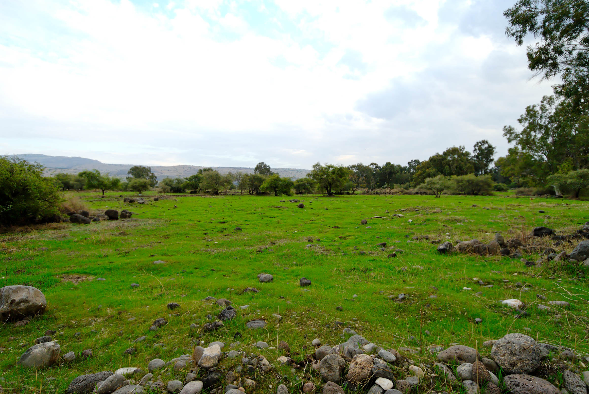

# Cover {.unnumbered}

Placeholder


<!--chapter:end:index.Rmd-->


# Quest Introduction {-}

Placeholder


## Getting Started (IMPORTANT!) {-}
## Customize Anki Settings {- #anki_settings}
### Daily limits and New Cards {-}
### Lapses and Timer {-}
### Burying and Audio {-}
### Advanced {-}
## The Fog {-}
## Other course information {-}

<!--chapter:end:00c-Anki.Rmd-->


# Get Help/Give Feedback {- #get_help}

Placeholder


<!--chapter:end:00d-help.Rmd-->

# (PART) Hebrew Grammar Foundations {-}

<!--chapter:end:01a-Part_I_header.Rmd-->


# The Hebrew Aleph-bet {#alephbet}

Placeholder


## First Thought {-}
### <span class="he">שֵׁם יְהוָה אֶקְרָא</span> {-}
## The Hebrew Aleph-Bet {#consonants}
## Aleph-Bet Memory Song
## Hebrew is written and read from RIGHT-to-LEFT {#right_to_left}
## Five "KiMNePaTZ" letters have different final forms {#sofit_letters}
## Activity: Practice Letter Writing  {- #worksheets-1}
## Six "BeGaD KePHaT" letters take a mark called a Daghesh Lene {#daghesh_lene}
## We classify four consonants as **Gutturals** (and one additional consonant is a sometimes-guttural)^[In modern linguistics, these are called `glottals`] {#gutturals}
## We classify ten Hebrew letters as "SQiN eM LeVY" consonants
## Look out for look-alike Letters {#look-alike-letters}
## Sephardic versus Seminary Pronunciation {#pronunciation}
## Activity: Anki {-}
## Activity: Ruth Pursuit {-}
### Ruth 1 {-}
## Activity: Ruth Pursuit Translation Worksheet {-}
## Activity: Quest Quiz {-}
## Lesson Extras {-}

<!--chapter:end:01b-Alephbet.Rmd-->

# Hebrew Vowels 

::: {.infobox .sound}
<figure> <audio id="myAudio" controls controlsList="nodownload" 
src="./images/02.intro.m4a"> 
Your browser does not support the <code>audio</code> element.</audio><button onclick="x25()" type="button">2.5x</button><button onclick="x2()" type="button">2x</button><button onclick="x15()" type="button">1.5x</button><button onclick="x1()" type="button">1x</button><button onclick="x075()" type="button">.75x</button><button onclick="x05()" type="button">.5x</button><script>
var x = document.getElementById("myAudio");
function x05() { 
    x.playbackRate = 0.5;
    x.play();}
function x075() { 
    x.playbackRate = 0.75;
    x.play();} 
function x1() { 
    x.playbackRate = 1;
     x.play();}
function x15() { 
    x.playbackRate = 1.5;
     x.play();} 
function x2() { 
    x.playbackRate = 2;
     x.play();} 
function x25() { 
    x.playbackRate = 2.5;
     x.play(); } 
</script></figure>
:::

> To comprehend Biblical Hebrew, we must understand how words are formed and pronounced

As Izzy says in _Hebrew Quest_, “vowels are important!”  Even though our goal may not necessarily be to converse in Biblical Hebrew, hearing the language's sound aids our learning.  Vowels are what give a language its distinctive sound, and are what give words their meaning.  Consider the simple English words "bay," "boy," and "buy."  These words have identical consonants but mean very different things because of the different vowels.  It is the same with Hebrew.


```r
library(knitr)
include_graphics("images/02.Gen0109.png")
```


Above, you see Genesis 1:9.  The black font shows the text with no vowels. This is how the Hebrew Bible was originally written.  Over time, a group known as the Masorites developed the vowel notation we use today. These are the symbols in red.  These are usually under, but sometimes in the middle of or over the affected consonant. This vowel system intends to preserve the pronunciation passed down for centuries via the oral tradition. The Hebrew name for these diacritical dots and dashes is _nikudot_ which is the plural form of the word _nikkud_. The blue font shows additional cantillation marks, which synagogues use for chanting the verses.  These marks also show where the word's accent is.^[Image Source: Originally uploaded as en:File:Example of biblical Hebrew trope.svg on 04:27, 19 November 2006 (UTC) by en:User:SyntaxError55. ]  We will talk more about Cantillation marks in Unit 3.

::: {.infobox .map}
**LESSON ITINERARY**

1. Memorize vowels that are not vowel letters
1. Learn Vocal Sheva and Silent Sheva
1. Memorize the vowel letters
1. Meet "defective" and "plene" spelling 
1. Meet Dagesh Lene's twin, Dagesh Forte
1. Know the rule for a Dagesh Forte
1. Know that the Gutturals and Resh reject Dagesh Forte
::: 

::: {.infobox .stop}
**EQUIPMENT CHECK**

Before continuing, be sure you can recite the following groups of letters from memory.  These are concepts we learned in Lesson 1 and we just want to make sure we are ready to proceed to Lesson 2:

* All twenty-two consonants of the Hebrew Aleph-Bet 
* The six BeGaD KePHaT letters
* The five KiMNePaTZ letters
* The four guttural letters and the one sometimes-guttural letter
* The ten SQiN eM LeVY letters

:::

## First Thought {-}

::: {.infobox .sound}
<figure> <audio id="myAudio" controls controlsList="nodownload" 
src="./images/02.ps107024.mp3">
Your browser does not support the <code>audio</code> element.</audio><button onclick="x25()" type="button">2.5x</button><button onclick="x2()" type="button">2x</button><button onclick="x15()" type="button">1.5x</button><button onclick="x1()" type="button">1x</button><button onclick="x075()" type="button">.75x</button><button onclick="x05()" type="button">.5x</button><script>
var x = document.getElementById("myAudio");
function x05() { 
    x.playbackRate = 0.5;
    x.play();}
function x075() { 
    x.playbackRate = 0.75;
    x.play();} 
function x1() { 
    x.playbackRate = 1;
     x.play();}
function x15() { 
    x.playbackRate = 1.5;
     x.play();} 
function x2() { 
    x.playbackRate = 2;
     x.play();} 
function x25() { 
    x.playbackRate = 2.5;
     x.play(); } 
</script></figure>
:::

::: {.box .light}
* Listen to the verse in Hebrew
* Practice speaking until you can pronounce just like Izzy
:::


###  <span class="he">הֵמָּה רָאוּ מַעֲשֵׂי יְהוָה</span> {-}

*They have seen the works of Adonai (Psalms 107:24)*

Reflect on the works of HaShem that you have seen!


```r

```

<div class="figure" style="text-align: center">

<p class="caption">(\#fig:unnamed-chunk-2)Plain of Bethsaida - suggested location where 5000 saw the works of Yeshua and were fed (Mark 6). Courtesy of the [Pictorial Library of Bible Lands](https://www.bibleplaces.com)</p>
</div>

<!-- 2.1 -->

## _Hebrew Quest_ Vowels Lecture

::: {.infobox .sound}
<figure> <audio id="myAudio" controls controlsList="nodownload" 
src="./images/02.1.m4a"> 
Your browser does not support the <code>audio</code> element.</audio><button onclick="x25()" type="button">2.5x</button><button onclick="x2()" type="button">2x</button><button onclick="x15()" type="button">1.5x</button><button onclick="x1()" type="button">1x</button><button onclick="x075()" type="button">.75x</button><button onclick="x05()" type="button">.5x</button><script>
var x = document.getElementById("myAudio");
function x05() { 
    x.playbackRate = 0.5;
    x.play();}
function x075() { 
    x.playbackRate = 0.75;
    x.play();} 
function x1() { 
    x.playbackRate = 1;
     x.play();}
function x15() { 
    x.playbackRate = 1.5;
     x.play();} 
function x2() { 
    x.playbackRate = 2;
     x.play();} 
function x25() { 
    x.playbackRate = 2.5;
     x.play(); } 
</script></figure>
:::


View this 28:00 overview video from _Hebrew Quest_, then we will dig into the concepts in greater detail as we progress through the lesson^[As a reminder, you can speed up these videos by pressing the `gear` symbol, then adjusting the `Playback Speed`.].  You can disregard references to the "Hebrew Quest Student Manual" or "Essentials of Biblical Hebrew." Pertinent concepts have been incorporated into this Hebrew GRAMMAR Quest Guidebook. 

<div class="container">
<iframe class="responsive-iframe" src="https://www.youtube.com/embed/
MlfwNNuWgto?start=0&end=1675&rel=0&showinfo=0autohide=1&autoplay=1" frameborder="0"></iframe>
</div>

[Click to open video in a new tab](https://youtu.be/MlfwNNuWgto){target="_blank"}

<figure>
    <figcaption>Audio from _Hebrew Quest_ Lesson 12 Vowels Lecture</figcaption>
    <audio
        controls controlsList="nodownload"
        src="./images/02.1.1.m4a">
            Your browser does not support the
            <code>audio</code> element.
    </audio>
</figure>

* Start: 00:00
* End: 27:55

## Vowels that are not vowel letters: table

::: {.infobox .sound}
<figure> <audio id="myAudio" controls controlsList="nodownload" 
src="./images/02.2.m4a"> 
Your browser does not support the <code>audio</code> element.</audio><button onclick="x25()" type="button">2.5x</button><button onclick="x2()" type="button">2x</button><button onclick="x15()" type="button">1.5x</button><button onclick="x1()" type="button">1x</button><button onclick="x075()" type="button">.75x</button><button onclick="x05()" type="button">.5x</button><script>
var x = document.getElementById("myAudio");
function x05() { 
    x.playbackRate = 0.5;
    x.play();}
function x075() { 
    x.playbackRate = 0.75;
    x.play();} 
function x1() { 
    x.playbackRate = 1;
     x.play();}
function x15() { 
    x.playbackRate = 1.5;
     x.play();} 
function x2() { 
    x.playbackRate = 2;
     x.play();} 
function x25() { 
    x.playbackRate = 2.5;
     x.play(); } 
</script></figure>
:::

The table below lists the vowels that are not vowel letters.  This table MUST be memorized, including type and class as well as the name and symbol.

::: {.box .light}
* The Anki exercises will help us to commit this table to memory, so you don't necessarily need to drop everything and memorize the table below!
* Review the table and get familiar with it; then review the discussion points on the next slide
:::

* The letter בּ is provided as a placeholder
* Say the vowel _after_ saying the associated consonant^[We will learn that Hebrew loves to break the rules.  In the next lesson, we will learn about an exception to the "vowel comes after" rule, called the *furtive patach*.]. 
  * So, the first vowel example is "baw" not "awb."^[See discussion in Lesson 1 on the differences between academic pronunication and that which we might hear from a native speaker.  "Basics of Biblical Hebrew" labels the first vowel "Qamets" and pronounced either `qa-MAYTZ` or `QA-maytz`.  Others, including Dr. Beckman, spell the vowel as "Qamats" and pronounced `qa-MAHTZ` (or sometimes or `QA-mahtz`, which sounds like the English word `comets`). For whatever reason, the pronunciation of the names of the vowels is not standardized, nor is this a point to be overly concerned about.  For simplicity, students may choose to use Izzy's pronunciation in _Hebrew Quest_. See the Wikipedia articles for these vowels for additional historical background.]


```r
knitr::include_graphics("images/02.vowels_not_letters.png")
```


## Vowels that are not vowel letters: discussion


::: {.infobox .sound}
<figure> <audio id="myAudio" controls controlsList="nodownload" 
src="./images/02.3.m4a"> 
Your browser does not support the <code>audio</code> element.</audio><button onclick="x25()" type="button">2.5x</button><button onclick="x2()" type="button">2x</button><button onclick="x15()" type="button">1.5x</button><button onclick="x1()" type="button">1x</button><button onclick="x075()" type="button">.75x</button><button onclick="x05()" type="button">.5x</button><script>
var x = document.getElementById("myAudio");
function x05() { 
    x.playbackRate = 0.5;
    x.play();}
function x075() { 
    x.playbackRate = 0.75;
    x.play();} 
function x1() { 
    x.playbackRate = 1;
     x.play();}
function x15() { 
    x.playbackRate = 1.5;
     x.play();} 
function x2() { 
    x.playbackRate = 2;
     x.play();} 
function x25() { 
    x.playbackRate = 2.5;
     x.play(); } 
</script></figure>
:::

### Vowels come in three types: Long, Short, Reduced | Vowels come in five classes: A, E, I, O, U {-}

* We memorized the Aleph-bet in Lesson 1, but this knowledge is incomplete without vowels
  * Make sure you can say the name and know how to write the specific vowels
  * We also must know the vowel types (Long, Short, Reduced) and classes (A, E, I, O, or U) 
  * This will make your grammatical life much more comfortable in the future
*   Only **gutturals** take the "Hateph" vowels - 
  * To make it easier, we can pronounce all three Hateph vowels like the A in <u>A</u>muse
  * Hateph vowels are used because Gutturals reject Vocal Sheva
  * We label the reduced O class, "Hateph Qamets Hatuf"
    * Note that other grammars may label this vowel, "Hateph Qamets"
    * Our label, "Hateph Qamets Hatuf," reminds us that this is the reduced O class, not to be confused with the A class Qamets, even though the symbols are the same
    *   A future section will explain the difference between Qamets and Qamets Hatuf
    * For now, remember Qamets is Long A and Qamets Hatuf is Short O


## Vocal and Silent Sheva

::: {.infobox .sound}
<figure> <audio id="myAudio" controls controlsList="nodownload" 
src="./images/02.4.m4a"> 
Your browser does not support the <code>audio</code> element.</audio><button onclick="x25()" type="button">2.5x</button><button onclick="x2()" type="button">2x</button><button onclick="x15()" type="button">1.5x</button><button onclick="x1()" type="button">1x</button><button onclick="x075()" type="button">.75x</button><button onclick="x05()" type="button">.5x</button><script>
var x = document.getElementById("myAudio");
function x05() { 
    x.playbackRate = 0.5;
    x.play();}
function x075() { 
    x.playbackRate = 0.75;
    x.play();} 
function x1() { 
    x.playbackRate = 1;
     x.play();}
function x15() { 
    x.playbackRate = 1.5;
     x.play();} 
function x2() { 
    x.playbackRate = 2;
     x.play();} 
function x25() { 
    x.playbackRate = 2.5;
     x.play(); } 
</script></figure>
:::


* The Sheva can be tricky to grasp at first since vocal and silent Sheva are written the same. They have two very different uses^[Many academic textbooks will use the term "Shewa" instead of "Sheva". Both words mean the same thing.].
* Both are written as קְ
  * Both types of a Sheva mark the END of a syllable
* VOCAL Sheva is a REDUCED vowel but does NOT have a vowel Class
  *  Only non-gutturals can take a Vocal Sheva
      * Gutturals **reject** the Vocal Sheva and take the Hateph vowels instead
    * Pronounced like the A in <u>A</u>muse (same as Hateph Patach)
* SILENT Sheva is not a reduced vowel. In fact, it is NOT A VOWEL AT ALL
    * <u>Any</u> letter, including Gutturals, can take a Silent Sheva
    * Silent/No sound
* We will learn how to distinguish between the two kinds of Sheva in the next lesson

Type | Class | Hebrew | Name | Pronunciation
| :-: | :-: | :-: | :-: | :-: 
Reduced | No Class | <span class="he">בְּ</span> | Vocal Sheva | amuse
Not a Vowel | | <span class="he">בְּ</span> | Silent Sheva | No pronunciation

::: {.box .info}
The Sof Pasuq

* It is worth pointing out that in Hebrew Bibles, we may come across a mark that looks like a super-sized Sheva
* In English, we might say it looks like a giant colon mark (:)
* In Hebrew, this mark is called a Sof Pasuq, and it is used to mark the end of the verse
* Other than this, the mark has no meaning for us whatsoever.  You may ignore it when you encounter it, except that you will know that it always marks the end of a verse.
:::


## Vowels: that are letters: table

::: {.infobox .sound}
<figure> <audio id="myAudio" controls controlsList="nodownload" 
src="./images/02.5.m4a"> 
Your browser does not support the <code>audio</code> element.</audio><button onclick="x25()" type="button">2.5x</button><button onclick="x2()" type="button">2x</button><button onclick="x15()" type="button">1.5x</button><button onclick="x1()" type="button">1x</button><button onclick="x075()" type="button">.75x</button><button onclick="x05()" type="button">.5x</button><script>
var x = document.getElementById("myAudio");
function x05() { 
    x.playbackRate = 0.5;
    x.play();}
function x075() { 
    x.playbackRate = 0.75;
    x.play();} 
function x1() { 
    x.playbackRate = 1;
     x.play();}
function x15() { 
    x.playbackRate = 1.5;
     x.play();} 
function x2() { 
    x.playbackRate = 2;
     x.play();} 
function x25() { 
    x.playbackRate = 2.5;
     x.play(); } 
</script></figure>
:::

* As Izzy mentioned in the _Hebrew Quest_ vowels segment, Hebrew has five consonants that can stand in for vowels
  * <span class="he">א, ע, ה, ו, י</span>
* א and ע simply take whichever applicable nikkud mark and are pronounced according to the vowel's sound
* ה, ו, י are slightly different, in that the consonant plus the vowel combines to form a single vowel unit
  * Note these vowels in the table below:
  

```r
knitr::include_graphics("images/02.vowels_letters.png")
```


## Vowels that are letters: 

::: {.infobox .sound}
<figure> <audio id="myAudio" controls controlsList="nodownload" 
src="./images/02.6.m4a"> 
Your browser does not support the <code>audio</code> element.</audio><button onclick="x25()" type="button">2.5x</button><button onclick="x2()" type="button">2x</button><button onclick="x15()" type="button">1.5x</button><button onclick="x1()" type="button">1x</button><button onclick="x075()" type="button">.75x</button><button onclick="x05()" type="button">.5x</button><script>
var x = document.getElementById("myAudio");
function x05() { 
    x.playbackRate = 0.5;
    x.play();}
function x075() { 
    x.playbackRate = 0.75;
    x.play();} 
function x1() { 
    x.playbackRate = 1;
     x.play();}
function x15() { 
    x.playbackRate = 1.5;
     x.play();} 
function x2() { 
    x.playbackRate = 2;
     x.play();} 
function x25() { 
    x.playbackRate = 2.5;
     x.play(); } 
</script></figure>
:::


### Vowel letters use a consonant plus a nikkud to form a vowel {-}


* Shureq is pronounced like Qibbuts (r<u>u</u>ler)
* Hireq Yod is pronounced like the i in mach<u>i</u>ne (compared to Hireq (Short I), which is pronounced like "b<u>i</u>tter)
* The other vowel letters are pronounced like the corresponding vowel - Qamets Hei is pronounced like Qamets, and so forth
* All vowel letters, except Seghol Hei, are LONG
* Yod and Vav vowels - י,ו 
    * Not only are these Long vowels, they have a unique feature is that they are "immune" from "propretonic reduction"
    * Therefore they are called "Unchangeable long vowels" or sometimes "Irreducible long vowels"
    * We'll explain what this means in the next lesson
* Hei Vowels - ה
    * Hei vowels can **ONLY** occur at the END of a word
    * Hei vowels are extremely common in Hebrew
    * The Hei vowels are Long (except for Seghol Hei) but they are not labeled as irreducible/unchangeable^[Strictly speaking, this point is irrelevant as a vowel at the end of a word would never reduce anyway. But, if you are ever asked "are the Hei vowels irreducible/unchangeable?", the answer is "no."]

::: {.box .caution}
* Do not confuse "vowel reducing" with "defective spelling"
* Although unchangable long vowels CANNOT reduce, they CAN be written defectively
  * For example, what was originally <span class="he">בּוֹ</span> becomes <span class="he">בֹּ</span>
* We will discuss defective spelling next
:::


## "Defective" and "plene" spelling {#defective_spelling}

::: {.infobox .sound}
<figure> <audio id="myAudio" controls controlsList="nodownload" 
src="./images/02.7.m4a"> 
Your browser does not support the <code>audio</code> element.</audio><button onclick="x25()" type="button">2.5x</button><button onclick="x2()" type="button">2x</button><button onclick="x15()" type="button">1.5x</button><button onclick="x1()" type="button">1x</button><button onclick="x075()" type="button">.75x</button><button onclick="x05()" type="button">.5x</button><script>
var x = document.getElementById("myAudio");
function x05() { 
    x.playbackRate = 0.5;
    x.play();}
function x075() { 
    x.playbackRate = 0.75;
    x.play();} 
function x1() { 
    x.playbackRate = 1;
     x.play();}
function x15() { 
    x.playbackRate = 1.5;
     x.play();} 
function x2() { 
    x.playbackRate = 2;
     x.play();} 
function x25() { 
    x.playbackRate = 2.5;
     x.play(); } 
</script></figure>
:::


In "defective" spelling, letter vowels can sometimes drop their letter and take on the corresponding non-letter vowel. The meaning of the word does not change.

This is the word for "laws" showing both "plene" spelling and "defective" spelling.  Both spellings mean exactly the same thing: "laws" or "teachings".


```r
knitr::include_graphics("images/defective.gif")
```


* Vowel letters commonly take "defective" forms^["Defective", in this sense, does not have a negative connotation.]
* Holem-Vav can drop the Vav and contract to Holem, as in the example above
* Hireq-Yod can drop the Yod and contract to Hireq
* Shuruq can drop entirely and contract to Qibbuts - this sometimes catches students by surprise - see caution box below.
* The Qamets-Hei <span class="he">ה ָ  </span>sometimes drops the final ה, leaving just the Qamets under the now-final letter.

::: {.box .caution}
An unchangeable long vowel written defectively is still an unchangeable long vowel


* A Qibbuts that is _not_ defective is a short vowel
* A Qibbuts that is a defective Shureq is an unchangeable long vowel

For now, do not be concerned about the difference.  As we progress in the course, you will see this in action.
:::

::: {.infobox .info}    
If any of this is confusing now, as we've said before, hang in there!  As you progress in your knowledge of Hebrew, you’ll start to develop a mental checklist when you encounter something that does not seem to follow the regular rules. Asking yourself, “Could this be a defective spelling?” will be one of those checklist items.
:::


## Transliteration Shorthand

::: {.infobox .sound}
<figure> <audio id="myAudio" controls controlsList="nodownload" 
src="./images/02.8.m4a"> 
Your browser does not support the <code>audio</code> element.</audio><button onclick="x25()" type="button">2.5x</button><button onclick="x2()" type="button">2x</button><button onclick="x15()" type="button">1.5x</button><button onclick="x1()" type="button">1x</button><button onclick="x075()" type="button">.75x</button><button onclick="x05()" type="button">.5x</button><script>
var x = document.getElementById("myAudio");
function x05() { 
    x.playbackRate = 0.5;
    x.play();}
function x075() { 
    x.playbackRate = 0.75;
    x.play();} 
function x1() { 
    x.playbackRate = 1;
     x.play();}
function x15() { 
    x.playbackRate = 1.5;
     x.play();} 
function x2() { 
    x.playbackRate = 2;
     x.play();} 
function x25() { 
    x.playbackRate = 2.5;
     x.play(); } 
</script></figure>
:::


* Most Hebrew grammar books include transliteration values
* While learning the transliteration scheme can help in some instances, our general position is that it can be an unnecessary distraction
* Where it can be useful is as shorthand
  * It would get wordy to write "Holem Vav" repeatedly
  * It's much less clutter to write the shorthand version based on transliteration: $\hat O$
  * Often, the vowel marks in isolation can be difficult to detect; compare ֹ  with $\hat O$
* As we move forward in the course, particularly in unit three, we will be making use of the vowel shorthand listed below

::: {.box .info}

* Short Vowels (no marking): $A$ for Patach, $E$ for Seghol, $I$, Hireq, $O$ for Qamets Hatuf, and $U$, Qibbuts
* Long Vowels that are not letters (bar): $\bar A$ for Qamets, $\bar E$ for Tsere, and $\bar O$ for Holem
* Reduced Vowels (breve): $\breve A$ for Hateph Patach, $\breve E$ for Hateph Seghol, $\breve O$ = Hateph Qamets Hatuf
* Vowel letters (hat): $\hat E$ = Tsere+Yod^[Formal shorthand for Tsere+Hei, Seghol+Hei, and Seghol+Yod is also $\hat E$ but for this course, we will only use $\hat E$ for Tsere+Yod.], $\hat I$ = Hireq+Yod; $\hat O$ = Holem+Vav^[Formal shorthand for Holem+Hei is also $\hat O$ but for this course, we will only use $\hat O$ for Holem+Vav.], $\hat U$ = Shureq, and Qamets+Hei = $\hat A$^[Formal shorthand for Qamets+Yod is also $\hat A$ but for this course, we will only use $\hat A$ for Qamets+Hei.]
* Additionally, we have  Vocal Sheva = $ə$, and $:$ for Silent Sheva^[Vocal Sheva has a "hurried" pronunciation, like the _a_ in _amuse_ or _Tina_. ə is the [international character for this sound](https://en.wikipedia.org/wiki/Mid_central_vowel){target="_blank"}. Silent Sheva has no pronunciation transliteration value.]

:::

* We will use this shorthand frequently when we discuss verbs
* We will review the values again as we get into Unit 3

## The Dagesh Forte Doubles the Consonant {#dagesh_forte}

::: {.infobox .sound}
<figure> <audio id="myAudio" controls controlsList="nodownload" 
src="./images/02.9.m4a"> 
Your browser does not support the <code>audio</code> element.</audio><button onclick="x25()" type="button">2.5x</button><button onclick="x2()" type="button">2x</button><button onclick="x15()" type="button">1.5x</button><button onclick="x1()" type="button">1x</button><button onclick="x075()" type="button">.75x</button><button onclick="x05()" type="button">.5x</button><script>
var x = document.getElementById("myAudio");
function x05() { 
    x.playbackRate = 0.5;
    x.play();}
function x075() { 
    x.playbackRate = 0.75;
    x.play();} 
function x1() { 
    x.playbackRate = 1;
     x.play();}
function x15() { 
    x.playbackRate = 1.5;
     x.play();} 
function x2() { 
    x.playbackRate = 2;
     x.play();} 
function x25() { 
    x.playbackRate = 2.5;
     x.play(); } 
</script></figure>
:::


```r

```


 

* Notice the dot in the שּׁ in <span class="he">הַשָּׁמַיִם:</span>
  * The dot is called a Dagesh FORTE - it is the Dagesh Lene's big brother
  * Since שׁ is not a בגד כפת letter, we know this *cannot* be a Dagesh Lene
* The letter with the Dagesh Forte both ends one syllable and begins the next syllable - in fact, a way to think of the Daghesh Forte is to call it the "doubling Daghesh"
* In <span class="he">הַשָּׁמַיִם:</span> is pronounced: `hash-sha-mayim`^[ `Mayim` is one syllable as we will learn in Lesson 3.  <span class="he">הַשָּׁמַיִם</span> means "the heavens."  From now on, we won't always provide a translation for every new word you encounter.  It's more important that you focus on the concepts.  You will have PLENTY of vocabulary work in Anki!]
* A similar word in English might be better = bet | ter
    * If we were to transliterate better into Hebrew hypothetically,  it might look like: בּטֶּר*^[The * means this is not a real Hebrew word, but we show it in this form for illustration.]
* Notice the syllable breaks in these words that have a Dagesh Forte:


```r
include_graphics("images/02.forte.png")
```


## בגד כפת letters can take either a Dagesh Lene OR a Dagesh Forte

::: {.infobox .sound}
<figure> <audio id="myAudio" controls controlsList="nodownload" 
src="./images/02.10.m4a"> 
Your browser does not support the <code>audio</code> element.</audio><button onclick="x25()" type="button">2.5x</button><button onclick="x2()" type="button">2x</button><button onclick="x15()" type="button">1.5x</button><button onclick="x1()" type="button">1x</button><button onclick="x075()" type="button">.75x</button><button onclick="x05()" type="button">.5x</button><script>
var x = document.getElementById("myAudio");
function x05() { 
    x.playbackRate = 0.5;
    x.play();}
function x075() { 
    x.playbackRate = 0.75;
    x.play();} 
function x1() { 
    x.playbackRate = 1;
     x.play();}
function x15() { 
    x.playbackRate = 1.5;
     x.play();} 
function x2() { 
    x.playbackRate = 2;
     x.play();} 
function x25() { 
    x.playbackRate = 2.5;
     x.play(); } 
</script></figure>
:::

* Any consonant (except for Gutturals and Resh) can take a Dagesh Forte, including a בגד כפת letter
    * The "Buck-up" letters will take the **hard** pronunciation regardless of a Dagesh Lene or Dagesh Forte - See the final word אַתָּה in the previous section

_Advanced tip:_ When you see a Dagesh Forte, it often means that another letter (most frequently נ) has disappeared^[Not entirely unlike the English apostrophe in words like _can't_. The grammatical term for this is "assimilation."].  We will talk more about this later in the course.

::: {.infobox .info}
It's good to think of the Dagesh Forte as the "Doubling Dagesh" since it doubles the consonant and often changes a word's meaning.  

Conversely, we can think of the Dagesh Lene as the "Meaningless Dagesh" since it does not ever change a word's meaning
:::


## The Easy Dagesh Forte Rule {#dagesh_forte_in_bgdkpt}

::: {.infobox .sound}
<figure> <audio id="myAudio" controls controlsList="nodownload" 
src="./images/02.11.m4a"> 
Your browser does not support the <code>audio</code> element.</audio><button onclick="x25()" type="button">2.5x</button><button onclick="x2()" type="button">2x</button><button onclick="x15()" type="button">1.5x</button><button onclick="x1()" type="button">1x</button><button onclick="x075()" type="button">.75x</button><button onclick="x05()" type="button">.5x</button><script>
var x = document.getElementById("myAudio");
function x05() { 
    x.playbackRate = 0.5;
    x.play();}
function x075() { 
    x.playbackRate = 0.75;
    x.play();} 
function x1() { 
    x.playbackRate = 1;
     x.play();}
function x15() { 
    x.playbackRate = 1.5;
     x.play();} 
function x2() { 
    x.playbackRate = 2;
     x.play();} 
function x25() { 
    x.playbackRate = 2.5;
     x.play(); } 
</script></figure>
:::

So how do you tell whether a Daghesh in a בגד כפת letter is Lene or Forte?

::: {.infobox .light} 
A Dagesh is a Forte if, and only if, it's preceded by a vowel that is not a Sheva^[Remember we said in the introduction that content in "light" information boxes should usually be memorized.  You will definitely want to memorize the Dagesh Forte rule.]
:::

That's it.  That's the rule^[Strictly speaking, there are exceptions.  We only have one in this course and we won't see it until Unit 4.].  

Quiz yourself with these examples (answers below):


* <span class="he">אַתָּה</span> = Is the Dagesh preceded by a vowel that is not a Sheva?^[Yes, a patach. Dagesh Forte]
* <span class="he">בְּרֵאשִׁית</span> = Is the Dagesh preceded by a vowel that is not a Sheva?^[No. Dagesh Lene]
* <span class="he">עַל־פְּנֵי</span> = Is the Dagesh preceded by a vowel that is not a Sheva?^[No. Dagesh Lene.  The "hyphen" looking mark is called a Maqquef.  It has the same function as the Hyphen does in English.]
* <span class="he">מַבְדִּיל</span> = Is the Dagesh preceded by a vowel that is not a Sheva?^[No, it is preceded by a Sheva. Dagesh Lene.]
* <span class="he">מִתַּחַת</span>  = Is the Dagesh preceded by a vowel that is not a Sheva?^[Yes, a Hiriq. Dagesh Forte]

## וּ is usually Shureq, but could be Vav with a Dagesh Forte

::: {.infobox .sound}
<figure> <audio id="myAudio" controls controlsList="nodownload" 
src="./images/02.12.m4a"> 
Your browser does not support the <code>audio</code> element.</audio><button onclick="x25()" type="button">2.5x</button><button onclick="x2()" type="button">2x</button><button onclick="x15()" type="button">1.5x</button><button onclick="x1()" type="button">1x</button><button onclick="x075()" type="button">.75x</button><button onclick="x05()" type="button">.5x</button><script>
var x = document.getElementById("myAudio");
function x05() { 
    x.playbackRate = 0.5;
    x.play();}
function x075() { 
    x.playbackRate = 0.75;
    x.play();} 
function x1() { 
    x.playbackRate = 1;
     x.play();}
function x15() { 
    x.playbackRate = 1.5;
     x.play();} 
function x2() { 
    x.playbackRate = 2;
     x.play();} 
function x25() { 
    x.playbackRate = 2.5;
     x.play(); } 
</script></figure>
:::

*   When a Vav has a Dagesh Forte, it looks like this וּ and, therefore, is identical to a Shureq וּ
*   It's surprisingly easy to tell the difference
*   A Shureq will _never_ have a separate vowel following or preceding
*   If the preceding consonant has a vowel, the וּ is a Vav with a Dagesh - that's the rule we just learned
*   Also, if there is an additional vowel either under or over the same letter, it can't be a Shureq as there are never two vowels in a row (and there is no diphthong involving a Shureq)
* Examples:
  * <span class="he">בוּ</span> = Shureq
  * <span class="he">בְוָּ</span> = Vav with Dagesh Forte - a Shureq would never take an additional vowel
  * <span class="he">בָוּ</span> = Vav with Dagesh Forte ־ the Rule of Sheva:  preceding letter has a vowel 
  * The last example is hypothetical only; generally, a Vav with the Dagesh Forte would have both a preceding vowel/Sheva AND an additional vowel/Sheva
  
::: {.box .info}

When you see <span class="he">וּ</span>, it is usually a Shureq

:::

* A similar situation happens with <span class="he">וֹ</span>
  * Consider the word, <span class="he">מִצְוֹת</span>
    * This is a consonantal Vav with a Holem, pronounced "vo"
    * The previous consonant has a Sheva ending the syllable; the next syllable cannot start with a vowel
    
    
## Gutturals and Resh reject Dagesh Forte {#gutturals_reject_dagesh_forte}

::: {.infobox .sound}
<figure> <audio id="myAudio" controls controlsList="nodownload" 
src="./images/02.13.m4a"> 
Your browser does not support the <code>audio</code> element.</audio><button onclick="x25()" type="button">2.5x</button><button onclick="x2()" type="button">2x</button><button onclick="x15()" type="button">1.5x</button><button onclick="x1()" type="button">1x</button><button onclick="x075()" type="button">.75x</button><button onclick="x05()" type="button">.5x</button><script>
var x = document.getElementById("myAudio");
function x05() { 
    x.playbackRate = 0.5;
    x.play();}
function x075() { 
    x.playbackRate = 0.75;
    x.play();} 
function x1() { 
    x.playbackRate = 1;
     x.play();}
function x15() { 
    x.playbackRate = 1.5;
     x.play();} 
function x2() { 
    x.playbackRate = 2;
     x.play();} 
function x25() { 
    x.playbackRate = 2.5;
     x.play(); } 
</script></figure>
:::

* We said in Lesson One that the Gutturals don’t play nice with the other Hebrew Rules, and this rejection of the Dagesh Forte is one of those ways
* A Hebrew collision like this means something has to give. . . and the gutturals tend to get their way.
* It's like they have a force-field shielding them from other Hebrew grammar rules!


```r
knitr::include_graphics("images/02.reject.gif")
```

<div class="figure" style="text-align: center">

<p class="caption">(\#fig:unnamed-chunk-8)That's no moon.  That's a Guttural!</p>
</div>

* A large chunk of any Hebrew grammar course involves learning to resolve these guttural entanglements

::: {.box .caution}
MAPPIQ

* You may see הּ. This dot is not a Dagesh because we just learned that gutturals never take a Dagesh but a Mappiq. 
* A word-final ה is typically a vowel
* A Mappiq signifies that a word-final ה is a consonant, not a vowel
* We'll talk more about the Mappiq in Lesson 7
:::

## Lesson Conclusion and Activities {-}

::: {.infobox .sound}
<figure> <audio id="myAudio" controls controlsList="nodownload" 
src="./images/02.conclusion.m4a"> 
Your browser does not support the <code>audio</code> element.</audio><button onclick="x25()" type="button">2.5x</button><button onclick="x2()" type="button">2x</button><button onclick="x15()" type="button">1.5x</button><button onclick="x1()" type="button">1x</button><button onclick="x075()" type="button">.75x</button><button onclick="x05()" type="button">.5x</button><script>
var x = document.getElementById("myAudio");
function x05() { 
    x.playbackRate = 0.5;
    x.play();}
function x075() { 
    x.playbackRate = 0.75;
    x.play();} 
function x1() { 
    x.playbackRate = 1;
     x.play();}
function x15() { 
    x.playbackRate = 1.5;
     x.play();} 
function x2() { 
    x.playbackRate = 2;
     x.play();} 
function x25() { 
    x.playbackRate = 2.5;
     x.play(); } 
</script></figure>
:::

Congratulations on completing the vowels lesson.  Make sure you memorize the vowel classes, the Dagesh Forte rule, and the guttural behavior.  

We're about halfway through the first stage of the course on Hebrew Grammar Foundations.  Keep going! You're doing great!  After you finish all of the activities for this lesson, you can claim the first of our `Twelve Tribes Badges`. 

Take a moment to review the section headings on the screen's left side before heading on to tackle the activities.


## Anki {-}

::: {.infobox .sound}
<figure> <audio id="myAudio" controls controlsList="nodownload" 
src="./images/02.anki.m4a"> 
Your browser does not support the <code>audio</code> element.</audio><button onclick="x25()" type="button">2.5x</button><button onclick="x2()" type="button">2x</button><button onclick="x15()" type="button">1.5x</button><button onclick="x1()" type="button">1x</button><button onclick="x075()" type="button">.75x</button><button onclick="x05()" type="button">.5x</button><script>
var x = document.getElementById("myAudio");
function x05() { 
    x.playbackRate = 0.5;
    x.play();}
function x075() { 
    x.playbackRate = 0.75;
    x.play();} 
function x1() { 
    x.playbackRate = 1;
     x.play();}
function x15() { 
    x.playbackRate = 1.5;
     x.play();} 
function x2() { 
    x.playbackRate = 2;
     x.play();} 
function x25() { 
    x.playbackRate = 2.5;
     x.play(); } 
</script></figure>
:::


* `Lesson 02 A. Vocab` 
  * You will be presented with the vowel symbol and you are to identify the name, type, and class of each vowel
  * There are also "reverse" cards where you will be given the name, type, and class, and you are to identify the symbol
* `Lesson 02 B. Grammar`  - the grammar section will look at vowels as groups, as well as test you on some other topics presented in this lesson
* `Lesson 02 C. Study Verses`
  * Bible verses will arrive next Lesson
  * In this module, we will be learning common Hebrew people and geographic names
  * Sound out the words using your knowledge of Hebrew consonants and vowels
  * As a general hint, with a couple of exceptions, the English names are pretty close to how they sound in Hebrew
  
Access Anki using your mobile app, desktop version, or [the web-based version (login may be required)](https://ankiweb.net/decks/){target="_blank"}

We can't stress enough how important the Anki activities are.  Anki is where your learning will take place. Try to do a little each day.

## Vowel Writing Worksheet {-}

::: {.infobox .sound}
<figure> <audio id="myAudio" controls controlsList="nodownload" 
src="./images/02.vowel_worksheet.m4a"> 
Your browser does not support the <code>audio</code> element.</audio><button onclick="x25()" type="button">2.5x</button><button onclick="x2()" type="button">2x</button><button onclick="x15()" type="button">1.5x</button><button onclick="x1()" type="button">1x</button><button onclick="x075()" type="button">.75x</button><button onclick="x05()" type="button">.5x</button><script>
var x = document.getElementById("myAudio");
function x05() { 
    x.playbackRate = 0.5;
    x.play();}
function x075() { 
    x.playbackRate = 0.75;
    x.play();} 
function x1() { 
    x.playbackRate = 1;
     x.play();}
function x15() { 
    x.playbackRate = 1.5;
     x.play();} 
function x2() { 
    x.playbackRate = 2;
     x.play();} 
function x25() { 
    x.playbackRate = 2.5;
     x.play(); } 
</script></figure>
:::

* Practice writing the vowels using the [Vowel Writing worksheet/drill](./images/02_Vowel_drill.pdf){target="_blank"}
* An answer key is on page two
* Repeat this worksheet until you can complete it correctly entirely from memory at least once
* A note on transliteration
  * Note that our course uses Capital letters, while the answer key uses lower case letters
  * It is more important to make sure the long, short, reduced, and vowel letter marks are accurate
  * You may ignore transliteration for:
    * Tsere Hei / Seghol Hei / Holem Hay
    * Seghol Yod


## Ruth Pursuit {-}

::: {.infobox .sound}
<figure> <audio id="myAudio" controls controlsList="nodownload" 
src="./images/02.ruth.m4a"> 
Your browser does not support the <code>audio</code> element.</audio><button onclick="x25()" type="button">2.5x</button><button onclick="x2()" type="button">2x</button><button onclick="x15()" type="button">1.5x</button><button onclick="x1()" type="button">1x</button><button onclick="x075()" type="button">.75x</button><button onclick="x05()" type="button">.5x</button><script>
var x = document.getElementById("myAudio");
function x05() { 
    x.playbackRate = 0.5;
    x.play();}
function x075() { 
    x.playbackRate = 0.75;
    x.play();} 
function x1() { 
    x.playbackRate = 1;
     x.play();}
function x15() { 
    x.playbackRate = 1.5;
     x.play();} 
function x2() { 
    x.playbackRate = 2;
     x.play();} 
function x25() { 
    x.playbackRate = 2.5;
     x.play(); } 
</script></figure>
:::

::: {.box .map}
YOUR QUEST

1. Identify the four UNCHANGEABLE LONG vowels that use YOD in Verse 1 (blue)^[In most word processors, you may not be able to isolate the vowel to highlight it. Get as close as you can.]
2. Identify the two UNCHANGEABLE LONG vowels that use VAV in Verse 1 (Green)
3. Identify QAMETS HEI in Verse 1.  There is a TSERE Hei between Verses 5-10.  Can you find it?^[The other vowels that use Hei are less common, but we will see them when we discuss verbs.] (Purple)
4. Identify the three LONG vowels in Verse 1 (that are not part of a vowel letter) (pink)
5. Identify three of the five SHORT vowels in Verse 1 (that are not part of a vowel letter)^[We haven't learned to spot Qamets Hatuf yet, and Qibbuts does not appear in this passage] (red)
6. Identify the three REDUCED/HATEPH vowels, including Hateph Qamets Hatuf^[You should be able to make out the word that has the Hateph Qamets Hatuph].  They are in verses 2-4. (grey)
7. One of the more common verbs in the Tanach is <span class="he">וַיֹּאמֶר</span>, which means "(and) he said."     
  * Vav-Patach-**Yod**-Daghesh Forte --וַיּ to start a verb means "And he (did or was something)  
    * If we change the second consonant from a Yod to a **Tav**, we get --וָתּ, "and **S**he (did or was something).  
    * Thus, <span class="he">וַתֹּאמֶר</span> means "and she said."  
    * Challenge: Find the five instances of <span class="he">וַתֹּאמֶר</span> in Ruth Chapter 1^[In at least three of the cases, you should be able to figure out who is speaking.]  (yellow)  
:::

* [Blank copy of Ruth Chapter 1](https://docs.google.com/document/d/1bcT1J-fcVmD1Zn5Jk2nj0560tEddcgtbYZLkwaVVuyE/copy){target="_blank"}
* [Ruth Pursuit Answer Key #2](./images/02_Ruth_Pursuit_KEY.pdf){target="_blank"}
* Update your Ruth Translation worksheet with <span class="he">וַתֹּאמֶר</span> = "and she said"        

### Ruth 1 {-}

Below is a copy of the text with audio read by Abraham Shumelof.  We encourage you to listen and follow along to get comfortable with the passage.

::: {.infobox .sound}
<figure>Click to hear Ruth 1 read by Abraham Shmuelof:<audio id="myAudioRuth" controls controlsList="nodownload" src="./images/t2901.m4a">
Your browser does not support the <code>audio</code> element.</audio>
<button onclick="setPlaySpeed25()" type="button">2.5x</button> <button onclick="setPlaySpeed2()" type="button">2x</button> <button onclick="setPlaySpeed15()" type="button">1.5x</button> <button onclick="setPlaySpeed1()" type="button">1x</button> <button onclick="setPlaySpeed075()" type="button">.75x</button> <button onclick="setPlaySpeed05()" type="button">.5x</button> 
<script>
var x = document.getElementById("myAudioRuth");
function setPlaySpeed05() { x.playbackRate = 0.5; x.play();}
function setPlaySpeed075() {x.playbackRate = 0.75; x.play();} 
function setPlaySpeed1() {x.playbackRate = 1; x.play();}
function setPlaySpeed15() {x.playbackRate = 1.5; x.play();} 
function setPlaySpeed2() {x.playbackRate = 2; x.play();} 
function setPlaySpeed25() {x.playbackRate = 2.5;x.play();} 
</script> </figure>
:::


<span class="he"><p align="right">
‫ 1     וַיְהִי בִּימֵי שְׁפֹט הַשֹּׁפְטִים וַיְהִי רָעָב בָּאָרֶץ וַיֵּלֶךְ אִישׁ מִבֵּית לֶחֶם יְהוּדָה לָגוּר בִּשְׂדֵי מוֹאָב הוּא וְאִשְׁתּוֹ וּשְׁנֵי בָנָיו׃ ‬
‫ 2     וְשֵׁם הָאִישׁ אֱלִימֶלֶךְ וְשֵׁם אִשְׁתּוֹ נָעֳמִי וְשֵׁם שְׁנֵי־בָנָיו מַחְלוֹן וְכִלְיוֹן אֶפְרָתִים מִבֵּית לֶחֶם יְהוּדָה וַיָּבֹאוּ שְׂדֵי־מוֹאָב וַיִּהְיוּ־שָׁם׃ ‬
‫ 3     וַיָּמָת אֱלִימֶלֶךְ אִישׁ נָעֳמִי וַתִּשָּׁאֵר הִיא וּשְׁנֵי בָנֶיהָ׃ ‬
‫ 4     וַיִּשְׂאוּ לָהֶם נָשִׁים מֹאֲבִיּוֹת שֵׁם הָאַחַת עָרְפָּה וְשֵׁם הַשֵּׁנִית רוּת וַיֵּשְׁבוּ שָׁם כְּעֶשֶׂר שָׁנִים׃ ‬
‫ 5     וַיָּמוּתוּ גַם־שְׁנֵיהֶם מַחְלוֹן וְכִלְיוֹן וַתִּשָּׁאֵר הָאִשָּׁה מִשְּׁנֵי יְלָדֶיהָ וּמֵאִישָׁהּ׃ ‬
‫ 6     וַתָּקָם הִיא וְכַלֹּתֶיהָ וַתָּשָׁב מִשְּׂדֵי מוֹאָב כִּי שָׁמְעָה בִּשְׂדֵה מוֹאָב כִּי־פָקַד יְהוָה אֶת־עַמּוֹ לָתֵת לָהֶם לָחֶם׃ ‬
‫ 7     וַתֵּצֵא מִן־הַמָּקוֹם אֲשֶׁר הָיְתָה־שָׁמָּה וּשְׁתֵּי כַלֹּתֶיהָ עִמָּהּ וַתֵּלַכְנָה בַדֶּרֶךְ לָשׁוּב אֶל־אֶרֶץ יְהוּדָה׃ ‬
‫ 8     וַתֹּאמֶר נָעֳמִי לִשְׁתֵּי כַלֹּתֶיהָ לֵכְנָה שֹּׁבְנָה אִשָּׁה לְבֵית אִמָּהּ *יעשה **יַעַשׂ יְהוָה עִמָּכֶם חֶסֶד כַּאֲשֶׁר עֲשִׂיתֶם עִם־הַמֵּתִים וְעִמָּדִי׃ ‬
‫ 9     יִתֵּן יְהוָה לָכֶם וּמְצֶאןָ מְנוּחָה אִשָּׁה בֵּית אִישָׁהּ וַתִּשַּׁק לָהֶן וַתִּשֶּׂאנָה קוֹלָן וַתִּבְכֶּינָה׃ ‬
‫ 10    וַתֹּאמַרְנָה־לָּהּ כִּי־אִתָּךְ נָשׁוּב לְעַמֵּךְ׃ ‬
‫ 11    וַתֹּאמֶר נָעֳמִי שֹׁבְנָה בְנֹתַי לָמָּה תֵלַכְנָה עִמִּי הַעוֹד־לִי בָנִים בְּמֵעַי וְהָיוּ לָכֶם לַאֲנָשִׁים׃ ‬
‫ 12    שֹׁבְנָה בְנֹתַי לֵכְןָ כִּי זָקַנְתִּי מִהְיוֹת לְאִישׁ כִּי אָמַרְתִּי יֶשׁ־לִי תִקְוָה גַּם הָיִיתִי הַלַּיְלָה לְאִישׁ וְגַם יָלַדְתִּי בָנִים׃ ‬
‫ 13    הֲלָהֵן תְּשַׂבֵּרְנָה עַד אֲשֶׁר יִגְדָּלוּ הֲלָהֵן תֵּעָגֵנָה לְבִלְתִּי הֱיוֹת לְאִישׁ אַל בְּנֹתַי כִּי־מַר־לִי מְאֹד מִכֶּם כִּי־יָצְאָה בִי יַד־יְהוָה׃ ‬
‫ 14    וַתִּשֶּׂנָה קוֹלָן וַתִּבְכֶּינָה עוֹד וַתִּשַּׁק עָרְפָּה לַחֲמוֹתָהּ וְרוּת דָּבְקָה בָּהּ׃ ‬
‫ 15    וַתֹּאמֶר הִנֵּה שָׁבָה יְבִמְתֵּךְ אֶל־עַמָּהּ וְאֶל־אֱלֹהֶיהָ שׁוּבִי אַחֲרֵי יְבִמְתֵּךְ׃ ‬
‫ 16    וַתֹּאמֶר רוּת אַל־תִּפְגְּעִי־בִי לְעָזְבֵךְ לָשׁוּב מֵאַחֲרָיִךְ כִּי אֶל־אֲשֶׁר תֵּלְכִי אֵלֵךְ וּבַאֲשֶׁר תָּלִינִי אָלִין עַמֵּךְ עַמִּי וֵאלֹהַיִךְ אֱלֹהָי׃ ‬
‫ 17    בַּאֲשֶׁר תָּמוּתִי אָמוּת וְשָׁם אֶקָּבֵר כֹּה יַעֲשֶׂה יְהוָה לִי וְכֹה יֹסִיף כִּי הַמָּוֶת יַפְרִיד בֵּינִי וּבֵינֵךְ׃ ‬
‫ 18    וַתֵּרֶא כִּי־מִתְאַמֶּצֶת הִיא לָלֶכֶת אִתָּהּ וַתֶּחְדַּל לְדַבֵּר אֵלֶיהָ׃ ‬
‫ 19    וַתֵּלַכְנָה שְׁתֵּיהֶם עַד־בֹּאָנָה בֵּית לָחֶם וַיְהִי כְּבֹאָנָה בֵּית לֶחֶם וַתֵּהֹם כָּל־הָעִיר עֲלֵיהֶן וַתֹּאמַרְנָה הֲזֹאת נָעֳמִי׃ ‬
‫ 20    וַתֹּאמֶר אֲלֵיהֶן אַל־תִּקְרֶאנָה לִי נָעֳמִי קְרֶאןָ לִי מָרָא כִּי־הֵמַר שַׁדַּי לִי מְאֹד׃ ‬
‫ 21    אֲנִי מְלֵאָה הָלַכְתִּי וְרֵיקָם הֱשִׁיבַנִי יְהוָה לָמָּה תִקְרֶאנָה לִי נָעֳמִי וַיהוָה עָנָה בִי וְשַׁדַּי הֵרַע לִי׃ ‬
‫ 22    וַתָּשָׁב נָעֳמִי וְרוּת הַמּוֹאֲבִיָּה כַלָּתָהּ עִמָּהּ הַשָּׁבָה מִשְּׂדֵי מוֹאָב וְהֵמָּה בָּאוּ בֵּית לֶחֶם בִּתְחִלַּת קְצִיר שְׂעֹרִים׃
</span></p>

## Quest Quiz {-}

::: {.infobox .sound}
<figure> <audio id="myAudio" controls controlsList="nodownload" 
src="./images/02.quiz.m4a"> 
Your browser does not support the <code>audio</code> element.</audio><button onclick="x25()" type="button">2.5x</button><button onclick="x2()" type="button">2x</button><button onclick="x15()" type="button">1.5x</button><button onclick="x1()" type="button">1x</button><button onclick="x075()" type="button">.75x</button><button onclick="x05()" type="button">.5x</button><script>
var x = document.getElementById("myAudio");
function x05() { 
    x.playbackRate = 0.5;
    x.play();}
function x075() { 
    x.playbackRate = 0.75;
    x.play();} 
function x1() { 
    x.playbackRate = 1;
     x.play();}
function x15() { 
    x.playbackRate = 1.5;
     x.play();} 
function x2() { 
    x.playbackRate = 2;
     x.play();} 
function x25() { 
    x.playbackRate = 2.5;
     x.play(); } 
</script></figure>
:::


<div class="containerLet">
<iframe class="responsive-iframe" src="https://docs.google.com/forms/d/e/1FAIpQLSeq_9Cy5IlAKDFy8nx9GNC3dfs5l5bJ_iX2FJ0Az7rPKXq5Jw/viewform?embedded=true" frameborder="0"></iframe>
</div>

[Open Quest Quiz #2 in a new window](https://docs.google.com/forms/d/e/1FAIpQLSeq_9Cy5IlAKDFy8nx9GNC3dfs5l5bJ_iX2FJ0Az7rPKXq5Jw/viewform){target="_blank"}

## Claim your `Twelve Tribes Badge`! {- #twelve-tribes-badge-1}

::: {.infobox .sound}
<figure> <audio id="myAudio" controls controlsList="nodownload" 
src="./images/02.twelvetribes.m4a"> 
Your browser does not support the <code>audio</code> element.</audio><button onclick="x25()" type="button">2.5x</button><button onclick="x2()" type="button">2x</button><button onclick="x15()" type="button">1.5x</button><button onclick="x1()" type="button">1x</button><button onclick="x075()" type="button">.75x</button><button onclick="x05()" type="button">.5x</button><script>
var x = document.getElementById("myAudio");
function x05() { 
    x.playbackRate = 0.5;
    x.play();}
function x075() { 
    x.playbackRate = 0.75;
    x.play();} 
function x1() { 
    x.playbackRate = 1;
     x.play();}
function x15() { 
    x.playbackRate = 1.5;
     x.play();} 
function x2() { 
    x.playbackRate = 2;
     x.play();} 
function x25() { 
    x.playbackRate = 2.5;
     x.play(); } 
</script></figure>
:::

If you have completed **all activities** in Lessons 1 and 2, congratulations!  You may claim the first of our "Twelve Tribes" badges.  These are a fun way to commemorate your progress.  After you complete the form and confirm you have done the required activites, you will receive an email with a virtual "badge" along with some thoughts about what each of the Twelve Tribes represents from a spiritual perspective.  Be sure you are keeping your Quest Activities Checklist up to date as you complete each lesson and activity.

Use the form below to claim your Asher badge!

<div class="containerLet">
<iframe class ="responsive-iframe" src="https://docs.google.com/forms/d/e/1FAIpQLSeFujHNSMAZ5ZjJbNsr7pFJnma5RGwG-7StAR1uvevGe_5zvg/viewform?embedded=true" frameborder="0"></iframe>
</div>

## Lesson Extras {-}

* [Dr. Beckman Lecture Video](http://youtu.be/FtGZBq6QVsI){target="_blank"}
* [Dr. Beckman Lecture Notes](https://hebrewsyntax.org/bbh2new/02_overheads_bw.pdf){target="_blank"}
* [BBH Lesson Summary](http://hebrew.billmounce.com/BasicsBiblicalHebrew-02.pdf){target=“_blank”}
* [Additional Drills/Worksheets- Quiz](https://hebrewsyntax.org/bbh2new/02_quiz_practice.pdf){target="_blank"}


<!--chapter:end:02-Vowels.Rmd-->


# Hebrew Syllables

Placeholder


## First Thought {-}
###  <span class="he">אַשְׁרֵי אָדָם לֹא יַחְשֹׁב יְהוָה לוֹ</span>  {-}
## Hebrew Syllables {#syllables}
## Hebrew Word Accents {#accents}
## Tonic, Pretonic, and Propretonic Syllables
## Ultima, Penultima, and Antepenultima syllables
## Rules for Silent Sheva {#s_sheva}
## Rules for Vocal Sheva {#v_sheva}
## Hebrew Diphthong = Accented Patach-Yod-Hireq {#diphthong}
## Vowels and Syllable Preference {#vowel_pref}
## Qamets Hatuf, Furtive Patach, Quiescent Aleph {#misc_vowels}
## Qamets Hatuf
## Furtive Patach
## Quiescent Aleph
## Lesson Conclusion and Activities {-}
### Introduction to Video Warm-ups {-}
## Word Warm-up {-}
## Verses Warm-up {-}
## Ruth Pursuit {-}
## Quest Quiz {-}
## Request your `Unit 1 Completion Certificate`! {-}
## Lesson Extras {-}

<!--chapter:end:03-Syllabification.Rmd-->

# (PART) Nouns, Adjectives, Pronouns {-}

<!--chapter:end:04a-Part_II_header.Rmd-->


# Introduction to Unit II {-}

Placeholder


<!--chapter:end:04c-unit2intro.Rmd-->


# Hebrew Nouns {.Nouns}

Placeholder


## First Thought {-}
### <span class="he">רְאֵה לִמַּדְתִּי אֶתְכֶם חֻקִּים וּמִשְׁפָּטִים</span> {-}
## _Hebrew Quest_ Grammatical Gender and Plural Endings Lecture
## Gender and Number {#gender_number}
## Lexical Form {#lexical_form}
## Parsing vs. Inflecting
## Singular Noun Endings {#sing_noun_endings}
## Plural Noun Endings {#noun_pluralization}
## Dual Noun Endings
## Special dual forms {#dual_forms}
## Irregular Pluralization  {#irregular_pluralization}
## Segholate Nouns follow a standard vowel pattern when pluralizing 
## Geminate Words take a Daghesh Forte
## Working back to the Lexical Form {#back_to_lexical_form}
## Rule of Sheva I {#rules_sheva}
## Rule of Sheva II
## Lesson Conclusion {-}
## Word Warm-up {-}
## Verses Warm-up {-}
## Anki {-}
## Ruth Pursuit {-}        
### Ruth 1 {-}
## Quest Quiz {-}
## Lesson Extras {-}

<!--chapter:end:04f-NounsPlural.Rmd-->


# Article and Conjunction {.Article}

Placeholder


## First Thought {-}
### <span class="he">מִי־מָדַד בְּשָׁעֳלוֹ מַיִם וְשָׁמַיִם</span> {-}
## _Hebrew Quest_ Vav Lecture (from HQ Lesson 5)
## _Hebrew Quest_ Conjunction Lecture (from HQ Lesson 13)
## Translate the Vav Conjunction {#vav_translate}
## Identify the Vav Conjunction {#vav_identify}
## Loss of Dagesh Forte {#loss_Dagesh_forte}
## Compensatory Lengthening
## _Hebrew Quest_ Article Lecture
## Translate the Article {#article_translate}
## Identify the Article {#article_identify}
## Hebrew Indefiniteness {#indefiniteness}
## Other Hebrew Definiteness {#definiteness}
## Lesson Conclusion and Activities {-}
## Word Warm-up {-}
## Verses Warm-up {-}
## Anki {-}
## Ruth Pursuit {-}        
## Quest Quiz {-}
## Claim your next `Twelve Tribes Badge`! {-}
## Lesson Extras {-}

<!--chapter:end:05-DefArt_Conjunction.Rmd-->


# Hebrew Prepositions

Placeholder


## First Thought {-}
### <span class="he">  בְּיוֹם צָרָתִי אֲדֹנָי דָּרָשְׁתִּי </span> {-}
## _Hebrew Quest_ Prepositions Lecture
## Nun with Silent Sheva Becomes Dagesh Forte
## Independent and Maqqef prepositions 
## Inseparable prepositions
## _Hebrew Quest_ Preposition with Definite Article Lecture
## The Article and Inseparable Prepositions
## The flexible מִן: construction
## The Article and מִן
## The flexible מִן: meanings 
## The Definite Direct Object marker 
## _Hebrew Quest_ discussion of Genesis 1:1 
## Conclusion {-}
### Anki {-}
## Word Warm-up {-}
## Verses Warm-up {-}
## Ruth Pursuit {-}        
## Quest Quiz {-}
## Lesson Extras {-}

<!--chapter:end:06-Prepositions.Rmd-->


# Hebrew Adjectives {#adjectives}

Placeholder


## First Thought {-}
### <span class="he">אֶת־הַכֹּל עָשָׂה יָפֶה בְעִתּוֹ</span> {-}
## _Hebrew Quest_ Adjectives Lecture
## Inflecting Adjectives
## Substantival Use
## Attributive Use
## Predicative Use
## Adjective Use Comparison
## The Mappiq 
## The Directional Ending 
## Word Warm-up {-}
## Verses Warm-up {-}
## Anki {-}
## Ruth Pursuit {-}        
## Quest Quiz {-}
## Claim your next `Twelve Tribes Badge`! {-}
## Lesson Extras {-}

<!--chapter:end:07-Adjectives.Rmd-->


# Hebrew Pronouns

Placeholder


## First Thought {-}
### <span class="he">זֶה הַדֶּרֶךְ לְכוּ בוֹ</span> {-}
## _Hebrew Quest_ Independent Pronouns Lecture
## Independent Personal Pronoun Table
## Independent Personal Pronouns Discussion
## Relative Pronoun אֲשֶׁר
## Interrogative Pronouns
## _Hebrew Quest_ Interrogative Particle Lecture
## Interrogative Particle הֲ
## Interrogative Particle vs. Definite Article 
## _Hebrew Quest_ Demonstratives Lecture
## Near and Far Demonstratives
## Demonstrative Pronoun
## Demonstrative Adjective 
## Lesson 8 Conclusion {-}
## Word Warm-up {-}
## Verses Warm-up {-}
## Anki {-}
## Worksheets: Pronouns {-}
## Ruth Pursuit {-}        
## Quest Quiz {-}
## Lesson Extras {-}

<!--chapter:end:08-Pronouns.Rmd-->


# Hebrew Pronominal Suffixes

Placeholder


## First Thought {-}
### <span class="he">וַיֹּאמְרוּ שָׁאוֹל שָׁאַל־הָאִישׁ לָנוּ וּלְמוֹלַדְתֵּנוּ </span> {-}
## _Hebrew Quest_ Possessive Pronominal Suffixes Lecture
## _Hebrew Quest_ Pronominal Suffixes
## Possessive Pronominal Suffix Meaning
## Type 1 and Type 2 Suffixes
## Singular Suffixes
## Plural Suffixes
## Distinguish Type 1 from Type 2
## Identifying the Lexical Form with Type 1
## Identifying the Lexical Form with Type 2
## Unexpected changes
## Look-alike words: אֵת as "with" or as Definite Direct Object (DDO) marker
## Look-alike words: עִם, "with", or עַם "people" 
## Look-alike words: אֵל "God", or אֶל, "to"
## Word Warm-up {-}
## Word Warm-up: pronominal suffixes {-}
## Verses Warm-up {-}
## Anki {-}
## Worksheets: Pronominal Suffixes {-}
## Ruth Pursuit {-}        
## Quest Quiz {-}
## Lesson Extras {-}

<!--chapter:end:09-Pronominal_Suffixes.Rmd-->


# Hebrew Construct Chain {.ConstructChain}

Placeholder


## First Thought {-}
### <span class="he">בְּצֶדֶק כָּל־אִמְרֵי־פִי</span> {-}
## What is a Construct Chain?
## What makes a construct chain different?
## Review: what makes a word definite 
## The Absolute noun establishes the definiteness of a chain
## How to Recognize a Construct Chain
## Identifying Construct state by Noun Endings
## Construct Chain Conclusion {-}
## Word Warm-up {-}
## Verses Warm-up {-}
## Anki {-}
## Worksheets: Construct Identification {-}
## Ruth Pursuit {-}        
## Quest Quiz #10 {-}
## Claim your next `Twelve Tribes Badge`! {-}
## Lesson Extras {-}

<!--chapter:end:10-ConstructChain.Rmd-->


# Hebrew Numerals

Placeholder


## First Thought {-}
### <span class="he"> קְחוּ לָכֶם מִן־הָעָם שְׁנֵים עָשָׂר אֲנָשִׁים</span> {-}
## _Hebrew Quest_ Numerals Lecture
## The Biblical text always spells out numbers
## Notes and footnotes use symbols for numbers
## Hebrew Ordinal Numbers
## Cardinal Numbers 1-10
### Digits 1 and 2 match the gender of the noun {-}
### Digits 3-10 take the opposite gender of the noun {-}
## Cardinal Numbers Above 10
## Lesson 11 Conclusion {-}
### Anki {-}
## Word Warm-up {-}
## Verses Warm-up {-}
## Ruth Pursuit {-}        
## Claim your Unit 2 Completion Certificate! {-}
## Lesson Extras {-}

<!--chapter:end:11-Numerals.Rmd-->


# (PART) Qal Stem {-}
# Introduction to Unit III {-}

Placeholder


## Vowel Transliteration/Shorthand {-}
## $Pre$ = Diagnostic Word-initial Combinations {-}
## Changes for Unit 3: No more quizzes! {-}
## Changes for Unit 3: Changes to `Anki Study Verses` and Cantilation Marks {-}
## Changes for Unit 3: Optional Honors Track: _Hebrew Quest_ Study Passages {-}
## Lessons 13-16 are critical! {-}
## _Hebrew Quest_ Verb Summary Lecture {-}

<!--chapter:end:11b-Unit3_Intro.Rmd-->


# Introduction to Verbs

Placeholder


## First Thought {-}
### <span class="he">וְהֽוּא־הָלַ֤ךְ בַּמִּדְבָּר֙ דֶּ֣רֶךְ י֔וֹם </span> {-}
## _Hebrew Quest_ Verb Introduction Lecture
## A note on the paradigm strong verb קטל
## The Verbal Root
## Inflecting and Parsing Review
## Person, Gender, Number
## Verb Nomenclature
## Lexical Form for Verbs
## Preformatives, Sufformatives, Prefixes, and Suffixes
## Verbal Vowels
## _Hebrew Quest_ Verb Stems Lecture
## The Seven Hebrew Verb Stems
## The Seven Stems: Summary Table
## Conjugation Introduction
## The Eight Basic Conjugations
## Finite vs. Non-Finite Conjugations
## Parsing
## Parsing Codes
## Strong and Weak Verbs
## Weak Verbs Contain At Least One Weak Letter
## Weak Verb Classes {#weak-class}
## Weak Verbs Are Usually Predictable
## Hebrew GRAMMAR Quest is a Quest for RECOGNITION, NOT RECALL
## Introduction to Stem Comparison Table
## Word Warm-up {-}
## Verses Warm-up {-}
## Anki {-}
## Ruth Pursuit {-}        
## Honors Track: Hebrew Quest Study Passage - Proverbs Studies #1-4 {-}
## Lesson Extras {-}

<!--chapter:end:12-Verbs_Intro.Rmd-->


# Qal Perfect - Strong {.QP-s}

Placeholder


## First Thought {-}
### <span class="he">לֹא־שָׁמְר֤וּ אֲבוֹתֵ֙ינוּ֙ אֶת־דְּבַ֣ר יְהוָ֔ה </span> {-}
## _Hebrew Quest_ Qal Perfect Lecture
##  Qal Stem is Simple action, Active voice
## The Perfect Conjugation is completed action or a state of being as a whole
## Preformatives and Sufformatives
## The Perfect Sufformatives Intro
## Steps to Build a Qal Perfect Verb {-}
## Step 1: Add the Perfect Sufformatives
## Step 2: Put a Sheva before the Finite Sufformative
## Step 3: Add Daghesh Lene to תּ
## Step 4: $V_S = A$ (Patach) in the QP Strong
## Looking ahead: each stem will have a specific $V_S$ Formula {-}
## Step 5: $V_S$ is accented in Finite verbs
## Step 6: $V_1 = \bar A$ (Qamets) in the Qal Perfect Strong Paradigm
## Looking ahead: Each Stem and Conjugation will have a diagnostic $Pre =$ Formula {-}
## Step 7: OPTIONAL - Add a Metheg mark to $V_1$ 3FS and 3CP 
## Building the Qal Perfect Strong Paradigm
## Memorize the Qal Perfect Strong Paradigm
## Worksheet: Qal Perfect Strong Paradigm {-}
## Qal Perfect Strong Examples
## Weak Verbs are Deviations from the Strong Verb Paradigm
## 3נ and 3ת Verbs
## Stative Verbs MAY have a different $V_S$
## Word Warm-up {-}
## Verses Warm-up {-}
## Anki {-}
## Ruth Pursuit {-}        
## Claim your next `Twelve Tribes Badge`! {-}
## Honors Track: Hebrew Quest Study Passage - Proverbs #5-7 {-}
## Lesson Extras {-}

<!--chapter:end:13-Qal_Perfect_Strong.Rmd-->


# Qal Perfect - Weak {.QP-w}

Placeholder


##  First Thought {-}
### <span class="he"><rtl>בָ֤אָה נַחֲלָתֵ֙נוּ֙ אֵלֵ֔ינוּ מֵעֵ֥בֶר הַיַּרְדֵּ֖ן מִזְרָֽחָה׃</rtl></span> {-}
## Weak Verb Review
## 3נ and 3ת with Silent Sheva Assimilate to Dagesh
## Review of Guttural Principles
## 1G, 2G
## 3עח
## 3א
## 3ה  
## Doubly Weak
## Geminate 
## Biconsonantal
## Qal Perfect Summary
## Word Warm-up {-}
## Verses Warm-up {-}
## Anki {-}
## Ruth Pursuit {-}    
## Honors Track: Hebrew Quest Study Passage - Proverbs #8-10 {-}
## Lesson Extras {-}

<!--chapter:end:14-Qal_Perfect_Weak.Rmd-->


# Qal Imperfect - Strong {.QI-s}

Placeholder


## First Thought {-}
### <span class="he">יִ֝שְׁמֹ֗ר כָּל־אָרְחֹתָֽי </span> {-}
## _Hebrew Quest_ Qal Imperfect Lecture
## Translating the Imperfect
## The Imperfect Always has a Preformative
## Qal Imperfect Vowels
## Imperfect Sufformatives
## Building the Qal Imperfect Strong Paradigm
## Qal Imperfect Strong Paradigm Audio
## Worksheet: Qal Imperfect Strong Paradigm {-}
## Qal Imperfect Strong Examples
## Deviations from the Qal Imperfect Strong Paradigm
## Translating Negative Commands
## Qal Imperfect Strong Conclusion {-}
## Word Warm-up {-}
## Verses Warm-up {-}
## Ruth Pursuit {-}   
## Honors Track: Hebrew Quest Study Passage: Proverbs #11-14 {-}
## Lesson Extras {-}

<!--chapter:end:15-Qal_Imperfect_strong.Rmd-->


# Qal Imperfect - Weak {.QI-w}

Placeholder


## First Thought {-}
### <span class="he">וְעֵינֵיכֶ֖ם תִּרְאֶ֑ינָה</span> {-}
## 2G 
## 3חע
## 3א  
## 3ה 
## 3ה ending comparison table
## 1G
## 1א "Angry Baker"
## Geminate
## Biconsonantal
## 1י
## הלך behaves as 1י
## יכל takes $V_P = \hat U$ in the QI
## 1נ Assimilates with Silent Sheva
## לקח behaves as 1נ
## Doubly Weak
## נתן is 1נ and 3נ
## ראה vs. ירא
## Qal Imperfect Weak Summary {-}
## Word Warm-up {-}
## Verses Warm-up {-}
## Ruth Pursuit {-}   
## Claim your next Twelve Tribes Badge! {-}
## Honors Track: Hebrew Quest Study Passage: Proverbs #15-17 {-}
## Lesson Extras {-}

<!--chapter:end:16-Qal_Imperfect_Weak.Rmd-->


# Vav Consecutive {.wc}

Placeholder


## First Thought {-}
### <span class="he">וַיַּשְׁכִּ֣מוּ בַבֹּ֔קֶר וַיַּֽעֲל֥וּ אֶל־רֹאשׁ־הָהָ֖ר </span> {-}
## _Hebrew Quest_ Qal Vav Consecutive Lecture (from Lesson 14)
## _Hebrew Quest_  Vav Consecutive Lecture (from Lesson 5)
## Review of the Conjunction Vav from Lesson 5
## Perfect with וְ: Spelling
## Perfect with וְ: Translating
## Imperfect + וְ: Spelling
## Imperfect with Vav often indicates purpose
## Imperfect Vav Consecutive: Spelling (Strong)
## Imperfect Vav Consecutive: Spelling (Weak)
## Imperfect Vav Consecutive: Translation
### Usually, translate Iwc as PAST TENSE {-}
## Vav Consecutive Summary
## Word Warm-up {-}
## Verses Warm-up {-}
## Worksheet: Qal Vav-Consecutive Paradigms {-}
## Ruth Pursuit {-}   
## Honors Track: Hebrew Quest Study Passage: Genesis 1:1-5 {-}
## Lesson Extras {-}

<!--chapter:end:17-Vav_Consecutive.Rmd-->


# Qal Imperative {.QM}

Placeholder


## First Thought {-}
### <span class="he">וְעַתָּ֣ה יִשְׂרָאֵ֗ל שְׁמַ֤ע אֶל־הַֽחֻקִּים֙ וְאֶל־הַמִּשְׁפָּטִ֔ים אֲשֶׁ֧ר אָֽנֹכִ֛י מְלַמֵּ֥ד אֶתְכֶ֖ם לַעֲשׂ֑וֹת</span> {-}
## _Hebrew Quest_ Qal Imperative Lecture
## Volitional Forms Introduction
## Negative Commands use the Jussive or the Imperfect
## The Imperative is the Imperfect without the Imperfect Preformative
## Identifying QM
## Volitional verbs sometimes followed by נָה
## Distinguishing QM2ms, QI2ms, and QP3ms
## Paragogic ה 
## 3ה Verbs
## 3ה Comparison Table
## 1נ and 1י
## Biconsonantal and Geminate
## Masculine Third Person QP and 2nd Person QM are potential look-alikes
## Cohortative and Jussive Introduction
## Some weak verbs shorten in the Jussive singular
## Word Warm-up {-}
## Verses Warm-up {-}
## Worksheet: Qal Volitional Forms {-}
## Ruth Pursuit {-}   
## Honors Track: Hebrew Quest Study Passage: The Shema {-}
## Lesson Extras {-}

<!--chapter:end:18-Qal_Imperative_strong.Rmd-->


# Pronominal Suffixes {.VerbSuffix}

Placeholder


##  First Thought {-}
### <span class="he">אֲנִֽי־קְרָאתִ֣יךָ כִֽי־תַעֲנֵ֣נִי אֵ֑ל הַֽט־אָזְנְךָ֥ לִ֝֗י שְׁמַ֣ע אִמְרָתִֽי׃</span> {-}
## _Hebrew Quest_ Pronominal Suffixes on Verbs
## Hebrew Direct Object Pronouns
## Verbs use Type 1 Suffixes
## Qal Perfect Vowel and Accent Changes When a Pronominal Suffix is added
## QI Vowel Changes 
## QM Vowel Changes
## Word Warm-up {-}
## Verses Warm-up {-}
## Ruth Pursuit {-}        
## Claim your next Twelve Tribes Badge! {-}
## Honors Track: Hebrew Quest Study Passage:  Matthew 6 {-}
## Lesson Extras {-}

<!--chapter:end:19-Pronominal_Suffix_Verbs.Rmd-->


# Qal Infinitive Construct {.Qinfinitive}

Placeholder


## First Thought {-}
###  <span class="he">וְשָׁ֣מַרְתָּ֔ אֶת־מִצְוֺ֖ת יְהוָ֣ה אֱלֹהֶ֑יךָ לָלֶ֥כֶת בִּדְרָכָ֖יו וּלְיִרְאָ֥ה אֹתֽוֹ׃</span> {-}
## _Hebrew Quest_ Qal Infinitves Lecture
## Two types of Infinitives
## Q∞ Spelling
## 3ה Endings
## 1י and 1נ Spelling
## Biconsonantal
## Q∞ often is identical to QM2ms
## ∞ take Type 1 Pronominal Suffixes
## Most ∞ have a prefixed preposition
## Meaning of ∞
## Negating the Infinitive
## Word Warm-up {-}
## Verses Warm-up {-}
## Ruth Pursuit {-}   
## Honors Track: Hebrew Quest Study Passage: Genesis 22:1-19 {-}
## Lesson Extras {-}

<!--chapter:end:20-Qal_Infinitive_Construct.Rmd-->


# Qal Infinitive Absolute {.QA}

Placeholder


## First Thought {-}
### <span class="he">אָנֹכִ֗י אֵרֵ֤ד עִמְּךָ֙ מִצְרַ֔יְמָה וְאָנֹכִ֖י אַֽעַלְךָ֣ גַם־עָלֹ֑ה</span> {-}
## _Hebrew Quest_ Qal Infinitives Lecture
## QA Spelling
## 3ה Comparison Table
## Meaning of Infinitive Absolute
## Comparison of Infinitive Construct and Infinitive Absolute
## יֵשׁ and אֵין 
## Word Warm-up {-}
## Verses Warm-up {-}
## Ruth Pursuit {-}   
## Honors Track: Hebrew Quest Study Passage: Aaronic/Priestly Blessing {-}
## Lesson Extras {-}

<!--chapter:end:21-Qal_Infinitive_Absolute.Rmd-->


# Qal Participle and Qal Summary {.QPt}

Placeholder


##  First Thought {-}
###  <span class="he">וְיִבְטְח֣וּ בְ֭ךָ יוֹדְעֵ֣י שְׁמֶ֑ךָ כִּ֤י לֹֽא־עָזַ֖בְתָּ דֹרְשֶׁ֣יךָ יְהוָֽה׃ </span> {-}
## _Hebrew Quest_ Qal Participles Lecture
## Participles are Verbal Adjectives
## Qal Active and Passive Participles
## Qal Participle Spelling
## Prefixes and Suffixes
## Biconsonantal 
## 3ה 
### We can now complete our 3ה $V_2$ table {-}
## Stem Comparison Table
## _Hebrew Quest_ Qal Summary Lecture
## Worksheet: All Qal Paradigms {-}
## Word Warm-up {-}
## Verses Warm-up {-}
## Ruth Pursuit {-}        
## Claim your next Twelve Tribes Badge! {-}
## Honors Track: Hebrew Quest Study Passage: Matthew 13 {-}
## Lesson Extras {-}

<!--chapter:end:22-Qal_Participle.Rmd-->


# Hebrew Syntax {.Syntax}

Placeholder


## First Thought {-}
### <span class="he">עַתָּה יָדַעְתִּי כִּי־גָדוֹל יְהוָה מִכָּל־הָאֱלֹהִים</span> {-}
## Clause versus Sentence
## Word Order
## Syntax of the Perfect
## Syntax of the Imperfect
## Syntax of the Volitional
## Conditional Phrases
## Disjunctive Vav
## Adverbs
## Word Warm-up {-}
## Verses Warm-up {-}
## Ruth Pursuit Syntax Study {-}        
## Claim your Unit 3 Completion Certificate! {-}
## Honors Track: Hebrew Quest Study Passage: Psalm 19 {-}
## Lesson Extras {-}

<!--chapter:end:23-Hebrew_Syntax.Rmd-->


# (PART) Derived Stems {-}
# Introduction to Unit IV {-}

Placeholder


## Structure of Unit 4: Lessons 24-35 {-}
## Ruth Pursuits {-}
## Stem Vowel Pattern Nomenclature {-}

<!--chapter:end:23b-Unit4_Intro.Rmd-->


# The Niphal Stem - Strong

Placeholder


## First Thought {-}
### <span class="he"> וּמִן־הַגָּדִ֡י נִבְדְּל֣וּ אֶל־דָּוִיד֩ לַמְצַ֨ד מִדְבָּ֜רָה</span> {-}
## Verb Stem Table
## Niphal Meanings
## Parsing Clues - _Pre_:  the נ prefix is added to EVERY conjugation
## Parsing Clues - $V_S = A \sim \bar E(A)$
## Paradigm: Niphal Perfect Strong
## Paradigm: Niphal Imperfect Strong
## Paradigm: Niphal Imperative Strong
## Paradigm: Niphal Infinitives Strong
### Derived Stem Infinitive Absolute $V_S = \bar E$ (usually) {-}
## Paradigm: Niphal Participle Strong
### Derived Stem Participle $V_S =$ the P3ms Vowel, lengthened if possible (usually) {-}
## Participle Prefixes in the Derived Stems
## Forms with Identical Spelling
## Easily Confused Forms
## What to memorize for Niphal 
## Niphal Parsing Examples
## Stem Comparison Table
## Word Warm-up {-}
## Verses Warm-up {-}
## Worksheet: Niphal Strong Paradigm {-}
## Hebrew Quest Study Passage: Numbers 15:37-41 {-}
## Lesson Extras {-}

<!--chapter:end:24-Niphal_Strong.Rmd-->


# The Niphal Stem - Weak {.N-w}

Placeholder


## First Thought {-}
###  <span class="he">וְקָרְא֥וּ לָהֶ֛ם עַם־הַקֹּ֖דֶשׁ גְּאוּלֵ֣י יְהוָ֑ה וְלָךְ֙ יִקָּרֵ֣א דְרוּשָׁ֔ה עִ֖יר לֹ֥א נֶעֱזָֽבָה׃</span> {-}
## A weak consonant affects the vowels that touch it
## 1-Guttural / 1-Resh
## 1י
## 1נ with Silent Sheva Assimilates
## 3א 
## 3ה Verbs follow the same general principles
## What to Memorize for Niphal Weak
## Top 10 Niphal Verbs 
## Word Warm-up {-}
## Verses Warm-up {-}
## Ruth Pursuit {-}        
## Claim your next `Twelve Tribes Badge`! {-}
## Hebrew Quest Study Passage: John 1 {-}
## Lesson Extras {-}

<!--chapter:end:25-Niphal_Weak.Rmd-->


# The Piel Stem - Strong {.D-s}

Placeholder


## First Thought {-}
### <span class="he">בִּשְׂפָתַ֥י סִפַּ֑רְתִּי כֹּ֝֗ל מִשְׁפְּטֵי־פִֽיךָ׃</span> {-}
## Piel Verb Stem Table 
## Piel Meanings
## Piel is the "D" stem because $R_2$ takes a Doubling Dagesh Forte
## Memorize Piēl - Paēl
## Piel Perfect Strong Paradigm
## Piel Imperfect Strong Paradigm
## Piel Imperative Strong Paradigm
## Piel Infinitives Strong Paradigm
## Piel Participle Strong Paradigm
### Participle Prefixes in the Derived Stems {-}
## SQiN eM LeVY consonants with Sheva may reject Daghesh Forte
## Piel: what to memorize
## Piel Parsing Examples
## Stem Comparison Table
## Word Warm-up {-}
## Verses Warm-up {-}
## Worksheet: Piel Strong Paradigms {-}
## Ruth Pursuit Analysis {-}
## Hebrew Quest Study Passage: Exodus 31:12-17 {-}
## Lesson Extras {-}

<!--chapter:end:26-Piel_Strong.Rmd-->


# The Piel Stem - Weak {.D-w}

Placeholder


## First Thought {-}
### <span class="he">בֹּ֤אוּ שְׁעָרָ֨יו ׀ בְּתוֹדָ֗ה חֲצֵרֹתָ֥יו בִּתְהִלָּ֑ה הֽוֹדוּ־ל֝֗וֹ בָּרֲכ֥וּ שְׁמֽוֹ׃</span> {-}
## Third Guttural (all variants)
## 2-Guttural Reject Sheva
## 2G/2ר Reject Dagesh Forte
## 1נ
## Biconsonantal and Geminate: the Polel minor stem
## What to Memorize for Piel Weak
## Piel Weak Parsing Examples
## Top 10 Piel Verbs
## Word Warm-up {-}
## Verses Warm-up {-}
## Ruth Pursuit {-}        
## Hebrew Quest Study Passage: Psalms 1 and 27 {-}
## Lesson Extras {-}

<!--chapter:end:27-Piel_Weak.Rmd-->


# The Pual Stem - Strong {.Dp-s}

Placeholder


## First Thought {-}
### <span class="he">בְּחֶ֣סֶד וֶ֭אֱמֶת יְכֻפַּ֣ר עָוֺ֑ן וּבְיִרְאַ֥ת יְ֝הוָ֗ה ס֣וּר מֵרָֽע׃</span> {-}
## Pual Verb Stem Table
## Parsing Clues - $V_1 = U$ - ALWAYS for strong verbs
## Pual Perfect Paradigm
## Pual Imperfect Paradigm
## Pual Participle Paradigm
### Participle Prefixes in the Derived Stems {-}
## Pual: what to memorize
## Pual Parsing Examples
## Stem Comparison Table
## Worksheet: Pual Paradigm {-}
## Word Warm-up {-}
## Verses Warm-up {-}
## Ruth Pursuit Analysis {-}
## Claim your next `Twelve Tribes Badge`! {-}
## Hebrew Quest Study Passage: Revelation 1 {-}
## Lesson Extras {-}

<!--chapter:end:28-Pual_Strong.Rmd-->


# The Pual Stem - Weak {.Dp-w}

Placeholder


## First Thought {-}
### <span class="he">גִּבּ֣וֹר בָּ֭אָרֶץ יִהְיֶ֣ה זַרְע֑וֹ דּ֭וֹר יְשָׁרִ֣ים יְבֹרָֽךְ׃</span> {-}
## 2-Gutturals/ר Reject Dagesh Forte
## Other Changes
## Word Warm-up {-}
## Verses Warm-up {-}
## Hebrew Quest Study Passage: Psalms 145 {-}
## Lesson Extras {-}

<!--chapter:end:29-Pual_Weak.Rmd-->


# The Hiphil Stem - Strong {.H-s}

Placeholder


## First Thought {-}
### <span class="he">לְכוּ־נָ֛א וְנִוָּֽכְחָ֖ה יֹאמַ֣ר יְהוָ֑ה אִם־יִֽהְי֨וּ חֲטָאֵיכֶ֤ם כַּשָּׁנִים֙ כַּשֶּׁ֣לֶג יַלְבִּ֔ינוּ אִם־יַאְדִּ֥ימוּ כַתּוֹלָ֖ע כַּצֶּ֥מֶר יִהְיֽוּ׃</span> {-}
## Verb Stem Table: Hiphil
## Hiphil tip: Think "hIphil-hAphil"
## Hiphil $V_S = Î[A] \sim Î(Ē)$
### Exception to $V_S$ pattern {-}
## Don’t confuse Hiphil <span class="he">ְ הִ</span> with Niphal Imperative Preformative  <span class="he">ָּּ הִ</span>
## Don't confuse Hiphil Imperfect  <span class="he">ְ יַ</span> with Qal Imperfect  <span class="he">ְ יִ</span>
## Hiphil Perfect Strong Paradigm
## Hiphil Imperfect Strong Paradigm
## Hiphil Imperative Strong Paradigm
## Hiphil Infinitives Strong
## Hiphil Participle Strong Paradigm
### Participle Prefixes in the Derived Stems {-}
## What to Memorize: Hiphil
## Stem Comparison Table
## Hiphil Strong Paradigm Worksheet {-}
## Word Warm-up {-}
## Verses Warm-up {-}
## Ruth Pursuit Analysis {-}
## Hebrew Quest Study Passage: Exodus 19 {-}
## Lesson Extras {-}

<!--chapter:end:30-Hiphil-Strong.Rmd-->


# The Hiphil Stem - Weak {.H-w}

Placeholder


## First Thought {-}
### <span class="he">תּ֘וֹרַ֤ת יְהוָ֣ה תְּ֭מִימָה מְשִׁ֣יבַת נָ֑פֶשׁ עֵד֥וּת יְהוָ֥ה נֶ֝אֱמָנָ֗ה מַחְכִּ֥ימַת פֶּֽתִי׃</span> {-}
## Weak Verbs Review: 
## 1-Guttural
## 2-Guttural
## 3א and 3עח
## 3ה
## 1נ always assimilates in Hiphil
## 1י 
## Biconsonantal Hiphil
## Top 10 Hiphil Verbs
## Word Warm-up {-}
## Verses Warm-up {-}
## Ruth Pursuit {-}        
## Claim your next Twelve Tribes Badge! {-}
## Hebrew Quest Study Passage: Exodus 20 {-}
## Lesson Extras {-}

<!--chapter:end:31-Hiphil-Weak.Rmd-->


# The Hophal Stem - Strong {.Hp-s}

Placeholder


## First Thought {-}
### <span class="he">וְהָ֣אֲנָשִׁ֔ים טֹבִ֥ים לָ֖נוּ מְאֹ֑ד וְלֹ֤א הָכְלַ֙מְנוּ֙ וְלֹֽא־פָקַ֣דְנוּ מְא֔וּמָה כָּל־יְמֵי֙ הִתְהַלַּ֣כְנוּ אִתָּ֔ם בִּֽהְיוֹתֵ֖נוּ בַּשָּׂדֶֽה׃</span> {-}
## Hophal Verb Stem Table
## Hophal Strong Parsing Clues - $Pre$: Think "Houûphal"
## Hophal Strong Parsing Clues - $V_S$ = A
## Hophal Perfect Strong Paradigm
## Hophal Imperfect Strong Paradigm
## Hophal Participle Strong Paradigm
### Participle Prefixes in the Derived Stems {-}
## What to memorize: Hophal
## Stem Comparison Table
## Word Warm-up {-}
## Verses Warm-up {-}
## Hophal Strong Worksheet {-}
## Ruth Pursuit {-}
## Ruth Pursuit Analysis {-}
## Hebrew Quest Study Passage: 1 Samuel 17 {-}
## Lesson Extras {-}

<!--chapter:end:32-Hophal_Strong.Rmd-->


# The Hophal Stem - Weak {.Hp-w}

Placeholder


## First Thought {-}
### <span class="he">נִשְׁאַ֥ר בָּעִ֖יר שַׁמָּ֑ה וּשְׁאִיָּ֖ה יֻכַּת־שָֽׁעַר׃ </span> {-}
## 1G and 3ה Verbs prefer Qamets Hatuf as $V_P$
## 1נ assimilates as expected
## Geminate/Biconsonantal prefer Shureq as $V_P$
## Top 10 Hophal Verbs
## Word Warm-up {-}
## Verses Warm-up {-}
## Hebrew Quest Study Passage: Psalms 45 {-}
## Lesson Extras {-}

<!--chapter:end:33-Hophal_weak.Rmd-->


# The Hitpael Stem - Strong {.HT-s}

Placeholder


##  First Thought {-}
###  <span class="he"> וַיַּסֵּ֧ב חִזְקִיָּ֛הוּ פָּנָ֖יו אֶל־הַקִּ֑יר וַיִּתְפַּלֵּ֖ל אֶל־יְהוָֽה׃ </span> {-}
## Hitpael Verb Stem Table
## Parsing Clues - _Pre_: a distinctive הִתְ prefix
## Hitpael Perfect Strong Paradigm
## Hitpael Imerfect Strong Paradigm
## Hitpael Imperative Strong Paradigm
## Hitpael Infinitives Strong Paradigm
## Hitpael Participle Strong Paradigm
### Participle Prefixes in the Derived Stems {-}
## What to memorize: Hitpael
## Stem Comparison Table
## Word Warm-up {-}
## Verses Warm-up {-}
## Hitpael Parsing Worksheet {-}
## Ruth Pursuit Analysis {-}
## Claim your next Twelve Tribes Badge! {-}
## Hebrew Quest Study Passage: Leviticus 23 {-}
## Lesson Extras {-}

<!--chapter:end:34-Hitpael_Strong.Rmd-->


# The Hitpael Stem - Weak {.Ht-w}

Placeholder


## First Thought {-}
###  <span class="he">וְנָמַ֤סּוּ הֶֽהָרִים֙ תַּחְתָּ֔יו וְהָעֲמָקִ֖ים יִתְבַּקָּ֑עוּ כַּדּוֹנַג֙ מִפְּנֵ֣י הָאֵ֔שׁ כְּמַ֖יִם מֻגָּרִ֥ים בְּמוֹרָֽד׃ </span> {-}
## $R_2$ can lose Daghesh Forte
## Transposition of ת and $R_1$ when $R_1$ is sibilant
## Preformative תְ assimilates when $R_1$ is ז ד ט ת,
## Hitpolel minor stem
## Hishtapel minor stem
## Top 10 Hitpael Verbs
## Word Warm-up {-}
## Verses Warm-up {-}
## Ruth Pursuit {-}        
## Hebrew Quest Study Passage: 1 Kings 18 {-}
## Lesson Extras {-}

<!--chapter:end:35-Hitpael_Weak.Rmd-->


# Conclusion {-}

Placeholder


### Overall Next steps {-}
## Lesson Extras {-}
## You did it!  Claim your Diploma! {-}

<!--chapter:end:36-Conclusion.Rmd-->

# (APPENDIX) Appendices {-} 

<!--chapter:end:40-Appendices.Rmd-->

# About Holy Language Institute {-}


```r
include_graphics("images/following_yeshua.jpg")
```


***Jesus is Jewish.*** 

What if you could get closer to him through Hebrew?

Read on to see what "Following Yeshua, in a Hebrew way, together" means to us.

## Following Yeshua {-}

When the first disciples heard "follow me", they understood they were being invited into a relationship with this Rabbi from Nazareth. Through this journey of discipleship, they would become like him and go on to change the world with him. They knew that following Yeshua was all about knowing Yeshua. That's what our learning experiences are all about.

## In a Hebrew Way {-}

The disciples of Jesus joined him in reading the Hebrew Bible and praying the Hebrew prayers. That's why this isn't just a language - it's a way of following in the footsteps of the Master, a way of encountering the King of the Jews through the language of his people. 

## Together {-}

The men and women who followed Yeshua became a safe and loving community.  Same with us! As an organization, we're Holy Language "Institute".  As a community of disciples, we're the Holy Language "Tribe".  Together we're a movement, making disciples and changing the world.

***LEARN MORE:***

[Email sign-up](https://holylanguage.com/index.html)

[Become a member](https://holylanguage.com/subscribe.html) to access the full Hebrew GRAMMAR Quest course, as well as our complete library of teaching materials.

<!--chapter:end:60-About_HLI.Rmd-->


# About this course {- #about_this_course}

Placeholder


## Why is Holy Language offering a Hebrew grammar course? {- #why_grammar}
## What is the Relationship to _Hebrew Quest_? {- #hgq_and_hq}
## Is completion of _Hebrew Quest_ is a prerequisite? {- #finish_hq}
## Why is the course called "Hebrew GRAMMAR Quest"? {- #whygrammarquest}
## Navigating the Hebrew GRAMMAR Quest guidebook {- #navigating}
### Information Boxes {-}
## What is a Typical Lesson? {- #typical_lesson}
## Course Resources {- #optional_resources}
## How do I navigate within Anki? {- #anki_navigate}
## How do I know which button to select on an Anki card? {- #anki_buttons}
## How do I get help with Anki? {- #anki_help}
## What is the `HGQ Custom Words` Deck? {- #anki_custom_words}

<!--chapter:end:61-introduction.Rmd-->

# About the designer of this book {-}

* Chris Flanagan has been a member of HLI since 2013 and joined as a ministry volunteer in 2015.
* He has completed Hebrew Quest as a student, which planted a desire to dig deeper into the original languages. He has completed both Hebrew and Greek courses at the seminary level.
* He has worked on several projects for HLI from an instructional design standpoint, including leading of "Hebrew Quest Memrise" and now "Hebrew Grammar Quest"
    * This work is simply a compilation of many various first-year Hebrew resources, which he has knitted together to present in an original and engaging format
    * For this reason, he likes to refer to himself as the "designer" or "compiler" of this dynamic Hebrew learning tool and not the "author" of a static book
* Professionally, Chris has worked in the healthcare compliance field for over 30 years
* Personally, Chris is married and has two men in college.  He and his wife, Sarah, love to travel, especially to Israel; (which, as you can tell, has inspired the format of each lesson in this book)


```r
knitr::include_graphics("images/cf.jpg")
```

<div class="figure" style="text-align: center">

<p class="caption">(\#fig:unnamed-chunk-10)Chris Flanagan</p>
</div>

<!--chapter:end:65-abouttheauthor.Rmd-->


# Credits and Acknowledgments {-}

Placeholder


<!--chapter:end:70-credits.Rmd-->


# References {-}


<!--chapter:end:99-References.Rmd-->

